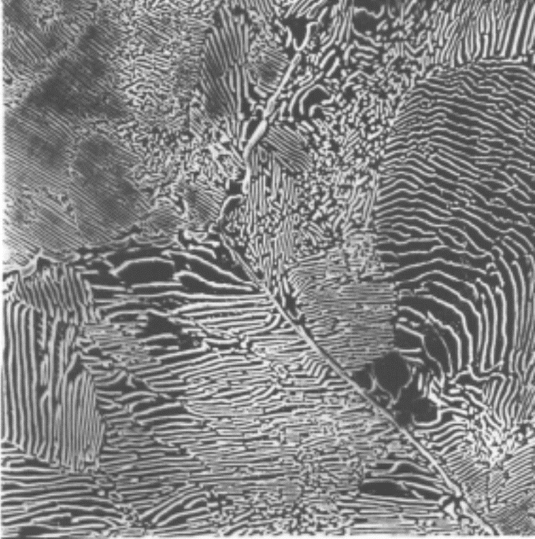

## Materials Science Lecture - Phases and Microstructure in the Iron-Carbon System
Prof. Dr.-Ing.  Christian Willberg 

Contact: christian.willberg@h2.de

---

<!--paginate: true-->

---

# Learning Objectives

After this lecture you will be able to:
- read and interpret the iron-carbon diagram
- identify phases and microstructural constituents
- understand cooling processes in the Fe-C diagram
- explain properties of steel and cast iron
- understand basic heat treatments
- justify material selection for technical applications

---

# Real Diagrams

---

## Real Diagrams
- previous diagrams were ideal diagrams and do not occur in reality
- Iron-Carbon Diagram (ICD) is the most important real diagram
- base metal is iron → steel or cast iron
- the ICD consists of ideal diagrams - the peritectic, eutectic and eutectoid partial diagrams

---

## Important Terms

**Eutectic**: Two-component mixture with lowest melting point
- simultaneous solidification of both components from the melt

**Eutectoid**: analogous to eutectic, but transformation in solid state
- simultaneous decomposition of a solid solution into two new phases

**Peritectic**: Reaction between solid phase and melt
- forms a new solid phase

---

# Iron-Carbon Diagram (ICD)

- most important phase diagram
- Iron is the most important material in mechanical engineering

Reasons are the properties of steel and cast iron:
- low cost
- high strength and elastic stiffness
- variety of possible alloys
- availability
- castability, weldability, etc.

[Explanation video for the Iron Carbon Diagram](https://www.youtube.com/watch?v=oJqvnKhnsg0&t=1s)

---

- Depending on the form of carbon, we distinguish between the stable Fe-C system, in which carbon appears as graphite, and the metastable Fe-Fe$_3$C system, in which carbon is bound as Fe$_3$C (intermediate phase cementite)

---

---

## Overview: Important Regions in the ICD

| Region | C-Content | Material | Significance |
|---------|----------|-----------|-----------|
| < 0.02% | very low | pure iron | technically rare |
| 0.02-2.06% | low-medium | **Steel** | **most important range** |
| 2.06-6.67% | high | **Cast Iron** | cast parts |

**Note**: The 2.06% boundary is the **maximum C-solubility in austenite** (Point E)

---

## Important Equilibrium Lines

ABCD 	Liquidus line			
AHJECF 	Solidus line			
ECF 		Eutectic line			
PSK 		Eutectoid line			
ES, PQ		Saturation lines				
MOSK		Curie line
QPSECD 	Formation/dissolution Fe$_3$C	

---

## Points in the Phase Diagram
S - eutectoid point
C - eutectic point
G -	$\alpha$ / $\gamma$ - transformation point of pure iron
E -	Point of max. C-solubility in $\gamma$ - solid solution
P - Point of max. C-solubility in $\alpha$ - solid solution
etc. (see Fe-Fe$_3$C - diagram)

---

## Critical Points - Memory Aid

**A1-Line (723°C)**: Eutectoid - pearlite formation
**A3-Line (GOS)**: Ferrite/austenite transformation
**Acm-Line (ES)**: Cementite precipitation

**Remember**: 
- A1 = constant temperature (eutectoid)
- A3 = increases with decreasing C-content
- Acm = increases with increasing C-content

---

# Phases and Microstructure in the Iron-Carbon System
# Solid Solutions

---

---

---

## $\delta$-Solid Solution (bcc)
 - $\delta$-ferrite is only stable above 1392°C  
 - technically of minor importance
 - Max. C-solubility: 0.12 %

---

## $\gamma$-Solid Solution (fcc)

- Microstructure designation: Austenite
- precipitates above the G-S-E-line  
  - through alloying additions (Ni, Mn) and quenching also stable at room temperature (austenitic steels)

---

- non-magnetic, tough and hardenable by work hardening (manganese, nickel, chromium-nickel steels)
- high elevated temperature strength, good corrosion and scaling resistance
- Max. C-solubility: 2.06 %

---
## Austenite

- refers to the face-centered cubic modification (phase) of pure iron and its solid solutions
- high solubility of carbon atoms

---

## Properties of Austenite

**Mechanical**:
- Tensile strength: approx. 500-700 MPa
- Hardness: approx. 150-200 HB
- very tough and ductile

**Crystallographic**:
- face-centered cubic (fcc)
- larger interstitial sites → high C-solubility (up to 2.06%)

**Important**: Austenite is the starting phase for many heat treatments!

---

## $\alpha$-Solid Solution (bcc)
- Microstructure designation: Ferrite ($\alpha$-ferrite)
- purely ferritic microstructure has low hardness/strength, but high ductility (toughness)
- Max. C-solubility: only 0.02 % 

---

## Properties of Ferrite

**Mechanical**:
- Tensile strength: approx. 300 MPa
- Hardness: approx. 80 HB
- Elongation: approx. 40%

**Crystallographic**:
- body-centered cubic (bcc)
- Lattice parameter: a = 2.866 Å
- very small interstitial sites → low C-solubility

---

## Hardness / Strength

Strength 
- measure of maximum load-bearing capacity until failure
- force per cross-sectional area

Hardness 
- mechanical resistance against penetration by another body
- measure of wear resistance

---

## Comparison of Crystal Structures

| Property | Ferrite (bcc) | Austenite (fcc) |
|-------------|--------------|----------------|
| Temperature range | < 911°C | 911-1392°C |
| C-solubility | 0.02% | 2.06% |
| Packing density | 68% | 74% |
| Magnetism | ferromagnetic | paramagnetic |
| Ductility | medium | high |

---

## Intermediate Phase
Cementite (iron carbide Fe$_3$C); 6.67 mass-% C-content

---

## Metastable Systems

- Fe$_3$C is metastable
- Graphite is stable

---

## Why is Fe₃C Metastable?

**Thermodynamically**:
- Graphite has lower free enthalpy → more stable
- Fe₃C can decompose into graphite (at high temperatures or long time)

**Practically**:
- decomposition rate very slow at normal conditions
- Silicon accelerates graphite formation → cast iron
- Rapid cooling "freezes in" Fe₃C → steel

---

- Primary cementite:	
primary crystallization from the melt (line CD)

- Secondary cementite: 
precipitation from austenite (line ES)

- Tertiary cementite:	
precipitation from ferrite (line PQ)

---

## Crystal Structure

- orthorhombic unit cell 
  - twelve iron and four carbon atoms
  - carbon atoms are relatively irregularly surrounded by eight iron atoms

---

- Cementite is hard and brittle
- the majority of technical iron-carbon alloys solidify with formation of cementite

---

## Properties of Cementite

**Mechanical**:
- Hardness: approx. 800 HV
- very brittle (no plastic deformation)
- high wear resistance

**Chemical**:
- Formula: Fe₃C (6.67% C)
- high chemical stability
- orthorhombic crystal lattice

**Significance**: Cementite largely determines the hardness of steels!

---

---

# Phase Mixtures/Mixtures of Solid Solutions

---

## Pearlite 
- Microstructure of cementite and ferrite (= phase mixture)
- forms through "eutectoid" decomposition of austenite ($\gamma$-solid solution) with 0.8% C at 723°C
- eutectoid point S: 100% pearlite present here
- relatively high hardness, relatively high strength, poor formability, low toughness

---

---

- lamellar structure (layers of $\alpha$-solid solution and Fe$_3$C-crystals)
- often referred to as "pearlite stage", which - measured by lamellar spacing - is divided into pearlite, fine-striped and very fine-striped pearlite

---

## Pearlite Formation in Detail

**Eutectoid reaction at 723°C**:
$$\gamma_{0.8\%C} \rightarrow \alpha_{0.02\%C} + Fe_3C_{6.67\%C}$$

**Quantity ratio** (lever rule):
- approx. 88% ferrite
- approx. 12% cementite

**Lamellar spacing** determines properties:
- coarse pearlite: softer, tougher
- fine pearlite: harder, stronger

---

## Properties of Pearlite

**Mechanical**:
- Tensile strength: approx. 800 MPa
- Hardness: approx. 200-250 HB
- moderate ductility

**Microstructure**:
- Lamellar spacing: 0.1-1 µm
- Alternating lamellae: ferrite/cementite
- "Pearlite" because of pearlescent appearance under microscope

**Application**: Rails, wheels, high-strength components

---

## Ledeburite

- Microstructure of austenite and cementite or "decomposed" austenite and cementite (= phase mixture), carbon content 4.3%, melting temperature 1147°C 
- Eutectic point C: 100% ledeburite present here
- Distinction between ledeburite I (just below 1147°C)
  - microstructure of austenite and cementite

---

- Ledeburite II (room temperature)
  - consists of cementite I with crystallized secondary cementite (precipitated from austenite with decreasing temperature) and (with slow cooling) pearlite
  - Pearlite forms through eutectoid decomposition of austenite from ledeburite I at 723°C

---

- with faster cooling, bainite or with very fast cooling martensite can occur instead of pearlite
- Ledeburite is poorly formable, has very low ductility
- at room temperature fine mixture of Fe$_3$C-crystallites and pearlite regions visible in reflected light microscope as characteristic panther skin structure

---

---

## Ledeburite in Detail

**Eutectic reaction at 1147°C**:
$$Melt_{4.3\%C} \rightarrow \gamma_{2.06\%C} + Fe_3C_{6.67\%C}$$

**Properties**:
- very hard (>400 HB)
- extremely brittle
- not forgeable

**Occurrence**: 
- Cast iron with white solidification
- Chilled cast iron

---

## Overview of Microstructural Constituents

| Microstructure | Composition | Hardness [HB] | Formation |
|--------|----------------|------------|------------|
| Ferrite | α-solid solution | ~80 | Primary/from γ |
| Austenite | γ-solid solution | ~200 | at high T |
| Cementite | Fe₃C | ~800 | Primary/Secondary/Tertiary |
| Pearlite | α + Fe₃C | ~250 | eutectoid, 723°C |
| Ledeburite | γ/α + Fe₃C | >400 | eutectic, 1147°C |

---

# Phases and Microstructure in Non-Equilibrium State

- Equilibrium states are dominated by diffusion processes
- with faster temperature changes, carbon diffusion required for decomposition of austenite is hindered
- This also creates novel microstructural constituents that no longer correspond to the equilibrium state
- leads to "forcibly dissolved" carbon

## Do not appear in the phase diagram!

---

## Why Non-Equilibrium Microstructures?

**Problem**: Diffusion requires time
- With rapid cooling no time for C-diffusion
- Austenite cannot decompose into ferrite + cementite
- Carbon becomes "forcibly dissolved"

**Result**: New microstructural constituents
- Martensite (very rapid cooling)
- Bainite (medium cooling rate)
- Intermediate stage (between bainite and pearlite)

---

## Martensite
- body-centered lattice tetragonally distorted ("strained ferrite lattice")
- mostly fine-needle, very hard and brittle microstructure
- carbon forcibly dissolved in the bcc lattice of $\alpha$-Fe distorts the lattice and expands it tetragonally ("diffusionless transformation")

---

- forms with very rapid cooling
- Carbon atoms have no time for diffusion and cannot form Fe$_3$C

---

[Shape Memory Alloys](https://www.youtube.com/watch?v=1goaBtgZqDY)

---

## Martensite Formation in Detail

**Mechanism**:
- diffusionless transformation (< 1 ms)
- coordinated lattice distortion
- begins at Ms-temperature (martensite start)
- ends at Mf-temperature (martensite finish)

**Ms-temperature decreases with C-content**:
- 0.2% C: Ms ≈ 450°C
- 0.8% C: Ms ≈ 200°C
- 1.4% C: Ms ≈ 50°C

**Critical cooling rate**: at least 200-300 K/s

---

## Properties of Martensite

**Mechanical**:
- Hardness: 600-900 HV (depending on C-content)
- very brittle (elongation < 2%)
- highest strength of all steel microstructures

**Structure**:
- needle-shaped or lath-shaped
- tetragonally distorted bcc lattice
- c/a-ratio increases with C-content

**Problem**: too hard and brittle for most applications
→ Tempering required!

---

## Bainite  

- unlike martensite formation, lattice transformation and diffusion processes are coupled here
- forms in the temperature range between pearlite and martensite stage at cooling rates (too low for martensite formation; too high for pearlite formation)

---
## Bainite  

- pure bainite can only be achieved by isothermal cooling, e.g. in austempering
- Advantageous where there is a risk of quench cracks during quenching and tempering
- Has very good strength and toughness properties

---

## Bainite in Detail

**Distinction**:
- Upper bainite (400-550°C): feathery
- Lower bainite (250-400°C): acicular

**Properties**:
- Hardness: 300-600 HV
- good combination of strength and toughness
- better than pearlite, tougher than martensite

**Formation**: isothermal transformation in TTT diagram

---

## Time-Temperature-Transformation Diagram (TTT)

**Purpose**: 
- Prediction of microstructure formation at different cooling rates
- important for heat treatment

**Components**:
- Pearlite stage (top)
- Bainite stage (middle)
- Martensite formation (bottom)
- Ms and Mf lines

**Application**: Determination of cooling rates for desired microstructure

---

## Comparison of Non-Equilibrium Microstructures

| Microstructure | T-Range | Cooling Rate | Hardness | Toughness |
|--------|-----------|------------|-------|-----------|
| Pearlite | >723°C | slow | low | medium |
| Bainite | 250-550°C | medium | medium-high | good |
| Martensite | <Ms | very fast | very high | low |

**Note**: Faster cooling → harder, more brittle microstructure

---

---

# Practical Application: Reading the ICD

---

## Example 1: Steel with 0.4% C

**Task**: Which phases and microstructures are present at 900°C and at 20°C?

**At 900°C** (above A3):
- purely austenitic (γ-solid solution)

**At 20°C** (slow cooling):
- hypoeutectoid (< 0.8% C)
- Microstructure: Ferrite + Pearlite

---

## Example 2: Steel with 1.2% C

**Task**: Which phases and microstructures at room temperature?

**Analysis**:
- hypereutectoid (> 0.8% C)
- above 723°C: Austenite + secondary cementite
- below 723°C: Pearlite + secondary cementite

---
**Applying the leaver rule**

**Secondary cementite fraction** (at 723°C):
$$w_{Fe_3C} = \frac{1.2 - 0.8}{6.67 - 0.8} = \frac{0.4}{5.87} \approx 6.8\%$$

**Pearlite fraction**:
$$w_{Pearlite} = 100\% - 6.8\% = 93.2\%$$

---

# Iron-Carbon Alloy Designations

| Carbon Content (mass-%) | Designation | Type |
|-----------------------------|---------------------------|--------------------------------------|
| 0.02 < C < 0.8 | (Carbon) Steel | hypoeutectoid steels |
| C = 0.8 | (Carbon) Steel | eutectoid steels |
| 0.8 < C < 2.06 | (Carbon) Steel | hypereutectoid steels |
| 2.06 < C < 4.3 | Cast Iron | hypoeutectic cast irons |
| C = 4.3 | Cast Iron | eutectic cast irons |
| 4.3 < C < 6.67 | Cast Iron | hypereutectic cast irons |

---

---

# Steel

[Standards](https://moodle2.hs-magdeburg.de/moodle/mod/resource/view.php?id=332129)

- With increasing C-content, strength and hardenability of steel increase, while its elongation, forgeability, weldability and machinability (by cutting tools) decrease
- Corrosion resistance to water, acids and hot gases is practically not influenced by carbon
- For carbon contents below 0.25 mass-%, steels are easily weldable

---

## Steel Grades - Overview

**Classification by C-content**:
- Low alloyed: < 0.25% C (structural steels)
- Medium alloyed: 0.25-0.6% C (quenched & tempered steels)
- High alloyed: > 0.6% C (tool steels)

**Classification by alloying elements**:
- unalloyed: only Fe-C (< 5% alloying elements)
- low alloyed: 5-10%
- high alloyed: > 10% (e.g. stainless steel with 18% Cr)

---

## Structural Steels

**Properties**:
- C-content: 0.05-0.25%
- good weldability
- easily formable
- moderate strength

**Designation** (according to EN 10027):
- S235: structural steel, Rm = 235 MPa
- S355: structural steel, Rm = 355 MPa

**Applications**: Steel construction, containers, pipes, sheets

---

## Quenched and Tempered Steels

**Properties**:
- C-content: 0.25-0.6%
- hardenable and temperable
- high strength + toughness

**Designation**:
- C45: 0.45% C, unalloyed
- 42CrMo4: 0.42% C, with Cr and Mo

**Applications**: 
- Mechanical engineering: shafts, gears
- Automotive: connecting rods, axles

---

## Tool Steels

**Properties**:
- C-content: 0.6-1.5%
- very high hardness
- high wear resistance
- often alloyed (Cr, W, V, Mo)

**Examples**:
- C100: 1.0% C (files, saw blades)
- X210Cr12: 2.1% C, 12% Cr (cutting tools)
- High-speed steel (HSS): with W, Mo, V

**Applications**: Cutting tools, dies, punches

---

## Stainless Steels

**Definition**: At least 10.5% Cr for passive layer

**Important types**:
1. **Ferritic**: 13-17% Cr, low C
   - magnetic, not hardenable
   
2. **Austenitic**: 18% Cr, 8% Ni (18/8)
   - non-magnetic, not hardenable
   - very corrosion-resistant (X5CrNi18-10)

3. **Martensitic**: 12-17% Cr, 0.1-0.6% C
   - hardenable, magnetic

---

## Influence of Alloying Elements

| Element | Effect | Example |
|---------|---------|----------|
| Cr | Hardenability, corrosion protection | Stainless steel |
| Ni | Toughness, austenite former | Stainless steel 18/8 |
| Mo | Elevated temp. strength, hardenability | Q&T steels |
| W | Elevated temp. strength, hardness | High-speed steel |
| V | Grain refinement, hardness | Tool steels |
| Mn | Hardenability, strength | Wear-resistant steel |
| Si | Strength, oxidation protection | Spring steel |

---

## Steel Designation According to DIN EN 10027

**Short name system**:

**Example 1**: S235JR
- S = structural steel
- 235 = minimum yield strength in MPa
- JR = impact energy at 20°C

**Example 2**: C45
- C = unalloyed steel
- 45 = average C-content × 100 (0.45%)

**Example 3**: X5CrNi18-10
- X = high alloyed
- 5 = C-content × 100 (0.05%)
- CrNi = main alloying elements
- 18-10 = contents in % (18% Cr, 10% Ni)

---

## Mechanical Properties of Steels

**Dependence on C-content** (unalloyed, normalized):

| C-Content | Rm [MPa] | Rp0.2 [MPa] | A [%] | Hardness [HB] |
|----------|----------|-------------|-------|------------|
| 0.1% | 380 | 220 | 30 | 120 |
| 0.4% | 650 | 380 | 20 | 200 |
| 0.8% | 850 | 450 | 10 | 250 |
| 1.2% | 900 | 480 | 5 | 270 |

**Note**: Higher C → harder & stronger, but more brittle!

---

# Cast Iron

---

A distinction is made between:

- gray cast iron (grey iron), in which carbon appears as graphite. _Fracture surfaces appear gray_
- white cast iron, in which carbon appears as carbide in the form of cementite (Fe$_3$C). _Fracture surfaces are white_

---

## Why Graphite in Cast Iron?

**Conditions for graphite formation**:
1. High C-content (> 2.06%)
2. Silicon addition (1.5-3.5%)
3. Slow cooling
4. Inoculation (nucleation seeds)

**Reaction**:
$$Fe_3C \rightarrow 3Fe + C_{Graphite}$$

**Advantage**: Graphite improves castability and damping

---

## White vs. Gray Cast Iron

**White Cast Iron**:
- rapid cooling and little/no Si
- Carbon as Fe₃C
- very hard and brittle
- difficult to machine

**Gray Cast Iron**:
- slow cooling and Si addition (> 2%)
- Carbon as graphite
- easily machinable
- good damping

---

---

# Classification and Properties

---

## Cast Iron with Lamellar Graphite

- simplest and most common type of cast iron is cast iron with lamellar graphite

- Graphite appears as thin, irregularly shaped lamellae

---

## Cast Iron with Lamellar Graphite (GJL)

- Lamellae act as notches under tensile load, therefore tensile strength is relatively low due to notch effect
- Compressive strength is about 4 times higher than tensile strength

---

- brittle material
- good thermal conductivity
- advantageous self-lubricating properties
  - when lamellae are cut during machining and graphite itself or other lubricants can be "stored" in the cavities

---

## Properties of GJL in Detail

**Mechanical**:
- Tensile strength: 150-350 MPa
- Compressive strength: 600-1400 MPa
- no elongation (brittle)

**Designation**: GJL-250
- GJ = cast iron (German: Gusseisen)
- L = lamellar graphite
- 250 = minimum tensile strength in MPa

**Applications**: Engine blocks, machine frames, brake discs

---

## Cast Iron with Spheroidal Graphite (GJS)

- Better mechanical properties than cast iron with lamellar graphite
- shows ductile behavior

---

## Production of GJS

**Treatment**:
- Inoculation of melt with magnesium or cerium
- Mg reacts with sulfur and oxygen
- Graphite crystallizes spherically instead of lamellar

**Effect**:
- no more notch effect
- ductile behavior possible
- higher strength and toughness

---

## Properties of GJS

**Mechanical**:
- Tensile strength: 350-800 MPa
- Elongation: 2-18%
- Yield strength: 220-600 MPa

**Designation**: GJS-400-18
- GJS = cast iron with spheroidal graphite
- 400 = minimum tensile strength in MPa
- 18 = minimum elongation in %

**Applications**: Crankshafts, turbine wheels, wind turbines

---

## Comparison GJL vs. GJS

| Property | GJL | GJS |
|-------------|-----|-----|
| Graphite form | Lamellae | Spheres |
| Rm [MPa] | 150-350 | 350-800 |
| A [%] | 0 | 2-18 |
| Ductility | brittle | ductile |
| Price | cheap | more expensive |
| Damping | very good | good |
| Application | Frames, housings | Shafts, components |

---

## Comparison of Cast Iron and Steel 

[Qualitative reading](https://capablemachining.com/de/Blog/Stahl-vs.-Gusseisen-ein-umfassender-Vergleich/)

- Density $7.2\frac{g}{cm^3}$ vs. $7.85\frac{g}{cm^3}$ 
- Melting temperature $1150 °C$
- more corrosion-resistant than steel
- more brittle than steel
- Shrinkage is only about 1%

[Quantitative](https://www.schweizer-fn.de/festigkeit/festigkeitswerte/guss/stahlguss_start.php)

---

## Steel vs. Cast Iron 

**Steel**:
- Mass fraction of carbon less than 2.06%
- high tensile strength
- more expensive than cast iron
- more ductile and tougher than cast iron
- weldable
- higher melting point than cast iron

---

## Steel vs. Cast Iron 

**Cast Iron**:
- Mass fraction of carbon over 2.06%
- good castability (low melting point, fluid melt, …)
- hard and brittle
- Machinability of cast iron depends on the specific grade
  - for cast iron with lamellar graphite - the most common grade - it is good
  - strength is lower than cast steel, damping is higher
- Many grades contain additional silicon, which improves castability, as well as other alloying additions such as manganese, chromium or nickel

---

## Material Selection: When to Use Which Material?

**Choose cast iron** when:
- complex geometries to be cast
- good damping required (machine frames)
- compressive loading dominates
- good machinability important
- keeping costs low

**Choose steel** when:
- high tensile strength and toughness required
- weldability important
- plastic deformation desired

---

## Practical Application Examples

| Component | Material | Justification |
|---------|-----------|------------|
| Engine block | GJL, GJV | Damping, thermal conductivity, costs |
| Crankshaft | GJS, Steel | Cyclic loading, strength |
| Machine frame | GJL | Damping, castability, costs |
| Gear | Case-hardened steel | hard surface + tough core |
| Structural beam | S355 | Weldability, tensile strength |
| Cutting tool | Tool steel | high hardness, wear resistance |

---

## Summary: Important Microstructural Constituents

- **Ferrite**: soft, ductile, low C
- **Austenite**: fcc, high C-solubility, starting phase
- **Cementite**: Fe₃C, very hard, brittle
- **Pearlite**: Ferrite + Cementite, lamellar, eutectoid
- **Ledeburite**: Austenite/Pearlite + Cementite, eutectic
- **Martensite**: supersaturated with C, very hard
- **Bainite**: intermediate stage, good properties

---

## Summary: Material Groups

**Steels** (C < 2.06%):
- Structural steels (C < 0.25%): weldable, formable
- Q&T steels (0.25-0.6%): hardenable, versatile
- Tool steels (> 0.6%): very hard, wear-resistant

**Cast Irons** (C > 2.06%):
- GJL: cheap, easily cast, brittle
- GJS: ductile, high strength, versatile
- GJV: compromise, special applications

---

## Thank You for Your Attention!

**Questions?**

Contact: christian.willberg@h2.de
