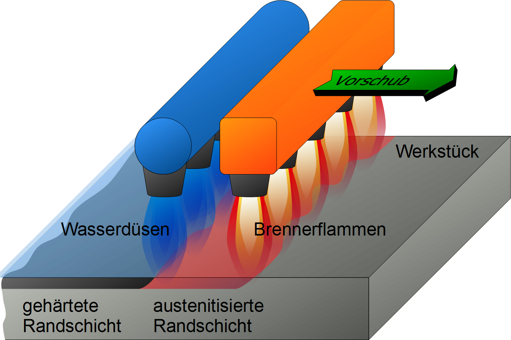

## Lecture Materials Science - Heat Treatment
Prof. Dr.-Ing.  Christian Willberg 

 
    <a href="https://wiki.arnold-horsch.de/images/3/36/Flamm-1.png" style="color: blue;">Image Reference</a>

Contact: christian.willberg@h2.de

---

<!--paginate: true-->

---

# Learning Objectives

After this lecture, you will be able to:
- name and explain the most important heat treatment processes
- distinguish between annealing and hardening processes
- read and interpret TTT diagrams

---

## Heat Treatment - Definition

**Heat treatment** is the targeted modification of material properties through controlled temperature management

**Main processes**:
- Annealing processes (slow cooling)
- Hardening processes (rapid cooling)

**Characterization**:
- Type of heating
- Holding temperature
- Holding time
- Type of cooling (furnace, air, oil, water cooling)

---

# Main Groups According to DIN 8580

- Primary forming (shape creation, establishing cohesion)
- Forming (shape change without material removal, maintaining cohesion)
- Separating (shape change by dividing or material removal, reducing cohesion)
- Joining (connecting workpieces, increasing cohesion)
- Coating (application of thin layers)
- **Changing material properties (e.g., by influencing crystal structure)**

---

## Basic Principle of Heat Treatment
Initial State
--> Heating
--> Holding at T
--> Cooling
--> Final State

**Important**: The cooling rate significantly determines the resulting microstructure!

---

# Why Heat Treatment?

---

## Objectives of Heat Treatment

**Improving mechanical properties**:
- Improving machinability (soft annealing)
- Improving mechanical properties (tempering of steel, precipitation hardening of Al alloys)
- Reducing wear (case hardening of gears)
- Hardening of tools

---

## Objectives of Heat Treatment (2)

**Optimizing microstructure and stresses**:
- Elimination of work hardening (recrystallization annealing)
- Relief of casting or welding stresses (stress relief annealing)
- Grain size adjustment (normalizing or coarse grain annealing)
- Homogenization (diffusion annealing)

---

## Economic Significance

**Why is heat treatment important?**

- Enables mass production of complex components
- Cost-effective property adjustment
- Extension of service life
- Enables lightweight construction through higher strengths

**Example**: A tempered gear can withstand 3-5× more load than an untreated one!

---
# Residual Stresses
## Definition and Formation
- **Residual stresses**: Stresses without external loading
- Self-equilibrating stress states in the material
- **Causes**:
  - Thermal processes (welding, hardening, uneven cooling)
  - Mechanical processing (forming, grinding, rolling)
  - Phase transformations (e.g., martensite formation with volume change)
  - Plastic deformation with gradients

---

## Effects
- **Positive**: Compressive residual stresses increase fatigue strength
- **Negative**: Tensile residual stresses promote crack initiation and growth
- Influence distortion, dimensional accuracy, and corrosion behavior

## Classification by Range
- **Type I**: Over multiple grains (macroscopic)
- **Type II**: Over one grain (between phases/grains)
- **Type III**: Over few atomic distances (microscopic)

---
# Strengthening Mechanisms

## Basic Principle
- Strengthening = Impediment of dislocation movement
- Higher strength by increasing critical shear stress
- Various mechanisms act simultaneously

---

# Main Strengthening Mechanisms (1)

**Work Hardening**
- Multiplication of dislocations through plastic deformation
- Dislocations impede each other
- Increases strength, reduces ductility

**Solid Solution Strengthening**
- Foreign atoms (C, Mn, Si) distort the lattice
- Lattice distortions as obstacles for dislocations
- Interstitial or substitutional positions

---

# Main Strengthening Mechanisms (2)

**Grain Boundary Strengthening (Hall-Petch)**
- Grain boundaries as dislocation barriers
- Finer grain → higher strength + toughness
- Only mechanism that improves both

**Precipitation Hardening**
- Small particles (carbides, nitrides) as obstacles
- Dislocations must cut through or bypass

**Martensitic Hardening**
- Supersaturated, strained lattice structure
- Very high strength through forced carbon solution

---

## Overview of Heat Treatment Processes

| Process | Temperature | Cooling | Main Objective |
|---------|------------|---------|----------------|
| Stress relief annealing | 550-650°C | slow | Stress reduction |
| Soft annealing | around Ac₁ | slow | Softening |
| Normalizing | above Ac₃ | air | Grain refinement |
| Hardening | above Ac₃ | fast | Increase hardness |
| Tempering | 150-650°C | air | Increase toughness |
| Quenching & tempering | Hardening + Tempering | combined | Strength + Toughness |

---

---

| Process | Temperature | 
|---------|------------|
| Stress relief annealing | 550-650°C | 
| Soft annealing | around Ac₁ |
| Normalizing | above Ac₃ |
| Hardening | above Ac₃ | 
| Tempering | 150-650°C |
| Quenching & tempering | Hardening + Tempering | 

---

# Annealing Processes

---

## Annealing - Basic Principle

**Definition**: Slow cooling to achieve an equilibrium or near-equilibrium state

**Common features**:
- Controlled heating
- Defined holding time
- Slow cooling (usually in furnace)
- Approach to equilibrium microstructure

**Objective**: Soft, easily formable or machinable states

---

## Overview of Annealing Processes

**Ordered by temperature**:

| Process | T-Range | Position to Ac₁/Ac₃ |
|---------|---------|---------------------|
| Stress relief annealing | 550-650°C | below Ac₁ |
| Recrystallization annealing | 500-700°C | below Ac₁ |
| Soft annealing | around Ac₁ | around Ac₁ |
| Normalizing | above Ac₃ | above Ac₃ |
| Coarse grain annealing | 950-1100°C | well above Ac₃ |
| Diffusion annealing | 1100-1300°C | very high |

---

## Stress Relief Annealing

**Application**:
- After welding
- After machining
- After casting
- After forming

**Examples**:
- Welded structures
- Castings
- Large machine parts

---

## Stress Relief Annealing

**Process**:
- Slow heating to 550 - 650 °C (below Ac₁)
- Holding time 2 - 4 h
- Slow cooling (furnace cooling)

**Objective**:
Reduction of internal stresses (residual stresses) without significant change in other properties

---

## Mechanism of Stress Relief Annealing

**What happens?**

1. At elevated temperature: Yield strength decreases
2. Local plastic deformation becomes possible
3. Stress peaks are reduced
4. Residual stresses ≈ 0

**Important**: 
- No phase transformation (below Ac₁)
- Microstructure remains unchanged
- Only stress relaxation

---

## Recrystallization Annealing

**Application**:
- After cold working (rolling, drawing, bending)
- Reversing work hardening
- Restoring formability

**When necessary?**
- Before further forming
- When ductility is important
- Components that are too heavily work-hardened

---

## Recrystallization Annealing - Process

**Temperature range**:
- Recrystallization temperature for steel: 500 - 600°C
- Hold for 0.5 - 2 h
- Slow cooling

**Caution**: 
- With too long holding time: Coarse grain formation
- With too low temperature: Incomplete recrystallization

---

## Recrystallization - Mechanism

**Process in 3 steps**:

1. **Recovery**: Dislocation reduction, rearrangement to lower-energy configurations
2. **Recrystallization**: Nucleation of new grains, growth at expense of deformed regions
3. **Grain growth**: Enlargement of new grains

**Result**:
- Soft, easily formable microstructure
- Strain-free grains
- Reduction of residual stresses

---

## Mechanism of Solid-State Recrystallization

## How Does Rearrangement Work Without Melting?
- **Diffusion in the solid state** enables atomic movement
- Elevated temperature (0.4-0.6 × melting temperature) activates diffusion
- Driving force: **Energy difference** between deformed and undeformed material

---

## Nucleation and Growth
- Nuclei form preferentially:
  - At grain boundaries of old grains
  - In regions with high dislocation density
  - At twin boundaries or sub-grain boundaries
- New grains grow through grain boundary migration
- Grain boundary moves toward more heavily deformed material
- New grains can form within old grains (especially with strong local deformation)

---

## Comparison: Cold Worked vs. Recrystallized

| Property | Cold Worked | After Recryst. |
|----------|-------------|----------------|
| Tensile strength | high (+40%) | medium |
| Yield strength | high | low |
| Elongation at break | low (5%) | high (30%) |
| Hardness | high | low |
| Formability | poor | good |

**Note**: Recrystallization makes the material soft and formable again!

---

## Soft Annealing

**Objective**:
- Producing a soft state
- Improving machinability
- Improving cold formability
- Cementite particles are spheroidized (GKZ annealing = Globular-Cementite)

**Application**:
- Before machining
- Before cold forming

---

## Soft Annealing - Process

**Temperature**:
- Around Ac₁ (below, above, or oscillating around Ac₁)
- Typical: 680-720°C

**Cooling**:
- Very slow furnace cooling (10-20 K/h)

**Holding time**:
- Several hours (2-10 h)

---

## Soft Annealing - Microstructure Change

**Initial microstructure** (e.g., after forging):
- Ferrite + lamellar pearlite
- Hardness: approx. 200-250 HB

**After soft annealing**:
- Ferrite + spherical cementite inclusions (GKZ)
- Hardness: approx. 150-180 HB

**Advantage**: 
- 30-40% easier machining
- Higher tool life

---

## Transformation Process
- Lamellar pearlite is **not thermodynamically stable**
- High interfacial energy between many ferrite/cementite lamellae
- **Diffusion of carbon** at elevated temperature
- Cementite lamellae "spheroidize" → **Spherical cementite (globulite)**
- Ferrite forms continuous matrix

## Result
- Minimal interface (sphere has smallest surface/volume ratio)
- Significantly softer and better machinability
- **No phase transformation** - remain in α+Fe₃C, only morphology changes!

---

## Normalizing

**Objective**:
- Producing a uniform and fine-grained microstructure
- Approaching equilibrium state
- Elimination of coarse grain
- "Normalization" of microstructure

**Application**:
- After forging or rolling
- After casting
- Preparation for further heat treatment

---

## Normalizing - Process

**Temperature**: 
- 30-50°C above Ac₃ (hypoeutectoid)
- 30-50°C above Acm (hypereutectoid)

**Heating**: 
- Rapid between Ac₁ and annealing temperature
- Short holding time (15-30 min)

**Cooling**: 
- Rapid cooling through two-phase interval
- Then slow cooling (air)

---

## Normalizing - Double Recrystallization

**1. Recrystallization during heating**:
- Ferrite + pearlite → austenite
- New austenite grains form

**2. Recrystallization during cooling**:
- Austenite → ferrite + pearlite
- New, fine ferrite and pearlite grains

**Result**: 
- Fine, uniform microstructure
- Improved mechanical properties
- Frequently used standard process

---

## Recrystallization Annealing vs. Normalizing

## Recrystallization Annealing
- **Temperature**: Below A1 (~723°C), typically 550-650°C
- **Initial state**: Cold-worked material (many dislocations)
- **Mechanism**: Solid-state diffusion in ferrite/existing phases
- **Driving force**: Deformation energy (dislocations)
- **Result**: New, low-dislocation grains in same phase
- **Objective**: Elimination of work hardening

---

## Recrystallization Annealing vs. Normalizing

## Normalizing
- **Temperature**: Above A3 (~900°C), in austenite region
- **Initial state**: Any (deformed or undeformed)
- **Mechanism**: Phase transformation α-ferrite → γ-austenite → α-ferrite
- **Driving force**: Thermodynamic equilibrium of phases
- **Result**: Completely new grain structure through transformation
- **Objective**: Homogeneous, fine-grained microstructure, stress relief

**Main Difference**
**Recrystallization** = New formation in existing phase
**Normalizing** = New formation through phase transformation

---

## Coarse Grain Annealing

**Objective**:
- Achieving a coarse grain
- Improving machinability 

**Why does this work?**
- Large grains → fewer grain boundaries
- Material break more easily at grain boundaries
- Better surface quality

**Caution**: Deteriorates mechanical properties!

---

## Coarse Grain Annealing - Process

**Temperature**: 
- Well above Ac₃ (950 - 1100°C)
- The higher, the stronger the grain growth

**Holding time**: 
- 1 to 2 h

**Cooling**:
- Slow furnace cooling
- Then faster air cooling

---

## Diffusion Annealing

- Elimination of local concentration differences (segregation)
- Homogenization of chemical composition
- Balancing of concentration gradients
- After casting
- For high-quality components
- Before important heat treatments

---

## Diffusion Annealing 

- **Temperature**: 
- High in austenite range (1100-1300°C)
- **Holding time**: 
- Very long (10-50 h)
- **Cooling**:
- Slow cooling

**Disadvantage**: Very energy-intensive and expensive!

---

## Diffusion in Iron

**Diffusion coefficient**:
$$D = D_0 \cdot e^{-Q/RT}$$

**For carbon in austenite**:
- At 900°C: D ≈ 10⁻¹¹ m²/s
- At 1200°C: D ≈ 10⁻¹⁰ m²/s

**Diffusion distance**: 
$$x \approx \sqrt{D \cdot t}$$

---

## Comparison of Annealing Processes

| Process | T [°C] | Time | Objective | Application |
|---------|--------|------|-----------|-------------|
| Stress relief | 550-650 | 2-4 h | Stresses ↓ | Welded parts |
| Recrystallization | 500-700 | 0.5-2 h | Soften | Formed parts |
| Soft annealing | around Ac₁ | 2-10 h | Machinable | Before processing |
| Normalizing | above Ac₃ | 0.5 h | Fine grain | Standard |
| Coarse grain | 950-1100 | 1-2 h | Machinable | Automatics |
| Diffusion | 1100-1300 | 10-50 h | Homogeneous | Castings |

---

# Time-Temperature-Transformation Diagrams (TTT)

---

## TTT Diagrams - Introduction

**Purpose**:
- Predicting microstructure formation under different cooling conditions
- Planning heat treatment processes
- Understanding phase transformations

**Types**:
1. Isothermal transformation (TTT-I)
2. Continuous cooling (TTT-C)

**Important**: Each steel has its own TTT diagram!

---

## Isothermal Transformation (TTT-I)

**Experimental procedure**:
1. Heat specimen to austenitizing temperature
2. Rapidly quench to target temperature (e.g., in salt bath)
3. Hold at constant temperature
4. Observe microstructure transformation

---

**Representation**:
- x-axis: Time (logarithmic)
- y-axis: Temperature
- Curves: Start and end of transformation

---

## TTT-I Diagram - Regions

1. **Pearlite stage** (650-550°C)
   - S-curves for pearlite formation
   - Coarse lamellar → fine lamellar pearlite

2. **Bainite stage** (550-250°C)
   - Upper and lower bainite
   - Longer transformation times

3. **Ms line** (approx. 200-350°C)
   - Start of martensite formation
   - Diffusionless, instantaneous

---

## Continuous Cooling (TTT-C)

**Experimental procedure**:
- Specimen from austenitizing temperature
- Continuously cool (various rates)
- Microstructure formation at different temperatures

**Difference from TTT-I**:
- Transformation occurs during cooling
- More realistic for practical applications
- Curves lie to the right of TTT-I

---

## Reading TTT-C Diagrams

**Important elements**:

1. **Cooling curves**: Different cooling rates
2. **Transformation lines**: Start/end of phase transformations
3. **Microstructure regions**: Ferrite, pearlite, bainite, martensite
4. **Hardness values**: At end of cooling curves
5. **Ms/Mf lines**: Martensite formation

---

## Critical Cooling Rate

**Definition**: 
Minimum cooling rate for complete martensite formation

**In TTT-C diagram**:
- Tangent to the "nose" of pearlite stage
- Faster → 100% martensite
- Slower → pearlite/bainite + martensite

**Influencing factors**:
- C content
- Alloying elements (Cr, Mo, Ni)
- Austenite grain size

---

## Quenching Media and Their Rates

| Medium | Cooling Rate (at 700°C) | Application |
|--------|-------------------------|-------------|
| Still air | ~30 K/s | Alloyed steels |
| Moving air | ~50 K/s | Thin-walled parts |
| Oil (20-80°C) | ~200 K/s | Standard |
| Water (20°C) | ~600 K/s | Unalloyed steels |
| Salt solution | ~800 K/s | Maximum hardness |

**Risk**: The faster, the higher the risk of cracking!

---

# Hardening Processes

---

[Hardness](https://en.wikipedia.org/wiki/Hardness) is the mechanical resistance that a material offers to the mechanical penetration of another body

HV - Vickers Hardness

---

## Hardening - Basic Principle

Rapid cooling from austenitizing temperature to form martensite

**Prerequisites**:
1. At least 0.3% carbon
2. Austenitizing (complete)
3. Cooling faster than critical rate

**Objective**: 
- Martensite formation
- Maximum hardness and strength

---

## Hardening Processes - Overview

- **Hardening after volume heating**
  - Through-hardening
  - Case hardening
- **Tempering**
- **Quenching and tempering** (hardening + tempering)
- **Surface hardening**
  - Flame hardening, induction hardening, laser hardening
- **Thermochemical processes**
  - Carburizing / case hardening
  - Nitriding / nitrocarburizing

---

## Hardening - Process Steps

**1. Austenitizing**:
- Heat to 30-50°C above Ac₃ (hypoeutectoid)
- Or 30-50°C above Ac₁ (hypereutectoid)
- Holding time: Complete austenite formation

**2. Quenching**:
- Rapid cooling (above critical rate)
- In water, oil, polymer, gas

**3. Optional: Tempering**:
- Reduction of brittleness
- Stress relief

---

## Austenitizing - Details

**Temperature selection**:

| Steel Type | T-Range | Typical |
|------------|---------|---------|
| Hypoeutectoid | Ac₃ + 30-50°C | 850-900°C |
| Hypereutectoid | Ac₁ + 30-50°C | 780-820°C |

**Holding time**:
- Rule of thumb: 1 min per mm wall thickness
- Minimum: 15 min
- Too short: Incomplete austenitizing
- Too long: Grain coarsening

---

## Why Different Temperatures?

**Hypoeutectoid steels (< 0.8% C)**:
- Above Ac₃ → fully austenitic
- No ferrite residues

**Hypereutectoid steels (> 0.8% C)**:
- Only above Ac₁ → austenite + residual cementite
- Residual cementite increases wear resistance
- Above Acm would lead to coarse grain

---

## Hardenability vs. Maximum Hardness

**Hardenability**:
- Ability to form martensite upon cooling
- Depends on: C content, alloying, grain size
- Measured as: Case hardening depth

**Maximum Hardness**:
- Maximum achievable hardness
- Mainly dependent on C content
- Formula (approximation): HV ≈ 1000 × (% C) + 200

**Note**: Alloying increases hardenability, not maximum hardness!

---

## Hardenability - Influencing Factors

**1. Chemical composition**:
- C content: Basic requirement
- Alloying elements: Shift TTT curves

**2. Austenite grain size**:
- Fine grain → lower hardenability
- Coarse grain → higher hardenability (but more brittle!)

**3. Austenitizing conditions**:
- Temperature
- Holding time
- Homogeneity

---

## Hardening After Volume Heating

**Prerequisites**:
- Carbon content of at least 0.3%
- Suitable component size

**Result**:
- **Through-hardening**: For small dimensions
  - Complete martensite formation throughout cross-section
- **Case hardening**: For large dimensions
  - Critical cooling rate only to certain depth
  - Core remains softer

**Maximum hardness depends solely on carbon content**

---

## Through-Hardening vs. Case Hardening

**Through-hardening**:
- Small cross-sections (< 10-20 mm)
- Core and surface equally hard
- Uniform properties

**Case hardening**:
- Large cross-sections
- Hard surface layer
- Tough core
- Hardness gradient from outside to inside

**Case hardening depth**: Distance from surface to 50% martensite

---

## Jominy End-Quench Test

**Principle**:
- Standardized test bar (Ø 25 mm × 100 mm)
- Quenched from below with water jet
- → Different cooling rates along length

**Evaluation**:
- Hardness measurement every 1.5 mm
- Hardness profile → hardenability curve
- Characteristic for each steel

**Benefit**: Prediction of case hardening depth

---

## Tempering

- Reduction of martensite brittleness
- Relief of residual stresses
- Adjustment of desired toughness

**Process**:
- Heat to 150-650°C
- Hold 1-2 h
- Slow cooling

---

## Tempering - Temperature Ranges

| Temperature | Microstructure | Hardness | Toughness | Application |
|-------------|----------------|----------|-----------|-------------|
| 150-250°C | Martensite + ε-carbide | Very high | Low | Cutting tools |
| 250-400°C | **AVOID!** | - | - | Temper embrittlement |
| 400-550°C | Martensite + Fe₃C | Medium | Medium | Springs |
| 550-650°C | Ferrite + Fe₃C | Low | High | Quenched & tempered steels |

**Note**: Higher tempering temperature → softer but tougher!

---

## Temper Embrittlement

**Problem**: 
- In range 250-400°C 
- Precipitation of carbides at grain boundaries
- Extreme embrittlement

**Mechanism**:
- Intergranular carbide precipitation
- Grain boundary weakening
- Intergranular fracture

**Prevention**: 
- Avoid this temperature range!
- Pass through quickly when heating/cooling

---

## Quenching and Tempering

**Definition**: 
Hardening + tempering at high temperatures (550-650°C)

**Result**:
- Microstructure: Tempered martensite (sorbitic structure)
  - Very fine distribution of ferrite + cementite
- Optimal combination of strength and toughness

**Typical values**:
- Tensile strength: 1000-1400 MPa
- Elongation at break: 10-15%
- Good dynamic load capacity

---

## Quenching and Tempering Example

**Material**: [42CrMo4 (quenched & tempered steel)](https://www.stauberstahl.com/werkstoffe/17225-werkstoff-datenblatt/)

**Heat treatment**:
1. Hardening: 850°C, 30 min, oil
2. Tempering: 580°C, 2 h, air

**Properties**:
- Rm = 720 (tempered: 800 - 1300) MPa; Rp0.2 = 550 MPa
- A5 = 10 - 13%

**Application**: Connecting rods, gears, ...

---

## Surface Hardening - Principle

**Objective**: 
- Hard and wear-resistant surface
- Tough, fracture-proof core

**Application**:
- Low and unalloyed steels with 0.3-0.7% C
- Crankshafts, journals, rolls, gears

**Advantage**:
- No through-hardening necessary
- Faster and more economical
- Optimal property combination

---

## Surface Hardening - Processes

**Available processes**:

1. **Flame hardening**: Acetylene-oxygen flame
2. **Induction hardening**: Electromagnetic heating
3. **Laser hardening**: Laser beam
4. **Electron beam hardening**: Electron beam
5. **Immersion hardening**: Partial immersion

**Common**: 
- Local surface heating
- Rapid quenching

---

## Flame Hardening

**Principle**:
- Acetylene-oxygen flame (approx. 3000°C)
- Moves over workpiece surface
- Quenching with water spray

**Advantages**:
- Simple and flexible
- Low investment costs
- Suitable for large components

---

**Disadvantages**:
- Difficult to automate
- Uneven heating possible

---

## Induction Hardening

[**Principle**](https://www.youtube.com/watch?v=ew48WuuQIVg):
- High-frequency alternating current in inductor
- Induced eddy currents heat surface
- Penetration depth depends on frequency

**Frequency and penetration depth**:
- 1-3 kHz: 3-5 mm (gears)
- 10-30 kHz: 1-3 mm (shafts)
- 100-400 kHz: 0.5-1.5 mm (bearing seats)

**Advantages**:
- Very easily automated
- Reproducible
- Fast

---

## Induction Hardening - Applications

**Typical components**:
- Crankshafts (bearing seats)
- Camshafts
- Gears (tooth flanks)
- Guideways
- Cylinder running surfaces

**Hardened zone**:
- 0.5-5 mm depth
- Hardness: 600-700 HV
- Defined contour possible

---

## Laser Hardening

**Principle**:
- Focused laser beam (CO₂ or diode)
- Very high energy density
- Self-quenching through heat conduction into interior

**Advantages**:
- Very precise
- Low distortion
- Complex geometries possible
- No quenching medium necessary

---

**Disadvantages**:
- High investment costs
- Limited penetration depth (0.5-2 mm)

---

## Comparison of Surface Hardening Processes

| Process | Penetration Depth | Speed | Costs | Automation |
|---------|-------------------|-------|-------|------------|
| Flame | 2-6 mm | Medium | Low | Difficult |
| Induction | 0.5-5 mm | Fast | Medium | Good |
| Laser | 0.5-2 mm | Fast | High | Very good |
| E-beam | 0.3-1 mm | Very fast | Very high | Good |

**Selection**: Depends on quantity, geometry, requirements

---

# Thermochemical Processes

---

## Thermochemical Treatment - Principle

**Definition**: 
Change in chemical composition of surface layer through diffusion at elevated temperature

**Processes**:
1. **Carburizing** (case hardening): C enrichment
2. **Nitriding**: N enrichment
3. **Nitrocarburizing**: N + C simultaneously
4. **Carbonitriding**: C + N at austenitizing temperature
5. **Boriding**: Boron enrichment (rare)

---

## Carburizing (Case Hardening)

**Initial problem**: 
- Low C contents (0.1-0.2%) cannot be hardened well

**Solution**: 
- Increase C content of surface layer to 0.7-0.9%
- Then harden

**Typical steels**:
- C10, C15 (unalloyed)
- 16MnCr5, 20MnCr5 (low alloyed)

---

## Carburizing - Process

**Process**:
1. **Carburizing** at 880-950°C in C-rich atmosphere
   - Duration: 0.5-3 h depending on desired depth
   - Case depth: 0.5-2 mm typical

2. **Hardening** by quenching

3. **Tempering** at 150-200°C

**Atmospheres**:
- Gas carburizing: CO, CH₄
- Pack carburizing: Charcoal
- Salt bath carburizing: Cyanide salts (obsolete)

---

## Carburizing - Diffusion Calculation

**Fick's law** (simplified):
$$x = k \cdot \sqrt{t}$$

**Practical**:
- 0.8 mm depth: approx. 2 h at 930°C
- 1.5 mm depth: approx. 6 h at 930°C
- 2.5 mm depth: approx. 16 h at 930°C

**Note**: Double depth → four times the time!

---

## Carbon Profile After Carburizing

**Typical profile**:
- Surface: 0.8-0.9% C
- Exponential drop inward
- Case depth: Defined as depth with 0.35% C

**Optimization**:
- Too much C (>0.9%): Retained austenite, network cementite
- Too little C: Insufficient hardness

**Carbon potential** of atmosphere must be controlled!

---

## Hardening After Carburizing

**Variants**:

1. **Direct hardening**: Directly from carburizing temperature
   - Fast, but risk of coarse grain
   
2. **Single hardening**: Cool down, then reheat + harden
   - Finer grain

3. **Double hardening**: 2× harden at different temperatures
   - Optimal for surface and core
   - Complex

---

## Case Hardening - Microstructure Buildup

**After carburizing + hardening + tempering**:

**Surface layer** (0-0.8 mm):
- 0.8% C
- Microstructure: Martensite + residual cementite
- Hardness: 700-800 HV

**Transition zone** (0.8-2 mm):
- C content decreases
- Microstructure: Martensite + bainite
- Hardness decreases

---

**Core**:
- 0.15% C
- Microstructure: Ferrite + pearlite
- Tough and ductile

---

## Case Hardening - Applications

- Gears (transmissions)
- Bearing journals
- Pins
- Shafts with bearing seats
- Cams

**Requirement**:
- High surface hardness (wear)
- High fatigue strength
- Tough core (fracture safety)

**Advantage**: Optimal property combination!

---

## Nitriding

**Principle**:
- Inward diffusion of nitrogen at 500-580°C
- Formation of very hard nitrides (Fe₄N, CrN, AlN)
- No phase transformation (below Ac₁)

**Steels**:
- Nitriding steels with Al, Cr, Mo (e.g., 34CrAlMo5)
- Unalloyed steels less suitable

**Atmosphere**:
- Gas nitriding: NH₃ (ammonia)
- Plasma nitriding: Ionized N₂

---

## Nitriding - Advantages

**Compared to case hardening**:

1. **Higher hardness**: Up to 1200 HV (nitriding zone)
2. **No quenching**: No distortion
3. **Good hot hardness**: Stable up to 500°C
4. **Corrosion resistance**: Improved
5. **No post-processing**: Final dimensions remain

**Disadvantages**:
- Very long process time (20-100 h)
- Only thin layers (0.1-0.8 mm)
- More expensive

---

## Nitriding - Surface Layer Structure

**Layer structure**:

1. **Compound layer** (outer, 5-20 µm)
   - γ'-Fe₄N, ε-Fe₂₃N
   - Very hard (900-1200 HV)
   - Brittle

2. **Diffusion layer** (0.1-0.8 mm)
   - Finely distributed nitrides in ferrite
   - 400-700 HV
   - Load-bearing

**Nitriding depth**: Usually 0.3-0.5 mm

---

## Comparison of Thermochemical Processes

| Process | T [°C] | Time | Depth [mm] | Hardness [HV] | Distortion |
|---------|--------|------|------------|---------------|-----------|
| Carburizing + hardening | 900-950 | 2-16 h | 0.5-2 | 700-800 | High |
| Nitriding | 500-580 | 20-100 h | 0.1-0.8 | 900-1200 | Minimal |
| Nitrocarburizing | 550-580 | 0.5-4 h | 0.1-0.3 | 600-900 | Minimal |
| Carbonitriding | 820-880 | 2-6 h | 0.1-0.8 | 700-900 | Medium |

---

## Process Selection (2)

**Nitrocarburizing**, when:
- Short process time important
- Medium requirements
- Cost important
- Corrosion protection desired

**Carbonitriding**, when:
- Medium case depth
- Less distortion than case hardening
- Faster than carburizing

---

## Defects and Prevention

**Hardening distortion**:
- Cause: Uneven heating/cooling
- Prevention: Preheating, fixation, correct medium

**Hardening cracks**:
- Cause: Too rapid cooling, residual stresses
- Prevention: Preheating, correct medium, immediate tempering

**Soft spots**:
- Cause: Local decarburization, incomplete austenitizing
- Prevention: Protective gas, sufficient time

---

## Preventing Hardening Cracks

**Measures**:

1. **Material selection**: Alloyed steels (slower quenchable)
2. **Preheating**: To 200-400°C before austenitizing
3. **Quenching medium**: Oil instead of water
4. **Immediate tempering**: After hardening (< 1 h)
5. **Design**: Avoid sharp edges, holes
6. **Hot bath**: Isothermal quenching

---

## Key Points on Hardening

- **Hardening**: Martensite formation through rapid cooling
  - At least 0.3% C required
  - Maximum hardness dependent on C content
  
- **Tempering**: Reduction of brittleness
  - Avoid 250-400°C (temper embrittlement)

- **Quenching and tempering**: Hardening + high tempering
  - Optimal strength + toughness

---

## Thank You for Your Attention!

**Questions?**

**Contact**: christian.willberg@h2.de