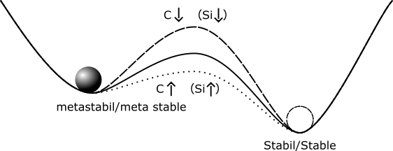

## Lecture on Materials Science -  Alloy (3/3)
Prof. Dr.-Ing. Christian Willberg
Magdeburg-Stendal University of Applied Sciences

Contact: christian.willberg@h2.de
Parts of the script are adopted from \
Prof. Dr.-Ing. Jürgen Häberle

---

<!--paginate: true-->

## Contents

---
# Real Diagrams

---

## Real Diagrams
- The diagrams discussed so far are ideal diagrams and do not represent reality.
- The Iron-Carbon Diagram (ICD) is the most important real diagram.
- The base metal is iron, forming steel or cast iron.
- The ICD is composed of ideal diagrams: peritectic, eutectic, and eutectoid sub-diagrams.

---

- Depending on the carbon appearance, we can distinguish between:
  - **Stable system Fe-C**: Carbon exists as graphite.
  - **Metastable system Fe-Fe₃C**: Carbon is bound in Fe₃C (intermediate phase cementite).
- Stable means the carbon in graphite form cannot decompose further, while Fe₃C decomposes into iron and temper carbon upon prolonged annealing.
- The metastable system represents a relative minimum of the system's total energy. For technical purposes, it is considered "sufficiently stable."

---

# Iron-Carbon Diagram (ICD)

- Most important phase diagram.
- Iron is the key material in mechanical engineering.

### Reasons:
- Low cost
- High strength and elastic stiffness
- Variety of possible alloys
- Availability
- Castability, weldability, etc.

[Explanation video for the Iron-Carbon Diagram](https://www.youtube.com/watch?v=oJqvnKhnsg0&t=1s)

---

---

## Important Equilibrium Lines

ABCD   - Liquidus line                
AHIECF - Solidus line                 
ECF    - Eutectic line                
PSK    - Eutectoid line               
ES, PQ - Saturation lines             
MOSK   - Curie line                   
QPSECD - Formation/Dissolution of Fe₃C

---

## Points in the Phase Diagram

- **S**: Eutectoid point
- **C**: Eutectic point
- **G**: $\alpha$ / $\gamma$ - Transformation point of pure iron
- **E**: Maximum C-solubility in $\alpha$-matrix
- **P**: Maximum C-solubility in $\gamma$-matrix

---

# Phases and Microstructures in the Iron-Carbon System
# Solid Solutions

---

---

## $\alpha$-Solid Solution (BCC)
- Microstructure designation: Ferrite ($\alpha$-Ferrite).  
- Pure ferritic microstructure has low hardness/strength but high ductility.  
- Maximum C solubility: 0.02%

---

- high ductility

---

## Hardness / Strength

**Strength**  
- Measure of maximum load-bearing capacity before failure.  
- Force per cross-sectional area.  

**Hardness**  
- Mechanical resistance to penetration by another material.  
- Measure of wear resistance.  

---

## $\delta$-Solid Solution (BCC)
- $\delta$-Ferrite is stable only above 1392°C.  
- Technically of minor importance.  
- Maximum C solubility: 0.12%.  

---

## $\gamma$-Solid Solution (FCC)

- Microstructure designation: Austenite.  
- Forms above the G-S-E line.  
- Can remain stable at room temperature with alloying additions (e.g., Ni, Mn) and quenching (austenitic steels).  

---

- Non-magnetic, tough, and hardenable through cold working (manganese, nickel, chromium-nickel steels).  
- High heat resistance, good corrosion and oxidation resistance.  
- Maximum C solubility: 2.06%.  

---

## Austenite

- Refers to the face-centered cubic (FCC) modification (phase) of pure iron and its solid solutions.  
- Exhibits high solubility for carbon atoms.  

---

## Intermediate Phase: Cementite (Iron Carbide Fe₃C)
- C content: 6.67 wt%.  

---

## Meta stable systems

---

**Types:**  
- **Primary Cementite:**  
  - Crystallizes directly from the melt (line CD).  
- **Secondary Cementite:**  
  - Precipitates from austenite (line ES).  
- **Tertiary Cementite:**  
  - Precipitates from ferrite (line PQ).  

---

## Crystal Structure

- Orthorhombic unit cell:  
  - 12 iron and 4 carbon atoms.  
  - Carbon atoms are irregularly surrounded by 8 iron atoms.  

---

- Cementite is hard and brittle.  
- Most technical iron-carbon alloys solidify with cementite formation.  

---

---

# Phase Mixtures / Solid Solution Mixtures

---

## Pearlite (Eutectoid)
- Microstructure of cementite and ferrite (= phase mixture).  
- Forms through the "eutectoid" decomposition of austenite ($\gamma$-solid solution) with 0.8% C at 723°C.  
- Point S: 100% pearlite.  
- Relatively high hardness and strength, low ductility.  

---

- Lamellar structure (layers of $\alpha$-ferrite and Fe₃C crystals).  
- Categorized into coarse, fine, and very fine pearlite based on lamellar spacing.  

---

## Ledeburite

- Microstructure of austenite and cementite or their decomposition products (pearlite and secondary cementite).  
- C content: 4.3%, melting temperature: 1147°C.  
- Point C: 100% ledeburite.  

---

- **Ledeburite I**: Austenite and cementite (above 723°C).  
- **Ledeburite II**: Pearlite, primary cementite, and secondary cementite (at room temperature).  
- Faster cooling may form bainite or martensite instead.  
- Properties: Very low ductility, characteristic "panther skin" pattern.  

---

The properties of the alloy (e.g., steel, cast iron) depend on the involved phases, their relative amounts, and their distribution in the microstructure.  

---

# Phases and Microstructures in Non-Equilibrium States

- Equilibrium states are dominated by diffusion processes.  
- Rapid temperature changes hinder the carbon diffusion required for the segregation of austenite.  
- This leads to the formation of novel microstructural components that deviate from the equilibrium state.  
- Results in "supersaturated" carbon.  

## NOT IN THE PHASE DIAGRAM!

---

## Martensite

- Body-centered tetragonal (BCT) lattice structure ("strained ferritic lattice").  
- Typically features a fine, needle-like, very hard, and brittle microstructure.  
- The carbon, trapped in the BCC lattice of $\alpha$-Fe, distorts and expands the lattice tetragonally through a "diffusionless transformation."  

---

- is formed in carbon steels by the rapid cooling (quenching) of the austenite 
- carbon atoms do not have time to diffuse out of the crystal structure in large enough quantities to form cementite (Fe3C). 

 
    <a href="https://artpictures.club/autumn-2023.html" style="color: blue;">Image Reference</a>

---

## Bainite  

- Unlike martensite formation, bainite involves both lattice transformations and diffusion processes.  
- Forms in the temperature range between the pearlite and martensite stages during cooling at rates that are too slow for martensite and too fast for pearlite.  

---

## Bainite Formation  

- Pure bainite can only be achieved through isothermal cooling, such as during austempering.  
- Preferred in cases where quenching and tempering could lead to cracking risks.  
- Offers excellent strength and toughness properties.  

---

## Iron-Carbon Alloy Designations  

| Carbon Content (mass-%) | Designation               | Type                                 |
|-------------------------|---------------------------|-------------------------------------|
| 0.02 < C < 0.8          | (Carbon) Steel            | Hypoeutectoid Steel                |
| C = 0.8                 | (Carbon) Steel            | Eutectoid Steel                    |
| 0.8 < C < 2.06          | (Carbon) Steel            | Hypereutectoid Steel               |
| 2.06 < C < 4.3          | Cast Iron                 | Hypoeutectic Cast Iron             |
| C = 4.3                 | Cast Iron                 | Eutectic Cast Iron                 |
| 4.3 < C < 6.67          | Cast Iron                 | Hypereutectic Cast Iron            |

---

## Steel Properties  

- Carbon content less than 2.06%.  
- High tensile strength.  
- More expensive than cast iron.  
- More ductile and tougher than cast iron.  
- Weldable.  
- Higher melting point than cast iron.  

---

## Cast Iron  

- Carbon content above 2.06%.  
- Excellent castability (low melting point, good fluidity, etc.).  
- Hard and brittle.  
- Machinability depends on the specific type:  
  - Grey cast iron with graphite lamellae is highly machinable.  
- Strength is lower than steel, but damping properties are superior.  
- Commonly contains silicon for improved castability and other alloying elements like manganese, chromium, or nickel.  

---

## Grey Cast Iron  

- Carbon is present as graphite, giving it a gray fracture surface.  
- Good thermal conductivity and damping properties.  
- Brittle but self-lubricating due to exposed graphite.  

---

## Nodular Cast Iron  

- Features better mechanical properties than grey cast iron.  
- Exhibits ductile behavior due to spherical graphite inclusions.  

---

## Vermicular Cast Iron  

- Intermediate properties between grey and nodular cast iron.  
- Challenging production due to narrow processing tolerances.  
- Higher strength, toughness, and reduced sensitivity to wall thickness compared to grey cast iron.  

---

---

### Comparison: Steel vs. Cast Iron  

| Property                | Steel               | Cast Iron          |
|-------------------------|---------------------|--------------------|
| Density                | $7.85 \frac{g}{cm^3}$ | $7.2 \frac{g}{cm^3}$ |
| Melting Point          | High (approx. $1500 °C$) | Low ($1150 °C$)       |
| Toughness              | High                | Low                |
| Corrosion Resistance   | Similar             | Slightly better    |
| Shrinkage Factor       | Low                 | Very low (1%)      |

---

## Comparison of Cast Iron Types

---

- **Grey Cast Iron**:  
  - The most common and simplest type of cast iron.  
  - Graphite is present in the form of thin, irregularly shaped lamellae.  
  - The graphite lamellae act as notches under tensile stress, which significantly reduces the tensile strength.  
  - However, it has high compressive strength and excellent damping properties.

---

- **Grey Cast Iron with Lamellar Graphite**  
  - Ductility and toughness are lower compared to other types of cast iron, but the material exhibits excellent heat conductivity.  
  - It has favorable self-lubricating properties when the graphite is exposed or when other lubricants are used in the cavities of the graphite.

---

### Nodular Cast Iron

- **Nodular (Ductile) Cast Iron**:  
  - This type features graphite in the form of spherical nodules, resulting in superior mechanical properties compared to grey cast iron.  
  - It behaves in a ductile manner and has enhanced tensile strength and toughness.  
  - This form of cast iron is also weldable and can be machined to a high degree.

---

### Vermicular Cast Iron

- **Vermicular Cast Iron**:  
  - Has properties between those of grey and nodular cast iron.  
  - Production is more difficult due to the specific requirements for melt treatment and controlled solidification.  
  - Benefits include higher strength and toughness, along with lower thermal expansion.  

---

## General Characteristics of Cast Iron Types:

| Type                   | Characteristics                       | Benefits                   |
|------------------------|---------------------------------------|----------------------------|
| **Grey Cast Iron**      | Graphite in lamellar form; brittle    | Good machinability, heat conductivity |
| **Nodular Cast Iron**   | Graphite in spherical nodules; ductile | High tensile strength, impact resistance |
| **Vermicular Cast Iron**| Intermediate properties; controlled graphite structure | Higher toughness, better casting properties |

---

## Properties of Cast Iron and Steel

| Property               | Cast Iron                            | Steel                     |
|------------------------|--------------------------------------|---------------------------|
| **Damping Capacity**    | High                                 | Low                       |
| **Compressive Strength**| High                                 | Moderate                  |
| **Tensile Strength**    | Low                                  | High                      |
| **Thermal Conductivity**| Good                                 | Lower than cast iron       |
| **Machinability**       | Good (in specific forms)             | Excellent in most forms    |
| **Weldability**         | Limited (except in nodular types)    | Excellent                 |

---

### Material Selection

- **Grey Cast Iron** is ideal for applications where damping capacity and castability are important, such as engine blocks and brake rotors.  
- **Nodular Cast Iron** is used where higher mechanical properties and toughness are required, for example in automotive and industrial applications like crankshafts and gear wheels.  
- **Vermicular Cast Iron** is often selected when a balance between strength and castability is necessary, often used in specific automotive and machinery components.

---  

## Stability of Carbon Systems in Iron Alloys

- **Stable Systems**: When the carbon is present in the form of graphite crystals, these systems are more likely to occur under the following conditions:  
  - Higher carbon content.  
  - Higher silicon content.  
  - Slower cooling rates.  
  - These systems typically occur in cast irons.

- **Metastable Systems**: These systems are characterized by cementite (Fe₃C) crystals, where the carbon is not in a free state and is instead chemically bound in the iron lattice.

