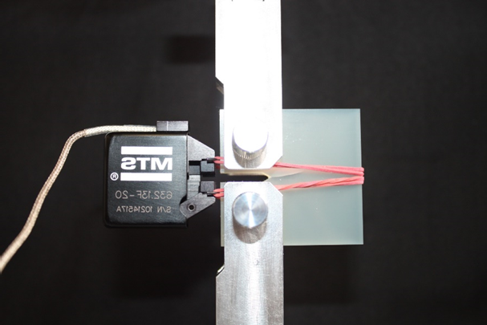
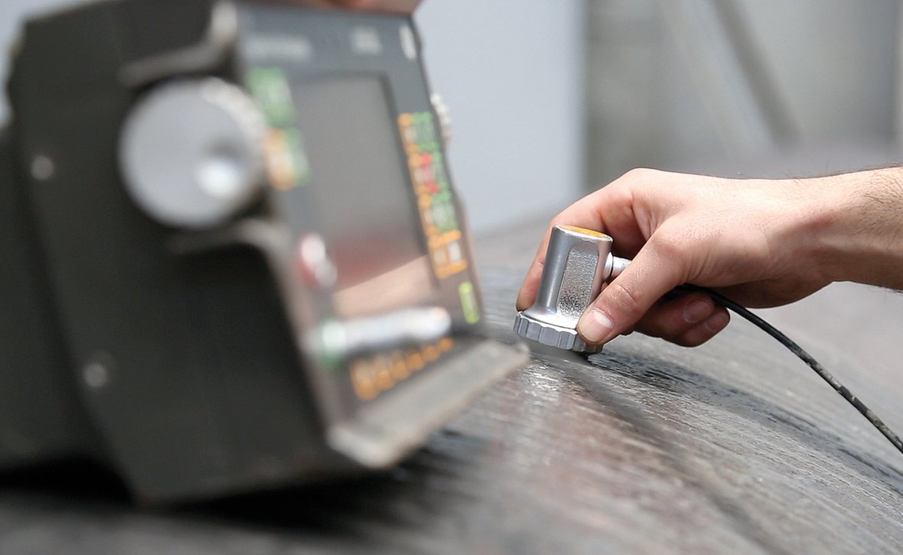
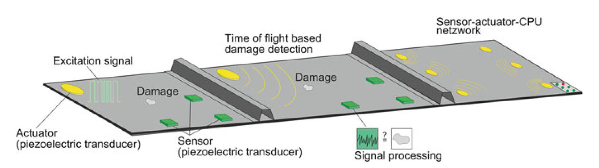

## Lecture - Materials Testing
Prof. Dr.-Ing. Christian Willberg 

Contact: christian.willberg@h2.de

---

# Contents

- What are models?
- Destructive Testing Methods
- Non-Destructive Testing Methods

---

# Models

What are models and why do we need them?

---

---

---

---

---

 
<iframe width="1150" height="500" src="https://www.youtube.com/embed/ClV2ojQPrFM?si=eROuZGPdBpXTnmef" title="YouTube video player" frameborder="0" allow="accelerometer; autoplay; clipboard-write; encrypted-media; gyroscope; picture-in-picture; web-share" referrerpolicy="strict-origin-when-cross-origin" allowfullscreen></iframe>

---

## 

---

# Destructive Testing

Certain characteristic values or statements about a material or component can only be made when loading until failure.

---

 
<iframe width="1150" height="500" src="https://www.youtube.com/embed/Bgsi3AK1ju4?si=fo49oLmLtqpfctKC&start=4" title="YouTube video player" frameborder="0" allow="accelerometer; autoplay; clipboard-write; encrypted-media; gyroscope; picture-in-picture; web-share" referrerpolicy="strict-origin-when-cross-origin" allowfullscreen></iframe>

---

## Excursion: Fracture Mechanics

- Fractures can be classified into these modes
- There are specific energy release rates

[List of experiments to determine these energies](https://wiki.polymerservice-merseburg.de/index.php/Pr%C3%BCfk%C3%B6rper_f%C3%BCr_bruchmechanische_Pr%C3%BCfungen)

---

## Determination of Toughness

- Resistance of a material against fracture or crack propagation
- Ability to absorb mechanical energy during plastic deformation

$Z = \int_0^{\varepsilon_{B}}\sigma d \varepsilon$ 

- Energy release rate $G = \frac{Z}{A_{fracture}}$
- Influence of loading rate

 
    <a href="https://doi.org/10.1007/s00466-021-02017-1" style="color: blue;">Image reference</a>

---

## Tensile Test
- Determination of:
  - elastic stiffnesses
  - strengths
  - yield point
  - in one direction

- constant stresses in the cross-section are assumed
$\sigma = \frac{F}{A} = E\varepsilon = E\frac{\Delta l}{l}$
$F = \frac{\Delta l E A }{l}$

---

## Specimen Geometry

[Video 1](https://eng.libretexts.org/Bookshelves/Materials_Science/TLP_Library_II/5%3A_Mechanical_Testing_of_Metals/5.5%3A_Tensile_Testing_-_Practical_Basics)

---

## Tensile Parameters

Elongation at break
  - permanent elongation of the tensile specimen after fracture

Elongation A11

Yield strength
  - limit up to which a material is elastically deformable

Technical proof stress
  - $R_{0.2}$ for materials where the yield point is not pronounced

Young's modulus
  - proportionality factor between stress and strain

---

Uniform elongation
  - specimen elongates uniformly up to maximum force

Reduction of area $Z=\frac{\Delta A}{A_0}$
  - a measure of the ductility of a material

Necking elongation
  - specimen only elongates in the necking region

---

## Compression Parameters

Yield point in compression
  - above this limit plastic deformation begins (ductile material)
  - in brittle materials cracks develop and then [fracture](https://youtu.be/Fjgpvi8igbE?si=ptlpAR_vQfDV_qYW&t=36)

Stability
  - buckling
  - [bulging](https://www.youtube.com/watch?v=ZYfLLozCNbw)
Deformation zones of a compressed specimen (Fig. 3.16)

---

## Compression Deformation

I - low deformation (friction inhibition)
II - moderate tensile deformation
III - high shear deformation

---

## Anisotropic Measurements
Anisotropy
- measurements at different angles

Influencing factors
  - slippage during clamping
  - temperature
  - geometry
  - specimen clamping

---

## Bending Test

- typically flat specimens with rectangular profile
- usually better for brittle materials
- assumptions of Bernoulli beam theory must be valid
- rather for brittle materials

$l>20*h$

$F$ - test force

$u$ - resulting displacement

$a$ - height of rectangular profile

$b$ - width of rectangular profile

$l_b$ - length of specimen

---

## Stress Distributions

 
<iframe width="1150" height="500" src="https://www.tec-science.com/wp-content/uploads/2021/03/de-animation-biegeversuch-spannungsverlauf-mit-verfestigung.mp4" title="Stress distribution" frameborder="0" allow="accelerometer; autoplay; clipboard-write; encrypted-media; gyroscope; picture-in-picture; web-share" referrerpolicy="strict-origin-when-cross-origin" allowfullscreen></iframe>

[Video](https://www.tec-science.com/wp-content/uploads/2021/03/de-animation-biegeversuch-spannungsverlauf-mit-verfestigung.mp4)

---

## 2-Point Bending Test

$E=\frac{4l_b^2 F}{ubh^3}$

---

## 3-Point Bending Test

$E=\frac{l_b^3 F}{4ubh^3}$

---

- Bending stress
  - $\sigma_b = \frac{M_b}{I_{xx}y}$
  - neutral axis of stress

- ENF (End-Notched Flexure) test specifically utilizes the neutral axis

---

## 4-Point Bending Test

Goal is a shear-free region and resulting constant bending moment

$E=\frac{l_a^2(2l_a+3l_b) F}{ubh^3}$

$l_a$ distance between support point and closer loading point of test stamp

---

## 4-Point Bending Test

 
<iframe width="1150" height="500" src="https://www.youtube.com/embed/dbawcyjAhSI?si=xmV3UskSfoAtHWHr&start=90" title="YouTube video player" frameborder="0" allow="accelerometer; autoplay; clipboard-write; encrypted-media; gyroscope; picture-in-picture; web-share" referrerpolicy="strict-origin-when-cross-origin" allowfullscreen></iframe>

---

## Fatigue Test according to Wöhler
- Test setup
  - bending test
  - torsion test
  - tension/compression test

---

## Fatigue Test according to Wöhler
Influencing factors
- temperature
- corrosive media
- notches
- surface finish
  - smooth surfaces are more favorable
- heat treatment

---

## Structural Fatigue Test

 
<iframe width="1150" height="500" src="https://www.youtube.com/embed/BOpBzKanX9k?si=icWRiGPNs-8H9qXo" title="Fatigue test" frameborder="0" allow="accelerometer; autoplay; clipboard-write; encrypted-media; gyroscope; picture-in-picture; web-share" referrerpolicy="strict-origin-when-cross-origin" allowfullscreen></iframe>

---

Challenges?

- representative loads
- heating due to too rapid loading
- the sequence of loads influences the service life

---

## Charpy Impact Test

- determination of impact energy and impact toughness $\frac{E}{A_{nominal}}$
  - no longer has technical significance
- energy is sufficient for determining material quality
- division into upper shelf (ductile fractures), lower shelf (brittle fractures) and transition region (mixed fractures)
- characteristic values not suitable for strength determination

[Explanatory video](https://www.youtube.com/watch?v=Ll69bzegoNY)

---

 
<iframe width="1150" height="500" src="https://www.youtube.com/embed/https://youtu.be/mpUdV2WHiEE?si=mKX8pxU3yLiWXwyp&start=86" title="YouTube video player" frameborder="0" allow="accelerometer; autoplay; clipboard-write; encrypted-media; gyroscope; picture-in-picture; web-share" referrerpolicy="strict-origin-when-cross-origin" allowfullscreen></iframe>

---

## Other Tests

- burst tests
- shear tests
- pull-out test
- corrosion tests
- burning tests

---

## Hardness Testing

- specimen or component is not completely destroyed
- conditionally non-destructive materials testing
- most common: Rockwell (HR), Brinell, Vickers and Shore
- hardness properties of the component surface influence fatigue and wear

---

## Rockwell

- the penetration depth $t$ is measured with various standardized test bodies
- test procedure is specified

$\text{Rockwell hardness}=a-\frac{t}{d}$
- scales A, C, D; $a=100$, $d=0.002mm$
- scales B, E-H, K; $a=130$, $d=0.002mm$
- scales N, T; $a=100$, $d=0.001mm$

---

## Brinell

- a hard metal ball is pressed onto the surface with a specified force

- an average diameter is determined

$\text{Brinell hardness}=\frac{0.204F}{\pi D \sqrt{D-\sqrt{D^2-d^2}}}$
with $d=\frac{d_1+d_2}{2}$

---

## Vickers
- similar to Brinell, but instead of a ball an equilateral diamond pyramid is used
- smaller area required compared to Brinell

$\text{Vickers hardness}=\frac{0.204F\cos 22°}{d^2}$

with $d=\frac{d_1+d_2}{2}$

---

# Non-Destructive Testing

Goals of non-destructive testing (NDT)

---
## Development Stages

NDT 1.0 – Tools (to sharpen the senses)
NDT 2.0 – Analog systems (for viewing inside components)
NDT 3.0 – Digital processing and automation
NDT 4.0 – Information transparency, technical & digital aids and autonomous and decentralized decisions

---

## Methods
- every measurable physical quantity can in principle be used

  - mechanical
  - optical
  - electromagnetic
  - electrical
  - thermal
  - magnetic

---

## Probability of Detection

- metric that indicates the probability of detecting a defect of a certain size

- the permissible defect size is known
- stated with 95% confidence. I.e., 90% of defects are detected with 95% certainty.

---

## Damage Size

- depending on the method, the detectable damage size varies
- it doesn't always apply that _small damage size_ $=$ _better_
- minimum damage $l = \frac{\lambda}{2}$ -> sampling theorem
$c = \lambda f$
- $c$ is the speed of light or sound

$\lambda = \frac{c}{f} = \frac{6000 m/s}{10^6 1/s} = 6 mm$

---

## Compromise

- small wavelength = higher resolution = greater interaction = smaller range

- large wavelength = lower resolution = less interaction = greater range

- 5G vs. 4G, FM vs. long wave, etc.

---

## Visual Inspection

- can be done with various tools and is very common
- direct visual inspection
  - eye
  - borescopes (elastoscopes, endoscopes, mirror tubes, ...)
- indirect visual inspection
  - cameras
  - drones

---

## Penetrant Testing

1. cleaning, 2. apply dye and let penetrate, 3. clean surface, 4. apply developer

- in daylight or in the dark

---

## Radiographic Testing

- X-ray, microwave, gamma radiation
- synchrotron radiation (special cases, rather rare)

- also usable as computed tomography

---

## Thermography
**active**
- component is warm and is measured
- differences in temperature distribution can be used to identify defects
- process adjustments are possible

**passive**
- component is excited and the response is measured
- inductive heating for carbon fiber composite components

---

## Modal Analysis

$\mathbf{M}\ddot{\mathbf{u}}+\mathbf{Ku}=\mathbf{0}$

- mode shapes
- natural frequencies

$(\mathbf{K}-\omega^2\mathbf{M})\hat{\mathbf{x}}=\mathbf{0}$

**Spring pendulum**
$m\ddot{u}+cu=0$

$c-\omega^2 m = 0$

$\omega = 2\pi f = \sqrt{\frac{c}{m}}$

---

## Modal Analysis

- excitation with a shaker or impulse hammer
- measurement points with acceleration sensor or laser
- one excitation point -> many measurement points
- many excitation points -> one measurement point

---

## Ultrasonic Testing

**Wave types**
Longitudinal waves (P waves)
Transverse waves (S waves)
Love waves
Rayleigh waves
Lamb waves, or guided ultrasonic waves
Symmetric, antisymmetric and shear waves
Torsional waves
Shear waves

---

---

## Symmetric Modes (Longitudinal waves)

<video controls="controls" width="600" src="../assets/Videos/asym.avi">

---

## Anti-Symmetric Modes (Transverse waves)

<video controls="controls" width="600" src="../assets/Videos/asym.avi">

---

## Sound Velocities
$c_{l}=\sqrt{\frac{E(1-\nu)}{\rho(1-\nu-\nu^2)}}$
$c_{t}= \sqrt{\frac{G}{\rho}}$

Guided ultrasonic waves are dispersive
they have a group and phase velocity

---

## Dispersion

- group velocity - how fast the envelope moves
- phase velocity - how fast the phase moves (single frequency)

- for one frequency, group and phase velocities are identical

- for frequency-dependent phase velocities, the envelope broadens -> dispersion

---

## Piezoelectric Effect

- actuator effect
- sensor effect
- $d_{31}$; electrical voltage in direction 3 and deformation in direction 1 or 2
- $d_{33}$; electrical voltage in direction 3 and deformation in direction 3

---

## Reflections at Interfaces
- acoustic impedance $W = c_L\rho$

_Reflected sound_
$\frac{p_{a,r}}{p_{a,e}}=\frac{W_2-W_1}{W_2+W_1}$

_Transmitted sound_
$\frac{p_{a,d}}{p_{a,e}}=\frac{2W_2}{W_2+W_1}$

---

## Calculation Exercise

-> water - steel
-> air - steel
-> water - aluminum
-> air - aluminum
-> water - PMMA
-> air - PMMA

---

## Signal-to-Noise Ratio

$SNR = \frac{P_{signal}}{P_{noise}}$

- multiple measurements reduce the noise component

---

## Measurement Setup

- 1 - 2 transducers
- measurement amplifier
- measurement sensor

  

 
    <a href="http://std-partners.de/fileadmin/_processed_/csm_STD_HP_Ultraschall_03_18_07ef793d11.jpg)" style="color: blue;">Image reference</a>

---

## Coupling the Test Head to the Surface

Water
- cheap
- easily automatable

Motor oil, grease
- already present in the component
- not optimized for testing

---

Glycerin, gel
- high viscosity and high acoustic impedance are advantageous
- rough surfaces and highly damping materials (weld seam testing)

Air
- saves coupling medium
- lots of noise

---

## Pulse-Echo Method

- "dead zone"
  - time for switching from transmitter to receiver

- dual sensor system
  - measurement on both sides
  - accessibility and effort

---

## Measurement Image

---

## Weld Seam Testing

- angle beam testing due to difficult coupling

## Adhesive Layers

- tested similarly
- there can be so-called "kissing bonds"

---

## Wall Thickness Measurement

---

## Imaging

- measurement data can be displayed in various ways

---

## A-Scan (amplitude)

- time of flight vs. amplitude
- at constant velocity, a defect in the signal can be detected for one point

---

## B-Scan (brightness)

- single point is just another representation of the A-scan (echo intensity is represented by brightness)
- by capturing the sound direction, 2D or 3D images can be generated

---

## C-Scan
- a projected image of the sizes of defects

---

## D-Scan

- planar scan

---

## Thickness Measurement using Guided Ultrasonic Waves

---

# Structural Health Monitoring

- monitoring of a structure during operation
- related to condition monitoring
  - e.g., gearbox monitoring -> detection of bearing damage

---

Goals:
Reduce maintenance costs
  - fewer repairs
  - simpler testing
  - timely maintenance
- load adjustment in case of damage
- extend service life
- increase safety

---

There are 4 levels.

---

Level 1

A system can determine that an event has occurred

Level 2

A system can determine that an event has occurred and where it took place

Level 3

A system can determine that an event has occurred, where it took place and what happened (type of event)

Level 4

A system can determine that an event has occurred, where it took place, what happened and how damaging this event is for the structure

---

## Methods

- modal analysis
- guided ultrasonic waves
- acoustic emission
- load path analyses
  - example: calculate parallel springs
- strain measurement
- model-based approaches

---

## Technical Applications

Bridges
- Second Penang Bridge - Penang, Malaysia
  

---
Pipelines

--- 

## Technical Applications

Aircraft
- load path analysis
- monitoring of connections
- safety is not the main focus in aviation

---

Wind Energy

---

## Modal Analysis

$(\mathbf{K}-\omega^2\mathbf{M})\mathbf{\hat{x}}=0$

- natural frequency $\omega=2\pi f$
- mode shapes $\mathbf{\hat{x}}$
  - [MAC](https://community.sw.siemens.com/s/article/modal-assurance-criterion-mac) criterion
  - angle calculation between mode shapes

---

$MAC=\frac{|\mathbf{\hat{x}}_i\mathbf{\hat{x}}_{i, ref}|^2}{(\mathbf{\hat{x}}_i\mathbf{\hat{x}}_{i, ref})(\mathbf{\hat{x}}_i\mathbf{\hat{x}}_{i, ref})}$

[Software](https://github.com/dagghe/pyOMA2?tab=readme-ov-file)

---

## Guided Ultrasonic Waves

- excitation via piezo composites
- reception with piezo composites or Fiber Bragg Gratings

---

[Damage interaction](../assets/Videos/flachbodenbohrung.avi)

---

## Challenges
- temperature
- humidity
- internal structure of the material
- mode conversion
- stresses in the structure
- aging

---
## Potentials
Aircraft example
- BVI (barely visible impact)
- size is defined by visibility
  - damage is larger on the tail than on the wing

- SHM systems allow smaller damages in the design

- estimated [1 - 5%](https://elib.dlr.de/123946/1/1475921718813279.pdf) structural mass could be reduced

---

## Microscopy

- analysis of the microstructure of materials
- local analysis of material or grain composition
- specimen preparation (grinding, surface treatment, etc.)
- light sources significantly influence the contrast
- filters

---

## Light Microscopy

- grain size analysis of metals and alloys
- area counting method
- line intercept method (grain boundary intersections with a line drawn by the examiner in the image)

---

## Scanning Electron Microscope
- uses electron beams for scanning
- resolution thereby significantly increased $1nm .. 2nm$
- approx. 500 times better magnification than light microscope (2000:1) vs. (1000000:1)

---

## Scanning Probe Microscopy

- scanning the structure with a needle
- interaction is not mechanical and differs depending on the microscope
  - tunneling current
  - Van der Waals forces (correlates with spring stiffness)
  - magnetic forces

---
# Thank You for Your Attention