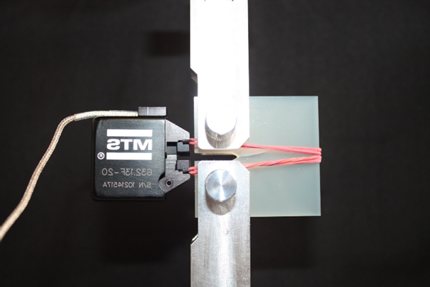
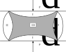

## Lecture on Materials Science -  Material Testing
Prof. Dr.-Ing. Christian Willberg
Magdeburg-Stendal University of Applied Sciences

Contact: christian.willberg@h2.de
Parts of the script are adopted from \
Prof. Dr.-Ing. Jürgen Häberle

---

<!--paginate: true-->

## Contents

---

## Characterization
Mathematical models are used in engineering to predict the behavior of components and structures. Determining the parameters required for the model is known as characterization.

---

## Models

What are models, and why do we need them?

---

---

---

---

---

<iframe src="https://perilab-results.nimbus-extern.dlr.de/models/ForgedCT?step=65&variable=von%20Mises%20Stress&displFactor=20" width="920" height="600"></iframe>

---

---

## 

---

## Examples

- Determination of $E$ and $\nu$ in an isotropic material
- Sketching different methods
- Discussing challenges

## Note
- There are relationships between the shear modulus $G$ and $E$ and $\nu$

---

# Data Acquisition
Typical sensors:
- Strain sensors:
  - Strain gauges (SG)
  - Fiber Bragg
  - Camera systems
- Displacement sensors:
  - Laser triangulation
  - Tape measure
  - Time-of-flight measurement
- Force transducers

---

## Strain Gauges (SG)
- Working principle

- Electrical resistance
$R=\rho\frac{l}{A} = \frac{U}{I}$
$\frac{\Delta R}{R}=k\varepsilon$

---

## Compensation

- Temperature compensation:
  - Measure on an unloaded component
  - Utilize a bridge circuit of strain gauges
- Normal strain compensation:
  - Utilize a bridge circuit of strain gauges

$\frac{U_m}{U_B}=\frac{k}{4}(\varepsilon_1-\varepsilon_2+\varepsilon_3-\varepsilon_4)$

---

## Analog-to-Digital Conversion

- Analog signals
- Digital signals
- A-D converter

$dt<\frac{1}{2f_{max}}$

- If not adhered to, information loss occurs

[Example](https://www.youtube.com/watch?v=ByTsISFXUoY)

---

# Data Analysis - Basics

---

## Variations
- Measurement uncertainties
- Material uncertainties
- Manufacturing uncertainties

Special case:
- Model uncertainties -> Cannot be reduced by more measurements

---

## Dealing with Variations

_Mean_
$sample_{mean}=\sum_{i=1}^{n}\frac{samples_i}{n}$

_Median_
50% of the values are above and 50% below this value; more robust against outliers

_Standard Deviation_
Measures the spread of the data
$s=\sqrt{\frac{1}{n-1}\sum_{i=1}^{n}(samples_i-sample_{mean})^2}$

_Correlation Coefficient_
Describes the linear relationship between data (-1 to +1)

---

## Fitting
Least squares method

$\text{min}||\mathbf{y}_m(\mathbf{x}) - \mathbf{y}||^2$

to determine an arbitrary fitting function.

Choosing the function:
Polynomials - High-degree polynomials may cause oscillations
Splines, B-Splines - More complex

---

## Fourier Transformation

- Any signal/function can be decomposed into a sum of sine curves
- Time functions -> Frequency representations

---

## Filters
- Low-pass:
  - Allows signals below a defined frequency
- High-pass:
  - Allows signals above a defined frequency
- Band-pass:
  - Allows signals between two defined frequencies
- Band-stop:
  - Allows signals outside two defined frequencies

---

---

## Exercise

- Create a dataset
- Plot the dataset
- Fitting
- Statistical evaluation of data
- Signal oscillations
- FFTs
- Gradient determination

---

# Destructive Testing

Certain properties or statements about a material or component can only be made if loaded until failure.

---

## Fracture Mechanics Basics

- Fractures can be categorized into these modes
- Specific energy release rates exist

[Experiments for determining these energies](https://wiki.polymerservice-merseburg.de/index.php/Pr%C3%BCfk%C3%B6rper_f%C3%BCr_bruchmechanische_Pr%C3%BCfungen)

---

## Toughness Determination

- Material's resistance to fracture or crack propagation
- Ability to absorb mechanical energy through plastic deformation

$Z = \int_0^{\varepsilon_{B}}\sigma d \varepsilon$ 

- Energy release rate $G = \frac{Z}{A_{fracture}}$
- Effect of loading speed

 
    <a href="https://doi.org/10.1007/s00466-021-02017-1" style="color: blue;">Image Reference</a>

---

## Tensile Test
- Determination of:
  - Elastic stiffness
  - Strength
  - Yield strength
  - In one direction

- Constant stress across the cross-section is assumed
$\sigma = \frac{F}{A} = E\varepsilon = E\frac{\Delta l}{l}$
$F = \frac{\Delta l E A }{l}$

---

## Sample Geometry

[Video 1](https://eng.libretexts.org/Bookshelves/Materials_Science/TLP_Library_II/5%3A_Mechanical_Testing_of_Metals/5.5%3A_Tensile_Testing_-_Practical_Basics)

---

## Parameter Compression

Crushing Limit  
- Beyond this limit, plastic deformation occurs (ductile material)  
- Brittle materials develop cracks and then [fracture](https://youtu.be/Fjgpvi8igbE?si=ptlpAR_vQfDV_qYW&t=36)

Stability  
- Buckling  
- [Bulging](https://www.youtube.com/watch?v=ZYfLLozCNbw)  
Deformation zones of a compressed sample (Fig. 3.16)

---

## Compression Deformation

I - Minor deformation (friction hindrance)  
II - Moderate tensile deformation  
III - High shear deformation  

---

## Anisotropic Measurements  
Anisotropy  
- Measurements under different angles  

Influencing factors  
- Slip at clamping  
- Temperature  
- Geometry  
- Sample clamping  

---

## Bending Test

- Typically flat samples with rectangular profiles  
- Preferable for brittle materials  
- Assumptions of Bernoulli beam theory must hold  
- Suitable for brittle materials  

$l > 20 \cdot h$

$F$ - test force  

$u$ - resulting displacement  

$a$ - height of the rectangular profile  

$b$ - width of the rectangular profile  

$l_b$ - length of the sample  

---

## 2-Point Bending Test

$E = \frac{4l_b^2 F}{ubh^3}$

---

## 3-Point Bending Test

$E = \frac{l_b^3 F}{4ubh^3}$

---

## 4-Point Bending Test

Objective: A shear-free region resulting in a constant bending moment.  

$E = \frac{l_a^2(2l_a+3l_b)F}{ubh^3}$;  

$l_a$ - distance between support point and closer pressure point of the test stamp  

---

## Stress Profiles  

[Video](https://www.tec-science.com/wp-content/uploads/2021/03/de-animation-biegeversuch-spannungsverlauf-mit-verfestigung.mp4)

- Bending stress  
  - $\sigma_b = \frac{M_b}{I_{xx}y}$  
  - Neutral stress line  

- ENF (End-Notched Flexure) test uses the neutral stress line strategically  

---

## Fatigue Test According to Wöhler  
- Test setup  
  - Bending test  
  - Torsion test  
  - Tension/compression test  

---

## Fatigue Test According to Wöhler  

Influencing factors:  
- Temperature  
- Corrosive environments  
- Notches  
- Surface condition  
  - Smooth surfaces are favorable  
- Heat treatment  

---

## Structural Fatigue Test  

[Video](https://youtu.be/BOpBzKanX9k?si=icWRiGPNs-8H9qXo)

Challenges?  

---

- Representative loads  
- Heating due to rapid loading  
- Load sequence influences lifespan  

---

## Charpy Impact Test  

- Determines the impact energy and impact toughness $\frac{E}{A_{nominal}}$  
  - No longer has technical significance  
- Energy is sufficient for determining material quality  
- Divides into high-level (ductile), low-level (brittle fractures), and the transition region (mixed fractures)  
- Not suitable for determining strength properties  

[Test](https://youtu.be/mpUdV2WHiEE?si=5jwBppXbsEsnqHsc&t=86)  

[Explanation video](https://www.youtube.com/watch?v=Ll69bzegoNY)  

---

## Additional Tests  

- Burst tests  
- Shear tests  
- Pull-out tests  
- Corrosion tests  
- Burn tests  

---

## Hardness Testing  

- Sample or component is not fully destroyed  
- Partially destructive material testing  
- Most common: Rockwell (HR), Brinell, Vickers, and Shore  
- Hardness properties of the component surface affect fatigue and wear  

---

## Rockwell  

- Measures penetration depth $t$ with various standardized test bodies  
- Measurement procedure is defined  

$\text{Rockwell Hardness} = a - \frac{t}{d}$  

- Scales A, C, D; $a = 100$, $d = 0.002mm$  
- Scales B, E-H, K; $a = 130$, $d = 0.002mm$  
- Scales N, T; $a = 100$, $d = 0.001mm$  

---

## Brinell  

- A hardened steel ball is pressed with a defined force onto the surface.  
- Average diameter is determined.  

$\text{Brinell Hardness} = \frac{0.204F}{\pi D \sqrt{D-\sqrt{D^2-d^2}}}$  
with $d = \frac{d_1+d_2}{2}$  

---

## Vickers  

- Similar to Brinell, but uses an equilateral diamond pyramid instead of a ball  
- Requires smaller areas compared to Brinell  

$\text{Vickers Hardness} = \frac{0.204F\cos 22°}{d^2}$  

with $d = \frac{d_1+d_2}{2}$  
