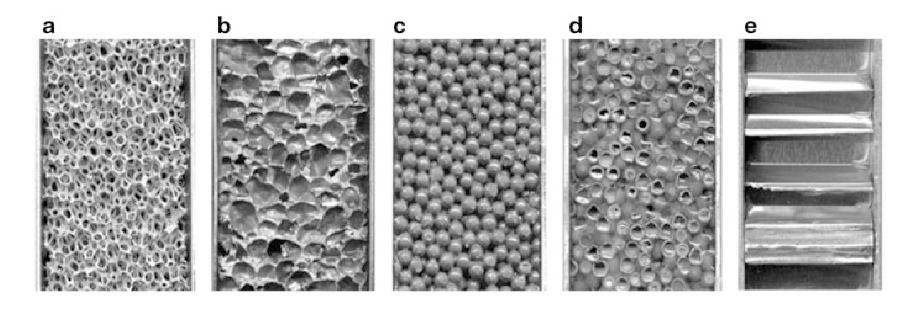

## Lecture on Materials Science - Non-destructive Testing
Prof. Dr.-Ing. Christian Willberg
Magdeburg-Stendal University of Applied Sciences

---

<!--paginate: true-->

# Non-Destructive Testing

Objectives of Non-Destructive Testing (NDT)

---

## Development Stages

NDT 1.0 – Tools (to sharpen the senses)  
NDT 2.0 – Analog systems (for inspection within components)  
NDT 3.0 – Digital processing and automation  
NDT 4.0 – Transparency of information, technical & digital tools, autonomous and decentralized decision-making  

---

## Methods

- Any measurable physical property can, in principle, be used:  
  - mechanical  
  - optical  
  - electromagnetic  
  - electrical  
  - thermal  
  - magnetic  

---

## Probability of Detection (PoD)

- A metric that indicates the probability of detecting a defect of a specific size  

- The permissible defect size is known.  
- With 95% confidence, 90% of the defects are detected.  

---

## Damage Size

- The detectable defect size varies depending on the method.  
- Smaller damage size does not always mean better:  
  - Minimum damage size: $l = \frac{\lambda}{2}$ → Sampling theorem  
  - $c = \lambda f$  
  - $c$ is the speed of light or sound  

$$
\lambda = \frac{c}{f} = \frac{6000 \, \text{m/s}}{10^6 \, \text{s}^{-1}} = 6 \, \text{mm}
$$  

  
  

---

## Trade-Off

- Small wavelength = higher resolution = greater interaction = smaller range  
- Large wavelength = lower resolution = less interaction = greater range  

Examples: 5G vs. 4G, FM radio vs. longwave radio, etc.  

---

## Visual Inspection

- Can be conducted with various tools and is widely used:  

**Direct visual inspection**  
- Eye  
- Boroscopes (e.g., elastoscopes, endoscopes, mirror tubes)  

**Indirect visual inspection**  
- Cameras  
- Drones  

---

## Penetrant Testing  

  

1. Cleaning  
2. Applying penetrant and allowing it to penetrate  
3. Surface cleaning  
4. Applying developer  

- Can be performed in daylight or darkness  

---

## Radiographic Testing

- X-rays, microwaves, gamma rays  
- Synchrotron radiation (special cases, less common)  
- Also usable for computed tomography (CT)  

  
  

---

## Thermography

**Active**  
- The component is warm and measured.  
- Temperature distribution differences can identify defects.  
- Process adjustments are possible.  

**Passive**  
- The component is stimulated, and its response is measured.  
- Example: Inductive heating in carbon-fiber-reinforced components.  

---

## Modal Analysis

$\mathbf{M}\ddot{\mathbf{u}}+\mathbf{Ku}=\mathbf{0}$

- Eigenmodes
- Eigenfrequencies

$(\mathbf{K}-\omega^2\mathbf{M})\hat{\mathbf{x}}=\mathbf{0}$

**Spring-Mass System**  
$m\ddot{u}+cu=0$

$c-\omega^2 m = 0$

$\omega = 2\pi f = \sqrt{\frac{c}{m}}$

---

## Modal Analysis

- Excitation using a shaker or impulse hammer  
- Measurement points with accelerometers or lasers  
- One excitation point → multiple measurement points  
- Multiple excitation points → one measurement point  

---

## Ultrasonic Testing

**Wave Types**  
- Longitudinal waves (P-waves)  
- Transverse waves (S-waves)  
- Love waves  
- Rayleigh waves  
- Lamb waves, or guided ultrasonic waves  
  - Symmetric, asymmetric, and shear modes  
- Torsional waves  
- Shear waves  

---

---

## Symmetric Modes (Longitudinal Waves)

<video controls="controls" width="600" src=".../assets/Videos/sym.avi"></video>

---

## Asymmetric Modes (Transverse Waves)

<video controls="controls" width="600" src=".../assets/Videos/asym.avi"></video>

---

## Sound Velocities

$c_{l}=\sqrt{\frac{E(1-\nu)}{\rho(1-\nu-\nu^2)}}$

$c_{t}=\sqrt{\frac{G}{\rho}}$

Guided ultrasonic waves are dispersive, having both group and phase velocities.  

---

## Dispersion

- **Group velocity**: The speed of the wave envelope's propagation  
- **Phase velocity**: The speed of the phase (individual frequency) propagation  

For a single frequency, group and phase velocities are identical.  

- For frequency-dependent phase velocities, the wave envelope broadens → Dispersion  

---

## Piezoelectric Effect

- Actuator effect  
- Sensor effect  

- $d_{31}$: Electrical voltage in the 3-direction and deformation in the 1 or 2 direction  
- $d_{33}$: Electrical voltage in the 3-direction and deformation in the 3 direction  

---

## Reflections at Interfaces

- Acoustic impedance $W = c_L\rho$

**Reflected Sound**  
$\frac{p_{a,r}}{p_{a,e}}=\frac{W_2-W_1}{W_2+W_1}$  

**Transmitted Sound**  
$\frac{p_{a,d}}{p_{a,e}}=\frac{2W_2}{W_2+W_1}$  

