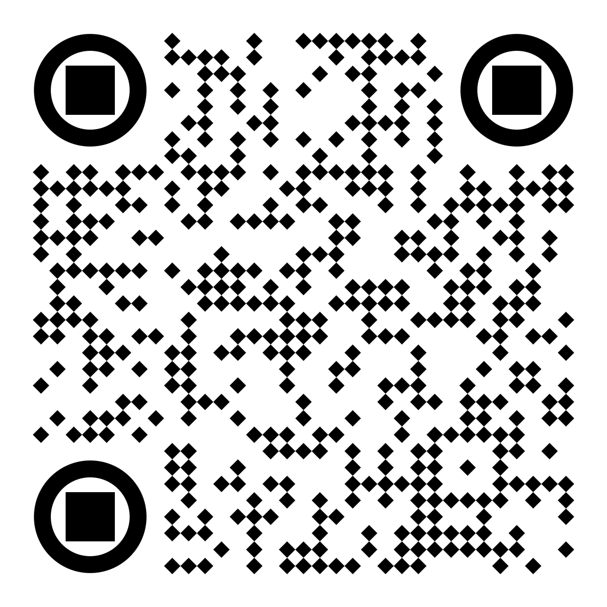
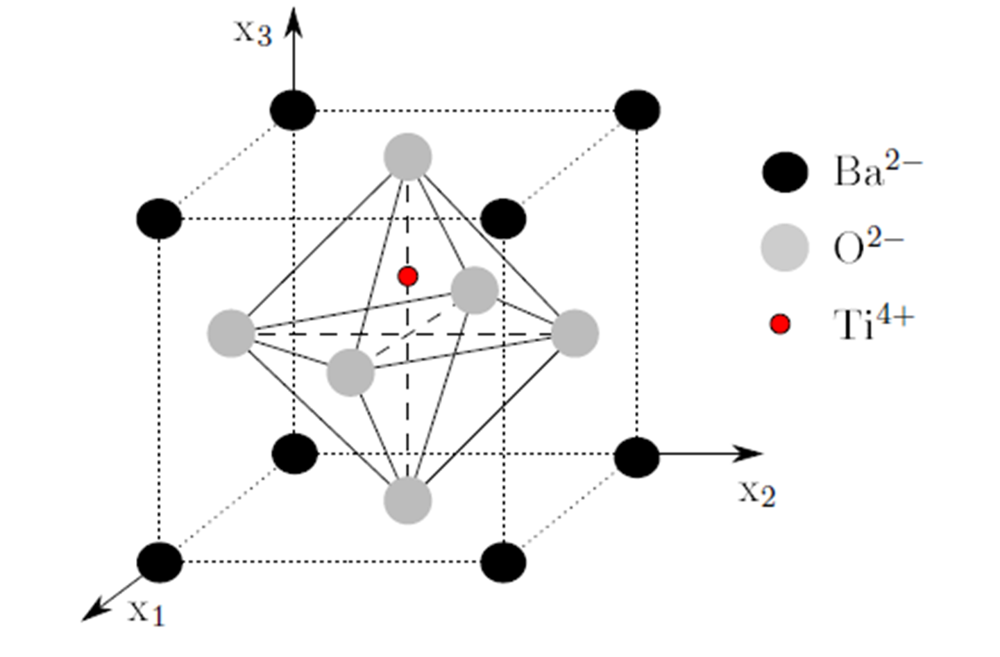
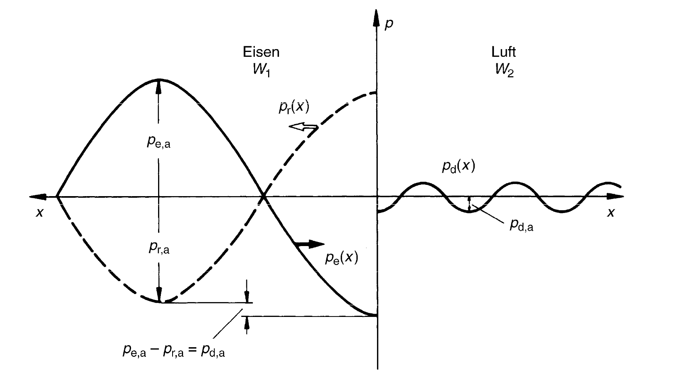
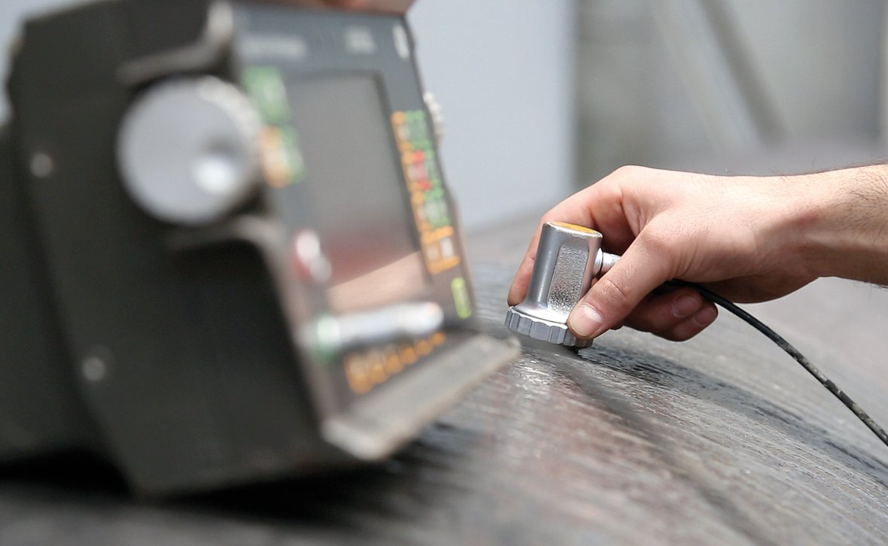

## Lecture on Materials Science - Non-destructive Testing
Prof. Dr.-Ing. Christian Willberg
Magdeburg-Stendal University of Applied Sciences

---

<!--paginate: true-->

# Non-Destructive Testing

Objectives of Non-Destructive Testing (NDT)

---

## Development Stages

NDT 1.0 – Tools (to sharpen the senses)  
NDT 2.0 – Analog systems (for inspection within components)  
NDT 3.0 – Digital processing and automation  
NDT 4.0 – Transparency of information, technical & digital tools, autonomous and decentralized decision-making  

---

## Methods

- Any measurable physical property can, in principle, be used:  
  - mechanical  
  - optical  
  - electromagnetic  
  - electrical  
  - thermal  
  - magnetic  

---

## Probability of Detection (PoD)

- A metric that indicates the probability of detecting a defect of a specific size  

- The permissible defect size is known.  
- With 95% confidence, 90% of the defects are detected.  

---

## Damage Size

- The detectable defect size varies depending on the method.  
- Smaller damage size does not always mean better:  
  - Minimum damage size: $l = \frac{\lambda}{2}$ → Sampling theorem  
  - $c = \lambda f$  
  - $c$ is the speed of light or sound  

$$
\lambda = \frac{c}{f} = \frac{6000 \, \text{m/s}}{10^6 \, \text{s}^{-1}} = 6 \, \text{mm}
$$  

  
  

---

## Trade-Off

- Small wavelength = higher resolution = greater interaction = smaller range  
- Large wavelength = lower resolution = less interaction = greater range  

Examples: 5G vs. 4G, FM radio vs. longwave radio, etc.  

---

## Visual Inspection

- Can be conducted with various tools and is widely used:  

**Direct visual inspection**  
- Eye  
- Boroscopes (e.g., elastoscopes, endoscopes, mirror tubes)  

**Indirect visual inspection**  
- Cameras  
- Drones  

---

## Penetrant Testing  

  

1. Cleaning  
2. Applying penetrant and allowing it to penetrate  
3. Surface cleaning  
4. Applying developer  

- Can be performed in daylight or darkness  

---

## Radiographic Testing

- X-rays, microwaves, gamma rays  
- Synchrotron radiation (special cases, less common)  
- Also usable for computed tomography (CT)  

  
  

---

## Thermography

**Active**  
- The component is warm and measured.  
- Temperature distribution differences can identify defects.  
- Process adjustments are possible.  

**Passive**  
- The component is stimulated, and its response is measured.  
- Example: Inductive heating in carbon-fiber-reinforced components.  

---

## Modal Analysis

$\mathbf{M}\ddot{\mathbf{u}}+\mathbf{Ku}=\mathbf{0}$

- Eigenmodes
- Eigenfrequencies

$(\mathbf{K}-\omega^2\mathbf{M})\hat{\mathbf{x}}=\mathbf{0}$

**Spring-Mass System**  
$m\ddot{u}+cu=0$

$c-\omega^2 m = 0$

$\omega = 2\pi f = \sqrt{\frac{c}{m}}$

---

## Modal Analysis

- Excitation using a shaker or impulse hammer  
- Measurement points with accelerometers or lasers  
- One excitation point → multiple measurement points  
- Multiple excitation points → one measurement point  

---

## Ultrasonic Testing

**Wave Types**  
- Longitudinal waves (P-waves)  
- Transverse waves (S-waves)  
- Love waves  
- Rayleigh waves  
- Lamb waves, or guided ultrasonic waves  
  - Symmetric, asymmetric, and shear modes  
- Torsional waves  
- Shear waves  

---

---

## Symmetric Modes (Longitudinal Waves)

<video controls="controls" width="600" src=".../assets/Videos/sym.avi"></video>

---

## Asymmetric Modes (Transverse Waves)

<video controls="controls" width="600" src=".../assets/Videos/asym.avi"></video>

---

## Sound Velocities

$c_{l}=\sqrt{\frac{E(1-\nu)}{\rho(1-\nu-\nu^2)}}$

$c_{t}=\sqrt{\frac{G}{\rho}}$

Guided ultrasonic waves are dispersive, having both group and phase velocities.  

---

## Dispersion

- **Group velocity**: The speed of the wave envelope's propagation  
- **Phase velocity**: The speed of the phase (individual frequency) propagation  

For a single frequency, group and phase velocities are identical.  

- For frequency-dependent phase velocities, the wave envelope broadens → Dispersion  

---

## Piezoelectric Effect

- Actuator effect  
- Sensor effect  

- $d_{31}$: Electrical voltage in the 3-direction and deformation in the 1 or 2 direction  
- $d_{33}$: Electrical voltage in the 3-direction and deformation in the 3 direction  

---

## Reflections at Interfaces

- Acoustic impedance $W = c_L\rho$

**Reflected Sound**  
$\frac{p_{a,r}}{p_{a,e}}=\frac{W_2-W_1}{W_2+W_1}$  

**Transmitted Sound**  
$\frac{p_{a,d}}{p_{a,e}}=\frac{2W_2}{W_2+W_1}$  

---

## Signal-to-Noise Ratio

$SNR = \frac{P_{\text{Signal}}}{P_{\text{Noise}}}$

- Multiple measurements reduce the noise component.

---

## Experimental Setup

- 1–2 transducers
- Amplifier
- Sensor

 
    <a href="http://std-partners.de/fileadmin/_processed_/csm_STD_HP_Ultraschall_03_18_07ef793d11.jpg)" style="color: blue;">Image Reference</a>

---

## Coupling of the Probe to the Surface

**Water**  
- Low cost  
- Easily automated  

**Motor oil, grease**  
- Already present in the component  
- Not optimized for testing  

**Glycerin, gel**  
- High viscosity and acoustic impedance advantageous  
- Suitable for rough surfaces and highly damping materials (e.g., weld seam inspection)  

**Air**  
- No coupling medium required  
- High noise level  

---

## Pulse-Echo Method

- **Dead zone**  
  - Transition time from transmitter to receiver.  

- **Dual-sensor system**  
  - Measurements on both sides of the material.  
  - Challenges in accessibility and effort.  

---

## Measurement Image

---

## Weld Seam Inspection

- Angled ultrasound due to challenging coupling conditions.  

---

## Adhesive Layers

- Tested similarly to other materials.  
- Potential presence of "kissing bonds."

---

## Wall Thickness Measurement

---

## Imaging Techniques

- Measurement data can be visualized in various ways.  

---

## A-Scan (Amplitude)

- Time vs. Amplitude  
- For a constant velocity, flaws in the signal can be detected at a specific point.  

---

## B-Scan (Brightness)

- A single point is another representation of the A-scan (echo intensity shown by brightness).  
- Using sound direction, 2D or 3D images can be created.  

---

## C-Scan

- A projection of the sizes of detected flaws.  

---

## D-Scan

- Area scan for larger regions.  

---

## Thickness Measurement Using Guided Ultrasonic Waves

---

## Eddy Current Testing
- surface inspection of cracks
  - aerospace industry
  - petrochemical industry

---

## Structural Health Monitoring

- Monitoring a structure during operation.  
- Related to condition monitoring (e.g., gearbox monitoring to detect bearing damage).  

---
### Objectives:
- Reduce maintenance costs:
  - Fewer repairs.  
  - Easier inspections.  
  - Timely maintenance.  
- Load adaptation in case of damage.  
- Extend service life.  
- Increase safety.  

---

### Four Levels of SHM:

1. Detect an event.  
2. Detect and localize the event.  
3. Detect, localize, and identify the event.  
4. Assess damage severity and its impact on the structure.

---

## Methods

- Modal analysis  
- Guided ultrasonic waves  
- Acoustic emissions  
- Load path analyses (e.g., parallel springs)  
- Strain measurements  
- Model-based approaches  

---

## Technical Applications

### Bridges
- Example: Second Penang Bridge, Penang, Malaysia  

---

### Pipelines

---

### Aircraft
- Load path analysis  
- Monitoring of connections  
- Focus on efficiency rather than safety  

---

### Wind Energy

---

## Challenges

- Temperature effects  
- Humidity  
- Material internal structure  
- Mode conversion  
- Stresses in the structure  
- Aging  

---

## Potentials

**Example: Aircraft**  
- Barely visible impact (BVI): damage size defined by visibility.  
- SHM systems allow for smaller damage considerations during design.  
- Estimated **1–5% reduction** in structural mass ([Source](https://elib.dlr.de/123946/1/1475921718813279.pdf)).  

---

## Microscopy

- Analysis of material microstructure.  
- Local analysis of composition or grain structure.  
- Sample preparation (e.g., grinding, surface treatment).  
- Light sources significantly influence contrast.  

---

## Light Microscopy

- Grain size analysis for metals and alloys.  
- Area counting and line intercept methods.  

---

## Scanning Electron Microscopy

- Uses electron beams for scanning.  
- Significantly higher resolution ($1nm - 2nm$).  
- ~500x better magnification compared to light microscopy.  

---

## Scanning Probe Microscopy

- Structures scanned using a needle.  
- Interaction varies based on the microscope type:
  - Tunneling current.  
  - Van der Waals forces.  
  - Magnetic forces.  

