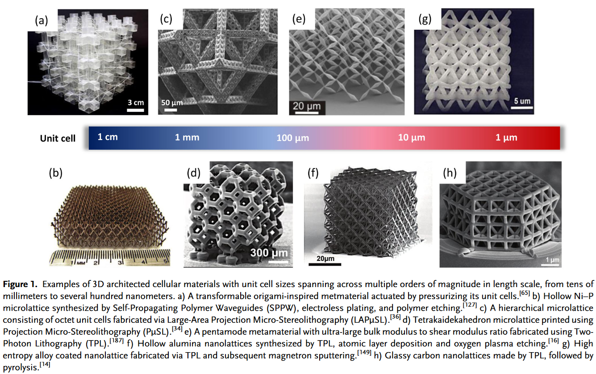
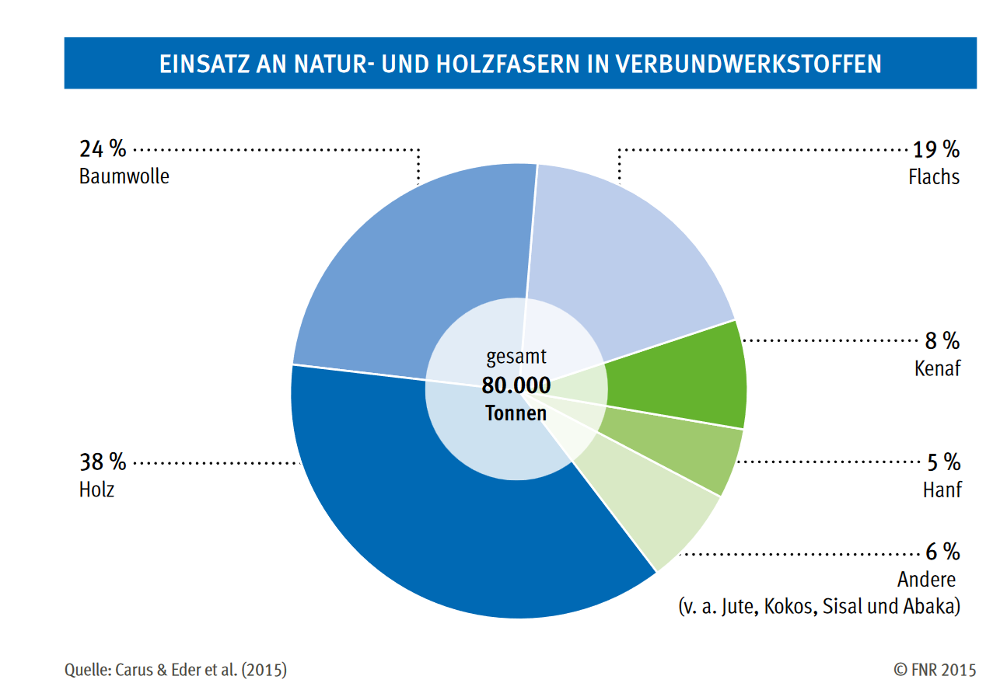

## Lecture on Materials Science - Non-iron materials
Prof. Dr.-Ing. Christian Willberg
Magdeburg-Stendal University of Applied Sciences

Contact: christian.willberg@h2.de

---

<!--paginate: true-->

# Non-Ferrous Materials

- Non-ferrous metals
- Plastics
- Glasses
- Ceramics
- Metamaterials
- Multifunctional materials
- Fiber-reinforced plastics
- Lightweight construction excursion

---

## Comparison of Materials

- Specific properties

---

Specific properties = $\frac{\text{Property}}{\text{Reference value}}$
Examples:

Specific mass (density) - $\rho = \frac{m}{V}$  
Specific strength - $R_{spec} = \frac{R_{m}}{\rho}$

---

# Non-Ferrous Metals

Steel has an annual production of ~1900 million tons.

---

## Aluminum

Good [overview](https://www.maschinenbau-wissen.de/skript3/werkstofftechnik/aluminium) of properties, manufacturing, etc.

The specific strength of aluminum and steel is very similar.

---

### Advantages:
- Low density, significantly lighter weight compared to similar steel components and structures.
- Aluminum materials can be excellently formed both hot and cold.
- Good castability.
- Hardenable.
- Good machinability.
- Due to a passivating oxide layer on the surface, aluminum materials are generally very corrosion-resistant against numerous aqueous media.

---

### Disadvantages:
- Higher cost compared to steel.

**Applications**:
- Automotive industry
- Aerospace technology
- Bicycles
- Aluminum foil

---

## Production
- Aluminum is obtained from $\text{AL}_2\text{O}_3$.
- The melting point of bauxite is very high, at 2060 °C.
- Hence, smelting electrolysis is used.
- Electrolyte: A solution of aluminum oxide in molten, artificially produced cryolite (a mineral composed of sodium, aluminum, and fluorine).

---

- High energy demand.
- Recycling requires only 5% of the energy needed for primary aluminum production.

[Approximately 60-70 million tons production](https://de.wikipedia.org/wiki/Liste_der_gr%C3%B6%C3%9Ften_Aluminiumproduzenten)

---

## Copper

- Copper is an excellent electrical and thermal conductor.

---

- Common alloys:
  - Bronzes (copper-tin)
    - Good strength.
    - Corrosion resistance.
    - Easy to process.
  - Brass (copper-zinc)
    - Single-phase brass up to 37% zinc.
    - Two-phase brass between 37-44% zinc.
    - Good machinability.
  - Copper-nickel alloys.

---

## Production

- From copper matte.

$6CuFe S_2 10 O_2\rightarrow
3 Cu_2 S+2 Fe S$ $+ 2Fe_2 O_3 + 7 SO_2$

In several steps, reactions occur:
$Cu_2 S+ 2Cu_2 O\rightarrow 6Cu+SO_2$

[17 million tons (2006) - 28 million tons (2025*)](https://de.statista.com/statistik/daten/studie/156043/umfrage/weltweite-kupfernachfrage-seit-2006/)

---

## Others

- Magnesium is used in lightweight construction.
- Titanium and titanium alloys:
  - High strength and heat resistance.
  - Corrosion-resistant.
- Nickel:
  - Corrosion-resistant.
  - High heat resistance.

---

- Zinc:
  - Corrosion-protective coatings.
  - Weather-resistant sheets.
- Lead:
  - Easily castable.
  - Chemically resistant.
  - Batteries, bearings, and solders.

---

- Tungsten:
  - Highest melting temperature of all metals.
  - Filaments, welding electrodes, and special components.

---

---

# Plastics

- Plastics are primarily composed of macromolecules.
- Depending on the manufacturing process and added additives, they have a very wide property spectrum.
- Polymers can be derived from natural substances or fully synthesized.

---

## Applications
- Packaging industry
- Insulation
- Toys
- Pipes
- Cladding
- Insulation
- Circuit boards
- And more

---

## Environmental Issues

- Over 70% of plastics are stored in landfills, 9% are recycled, and the rest is incinerated.
- Microplastics:
  - Intentionally used (e.g., in toothpaste) or created through mechanical destruction of plastics in the environment.
  - Accumulate in food, animals, and plants.
  - Can have negative effects (not yet proven in humans).

---

## Classification

Thermoplastics:
- Made of non-crosslinked polymers.
- Often have a semi-crystalline structure.
- Can be melted and have a glass transition temperature.
- Recyclable in principle.

---

Thermosets:
- Densely crosslinked polymers (crosslinking points shown as red dots).

---

Elastomers:
- Loosely crosslinked polymers.
- Loose crosslinking allows for high elongation (e.g., rubber bands).

---

## Glass Transition Temperature

$T_g$ is the temperature at which an amorphous solid (e.g., glass or an amorphous polymer) transitions from a rigid, glass-like state to a soft, rubber-like state.

---

## Thermoplastics
**States of Aggregation**

At different temperatures, thermoplastics take on various states of aggregation, which can be used to shape the material:
- Solid
- Thermoelastic
- Thermoplastic
- Flowable

---

**Common Manufacturing Processes**
- Injection molding
- Extrusion
- Additive manufacturing
- Blow molding
- Film blowing

---

_Applications_
- Automotive industry: Used in interior and exterior cladding, bumpers, and headlight housings.
- Aerospace: Components for airplane and satellite interiors due to low weight.
- Medical technology: Production of disposable syringes, catheters, and other medical consumables.
- Construction: Pipes, insulation materials, and window frames.
- 3D printing

---

Examples:
- Polyethylene (PE)
- Polypropylene (PP)
- Polystyrene (PS)
- Polycarbonate (PC)

---

## Thermosets

- Due to their high degree of crosslinking, thermosets cannot be remelted.
- High temperatures above the decomposition temperature destroy the bonds (pyrolysis).
- Produced through polycondensation.
- Occurs in stages: Intermediate products (oligomers) are stable but still reactive. These oligomers ultimately form macromolecules.

---

_Applications_

- Brake pads
- Fiber-reinforced composites
- Cable trays
- Car body parts
- Safety helmets

---

Examples:
- Epoxy resins
- Crosslinkable polyurethanes
- Unsaturated polyester resins

---

## Elastomers

- The glass transition temperature is below the application range (becoming glass-like at low temperatures).
- Elastomers can deform elastically and return to their original shape.
- Many elastomers are now synthetically produced. However, there is still a significant market for natural rubber, primarily harvested from the rubber tree. Initial applications also use rubber derived from [dandelion](https://en.wikipedia.org/wiki/Russian_dandelion).

---

_Applications_
- Sealing rings
- Tires
- Rubber bands

- Vulcanization influences the number of crosslinks (dots on the right).

---

Examples:
- Natural rubber
- Rubber
- Chloroprene
- Epichlorohydrin

---

**Vulcanization**
Describes the process to transform thermoplastic natural or synthetic rubber into an elastomer:
- Creates covalent bonds (red dots) between molecular chains.
- Sulfur or sulfur-donating substances are used.
- Covalent bonds form as sulfur bridges.
- Aging involves the replacement of sulfur bridges with oxygen bridges.

---

## Additives
Used to modify specific properties of plastics:

- Plasticizers
- Stabilizers
- Pigments
- Fillers
- Reinforcing agents

---

## Glass

- Glass is a frozen state of an undercooled liquid.
- Amorphous structure:
  - Stochastically distributed.
  - Isotropic.
- Glass transition temperature.
- Crystals change their properties abruptly at the melting temperature (phase change).
- This is not the case with glass (no phase change).

---

**Properties**
- Vary widely depending on the type of glass.
- Generally very resilient to chemicals.
- Typically brittle (low tensile strength).
- Non-metallic glasses are poor conductors and can be used as insulators.

**Applications**

- Windows
- Containers
- Insulators
- Optics

---

# Ceramics

The raw material is in powder form

- Preparation and mixing of powders
- Manufacturing of formed parts
- Sintering

---

- Very high compressive strength (10 times higher than tensile strength)
- Behaves like an ideally brittle body.
- Low impact bending strength.
- High notch sensitivity.

[Source](https://d2wg98g6yh9seo.cloudfront.net/users/153243/153243_PuZaGavilaboseVe7493644773946427.png)

---

- The cause of high strength and elasticity lies in the primary covalent bonds between atoms.
- Hence, no dislocation glide like in metals → no plastic properties.

[Source](https://d2wg98g6yh9seo.cloudfront.net/users/153243/153243_waVatuLaxuyiroRu6233471439296793.png)

---

[Source](https://d2wg98g6yh9seo.cloudfront.net/users/153243/153243_SifuZeYuvegeWori5372538488744336.png)

---

Clay Ceramics:
- Contain at least 20% clay minerals.
- Porcelain has significant technical importance.

Glass-Ceramics:
- A mix of glass and ceramics.
- Partial crystallization through the addition of crystallites.
- Cast like glass and then heat-treated.
- Very low (sometimes negative) thermal expansion coefficients.

---

## Properties

**Electrical**
- High creep resistance.
- High resistance to current flow.
- High dielectric strength.

Unaffected by environmental factors (e.g., salt mist, industrial gases, sunlight, heat):
- Used in plugs, terminal blocks, switches, etc.

[Source](https://pixnio.com/free-images/2017/12/11/2017-12-11-16-38-22-1536x1024.jpg)

---

## Technical Ceramics and Their Applications

Technical ceramics can exhibit a wide range of properties, making them suitable for numerous applications:

- Medical technology: Bone or dental replacements.
- Electrical engineering: Power capacitors.
- High-temperature applications: Burner systems, heating elements, bearings.
- Bearing and sealing technology: Mechanical seals, sliding bearings.

Ceramic composites also exist to compensate for low tensile strength.

---

# Metamaterials

The goal of metamaterials is to "engineer" properties through tailored microstructures.

[Example](https://en.wikipedia.org/wiki/File:Negative_refraction.ogv)

[Source](https://doi.org/10.1002/adem.201800864)

---

---

---

# Smart Materials

Piezoelectric Materials:
- Deform under electrical voltage and vice versa.

[Shape Memory Materials](https://www.youtube.com/watch?v=231O7jlgwxI):
- Drastic shape changes due to temperature variations.
- Good [explanation](https://en.wikipedia.org/wiki/Shape-memory_alloy).

---

Photovoltaic Materials:
- Generate electrical voltage under light exposure.

Thermoelectric Materials:
- Generate electrical voltage due to temperature differences.

Photomechanical Materials:
- Change shape under light exposure.

Thermochromic Materials:
- Change color with temperature changes.

And more.

---

## Natural Materials

Divided into living (organic) and non-living (inorganic) substances.

- Organic:
  - Animal-based or plant-based.
  - Fats, oils, starch.
- Inorganic:
  - Silicates, carbonates.

---

| Plant-Based Material | Applications |
| ---| --- |
| Lignocellulose/ Wood | Wood-based materials |
| Oils | Lubricants, fuels, surfactants |
| Fibers | Textiles, composites |
| Starch | Packaging materials |
| Special contents | Pharmaceuticals, dyes, luxury goods |

---

| Animal-Based Material | Applications |
| ---| --- |
| Bones, shells | Glue, fertilizers, materials |
| Fats | Lubricants, fuels, surfactants |
| Fibers | Textiles, composites |
| Proteins | Cosmetics |
| Special contents | Pharmaceuticals (e.g., insulin, vaccines, estrogens) |

---

## Wood and Wood-Based Materials

- Veneer:
  - Made from untreated solid wood with a thickness ≤ 5 mm and a width ≥ 80 mm, produced by slicing or planing raw wood.
- Plywood:
  - At least three glued wood layers.
- Particle board.
- Fiberboard:
  - Fiber insulation board.
  - Hardboard.
  - MDF board.

---

---

---

---

---

## Properties

- Strongly dependent on the type of wood:
  - Bamboo, spruce, oak, Lophira alata.
- Veneer ($E=10000-17000\ \text{N/mm}^2, R_{11}=180-80\ \text{N/mm}^2$).
- Particle boards have properties similar to plastics ($E=2000-4500\ \text{N/mm}^2$).
- Strength perpendicular to the grain ~50%.

---

## Natural Fibers

Examples: Glass, hemp, flax, kenaf, jute, cotton.

As renewable resources, hemp ($E=90000\ \text{N/mm}^2$, $R=1110\ \text{N/mm}^2$) and flax ($E=93000\ \text{N/mm}^2$, $R=930\ \text{N/mm}^2$) are interesting from an ecological perspective.

---

Polypropylene (PP), PP with talc (PP-T), PP with wood fibers (WPC), PP with bast fibers (e.g., hemp, flax, jute, kenaf), and PP with glass fibers (PP-GF).

---

Natural fibers make up approximately 15% of the composite market in the EU (as of 2015).

---

## Challenges

- Standardization:
  - Exists only partially.
- Competition with established processes.
