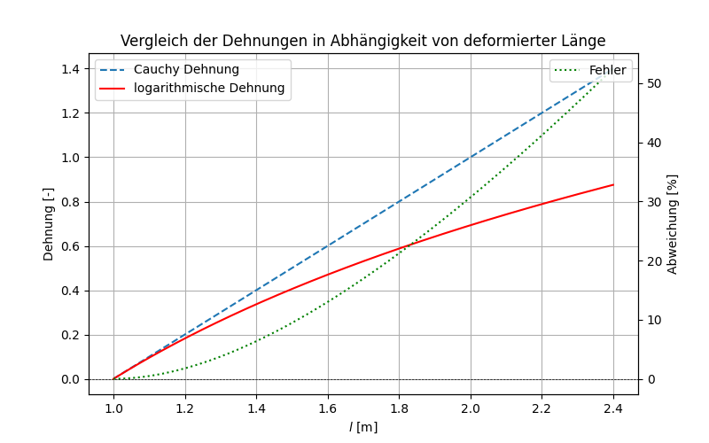

##  Werkstofftechnik II -  Grundlagen der Materialmodellierung
Prof. Dr.-Ing.  Christian Willberg
Hochschule Magdeburg-Stendal

Kontakt: christian.willberg@h2.de

 
    <a href="https://doi.org/10.1007/s42102-021-00079-6" style="color: blue;">Bildreferenz</a>

---

<!--paginate: true-->

## Vorlesung

---

## Begriffe
| Begriff         | Freiheitsgrade | Einheit     |
|----------------|---------------|------------|
| Verschiebung   | 3 (x, y, z)    | m   |
| Dehnungen      | 6 (x, y, z, xy, xz, yz)    | - oder % |
| Geschwindigkeit | 3 (x, y, z) | m/s  |
| Dehnungrate     | 6 (x, y, z, xy, xz, yz)    | 1/s oder %/s |
| Kraft         | 3 (x, y, z) | N  |
| Moment        | 3 (x, y, z) | Nm  |
| Spannung        | 6 (x, y, z, xy, xz, yz)  | N/m$^2$, MPa  |

---
## Was ist eine Dehnung?
- Angabe für relative Längenänderung

Beispiele 1D:

$\varepsilon_C = \frac{\Delta \ell_1 + \Delta \ell_2}{\ell_0}$

$\varepsilon' = \ln \left (\frac{\ell}{\ell_0} \right )=\ln \left (1 + \varepsilon \right )$

---

---

# Grundlagen der Materialmodellierung

$\boldsymbol{\sigma}_T=\mathbf{C}_T\cdot\cdot\boldsymbol{\varepsilon}_T$

$\boldsymbol{\sigma} =
\begin{bmatrix}
\sigma_{11} & \sigma_{12} & \sigma_{13} \\
\sigma_{21} & \sigma_{22} & \sigma_{23} \\
\sigma_{31} & \sigma_{32} & \sigma_{33}
\end{bmatrix}
$

$\boldsymbol{\varepsilon} =
\begin{bmatrix}
\varepsilon_{11} & \varepsilon_{12} & \varepsilon_{13} \\
\varepsilon_{21} & \varepsilon_{22} & \varepsilon_{23} \\
\varepsilon_{31} & \varepsilon_{32} & \varepsilon_{33}
\end{bmatrix}$

---

## Voigt Notation

**Symmetriebedingungen**

$
C_{ijkl} = C_{ijlk} \quad \text{(Symmetrie bei Vertauschung der letzten Indizes)},$
$C_{ijkl} = C_{jikl} \quad \text{(Symmetrie bei Vertauschung der ersten Indizes)},$
$C_{ijkl} = C_{klij} \quad \text{(Paarweise Symmetrie)}$

---

$
\begin{bmatrix}
\sigma_{11} \\
\sigma_{22} \\
\sigma_{33} \\
\sigma_{12} \\
\sigma_{13} \\
\sigma_{23}
\end{bmatrix}=
\begin{bmatrix}
C_{1111} & C_{1122} & C_{1133} & C_{1112} & C_{1113} & C_{1123} \\
C_{2211} & C_{2222} & C_{2233} & C_{2212} & C_{2213} & C_{2223} \\
C_{3311} & C_{3322} & C_{3333} & C_{3312} & C_{3313} & C_{3323} \\
C_{1211} & C_{1222} & C_{1233} & C_{1212} & C_{1213} & C_{1223} \\
C_{1311} & C_{1322} & C_{1333} & C_{1312} & C_{1313} & C_{1323} \\
C_{2311} & C_{2322} & C_{2333} & C_{2312} & C_{2313} & C_{2323}
\end{bmatrix}
\cdot
\begin{bmatrix}
\varepsilon_{11} \\
\varepsilon_{22} \\
\varepsilon_{33} \\
\gamma_{12} \\
\gamma_{13} \\
\gamma_{23}
\end{bmatrix}$
mit

$\gamma_{ij}=\gamma_{ji}=0.5(\varepsilon_{ij}+\varepsilon_{ji})$

---

# Isotropes Material
## Steifigkeitsmatrix

$$
\begin{bmatrix}
\sigma_{11} \\
\sigma_{22} \\
\sigma_{33} \\
\sigma_{12} \\
\sigma_{13} \\
\sigma_{23}
\end{bmatrix}=
\frac{E}{(1+\nu)}
\begin{bmatrix}
\frac{1-\nu}{1-2\nu} & \frac{\nu}{1-2\nu} & \frac{\nu}{1-2\nu} & 0 & 0 & 0 \\
\frac{\nu}{1-2\nu} & \frac{1-\nu}{1-2\nu} & \frac{\nu}{1-2\nu} & 0 & 0 & 0 \\
\frac{\nu}{1-2\nu} & \frac{\nu}{1-2\nu} & \frac{1-\nu}{1-2\nu} & 0 & 0 & 0 \\
0 & 0 & 0 & \frac{1}{2} & 0 & 0 \\
0 & 0 & 0 & 0 & \frac{1}{2} & 0 \\
0 & 0 & 0 & 0 & 0 & \frac{1}{2}
\end{bmatrix}
\cdot
\begin{bmatrix}
\varepsilon_{11} \\
\varepsilon_{22} \\
\varepsilon_{33} \\
\gamma_{12} \\
\gamma_{13} \\
\gamma_{23}
\end{bmatrix}$$

---

## Nachgiebigkeit

$$\begin{bmatrix}
\varepsilon_{11} \\
\varepsilon_{22} \\
\varepsilon_{33} \\
\gamma_{12} \\
\gamma_{13} \\
\gamma_{23}
\end{bmatrix} = \frac{1}{E}
       \begin{bmatrix}
       1     &-\nu &-\nu &0      &0        &0 \\
       \cdot &1     &-\nu &0      &0        &0 \\
       \cdot &\cdot & 1    &0      &0        &0 \\
       \cdot &\cdot &\cdot &2(1+\nu) &0        &0 \\
       \cdot &\cdot &\cdot &\cdot    &2(1+\nu) &0 \\
       \cdot &\cdot &\cdot &\cdot    &\cdot  &2(1+\nu)
       \end{bmatrix}\cdot \begin{bmatrix}
\sigma_{11} \\
\sigma_{22} \\
\sigma_{33} \\
\sigma_{12} \\
\sigma_{13} \\
\sigma_{23}
\end{bmatrix}
       $$

- 1D Annahme $\sigma_{22} =\sigma_{33} =\sigma_{12} =
\sigma_{13} =\sigma_{23}=0$

---

## 2D Zustände
- ebener Spannungszustand ($\sigma_{33} =
\sigma_{13} =\sigma_{23}=0$)
- ebener Dehnungszustand ($\varepsilon_{33} =
\varepsilon_{13} =\varepsilon_{23}=0$)
---

## Eigenarbeit

Kompressionsmodul
Schubmodul
Querkontraktionzahl
Elastizitätsmodul

---

## Vergleichspannungen

Mit Vergleichsspannungen können, im Allgemeinen dreidimensionale Spannungszustand im Bauteil mit den Kennwerten aus dem einachsigen Zugversuch (Material-Kennwerte, z. B. Streckgrenze oder Zugfestigkeit) verglichen werden 

---

3D spannungen
Hooksche Matrix
Beispielrechnung

1D ableiten
Impulserhaltung + Drehimpulserhaltung

Vergleichsspannungen

Festigkeit

---

Spannungsintensitäten

