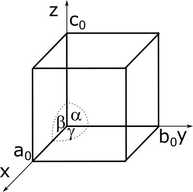

##  Werkstofftechnik II
Prof. Dr.-Ing.  Christian Willberg
Hochschule Magdeburg-Stendal

Kontakt: christian.willberg@h2.de
Teile des Skripts sind von \
Prof. Dr.-Ing. Jürgen Häberle übernommen

 
    <a href="https://doi.org/10.1007/s42102-021-00079-6" style="color: blue;">Bildreferenz</a>

---

<!--paginate: true-->

## Vorlesung

---

## Inhalte
- WST für Bachelor S. - S.

---

## Raumgitter und Gittersysteme

- entsteht durch die dreidimensional-periodische Verschiebung seiner Bausteine
- charakterisiert durch drei Raumachsen x, y und z liegenden Winkel α, β, γ die Abstände auf den Achsen das jeweilige Raumgitter
- a0, b0 und c0  (Gitterkonstanten) -> Einheitszelle

--- 

## Packungsdichte

$PD = \frac{\text{Atomvolumen innerhalb der Elementarzelle}}{\text{Volumen der Elementarzelle}}$

- Bestimmung PD $\alpha$ Eisen, $\gamma$ Eisen,  Aluminium

---
## Gitterfehler
Vektor zur Charakterisierung der Gitterverzerrungen - Burgersvektor $\mathbf{b}$
liegt in den dichtgepacktesten Ebenen
von der Kristallstruktur abhängiger Verzerrungsvektor
- ungestörter Verlauf $|\mathbf{b}|=0$
- Fehlstelle $|\mathbf{b}|=0$
- Versetzung $|\mathbf{b}|=a_0$

--- 

---

---

