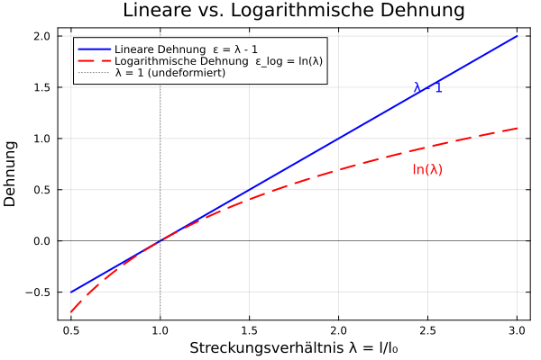
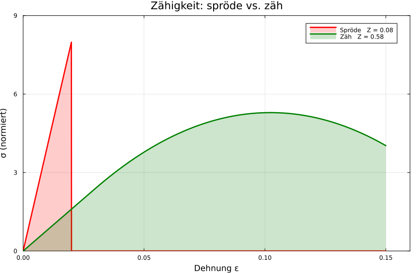
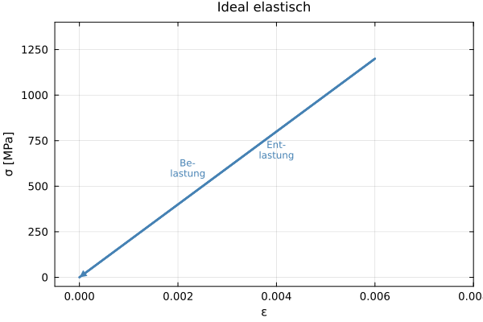
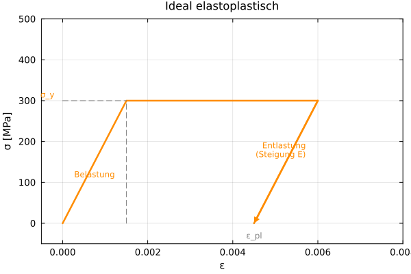
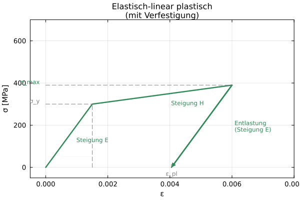
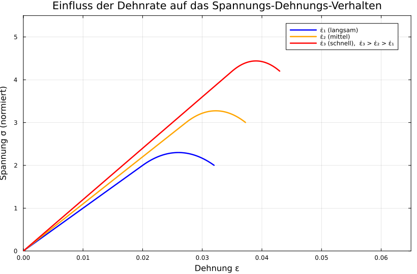

## Werkstofftechnik II
### Dehnungsmaße, Zähigkeit und Spannungs-Dehnungs-Verhalten

Prof. Dr.-Ing. Christian Willberg

Kontakt: christian.willberg@h2.de

---
<!--paginate: true-->

## Lernziele dieser Vorlesung

- Ingenieurdehnung vs. wahre (logarithmische) Dehnung unterscheiden und umrechnen
- Brucheinschnürung berechnen und interpretieren
- Zähigkeit aus Spannungs-Dehnungs-Kurven bestimmen
- Verschiedene Typen von Spannungs-Dehnungs-Kurven erkennen und zuordnen
- Einfluss der Dehnrate auf das Werkstoffverhalten verstehen

---

## Überblick

1. **Ingenieurdehnung** 
2. **Wahre Dehnung** (logarithmische Dehnung)
3. **Brucheinschnürung**
4. **Zähigkeit**
5. **Typen von Spannungs-Dehnungs-Kurven**
6. **Dehnrate**
7. **Rechenbeispiele & Zusammenfassung**

---

## 1. Ingenieurdehnung

Die technische (Ingenieur-) Dehnung ist definiert als:

$$\varepsilon = \frac{\Delta l}{l_0} = \frac{l - l_0}{l_0}$$

- $l_0$ = Ausgangslänge
- $l$ = aktuelle Länge
- $\Delta l$ = Längenänderung

**Ingenieurspannung:**

$$\sigma = \frac{F}{A_0}$$

$A_0$ = ursprünglicher Querschnitt (konstant angenommen)

---

## Ingenieurspannung – Warum $A_0$ in vielen Fällen ausreicht

Bei uniaxialem Zug schrumpft der Querschnitt durch die **Querkontraktion** ($\nu = 0{,}33$):

$$\varepsilon_q = -\nu \cdot \varepsilon \qquad \Rightarrow \qquad A = A_0\,(1 - \nu\,\varepsilon)^2$$

Die **wahre Spannung** (mit aktuellem Querschnitt) ist daher:

$$\sigma_w = \frac{F}{A} = \frac{\sigma_\text{Ing}}{(1-\nu\,\varepsilon)^2}$$

---

## Nachweis: Fehler bei $\varepsilon = 1\,\%$

$$\sigma_w = \frac{\sigma_\text{Ing}}{(1 - 0{,}33 \cdot 0{,}01)^2} = \frac{\sigma_\text{Ing}}{(0{,}9967)^2} = \frac{\sigma_\text{Ing}}{0{,}9934} \approx 1{,}0066 \cdot \sigma_\text{Ing}$$

**Relativer Fehler:**

$$\frac{\sigma_w - \sigma_\text{Ing}}{\sigma_\text{Ing}} \cdot 100\,\% = \frac{1}{(1-\nu\varepsilon)^2} - 1 \approx 0{,}66\,\%$$

> **Fazit:** Bei $\varepsilon = 1\,\%$ ist der Fehler durch die Nutzung von $A_0$ kleiner als $1\,\%$ → **vernachlässigbar** ✓

---

## Relativer Fehler als Funktion der Dehnung

| $\varepsilon$ | $A/A_0$ | $\sigma_w/\sigma_\text{Ing}$ | Rel. Fehler |
|:---:|:---:|:---:|:---:|
| 0,1 % | 99,93 % | 1,00066 | 0,07 % |
| 0,5 % | 99,67 % | 1,00330 | 0,33 % |
| **1,0 %** | **99,34 %** | **1,00663** | **0,66 %** |
| 2,0 % | 98,68 % | 1,01330 | 1,33 % |
| 5,0 % | 96,72 % | 1,03394 | 3,39 % |
| 10,0 % | 93,69 % | 1,06765 | 6,77 % |

> Im **elastischen Bereich** der meisten Metalle ($\varepsilon < 1\,\%$) ist $\sigma = F/A_0$ eine hervorragende Näherung.

---

## Grenzen der Ingenieurdehnung

| Eigenschaft | Ingenieurdehnung | Wahre Dehnung |
|---|---|---|
| Bezugslänge | $l_0$ (fest) | aktuell (variabel) |
| Gültigkeitsbereich | kleine Deformationen | große Deformationen |
| Additivität | ✗ | ✓ |
| Physikalische Korrektheit | begrenzt | höher |

**Problem:** Bei großen Deformationen (Umformung, Bruchuntersuchung) liefert $\varepsilon$ verfälschte Ergebnisse.

---

## 2. Wahre Dehnung (logarithmische Dehnung)

### Herleitung

Die wahre (logarithmische) Dehnung berücksichtigt die **aktuelle** Länge als Bezugsgröße:

$$d\varphi = \frac{dl}{l}$$

Integration von $l_0$ bis $l$:

$$\varphi = \int_{l_0}^{l} \frac{dl}{l} = \ln\left(\frac{l}{l_0}\right)$$

---

## Wahre Dehnung – Formel und Umrechnung

$$\boxed{\varphi = \ln\left(\frac{l}{l_0}\right) = \ln(1 + \varepsilon)}$$

**Umgekehrt:**

$$\varepsilon = e^{\varphi} - 1$$

**Wichtige Eigenschaft – Additivität:**

Zwei aufeinanderfolgende Dehnungen $\varphi_1$ und $\varphi_2$ addieren sich:

$$\varphi_{ges} = \varphi_1 + \varphi_2 = \ln\frac{l_1}{l_0} + \ln\frac{l_2}{l_1} = \ln\frac{l_2}{l_0}$$

---

## Rechenbeispiel – Wahre vs. Ingenieurdehnung

**Gegeben:** Zugprobe, $l_0 = 100\,\text{mm}$

**Gesucht:** Ingenieurdehnung und wahre Dehnung für $l = 120\,\text{mm}$

**Lösung:**

$$\varepsilon = \frac{l - l_0}{l_0} = \frac{120 - 100}{100} = 0{,}20 = 20\,\%$$

$$\varphi = \ln\left(\frac{l}{l_0}\right) = \ln\left(\frac{120}{100}\right) = \ln(1{,}2) = 0{,}182 = 18{,}2\,\%$$

**Differenz:** $\varepsilon - \varphi = 1{,}8\,\%$ → bei kleinen Dehnungen vernachlässigbar, bei großen signifikant!

---

## Kleine Dehnungen – wahre ≈ Ingenieurdehnung

**Taylor-Entwicklung** von $\varphi = \ln(1+\varepsilon)$ um $\varepsilon = 0$:

$$\varphi = \varepsilon - \frac{\varepsilon^2}{2} + \frac{\varepsilon^3}{3} - \cdots$$

Für $\varepsilon \ll 1$ dominiert der erste Term → $\varphi \approx \varepsilon$

> **Faustregel:** Für $\varepsilon < 5\,\%$ ist $\varphi \approx \varepsilon$ mit Fehler $< 2{,}5\,\%$ → im elastischen Bereich der meisten Metalle vernachlässigbar.

---

---

## Rechenbeispiel 2 – Additivität der wahren Dehnung

**Stufenumformung:** Stab wird in zwei Schritten gestreckt.

- Schritt 1: $l_0 = 100\,\text{mm} \rightarrow l_1 = 120\,\text{mm}$
- Schritt 2: $l_1 = 120\,\text{mm} \rightarrow l_2 = 150\,\text{mm}$

**Wahre Dehnung:**

$$\varphi_1 = \ln\frac{120}{100} = 0{,}182$$

$$\varphi_2 = \ln\frac{150}{120} = 0{,}223$$

$$\varphi_{ges} = \varphi_1 + \varphi_2 = 0{,}405 = \ln\frac{150}{100}\,✓$$

**Ingenieurdehnung ist NICHT additiv:** $\varepsilon_1 + \varepsilon_2 = 0{,}20 + 0{,}25 = 0{,}45 \neq \varepsilon_{ges} = 0{,}50$

---

## Wahre Spannung

Bei plastischer Verformung bleibt das Volumen konstant (Inkompressibilität):

$$A_0 \cdot l_0 = A \cdot l \quad \Rightarrow \quad A = \frac{A_0 \cdot l_0}{l}$$

**Wahre Spannung:**

$$\sigma_w = \frac{F}{A} = \frac{F}{A_0} \cdot \frac{l}{l_0} = \sigma \cdot (1 + \varepsilon)$$

> Nach dem Erreichen der Zugfestigkeit ($F_{max}$) steigt $\sigma_w$ weiter an, obwohl die Kraft abnimmt – der Querschnitt nimmt stark ab (Einschnürung).

---

## Brucheinschnürung

Die **Brucheinschnürung** $Z$ beschreibt die Querschnittsabnahme beim Bruch:

$$\boxed{Z = \frac{A_0 - A_u}{A_0} \cdot 100\,\%}$$

- $A_0$ = Ausgangsquerschnitt
- $A_u$ = Querschnitt an der Bruchstelle

---

**Kennwert für Duktilität** – je größer $Z$, desto duktiler der Werkstoff.

| Werkstoff | Typisches $Z$ |
|---|---|
| Baustahl S235 | 50–65 % |
| Aluminium (weich) | 60–75 % |
| Grauguss | < 5 % |
| Hochfeste Stähle | 20–40 % |

---

## Zusammenhang: Brucheinschnürung & wahre Dehnung

Aus der Volumenkonstanz folgt:

$$\frac{A_0}{A_u} = \frac{l_u}{l_0}$$

Die wahre Bruchdehnung lässt sich aus $Z$ berechnen:

$$\varphi_u = \ln\frac{A_0}{A_u} = \ln\frac{1}{1 - Z}$$

$$\varepsilon_{\text{Ing, Bruch}} = \frac{l_u - l_0}{l_0}$$

---

## Rechenbeispiel – Brucheinschnürung

**Gegeben:** Zugprobe aus Stahl

- $d_0 = 10\,\text{mm}$ → $A_0 = \frac{\pi}{4}(10)^2 = 78{,}54\,\text{mm}^2$
- $d_u = 7\,\text{mm}$ → $A_u = \frac{\pi}{4}(7)^2 = 38{,}48\,\text{mm}^2$

**Brucheinschnürung:**

$$Z = \frac{78{,}54 - 38{,}48}{78{,}54} \cdot 100\,\% = \frac{40{,}06}{78{,}54} \cdot 100\,\% \approx 51\,\%$$

**Wahre Bruchdehnung:**

$$\varphi_u = \ln\frac{1}{1 - 0{,}51} = \ln\frac{1}{0{,}49} = \ln(2{,}04) \approx 0{,}713$$

---

## Zähigkeit

**Zähigkeit** $w$ ist die Fähigkeit eines Werkstoffs, Energie bis zum Bruch zu absorbieren.

$$\boxed{w = \int_0^{\varepsilon_B} \sigma \, d\varepsilon \quad \left[\frac{\text{J}}{\text{mm}^3}\right] = \left[\text{N/mm}^2\right]}$$

> Zähigkeit = **Fläche unter der Spannungs-Dehnungs-Kurve**

**Unterschied zu Festigkeit und Duktilität:**

- Festigkeit → maximale Spannung
- Duktilität → maximale Dehnung
- Zähigkeit → Produkt beider → Energie

---

## Zähigkeit – Einteilung

| Werkstoff | Zähigkeit | Festigkeit | Duktilität |
|---|---|---|---|
| Gummi | mittel | gering | sehr hoch |
| Stahl (zäh) | hoch | mittel | hoch |
| Keramik | gering | hoch | gering |
| Hochfester Stahl | mittel | sehr hoch | gering |

---

## Rechenbeispiel – Zähigkeit (vereinfacht)

**Gegeben:** Bilineares Spannungs-Dehnungs-Diagramm

- Elastischer Bereich: $\sigma_E = 200\,\text{MPa}$, $\varepsilon_E = 0{,}001$
- Plastischer Bereich bis Bruch: $\sigma_B = 400\,\text{MPa}$, $\varepsilon_B = 0{,}20$

**Berechnung (trapezförmige Näherung):**

$$w = \underbrace{\frac{1}{2} \cdot 200 \cdot 0{,}001}_{\text{elastisch}} + \underbrace{\frac{200 + 400}{2} \cdot (0{,}20 - 0{,}001)}_{\text{plastisch}}$$

$$w = 0{,}10 + 59{,}7 = 59{,}8\,\frac{\text{N}}{\text{mm}^2}$$

---
# Materialmodelle: Spannungs-Dehnungs-Verhalten mit Entlastung

Die folgenden drei Modelle beschreiben idealisiertes Werkstoffverhalten
und werden in der Strukturmechanik und Plastizitätstheorie als
Grundmodelle eingesetzt.

tbd bilder einfügen

---

## Ideal elastisch

Das ideal elastische Modell beschreibt einen Werkstoff, bei dem
**Be- und Entlastung auf exakt derselben Geraden** verlaufen.
Die Kurve ist eine einzige Ursprungsgerade mit der Steigung $E$ (Elastizitätsmodul).
Es gibt keinerlei plastische Verformung – nach Entlastung kehrt der Werkstoff
vollständig in seinen Ausgangszustand zurück.

---

$$\sigma = E \cdot \varepsilon$$

Der Pfeil auf der Entlastungslinie zeigt, dass die Kurve denselben Weg zurückläuft.
Dieses Modell gilt für alle realen Werkstoffe **unterhalb der Streckgrenze**.

---

## Ideal elastoplastisch

Das ideal elastoplastische Modell kombiniert einen linearen elastischen
Bereich mit einem **horizontalen Fließplateau**:

1. **Elastischer Ast** – linearer Anstieg mit Steigung $E$ bis zur Streckgrenze $\sigma_y$.
2. **Plastisches Fließen** – bei $\sigma_y$ bleibt die Spannung konstant,
   die Dehnung nimmt beliebig zu (ideal-plastisch, keine Verfestigung).
3. **Entlastung** – die Entlastungsgerade verläuft **parallel zur elastischen Geraden**
   (gleiche Steigung $E$), da nur der elastische Anteil zurückgeht.
   Die **plastische Dehnung $\varepsilon_{pl}$** bleibt als bleibende Verformung erhalten.

---

$$\varepsilon_{pl} = \varepsilon_{max} - \frac{\sigma_y}{E}$$

Das Modell wird häufig für einfache Traglastberechnungen und als
Grenzwertbetrachtung eingesetzt (z.B. vollplastisches Moment).

---

## Elastisch mit linearer Verfestigung (elastisch-linear plastisch)

Dieses Modell erweitert das ideal elastoplastische Modell um einen
**linearen Verfestigungsast** nach dem Fließbeginn:

1. **Elastischer Ast** – linearer Anstieg mit Steigung $E$ bis $\sigma_y$.
2. **Verfestigungsast** – weiterer linearer Anstieg mit der flacheren Steigung
   $H$ (Verfestigungsmodul, $H \ll E$) von $\sigma_y$ bis $\sigma_{max}$.
3. **Entlastung** – wiederum parallel zum elastischen Ast (Steigung $E$),
   die plastische Dehnung $\varepsilon_{pl}$ bleibt erhalten.

$$\sigma = \sigma_y + H \cdot (\varepsilon - \varepsilon_y) \quad \text{für } \varepsilon > \varepsilon_y$$

---

$$\varepsilon_{pl} = \varepsilon_{max} - \frac{\sigma_{max}}{E}$$

Durch $H > 0$ steigt die aufnehmbare Spannung mit zunehmender Dehnung –
das Modell beschreibt kinematische oder isotrope Verfestigung und
ist die Grundlage der meisten numerischen Plastizitätsimplementierungen
(z.B. in FEM-Codes).

---

## Vergleich der drei Modelle

| Modell                     | Verfestigung | Plastische Dehnung | Typische Anwendung          |
|----------------------------|:------------:|:------------------:|:----------------------------|
| Ideal elastisch            | –            | nein               | Elastizitätsrechnung        |
| Ideal elastoplastisch      | nein         | ja                 | Traglastanalyse             |
| Elastisch-linear plastisch | linear ($H$) | ja                 | FEM, Plastizitätssimulation |
---

## 6. Dehnrate

Die **Dehnrate** (Dehngeschwindigkeit) $\dot{\varepsilon}$ beschreibt, wie schnell eine Dehnung aufgebracht wird:

$$\boxed{\dot{\varepsilon} = \frac{d\varepsilon}{dt} \quad \left[\text{s}^{-1}\right]}$$

**Typische Größenordnungen:**

| Vorgang | $\dot{\varepsilon}$ [s⁻¹] |
|---|---|
| Kriechen | $10^{-8}$ – $10^{-5}$ |
| Quasi-statischer Zugversuch | $10^{-4}$ – $10^{-2}$ |
| Umformung (Walzen, Pressen) | $10^{0}$ – $10^{2}$ |
| Crash / Impakt | $10^{2}$ – $10^{4}$ |
| Explosion | $> 10^{6}$ |

---

---

## Einfluss der Dehnrate auf das Werkstoffverhalten

**Höhere Dehnrate → höhere Fließspannung** (bei den meisten Metallen)

**Ursache:** Versetzungen können thermisch aktivierten Hindernissen bei hoher Geschwindigkeit nicht mehr „ausweichen" → Spannung muss erhöht werden.

Für viele Metalle gilt empirisch das **Cowper-Symonds-Modell:**

$$\sigma_d = \sigma_0 \left[1 + \left(\frac{\dot{\varepsilon}}{C}\right)^{1/p}\right]$$

---

## Cowper-Symonds – Materialparameter

$$\sigma_d = \sigma_0 \left[1 + \left(\frac{\dot{\varepsilon}}{C}\right)^{1/p}\right]$$

| Werkstoff | $C$ [s⁻¹] | $p$ |
|---|---|---|
| Weiches Stahl | 40,4 | 5 |
| Stahl (allg.) | 6844 | 3,91 |
| Aluminium | 6500 | 4 |

**Bei logarithmischer Dehnung gilt analog:**

$$\dot{\varphi} = \frac{d\varphi}{dt} = \frac{1}{l}\frac{dl}{dt} = \frac{v}{l}$$

---

## Rechenbeispiel 5 – Dehnrate im Zugversuch

**Gegeben:**
- Zugprobe: $l_0 = 80\,\text{mm}$
- Traversengeschwindigkeit: $v = 2\,\text{mm/min}$

**Gesucht:** Dehnrate $\dot{\varepsilon}$

**Lösung:**

$$v = 2\,\text{mm/min} = \frac{2}{60}\,\text{mm/s} = 0{,}0\overline{3}\,\text{mm/s}$$

$$\dot{\varepsilon} = \frac{v}{l_0} = \frac{0{,}0\overline{3}}{80} \approx 4{,}2 \times 10^{-4}\,\text{s}^{-1}$$

→ Typischer **quasi-statischer Zugversuch** 

---

## Rechenbeispiel – Cowper-Symonds

**Gegeben:** Weichwerkstahl ($C = 40{,}4\,\text{s}^{-1}$, $p = 5$)

- Statische Streckgrenze: $\sigma_0 = 250\,\text{MPa}$
- Dehnrate bei Crash: $\dot{\varepsilon} = 100\,\text{s}^{-1}$

**Gesucht:** Dynamische Streckgrenze $\sigma_d$

**Lösung:**

$$\sigma_d = 250 \cdot \left[1 + \left(\frac{100}{40{,}4}\right)^{1/5}\right]$$

$$= 250 \cdot \left[1 + (2{,}475)^{0{,}2}\right]$$

$$= 250 \cdot \left[1 + 1{,}199\right] = 250 \cdot 2{,}199 \approx \mathbf{550\,\text{MPa}}$$

→ Steigerung um **120 %** gegenüber statischem Wert!

---

## Zusammenfassung – Formeln im Überblick

| Größe | Formel |
|---|---|
| Ingenieurdehnung | $\varepsilon = \frac{l-l_0}{l_0}$ |
| Wahre Dehnung | $\varphi = \ln\frac{l}{l_0} = \ln(1+\varepsilon)$ |
| Wahre Spannung | $\sigma_w = \sigma(1+\varepsilon)$ |
| Brucheinschnürung | $Z = \frac{A_0 - A_u}{A_0}$ |
| Wahre Bruchdehnung | $\varphi_u = \ln\frac{1}{1-Z}$ |
| Zähigkeit | $w = \int_0^{\varepsilon_B}\sigma\,d\varepsilon$ |
| Dehnrate | $\dot{\varepsilon} = \frac{v}{l_0}$ |
| Cowper-Symonds | $\sigma_d = \sigma_0\left[1+\left(\frac{\dot{\varepsilon}}{C}\right)^{1/p}\right]$ |

---

## Lernkontrolle – Fragen

1. Warum ist die wahre Dehnung bei großen Verformungen besser geeignet als die Ingenieurdehnung?
2. Ein Stab wird auf $\varepsilon = 0{,}50$ gedehnt. Wie groß ist $\varphi$?
3. Was sagt die Brucheinschnürung $Z = 0$ über einen Werkstoff aus?
4. Welcher Werkstofftyp hat hohe Zähigkeit trotz mittlerer Festigkeit?
5. Ein Zugversuch läuft mit $v = 5\,\text{mm/min}$ und $l_0 = 50\,\text{mm}$. Berechnen Sie $\dot{\varepsilon}$.
6. Warum steigt die wahre Spannung nach dem Kraftmaximum noch an?

---

## Lernkontrolle – Antworten

1. Wahre Dehnung ist additiv und bezieht sich auf die aktuelle Länge → physikalisch korrekt bei großen Deformationen.
2. $\varphi = \ln(1+0{,}50) = \ln(1{,}5) = 0{,}405$
3. $Z = 0$ → kein Querschnittsverlust → sprödes Versagen, keine Duktilität.
4. Zähe Stähle (z.B. S235) – mittlere Festigkeit, hohe Bruchdehnung → große Fläche.
5. $\dot{\varepsilon} = \frac{5/60}{50} = 1{,}67 \times 10^{-3}\,\text{s}^{-1}$
6. Trotz abnehmender Kraft nimmt der Querschnitt noch stärker ab → $\sigma_w = F/A$ steigt.

---

# Rechercheaufgabe

- Wie sieht eine mehrdimensionale Dehnung aus?
- Wieviele Dehnungen gibt es in 2D und in 3D?

