<!-- _class: title -->

# Zerstörungsfreie Prüfung
**Sichtprüfung · Durchstrahlungsprüfung 
Ultraschallprüfung**
### Grundlagen

Prof. Dr.-Ing. Christian Willberg
Hochschule Magdeburg-Stendal

 

---

## Einordnung: Die klassischen ZfP-Verfahren

- **VT** — Visual Testing (Sichtprüfung)
- **RT** — Radiographic Testing (Durchstrahlungsprüfung)
- **UT** — Ultrasonic Testing (Ultraschallprüfung)
- **MT** — Magnetic Particle Testing (Magnetpulverprüfung)
- **PT** — Penetrant Testing (Eindringprüfung)
- **ET** — Eddy Current Testing (Wirbelstromprüfung)

> Definition ZfP (in Anlehnung an DIN EN ISO 17025): technischer Vorgang zur Bestimmung von Qualitätskennwerten eines Werkstoffs, bei dem Energie mit dem Material wechselwirkt, **ohne** dessen Gebrauchseigenschaften unzulässig zu beeinträchtigen.

---

<!-- _class: title -->

# Teil 1 — Sichtprüfung (VT)
## Grundlagen

- VT (**V**isual **T**esting) ist eines der klassischen ZfP-Verfahren neben RT, UT, MT, ET, PT
- Definition ZfP (in Anlehnung an DIN EN ISO 17025): technischer Vorgang zur Bestimmung von Qualitätskennwerten, bei dem Energie mit dem Werkstoff wechselwirkt, **ohne** dessen Gebrauchsverhalten unzulässig zu beeinträchtigen
- Mit **EN 473** (heute DIN EN ISO 9712) wurde VT als eigenständiges, **qualifikationspflichtiges** Prüfverfahren anerkannt

> ⚠️ Der weitverbreitete Irrglaube "Wer sehen kann, kann auch sichtprüfen" wurde durch die Normung gezielt widerlegt.

---

# Das Prüfsystem der Sichtprüfung

<!-- _class: cols-2 -->

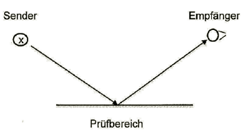

**Sender – Prüfbereich – Empfänger**, verbunden über ein Medium:

- **Sender:** Lichtquelle (Leuchtdichte, Fokussierung, Farbtemperatur, gerichtet/ungerichtet)
- **Prüfbereich:** Werkstoff, Oberflächenzustand, Beleuchtungs-/Betrachtungsrichtung, Prüfmerkmale
- **Empfänger:** Auge, ggf. unterstützt durch Lupe, oder Sensor (CCD-Chip, Kamera, Vidicon)
- **Medium:** meist Luft, bei Endoskopen auch Glasfaser oder Flüssigkeit

 
    Abb. 1.1 aus K. Schiebold "Zerstörungsfreie Werkstoffprüfung – Sichtprüfung"

---

# Direkte und indirekte Sichtprüfung

<!-- _class: cols-2 -->

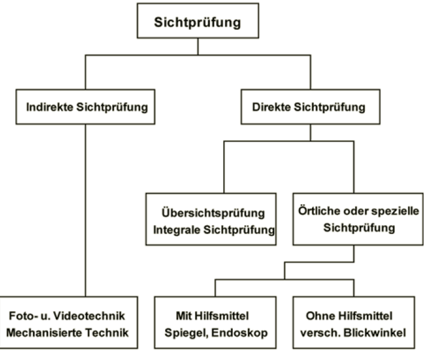

Unterscheidung nach DIN EN 13018 anhand des Strahlengangs:

- **Direkte Sichtprüfung** — ungestörter Strahlengang Auge–Prüffläche
- **Indirekte Sichtprüfung** — unterbrochener Strahlengang (Spiegel, Endoskop, Kamera)

Unterscheidung nach Prüftiefe:
- **Allgemeine/integrale Sichtprüfung** — Übersicht, Gesamteindruck
- **Spezielle Sichtprüfung** — gezielte Prüfmerkmale, definierte Bedingungen

 
    Abb. 1.2 aus K. Schiebold "Zerstörungsfreie Werkstoffprüfung – Sichtprüfung"

---

# Ablauf einer Sichtprüfung

1. **Erfassung/Definition des Prüfproblems** — Bestellunterlagen, Prüfziel, Zugänglichkeit, Dokumentationsumfang
2. **Prüfplanung** — Auswahl allgemeine oder spezielle VT, Prüfbereiche, Technik, Bedingungen
3. **Prüfdurchführung & Dokumentation** — gemäß Prüfanweisung, Protokollierung, Reproduzierbarkeit

> ✅ Allgemeine VT: Beleuchtungsstärke ≥ 150 lx (ASME-Code Sect. V, Art. 9)
> ✅ Spezielle VT: Beleuchtungsstärke ≥ 500 lx

---

# Physik des Lichts (I) — Wellenlänge & Ausbreitung

- Sichtbares Licht: $\lambda \approx 380\text{–}780\ \text{nm}$, Doppelcharakter (elektromagnetische Welle **und** Photonenstrom)
- Ausbreitungsgeschwindigkeit im Vakuum: $c_0 \approx 300\,000\ \text{km/s}$

$$C = \lambda \cdot f \qquad n_{\text{Medium}} = \frac{C_0}{C_{\text{Medium}}}$$

- Reflexion an Spiegeln/blanken Oberflächen: **Einfallswinkel = Ausfallswinkel**
- Raue Oberflächen: **diffuse Reflexion**; Reflexion in Vorzugsrichtung: **Streuung**

---

# Reflexion und Streuung

<!-- _class: cols-2 -->

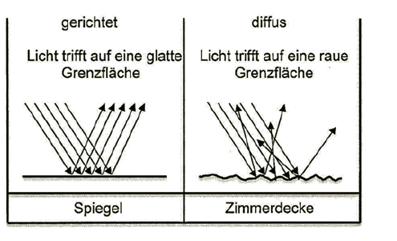

- Blanke/polierte Oberflächen: **Spiegelung**, gerichtete Reflexion
- Raue Oberflächen (Textilien, Papier): **diffuse Reflexion**, ungerichtet in alle Richtungen
- Reflexionsverlust wellenlängenabhängig: bei 500 nm ca. 8 % an Al-Spiegelschicht, nur 3 % an Silber

 
    Abb. 2.1 aus K. Schiebold "Zerstörungsfreie Werkstoffprüfung – Sichtprüfung"

---

# Lichtbrechung und Linsen

<!-- _class: cols-2 -->

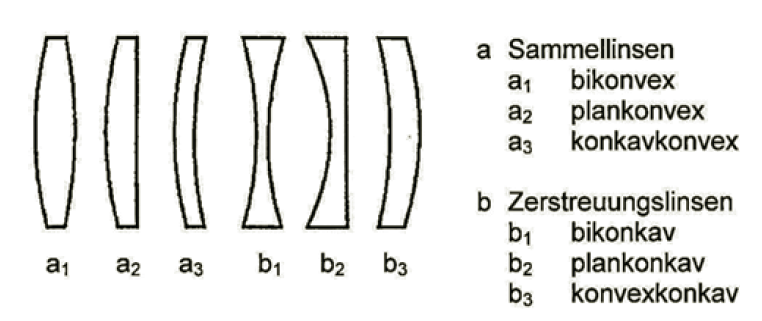

**Snelliussches Brechungsgesetz:**

$$\frac{\sin\alpha_1}{\sin\alpha_2} = \frac{C_1}{C_2}$$

- Übergang in optisch dichteres Medium → Brechung zum Lot hin
- **Sammellinsen** (konvex) → Vergrößerung
- **Zerstreuungslinsen** (konkav) → Verkleinerung
- Fehlerquellen: sphärische und chromatische Aberration
- Bei planparallelen Platten: seitlicher Versatz (**Doppelbrechung**)

 
    Abb. 2.2 aus K. Schiebold "Zerstörungsfreie Werkstoffprüfung – Sichtprüfung"

---

# Strahlengang bei sphärischen Linsen

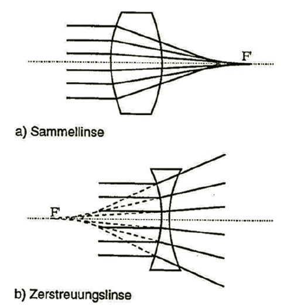

 
    Abb. 2.3 aus K. Schiebold "Zerstörungsfreie Werkstoffprüfung – Sichtprüfung"

---

# Lichtfarbe und Dispersion

- Sonnenlicht ist weiß, enthält alle Farben von rot (780–650 nm) bis violett (425–380 nm)
- **Monochromatisches** Licht: nur eine Wellenlänge (z. B. Natriumlicht)
- Lichtfarben nach Farbtemperatur: Tageslichtweiß (6000 K), Neutralweiß (4000 K), Warmweiß (3000 K)

> ⚠️ Monochromatische Lichtquellen (Natrium-, Halogen-Dampflampen) verfälschen Farben am stärksten — für die Farbbeurteilung ungeeignet!

- **Chromatische Dispersion** in Lichtwellenleitern: wellenlängenabhängige Dämpfung wie ein Tiefpassfilter

---

# Optische Abbildung und Vergrößerung

<!-- _class: cols-2 -->

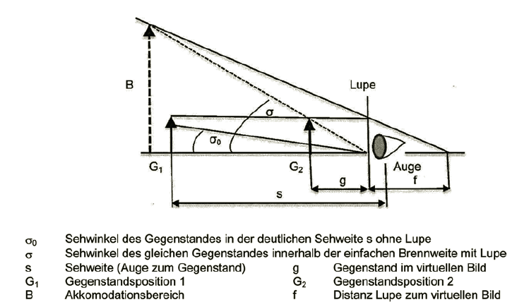

- Sehwinkel $\sigma$ wächst mit Annäherung an das Objekt
- Auflösungsgrenze des Auges: ca. **1 Bogenminute**
- Vergrößerung durch Lupe:

$$\Gamma = \frac{\tan\sigma}{\tan\sigma_0}$$

- Virtuelles Bild entsteht, wenn Objekt innerhalb der einfachen Brennweite liegt

 
    Abb. 2.4 aus K. Schiebold "Zerstörungsfreie Werkstoffprüfung – Sichtprüfung"

---

# Größen und Einheiten der Lichttechnik

| Größe | Formelzeichen | Einheit |
|---|---|---|
| Lichtstrom | Φ | Lumen (lm) |
| Beleuchtungsstärke | E | Lux (lx = lm/m²) |
| Lichtstärke | I | Candela (cd) |
| Leuchtdichte | L | cd/m² |

$$E = \frac{I}{R^2}\cos\alpha$$

Messbar per **Luxmeter**; Leuchtdichte über Aufsatzkegel

---

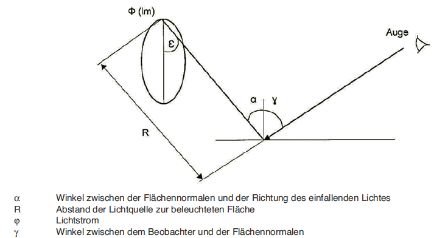

 
    Abb. 2.5 aus K. Schiebold "Zerstörungsfreie Werkstoffprüfung – Sichtprüfung"

---

# Beleuchtungs- und Betrachtungsrichtung

<!-- _class: cols-2 -->

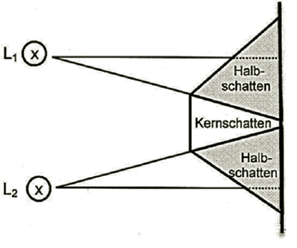

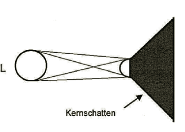

> ✅ Schräge Beleuchtung verbessert die Erkennbarkeit rauer Oberflächen durch Schattenwurf (Kontrastverbesserung) — senkrechte Beleuchtung verschlechtert sie.

 
    Abb. 2.6s und 2.7 aus K. Schiebold "Zerstörungsfreie Werkstoffprüfung – Sichtprüfung"

---

# Sehfähigkeit und Sehvermögen

<!-- _class: cols-2 -->

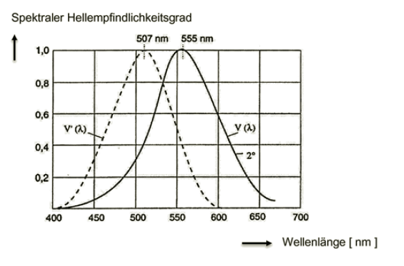

- Prüfer müssen nach **DIN EN ISO 9712** ihre Sehfähigkeit nachweisen (Jägertafel, 30 cm, Farbkontraste)
- Maximale Augenempfindlichkeit bei 555 nm, verschiebt sich bei schlechter Beleuchtung zu 507 nm
- **Akkommodation:** Scharfstellung auf unterschiedliche Entfernungen
- **Adaption:** Anpassung an Leuchtdichte (5–10 min Zäpfchen, bis 30 min Stäbchen)

 
    Abb. 2.8 aus K. Schiebold "Zerstörungsfreie Werkstoffprüfung – Sichtprüfung"

---

# Sehstörungen und ihre Korrektur

<!-- _class: cols-2 -->

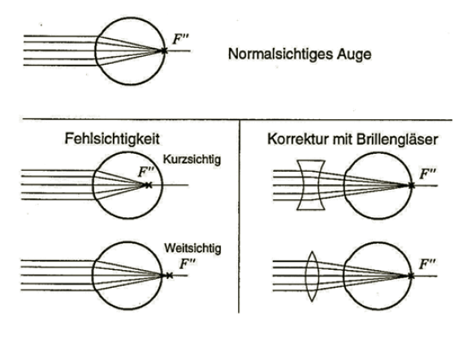

- Kurz- und Weitsichtigkeit werden per Brille korrigiert
- Ca. **10 %** der Männer eurasischer Herkunft haben eine Farbfehlsichtigkeit
- Gesichtsfeld ca. 60° (ohne Kopf-/Augenbewegung)

> ⚠️ Medikamente, Diabetes oder Augenerkrankungen können die Sehleistung zusätzlich verringern.

 
    Abb. 2.9 aus K. Schiebold "Zerstörungsfreie Werkstoffprüfung – Sichtprüfung"

---

# Beobachtungsfehler und optische Täuschungen

- Ermüdung bei monotoner, langer Prüftätigkeit
- **Parallaxenverschiebung** bei Betrachtung regelmäßiger Strukturen aus unterschiedlichen Abständen
- Blinder Fleck: Details können physiologisch "verschwinden"
- Blendung durch gerichtete Reflexion an blanken Oberflächen

> ❗ Ein Prüflos müsste statistisch **7×** geprüft werden, um alle Fehler mit annähernd 100 % Sicherheit zu erfassen. Reproduzierbare Belege (Foto, Abdruck, Video) sind daher unverzichtbar.

---

# Geräte für die allgemeine Sichtprüfung

**Maße:**
- Stahlbandmaß
- Messschieber
- Laser-Entfernungsmesser

Grundausstattung der Längenmesstechnik für Maßkontrollen im Rahmen der VT.

---

# Lupen

- Vergrößern den Sehwinkel und damit Details am Prüfstück, begrenzen aber den Sichtbereich
- Virtuelles vergrößertes Bild, wenn Objekt innerhalb der Brennweite liegt
- Praktische Obergrenze ≈ **10-fach** (sonst Ausleuchtungsprobleme)
- Üblich: 3- bis 5-fache Vergrößerung
- **Fernrohrlupe:** Zerstreuungslinse als Okular, für größere Beobachtungsabstände

---

# Lichtquellen, Lampen, Leuchten

- Glühlampen für einfache VT ohne Hilfsmittel
- Metalldampf-/Xenon-Hochdrucklampen: höherer Wirkungsgrad
- **Kaltlichtquellen** bei Endoskopie: vermeiden Übersteuerung durch Reflexionen
- **UV-Lichtquellen** für fluoreszierende PT/MT-Prüfung
- EX-geschützte Lichtquellen in explosionsgefährdeten Bereichen

---

# Kontrollspiegel

<!-- _class: cols-2 -->

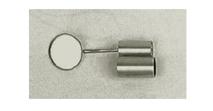

- Ermöglichen "um die Ecke sehen" bei Bohrungen, Öffnungen, Rohren
- Ebener Spiegel: Einfallswinkel = Ausfallswinkel

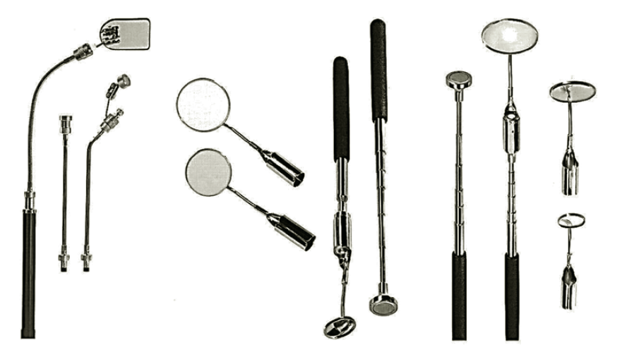

- **Konkave** Form: vergrößernd (Rasierspiegel)
- **Konvexe** Form: verkleinernd (Autospiegel)

 
    Abb. 3.7s und 3.9 aus K. Schiebold "Zerstörungsfreie Werkstoffprüfung – Sichtprüfung"

---

# Lehren

<!-- _class: cols-2 -->

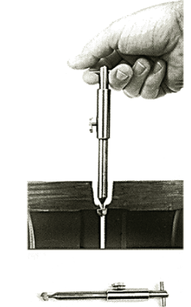

**Kantenversatzlehren** dienen der Vermessung von Versätzen an Bauteilkanten und Schweißstößen — wichtiges Hilfsmittel der allgemeinen Sichtprüfung.

 
    Abb. 3.10s aus K. Schiebold "Zerstörungsfreie Werkstoffprüfung – Sichtprüfung"

---

# Vergleichsmuster und Schweißnahtlehren

<!-- _class: cols-2 -->

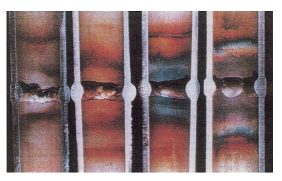

- **Anlauffarben** zeigen thermische Überlastung an (z. B. > 250 °C beim Schleifen → Rissgefahr)
- **Schweißnahtlehren** (mit Nonius) zur exakten Bestimmung von Nahtdicke und -geometrie

 
    Abb. 3.11s und 3.15 aus K. Schiebold "Zerstörungsfreie Werkstoffprüfung – Sichtprüfung"

---

# Mikroskoptechnik

- Vergrößerung 400- bis 1000-fach (Objektiv 40-fach × Okular 10-fach)
- Unterscheidung:
  - Mikroskope mit **monokularem** Einblick
  - Mikroskope mit **binokularem** Einblick
  - **Stereomikroskope**

> ✅ Sehr gut geeignet für kleinere Prüfstücke, z. B. aus der Metallographie.

---

# Endoskopie — drei Grundtypen

Sichtprüfung von Innenräumen, wenn Kontrollspiegel nicht ausreichen:

1. **Starre Endoskope** — Linsensystem, aufrechtes seitenrichtiges Bild, Modulbauweise
2. **Flexible Endoskope** — Glasfaser-Bildleiter, jede Faser überträgt einen Bildpunkt
3. **Videoendoskope** — CCD-Chip am distalen Ende, elektronische Bildübertragung

---

# Starres Endoskop — Aufbau und Blickrichtungen

<!-- _class: cols-2 -->

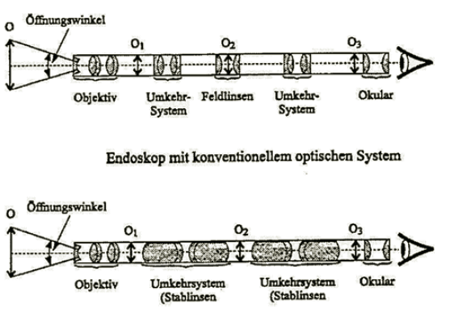

- Okular → Linsensystem → Objektiv mit Spiegel/Prismen
- Blickrichtungen: Geradeaus-, Seit-, Voraus- oder Rückblick
- Modulbauweise (z. B. 2 m-Segmente) für große Arbeitslängen
- Koppelstellen erzeugen Helligkeitsverluste

 
    Abb. 3.18s und 3.19 aus K. Schiebold "Zerstörungsfreie Werkstoffprüfung – Sichtprüfung"

---

# Flexibles Endoskop — Bildübertragung

- Bildübertragung über **Glasfaser-Bildleiter**, jede Faser = ein Bildpunkt
- Bricht eine Faser, fällt der Bildpunkt aus
- Bildleiterlängen standardmäßig bis 6 m
- Objektivspitze bei 0°-Endoskopen bis 120° schwenkbar (Bowdenzug)

> ⚠️ Geringere Bildqualität und Auflösung als beim starren Endoskop, dafür flexibler einsetzbar.

 
    Abb. 3.21 aus K. Schiebold "Zerstörungsfreie Werkstoffprüfung – Sichtprüfung"

---

# Videoendoskope

<!-- _class: cols-2 -->

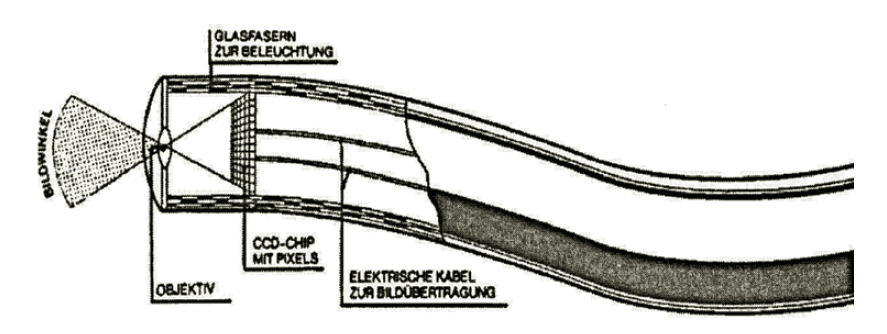

- Bildaufnahme über CCD-Chip am distalen Ende, Beleuchtung über Kaltlichtquelle oder LEDs
- CCD-Empfindlichkeitsgrenze ab ca. **10 lx**
- Beliebig lange Übertragungskabel (10–20 m) möglich
- Videoaufzeichnung (Videografie) für Schadensfalluntersuchungen

 
    Abb. 3.22s und 3.23 aus K. Schiebold "Zerstörungsfreie Werkstoffprüfung – Sichtprüfung"

---

# Detailgrößenbestimmung bei Endoskopbildern

- Vergrößerung ist **abstandsabhängig**, nicht konstant (anders als beim Mikroskop)
- **Shadow-Probe-Methode:** zweite Sonde projiziert Referenzschatten ins Bild → Größenbestimmung
- Alternative bei einfacheren Endoskopen: federnder Prüfstift zur mechanischen Tiefenmessung

---

# Shearografie-Inspektionstechnik

<!-- _class: cols-2 -->

- Laserbeleuchtung + Bildüberlagerung zweier seitlich gescherter Bilder → Interferenz
- Erfasst Oberflächenzustand vor/nach Verformung
- Mobile Systeme: Vakuumhaube saugt sich auf der Prüffläche fest
- Einsatz z. B. bei Kleinflugzeug-Rumpfteilen, Rettungsbooten, Raumfahrt

 
   https://www.ndt.net/article/dgzfp03/papers/v49/fig6.jpg

---

# Schatten- und Stereomessung

- **Schattenmessung:** Längen-/Flächenbestimmung, z. B. Wurzelrückfall bei Schweißnähten
- **Stereomessung:** Triangulationsprinzip, z. B. Größe von Turbinenschaufel-Beschädigungen

---

# Thermografie als (erweiterte) Sichtprüfung

- Erfassung der von jeder Oberfläche > 0 K ausgehenden IR-Strahlung
- Physikalische Basis: Plancksches Strahlungsgesetz, Stefan-Boltzmann-Gesetz
- Signalkette: IR-Optik → Abtastsystem → Detektor → Signalverarbeitung → Anzeige
- **Aktiv:** zusätzliche Energiequelle erzeugt Wärmefluss
- **Passiv:** nur Eigenwärme des Objekts wird ausgewertet

---

# Infrarotkamera und Thermogramm

<!-- _class: cols-2 -->

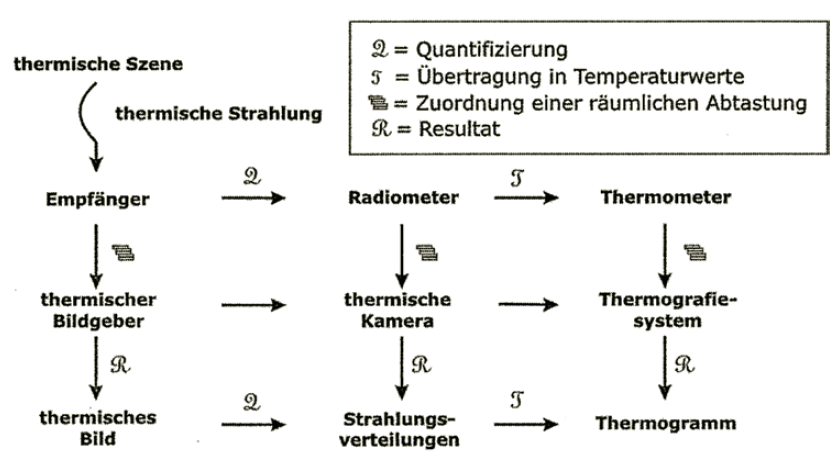

Videokameras nehmen überwiegend **reflektierte** Strahlung auf, thermische Kameras die **emittierte** Strahlung — daraus entsteht die thermische Szene als Grundlage des Thermogramms.

 
    Abb. 3.32 aus K. Schiebold "Zerstörungsfreie Werkstoffprüfung – Sichtprüfung"

---

# Fehlerarten an Schmiedestücken

<!-- _class: cols-2 -->

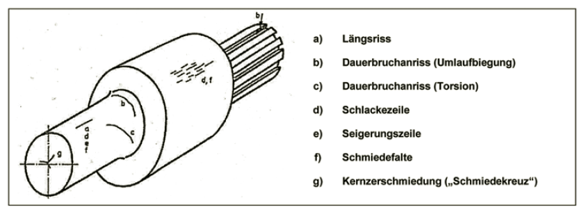
 >**Freiformschmiedestücke:** Zundereinschläge, Schmiedefalten, Überlappungen

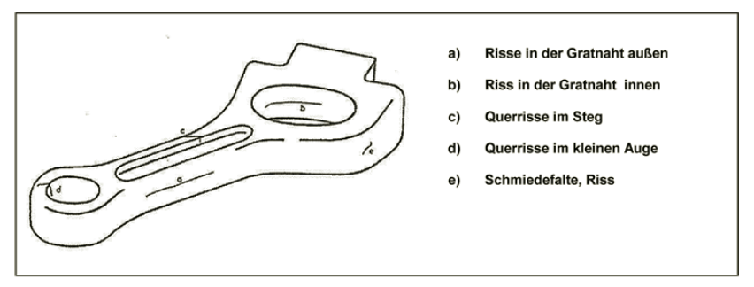
 >**Gesenkschmiedestücke:** äußere Aufbrüche, Zundereinschläge bevorzugt im Bereich der Gratnaht

 
    Abb. 4.17s und 4.18 aus K. Schiebold "Zerstörungsfreie Werkstoffprüfung – Sichtprüfung"

---

# Korrosion als Prüfmerkmal — Spannungsreihe

- **Chemische Korrosion:** Reaktion ohne leitfähigen Elektrolyt (z. B. Verzunderung)
- **Elektrochemische Korrosion:** Reaktion über Elektrolyt, richtungsbestimmend ist der elektrolytische Lösungsdruck
- **Unedle** Metalle (negatives Potenzial) korrodieren bevorzugt gegenüber **edlen**

---

# Zusammenfassung — Sichtprüfung (VT)

- VT nutzt **sichtbares Licht** als Prüfenergie — Auge oder Kamera als Empfänger
- Entscheidend: **Beleuchtung, Sehfähigkeit, Reproduzierbarkeit**
- Werkzeugpalette: Lupe, Kontrollspiegel, Endoskop, Videoendoskop, Shearografie, Thermografie
- Nachweisgrenze: nur **oberflächenoffene** Ungänzen; Grenzen über ROC-Methode quantifizierbar
- Stark regelwerksgetrieben (DIN EN ISO 9712, 17637, 5817 …)

**Nächster Schritt:** Wie prüft man, was im **Volumen** des Bauteils verborgen liegt? → Durchstrahlungsprüfung

---

<!-- _class: title -->

# Teil 2 — Durchstrahlungsprüfung (RT)
## Grundlagen

- RT (**R**adiographic **T**esting) neben UT, MT, PT, VT, ET eines der klassischen ZfP-Verfahren
- Nutzt **Röntgen-** oder **Gammastrahlung** — kurzwellige, ionisierende elektromagnetische Strahlung
- Durchdringt undurchsichtige feste Werkstoffe und macht **volumenhafte innere Ungänzen** sichtbar
- Bekannt seit Röntgens Entdeckung 1895

> ⚠️ Ungänzen mit freier Grenzfläche sind zunächst nur physikalisch beschrieben — erst die Bewertung nach Regelwerk macht daraus einen zulässigen oder unzulässigen "Fehler".

---

# Erzeugung der Strahlung

<!-- _class: cols-2 -->

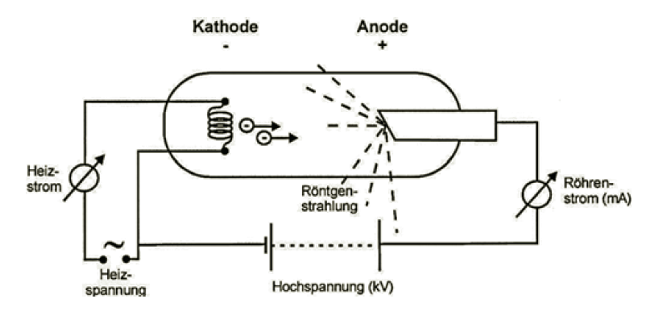

**Röntgenröhre:** Elektronen werden von Kathode zu Anode (Wolfram-Target) beschleunigt und dort abgebremst → Bremsspektrum + charakteristische Strahlung. Wirkungsgrad bei 200 kV nur ca. 1 %!

**Gammastrahlung:** entsteht durch Kernzerfall radioaktiver Isotope (Ir-192, Co-60, Se-75) → diskretes Linienspektrum, feste Energie, nicht regelbar

 
    Abb. 1.3 aus K. Schiebold "Zerstörungsfreie Werkstoffprüfung – Durchstrahlungsprüfung"

---

# Strahlungsspektrum

<!-- _class: cols-2 -->

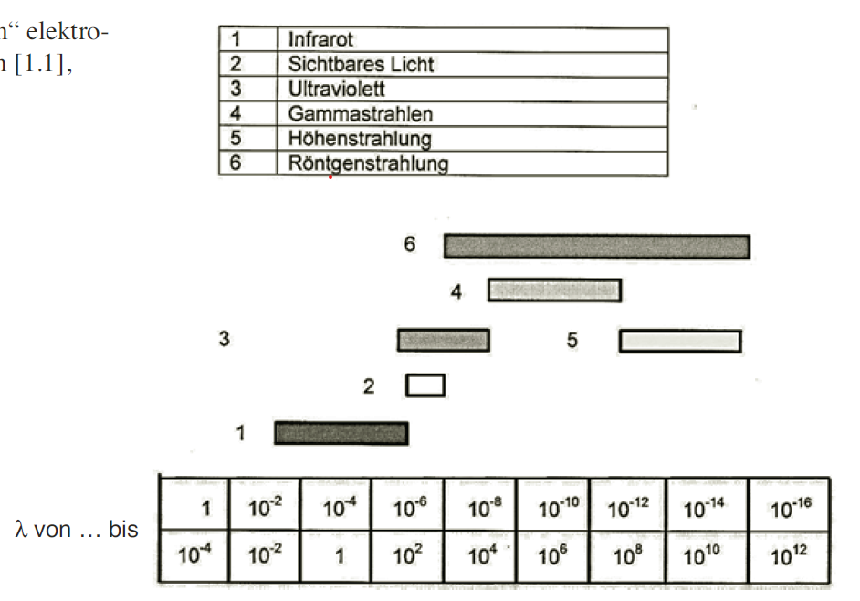

Röntgen-/Gammastrahlung: Energiebereich ca. 10 keV (weich) bis 100 MeV (ultrahart). Defektoskopie mit Isotopen: ca. 200 keV bis 1,2 MeV; mit Röntgenröhren: 100–450 keV, mit Beschleunigern bis 15–30 MeV.

 
    Abb. 1.1 aus K. Schiebold "Zerstörungsfreie Werkstoffprüfung – Durchstrahlungsprüfung"

---

# Dosis, Dosisleistung, Strahlenschutzgrenzwerte

- **Dosis** $H$ in Sievert (Sv); **Dosisleistung** $H^* = H/t$ in Sv/h
- Grenzwert effektive Dosis: **1 mSv/Jahr** (Bevölkerung), **20 mSv/Jahr** (beruflich strahlenexponiert)
- **Abstandsquadratgesetz:** Dosisleistung nimmt mit dem Quadrat der Entfernung ab

$$H^* = \Gamma \cdot \frac{A}{a^2}$$

> ❗ Verdopplung des Abstands → Dosisleistung sinkt auf ein Viertel. Das ist die physikalische Basis für den Strahlenschutz durch **Abstand**.

---

# Das Schwächungsgesetz

<!-- _class: cols-2 -->

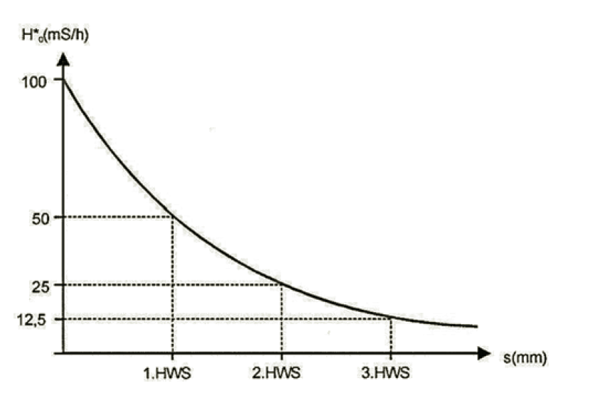

$$H^* = H_0^* \cdot e^{-\mu \cdot s}$$

- $\mu$ = Schwächungskoeffizient (materialabhängig)
- $s$ = Wanddicke
- Ungänzen (Hohlräume) schwächen weniger stark → höhere Reststrahlung → dunklerer Bereich auf dem Film
- **Halbwertsschicht (HWS):** Dicke, nach der sich die Dosisleistung halbiert

 
    Abb. 2.2 aus K. Schiebold "Zerstörungsfreie Werkstoffprüfung – Durchstrahlungsprüfung"

---

# Schwächungsmechanismen

- **Absorption (Photoeffekt):** Photon überträgt seine gesamte Energie auf ein Elektron — dominiert bei niedriger Energie, hoher Ordnungszahl
- **Streuung (Compton-Effekt):** Photon gibt nur einen Teil seiner Energie ab und ändert die Richtung — Ursache der unerwünschten **Streustrahlung**
- **Paarbildung:** ab Energien > 1,02 MeV, bildet Elektron-Positron-Paare

$$\mu = \tau + \sigma + \pi$$

> ⚠️ Streustrahlung verschlechtert die Bildqualität, erhöht die Grundschwärzung und überdeckt kleine Ungänzen — sie muss durch **Folien, Blenden und Filter** reduziert werden.

---

# Spezifischer Kontrast

- Für den Fehlernachweis entscheidend: möglichst **große Schwächung**, aber **geringe Streustrahlung**

$$C_{sp} = \frac{\mu}{1+k}$$

- $k$ = Streuverhältnis (Aufbaufaktor $1+k$)
- Kompromiss: bei kleinen Wanddicken sind niedrige Energien (Röhre) günstiger, bei großen Wanddicken hohe Energien (Co-60, Beschleuniger)

> ✅ Der spezifische Kontrast ist die zentrale Größe zur Auswahl der richtigen Strahlenquelle für eine gegebene Wanddicke.

---

# Röntgen- vs. Gammastrahler — Vergleich

| Kriterium | Röntgenröhre | Gammastrahler (Isotop) |
|---|---|---|
| Energie | regelbar (kV, mA) | fest, isotopabhängig |
| Netzabhängigkeit | ja | nein (Feldeinsatz) |
| Dosisleistung | hoch | geringer |
| Strahlenschutz | Anlage ausschaltbar | dauerhaft strahlend |

> ⚠️ Gammastrahler senden **kontinuierlich** — auch außerhalb der Prüfung. Deshalb erfordern Arbeitsbehälter besondere Sicherheitseinrichtungen gegen unbeabsichtigtes Öffnen.

---

# Filme, Folien, digitale Detektoren

- **Röntgenfilm:** Trägermaterial + Silberbromid-Emulsion, latentes Bild wird durch Entwickeln sichtbar gemacht
- **Verstärkerfolien** (meist Blei): reduzieren Streuverhältnis, erhöhen aber die innere Unschärfe
- **Digitale Verfahren:**
  - **Speicherfolien (Computerradiografie, CR):** wiederverwendbar, Laser-Auslesung
  - **Flachdetektoren (Digitale Radiografie, DR):** amorphes Silizium/Selen, Sofortbild
  - **Computertomografie (CT):** 3D-Volumenrekonstruktion aus vielen Einzelaufnahmen

---

# Bildgüteprüfkörper (BPK)

<!-- _class: cols-2 -->

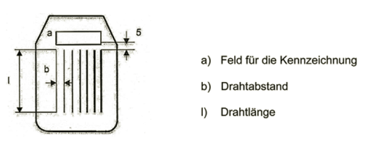

- Weist die erreichte **Bildgüte** einer Aufnahme nach (DIN EN ISO 19232)
- **Drahtsteg-BPK:** 19 Drähte abgestufter Dicke — Bildgütezahl = Nummer des dünnsten noch erkennbaren Drahts
- **Stufe-Loch-BPK:** Stufenkeil mit Bohrungen
- Wird strahlerseitig (filmfern) auf das Prüfstück gelegt — ungünstigste Position

 
    Abb. 6.13 aus K. Schiebold "Zerstörungsfreie Werkstoffprüfung – Durchstrahlungsprüfung"

---

# Aufbau einer Schweißnaht — Prüfrelevanz

<!-- _class: cols-2 -->

- Wärmeeinflusszone (WEZ) neben dem Schweißgut ist mitzuprüfen (typ. 10 mm beidseitig)
- RT weist v. a. **Volumenfehler** gut nach: Poren, Schlacke, Lunker
- **Flächenhafte Fehler** (Risse, Bindefehler) nur erkennbar, wenn ihre Ebene nahezu **parallel zum Strahl** liegt

 
    Abb. 13.2 aus K. Schiebold "Zerstörungsfreie Werkstoffprüfung – Durchstrahlungsprüfung"

---

# Typische Schweißnahtfehler im Durchstrahlungsbild

<!-- _class: cols-2 -->

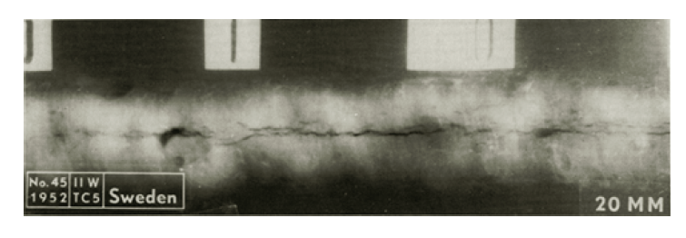
**Längsriss** — dunkle, feine Linie in Nahtrichtung

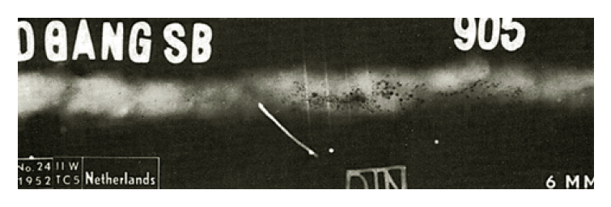
**Porennester** — rundliche, dunkle Anzeigen gehäuft auftretend
Bewertung: rundliche vs. längliche Anzeigen getrennt beurteilen

 
    Abb. 13.9 und 13.18 aus K. Schiebold "Zerstörungsfreie Werkstoffprüfung – Durchstrahlungsprüfung"

---

# Regelwerke und Bewertung (Kurzüberblick)

- **DIN EN ISO 17636-1/-2** — Durchstrahlungsprüfung von Schweißverbindungen (Film / digitale Detektoren)
- **DIN EN 12681** — Durchstrahlungsprüfung von Gussstücken
- **DIN EN ISO 5817 / 10042** — Bewertungsgruppen B/C/D für Schweißnahtunregelmäßigkeiten
- **ASME-Code Sect. V** — amerikanisches Pendant, eigenständige Penetrameter-Systematik

> ✅ Merksatz: Verfahrensbezogene Normen regeln die **Prüftechnik** (wie wird geprüft), objektbezogene Normen regeln die **Zulässigkeit** (was ist erlaubt).

---

# Zusammenfassung — Durchstrahlungsprüfung (RT)

- RT nutzt Röntgen-/Gammastrahlung, ausgewertet über das **Schwächungsgesetz** $H^* = H_0^* e^{-\mu s}$
- Nachweis primär von **Volumenfehlern**; Rissnachweis stark orientierungsabhängig
- Bildqualität wird über **Bildgüteprüfkörper** quantifiziert und genormt
- Streustrahlung ist der Hauptfeind der Bildqualität — Filter, Blenden, Folien wirken entgegen
- Strahlenschutz (Abstand – Abschirmung – Aufenthaltsdauer) ist integraler Bestandteil jeder RT-Anwendung

**Nächster Schritt:** Prüfung ohne ionisierende Strahlung, mit mechanischen Wellen → Ultraschallprüfung

---

<!-- _class: title -->

# Teil 3 — Ultraschallprüfung (UT)
## Grundlagen

- UT (**U**ltrasonic **T**esting) neben RT, MT, PT, VT, ET eines der klassischen ZfP-Verfahren
- Nutzt **mechanische Wellen** oberhalb der Hörschwelle — Ausbreitung erfordert elastisch gekoppelte Materie (im Gegensatz zu elektromagnetischen Wellen)
- Wesentliche Vorteile gegenüber RT: **kein Strahlenschutz**, meist **einseitiger Zugang** ausreichend, gute Ortung von Tiefenlagen

> ⚠️ Ultraschall breitet sich nur dort aus, wo elastisch gekoppelte Massenteilchen vorhanden sind — im Vakuum ist keine Schallausbreitung möglich.

---

# Wellenlänge und Schallgeschwindigkeit

<!-- _class: cols-2 -->

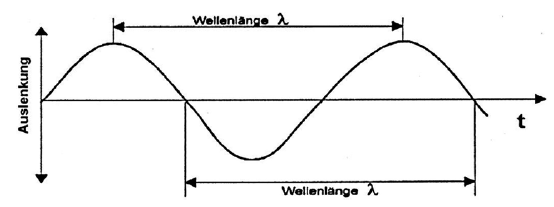

$$c = \lambda \cdot f$$

- $c$ = Schallgeschwindigkeit — eine **Materialkonstante**
- Je kleiner $\lambda$, desto kleiner die kleinste nachweisbare Unganze (Faustregel: **0,2–0,5 · $\lambda$**)
- Beispiel Stahl, $f = 2$ MHz: $\lambda \approx 3$ mm → kleinster Reflektor ca. 0,6–1,5 mm

 
    Abb. 1.2 aus K. Schiebold "Zerstörungsfreie Werkstoffprüfung – Ultraschallprüfung"

---

# Longitudinal- und Transversalwellen

<!-- _class: cols-2 -->

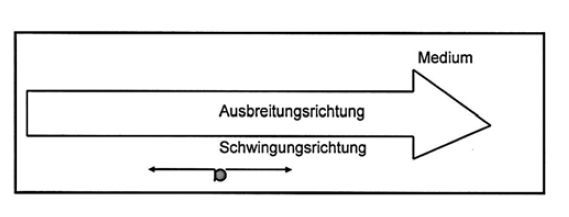

**Longitudinalwelle:** Schwingung parallel zur Ausbreitungsrichtung — breitet sich in Gasen, Flüssigkeiten und Festkörpern aus

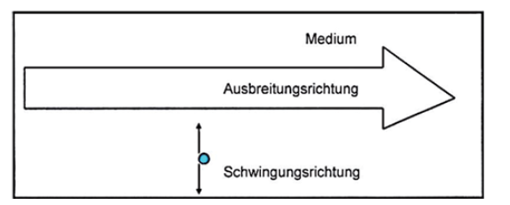

**Transversalwelle:** Schwingung senkrecht zur Ausbreitungsrichtung — nur in **Festkörpern** möglich (Gase/Flüssigkeiten übertragen keine Scherkräfte)

 
    Abb. 1.3 und 1.6 aus K. Schiebold "Zerstörungsfreie Werkstoffprüfung – Ultraschallprüfung"

---

# Oberflächen- und Plattenwellen

<!-- _class: cols-2 -->

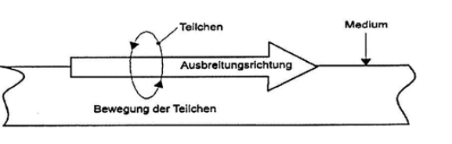

**Rayleighwelle (Oberflächenwelle):** elliptische Teilchenbewegung, Eindringtiefe ≈ 1 Wellenlänge — Nachweis von **Oberflächenrissen**, folgt auch gekrümmten Konturen

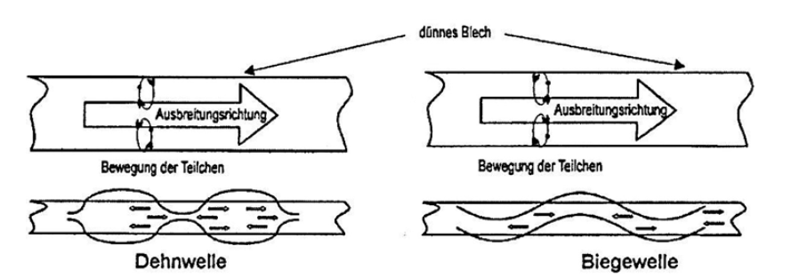

**Plattenwelle (Lambwelle):** entsteht in dünnen Blechen (< 5 mm), erfasst die komplette Wanddicke — unempfindlich für lokale Unganzen

 
    Abb. 1.7 und 1.9 aus K. Schiebold "Zerstörungsfreie Werkstoffprüfung – Ultraschallprüfung"

---

# Reflexion an senkrechten Grenzflächen

<!-- _class: cols-2 -->

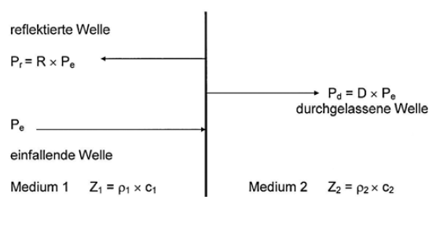

$$R = \frac{Z_2 - Z_1}{Z_2 + Z_1} \qquad D = \frac{2 Z_2}{Z_2 + Z_1}$$

- $Z = \rho \cdot c$ — **Schallwellenwiderstand**
- Grenzfläche Stahl/Luft: $R \approx 99{,}99\%$ → nahezu **Totalreflexion**
- Luft- oder gasgefüllte Risse ab ca. **10⁻⁶ cm** Dicke gut nachweisbar

 
    Abb. 1.10u aus K. Schiebold "Zerstörungsfreie Werkstoffprüfung – Ultraschallprüfung"

---

# Reflexion, Brechung und Wellenumwandlung bei Schrägeinfall

<!-- _class: cols-2 -->

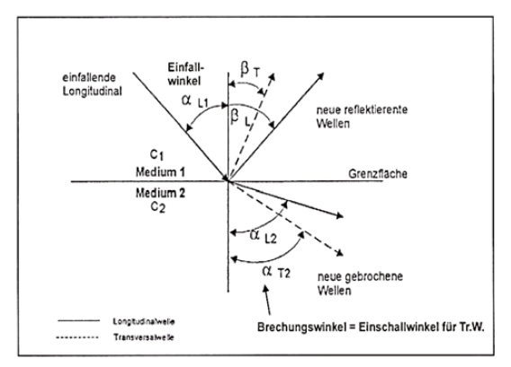

**Reflexionsgesetz:** $\alpha_1 = \beta_1$ (gleiche Wellenart)

**Snelliussches Brechungsgesetz:**

$$\frac{\sin\alpha_1}{\sin\alpha_2} = \frac{c_1}{c_2}$$

Beim Übergang in ein Medium mit anderer Schallgeschwindigkeit können aus einer einfallenden Welle **vier neue Wellen** entstehen (reflektiert/gebrochen × longitudinal/transversal)

 
    Abb. 1.14 aus K. Schiebold "Zerstörungsfreie Werkstoffprüfung – Ultraschallprüfung"

---

# Grenzwinkel (kritische Winkel)

<!-- _class: cols-2 -->

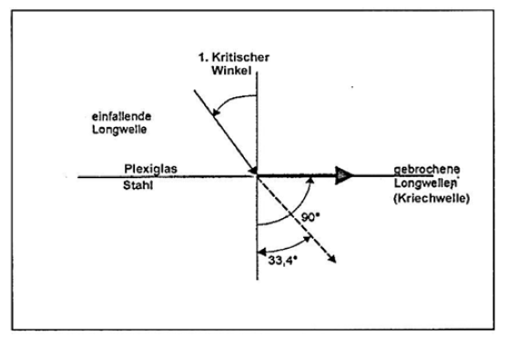

- **1. Kritischer Winkel:** Brechungswinkel der Longitudinalwelle = 90° → nur noch **Transversalwelle** im Bauteil (z. B. Plexiglas/Stahl: ca. 27,6°)
- **2. Kritischer Winkel:** auch die Transversalwelle wird total reflektiert (ca. 57,3°) → **Oberflächenwelle**
- Nutzbarer Arbeitsbereich für reine Transversalwellenprüfung dazwischen

 
    Abb. 1.16 aus K. Schiebold "Zerstörungsfreie Werkstoffprüfung – Ultraschallprüfung"

---

# Schallschwächung — Absorption und Streuung

<!-- _class: cols-2 -->

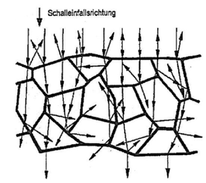

> ⚠️ Die Nachweisgrenze ist erreicht, wenn die Gefügestreuung genauso groß wird wie die Streuung am gesuchten Reflektor.

- **Absorption:** Umwandlung von Schallenergie in Wärme (innere Reibung) — bis ca. 600 °C meist vernachlässigbar
- **Streuung:** an Korngrenzen, Graphitlamellen oder Fasern — erzeugt "**Gras**"-Echos
- Streuung wächst mit **abnehmender Wellenlänge** (steigender Frequenz) im Verhältnis zur Korngröße

 
    Abb. 1.25 aus K. Schiebold "Zerstörungsfreie Werkstoffprüfung – Ultraschallprüfung"

---

# Ultraschallerzeugung — Piezoelektrischer Effekt

- **Direkter piezoelektrischer Effekt:** mechanische Verformung eines Kristalls erzeugt elektrische Ladung → **Empfänger**
- **Indirekter piezoelektrischer Effekt:** elektrische Wechselspannung erzeugt mechanische Schwingung → **Sender**

$$f = \frac{c}{2d}$$

- $f$ = Nennfrequenz, $c$ = Schallgeschwindigkeit im Schwinger, $d$ = Schwingerdicke
- Alternative Verfahren: magnetostriktiv, elektrodynamisch, laserbasiert (thermoakustisch) — v. a. für Hochtemperaturprüfung relevant

---

# Darstellungsarten von Ultraschallanzeigen

<!-- _class: cols-2 -->

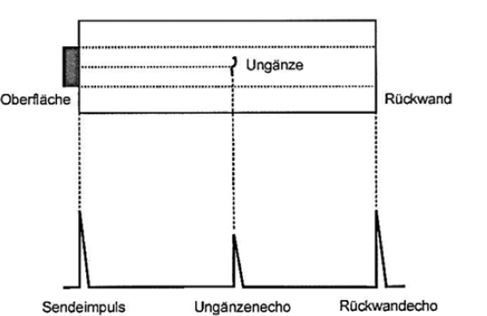

**A-Bild:** Amplitude über Schallweg — Standarddarstellung des Impuls-Echo-Verfahrens

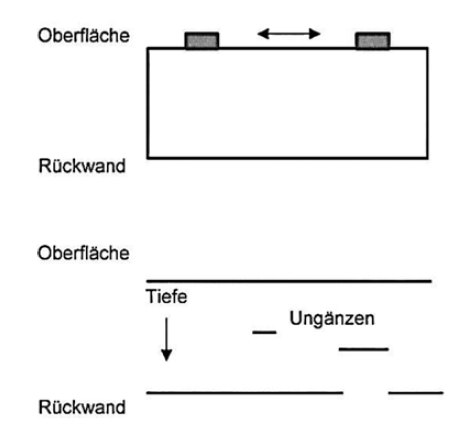
**B-Bild:** Schnittbild — Tiefenlage über Prüfkopfverschiebung (ein Freiheitsgrad)

 
    Abb. 1.28 und 1.29 aus K. Schiebold "Zerstörungsfreie Werkstoffprüfung – Ultraschallprüfung"

---

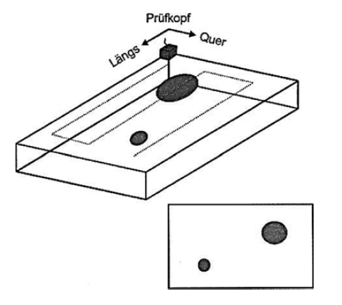
**C-Bild:** Draufsicht/Projektion einer Fläche — für automatisierte Prüfanlagen

 
    Abb. 1.30 aus K. Schiebold "Zerstörungsfreie Werkstoffprüfung – Ultraschallprüfung"

---

# Ultraschallprüfgeräte — Analog vs. Digital

<!-- _class: cols-2 -->

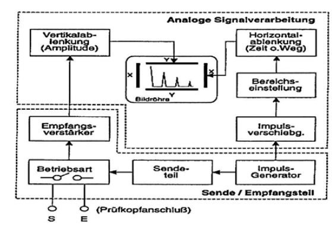

**Analoggerät:** Impulsgenerator → Sendeteil → Prüfkopf → Empfangsverstärker → Bildrohre; Bildwechsel im Takt der Impulsfolgefrequenz

**Digitalgerät:** A/D-Wandler + Mikroprozessor entkoppeln Bildaufbau von der Impulsfolge — Speicherung, Auswertung, Dokumentation möglich

 
    Abb. 2.1 aus K. Schiebold "Zerstörungsfreie Werkstoffprüfung – Ultraschallprüfung"

---

# Schallfeld — Nahfeld und Fernfeld

$$N = \frac{D^2 \cdot f}{4 \cdot c}$$

- **Nahfeld:** starke Interferenzen, Schalldruckmaxima/-minima — Echohöhenbewertung hier unsicher
- **Fernfeld:** Schalldruck nimmt gleichmäßig mit dem Abstand ab — hier gelten die Abstandsgesetze
- Große Schwingerdurchmesser/hohe Frequenz → lange Nahfeldlänge, aber gute Fernempfindlichkeit

---

# Prüfkopftypen — Übersicht

<!-- _class: cols-2 -->

- **Senkrechtnormalprüfkopf:** ein Schwinger als Sender und Empfänger, Einschallwinkel 0°
- **Sende-Empfangs (SE)-Prüfkopf:** getrennte, akustisch isolierte Schwinger — kein Sendeimpuls im Nahbereich, bessere Nahauflösung
- **Winkelprüfkopf:** Vorsatzkeil erzeugt durch Brechung Transversalwellen im Bauteil

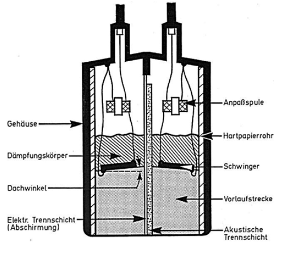

 
    Abb. 2.16 aus K. Schiebold "Zerstörungsfreie Werkstoffprüfung – Ultraschallprüfung"

---

# Winkelprüfkopf im Detail

<!-- _class: cols-2 -->

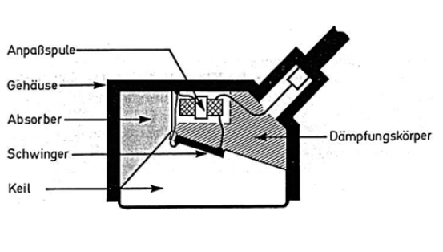

- Longitudinalwelle im Vorsatzkeil → Brechung erzeugt Transversalwelle im Prüfling
- Übliche Einschallwinkel in Stahl: **35°–80°**, Standard 45°, 60°, 70°
- Kennzeichnung auf dem Prüfkopf: Nennfrequenz, Nenneinschallwinkel, **Schallaustrittspunkt** (x-Maß)
- Bevorzugter Einsatz: **Schweißnahtprüfung** (z. B. Flankenbindefehler)

 
    Abb. 2.20u aus K. Schiebold "Zerstörungsfreie Werkstoffprüfung – Ultraschallprüfung"

---

# Sonderprüfköpfe 

- **Fokusprüfköpfe:** Vorsatzlinse bündelt das Schallbündel auf einen definierten Fokusbereich — genaue Fehlergrößenbestimmung
- **SEL/SEK-Prüfköpfe:** nutzen Longitudinal- bzw. Kriechwellen für oberflächennahe Fehler
- **Rohrprüfköpfe:** zwei gegenläufig einschallende Winkelprüfköpfe zum Nachweis von Dopplungen und Rissen in Rundmaterial

---

# Kalibrier- und Kontrollkörper K1/K2

<!-- _class: cols-2 -->

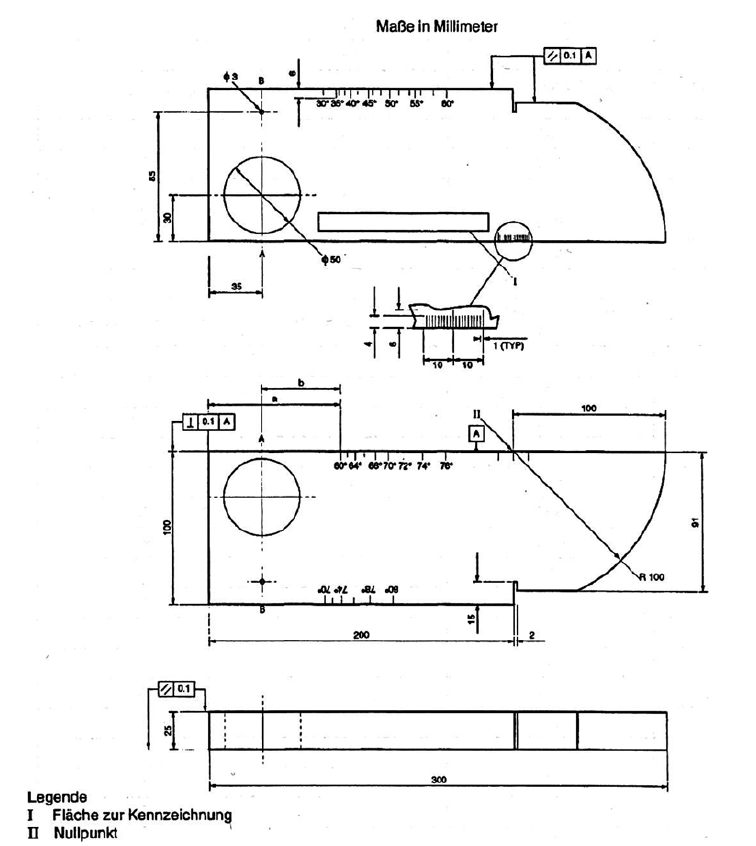

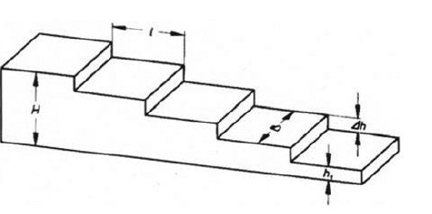

 
    Abb. 4.13 und 4.15 aus K. Schiebold "Zerstörungsfreie Werkstoffprüfung – Ultraschallprüfung"

---

# Abstands- und Größengesetze

| Reflektor | Verdopplung Abstand | Verdopplung Größe |
|---|---|---|
| Rückwand | −6 dB | — |
| Kreisscheibe (KSR) | −12 dB | +12 dB |
| Querbohrung | −9 dB | +3 dB |
| Kugel | — | +6 dB |

> ✅ Diese Gesetze gelten erst **ab der 3-fachen Nahfeldlänge** (fernes Fernfeld) — Grundlage der **AVG-Methode** zur indirekten Fehlergrößenbestimmung.

---

# Ankopplungstechnik — Kontakt- und Flieswassertechnik

<!-- _class: cols-2 -->

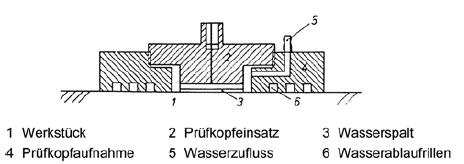

- **Kontakttechnik:** Koppelmittel (Wasser, Öl, Gel) füllt den Luftspalt zwischen Prüfkopf und Bauteil

- **Spalttechnik:** definierter Wasserfilm zwischen Prüfkopf und Oberfläche — für mechanisierte Prüfung
- **Tauchtechnik:** Prüfkopf und Bauteil vollständig im Wasserbad — ermöglicht Fokussierung

> ⚠️ Ohne Koppelmittel wird nahezu die gesamte Schallenergie an der Luftschicht reflektiert — keine sinnvolle Prüfung möglich.

 
    Abb. 7.6 aus K. Schiebold "Zerstörungsfreie Werkstoffprüfung – Ultraschallprüfung"

---

# Wanddickenmessung — Laufzeitprinzip

$$d = \frac{c \cdot t}{2}$$

- Messung zwischen **Sendeimpuls und Rückwandecho** oder besser zwischen **zwei Rückwandechos** (Mehrfachechomethode)
- Digitale Wanddickenmessgeräte nutzen meist eine feste, vorgegebene Schallgeschwindigkeit
- Einflussfaktoren: Oberflächenzustand, Beschichtungen, Temperatur, Werkstoffgefüge

---

# Schweißnahtprüfung — Aufbau und Wärmeeinflusszone

<!-- _class: cols-2 -->

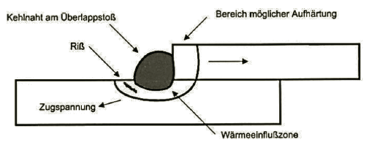

- Mehrlagenschweißung vermeidet grobes Gussgefüge — jede Lage "wärmebehandelt" die darunterliegende
- **Wärmeeinflusszone (WEZ):** kritischer Bereich neben der Naht, oft rissanfällig — muss auf definierter Breite mitgeprüft werden
- Typische Fehler: Bindefehler, Risse (flächenhaft); Poren, Schlacke, Lunker (volumenhaft)

 
    Abb. 13.2 aus K. Schiebold "Zerstörungsfreie Werkstoffprüfung – Ultraschallprüfung"

---

# Prüfung bei höheren Temperaturen und Sonderwerkstoffen

- **Hochtemperaturprüfung:** spezielle Vorlaufstrecken (Polyamid), Druckkontakt oder Wasserspaltankopplung nötig, da Piezoschwinger nur bis ca. 80 °C direkt kontaktierbar sind
- **Austenitische Werkstoffe:** grobkörniges, anisotropes Gefüge — hohe Schallschwächung erfordert Longitudinalwellen-Winkelprüfköpfe, breitbandige Prüfköpfe oder Signalmittelungstechnik
- **Gusseisen:** Schallgeschwindigkeit korreliert mit Graphitausbildung — Kugelgraphit erhöht $c$ deutlich gegenüber Lamellengraphit

---

# Zusammenfassung — Ultraschallprüfung (UT)

- UT nutzt **mechanische Wellen** und die Reflexion an **Impedanzsprüngen** — kein Strahlenschutz nötig
- Physikalische Basis: Wellenarten, Snelliussches Brechungsgesetz, kritische Winkel, Schallschwächung
- Prüfkopfvielfalt (Normal-, SE-, Winkel-, Fokus-, Sonderprüfköpfe) für unterschiedlichste Prüfaufgaben
- **AVG-Methode** und Vergleichskörperverfahren zur indirekten Fehlergrößenbestimmung
- Moderne Techniken (TOFD, Phased-Array) erweitern Nachweisvermögen und Automatisierungsgrad erheblich

**Damit ist die Grundlagen-Trias VT — RT — UT der klassischen ZfP-Verfahren komplett.**

---

<!-- _class: title -->

# Fragen?

Prof. Dr.-Ing. Christian Willberg | Hochschule Magdeburg-Stendal