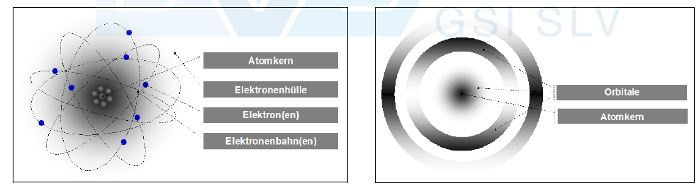
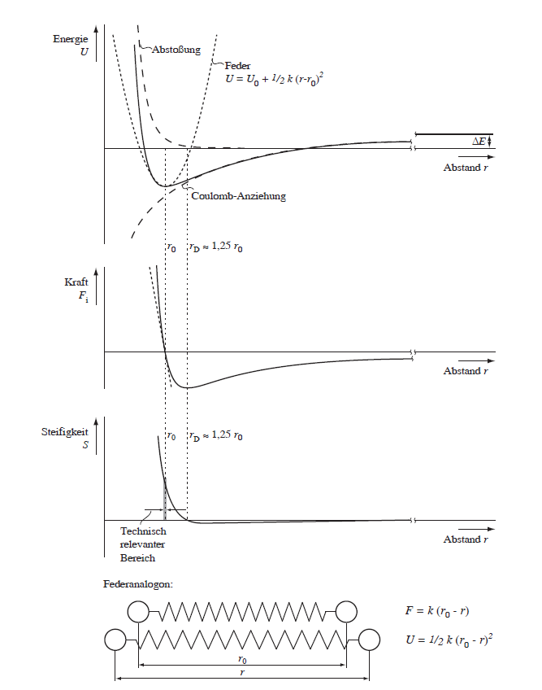
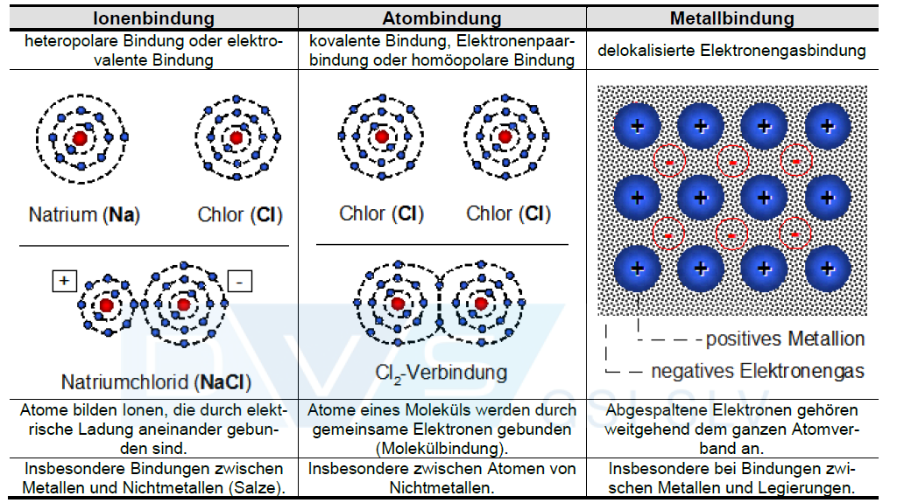
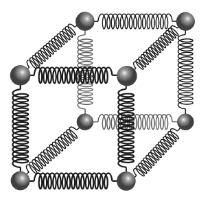
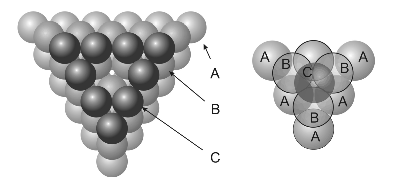

##  Werkstofftechnik II -Bindungen
Prof. Dr.-Ing.  Christian Willberg 

Kontakt: christian.willberg@h2.de

 
    <a href="https://doi.org/10.1007/s42102-021-00079-6" style="color: blue;">Bildreferenz</a>

---

<!--paginate: true-->

# Lernziele

- Konzept der **idealen Festigkeit** verstehen und die Abweichung zur realen Festigkeit erklären
- Struktur und Wirkmechanismus von **Versetzungen** in Kristallen beschreiben
- Den **Burgersvektor** physisch verstehen und auf Kristallstrukturen anwenden
- Verschiedene **Festigkeitssteigerungsmechanismen** bei Metallen kennen und vergleichen
- Praktische **Anwendungen** in der Ingenieurtechnik zuordnen

---

## Aufbau von Atomen und Elektronenschalen

**Atomstruktur:**
- Positiv geladener Atomkern
- Negativ geladene Elektronen in Elektronenschalen

---

## Atommodelle

- Rutherford ''*Sonnensystemmodell*''
    - zu einfaches Modelle
    - geht von Bewegungen in Bahnen oder Schalen aus
- Schrödinger ''*Orbitalmodell*''
    - Bereiche definierter Räume
    - diese sind Aufenthaltswahrscheinlichkeiten abgeleitet aus Wellenfunktionen

---

**Elektronenschalen:**
- Geordnet in zunehmendem Abstand vom Kern
- Begrenzte Elektronenzahl pro Schale
- Äußere Schalen: höhere Energie, schwächere Bindung an Kern
- **Nur äußere Elektronen nehmen an chemischer Bindung teil**

**Elektronenorbitale:**
- Elektronen nicht lokalisierbar → Aufenthaltswahrscheinlichkeit
- Bereich: Elektronenwolke oder Orbital
- Kugelsymmetrische und gerichtete Orbitale
- Jedes Orbital: maximal 2 Elektronen

---

 
    Bilder aus "Werkstoffkunde" Vorlesung
Joachim Rösler, Sebastian Piegert,
Britta Laux, Michaela Necker
TU-BS

---

## Elektronenschalen und Periodensystem

| Schale | Orbitale | Max. Elektronen | Beispiele |
|--------|----------|-----------------|-----------|
| K-Schale | 1s | 2 | H, He |
| L-Schale | 2s, 2p | 8 | Li bis Ne |
| M-Schale | 3s, 3p, 3d | 18 | Na bis Ar |

**Auffüllregel:** Von innen nach außen entsprechend dem Energieschema

**Energetisch günstig:** Vollständig gefüllte Schalen
- **Edelgase** (He, Ne, Ar): volle Schalen → chemisch inert
- **Fluor**: 7 Valenzelektronen → sehr reaktiv (will 8. Elektron)

---
# Leitungsband vs. Orbitale

## Atomorbitale (einzelnes Atom)
- **Diskrete Energieniveaus** (1s, 2s, 2p, 3s, 3p, ...)
- Elektronen sind **an einzelne Atome gebunden**
- **Feste, scharfe Energiewerte**
- Elektronen **lokalisiert** am Atom

## Energiebänder (Festkörper)
- **Quasi-kontinuierliche Energiebereiche**
- Entstehen durch **Überlappung und Aufspaltung** von Atomorbitalen
- Aus N Atomen → N dicht beieinander liegende Niveaus
- Bei 10²³ Atomen → praktisch kontinuierliches Band

---

---

## Relevante Gößen

**Ordnungszahl**
Zahl der Protonen im Kern
**Atommasse**
bestimmt die Masse des Elements
 Masse des Werkstoffs ist eine Kombination aus Atommasse und Dichte
**Elektronegativiät**
bestimmt ob Atome abgegeben oder aufgenommen werden in einer Bindung
metallische Bindungen eher links
kovalente Bindungen eher rechts

---

## Bindungskräfte und Energien

### 1. Coulomb-Anziehung
- Elektrostatische Anziehung zwischen:
  - Positiv geladenen Atomkernen
  - Negativ geladenen Elektronen
- Zieht Atome zusammen

---

**Coulomb-Anziehung zwischen Ionen:**
$$F_{an} = \frac{q_1 q_2}{4\pi\varepsilon_0 r^2}$$

**Coulomb-Energie:**
$$E_{Coulomb} = \frac{q_1 q_2}{4\pi\varepsilon_0 r}$$

- $q_1, q_2$: atomare Ladungen der Ionen ($\pm e$)
- $\varepsilon_0$: Dielektrizitätskonstante
- $r$: Ionenabstand

**Abstoßungskraft bei kleinen Abständen:**
$$F_{ab} \propto r^{-n} \quad (n \gg 2)$$

**Gleichgewichtsabstand $r_0$:** Anziehung und Abstoßung halten sich die Waage

---

### 2. Pauli-Abstoßung (Austauschwechselwirkung)
- **Pauli-Prinzip:** Keine zwei Elektronen im gleichen Quantenzustand
- Elektronen "beanspruchen Raum" → Abstoßung bei zu kleinem Abstand
- **Verhindert das "Kollabieren" der Atome**

---

## Das Lennard-Jones-Potenzial

$$U(r) = 4\varepsilon \left[\left(\frac{\sigma}{r}\right)^{12} - \left(\frac{\sigma}{r}\right)^6\right]$$

- **Minimum** bei $r_0$: Gleichgewichtsabstand
- **Steigung** im Minimum: Federkonstante → E-Modul
- Anziehung ($r^{-6}$) vs. Abstoßung ($r^{-12}$)

---

# Bindungsarten
## Primärbindungen
- Ionenbindung
- Kovalente Bindungen
- Metallische Bindung

## Sekundärbindungen
- Van der Vaals Bindung
- Wasserstoffbrückenbindung

 
    Bild aus "Internationaler Schweissfachingenieurlehrgang H2 - Werkstoffe und ihr Verhalten beim Schweißen"

---

## Federmodell der Primärbindungen

**Potentialkurve um $r_0$ ist näherungsweise parabolisch:**
$$U = U_0 + \frac{1}{2}k(r - r_0)^2$$

**Kraft durch Ableitung:**
$$F_i = -\frac{dU}{dr} = k(r_0 - r)$$
→ **Federgesetz!** Die Bindung verhält sich wie eine Feder mit Federkonstante $k$

 
    Bild aus "Werkstoffkunde" Vorlesung
Joachim Rösler, Sebastian Piegert,
Britta Laux, Michaela Necker
TU-BS

---

**Steifigkeit der atomaren Bindung:**
$$S = -\frac{dF_i}{dr} = k$$

**Technisch relevanter Bereich:** $r_0$ bis $r_D \approx 1{,}25 \cdot r_0$
- Sehr kleine Dehnungen (< 1%)
- Steifigkeit $S$ praktisch konstant
- **→ Lineares elastisches Verhalten (Hookesches Gesetz)**

---

# Ionenbindung

**Beteiligte Atome:**
- Atom mit **beinahe gefüllter** äußerer Elektronenschale (z.B. Chlor)
- Atom mit **beinahe leerer** äußerer Elektronenschale (z.B. Natrium)

---

**Beispiel: Natriumchlorid (NaCl) - Kochsalz**
- Na gibt 1 Elektron ab → Na⁺-Ion (vollständige innere Schale)
- Cl nimmt 1 Elektron auf → Cl⁻-Ion (vollständige äußere Schale)
- **Beide erreichen energetisch günstige, vollständig gefüllte Schalen**

**Resultat:** Elektrostatische Bindung zwischen entgegengesetzt geladenen Ionen

---

## Energiebilanz der Ionenbindung (NaCl)

**Schritt 1: Ionisierung von Natrium**
- Entfernung des Valenzelektrons: Na → Na⁺ + e⁻
- Arbeit gegen Coulomb-Anziehung Kern↔Elektron
- **Energieaufwand:** +5,1 eV (gemessener Wert)

**Schritt 2: Elektronenanlagerung an Chlor**
- Aufnahme des Elektrons: Cl + e⁻ → Cl⁻
- Coulomb-Anziehung Kern↔neues Elektron + Schalenabschluss
- **Energiegewinn:** -3,6 eV (gemessener Wert)

**Zwischenbilanz:** +5,1 eV - 3,6 eV = **+1,5 eV** (zunächst ungünstig!)

---

## Energiebilanz der Ionenbindung (NaCl) - Fortsetzung

**Schritt 3: Elektrostatische Anziehung**
- Annäherung der Ionen Na⁺ und Cl⁻ auf r ≈ 0,4 nm
- Berechnung aus Coulomb-Gesetz: $E = \frac{(+e)(-e)}{4\pi\varepsilon_0 r}$
- Potentielle Energie sinkt bei Annäherung
- **Energiegewinn:** -3,6 eV

**Gesamtbilanz:** 1,5 eV - 3,6 eV = **-2,1 eV** Bindung ist stabil!

**Im Kristall noch günstiger:**
- Jedes Ion von mehreren Gegenionen umgeben
- Noch größerer Energiegewinn durch multiple Wechselwirkungen

---
## Erklärung der Energiebilanz

**Negative Bilanz (ΔE < 0):**
- Potentielle Energie wird **abgebaut**
- Energie wird als Wärme oder Strahlung **frei**
- Endzustand liegt **energetisch tiefer** als Ausgangszustand
- System fällt ins Energietal
- **Ergebnis: Energetisch stabil** 

---

**Positive Bilanz (ΔE > 0):**
- Potentielle Energie muss **erhöht** werden
- Energie muss von außen **zugeführt** werden
- Endzustand liegt **energetisch höher** als Ausgangszustand
- System ist wie eine Kugel, die über einen Hügel in ein höheres Tal geschoben werden muss
- **Ergebnis: Instabil, fällt zurück** 
- Beispiel: Nur Ionisierung ohne Coulomb-Anziehung mit +1,5 eV

---

## Bindungsstärke und Elastizitätsmodul

Stärkere Coulomb-Anziehung $F_{an}$ führt zu:
- Tieferem Energieminimum
- **Stärkerer Krümmung** der Potentialkurve um $r_0$
- Größerer Federkonstante $k$
- **Größerer Steifigkeit $S$**
- **Höherem Elastizitätsmodul $E$**

$$F_i = -\frac{dU}{dr} = k(r_0 - r)$$

---

# Kovalente Bindung
## Prinzip der Elektronenpaarung

**Bindungsprinzip:**
- Erreichen vollständig gefüllter Elektronenschalen
- **Aber:** Atome mit **geringem Unterschied in der Elektronegativität**
- Keine vollständige Elektronenübertragung möglich
- **Lösung:** Elektronen werden **geteilt** (gemeinsame Elektronenpaare)

---

**Elektronegativität:**
- Maß für die Kraft, mit der ein Atom ein Elektron anzieht
- Geringer Unterschied → kovalente Bindung
- Großer Unterschied → Ionenbindung

**Charakteristik:**
- **Gerichtete Bindung** (im Gegensatz zur Ionenbindung)
- Atomanordnung wird durch Orbitale festgelegt

---

## Beispiel: Methan (CH₄)

**Kohlenstoff-Bindungsbedarf:**
- C-Atom: 4 Elektronen auf L-Schale
- Benötigt 8 Elektronen für vollständige Füllung
- **Muss 4 kovalente Bindungen eingehen**

**Molekülstruktur:**
- 1 C-Atom im Zentrum
- 4 H-Atome an den Enden
- **Vier keulenförmige sp³-Hybridorbitale**
- Tetraedrische Geometrie (109,5° Bindungswinkel)
---

**Elektronenbilanz:**
- Jedes H-Atom: 2 Elektronen (vollständige K-Schale) 
- C-Atom: 8 Elektronen (vollständige L-Schale) 
- **Prinzip vollständig gefüllter Schalen erfüllt!**

---

## Beispiel: Diamant - Die stärkste Bindung

**Struktur:**
- Nur Kohlenstoffatome (keine zweite Atomsorte!)
- Jedes C-Atom bildet **4 keulenförmige Orbitale** aus
- An jedem Ende: weiteres C-Atom
- Jedes C-Atom: 4 kovalente Bindungen zu Nachbarn
- **Dreidimensionales Netzwerk**

 
    Bild aus "Werkstoffkunde" Vorlesung
Joachim Rösler, Sebastian Piegert,
Britta Laux, Michaela Necker
TU-BS

---

**Warum so außergewöhnlich?**
- **C-C-Bindung = stärkste bekannte chemische Bindung**
- Alle Bindungen gleichwertig und gerichtet
- Sehr kurzer Bindungsabstand
- Extrem hohe Bindungsenergie

 
    Bild aus "Werkstoffkunde" Vorlesung
Joachim Rösler, Sebastian Piegert,
Britta Laux, Michaela Necker
TU-BS

---

## Eigenschaften von Diamant

**Mechanische Eigenschaften:**
- **E-Modul:** ~1000 GPa (höchster aller Materialien!)
- **Härte:** Härtestes natürliches Material 
- **Schmelztemperatur:** 3727°C

**Vergleich:**
- Stahl: E ≈ 210 GPa
- Al₂O₃ (Keramik): E ≈ 380 GPa
- Diamant: E ≈ 1000 GPa

---

**Technische Anwendungen:**
- Diamantschichten auf Wendeschneidplatten (spanende Bearbeitung)
- Verschleißschutz in Piezoeinspritzsystemen (Dieselmotoren)
- Schneide- und Schleifwerkzeuge
- Wärmeleitende Substrate (Elektronik)

---

## Kohlenstofffasern - Leichtbau mit kovalenter Bindung

**Struktur:**
- Andere Anordnung als Diamant (Graphit-artig, Schichtstruktur)
- Aber: Ebenfalls starke C-C-Bindungen
- Anisotrope Eigenschaften (richtungsabhängig)

**Eigenschaften:**
- **E-Modul:** 200-900 GPa (je nach Fasertyp)
- **Dichte:** ~1,8 g/cm³ (Stahl: ~7,8 g/cm³)
- **Spezifischer E-Modul:** E/ρ extrem hoch!

---

## Kovalente vs. Ionenbindung - Gemeinsamkeiten

**Beide Bindungstypen:**
- Basieren auf dem Prinzip **vollständig gefüllter Elektronenschalen**
- Führen zu **vollständig gefülltem Valenzband**
- Gehören zu den **starken Bindungen**
- Kommen in **Keramiken** vor
- Hohe E-Moduli und Schmelztemperaturen

**Unterschiede:**
| Eigenschaft | Ionenbindung | Kovalente Bindung |
|-------------|--------------|-------------------|
| Elektronegativität | Großer Unterschied | Kleiner Unterschied |
| Elektronen | Übertragen | Geteilt |
| Richtung | Ungerichtet | Gerichtet |
| Beispiel | NaCl, MgO | Diamant, CH₄ |

**Realität:** Fließender Übergang - viele Keramiken haben **beide Bindungsanteile**

---

# Metallische Bindung

## Das Elektronengas-Modell

- **Zu wenige Valenzelektronen** für kovalente Bindungen mit allen Nachbarn
- Beispiel Na: 1 Valenzelektron, aber 8-12 nächste Nachbarn im Kristall
- Beispiel Fe: 2 Valenzelektronen (4s²), aber 8-12 Nachbarn
- Klassische Elektronenpaarbildung (wie bei Cl₂) **nicht möglich**!

---

### Delokalisierung der Elektronen

**Prinzip der Energieminimierung:**
- Valenzelektronen werden **über den gesamten Kristall delokalisiert**
- Elektronen gehören **nicht mehr einzelnen Atomen**, sondern dem **gesamten Metallgitter**
- **"Elektronengas"** oder **"Elektronenwolke"** zwischen den Atomrümpfen

### Charakteristik der metallischen Bindung

- **Ungerichtete Bindung** (im Gegensatz zur kovalenten)
- Positiv geladene **Atomrümpfe** (Kerne + innere Elektronen) bilden regelmäßiges Gitter
- Negatives **Elektronengas** bewegt sich frei zwischen den Rümpfen
- **Elektrostatische Anziehung** zwischen Rümpfen und Elektronengas hält alles zusammen
- Bindung zu **vielen Nachbarn gleichzeitig** möglich

---

## Struktur der metallischen Bindung

**Bindungszustand:**
- Atomrümpfe regelmäßig angeordnet (Kristallgitter)
- Valenzelektronen **delokalisiert** (nicht an einzelne Atome gebunden)
- Gleichmäßige **Aufenthaltswahrscheinlichkeit** zwischen allen Rümpfen
- Elektronendichte überall gleich (Elektronengas)

---

### Bindungsstärke pro Bindung
- Metallische Bindung: **schwächer** als ionische/kovalente Bindung
- Einzelne metallische Bindung hat **geringere Energie**
- Kompensation durch Koordinationszahl
    - Diamant: 4 nächste Nachbarn → 4 starke Bindungen
    - Aluminium: **12 nächste Nachbarn** → 12 schwächere Bindungen

 
    Bild aus "Werkstoffkunde" Vorlesung
Joachim Rösler, Sebastian Piegert,
Britta Laux, Michaela Necker
TU-BS

---

### Makroskopische Eigenschaften

**Resultat:**
- **Schmelztemperaturen** von Metallen können sehr hoch sein (W: 3410°C)
- **Bindungsenergien pro Atom** sind vergleichbar (siehe Tabelle)
- Hohe Koordinationszahl **kompensiert** schwächere Einzelbindungen
- Gesamtstabilität des Kristalls ist **hoch**

**Aber:** Große Variation bei Metallen (Quecksilber (Hg): -39°C vs. W: 3410°C)
- Abhängig von Anzahl der Valenzelektronen und Atomgröße

---

| Bindungsart | Material | Bindungsenergie (eV/Atom) | Schmelztemperatur (°C) |
|-------------|----------|---------------------------|------------------------|
| Ionisch | NaCl | 3,30 | 801 |
| | MgO | 5,20 | 2800 |
| Kovalent | Si | 4,70 | 1410 |
| | C (Diamant) | 7,40 | > 3550 |
| Metallisch || Al | 3,40 | 660 |
| | Fe | 4,20 | 1538 |
| | W | 8,80 | 3410 |
| Dipolbindung | Ar | 0,08 | −189 |
| | Cl₂ | 0,32 | −101 |
| | NH₃ | 0,36 | −78 |

---

## Energiebänder und elektrische Leitfähigkeit

**Energiebandstruktur:**
- Diskrete Atomniveaus → Energiebänder im Festkörper
- **Valenzband:** Letztes mit Elektronen besetztes Band

**Metallische Bindung:**
- Valenzband **nicht vollständig gefüllt** (zu wenige Valenzelektronen!)
- Viele **freie Zustände** im Valenzband verfügbar

---

**Bei angelegter Spannung U:**
1. Elektrisches Feld E übt Kraft auf Elektronen aus: $F = eE$
2. Elektronen werden beschleunigt (gerichtete Bewegung)
3. Elektronen nehmen **kinetische Energie** auf
4. **Freie Zustände verfügbar** → Energie kann aufgenommen werden
5. **Elektrischer Strom fließt** → Metalle sind gute Leiter

---

## Vergleich: Metalle vs. Keramiken (elektrisch)

**Metalle - Elektrische Leiter:**
- Valenzband **teilweise gefüllt**
- Elektronen können Energie aufnehmen
- Bewegung im elektrischen Feld möglich
- **Hohe elektrische Leitfähigkeit**
- Beispiel: Cu, Al, Fe

---

**Keramiken - Elektrische Isolatoren:**
- Valenzband **vollständig gefüllt** (volle Elektronenschalen!)
- Leitungsband leer, aber **große Energielücke** (Bandlücke)
- Elektronen können keine Energie aufnehmen (kein Platz!)
- **Keine elektrische Leitfähigkeit**
- Beispiel: Al₂O₃, SiO₂

**Halbleiter - Zwischen beiden:**
- Kleine Energielücke (~1 eV)
- Wenige Elektronen springen ins Leitungsband
- **Geringe elektrische Leitfähigkeit**
- Beispiel: Si, Ge

---

## Wärmeleitfähigkeit

**Zwei Mechanismen für Wärmetransport:**

**1. Elektronischer Transport (dominant in Metallen):**
- Freie Elektronen transportieren Wärme
- **Metalle:** Gute elektrische Leiter = gute Wärmeleiter
- Beispiel: Cu λ ≈ 400 W/(m·K), Al λ ≈ 237 W/(m·K)

---

**2. Phononischer Transport (Gitterschwingungen):**
- Atome schwingen (thermische Anregung)
- Schwingungen übertragen sich auf Nachbaratome (federartige Kopplung)
- Wärme wird durch **Schwingungswellen (Phononen)** transportiert
- **Auch in Isolatoren möglich!**

**Überraschung:**
- Einige Keramiken sind **sehr gute Wärmeleiter** trotz elektrischer Isolation!
- Diamant: λ ≈ 2000 W/(m·K) (beste Wärmeleitfähigkeit aller Materialien!)
- SiC: λ ≈ 120 W/(m·K), AlN: λ ≈ 170 W/(m·K)

---

**Anwendung: Keramikbremse (Porsche)**
- Material: C-faserverstärktes SiC
- **Vorteile:**
  - Geringes Gewicht (ρ_SiC ≈ 3,2 g/cm³ vs. Grauguss ≈ 7,2 g/cm³)
  - Hohe Temperaturbeständigkeit (SiC bis >2500°C)
  - Gute Wärmeableitung (hohe λ)
- **Nachteil:** Sehr teuer (aufwändige Herstellung)

---

# Dipolbindung (Sekundärbindung)
## Schwache zwischenmolekulare Kräfte

**Dipolbindung**
- Basiert auf **Ladungsverschiebungen** im Molekül
- Viel **schwächer** als Primärbindungen (Ionen-, kovalente, metallische)
- Auch genannt: **Sekundärbindung** oder **zwischenmolekulare Bindung**

**Typen:**
1. Permanente Dipole (Wasserstoffbrückenbindung)
2. Induzierte/fluktuierende Dipole (van-der-Waals-Bindung)

---

## Permanente Dipolbindung - Wasserstoffbrückenbindung

**Entstehung des Dipols im H₂O-Molekül:**
- Sauerstoff ist **elektronegativer** als Wasserstoff
- O zieht Bindungselektronen stärker an sich
- **Ladungsverschiebung:**
  - O-Seite: leicht negativ (δ−)
  - H-Seite: leicht positiv (δ+)
- Molekül bleibt **elektrisch neutral**, aber ist ein **Dipol**

---

**Dipolbindung zwischen Molekülen:**
- Moleküle ordnen sich so an: δ+ neben δ−
- **Elektrostatische Anziehung** zwischen den Dipolen
- Bindungsenergie: ~0,52 eV/Molekül (H₂O)

**Besonderheit bei H₂O:**
- H-Atom fast vollständig seiner Elektronen beraubt
- Kann sich O-Atom des Nachbarmoleküls stark nähern
- **Stärkste Dipolbindung** → Wasserstoffbrückenbindung

---

## Van-der-Waals-Bindung

**Mechanismen:**
1. **Spontane Ladungsfluktuation:** 
   - Zufällig entsteht kurzzeitig ein Dipol (δ− auf einer Seite)
   - Statistische Elektronenverteilung schwankt zeitlich
   
2. **Induzierter Dipol:**
   - Nachbaratom reagiert auf ersten Dipol
   - Ladungsverschiebung im Nachbaratom
   - Kurzzeitige **Anziehung**

---

3. **Zeitlich gemittelt:**
   - Fluktuationen dauern ~10⁻¹⁵ s
   - Ständige Neuorientierung
   - Netto-Anziehung bleibt bestehen

**Van-der-Waals-Bindung = schwächste aller Bindungen**

---

| Bindungstyp | Beispiel | Bindungsenergie | Schmelztemp. | Mechanismus |
|-------------|----------|-----------------|--------------|-------------|
| **Wasserstoffbrücke** | H₂O | 0,52 eV | 0°C | Permanenter Dipol |
| **Dipol (schwächer)** | NH₃ | 0,36 eV | −78°C | Permanenter Dipol |
| **Van-der-Waals** | Cl₂ | 0,32 eV | −101°C | Fluktuierender Dipol |
| **Van-der-Waals** | Ar | 0,08 eV | −189°C | Fluktuierender Dipol |

**Vergleich mit Primärbindungen:**
- Ionisch (NaCl): 3,3 eV (Faktor ~6-40× stärker)
- Kovalent (Diamant): 7,4 eV (Faktor ~15-90× stärker)
- Metallisch (Fe): 4,2 eV (Faktor ~8-50× stärker)

**Dipolbindung ist 10-100× schwächer als Primärbindungen!**

---

# Ashby Diagramm

---

## Fragen?