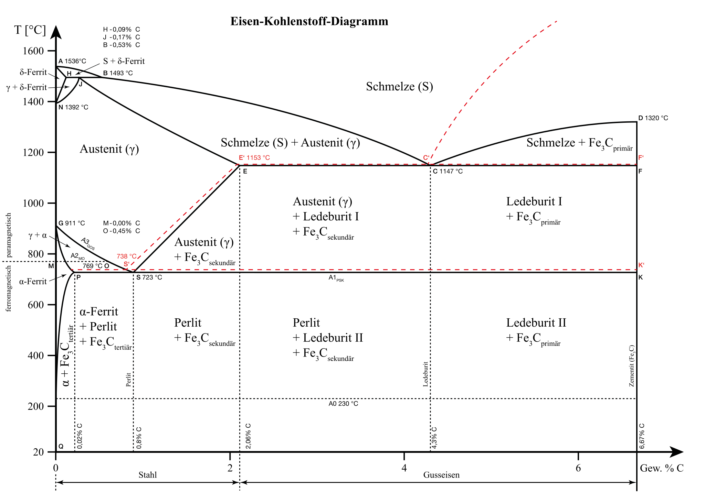

##  Werkstofftechnik II
Prof. Dr.-Ing.  Christian Willberg 

Kontakt: christian.willberg@h2.de

 
    <a href="https://doi.org/10.1007/s42102-021-00079-6" style="color: blue;">Bildreferenz</a>

---

<!--paginate: true-->

## Vorlesung
Quelle - [Eisenwerkstoffe](https://link.springer.com/chapter/10.1007/978-3-642-54989-2_6)

---

---

 Elastizität
 Hyperlastizität
 spannnungs-dehnungs diagramm abb2.8
 spröde

 - Dehnungsmaße (wahre dehnung)
- spröde, duktil, etc.
- parameter im detail
- mehrdimensionales testen
- 