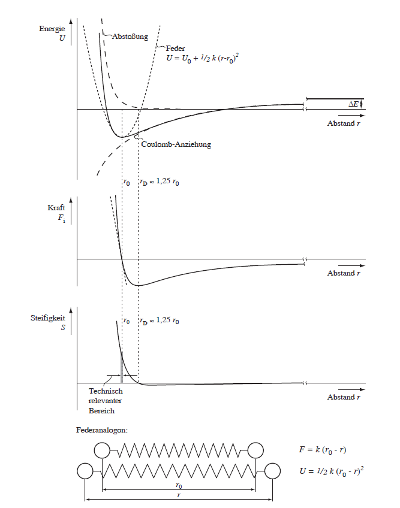
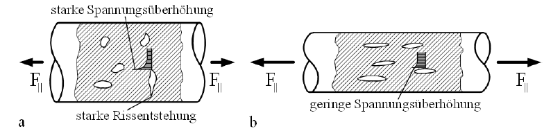
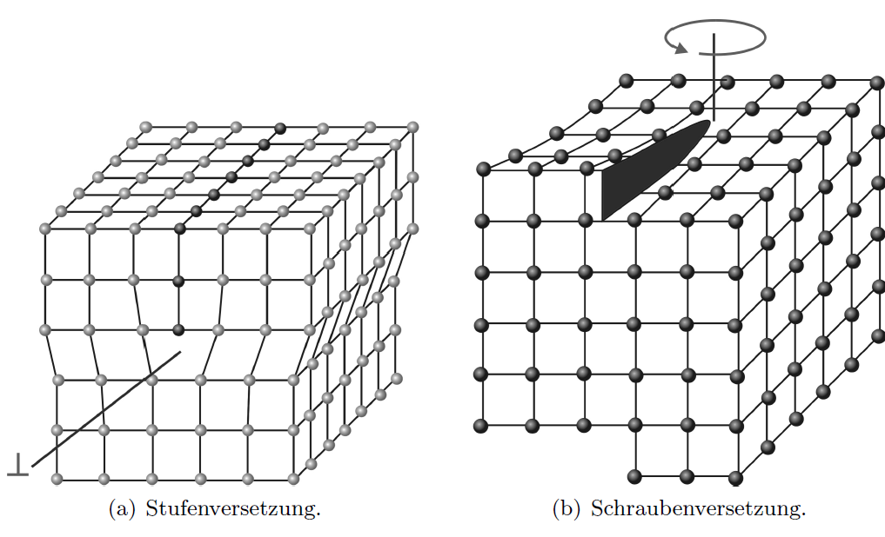
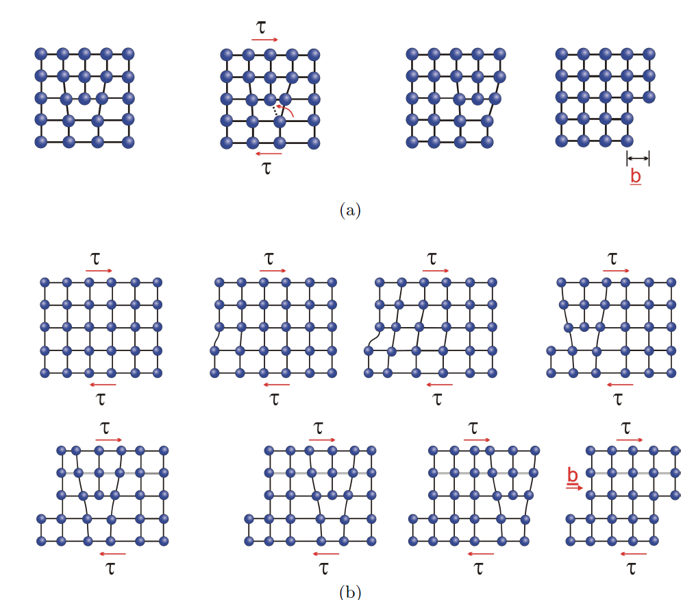
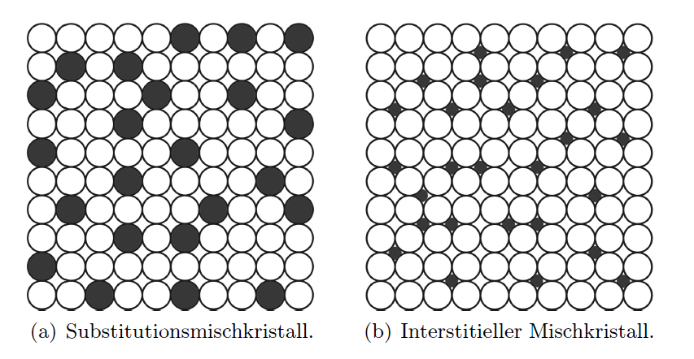
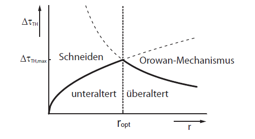
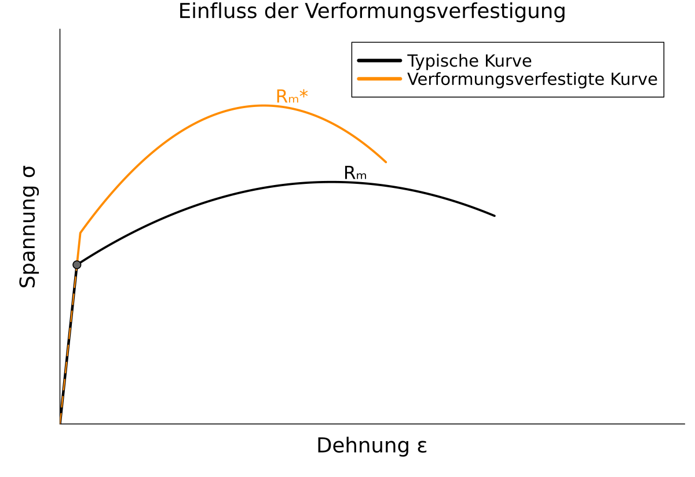

# Werkstofftechnik II - Festigkeit und Plastizität
Prof. Dr.-Ing. Christian Willberg

 

Kontakt: christian.willberg@h2.de

---

# Lernziele

- Konzept der **idealen Festigkeit** verstehen und die Abweichung zur realen Festigkeit erklären
- Warum Keramiken **spröde** und Metalle **duktil** sind
- Struktur und Wirkmechanismus von **Versetzungen** in Kristallen beschreiben
- Den **Burgersvektor** physisch verstehen und auf Kristallstrukturen anwenden
- Verschiedene **Festigkeitssteigerungsmechanismen** bei Metallen kennen und vergleichen

---

# Die ideale Festigkeit

## Gedankenexperiment

Bei zunehmender Zugspannung werden die atomaren Bindungen immer stärker belastet.
Die Rückstellkraft ist maximal bei etwa dem **1,25-fachen des Gleichgewichtsabstands**.

$$\sigma_{\text{ideal}} \approx \frac{E}{4} \quad \text{(einfache Abschätzung: } \varepsilon \approx 0{,}25\text{)}$$

$$\sigma_{\text{ideal}} \approx \frac{E}{10} \quad \text{(genaue Berechnung mit echten Atompotentialen)}$$

 
    Bilder aus dem Skript Werkstoffkunde der TU Braunschweig"

---

# Ideale vs. reale Festigkeit

| Werkstoff | $E$ / MPa | Erwartet ($E/10$) | Real |
|---|---|---|---|
| Tiefziehstahl | 200 000 | 20 000 MPa | ~300 MPa |
| Hochfester Stahl | 200 000 | 20 000 MPa | ~2 000 MPa |
| Zirkonoxid (Druck) | 200 000 | 20 000 MPa | 4 000 MPa |

---

- Metalle erreichen Bruchdehnungen von bis zu 25 % — aber durch **plastische**, nicht elastische Verformung
- Keramiken brechen bei ~0,5 % Dehnung statt erwarteter 25 %
- Polymere erreichen ihre theoretische Festigkeit ebenfalls nicht

Die zentrale fehlerhafte Annahme: alle Bindungen versagen **gleichzeitig**. Das ist nicht der Fall.

 
    Bilder aus dem Skript Werkstoffkunde der TU Braunschweig"

---

## Warum wird die ideale Festigkeit nicht erreicht?

- Bei **Glas** oder **Keramiken** wegen Mikrokerben
- Bei **Polymeren**: Ein kurzes Kettensegment verschiebt sich zuerst → Verschiebung pflanzt sich fort → nur wenige Bindungen gleichzeitig gelöst → $R_m \ll \sigma_\text{ideal}$
- Bei **Metallen**: Analoger Mechanismus über **Versetzungen**

**Analogie:** Ein großer Teppich wird nicht als Ganzes verschoben, sondern durch eine lokale Falte, die durchgeschoben wird. Nur lokal werden „Bindungen" (Reibung) gelöst — der Kraftaufwand ist minimal.

- Die Verschiebung ist **bleibend** (plastisch) — bei Entlastung kehrt der Teppich nicht zurück
- Plastische Verformung beginnt daher weit unterhalb von $\sigma_\text{ideal}$

<!-- Bild: Teppich mit durchgeschobener Falte → Abb. 3.1 -->

---

## Keramiken — Warum spröde?

### ① Großer Burgersvektor
- Komplizierter Kristallaufbau → größere $\vec{b}$
- Linienspannung $T \propto b^2$ deutlich höher
- Größere Kräfte nötig → Versetzungen bei RT praktisch **immobil**

### ② Kovalente Bindungsanteile
- Kovalente Bindungen sind **gerichtet**
- Versetzungsbewegung würde Bindungswinkel aufbrechen
- → zusätzliche Energiebarriere

---

### Konsequenz
- Keine plastische Verformung möglich
- Versagen **elastisch-spröde**
- Bruchdehnung ~0,5 % statt 25 %

### Warum Druckfestigkeit > Zugfestigkeit?
- Unter **Druck**: Risse werden geschlossen
- Unter **Zug**: Mikrorisse und Poren wirken als Kerben → Spannungskonzentration → Rissöffnung → Bruch bei niedrigen Spannungen

### Theoretische Festigkeit wird auch nicht erreicht
Aber **nicht** wegen Versetzungen — sondern wegen **Mikrorissen und Poren**.

<!-- Bild: Festigkeitsübersicht → Abb. 3.2, Keramiken vs. Metalle hervorheben -->

---

# Beispiel: Festigkeit von Glasfasern

- Mikrokerben reduzieren die Festigkeit
- Wahrscheinlichkeit des Auftretens nimmt mit Durchmesser zu
- Konvergenz gegen einen Wert, da ''genug'' Material da ist, um die Effekte zu kompensieren

 
    Bilder aus H. Schürrmann "Konstruieren mit Faser-Kunststoff-Verbunden"

---

# Versetzungen in Kristallen

## Stufenversetzung

Kristalle sind selten perfekt. Bei der Erstarrung entstehen **eingeschobene Halbebenen** → **Stufenversetzungen**.

- Zusätzliche Atomebene endet abrupt → **Versetzungslinie**
- Am Ort der Halbebene: Atome gestaucht → **Druckspannungen**
- Wo Halbebene fehlt: Atome gedehnt → **Zugspannungen**
- Versetzung von **Verzerrungsfeld** umgeben → erhöht Kristallenergie

Die Versetzung ist das Zentrum des „Teppichtricks" bei Metallen: plastische Verformung bei weit niedrigeren Spannungen als $\sigma_\text{ideal}$ — weil nur **am Ort der Versetzung** Bindungen gleichzeitig gelöst werden.

<!-- Bild links: Kristallgitter mit eingeschobener Halbebene → Abb. 3.3(a) -->
<!-- Bild rechts: Perfektes Kristallgitter zum Vergleich → Abb. 3.3(b) -->

---

# Bewegung einer Stufenversetzung

Liegt Schubspannung $\tau$ an → Versetzung wandert durch den Kristall → obere Hälfte verschiebt sich um $\vec{b}$ gegenüber der unteren.

- Nur **am Ort der Versetzung** werden Bindungen gleichzeitig gelöst und neu geknüpft
- Vielfaches Wiederholen → gesamte Kristallhälfte gleitet ab
- Verformung ist **plastisch** — Versetzungen bewegen sich bei Entlastung nicht zurück

Plastische Verformung findet bei $\tau \ll E/10$ statt — weil nur **lokale Bindungen** aufgebrochen werden müssen.

---

 
    Bilder aus dem Skript Werkstoffkunde der TU Braunschweig"

---

 
    Bilder aus dem Skript Werkstoffkunde der TU Braunschweig"

---

# Der Burgersvektor — Bestimmung

---

## Burgers-Umlauf

1. **Startpunkt** wählen, weit von der Versetzung entfernt
2. **Gleich viele Schritte** in jede Richtung (z. B. 5 rechts, 5 oben, 5 links, 5 unten)
3. Im **perfekten Kristall** schließt sich die Linie
4. Um die **Versetzung** herum schließt sie sich **nicht**
5. Schließungsvektor = $\vec{b}$

 
    Bilder aus dem Skript Werkstoffkunde der TU Braunschweig"

---

$\vec{b}$ zeigt Richtung und Größe der **Verschiebung**, die eine Versetzung beim Durchlaufen des Kristalls erzeugt.
Charakteristikum der Stufenversetzung: $\vec{b} \perp$ Versetzungslinie.

 
    Bilder aus dem Skript Werkstoffkunde der TU Braunschweig"

---

# Der Burgersvektor — Physische Bedeutung

### Physikalisch
- $|\vec{b}|$ = Verschiebungsbetrag pro Versetzungsdurchlauf
- Linienspannung: $T \approx \dfrac{G \cdot b^2}{2}$
- Kraft auf Versetzung: $F = \tau \cdot l \cdot b$
- Kleineres $b$ → niedrigere Energie → **energetisch bevorzugt**

### Richtung
- **Stufenversetzung**: $\vec{b} \perp$ Versetzungslinie
- **Schraubenversetzung**: $\vec{b} \parallel$ Versetzungslinie
- **Gemischte Versetzung**: Winkel dazwischen

---

### Warum ist $\vec{b}$ minimal?
$\vec{b}$ muss **Translationsvektor** des Gitters sein — nur dann bleibt nach Verschiebung ein identisches Gitter zurück.

| Gitter | Günstigster $\vec{b}$ | Länge | Gleitebene |
|---|---|---|---|
| kfz | $\frac{a}{2}[1\bar{1}0]$ | $\frac{a}{\sqrt{2}}$ | $\{111\}$ |
| krz | $\frac{a}{2}[111]$ | $\frac{a\sqrt{3}}{2}$ | $\{110\}$ |

Warum nicht $\vec{b} = a[100]$? → Gültig, aber $T \propto b^2$ → **4-fach höhere Energie**

<!-- Bild: Vergleich Stufenversetzung / Schraubenversetzung → Abb. 3.5 -->

---

# Der Burgersvektor — Beispiele

| Metall | Struktur | $a$ / nm | norm($\vec{b}$) exp. / nm | Berechnet |
|---|---|---|---|---|
| Fe | krz | 0,287 | 0,248 | 0{,}249$ |
| W  | krz | 0,317 | 0,274 | $\frac{0{,}317\cdot\sqrt{3}}{2} = 0{,}275$ |
| Al | kfz | 0,405 | 0,286 | $\frac{0{,}405}{\sqrt{2}} = 0{,}286$ |
| Ni | kfz | 0,352 | 0,248 | $\frac{0{,}352}{\sqrt{2}} = 0{,}249$ |

Experimentelle Werte bestätigen exakt die theoretischen Formeln — $\vec{b}$ ist der **kürzeste Translationsvektor** des jeweiligen Gitters.

---

# Linienspannung einer Versetzung

Die Versetzung erzeugt ein lokales **Verzerrungsfeld** → erhöht Kristallenergie. Die pro Längeneinheit gespeicherte Energie = **Linienspannung $T$**:

$$T \approx \frac{G \cdot b^2}{2}$$

**Herleitung:** Verschiebung der Atome $\propto b$, Kraft für Verschiebung $\propto G \cdot b$ → gespeicherte Energie $\propto G \cdot b^2$.

**Konsequenzen:**
- Energieaufwand nötig, um Versetzung zu **verlängern** (z. B. durch Krümmen)
- $b$ sollte so **klein wie möglich** sein → energetisch günstigster Translationsvektor
- Basis für den **Orowan-Mechanismus**

---

## Stufen- vs. Schraubenversetzung

### Stufenversetzung (edge dislocation)
- $\vec{b} \perp$ Versetzungslinie
- Eingeschobene Halbebene senkrecht zur Verschiebungsrichtung

<!-- Bild: Stufenversetzung → Abb. 3.5(a) -->

### Schraubenversetzung (screw dislocation)
- $\vec{b} \parallel$ Versetzungslinie
- Ebenen werden wie eine **Wendeltreppe** versetzt

<!-- Bild: Schraubenversetzung → Abb. 3.5(b) -->
<!-- Bild: Abgleitvorgang Schraubenversetzung → Abb. 3.6 -->

Eine **gebogene Versetzung** kann an einem Ende reinen Stufen- und am anderen Ende reinen Schraubencharakter besitzen — dazwischen gemischter Charakter.

---

 
    Bilder aus dem Skript Werkstoffkunde der TU Braunschweig"

---

## Wechselwirkung zwischen Versetzungen

Versetzungen verzerren das Gitter → jede Versetzung ist von einem **Spannungsfeld** umgeben → Versetzungen üben Kräfte aufeinander aus.

### Gleiches Vorzeichen
- Halbebenen in **dieselbe Richtung**
- Druckfelder überlappen → **Abstoßung**

### Entgegengesetztes Vorzeichen
- Zug- und Druckfeld → **Anzug**
- Auf gleicher Gleitebene: **Annihilation**

---

 
    Bilder aus dem Skript Werkstoffkunde der TU Braunschweig"

---

# Versetzungsmultiplikation — Frank-Read-Quelle

Ausgangspunkt: Versetzung an beiden Enden **blockiert**.

1. Schubspannung $\tau$ → Versetzung **bauscht sich aus**
2. Entwicklung eines nierenförmigen Versetzungsrings
3. Segmente $m$ und $n$ ziehen sich an → **Annihilation**
4. Expandierender **Versetzungsring** + regenerierte Ausgangsversetzung
5. Prozess wiederholt sich → kontinuierliche **Versetzungsproduktion**

Versetzungsdichte steigt von $10^{10}$–$10^{12}\,\text{m}^{-2}$ (geglüht) auf bis zu $10^{16}\,\text{m}^{-2}$ nach Kaltverformung — Faktor $\mathbf{10^4}$!

<!-- Bild: Sequenz Frank-Read-Quelle → Abb. 3.9 -->

---

# Kraft auf eine Versetzung

Kristall der Breite $w$, Länge $l$. Äußere Schubspannung $\tau$ leistet beim Abgleiten um $\vec{b}$:

$$W_\text{extern} = \tau \cdot w \cdot l \cdot b$$

Versetzungsbewegung der Länge $l$ über Distanz $w$, Kraft $F$:

$$W_\text{Versetzung} = F \cdot w$$

Gleichsetzen:

$$F = \tau \cdot l \cdot b$$

→ Größere Spannung oder größerer Burgersvektor = **mehr Antrieb** für Versetzungsbewegung.

---

# Festigkeitssteigerung — Übersicht

**Grundprinzip:** Plastische Verformung = Versetzungsbewegung.
Festigkeitssteigerung = **Versetzungsbewegung erschweren**.

Fließwiderstand reiner Metalle: ~1–10 MPa. Alle folgenden Maßnahmen erhöhen diesen Wert.

| Mechanismus | Gleichung | Typische $\Delta\sigma$ (Al) | Bruchdehnung |
|---|---|---|---|
| Mischkristallhärtung | $\Delta\sigma \propto \sqrt{c}$ | bis 100 MPa | ↓ |
| Teilchenhärtung | Schneiden / Orowan | 200–400 MPa | ↓ |
| Feinkornhärtung | $\Delta\sigma \propto 1/\sqrt{d}$ | 20–50 MPa | **↑** |
| Verformungsverfestigung | $\Delta\sigma \propto \sqrt{\rho}$ | variabel | ↓ |

---

# Mischkristallhärtung — Prinzip

Fremdenatome lösen sich im Wirtsgitter auf → lokales **Verzerrungsfeld** → Versetzung muss dieses Feld überwinden → höhere Fließspannung.

$$\Delta\sigma_{\text{m.k.}} = \text{const} \cdot \sqrt{c}$$

Festigkeit nimmt näherungsweise mit der **Quadratwurzel der Konzentration** zu.

Beim Tiefziehen: vorher **Dressieren** (leichtes Walzen) → alle Versetzungen mobilisieren → keine Fließfiguren.

---

### Substitutionell (z. B. Mg in Al)
- Mg ($r = 0{,}16\,\text{nm}$) ist ~10 % größer als Al ($r = 0{,}143\,\text{nm}$)
- Ersetzt Al-Atom → lokale Gitterverzerrung
- Löslich: ~1 % (Gleichgewicht), bis 5 % bei schneller Abkühlung
- $\Delta\sigma$ bis **100 MPa**

 
    Bilder aus dem Skript Werkstoffkunde der TU Braunschweig"

---

### Interstitiell (z. B. C in Fe)
- C Einbau in **Gitterlücken** → passt nicht exakt → Verzerrung
- C wandert zu Versetzungskernen → **Verankerung**
- Zum Losreißen: hohe Spannung → **obere Streckgrenze $R_{eH}$**
- Einmal losgerissen: mobil bei niedrigerer Spannung → **untere Streckgrenze $R_{eL}$**
- Inhomogene Verformung → **Lüdersbänder** → Fließfiguren beim Tiefziehen

 
    Bilder aus dem Skript Werkstoffkunde der TU Braunschweig"

---

 
    Bilder aus dem Skript Werkstoffkunde der TU Braunschweig"

---

## Teilchenhärtung — Thermodynamische Grundlagen

Unterschreitung der Löslichkeitsgrenze ist **notwendig, aber nicht hinreichend**. Zwei Kriterien:

**① Energiekriterium:**

$$\Delta G = \underbrace{\frac{4}{3}\pi r^3 \cdot g_v}_{\text{Volumenterm} < 0} + \underbrace{4\pi r^2 \cdot \gamma_s}_{\text{Grenzflächenterm} > 0}$$

Kritischer Radius — Teilchen wächst nur wenn $r > r^*$:

$$r^* = -\frac{2\gamma_s}{g_v}$$

**② Kinetisches Kriterium:**

$$D = D_0 \cdot e^{-Q/(RT)} \quad \Rightarrow \quad T \approx 0{,}3\text{–}0{,}5\,T_m \text{ erforderlich}$$

---

## Teilchenhärtung — Wärmebehandlung & ZTU

- **Hohe Temperatur** knapp unter Löslichkeitsgrenze: $g_v$ klein → $r^*$ groß → Keimbildung langsam trotz schneller Diffusion
- **Niedrige Temperatur**: $g_v$ groß, aber $D$ klein → Keimbildung wieder langsam
- **Optimum** dazwischen → typische „Nase"

<!-- Bild: ZTU-Diagramm Al-4Cu mit „Nase" → Abb. 3.16 -->

## Wärmebehandlung (z. B. Al-4Cu)

1. **Lösungsglühung** (~500 °C) → alles in Lösung
2. **Abschreckung** (z. B. in Öl) → gelösten Zustand einfrieren
3. **Auslagern** (100–150 °C) → kontrollierte, feine Ausscheidung

⚠️ Temperaturen > 200 °C: Reaktion zu schnell, Teilchen zu grob und inhomogen verteilt.

---

## Teilchenhärtung — Schneiden vs. Orowan

### Schneiden (unteraltert, kleine $r$)
Versetzung durchschneidet kohärentes Teilchen — obere und untere Hälfte verschieben sich um $\vec{b}$.

$$\Delta\sigma_{t,1} = \text{const} \cdot \sqrt{f_v \cdot r}$$

→ Festigkeit **steigt** mit $r$

<!-- Bild: Versetzung schneidet Teilchen (vorher/nachher) → Abb. 3.17 -->

---

### Orowan-Mechanismus (überaltert, große $r$)
Versetzung kann Teilchen nicht schneiden → **umgeht** es durch Ausbauchen.

Gleichgewicht aus Linienspannung und äußerer Arbeit:

$$\Delta\sigma_{t,2} = \text{const} \cdot G \cdot b \cdot \frac{\sqrt[3]{f_v}}{r}$$

→ Festigkeit **sinkt** mit $r$

<!-- Bild: Versetzung umgeht Teilchen, Orowan-Ringe → Abb. 3.18 -->

**Maximum bei $r_\text{opt}$:** Mechanismuswechsel Schneiden → Umgehen → $\Delta\sigma_{t,\text{max}} = 200$–$400\,\text{MPa}$ (Al).
Je länger ausgelagert → $r$ wächst → Überalterung → Festigkeitsabnahme.

---

 
    Bilder aus dem Skript Werkstoffkunde der TU Braunschweig"

---

## Feinkornhärtung

Versetzungen an Gleitebenen gebunden → können **nicht direkt ins Nachbarkorn** übertreten.
Stau an Korngrenze → hohe Spannung auf Nachbarkorn → **emittiert neue Versetzungen** → Verformung pflanzt sich fort.

## Hall-Petch-Beziehung

$$\Delta\sigma_{\text{f.k.}} = \frac{k}{\sqrt{d}}$$

- $k$: Hall-Petch-Konstante
- $d$: Korndurchmesser
- Technisch üblich: $d = 0{,}01$–$0{,}1\,\text{mm}$; bei Al: $\Delta\sigma \approx 20$–$50\,\text{MPa}$

**Entscheidender Vorteil:** Einziger Mechanismus bei dem die Bruchdehnung **steigt** statt zu sinken → gleichzeitig höhere Festigkeit **und** höhere Zähigkeit.

---

## Verformungsverfestigung

Plastische Verformung → **Frank-Read-Multiplikation** → Versetzungsdichte steigt → Versetzungen verhaken sich → „Dickicht" → höhere Spannung zum Durchschneiden nötig.

$$\Delta\sigma_v = \text{const} \cdot \sqrt{\rho}$$

**Maximaler Beitrag:**

$$\Delta\sigma_\text{max} \approx R_m - R_{p0,2}$$

- Duktile Werkstoffe: großer Spielraum, lohnend
- Hochfeste Werkstoffe: kaum Spielraum, kaum nutzbar

---

**Praktisch:**
- Preiswerte Methode für weniger feste Werkstoffe mit hoher Duktilität
- Duktilitätsverlust meist akzeptabel
- Rückgängig durch **Glühbehandlung** (Erholung / Rekristallisation)

---

| Mechanismus | Gleichung | $\Delta\sigma$ (Al) | Bruchdehnung | Besonderheit |
|---|---|---|---|---|
| Mischkristall | $\Delta\sigma \propto \sqrt{c}$ | bis 100 MPa | ↓ | Subst. oder interstitiell |
| Teilchenhärtung | Schneiden / Orowan | 200–400 MPa | ↓ | Maximum bei $r_\text{opt}$ |
| Feinkornhärtung | $\Delta\sigma \propto 1/\sqrt{d}$ | 20–50 MPa | **↑** | Einziger mit ↑ Duktilität |
| Verformungsverfestigung | $\Delta\sigma \propto \sqrt{\rho}$ | variabel | ↓ | Preiswert, reversibel |

In der Praxis werden **mehrere Mechanismen kombiniert**. Kein einzelner Mechanismus reicht für Hochleistungswerkstoffe.

---

## Danke für die Aufmerksamkeit