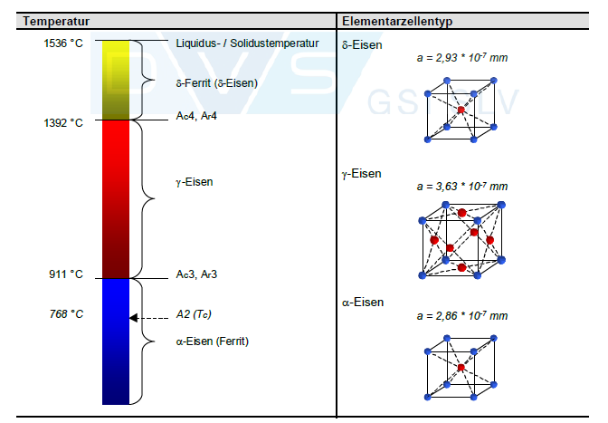
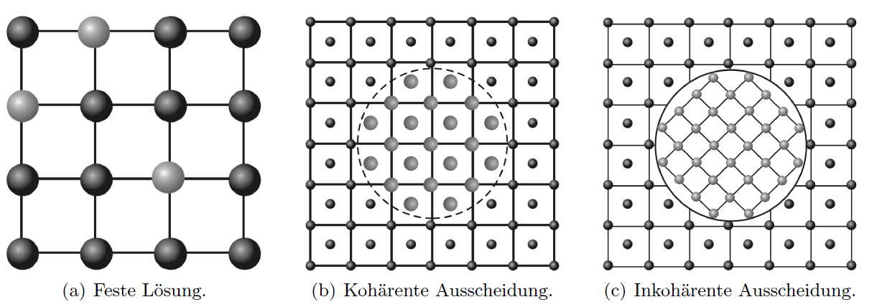
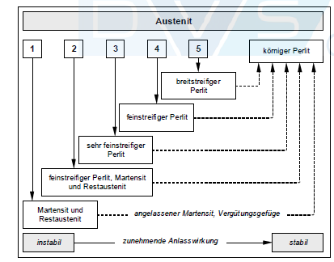
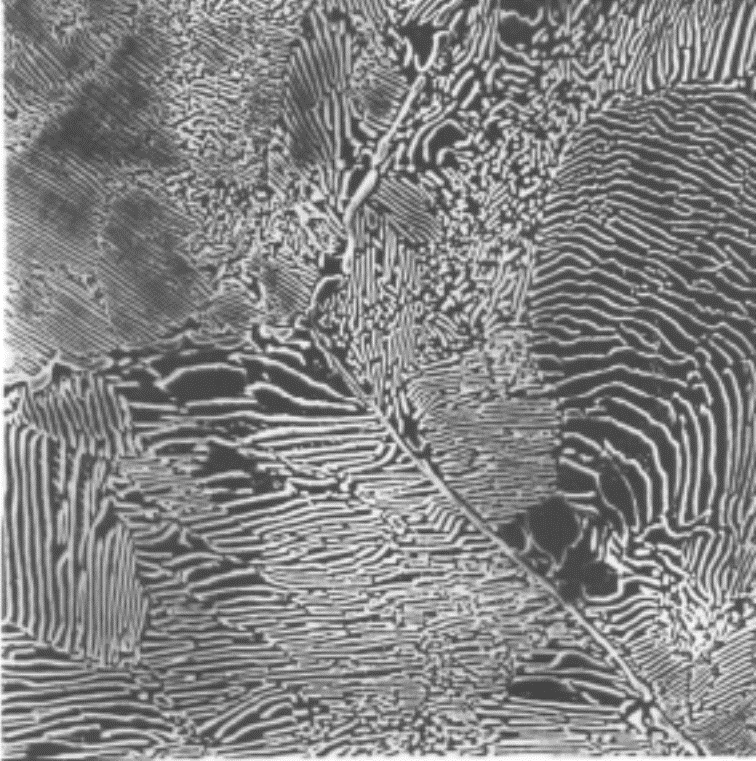
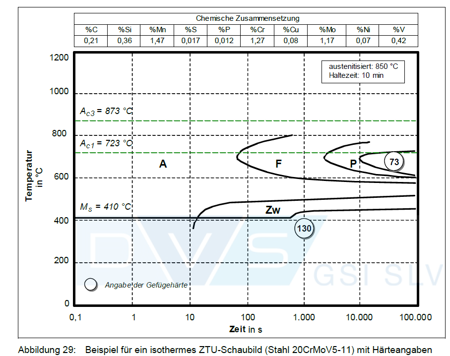
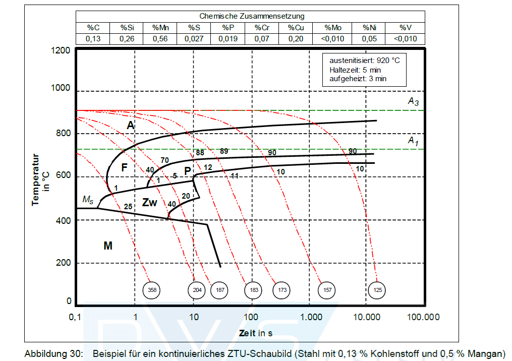
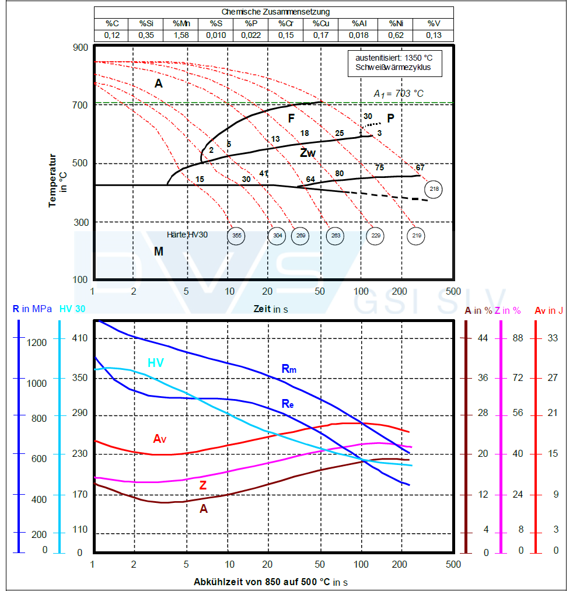

## Werkstofftechnik II
Prof. Dr.-Ing. Christian Willberg 

Kontakt: christian.willberg@h2.de

<!--paginate: true-->

---

## Stahl – Bedeutung und Einordnung

**Warum ist Stahl so wichtig?**
- Weltjahresproduktion: **> 1 Milliarde Tonnen**
- Eisen: **vierthäufigstes Element** der Erdkruste (nach O, Si, Al)
- Mehr als **2000 Stahlsorten** → enormes Anwendungsspektrum
- Sehr gute **Wiederverwertbarkeit**

**Entscheidende Grundlage:**
- Eisen zeigt im Festkörper **Polymorphie** (zwei Kristallstrukturen)
- Unterschiedliche Kohlenstofflöslichkeit der Phasen
- → ermöglicht gezielte Eigenschaftseinstellung

---

| Eigenschaft | Wert |
|---|---|
| Schmelzpunkt (reines Fe) | 1536 °C |
| Max. C-Lösl. γ-Phase | 2.06 % bei 1147 °C |
| Max. C-Lösl. α-Phase | 0.02 % bei 723 °C |
| Stahl (Definition) | **< 2 % C** |
| Gusseisen (Definition) | **> 2 % C** |

> **Stahl = Fe-C-Legierung mit C < 2 %**

---

## Polymorphie des Eisens 

**δ-Phase** (kubisch raumzentriert, krz)
- Erstarrt aus Schmelze bei **1536 °C**
- Stabil bis **1392 °C**

**γ-Phase = Austenit** (kubisch flächenzentriert, kfz)
- Umwandlung bei **1392 °C**: krz → kfz
- Stabil bis **911 °C**
- Löst bis zu **2.06 % C** (bei 1147 °C)
- 12 Atome pro Elementarzelle (dicht gepackt)

---

## Polymorphie des Eisens 

**α-Phase = Ferrit** (kubisch raumzentriert, krz)
- Umwandlung bei **911 °C**: kfz → krz
- Stabil bei Raumtemperatur
- Löst nur **0.02 % C** (bei 723 °C)
- Unterhalb RT: Löslichkeit sinkt auf ca. $10^{-5}$ %

„Eisen zeigt Allotropie – die verschiedenen Kristallstrukturen heißen allotrope Modifikationen."

 
    Bild aus "Internationaler Schweissfachingenieurlehrgang H2 - Werkstoffe und ihr Verhalten beim Schweißen"

---

# Das Fe-C-Diagramm 

---

| Punkt | C [%] | T [°C] | Bedeutung |
|---|---|---|---|
| H | 0.10 | 1493 | δ-Mischkristall, peritektisch |
| B | 0.51 | 1493 | Schmelze, peritektisch |
| I | 0.16 | 1493 | γ-MK, peritektisch |
| S | 0.80 | 723 | eutektoider Punkt |
| P | 0.02 | 723 | max. C-Lösl. Ferrit |
| K | 6.67 | 723 | Zementit Fe₃C |
| C | 4.30 | 1147 | eutektischer Punkt |
| E | 2.06 | 1147 | max. C-Lösl. Austenit |
| F | 6.67 | 1147 | Zementit Fe₃C |

---

## Die drei Sonderreaktionen – mit Punktbezeichnungen

### 1. Peritektische Reaktion (1493 °C)

$$\delta_{MK} + \text{Schmelze} \rightarrow \gamma_{MK}$$

| Punkt H | Punkt B | Punkt I |
|---|---|---|
|C =  0.1% | 0.51 % | 0.16 % |

→ Für **Wärmebehandlungsprozesse von untergeordnetem Interesse**

---

### 2. Eutektoide Reaktion (723 °C) ⭐

$$\gamma_{MK} \rightarrow \alpha_{MK} + \text{Fe}_3\text{C}$$

| Punkt S | Punkt P | Punkt K |
|---|---|---|
| C = 0.80 % | 0.02 % |  6.67 % |

→ **Wichtigste Reaktion für Stähle** → Perlit entsteht (0.02% < C < 2.06%)

---

### 3. Eutektische Reaktion (1147 °C)

$$\text{Schmelze} \rightarrow \gamma_{MK} + \text{Fe}_3\text{C}$$

| Punkt C | Punkt E | Punkt F |
|---|---|---|
| C = 4.30 % |2.06 % |  6.67 % |

→ Entstehendes Gefüge: **Ledeburit I**
→ Relevant für **Eisengusswerkstoffe** 

> Unterhalb 723 °C scheidet sich aus dem Ferrit noch geringfügig **Tertiärzementit** aus (dritte Form der Zementitausscheidung). Die Löslichkeit sinkt auf ca. $10^{-5}$ % bei RT.

---

## Klassifikation: Stahl und Gusseisen

| Werkstoff | andere Bezeichnung | Kohlenstoffgehalt |
|---|---|---|
| untereutektoider Stahl | unterperlitischer Stahl | 0.02 ≤ C < 0.8 % |
| eutektoider Stahl | perlitischer Stahl | = 0.8 % |
| übereutektoider Stahl | überperlitischer Stahl | 0.8 < C ≤ 2.06 % |
| untereutektisches Gusseisen | unterledeburitisches Gusseisen | 2.06 < C < 4.3 % |
| eutektisches Gusseisen | ledeburitisches Gusseisen | = 4.3 % |
| übereutektisches Gusseisen | überledeburitisches Gusseisen | 4.3 < C < 6.67 % |

---

> **Merke:** Stähle scheiden Kohlenstoff immer als **Fe₃C** aus. Bei Gusseisen kann sich je nach Si-Gehalt auch **Graphit** bilden (Grauguss).

> Gefügebild Stahl C45: Perlitkorn im ferritisch-perlitischen Gefüge | Gefügebild EN-GJS 400: Ledeburit mit Graphitausscheidungen

---

## Ausscheidungstypen – Kohärenz

<!-- _class: cols-2-1 -->

**Drei Typen:**

**Kohärente Ausscheidung**
- Kristallgitter von Matrix und Phase stimmen überein
-  geringe Kohärenzspannungen
-  hohe Festigkeitssteigerung

**Teilkohärente (semikohärente) Ausscheidung**
- Nur teilweise Gitterübereinstimmung
-  größere Kohärenzspannungen

Ausscheidungen entstehen, wenn sich die **Löslichkeit** einer Komponente in fester Lösung mit der Temperatur ändert. Sie sind **sekundäre Phasen** – auch in Stählen (z. B. Karbide).

---

<!-- _class: cols-2-1 -->

**Inkohärente Ausscheidung**
- Deutlich verschiedene Gitterstruktur von der Matrix
-  größte Kohärenzspannungen
-  geringster positiver Festigungseffekt pro Teilchen

> Sowohl gelöste Atome als auch Ausscheidungsteilchen stellen **Hindernisse für die Versetzungsbewegung** dar → Festigkeitssteigerung. Das Ausmaß hängt vom Legierungssystem ab.

 
    Bild aus "Werkstoffkunde" Vorlesung
Joachim Rösler, Sebastian Piegert,
Britta Laux, Michaela Necker
TU-BS

---

## Einfluss von Legierungselementen auf die γ-Schleife

<!-- _class: cols-2-1 -->

Legierungselemente beeinflussen:
- Schmelz- und Umwandlungstemperaturen
- Löslichkeit des Kohlenstoffs
- Diffusionsgeschwindigkeit
- Bildung neuer Verbindungen

**Austenitbildner** → erweitern das γ-Gebiet
- A₄-Temperatur wird **angehoben**, A₃ wird **abgesenkt**
- Elemente: **Ni, Mn, Co, C, N, Cu, Zn, Au, Re**

**Ferritbildner** → verengen das γ-Gebiet
- A₄ wird abgesenkt, A₃ wird angehoben
- Elemente: **Cr, Si, Mo, W, V, Ti, Al, Nb, Ta, Zr**

---

**Vier Typen der γ-Schleife:**

| Typ | Beschreibung | Beispiel |
|---|---|---|
| (a) | unbeschränkt offenes γ-Gebiet | Ni, Mn |
| (b) | Begrenzung durch heterogenes Zustandsfeld | Co |
| (c) | geschlossenes γ-Gebiet mit rückläufiger Gleichgewichtslinie | Cr, Si |
| (d) | Begrenzung durch heterogene Zustandsfelder | Mo, W |

> Beispiel Si: Schon **2.0 % Si** engen das Austenitgebiet deutlich ein. Bei **4 % Si** nur noch im Bereich kleiner C-Gehalte austenitisch. Die Cr-Wirkung kann durch Kohlenstoff teilweise kompensiert werden (→ Härtbarkeit niro-Stähle).

---

## Karbidbildung in Stählen

**Karbidbildner:** Cr, V, Nb, Ta, Zr, Ti, Mo, W, Ni, Mn, Co
**Nichtkarbidbildner:** N, Al

**Drei Karbidgruppen (nach Goldschmidt):**

**Gruppe 1 – kubische Karbide (Gruppen IV, V)**
- Einfaches **kubisches Gitter**, C auf Zwischengitterplätzen
- Sehr stabil, **schwer löslich** im Austenit
- Zusammensetzung oft **nichtstöchiometrisch** (z. B. Vanadin-Karbid)
- Beispiele: TiC, NbC, VC, TaC, ZrC

---

**Gruppe 2 – hexagonale Karbide (Gruppen V, VI)**
- Dichte hexagonale Packung, MeC und Me₂C
- Stabil und im Austenit schwer löslich
- Cr₇C₃, Mn₇C₃ gehören hierher

**Gruppe 3 – orthorhombische Karbide**
- Dem Zementit ähnlich (Fe₃C-Typ)
- Weitgehende Substitution durch Fremdatome möglich
- Geringere Stabilität, leichter im Austenit löslich
- Me₂₃C₆ (z. B. Cr₂₃C₆)

---

**Chrom – besonders wichtig bei Karbidbildung:**

Chrom zeigt mannigfaltiges Verhalten – alle Chromkarbide können weitgehend Chrom durch Eisenatome ersetzen:

| Karbid | max. Fe-Gehalt |
|---|---|
| Cr₂₃C₆ | 34.4 % Fe |
| Cr₇C₃ | 53.8 % Fe |
| Fe₃C (Zementit) | 20.0 % Cr |

---

**Doppelkarbide** (nur in ternären Systemen):
- Fe₃W₃C, Fe₃Mo₃C
- Substitution durch ähnliche Metalle möglich

> **Bedeutung für Stähle:** Karbide erhöhen **Härte, Verschleißbeständigkeit und Warmfestigkeit** – je nach Stabilität und Verteilung. Temperaturstabilere Karbide (Gruppe 1 und 2) bleiben auch bei hohen Anlasstemperaturen wirksam.

---

## Abkühlung aus dem Austenitbereich – Überblick

Mit zunehmender Abkühlgeschwindigkeit werden die A₃- und A₁-Temperaturen abgesenkt, bis sie zusammenfallen.

**Umwandlungsschema (zunehmende Abkühlgeschwindigkeit → 1 bis 5 links):**

 
    Bild aus "Internationaler Schweissfachingenieurlehrgang H2 - Werkstoffe und ihr Verhalten beim Schweißen"

---

**Unterkühlungsstufen bei beschleunigter Abkühlung:**

| Stufe | v [K/s] | T [°C] | Gefüge | Härte HV |
|---|---|---|---|---|
| 0 | < 1 | 723 | Perlit (+Ferrit/Zementit) | 200 |
| I | 1–200 | 690–600 | feinstreif. Perlit (Sorbit) | 390 |
| II | 200–250 | 600–500 | sehr feinstr. Perlit (Troostit) | 440 |
| III | 250–600 | 430–98 | Martensit | 710–840 |
| IV | > 600 | (300)–< 0 | Restaustenit | 170–222 |

> Ursache: Bei hohen Abkühlraten stehen die für Diffusion erforderlichen Zeit nicht mehr zur Verfügung.

---

## Perlitbildung – drei Phasen im Detail

Perlitbildung ist ein **eutektoider, diffusionsgesteuerter** Umwandlungsmechanismus.

**Phase ①**
Im Bereich der A₁-Temperatur entmischt der γ-Mischkristall örtlich: Kohlenstoff diffundiert **stellenweise aus dem Austenit** in dessen unmittelbare Umgebung.

**Phase ②**
In einem örtlich begrenzten Bereich ist das Gefüge stellenweise stark an Kohlenstoff verarmt und direkt daneben mit Kohlenstoff übersättigt. So können sich C-arme Bereiche in **α-Mischkristall** umwandeln, und direkt daneben bildet sich aufgrund der C-Übersättigung **Fe₃C (Zementit)**.

**Phase ③**
Die Entmischung des Austenits schreitet voran, der Anteil an Perlit nimmt zu. Der Perlit folgt in seiner Entstehung den **vorhandenen Austenitkorngrenzen**.

---

**Gefügebild:**
- Ferritisch-perlitisches Gefüge: Baustahl S235JR+N (homogen, 200 µm)
- Streifiger Perlit mit eingelagerten Graphitvermikeln: Gusseisen GJV 400 (20 µm)

> Abkühlgeschwindigkeit bestimmt Lamellenabstand → je schneller, desto **feiner** der Perlit → desto höhere Festigkeit

---

<!-- _class: cols-2-1 -->

## Martensitbildung – Grundlagen

> **Martensit** = tetragonal verzerrter Ferrit (benannt nach Adolf MARTENS, 1850–1914)

**Martensitische Umwandlung** = diffusionslose Umwandlung durch **Scherbewegung** der Atome (ähnlich Zwillingsbildung)

**Entstehung in drei Phasen:**

**Phase ①** Der Kohlenstoff kann aufgrund zu hoher Abkühlgeschwindigkeit **nicht entmischen**.

**Phase ②** Der kfz-Austenit klappt diffusionslos in eine **tetragonal verzerrte raumzentrierte** Phase um. Diese ist mehr oder weniger feinnadelig ausgeprägt.

**Phase ③** Nadelförmige Martensitplatten **durchziehen das ehemalige Austenitkorn** von einer Seite zur anderen.

---

**Thermodynamik der Martensitbildung:**
- **Zeitunabhängig** (thermoelastisch) – der umgewandelte Anteil hängt nur von der **Unterkühlung** ab
- Erst wenn Triebkraft groß genug → Matrix verformt sich plastisch → Martensitkeim wächst mit hoher Geschwindigkeit (nahe Schallgeschwindigkeit) bis zur Phasengrenze

---

**Ms und Mf vs. Kohlenstoffgehalt:**

| C-Gehalt [%] | Ms [°C] | Mf [°C] |
|---|---|---|
| 0.2 | ~420 | ~250 |
| 0.4 | ~350 | ~150 |
| 0.8 | ~230 | ~Raumtemperatur |
| 1.0 | ~170 | < 0 °C |
| > 1.0 | < 100 | < − 50 °C |

> Höherer C-Gehalt → niedrigere Ms und Mf → **Restaustenit** bei übereutektoiden Stählen unvermeidlich!

---

### Lattenmartensit („geordneter" Martensit)
- Andere Namen: Lanzett-, Block- oder massiver Martensit; *lath martensite*
- **C-Bereich:** > 0.2 bis 0.6 % (untereutektoid)
- **Aufbau:** abgeflachte Latten, dicht nebeneinander zu Schichten und Blöcken gepackt, parallel nebeneinander angeordnet
- **Verformbarkeit:** besser als Plattenmartensit (höhere Temperatur)

---

### Plattenmartensit („ungeordneter" Martensit)
- Andere Namen: nadelförmig, nadlig oder verzwillingter Martensit; *plate martensite* / *twinned martensite*
- **C-Bereich:** > 0.6 bis 1.0 % (eutektoid bis übereutektoid)
- **Aufbau:** Platten werden mit fortlaufender Bildungszeit kürzer, füllen den Raum immer dichter; verschiedene Winkel zueinander
- **Verformbarkeit:** schlechter (niedrigere Temperatur, höhere C-Verspannung)

> **Martensit ist tetragonal verzerrter Ferrit.**

---

**Wichtig: Restaustenit**
- Je nach eingelagertem C bleibt stets **ein Teil des Austenits** erhalten
- Restaustenit entsteht durch die hohen Verzerrungsspannungen, die die zuletzt entstandenen Martensitplatten an die zuvor gebildeten ausüben

**TRIP-Stähle** (neuere Entwicklung):
- Martensitische Umwandlungen können auch **deformationsinduziert** initiiert werden
- **TR**ansformation **I**nduced **P**lasticity
- Bei hohen Verformungsgeschwindigkeiten wandelt metastabiler C-übersättigter Austenit in Martensit um → Umformenergie wird vom Stahl absorbiert

---

## Zwischenstufengefüge (Bainit) – Bildung

<!-- _class: cols-2-1 -->

Entsteht im Temperaturbereich zwischen A₁ und 600–400 °C bei Abkühlgeschwindigkeiten, die zwischen Perlit- und Martensitbildung liegen.

**Bildung in drei Phasen:**

**Phase ①** Der Austenit entmischt sich aufgrund der hohen Abkühlgeschwindigkeit nur noch in **sehr kleinen Bereichen** → Kohlenstoff kann nur über **kurze Entfernungen** abdiffundieren.

**Phase ②** Durch den lokal abgesenkten Kohlenstoffgehalt erhöht sich die **Ms-Temperatur** in diesen Bereichen lokal.

**Phase ③** Die kleinen, C-entmischten Gebiete können **lokal martensitisch umwandeln** (örtlich erhöhte Ms-Temperatur wird unterschritten). Aufgrund der noch hohen Temperaturen werden diese Bereiche sofort wieder angelassen. In den C-angereicherten Bereichen bilden sich **feinste Fe₃C-Ausscheidungen** → das entstandene Gefüge wird als **Zwischenstufengefüge** bezeichnet.

---

> **Name:** Temperaturen liegen **zwischen** den Stufen der Perlit- und Martensitbildung.

**Zwei nebeneinander ablaufende Vorgänge:**
1. Diffusionsgesteuerter C-Platzwechsel über **sehr kurze Entfernungen**
2. Diffusionslose **(massive) Martensitbildung**

> Zwischenstufengefüge ist metallographisch **äußerst schwer von Martensit** zu unterscheiden → nur mit TEM sicher zu bestimmen!

**Arten von Bainit:**
- Oberer Bainit (~350–500 °C)
- Unterer Bainit (~200–350 °C)
- Körniger Bainit
- Inverser Bainit

---

### Oberer Bainit
- Besteht aus **nadelförmigem Ferrit**, in Paketen angeordnet
- Zwischen den einzelnen Ferritnadeln liegen mehr oder weniger **durchgehende Filme aus Karbiden** parallel zur Nadelachse
- Erscheinungsbild: **perlitähnlich**
- Morphologie: Ferritlamellen + Zementit wachsen von Austenitkorngrenzen
- rechts Carbidausscheidung im oberen Bainit

---

### Unterer Bainit
- Aufgebaut aus **Ferritplatten**
- Innerhalb der Platten bilden sich Eisenkarbide unter einem **Winkel von 60°** zur Nadelachse
- Besitzt bereits große **Ähnlichkeit zum Martensit**
- Erscheinungsbild: martensitähnlich

---

**Eigenschaften Bainit:**
- Gute Kombination aus **Festigkeit und Zähigkeit**
- Technisch erzeugt durch **Warmbadhärten** (isotherm)
- Oberer Bainit: perlitähnliche Eigenschaften
- Unterer Bainit: martensitähnliche Eigenschaften

---

## ZTU-Schaubilder – Einführung und Typen

**Warum ZTU-Diagramme?**
Fe-C-Diagramm gilt nur für **Gleichgewichtszustände** (sehr langsame Abkühlung). In der Praxis treten schnellere Abkühlungen auf → Umwandlungen laufen **außerhalb des Gleichgewichts** ab.

**ZTU-Diagramme beantworten:**
- Nach welcher Zeit **beginnt** die Umwandlung des Austenits?
- Bei welcher Temperatur?
- **Welches Gefüge** entsteht, in welchen Anteilen?
- Wann und bei welcher Temperatur ist die Umwandlung **beendet**?
- Welche **Härte** weist das entstandene Gefüge auf?

---

>  **ZTU-Diagramme gelten streng genommen nur für die Werkstoffcharge und nur für die Bedingungen, für und unter welchen sie aufgestellt wurden.**

---

**Zwei Grundtypen:**

| | Isothermes ZTU | Kontinuierliches ZTU |
|---|---|---|
| Abkühlung | Sprungartig auf T = konst. | Gleichmäßig mit konst. Rate |
| Kurven | horizontale Isotherme | geneigte Abkühlkurven |
| Anwendung | Wärmebehandlung (Härten, Vergüten), isothermes Schweißen | Beurteilung Umwandlungsvorgänge, Schweißeignung |
| Aufstellung | kleine Proben, 30–50 K abgeschreckt | gleichmäßige Abkühlung, verschiedene Raten |

**Messverfahren:** metallographisch, dilatometrisch

---

## Isothermes ZTU-Diagramm – Beispiel 20CrMoV5-11

**Austenitisiert:** 850 °C, Haltezeit 10 min

- A-Gebiet: Austenit (stabil)
- F: Ferrit-Bildungsbeginn
- P: Perlit-Bildungsbeginn
- Zw: Zwischenstufengefüge (Bainit)
- **A₃ = 873 °C, A₁ = 723 °C, Ms = 410 °C**
- Zahlen in Kreisen = **Härteangaben HV**

 
    Bild aus "Internationaler Schweissfachingenieurlehrgang H2 - Werkstoffe und ihr Verhalten beim Schweißen"

---

**Charakteristische Anwendungen:**
- Wärmebehandlung von Stählen (Härten, Vergüten)
- Isothermes Schweißen aufhärtungsempfindlicher Stähle

 
    Bild aus "Internationaler Schweissfachingenieurlehrgang H2 - Werkstoffe und ihr Verhalten beim Schweißen"

---

## Kontinuierliches ZTU – Beispiel 0.13 % C

**Austenitisiert:** 920 °C, Haltezeit 5 min, Aufheizzeit 3 min

**Unterschied zum isothermen ZTU:**
- Abkühlkurven sind **geneigt** (nicht horizontal)
- Auf jeder Abkühlkurve: Beginn und Ende jeder Umwandlung markiert

 
    Bild aus "Internationaler Schweissfachingenieurlehrgang H2 - Werkstoffe und ihr Verhalten beim Schweißen"

---
- Felder zeigen Gefügebestandteile in Abhängigkeit der **Abkühlgeschwindigkeit**
- Zahlen in Kreisen an der Abszisse = **Endhärten HV bei RT**

**Typische Anwendungen:** Beurteilung von Umwandlungsvorgängen, Bewertung der **Schweißeignung**

 
    Bild aus "Internationaler Schweissfachingenieurlehrgang H2 - Werkstoffe und ihr Verhalten beim Schweißen"

---

## Schweiß-ZTU-Diagramme

Klassische ZTU-Diagramme für Wärmebehandlungen können **nicht auf schweißtechnische Anwendungen übertragen werden**.

**Besonderheiten von Schweiß-ZTU-Diagrammen:**
- Austenitisierungstemperaturen deutlich **> 1000 °C** (bis ~1350 °C)
- Aufgestellt unter Anwendung wesentlich **höherer Aufheiz- und Abkühlgeschwindigkeiten**
- Zeitachse ist **mehr gestaucht**
- Gelten nur für die **Wärmeeinflusszoneone (WEZ)**, nicht für das Schweißgut

---

**Wichtiger Inhalt:**
- Kritische Abkühlgeschwindigkeiten
- Mechanische Eigenschaften (HV, Re, Rm, A, Z, Av) in Abhängigkeit der Abkühlzeit
- Bewertung der **Aufhärtungsneigung** der WEZ

---

**Schweiß-ZTU Beispiel (0.12 % C, 0.62 % Ni):**

 
    Bild aus "Internationaler Schweissfachingenieurlehrgang H2 - Werkstoffe und ihr Verhalten beim Schweißen"

---

## Kritische Abkühlgeschwindigkeiten und t₈₅-Zeit

**Kritische Abkühlgeschwindigkeiten** (aus kontinuierlichem ZTU):

**Untere kritische Abkühlgeschwindigkeit:**
- Abkühlrate, bei der **erste Anteile von Martensit** entstehen
- Alle langsameren Abkühlraten → **kein Martensit**

**Obere kritische Abkühlgeschwindigkeit:**
- Abkühlrate, bei der sich beim Abschrecken **erstmalig nur noch Martensit** bildet
- Alle schnelleren Raten → **100 % Martensit**

---

**t₈₅-Zeit** (Schweißtechnik)

In unlegierten Stählen finden die meisten Umwandlungen im Temperaturbereich **800–500 °C** statt.

$$t_{8/5} = \text{Zeit zum Abkühlen von 800 °C auf 500 °C}$$

> Die t₈₅-Zeit ist **umgekehrt proportional zur Abkühlgeschwindigkeit**!

- **Große** t₈₅ → geringe Abkühlgeschwindigkeit → weiche Gefüge
- **Kleine** t₈₅ → hohe Abkühlgeschwindigkeit → harte Gefüge (Martensit)

**Für legierte Stähle (z.B. nichtrostende Stähle):**
→ t₁₂₈-Zeit (1200–800 °C), da Umwandlungen dort ablaufen

> ⚠️ Nicht alle ZTU-Quellen verwenden dieselbe Abkühlzeit! SEYFFART verwendet 850–500 °C statt 800–500 °C!

---

## Einfluss von Legierungselementen auf ZTU-Diagramme

ZTU-Diagramme werden grundsätzlich nur unter **genau definierten Austenitisierungsbedingungen** aufgestellt. Aufheizgeschwindigkeit, Austenitisierungstemperatur und Haltedauer beeinflussen das Diagramm maßgebend.

**Einfluss auf die Perlitnase (P-Gebiet):**

| Verschiebung | Ursache | Elemente |
|---|---|---|
| Nase nach **rechts** (verzögert) | geringe Keimzahl, grobes Austenitkorn, langes Halten, hohe Härtetemperatur, C bis 0.9 % | Mn, Ni, Mo, Cr, V |
| Nase nach **links** (beschleunigt) | hohe Keimzahl, feines Austenitkorn, langes Halten, niedrige Härtetemperatur, C über 0.9 % | Mn, Ni, Cr |

---

**Einfluss auf das Ferrit-Vorausscheidungsgebiet (F):**
- Hohe Härtetemperatur → Ferrit-Vorausscheidung verzögert (nach rechts)
- Elemente: **C, Cr, Mn, Ni, V**

**Einfluss auf das Zwischenstufengebiet (Zw/Bainit):**

| Verschiebung | Ursache | Elemente |
|---|---|---|
| Zw nach **rechts** | niedrige Härtetemperatur, Karbidvorausscheidung | – |
| Zw nach **links** | Halten > des Zw-Bereiches | – |

---

**Einfluss auf Ms-Temperatur:**

| Wirkung | Elemente |
|---|---|
| **Ms erniedrigt** (Austenit stabilisiert) | C, Mn, Cr, Ni, Mo, V, Si |
| **Ms erhöht** | Co, Al → niedrige Härtetemperatur, Halten > Ms |

> Keimbildung und Wachstum durchlaufen mit **steigender Unterkühlung ein Maximum** → daraus ergibt sich die charakteristische Nasenform im ZTU-Diagramm. Legierungselemente können die Lage der Nasen verschieben.

---

## Schweißen und ZTU – Grobkornzone und Wärmebehandlung

### t₈₅-Zeit und Grobkornzone

Je größer das **Wärmeeinbringen** beim Schweißen, desto länger kann ein Punkt in der WEZ (Wärmeeinflusszoneone) oberhalb **1300 °C** verweilen. Bei diesen Temperaturen findet das **klassische Grobkornglühen** statt → starkes **Kornwachstum** in der WEZ.

Wärmeeinbringen ↑
→ t₈₅ wird größer
→ langsame Abkühlung
→ WEZ > 1300 °C länger
→ Grobkornzone vergrößert sich
→ stark versprödet!

---

**Gefügebilder (Baustahl S355):**
- Normalzustand: ferritisch-perlitisches Gefüge in **zeiliger Anordnung** (100 µm)
- WEZ: **Grobkornzone** → stark vergröbertes Gefüge, versprödet (100 µm)

> Schweißprozesse mit **energiereduziertem Wärmeeintrag** begrenzen die Breite der Grobkornzone, da Diffusionsvorgänge für Kornwachstum eingeschränkt werden.

---

### Wärmebehandlungsverfahren im ZTU-Diagramm

Temperatur-Zeit-Verläufe wichtiger **Wärmebehandlungsverfahren** lassen sich in das kontinuierliche ZTU-Diagramm einzeichnen:

| Verfahren | T-t-Verlauf | Ziel |
|---|---|---|
| **Härten** | schnelle Abkühlung (rechts an Nase vorbei) | Martensit |
| **Gebrochenes Härten** | zweistufige Abkühlung | gleichmäßigere Martensitbildung |
| **Warmbad-Härten** | Abschrecken + isotherm halten | Bainit (Zwischenstufe) |
| **Zwischenstufenvergüten** | Halten im Bainitgebiet | Bainit + gute Zähigkeit |
| **Patentieren** | kontrollierte Abkühlung auf Perlitstufe | feinstreifiger Perlit (Drähte) |
| **Normalisieren** | langsame Abkühlung an Luft | homogenes fein-perlitisches Gefüge |

> ZTU-Diagramme eignen sich hervorragend zur **stahlsorten- und chargenspezifischen** Wärmebehandlungstechnologieentwicklung: Gewünschtes Gefüge → Eigenschaften ablesen → Abkühlkurve festlegen.

---

## Danke für die Aufmerksamkeit