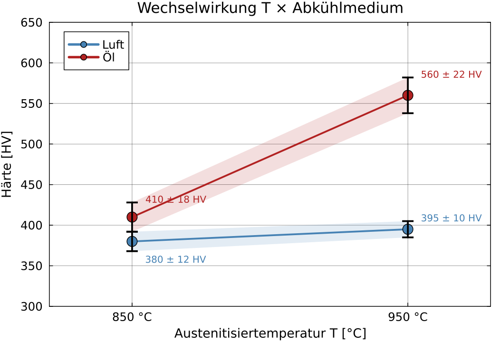

## Werkstofftechnik II
### Design of Experiments (DoE)
Prof. Dr.-Ing. Christian Willberg 

 

Kontakt: christian.willberg@h2.de

<!--paginate: true-->

---

# Motivation – Warum systematisch experimentieren?

## Das Problem in der Werkstofftechnik

In der Werkstofftechnik hängen Eigenschaften wie **Härte, Festigkeit, Korrosionsbeständigkeit** von vielen Parametern gleichzeitig ab:

- Legierungszusammensetzung
- Wärmebehandlungstemperatur und -zeit
- Abkühlgeschwindigkeit
- Umformgrad
- Prüfbedingungen

> **Frage:** Wie viele Versuche braucht man, um alle Einflüsse zu verstehen?

---

# OFAT – One Factor At a Time

## Der intuitive, aber ineffiziente Ansatz

**Idee:** Jeweils einen Parameter variieren, alle anderen festhalten.

| Versuch | T [°C] | t [min] | Abkühlung | Härte HV |
|---|---|---|---|---|
| 1 | 800 | 30 | Luft | 220 |
| 2 | 900 | 30 | Luft | 310 |
| 3 | 1000 | 30 | Luft | 380 |
| 4 | 900 | 60 | Luft | 325 |
| 5 | 900 | 90 | Luft | 330 |
| 6 | 900 | 30 | Öl | 480 |

---

## Wechselwirkungen

<!-- _class: cols-2 -->

**Was OFAT „sieht":**

| Parameter | Effekt auf HV |
|---|---|
| T: 800→1000 °C | +160 HV |
| t: 30→90 min | +10 HV |
| Öl statt Luft | +170 HV |

→ **Schluss:** t fast irrelevant, T und Abkühlungsgeschwindigkeit dominieren.

**Geplante Optimierung:** T = 1000 °C, t = 30 min, Öl
→ Erwartete Härte: ~550 HV

---

Bei Ölabschreckung wurde t **nie variiert** – die Kombination (t, Öl) wurde nie getestet!

| Kombination | Gemessen? |
|---|---|
| 800 °C, Öl, 30 min | ✗ |
| 1000 °C, Öl, 30 min | ✗ |
| 900 °C, Öl, 60 min | ✗ |
| 900 °C, Öl, 90 min | ✗ |

→ 4 von 12 wichtigen Kombinationen fehlen völlig.

**Probleme von OFAT:**
- Wechselwirkungen zwischen Parametern werden **nicht erkannt**
- Hoher Versuchsaufwand für viele Parameter
- Optimum liegt möglicherweise **außerhalb** der getesteten Kombinationen

---

# Was ist Design of Experiments (DoE)?

## Grundidee

Statt einen Parameter nach dem anderen zu variieren: **alle relevanten Faktoren gleichzeitig und systematisch** kombinieren.

> **Ziel:** Mit minimalem Versuchsaufwand maximale Information über Haupteffekte **und Wechselwirkungen** gewinnen.

**Drei Kernprinzipien:**

| Prinzip | Bedeutung |
|---|---|
| **Faktorielle Struktur** | Alle Faktorkombinationen (oder ein definierter Bruchteil) werden getestet |
| **Randomisierung** | Zufällige Versuchsreihenfolge eliminiert systematische Störgrößen |
| **Replizierung** | Wiederholungen ermöglichen Schätzung des Messfehlers |

---

# Grundbegriffe auf einen Blick

| Begriff | Bedeutung | Beispiel |
|---|---|---|
| **Faktor** | Veränderbarer Eingangsparameter | Temperatur T |
| **Stufe** | Eingestellter Wert des Faktors | 800 °C / 1000 °C |
| **Antwortgröße** | Gemessene Zielgröße | Härte HV |
| **Haupteffekt** | Mittlere Wirkung eines Faktors allein | Δ HV pro 100 °C |
| **Wechselwirkung** | Gegenseitige Beeinflussung zweier Faktoren | T × Abkühlmedium |
| **Versuchsplan** | Alle geplanten Faktorkombinationen | Tabelle mit $2^k$ Zeilen |

> OFAT schätzt nur Haupteffekte – und das unvollständig.  
> DoE schätzt Haupteffekte **und** Wechselwirkungen – gleichzeitig, aus denselben Versuchen.

---

# OFAT vs. DoE – Derselbe Aufwand, mehr Information

## Gleiche Versuche, systematisch geplant: $2^3$-Plan

| Nr | T [°C] | t [min] | Abkühlung | Härte HV |
|---|---|---|---|---|
| 1 | 800 | 30 | Luft | 220 |
| 2 | 1000 | 30 | Luft | 380 |
| 3 | 800 | 90 | Luft | 235 |
| 4 | 1000 | 90 | Luft | 395 |
| 5 | 800 | 30 | Öl | 410 |
| 6 | 1000 | 30 | Öl | 560 |
| 7 | 800 | 90 | Öl | 490 |
| 8 | 1000 | 90 | Öl | 620 |

| Ansatz | Versuche | Wechselwirkungen erkennbar? |
|---|---|---|
| OFAT klassisch | 6 | ✗ nein |
| DoE $2^3$ | **8** | ✓ alle |

---

## Was der $2^3$-Plan zusätzlich liefert

**Haupteffekte (aus DoE):**

| Effekt | Δ HV | OFAT-Schätzung | Fehler |
|---|---|---|---|
| T (800→1000 °C) | +182 | +160 | −12 % |
| t (30→90 min) | **+68** | +10 | **−85 %** |
| Öl statt Luft | +198 | +170 | −14 % |

> OFAT **unterschätzt den Zeiteffekt massiv** – weil t nur bei Luftabkühlung getestet wurde, wo er tatsächlich klein ist.

---

**Wechselwirkung t × Abkühlung (neu entdeckt):**

| | Luft | Öl |
|---|---|---|
| t: 30→90 min | +15 HV | **+120 HV** |

→ Bei Ölabschreckung ist t **entscheidend** – bei Luft kaum. OFAT hätte das nie gefunden.

---

# Die Wechselwirkung t × Abkühlung

## Grafische Darstellung

**Parallele Linien** → keine Wechselwirkung
**Divergierende Linien** → **Wechselwirkung vorhanden** ✓

Bei Luft: t-Effekt klein (flache Linie)
Bei Öl: t-Effekt groß (steile Linie)

---

## OFAT-Optimum vs. DoE-Optimum

<!-- _class: cols-2 -->

**OFAT-Empfehlung:**
- T = 1000 °C
- t = 30 min (scheinbar egal)
- Öl
- Erwartete Härte: ~550 HV
- Tatsächliche Härte: **560 HV**

**DoE-Empfehlung:**
- T = 1000 °C
- t = 90 min (jetzt wichtig!)
- Öl
- Erwartete Härte: **620 HV**
- Tatsächliche Härte: **618 HV** ✓

> **+60 HV Unterschied** – allein durch die Erkenntnis der Wechselwirkung.
> Gleicher Ofen, gleiches Material, nur die Haltezeit angepasst.
> OFAT erkennt solche Wechselwirkungen **nicht**. DoE schon.

---

# Versuchsraum und Kodierung

## Normierung der Faktoren

Um Faktoren unterschiedlicher Einheiten vergleichbar zu machen, werden sie **kodiert**:

$$x_i = \frac{X_i - X_{i,\text{Mitte}}}{X_{i,\text{Spanne}}/2}$$

| Reale Einstellung | Kodierter Wert |
|---|---|
| untere Stufe | $x = -1$ |
| Mitte | $x = 0$ |
| obere Stufe | $x = +1$ |

**Beispiel:** T zwischen 800 °C und 1000 °C → Mitte 900 °C, Spanne 200 °C

$$x_T = \frac{T - 900}{100}$$

---

# Vollfaktorieller Versuchsplan $2^k$

## k Faktoren, je 2 Stufen

<!-- _class: cols-2 -->

Alle möglichen Kombinationen werden getestet.

**Beispiel: 2 Faktoren** (T, t), je 2 Stufen → $2^2 = 4$ Versuche

| Versuch | T | t | T×t |
|---|---|---|---|
| 1 | − | − | + |
| 2 | + | − | − |
| 3 | − | + | − |
| 4 | + | + | + |

**Anzahl Versuche:**

| Faktoren k | Versuche $2^k$ |
|---|---|
| 2 | 4 |
| 3 | 8 |
| 4 | 16 |
| 5 | 32 |
| 10 | 1024 |

---

# Vollfaktorieller Plan $2^3$ – Beispiel Vergütungsstahl

## Faktoren: Austenitisiertemperatur T, Haltezeit t, Abkühlmedium M

| Nr | T | t | M | T×t | T×M | t×M | T×t×M | Härte HV |
|---|---|---|---|---|---|---|---|---|
| 1 | − | − | − | + | + | + | − | 280 |
| 2 | + | − | − | − | − | + | + | 360 |
| 3 | − | + | − | − | + | − | + | 295 |
| 4 | + | + | − | + | − | − | − | 375 |
| 5 | − | − | + | + | − | − | + | 450 |
| 6 | + | − | + | − | + | − | − | 580 |
| 7 | − | + | + | − | − | + | − | 470 |
| 8 | + | + | + | + | + | + | + | 610 |

T: 850/950 °C · t: 30/90 min · M: Luft/Öl

---

# Effektberechnung

## Haupteffekt eines Faktors

Der Haupteffekt ist die **mittlere Änderung der Antwortgröße**, wenn der Faktor von − nach + wechselt:

$$E_T = \frac{1}{4}\left[(y_2 - y_1) + (y_4 - y_3) + (y_6 - y_5) + (y_8 - y_7)\right]$$

**Ergebnis aus dem Beispiel:**

| Effekt | Wert [HV] | Interpretation |
|---|---|---|
| $E_T$ (Temperatur) | +92 | Höhere T → deutlich härter |
| $E_t$ (Zeit) | +18 | Längere t → leicht härter |
| $E_M$ (Medium) | +168 | Ölabschreckung → stark härtend |
| $E_{T \times M}$ | +45 | T und M verstärken sich gegenseitig |

---

## Wechselwirkungsdiagramm

Ein Wechselwirkungsdiagramm zeigt die Antwortgröße für alle Kombinationen zweier Faktoren:

- **Parallele Linien** → keine Wechselwirkung
- **Kreuzende oder divergierende Linien** → **Wechselwirkung vorhanden**

> Im Beispiel: Bei Öl wirkt höhere T stärker → divergierende Linien → signifikante T×M-Wechselwirkung

---

# Teilfaktorieller Versuchsplan $2^{k-p}$

## Wenn $2^k$ zu aufwändig ist

Bei 5 Faktoren: $2^5 = 32$ Versuche. Mit einem **halbfraktionellen Plan** $2^{5-1}$: nur **16 Versuche**.

**Idee:** Höhere Wechselwirkungen (3-fach, 4-fach) sind meist vernachlässigbar klein → man kann Spalten aus dem vollen Plan weglassen.

**Preis:** Einige Effekte sind **konfundiert** (aliased) – sie können nicht einzeln geschätzt werden.

| Vollplan | Teilplan | Ersparnis |
|---|---|---|
| $2^4 = 16$ | $2^{4-1} = 8$ | 50 % |
| $2^5 = 32$ | $2^{5-2} = 8$ | 75 % |
| $2^6 = 64$ | $2^{6-3} = 8$ | 87 % |

---

# Response Surface Methodology (RSM)

## Über 2 Stufen hinaus

Mit $2^k$-Plänen kann man nur **lineare Effekte** schätzen. Wenn ein **Optimum** gesucht wird (Kurve, nicht Gerade) → **RSM mit 3 Stufen** oder **Central Composite Design (CCD)**.

**Central Composite Design:** Würfelpunkte + Sternpunkte + Mittelpunkt

$$\hat{y} = b_0 + \sum b_i x_i + \sum b_{ij} x_i x_j + \sum b_{ii} x_i^2$$

**Anwendung in der Werkstofftechnik:**
- Optimierung der Ausscheidungswärmebehandlung (T, t → maximale Härte)
- Schweißparameteroptimierung (Strom, Geschwindigkeit, Vorwärmung → minimale WEZ)
- Beschichtungsoptimierung (Schichtdicke, Temperatur → maximale Haftfestigkeit)

---

# Statistische Auswertung – ANOVA

## Analysis of Variance

Die **Varianzanalyse (ANOVA)** trennt die Gesamtstreuung der Messwerte in:

$$SS_{\text{gesamt}} = SS_{\text{Faktor A}} + SS_{\text{Faktor B}} + SS_{A \times B} + SS_{\text{Fehler}}$$

**F-Test:** Ist der Effekt eines Faktors signifikant größer als der Messfehler?

$$F = \frac{MS_{\text{Faktor}}}{MS_{\text{Fehler}}}$$

| p-Wert | Bedeutung |
|---|---|
| p < 0.05 | Effekt **signifikant** (95 % Konfidenz) |
| p < 0.01 | Effekt **hochsignifikant** |
| p > 0.05 | Effekt **nicht nachweisbar** |

> Ohne Replizierung kein Fehlerterm → keine Signifikanzaussage möglich!

---

# Ablauf einer DoE-Studie

## Schritt für Schritt

**① Zielsetzung definieren**
Was soll optimiert oder verstanden werden? (Härte, Festigkeit, Korrosion …)

**② Faktoren und Stufen festlegen**
Welche Parameter sind relevant? Welcher Bereich ist technisch sinnvoll?

**③ Versuchsplan wählen**
Vollfaktoriell, teilfaktoriell, RSM – je nach Aufwand und Ziel

---

**④ Versuche randomisiert durchführen**
Zufällige Reihenfolge → systematische Fehler (Drift, Tageseffekte) vermeiden

**⑤ Effekte berechnen und statistisch auswerten**
ANOVA, Haupteffektplot, Wechselwirkungsplot

**⑥ Modell validieren**
Bestätigungsversuche bei der vorhergesagten optimalen Einstellung

---

# Häufige Fehler in der Versuchsplanung

| Fehler | Folge | Vermeidung |
|---|---|---|
| Keine Randomisierung | Systematische Störgrößen verfälschen Ergebnisse | Zufällige Versuchsreihenfolge |
| Keine Replizierung | Kein Fehlerterm → keine Signifikanzaussage | Mindestens 2–3 Wiederholungen |
| Zu viele Faktoren auf einmal | Konfundierung, unklare Interpretation | Screening erst, dann Detail |
| Stufen zu eng gewählt | Effekt liegt im Messrauschen | Stufen weit genug spreizen |
| Wichtige Faktoren vergessen | Scheinbar zufällige Streuung | Literatur, Expertenwissen nutzen |

---

# Zusammenfassung

## Kernaussagen

- **OFAT** ist ineffizient und erkennt keine Wechselwirkungen
- **DoE** nutzt alle Versuche zur Schätzung aller Effekte gleichzeitig
- **$2^k$-Pläne** sind der Einstieg: einfach, effizient, interpretierbar
- **Wechselwirkungen** sind in der Werkstofftechnik häufig und wichtig
- **Randomisierung und Replizierung** sind unverzichtbar für gültige Schlüsse
- **RSM** ermöglicht Optimierung über lineare Effekte hinaus

> Ein gut geplanter Versuch mit 8 Versuchen kann mehr Information liefern als 30 schlecht geplante.

---

# Korrelation

## Zusammenhang zwischen zwei Messgrößen

**Pearson-Korrelationskoeffizient:**

$$r = \frac{\sum(x_i - \bar{x})(y_i - \bar{y})}{\sqrt{\sum(x_i-\bar{x})^2 \cdot \sum(y_i-\bar{y})^2}} \quad \in [-1, +1]$$

| $r$ | Interpretation |
|---|---|
| $+1$ | perfekte positive lineare Korrelation |
| $0$ | kein linearer Zusammenhang |
| $-1$ | perfekte negative lineare Korrelation |

---

**Werkstofftechnisches Beispiel:**

| Paar | $r$ | Bedeutung |
|---|---|---|
| $R_m$ vs. Härte HV | +0.97 | stark positiv – bekannte Faustregel |
| $R_m$ vs. $A$ | −0.88 | stark negativ – Festigkeit/Duktilität |
| Walztemperatur vs. Korngröße | +0.82 | positiv – Grobkornrisiko |

---

# Korrelation ≠ Kausalität

## Ein zentrales Missverständnis

> „Je mehr Stellen eine Korrelation zeigt, desto kausaler fühlt sie sich an – aber sie ist es nicht."

**Scheinkorrelation – Beispiel:**

In einer Studie an Stahlwerken wurde festgestellt:

> Werke mit **höherem Kaffeekonsum** produzieren **festigeren Stahl**.

$r = +0.79$ – statistisch signifikant!

---

**Erklärung:** Größere Werke → mehr Mitarbeiter → mehr Kaffeeverbrauch → modernere Anlagen → höhere Stahlqualität. Die **Werksgröße** ist die eigentliche Ursache – Kaffee ist eine **Scheinkorrelation**.

> Immer nach der **dritten Variable** suchen, bevor Kausalität angenommen wird!

---

# Das Simpson-Paradox

## Definition

Ein Trend, der in **jeder Teilgruppe** gilt, kann sich **umkehren**, wenn die Gruppen zusammengefasst werden.

> „Die Wahrheit hängt davon ab, wie man die Daten gruppiert."

---

# Simpson-Paradox – Werkstoffbeispiel

## Fragestellung: Welcher Ofen produziert festigeren Stahl?

**Gesamtdatensatz (beide Chargen zusammen):**

| Ofen | Proben | $\bar{R}_m$ [MPa] |
|---|---|---|
| Ofen A | 100 | **562 MPa** |
| Ofen B | 100 | 548 MPa |

→ Scheinbar: **Ofen A ist besser**

---

# Simpson-Paradox – Auflösung

## Aufgetrennt nach Legierung:

| | Legierung 1 (niedriglegiert) | Legierung 2 (hochlegiert) |
|---|---|---|
| Ofen A | 60 Proben → **490 MPa** | 40 Proben → **660 MPa** |
| Ofen B | 10 Proben → **510 MPa** | 90 Proben → **680 MPa** |

**Bei beiden Legierungen gilt: Ofen B > Ofen A!**

---

**Warum dreht sich der Gesamttrend um?**

Ofen A produzierte **mehr hochlegierte** Proben (die generell fester sind), Ofen B **mehr niedriglegierte**. Die **Legierungsverteilung** (Confounder) verzerrt den Gesamtvergleich.

---

# Simpson-Paradox – Konsequenzen für DoE

## Was bedeutet das für Versuche?

**Problem:** Wenn Versuchsbedingungen **nicht randomisiert** sind, können Confounders den wahren Effekt verzerren oder umkehren.

**Beispiel aus der Praxis:**

- Charge 1 (Montag): immer bei Ofen A, Temperatur schwankt wenig
- Charge 2 (Freitag): immer bei Ofen B, Temperatur schwankt stark

→ Ofen und Wochentag sind **konfundiert** → man kann Ofeneffekt nicht vom Tageseffekt trennen

---

**Lösung:**
- **Randomisierung** der Versuchsreihenfolge
- **Blockbildung**: Charge als Block-Faktor explizit in den Plan aufnehmen
- **Stratifizierung** bei der Auswertung: Gruppen getrennt analysieren, dann zusammenfassen

> Das Simpson-Paradox ist kein statistischer Trick – es ist ein **realer Fehler**, der zu falschen Entscheidungen führt.

---

# Mini-Statistik – Zusammenfassung

| Konzept | Formel / Werkzeug | Bedeutung in DoE |
|---|---|---|
| Mittelwert $\bar{x}$ | $\frac{1}{n}\sum x_i$ | Schätzung des wahren Wertes |
| Standardabweichung $s$ | $\sqrt{\frac{\sum(x_i-\bar{x})^2}{n-1}}$ | Streuung um den Mittelwert |
| Konfidenzintervall | $\bar{x} \pm t \cdot s/\sqrt{n}$ | Unsicherheit der Schätzung |
| Korrelation $r$ | Pearson-Koeffizient | Linearer Zusammenhang |
| Kausalität | nicht aus $r$ ableitbar | Dritte Variable suchen! |
| Simpson-Paradox | Trend kehrt sich um | Immer stratifiziert prüfen |

> **Fazit:** Statistische Kenntnisse sind keine Nebensache – sie entscheiden darüber, ob man aus Versuchen **richtige Schlüsse** zieht oder systematisch falsch liegt.

---

## Danke für die Aufmerksamkeit
