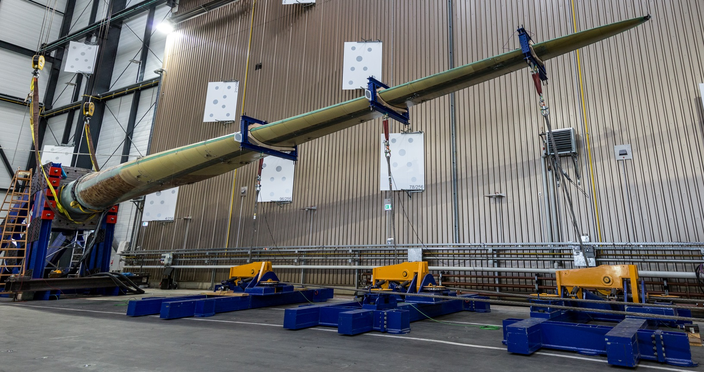

<style>
.container{
  display: flex;
  }
.col{
  flex: 1;
  }
</style>

<style scoped>
.column-container {
    display: flex;
    flex-direction: row;
}

.column {
    flex: 1;
    padding: 0 20px; /* Platzierung der Spalten */
}

.centered-image {
    display: block;
    margin: 0 auto;
}
</style>

<style>
footer {
    font-size: 14px; /* Ändere die Schriftgröße des Footers */
    color: #888; /* Ändere die Farbe des Footers */
    text-align: right; /* Ändere die Ausrichtung des Footers */
}
img[alt="ORCID"] {
    height: 15px !important;
    width: auto !important;
    vertical-align: top !important;
    display: inline !important;
    margin: 0 !important;
}
</style>


##  Werkstofftechnik II - Festigkeit und Plastizität
Prof. Dr.-Ing.  Christian Willberg [](https://orcid.org/0000-0003-2433-9183)



Kontakt: christian.willberg@h2.de

<div style="position: absolute; bottom: 10px; left: 520px; color: blue; font-size: 20px;"> 
    <a href="https://doi.org/10.1007/s42102-021-00079-6" style="color: blue;">Bildreferenz</a>
</div>


---

<!--paginate: true-->

# Beispiel: Zugversuch – DoE-Anwendung

## Fragestellung

Wie beeinflussen Herstellungsparameter die **Zugfestigkeitskennwerte** von Stahlproben?

**Faktoren und Stufen:**

| Faktor | − (untere Stufe) | + (obere Stufe) |
|---|---|---|
| A: Walztemperatur | 900 °C | 1100 °C |
| B: Umformgrad | 20 % | 60 % |
| C: Abkühlrate | langsam (Luft) | schnell (Wasser) |

**Antwortgrößen:**
- Streckgrenze $R_{p0,2}$ [MPa]
- Zugfestigkeit $R_m$ [MPa]
- Bruchdehnung $A$ [%]

> Mehrere Antwortgrößen gleichzeitig → **Zielkonflikte** werden sichtbar!

---

# Zugversuch – Versuchsplan und Ergebnisse

## $2^3$-Plan, je 2 Wiederholungen

| Nr | A | B | C | $R_{p0,2}$ [MPa] | $R_m$ [MPa] | $A$ [%] |
|---|---|---|---|---|---|---|
| 1 | − | − | − | 310 | 480 | 28 |
| 2 | + | − | − | 370 | 540 | 24 |
| 3 | − | + | − | 380 | 550 | 22 |
| 4 | + | + | − | 430 | 610 | 19 |
| 5 | − | − | + | 420 | 590 | 21 |
| 6 | + | − | + | 490 | 660 | 17 |
| 7 | − | + | + | 500 | 670 | 15 |
| 8 | + | + | + | 570 | 740 | 12 |

---

# Zugversuch – Effektauswertung

## Haupteffekte

| Effekt | $\Delta R_{p0,2}$ [MPa] | $\Delta R_m$ [MPa] | $\Delta A$ [%] |
|---|---|---|---|
| A (Walz-T) | +65 | +70 | −4 |
| B (Umformgrad) | +82 | +85 | −5 |
| C (Abkühlrate) | +105 | +115 | −8 |
| B×C | +28 | +25 | −3 |

**Interpretation:**
- Alle drei Faktoren erhöhen Festigkeit – aber **senken gleichzeitig die Duktilität**
- Schnelle Abkühlung hat den **stärksten Einzeleffekt**
- Wechselwirkung B×C: Hoher Umformgrad **verstärkt** den Effekt schneller Abkühlung

---

# Zugversuch – Zielkonflikt

## Festigkeit vs. Duktilität

Ein zentrales Problem der Werkstofftechnik:
```
R_m [MPa]
  750 |                    ● (hohe Festigkeit,
      |                       geringe Duktilität)
  600 |          ●
      |    ●
  480 |●
      |________________________________
       12%   19%   24%   28%    A [%]
```

> Kein einzelner Versuchspunkt maximiert **beide** Zielgrößen gleichzeitig.

**Lösung:** Gewichtete Optimierung oder **Desirability-Funktion** – jeder Zielgröße wird ein Wunschprofil zugewiesen, dann gemeinsam optimiert.

---

# Zugversuch – Validierung

## Bestätigungsversuch

Das Modell sagt für A+, B−, C+ vorher:

$$\hat{R}_{p0,2} = 490\,\text{MPa}, \quad \hat{R}_m = 660\,\text{MPa}, \quad \hat{A} = 17\,\%$$

**Tatsächlich gemessen (3 Proben):**

| Probe | $R_{p0,2}$ | $R_m$ | $A$ |
|---|---|---|---|
| 1 | 487 MPa | 655 MPa | 17.5 % |
| 2 | 494 MPa | 663 MPa | 16.8 % |
| 3 | 491 MPa | 658 MPa | 17.1 % |
| **Mittelwert** | **491 MPa** | **659 MPa** | **17.1 %** |

✓ Modell trifft Realität gut – **Abweichung < 1 %**