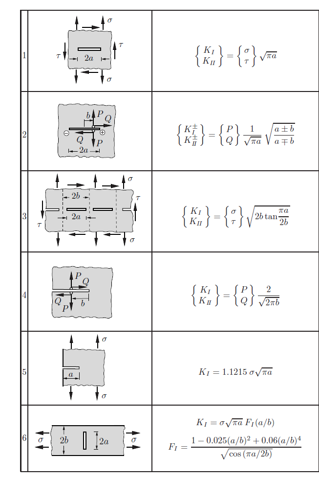
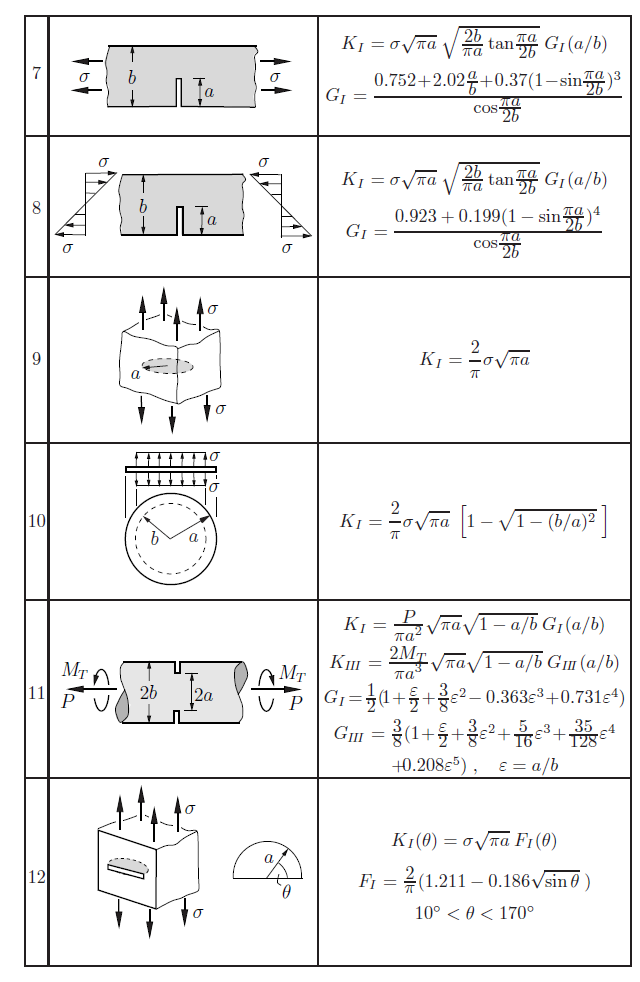

<!-- _class: lead -->
# Bruch & Ermüdung
## Ermüdungsarten und Lineare Bruchmechanik

Prof. Dr.-Ing. Christian Willberg 

Hochschule Magdeburg-Stendal

 

---

## Gliederung

**Teil I – Ermüdungsarten**
**Teil II – Lineare Bruchmechanik**

---

# Was ist Ermüdung?

---

## Definition

> *Ermüdung ist die **Entstehung und Ausbreitung von Rissen** in einem Werkstoff unter zyklischer Belastung.*

**Wesentliche Merkmale:**
- Risse wachsen mit **jedem Lastzyklus** um einen kleinen Betrag → Schwingstreifen auf der Bruchfläche
- Versagen tritt **weit unterhalb** der statischen Festigkeit auf
- Schädigung ist **irreversibel** — Werkstoffe erholen sich nicht in Ruhephasen
- Ermüdung zeigt erhebliche **Streuung** — auch bei identischen Proben
- Verantwortlich für die Mehrzahl aller mechanischen Versagensfälle

**Die meisten Werkstoffe** — Metalle, Verbundwerkstoffe, Kunststoffe, Keramiken — versagen durch Ermüdung.

---

## Drei Stadien des Ermüdungsbruchs

Alle Ermüdungsbrüche folgen der gleichen Abfolge:

$$\underbrace{\text{Rissinitiierung}}_{\text{Stadium I}} \longrightarrow \underbrace{\text{Rissausbreitung}}_{\text{Stadium II}} \longrightarrow \underbrace{\text{Restbruch}}_{\text{Stadium III}}$$

**Stadium I** – Rissentstehung an Spannungskonzentrationen: Bohrungen, PSB, Einschlüsse, Korngrenzen

**Stadium II** – Riss wächst senkrecht zur Belastung; Schwingstreifen (eine pro Zyklus)

**Stadium III** – Spannungsintensität überschreitet Bruchzähigkeit $K_{Ic}$ → plötzlicher, sprödartiger Bruch

> Selbst bei normalerweise **duktilen** Werkstoffen erscheinen Ermüdungsbrüche als plötzliche **Sprödbrüche** — der Großteil der Schädigung ist ohne zerstörende Prüfung unsichtbar.

---

## Hochzyklische Ermüdung

**Bereich:** $10^4 \leq N_f \leq 10^7$ Zyklen

**Mechanisches Regime:**
- Spannungsamplituden **unterhalb** der makroskopischen Fließgrenze: $\sigma_a < R_{p0{,}2}$
- Der Großteil des Werkstoffs verformt sich **elastisch**
- Dennoch tritt Versagen auf — getrieben durch **lokale Mikroplastizität**

**HCF-Festigkeit** kann durch spannungsbasierte Parameter beschrieben werden.
Prüfung typischerweise bei **20–50 Hz** auf lastgesteuerten servohydraulischen Prüfmaschinen.

> **Kernaussage:** Auch wenn die globale Spannung elastisch ist, erfahren einzelne Körner in günstiger Orientierung lokale Schubspannungen oberhalb ihrer kritischen Schubspannung → **lokale Plastizität** treibt die Schädigung.

---

## Versetzungen – Träger der plastischen Verformung

**Versetzungen** sind Liniendefekte im Kristallgitter. Sie bewegen sich, wenn die aufgelöste Schubspannung die kritische Schubspannung $\tau_{CRSS}$ überschreitet.

**Unter monotoner Belastung:**
- Versetzungen gleiten → makroskopische plastische Dehnung
- Kaltverfestigung durch Versetzungs-Versetzungs-Wechselwirkungen

**Unter zyklischer Belastung – der entscheidende Unterschied:**
- Vorwärts-Halbzyklus: Versetzungen gleiten in eine Richtung
- Rückwärts-Halbzyklus: Versetzungen werden **zurückgetrieben**
- Die Umkehr ist **nicht vollständig** → netto-irreversible Verschiebung akkumuliert

$$\varepsilon_{p,\text{hin}} \neq \varepsilon_{p,\text{rück}} \quad \Rightarrow \quad \Delta\varepsilon_p^{\text{netto}} > 0 \text{ pro Zyklus}$$

---

## Warum ist die Umkehr unvollständig?

- **Quergleitung (Cross-slip):** Schraubenversetzungen wechseln die Gleitebene → können den exakten Weg nicht zurückverfolgen
- **Sprossenbildung (Jogs):** Versetzungswechselwirkungen erzeugen Stufen → Hindernisse auf dem Rückweg
- **Punktdefekterzeugung:** Sprossenbewegung produziert Leerstellen und Zwischengitteratome → Gitterschädigung

> Diese drei Mechanismen garantieren, dass jeder Zyklus eine **netto-irreversible plastische Verschiebung** erzeugt – die Grundlage der Ermüdungsschädigung.

---

## Entwicklung der Versetzungsstrukturen

Mit zunehmender Zyklenzahl entwickeln sich Versetzungsstrukturen in drei Stufen:

**Stufe 1 — Homogene Verteilung** *(wenige Zyklen)*
- Versetzungen gleichmäßig im Korn verteilt
- Geringe Dichte, schwache Wechselwirkung → Werkstoff verfestigt sich

**Stufe 2 — Adern-Kanal-Struktur** *(mittlere Zyklen)*
- Versetzungen ballen sich in dichten **Adern** (Knäueln), getrennt durch versetzungsarme **Kanäle**
- Versetzungen pendeln in den Kanälen bei jedem Zyklus hin und her
- Zellstrukturen bilden und verfestigen sich

---

**Stufe 3 — Persistente Gleitbänder (PSB)** *(spätere Zyklen)*
- Leiterförmige **Wand-Kanal-Mikrostruktur** entwickelt sich innerhalb der Adern
- Lokalisierte Bänder intensiver zyklischer Plastizität
- Plastische Dehnungsamplitude in PSB bis zu **100× höher** als in der umgebenden Matrix

 
    Bild aus F. Weber "Microstructure-Based Fatigue Strength
Estimation for Design and Qualification of
Heavy-Section Ductile Iron Castings"

---

## Persistente Gleitbänder (PSB)

**PSB sind der kritische Vorläufer der Ermüdungsrissinitiierung.**

**Mikrostruktur:**
- Abwechselnd versetzungsreiche **Wände** und versetzungsarme **Kanäle**
- Stufenversetzungen sammeln sich in Wänden; Schraubenversetzungen gleiten in Kanälen
- Wandabstand $\approx 1\,\mu\text{m}$

**Warum „persistent"?**
- PSB bilden sich an der **gleichen Stelle** wieder, selbst nach Elektropolieren und erneutem Prüfen
- Stellen eine stabile, energiearme Konfiguration für zyklische plastische Verformung dar

---

## PSB – Folgen an der Oberfläche

Netto-irreversibles Gleiten in PSB → Material wird nach außen **extrudiert** und nach innen **intrudiert**

- Intrusionen und Extrusionen erzeugen eine Oberflächenstruktur wie der **Rand eines versetzten Kartenstapels**
- **Intrusionen** wirken als scharfe Kerben → bevorzugte Stellen für Rissentstehung

$$\text{PSB-Gleitung} \rightarrow \text{Intrusionen \& Extrusionen} \rightarrow \text{Stadium-I-Risskeimbildung}$$

---

## Rissinitiierung – Stadium I

**Wo entsteht ein Ermüdungsriss?**

- Primär an **freien Oberflächen** — die Oberfläche ist immer das schwächste Glied bei HCF
- An PSB-Matrix-Grenzflächen (häufigste Stelle bei glatten, sauberen Proben)
- An **Einschlüssen, Poren, Sekundärphasen** — Spannungskonzentration ohne PSB-Bildung nötig
- An **Korngrenzen** bei grobkörnigen oder harten Werkstoffen
- An **geometrischen Spannungskonzentrationen** — Kerben, Bohrungen, Passfedern

**Mechanismus:**
- Intrusion am PSB wirkt als scharfe Mikrokerbe
- Riss entsteht entlang der **PSB-Ebene** — parallel zur maximalen Schubspannung ($\approx 45°$ zur Last)
- Anfangswachstum ist **kristallographisch**: Riss folgt Gleitebenen
- Reicht nur wenige Korndurchmesser — wird stark an Korngrenzen gebremst

---

## Rissausbreitung – Stadium II

**Übergang Stadium I → Stadium II:**
- Riss erreicht eine Korngrenze → Umlenkung oder Übertragung auf Nachbarkorn
- Riss richtet sich **senkrecht zur maximalen Hauptspannung** aus (Modus-I-Öffnung)
- Ab hier durch Kontinuumsbruchmechanik beschrieben

**Paris-Gesetz:**

$$\frac{da}{dN} = C \cdot (\Delta K)^m$$

mit $\Delta K = K_{max} - K_{min}$ = Schwingbreite der Spannungsintensität

---

## Restbruch – Stadium III

- Riss erreicht **kritische Länge** $a_c$:

$$K_{max} = K_{Ic} \quad \Rightarrow \quad a_c = \frac{1}{\pi}\left(\frac{K_{Ic}}{\sigma \cdot Y}\right)^2$$

- Restquerschnitt kann die Last nicht mehr tragen → **schneller, katastrophaler Bruch**
- Häufig durch **Mikrohohlraumkoaleszenz** (duktil) oder **Spaltbruch** (spröd)

| Zone | Erscheinung | Ursache |
|---|---|---|
| Ermüdungszone | Glatt, flach, Schwingstreifen | Langsames Risswachstum |
| Gewaltbruchzone | Rau, faserig oder körnig | Plötzlicher Restbruch |

---

## Bruchfläche – Typisches Erscheinungsbild

- **Schwingstreifen** — eine Streifung pro Lastzyklus
- **Rastlinien** — makroskopisch sichtbar, durch Lastwechsel oder Ruhephasen
- Wachstumsraten: $\sim 10\,\text{nm/Zyklus}$ bis $\sim 1\,\mu\text{m/Zyklus}$

[Quelle: materialmagazin.com](https://materialmagazin.com/index.php/labor/fraktographie)

---

## Einfluss der Mikrostruktur

**Korngrenzen als Barrieren:**
- Stadium-I-Risse müssen Gleitung über Korngrenzen übertragen
- Hohe Fehlorientierung → starke Barriere → Riss wird gestoppt oder umgelenkt
- **Feineres Korn** → mehr Barrieren → längere Initiierungslebensdauer
- Hall-Petch-Analogie: $\sigma_D \propto d^{-1/2}$

**Einschlüsse und Sekundärphasen:**
- Harte Einschlüsse (Oxide, Sulfide, Karbide) erzeugen lokale Spannungskonzentrationen
- Rissentstehung an Einschluss-Matrix-Grenzfläche auch ohne PSB-Entwicklung
- Kritisch bei technischen Legierungen (Stähle, Aluminiumlegierungen)

---

## Oberflächenzustand

- Oberflächenqualität kontrolliert PSB-Aktivität und Intrusionsschwere direkt
- **Druckeigenspannungen** (Kugelstrahlen, Festwalzen, Laserschockhärten) unterdrücken Rissinitiierung
- Tiefe der Druckschicht entscheidend:
  - Kugelstrahlen $\approx 0{,}1\,\text{mm}$
  - Laserschockhärten $\approx 1$–$2{,}5\,\text{mm}$

---

## Die Wöhlerkurve (S-N-Kurve)

Ordnet **Spannungsamplitude** $\sigma_a$ den **Schwingspielen bis zum Bruch** $N_f$ zu.

$$\sigma_a^k \cdot N_f = C \quad \text{(Basquinsches Potenzgesetz, 1910)}$$

 
    Bild aus F. Weber "Microstructure-Based Fatigue Strength
Estimation for Design and Qualification of
Heavy-Section Ductile Iron Castings"

---

# Thermische Ermüdung

---

## Definition und Ursache

**Thermische Ermüdung:** Ermüdungsschädigung getrieben durch **zyklische thermische Spannungen** — keine äußere mechanische Last erforderlich.

**Physikalischer Ursprung:**
- Temperaturänderungen → Werkstoff dehnt sich aus / zieht sich zusammen
- Bei **behinderter Wärmedehnung** → innere Spannungen
- Zyklische Erwärmung und Abkühlung → zyklische Spannung → Ermüdung

$$\sigma_{th} = E \cdot \alpha \cdot \Delta T \quad \text{(vollständig behinderter Fall)}$$

> Die „Last" ist der **Temperaturzyklus** $\Delta T$, nicht eine aufgebrachte Kraft — Schädigung tritt auch in **ruhenden Bauteilen** auf (Rohre, Turbinengehäuse, Bremsscheiben).

---

## Spannungserzeugung

**Unbehinderte Ausdehnung:**
- Gleichmäßige Erwärmung → freie Wärmedehnung → **keine Spannung**

$$\varepsilon_{th} = \alpha \cdot \Delta T$$

**Behinderte Ausdehnung** (z.B. Rohr zwischen starren Wänden):
- Erwärmung → will sich ausdehnen → Behinderung erzeugt **Druckspannung**
- Abkühlung → will sich zusammenziehen → Behinderung erzeugt **Zugspannung**

**Ungleichmäßige Temperaturverteilung** (z.B. Oberfläche heiß, Kern kalt):
- Heiße Oberflächenschicht will sich ausdehnen, wird vom kühlen Kern behindert
- Oberfläche: **Druck** bei Erwärmung, **Zug** bei Abkühlung
- Risse entstehen an der **Oberfläche** bei Zugspannungen während der Abkühlung

---

## Versetzungsmechanismen bei erhöhter Temperatur

**Bei hoher Temperatur ändern sich die Versetzungsmechanismen grundlegend:**

**Zusätzliche Erholungsmechanismen werden aktiv:**
- **Klettern:** Stufenversetzungen bewegen sich senkrecht zur Gleitebene (thermisch aktiviert, $T > 0{,}3\,T_m$)
- **Quergleitung:** bei hoher Temperatur erleichtert → Versetzungen umgehen Hindernisse
- **Erholung:** Versetzungsannihilation → Werkstoff **entfestigt** zwischen den Zyklen

---

**Folgen für PSB-Bildung:**
- Erholung konkurriert mit Versetzungsakkumulation
- PSB bilden sich möglicherweise nicht wie bei isothermer HCF
- Stattdessen: **Versetzungszellstrukturen** vergröbern sich mit jedem Zyklus
- Korngrenzen werden bevorzugte Schädigungsorte durch **Korngrenzgleitung** bei hohem $T$

---

## Kriechen-Ermüdungs-Wechselwirkung

**Bei hohen Temperaturen ($T > 0{,}4\,T_m$) wirken Kriechen und Ermüdung gleichzeitig:**

- Während der **Haltezeit** bei Spitzentemperatur → Kriechdehnung akkumuliert
- Bei **Abkühlung** → Zugspannungsumkehr → Ermüdungsrisswachstum
- Korngrenzhohlräume verbinden sich mit Ermüdungsrissen → beschleunigtes Versagen

**Gleichphasige vs. gegenphasige TMF-Belastung:**

| Modus | Spitzenspannung | Spitzentemperatur | Dominante Schädigung |
|---|---|---|---|
| Gleichphasig (IP) | Zug | Hoch | Kriechhohlräume |
| Gegenphasig (OP) | Zug | Niedrig | Ermüdungsrisswachstum |

---

## Oxidationseffekte

**Bei hohen Temperaturen spielt die Umgebung eine aktive Rolle:**

- Oxid bildet sich an der Rissspitze während der Hochtemperaturphase
- Bei Abkühlung ist die Oxidschicht **steifer** als das Metall → verhindert vollständiges Rissschließen
- Effektives $\Delta K$ steigt → Riss wächst schneller als im Vakuum

**Oberflächenoxidation:**
- Wiederholte Oxidation und Abplatzung entfernt die Schutzschicht
- Frisches Metall wird bei jedem Zyklus freigelegt → kontinuierliche Oxidationsschädigung

> **Betroffene Werkstoffe:** Nickelbasis-Superlegierungen, austenitische Stähle, Titanlegierungen bei $T > 500°C$

---

## Typische Anwendungen

**Turbinenschaufeln** (Gasturbinen, Triebwerke):
- Start/Stopp-Zyklen + Heißbereichs-Temperaturgradienten
- Kühlbohrungen als Spannungskonzentratoren
- WDS-Delamination löst Oberflächenrissbildung aus

---

**Bremsscheiben:**
- Jeder Bremsvorgang = ein Thermozyklus
- Oberfläche erreicht $> 600°C$ in Sekunden
- Charakteristisches **Hitzerissnetzwerk** auf der Scheibenoberfläche

---

**Abgaskrümmer** (Automobil):
- Motorstart/-stopp → $\Delta T \approx 700°C$
- Gusseisen oder Edelstahl → thermische Spannung + Oxidation

**Lötverbindungen in der Elektronik** (TMF):
- Leistungszyklen → $\Delta T \approx 50$–$100°C$
- Lot (SnAgCu) kriecht bei Raumtemperatur ($T > 0{,}5\,T_m$)
- Dominanter Versagensmodus in der Leistungselektronik

**Kernreaktorkomponenten:**
- Thermisches Striping durch turbulente Mischung heißer/kalter Kühlmittelströme

---

## Thermische Ermüdung – Zusammenfassung

**Was thermische Ermüdung auszeichnet:**

- Treibende Kraft ist **Temperaturänderung** $\Delta T$, nicht mechanische Last
- Spannungen durch **behinderte Wärmedehnung** — auch in ruhenden Bauteilen
- Bei hohem $T$: **Kriechen, Oxidation, Korngrenzgleitung** wirken gleichzeitig
- Versetzungsmechanismen anders: **Klettern und Erholung** konkurrieren mit Akkumulation
- Rissinitiierung oft **intergranular** und an **Oberflächen/Beschichtungsgrenzflächen**
- **Rissnetzwerke (Crazing)** typisch — nicht ein einzelner wachsender Riss

---

## Ermüdungsrissausbreitung

**Perspektivwechsel:**
- HCF & thermische Ermüdung: Fokus auf **Rissinitiierung**
- Ermüdungsrissausbreitung: Fokus auf **Rissfortschritt** — ein Riss existiert bereits

**Relevanz:**
- Reale Bauteile enthalten immer **Defekte**: Einschlüsse, Poren, Bearbeitungsspuren
- Bruchmechanik fragt: *Bei gegebener Risslänge $a_0$ — wie viele Zyklen bis zum Versagen?*
- Grundlage der **schadenstoleranten Auslegung** (Luftfahrt, Kerntechnik, Offshore)

> **Ermüdungsrisse können von Defekten ab $10\,\mu\text{m}$ ausgehen**

---

## Die drei Bereiche der Rissausbreitung

**Bereich I — Schwellenwert:**
- $\Delta K \rightarrow \Delta K_{th}$: Risswachstumsrate fällt steil ab
- Unterhalb $\Delta K_{th}$: **kein Risswachstum**
- Typische Werte: $\Delta K_{th} \approx 2$–$10\,\text{MPa}\sqrt{\text{m}}$

**Bereich II — Paris-Bereich:**
- Linear im doppelt-logarithmischen Diagramm → Paris-Gesetz gilt
- Relativ unempfindlich gegenüber Mikrostruktur

**Bereich III — Instabiles Wachstum:**
- $K_{max} \rightarrow K_{Ic}$: Wachstumsrate steigt steil an
- Restbruch steht unmittelbar bevor

---

> Ermüdungsrisswachstum: (a) zyklische Belastung mit $K_\text{min}$, $K_\text{max}$; (b) Risswachstumsrate vs. $\Delta K$

---
<!-- _class: lead -->
# Teil II  Lineare Bruchmechanik

Abbildungen sind überwiegend entnommen aus Gross und Seelig, *Bruchmechanik*

---

## Bruchmechanische Bauteilbewertung

> Zerbst, Madia: Bruchmechanische Bauteilbewertung

---

## Rissgeometrie

Aus kontinuumsmechanischer Sicht ist ein Riss ein **Schnitt in einem Körper**:

- **Rissflanken (Rissufer):** die beiden gegenüberliegenden Flächen des Schnitts — typischerweise lastfrei
- **Rissfront / Rissspitze:** dort endet der Riss

> (Gross und Seelig, Bruchmechanik)

---

## Rissöffnungsmoden

| Modus | Beschreibung | Verschiebung |
|------|-------------|----------------------|
| **Modus I** | Symmetrische Öffnung | Normal zur Rissebene (y-Richtung) |
| **Modus II** | Antisymmetrisches Gleiten | Ebenenparalleler Schub (x-Richtung, ⊥ Rissfront) |
| **Modus III** | Reißen / Querschub | Ebenenparalleler Schub (z-Richtung, ∥ Rissfront) |

Diese Symmetrien sind **lokal** an der Rissspitze definiert.
In Sonderfällen gelten sie für den gesamten Körper.

---
| Modus | Beschreibung |
|------|-------------|
| **Modus I** | Symmetrische Öffnung | Normal zur Rissebene (y-Richtung) |
| **Modus II** | Antisymmetrisches Gleiten | 
| **Modus III** | Reißen / Querschub | 

---

## Spannungszustand an der Rissspitze

**Ebene Verzerrung (EVZ):** $\quad \kappa = 3-4\nu,\quad \sigma_z = \nu(\sigma_x+\sigma_y)$

**Ebener Spannungszustand (ESZ):** $\quad \kappa = \frac{3-\nu}{1+\nu},\quad \sigma_z = 0$

**Extraktionsformeln:**

$$K_I = \lim_{r\to 0}\sqrt{2\pi r}\,\sigma_y(\varphi=0), \qquad K_{II} = \lim_{r\to 0}\sqrt{2\pi r}\,\tau_{xy}(\varphi=0)$$

Der **T-Spannungsterm** (zweiter Term, $\lambda=1$): wirkt parallel zum Riss — wichtig, wenn $K_I$ klein ist.

---

## Modus I 

> Modus-I-Rissspitzenfeld: (a) Rissöffnung und $\sigma_y$-Verteilung, (b) Winkelabhängigkeit

**Rissöffnungsprofil** entlang der Rissflanken ($\varphi = \pm\pi$):

$$v^\pm = \pm\frac{K_I}{2G}\sqrt{\frac{r}{2\pi}}(\kappa+1)$$

→ **Parabolisches Rissöffnungsprofil**

---

# Das K-Konzept

> K-Konzept: $K_I$-dominiertes Feld, plastische Zone $r_p$, Prozesszone $\rho$

---

**Zentraler Gedanke:** Bei reinem Modus I charakterisiert $K_I$ **eindeutig** das gesamte Rissspitzengebiet.

Das $K_I$-dominierte Feld gilt zwischen zwei Grenzen:
- **Äußere Grenze $R$:** darüber hinaus sind höhere Terme nicht mehr vernachlässigbar
- **Innere Grenze** ($\rho$, $r_p$): Prozesszone $\rho$ und plastische Zone $r_p$
- auch bekannt als Spannungsintensitätsfaktoren $\rightarrow$ Maschinenelemente

---

---

## Bruchkriterium

**Hypothese:** Solange $\rho, r_p \ll R$, wird der Zustand in der Prozesszone **indirekt** durch $K_I$ gesteuert.

$$\boxed{K_I = K_{Ic}}$$

Risswachstum (Bruch) setzt ein, wenn $K_I$ den **werkstoffspezifischen kritischen Wert $K_{Ic}$** = **Bruchzähigkeit** erreicht.

Für reine Modus-II- und Modus-III-Belastung:

$$K_{II} = K_{IIc} \quad \text{(Modus II)}, \qquad K_{III} = K_{IIIc} \quad \text{(Modus III)}$$

Allgemeines Mischmodus-Kriterium: $f(K_I, K_{II}, K_{III}) = 0$

---

## Griffith-Bruchkriterium

Die Bruchenergie $\Gamma$ (Oberflächenenergie + inelastische Dissipation) geht in die Energiebilanz ein:

$$\frac{d\Pi}{dA} + \frac{d\Gamma}{dA} = 0$$

Mit $\mathcal{G} = -d\Pi/dA$ und $G_c = 2\gamma$ (spezifische Bruchflächenenergie):

$$\boxed{\mathcal{G} = G_c}$$

---

**Griffith-Kriterium (1921):** Risswachstum setzt ein, wenn die freigesetzte Energie die für den Bruch erforderliche Energie erreicht.

---

# Plastische Zone 

**Dog-Bone-Modell:** Im Inneren dicker Platten dominiert EVZ (kleine Zone), an der Oberfläche ESZ (große Zone).

> Plastische Zonenkonturen: von Mises vs. Tresca, EVZ vs. ESZ; Gleitmechanismen

---

## Mischmodus

Bei kombinierter Modus-I- und Modus-II-Belastung:
1. Bruch wird durch **beide** $K_I$ und $K_{II}$ ausgelöst
2. Riss breitet sich unter einem **Winkel** $\varphi_0$ zur ursprünglichen Rissrichtung aus

Für spröde Werkstoffe breitet sich der Riss so aus, dass die neue Oberfläche im **Modus-I-Typ** öffnet.

---

# Ermüdungsrissausbreitung (Bruchmechanik)

---

## Paris-Gesetz

**Paris, Gomez & Anderson (1961)** — empirisches Potenzgesetz:

$$\boxed{\frac{da}{dN} = C \cdot (\Delta K)^m}$$

- $C$, $m$: Werkstoffkonstanten (temperatur-, umgebungs-, mittelspannungsabhängig)
- Typische Exponenten für Metalle: $m \approx 2\ldots 4$

---

**Forman-Gleichung** (berücksichtigt $K_{Ic}$):

$$\frac{da}{dN} = \frac{C\,(\Delta K)^m}{(1-R)K_{Ic}-\Delta K}, \qquad R = K_\text{min}/K_\text{max}$$

## Lebensdauervorhersage

Integration des Paris-Gesetzes von Anfangsrisslänge $a_i$ bis kritische Länge $a_c$:

$$N_f = \frac{1}{C(\Delta\sigma)^m}\int_{a_i}^{a_c}\frac{da'}{\left[\sqrt{\pi a'}F(a')\right]^m}$$

---

**Kernaussage:** Verdopplung von $\Delta\sigma$ reduziert die Lebensdauer um den Faktor $2^m$ — bei $m=3$: **8× kürzere Lebensdauer**

**Erforderliche Eingabegrößen:**
- Anfangsrissgröße $a_i$ (Inspektion/ZfP)
- Kritische Rissgröße $a_c$ (aus $K_I = K_{Ic}$)
- Geometriefunktion $F(a)$
- Werkstoffkonstanten $C$, $m$
- Spannungsschwingbreite $\Delta\sigma$

---

<!-- _class: lead -->
## Vielen Dank für die Aufmerksamkeit

**Fragen?**

Prof. Dr.-Ing. Christian Willberg
christian.willberg@h2.de
Hochschule Magdeburg-Stendal