

<!-- _class: lead -->
# Bruch & Ermüdung
## Ermüdungsarten und Lineare Bruchmechanik

Prof. Dr.-Ing. Christian Willberg 

Hochschule Magdeburg-Stendal

 

---

## Gliederung

**Teil I – Ermüdungsarten**
**Teil II – Lineare Bruchmechanik**

---

# Was ist Ermüdung?

---

## Definition

> *Ermüdung ist die **Entstehung und Ausbreitung von Rissen** in einem Werkstoff unter zyklischer Belastung.*

**Wesentliche Merkmale:**
- Risse wachsen mit **jedem Lastzyklus** um einen kleinen Betrag → Schwingstreifen auf der Bruchfläche
- Versagen tritt **weit unterhalb** der statischen Festigkeit auf
- Schädigung ist **irreversibel** — Werkstoffe erholen sich nicht in Ruhephasen
- Ermüdung zeigt erhebliche **Streuung** — auch bei identischen Proben
- Verantwortlich für die Mehrzahl aller mechanischen Versagensfälle

**Die meisten Werkstoffe** — Metalle, Verbundwerkstoffe, Kunststoffe, Keramiken — versagen durch Ermüdung.

---

## Drei Stadien des Ermüdungsbruchs

Alle Ermüdungsbrüche folgen der gleichen Abfolge:

$$\underbrace{\text{Rissinitiierung}}_{\text{Stadium I}} \longrightarrow \underbrace{\text{Rissausbreitung}}_{\text{Stadium II}} \longrightarrow \underbrace{\text{Restbruch}}_{\text{Stadium III}}$$

**Stadium I** – Rissentstehung an Spannungskonzentrationen: Bohrungen, PSB, Einschlüsse, Korngrenzen

**Stadium II** – Riss wächst senkrecht zur Belastung; Schwingstreifen (eine pro Zyklus)

**Stadium III** – Spannungsintensität überschreitet Bruchzähigkeit $K_{Ic}$ → plötzlicher, sprödartiger Bruch

> Selbst bei normalerweise **duktilen** Werkstoffen erscheinen Ermüdungsbrüche als plötzliche **Sprödbrüche** — der Großteil der Schädigung ist ohne zerstörende Prüfung unsichtbar.

---

## Hochzyklische Ermüdung

**Bereich:** $10^4 \leq N_f \leq 10^7$ Zyklen

**Mechanisches Regime:**
- Spannungsamplituden **unterhalb** der makroskopischen Fließgrenze: $\sigma_a < R_{p0{,}2}$
- Der Großteil des Werkstoffs verformt sich **elastisch**
- Dennoch tritt Versagen auf — getrieben durch **lokale Mikroplastizität**

**HCF-Festigkeit** kann durch spannungsbasierte Parameter beschrieben werden.
Prüfung typischerweise bei **20–50 Hz** auf lastgesteuerten servohydraulischen Prüfmaschinen.

> **Kernaussage:** Auch wenn die globale Spannung elastisch ist, erfahren einzelne Körner in günstiger Orientierung lokale Schubspannungen oberhalb ihrer kritischen Schubspannung → **lokale Plastizität** treibt die Schädigung.

---

## Versetzungen – Träger der plastischen Verformung

**Versetzungen** sind Liniendefekte im Kristallgitter. Sie bewegen sich, wenn die aufgelöste Schubspannung die kritische Schubspannung $\tau_{CRSS}$ überschreitet.

**Unter monotoner Belastung:**
- Versetzungen gleiten → makroskopische plastische Dehnung
- Kaltverfestigung durch Versetzungs-Versetzungs-Wechselwirkungen

**Unter zyklischer Belastung – der entscheidende Unterschied:**
- Vorwärts-Halbzyklus: Versetzungen gleiten in eine Richtung
- Rückwärts-Halbzyklus: Versetzungen werden **zurückgetrieben**
- Die Umkehr ist **nicht vollständig** → netto-irreversible Verschiebung akkumuliert

$$\varepsilon_{p,\text{hin}} \neq \varepsilon_{p,\text{rück}} \quad \Rightarrow \quad \Delta\varepsilon_p^{\text{netto}} > 0 \text{ pro Zyklus}$$

---

## Warum ist die Umkehr unvollständig?

- **Quergleitung (Cross-slip):** Schraubenversetzungen wechseln die Gleitebene → können den exakten Weg nicht zurückverfolgen
- **Sprossenbildung (Jogs):** Versetzungswechselwirkungen erzeugen Stufen → Hindernisse auf dem Rückweg
- **Punktdefekterzeugung:** Sprossenbewegung produziert Leerstellen und Zwischengitteratome → Gitterschädigung

> Diese drei Mechanismen garantieren, dass jeder Zyklus eine **netto-irreversible plastische Verschiebung** erzeugt – die Grundlage der Ermüdungsschädigung.

---

## Entwicklung der Versetzungsstrukturen

Mit zunehmender Zyklenzahl entwickeln sich Versetzungsstrukturen in drei Stufen:

**Stufe 1 — Homogene Verteilung** *(wenige Zyklen)*
- Versetzungen gleichmäßig im Korn verteilt
- Geringe Dichte, schwache Wechselwirkung → Werkstoff verfestigt sich

**Stufe 2 — Adern-Kanal-Struktur** *(mittlere Zyklen)*
- Versetzungen ballen sich in dichten **Adern** (Knäueln), getrennt durch versetzungsarme **Kanäle**
- Versetzungen pendeln in den Kanälen bei jedem Zyklus hin und her
- Zellstrukturen bilden und verfestigen sich

---

**Stufe 3 — Persistente Gleitbänder (PSB)** *(spätere Zyklen)*
- Leiterförmige **Wand-Kanal-Mikrostruktur** entwickelt sich innerhalb der Adern
- Lokalisierte Bänder intensiver zyklischer Plastizität
- Plastische Dehnungsamplitude in PSB bis zu **100× höher** als in der umgebenden Matrix

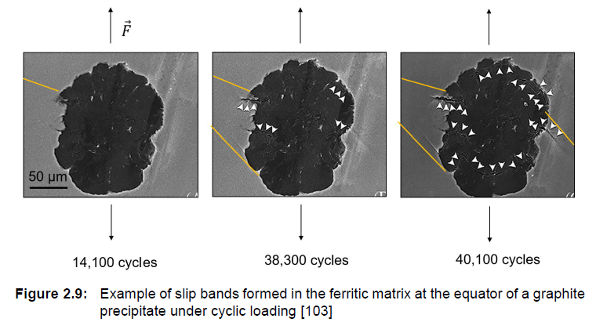

 
    Bild aus F. Weber "Microstructure-Based Fatigue Strength
Estimation for Design and Qualification of
Heavy-Section Ductile Iron Castings"

---

## Persistente Gleitbänder (PSB)

**PSB sind der kritische Vorläufer der Ermüdungsrissinitiierung.**

**Mikrostruktur:**
- Abwechselnd versetzungsreiche **Wände** und versetzungsarme **Kanäle**
- Stufenversetzungen sammeln sich in Wänden; Schraubenversetzungen gleiten in Kanälen
- Wandabstand $\approx 1\,\mu\text{m}$

**Warum „persistent"?**
- PSB bilden sich an der **gleichen Stelle** wieder, selbst nach Elektropolieren und erneutem Prüfen
- Stellen eine stabile, energiearme Konfiguration für zyklische plastische Verformung dar

---

## PSB – Folgen an der Oberfläche

Netto-irreversibles Gleiten in PSB → Material wird nach außen **extrudiert** und nach innen **intrudiert**

- Intrusionen und Extrusionen erzeugen eine Oberflächenstruktur wie der **Rand eines versetzten Kartenstapels**
- **Intrusionen** wirken als scharfe Kerben → bevorzugte Stellen für Rissentstehung

$$\text{PSB-Gleitung} \rightarrow \text{Intrusionen \& Extrusionen} \rightarrow \text{Stadium-I-Risskeimbildung}$$

---

## Rissinitiierung – Stadium I

**Wo entsteht ein Ermüdungsriss?**

- Primär an **freien Oberflächen** — die Oberfläche ist immer das schwächste Glied bei HCF
- An PSB-Matrix-Grenzflächen (häufigste Stelle bei glatten, sauberen Proben)
- An **Einschlüssen, Poren, Sekundärphasen** — Spannungskonzentration ohne PSB-Bildung nötig
- An **Korngrenzen** bei grobkörnigen oder harten Werkstoffen
- An **geometrischen Spannungskonzentrationen** — Kerben, Bohrungen, Passfedern

**Mechanismus:**
- Intrusion am PSB wirkt als scharfe Mikrokerbe
- Riss entsteht entlang der **PSB-Ebene** — parallel zur maximalen Schubspannung ($\approx 45°$ zur Last)
- Anfangswachstum ist **kristallographisch**: Riss folgt Gleitebenen
- Reicht nur wenige Korndurchmesser — wird stark an Korngrenzen gebremst

---

## Rissausbreitung – Stadium II

**Übergang Stadium I → Stadium II:**
- Riss erreicht eine Korngrenze → Umlenkung oder Übertragung auf Nachbarkorn
- Riss richtet sich **senkrecht zur maximalen Hauptspannung** aus (Modus-I-Öffnung)
- Ab hier durch Kontinuumsbruchmechanik beschrieben

**Paris-Gesetz:**

$$\frac{da}{dN} = C \cdot (\Delta K)^m$$

mit $\Delta K = K_{max} - K_{min}$ = Schwingbreite der Spannungsintensität

---

## Restbruch – Stadium III

- Riss erreicht **kritische Länge** $a_c$:

$$K_{max} = K_{Ic} \quad \Rightarrow \quad a_c = \frac{1}{\pi}\left(\frac{K_{Ic}}{\sigma \cdot Y}\right)^2$$

- Restquerschnitt kann die Last nicht mehr tragen → **schneller, katastrophaler Bruch**
- Häufig durch **Mikrohohlraumkoaleszenz** (duktil) oder **Spaltbruch** (spröd)

| Zone | Erscheinung | Ursache |
|---|---|---|
| Ermüdungszone | Glatt, flach, Schwingstreifen | Langsames Risswachstum |
| Gewaltbruchzone | Rau, faserig oder körnig | Plötzlicher Restbruch |

---

## Bruchfläche – Typisches Erscheinungsbild

- **Schwingstreifen** — eine Streifung pro Lastzyklus
- **Rastlinien** — makroskopisch sichtbar, durch Lastwechsel oder Ruhephasen
- Wachstumsraten: $\sim 10\,\text{nm/Zyklus}$ bis $\sim 1\,\mu\text{m/Zyklus}$

[Quelle: materialmagazin.com](https://materialmagazin.com/index.php/labor/fraktographie)

---

## Einfluss der Mikrostruktur

**Korngrenzen als Barrieren:**
- Stadium-I-Risse müssen Gleitung über Korngrenzen übertragen
- Hohe Fehlorientierung → starke Barriere → Riss wird gestoppt oder umgelenkt
- **Feineres Korn** → mehr Barrieren → längere Initiierungslebensdauer
- Hall-Petch-Analogie: $\sigma_D \propto d^{-1/2}$

**Einschlüsse und Sekundärphasen:**
- Harte Einschlüsse (Oxide, Sulfide, Karbide) erzeugen lokale Spannungskonzentrationen
- Rissentstehung an Einschluss-Matrix-Grenzfläche auch ohne PSB-Entwicklung
- Kritisch bei technischen Legierungen (Stähle, Aluminiumlegierungen)

---

## Oberflächenzustand

- Oberflächenqualität kontrolliert PSB-Aktivität und Intrusionsschwere direkt
- **Druckeigenspannungen** (Kugelstrahlen, Festwalzen, Laserschockhärten) unterdrücken Rissinitiierung
- Tiefe der Druckschicht entscheidend:
  - Kugelstrahlen $\approx 0{,}1\,\text{mm}$
  - Laserschockhärten $\approx 1$–$2{,}5\,\text{mm}$

---

## Die Wöhlerkurve (S-N-Kurve)

Ordnet **Spannungsamplitude** $\sigma_a$ den **Schwingspielen bis zum Bruch** $N_f$ zu.

$$\sigma_a^k \cdot N_f = C \quad \text{(Basquinsches Potenzgesetz, 1910)}$$

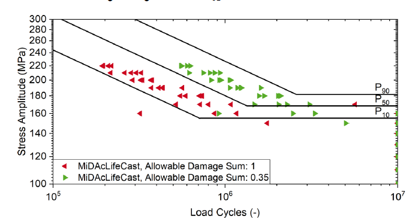

 
    Bild aus F. Weber "Microstructure-Based Fatigue Strength
Estimation for Design and Qualification of
Heavy-Section Ductile Iron Castings"

---

# Thermische Ermüdung

---

## Definition und Ursache

**Thermische Ermüdung:** Ermüdungsschädigung getrieben durch **zyklische thermische Spannungen** — keine äußere mechanische Last erforderlich.

**Physikalischer Ursprung:**
- Temperaturänderungen → Werkstoff dehnt sich aus / zieht sich zusammen
- Bei **behinderter Wärmedehnung** → innere Spannungen
- Zyklische Erwärmung und Abkühlung → zyklische Spannung → Ermüdung

$$\sigma_{th} = E \cdot \alpha \cdot \Delta T \quad \text{(vollständig behinderter Fall)}$$

> Die „Last" ist der **Temperaturzyklus** $\Delta T$, nicht eine aufgebrachte Kraft — Schädigung tritt auch in **ruhenden Bauteilen** auf (Rohre, Turbinengehäuse, Bremsscheiben).

---

## Spannungserzeugung

**Unbehinderte Ausdehnung:**
- Gleichmäßige Erwärmung → freie Wärmedehnung → **keine Spannung**

$$\varepsilon_{th} = \alpha \cdot \Delta T$$

**Behinderte Ausdehnung** (z.B. Rohr zwischen starren Wänden):
- Erwärmung → will sich ausdehnen → Behinderung erzeugt **Druckspannung**
- Abkühlung → will sich zusammenziehen → Behinderung erzeugt **Zugspannung**

**Ungleichmäßige Temperaturverteilung** (z.B. Oberfläche heiß, Kern kalt):
- Heiße Oberflächenschicht will sich ausdehnen, wird vom kühlen Kern behindert
- Oberfläche: **Druck** bei Erwärmung, **Zug** bei Abkühlung
- Risse entstehen an der **Oberfläche** bei Zugspannungen während der Abkühlung

---

## Versetzungsmechanismen bei erhöhter Temperatur

**Bei hoher Temperatur ändern sich die Versetzungsmechanismen grundlegend:**

**Zusätzliche Erholungsmechanismen werden aktiv:**
- **Klettern:** Stufenversetzungen bewegen sich senkrecht zur Gleitebene (thermisch aktiviert, $T > 0{,}3\,T_m$)
- **Quergleitung:** bei hoher Temperatur erleichtert → Versetzungen umgehen Hindernisse
- **Erholung:** Versetzungsannihilation → Werkstoff **entfestigt** zwischen den Zyklen

**Folgen für PSB-Bildung:**
- Erholung konkurriert mit Versetzungsakkumulation
- PSB bilden sich möglicherweise nicht wie bei isothermer HCF
- Stattdessen: **Versetzungszellstrukturen** vergröbern sich mit jedem Zyklus
- Korngrenzen werden bevorzugte Schädigungsorte durch **Korngrenzgleitung** bei hohem $T$

---

## Kriechen-Ermüdungs-Wechselwirkung

**Bei hohen Temperaturen ($T > 0{,}4\,T_m$) wirken Kriechen und Ermüdung gleichzeitig:**

- Während der **Haltezeit** bei Spitzentemperatur → Kriechdehnung akkumuliert
- Bei **Abkühlung** → Zugspannungsumkehr → Ermüdungsrisswachstum
- Korngrenzhohlräume verbinden sich mit Ermüdungsrissen → beschleunigtes Versagen

**Gleichphasige vs. gegenphasige TMF-Belastung:**

| Modus | Spitzenspannung | Spitzentemperatur | Dominante Schädigung |
|---|---|---|---|
| Gleichphasig (IP) | Zug | Hoch | Kriechhohlräume |
| Gegenphasig (OP) | Zug | Niedrig | Ermüdungsrisswachstum |

---

## Oxidationseffekte

**Bei hohen Temperaturen spielt die Umgebung eine aktive Rolle:**

- Oxid bildet sich an der Rissspitze während der Hochtemperaturphase
- Bei Abkühlung ist die Oxidschicht **steifer** als das Metall → verhindert vollständiges Rissschließen
- Effektives $\Delta K$ steigt → Riss wächst schneller als im Vakuum

**Oberflächenoxidation:**
- Wiederholte Oxidation und Abplatzung entfernt die Schutzschicht
- Frisches Metall wird bei jedem Zyklus freigelegt → kontinuierliche Oxidationsschädigung

> **Betroffene Werkstoffe:** Nickelbasis-Superlegierungen, austenitische Stähle, Titanlegierungen bei $T > 500°C$

---

## Thermische Ermüdung – Typische Anwendungen

**Turbinenschaufeln** (Gasturbinen, Triebwerke):
- Start/Stopp-Zyklen + Heißbereichs-Temperaturgradienten
- Kühlbohrungen als Spannungskonzentratoren
- WDS-Delamination löst Oberflächenrissbildung aus

**Bremsscheiben:**
- Jeder Bremsvorgang = ein Thermozyklus
- Oberfläche erreicht $> 600°C$ in Sekunden
- Charakteristisches **Hitzerissnetzwerk** auf der Scheibenoberfläche

---

**Abgaskrümmer** (Automobil):
- Motorstart/-stopp → $\Delta T \approx 700°C$
- Gusseisen oder Edelstahl → thermische Spannung + Oxidation

**Lötverbindungen in der Elektronik** (TMF):
- Leistungszyklen → $\Delta T \approx 50$–$100°C$
- Lot (SnAgCu) kriecht bei Raumtemperatur ($T > 0{,}5\,T_m$)
- Dominanter Versagensmodus in der Leistungselektronik

**Kernreaktorkomponenten:**
- Thermisches Striping durch turbulente Mischung heißer/kalter Kühlmittelströme

---

## Thermische Ermüdung – Zusammenfassung

**Was thermische Ermüdung auszeichnet:**

- Treibende Kraft ist **Temperaturänderung** $\Delta T$, nicht mechanische Last
- Spannungen durch **behinderte Wärmedehnung** — auch in ruhenden Bauteilen
- Bei hohem $T$: **Kriechen, Oxidation, Korngrenzgleitung** wirken gleichzeitig
- Versetzungsmechanismen anders: **Klettern und Erholung** konkurrieren mit Akkumulation
- Rissinitiierung oft **intergranular** und an **Oberflächen/Beschichtungsgrenzflächen**
- **Rissnetzwerke (Crazing)** typisch — nicht ein einzelner wachsender Riss

**Konstruktive Gegenmaßnahmen:**
- $\Delta T$ und Temperaturgradienten minimieren
- Werkstoffe mit niedrigem $\alpha$ oder hoher $E \cdot \alpha$-Toleranz
- Wärmedämmschichten (WDS) zur Reduzierung der Substrattemperaturschwankung
- Scharfe geometrische Übergänge in thermisch belasteten Bauteilen vermeiden

---

## Ermüdungsrissausbreitung – Überblick

**Perspektivwechsel:**
- HCF & thermische Ermüdung: Fokus auf **Rissinitiierung**
- Ermüdungsrissausbreitung: Fokus auf **Rissfortschritt** — ein Riss existiert bereits

**Relevanz:**
- Reale Bauteile enthalten immer **Defekte**: Einschlüsse, Poren, Bearbeitungsspuren
- Bruchmechanik fragt: *Bei gegebener Risslänge $a_0$ — wie viele Zyklen bis zum Versagen?*
- Grundlage der **schadenstoleranten Auslegung** (Luftfahrt, Kerntechnik, Offshore)

> **Ermüdungsrisse können von Defekten ab $10\,\mu\text{m}$ ausgehen**

---

## Die drei Bereiche der Rissausbreitung

**Bereich I — Schwellenwert:**
- $\Delta K \rightarrow \Delta K_{th}$: Risswachstumsrate fällt steil ab
- Unterhalb $\Delta K_{th}$: **kein Risswachstum**
- Typische Werte: $\Delta K_{th} \approx 2$–$10\,\text{MPa}\sqrt{\text{m}}$

**Bereich II — Paris-Bereich:**
- Linear im doppelt-logarithmischen Diagramm → Paris-Gesetz gilt
- Relativ unempfindlich gegenüber Mikrostruktur

**Bereich III — Instabiles Wachstum:**
- $K_{max} \rightarrow K_{Ic}$: Wachstumsrate steigt steil an
- Restbruch steht unmittelbar bevor

> Ermüdungsrisswachstum: (a) zyklische Belastung mit $K_\text{min}$, $K_\text{max}$; (b) Risswachstumsrate vs. $\Delta K$

---
<!-- _class: lead -->
# Teil II
# Lineare Bruchmechanik

---

- Abbildungen sind überwiegend entnommen aus Gross und Seelig, *Bruchmechanik*

---
<!-- _class: lead -->
# Grundkonzepte

---

## Bruchmechanische Bauteilbewertung

> Zerbst, Madia: Bruchmechanische Bauteilbewertung

---

## Rissgeometrie

Aus kontinuumsmechanischer Sicht ist ein Riss ein **Schnitt in einem Körper**:

- **Rissflanken (Rissufer):** die beiden gegenüberliegenden Flächen des Schnitts — typischerweise lastfrei
- **Rissfront / Rissspitze:** dort endet der Riss

> (Gross und Seelig, Bruchmechanik)

---

## Rissöffnungsmoden

| Modus | Beschreibung | Verschiebung |
|------|-------------|----------------------|
| **Modus I** | Symmetrische Öffnung | Normal zur Rissebene (y-Richtung) |
| **Modus II** | Antisymmetrisches Gleiten | Ebenenparalleler Schub (x-Richtung, ⊥ Rissfront) |
| **Modus III** | Reißen / Querschub | Ebenenparalleler Schub (z-Richtung, ∥ Rissfront) |

Diese Symmetrien sind **lokal** an der Rissspitze definiert.
In Sonderfällen gelten sie für den gesamten Körper.

---

## Prozesszone und Gültigkeit der LEBM

**Prozesszone:** Bereich nahe der Rissfront, in dem der komplexe mikroskopische Trennprozess abläuft — nicht durch klassische Kontinuumsmechanik beschreibbar.

**Voraussetzung für LEBM:** Größe der Prozesszone $\ll$ alle charakteristischen makroskopischen Abmessungen.

Typisch für metallische und die meisten spröden Werkstoffe.

**Ausnahmen:** Beton und granulare Materialien — Prozesszone kann sehr groß werden.

In der **linear-elastischen Bruchmechanik (LEBM):**
- Gesamter Körper wird als linear-elastisch behandelt
- Inelastische Prozesse auf eine kleine, vernachlässigbare Zone um die Rissspitze beschränkt
- LEBM primär für **Sprödbruch** geeignet

---
<!-- _class: lead -->
# Das Rissspitzenfeld

---

## Rissspitzenfeld – Modus III

Feld in einem kleinen Bereich mit Radius $R$ um die Rissspitze.

Aus der Eigenwertanalyse mit lastfreien Rissflanken ($\varphi = \pm\pi$):

$$\sin 2\lambda\pi = 0 \quad\Rightarrow\quad \lambda = \frac{n}{2}, \quad n = 1,2,3,\ldots$$

Der **dominante singuläre Term** ($\lambda = 1/2$) ergibt für $r \to 0$:

$$\begin{pmatrix} \tau_{xz} \\ \tau_{yz} \end{pmatrix} = \frac{K_{III}}{\sqrt{2\pi r}} \begin{pmatrix} -\sin(\varphi/2) \\ \cos(\varphi/2) \end{pmatrix}, \qquad w = \frac{2K_{III}}{G}\sqrt{\frac{r}{2\pi}}\sin(\varphi/2)$$

**Kernaussagen:**
- Spannungen haben eine **$r^{-1/2}$-Singularität** an der Rissspitze
- Das Feld wird vollständig durch $K_{III}$ bestimmt — den **Spannungsintensitätsfaktor (SIF)**

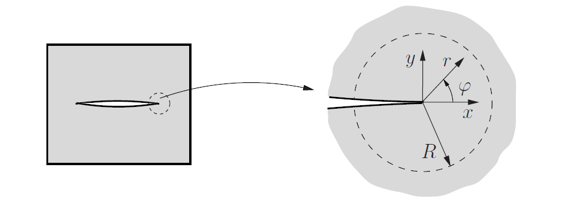
> Koordinatensystem an der Rissspitze: Radius $r$, Winkel $\varphi$ (Gross und Seelig)

---

## Rissspitzenfeld – Modus I und II

**Modus I** (symmetrisch):

$$\begin{pmatrix} \sigma_x \\ \sigma_y \\ \tau_{xy} \end{pmatrix} = \frac{K_I}{\sqrt{2\pi r}}\cos\frac{\varphi}{2} \begin{pmatrix} 1 - \sin\frac{\varphi}{2}\sin\frac{3\varphi}{2} \\ 1 + \sin\frac{\varphi}{2}\sin\frac{3\varphi}{2} \\ \sin\frac{\varphi}{2}\cos\frac{3\varphi}{2} \end{pmatrix}$$

**Modus II** (antisymmetrisch):

$$\begin{pmatrix} \sigma_x \\ \sigma_y \\ \tau_{xy} \end{pmatrix} = \frac{K_{II}}{\sqrt{2\pi r}} \begin{pmatrix} -\sin\frac{\varphi}{2}\left[2+\cos\frac{\varphi}{2}\cos\frac{3\varphi}{2}\right] \\ \sin\frac{\varphi}{2}\cos\frac{\varphi}{2}\cos\frac{3\varphi}{2} \\ \cos\frac{\varphi}{2}\left[1-\sin\frac{\varphi}{2}\sin\frac{3\varphi}{2}\right] \end{pmatrix}$$

---

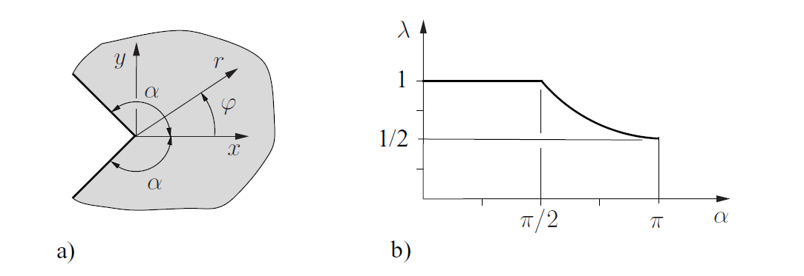
> (a) Belastete Rissflanken; (b) Gekrümmter Riss nahe der Rissspitze

---

## Spannungszustand an der Rissspitze

**Ebene Verzerrung (EVZ):** $\quad \kappa = 3-4\nu,\quad \sigma_z = \nu(\sigma_x+\sigma_y)$

**Ebener Spannungszustand (ESZ):** $\quad \kappa = \frac{3-\nu}{1+\nu},\quad \sigma_z = 0$

**Extraktionsformeln:**

$$K_I = \lim_{r\to 0}\sqrt{2\pi r}\,\sigma_y(\varphi=0), \qquad K_{II} = \lim_{r\to 0}\sqrt{2\pi r}\,\tau_{xy}(\varphi=0)$$

Der **T-Spannungsterm** (zweiter Term, $\lambda=1$): wirkt parallel zum Riss — wichtig, wenn $K_I$ klein ist.

---

## Modus I – Detail

> Modus-I-Rissspitzenfeld: (a) Rissöffnung und $\sigma_y$-Verteilung, (b) Winkelabhängigkeit

**Rissöffnungsprofil** entlang der Rissflanken ($\varphi = \pm\pi$):

$$v^\pm = \pm\frac{K_I}{2G}\sqrt{\frac{r}{2\pi}}(\kappa+1)$$

→ **Parabolisches Rissöffnungsprofil**

---

## Dreidimensionales Rissspitzenfeld

In 3D ist das Rissspitzenfeld **lokal vom gleichen Typ** wie im 2D-Fall:

$$\sigma_{ij} = \frac{1}{\sqrt{2\pi r}}\left[K_I\tilde{\sigma}^I_{ij}(\varphi) + K_{II}\tilde{\sigma}^{II}_{ij}(\varphi) + K_{III}\tilde{\sigma}^{III}_{ij}(\varphi)\right]$$

- SIF können entlang der Rissfront variieren: $K_I = K_I(s)$
- EVZ-Kinematik gilt für die Modus-I- und Modus-II-Anteile
- **Singuläre Sonderpunkte:** Rissfrontknicke oder Rissfront an freier Oberfläche — dort möglicherweise keine $r^{-1/2}$-Singularität

---
<!-- _class: lead -->
# Das K-Konzept

---

## K-Konzept – Grundidee

> K-Konzept: $K_I$-dominiertes Feld, plastische Zone $r_p$, Prozesszone $\rho$

**Zentraler Gedanke:** Bei reinem Modus I charakterisiert $K_I$ **eindeutig** das gesamte Rissspitzengebiet.

Das $K_I$-dominierte Feld gilt zwischen zwei Grenzen:
- **Äußere Grenze $R$:** darüber hinaus sind höhere Terme nicht mehr vernachlässigbar
- **Innere Grenze** ($\rho$, $r_p$): Prozesszone $\rho$ und plastische Zone $r_p$

---

## Bruchkriterium

**Hypothese:** Solange $\rho, r_p \ll R$, wird der Zustand in der Prozesszone **indirekt** durch $K_I$ gesteuert.

$$\boxed{K_I = K_{Ic}}$$

Risswachstum (Bruch) setzt ein, wenn $K_I$ den **werkstoffspezifischen kritischen Wert $K_{Ic}$** = **Bruchzähigkeit** erreicht.

Für reine Modus-II- und Modus-III-Belastung:

$$K_{II} = K_{IIc} \quad \text{(Modus II)}, \qquad K_{III} = K_{IIIc} \quad \text{(Modus III)}$$

Allgemeines Mischmodus-Kriterium: $f(K_I, K_{II}, K_{III}) = 0$

---
<!-- _class: lead -->
# K-Faktoren

---

## Beispiel: Riss unter Fernfeldzug

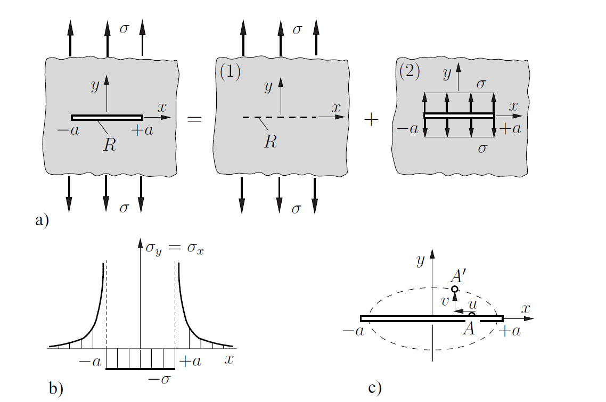

**Konfiguration:** Gerader Riss der Länge $2a$ in einer unendlichen Scheibe unter einachsigem Zug $\sigma$.

**Lösung durch Superposition:** Problem (1) = ungerissene Platte + Problem (2) = Riss belastet mit $-\sigma$ auf den Flanken.

**Spannungsintensitätsfaktor:**

$$\boxed{K_I = \sigma\sqrt{\pi a}}$$

**Rissöffnungsverschiebung** (elliptisch):

$$4Gv^\pm = \pm(1+\kappa)\sigma\sqrt{a^2-x^2}$$

---

## Weitere Beispiele

**Einzelkräfte auf Rissflanken:**

$$K_I^\pm = \frac{P}{\sqrt{\pi a}}\sqrt{\frac{a\pm b}{a\mp b}}$$

**Schubbelastung** (Modus II):

$$K_{II} = \tau\sqrt{\pi a}$$

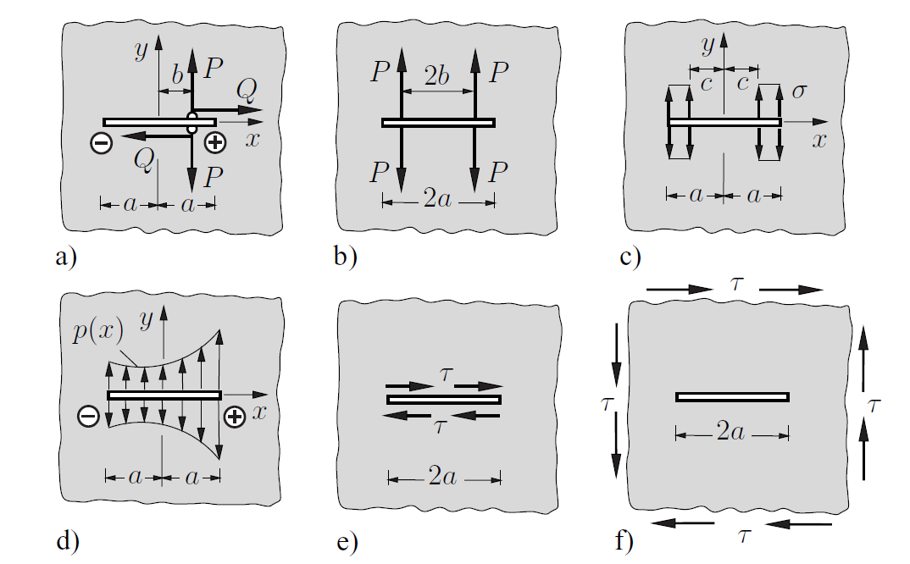

---

## Kollineare Rissanordnung

**Periodische Anordnung** (Periode $2b$):

$$K_I = \sigma\sqrt{\pi a}\sqrt{\frac{2b}{\pi a}\tan\frac{\pi a}{2b}}$$

Wenn Rissspitzen sich annähern ($a \to b$), wächst $K_I$ stark durch **Risswechselwirkung**.

> (a) Kollineare Rissanordnung, (b) Streifen mit Innenriss

---

## K-Faktor-Tabelle (Auswahl)

| Nr. | Konfiguration | $K_I$ |
|-----|---------------|-------|
| 1 | Unendliche Platte, Innenriss | $\sigma\sqrt{\pi a}$ |
| 4 | Randriss | $1{,}1215\,\sigma\sqrt{\pi a}$ |
| 3 | Kollineare Anordnung | $\sigma\sqrt{2b\tan(\pi a/2b)}$ |
| 9 | Kreisförmiger Innenriss (Penny-Shaped) | $\frac{2}{\pi}\sigma\sqrt{\pi a}$ |

**Weitere:** Rand- und Durchgangsrisse in endlichen Streifen mit Korrekturfunktionen $F_I(a/b)$, halbelliptische Oberflächenrisse, Kreisrisse unter Zug und Torsion.

---

## Integralgleichungsformulierung

Ein Riss kann als **kontinuierliche Versetzungsverteilung** entlang der Risslinie dargestellt werden.

Für eine Versetzung mit Verschiebungssprung $b_y$ ergibt sich die Spannung $\sigma_y$ entlang der x-Achse zu:

$$\sigma_y(x,0) = -\frac{2G}{\pi(\kappa+1)}\int_{-a}^{+a}\frac{\mu(t)\,dt}{x-t}$$

mit der **Versetzungsdichte** $\mu(t) = db_y/dt$.

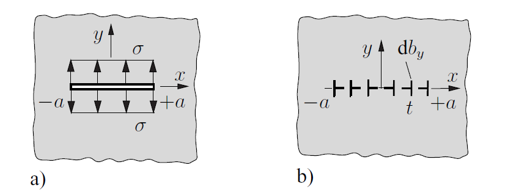

---

Für den Riss unter Druck $\sigma$ ergibt sich die Lösung:

$$\mu(x) = \frac{\sigma(\kappa+1)}{2G}\frac{x}{\sqrt{a^2-x^2}}$$

Der SIF folgt direkt aus der Versetzungsdichte:

$$K_I = \lim_{x\to a}\frac{2G}{\kappa+1}\sqrt{2\pi}\sqrt{a-x}\,\mu(x)$$

→ ergibt das bekannte Ergebnis $K_I = \sigma\sqrt{\pi a}$.

> Verschiebungssprung durch Stufenversetzung

---

## Gewichtsfunktionsmethode

**Ziel:** $K_I$ für beliebige Belastung aus einer bekannten Referenzlösung berechnen.

Über den **Bettischen Reziprozitätssatz**:

$$K_I = -\frac{8G}{\kappa+1}\frac{1}{K_I^r}\int_0^a \sigma_y\frac{\partial v^r}{\partial a}\,dx$$

Die **Gewichtsfunktion** ist $\frac{8G}{(\kappa+1)K_I^r}\frac{\partial v^r}{\partial a}$.

> Beispiel: Riss mit nichtlinearer Belastung und Gewichtsfunktion

---

## Risswechselwirkung (Kachanov-Methode)

Bei eng benachbarten Rissen verstärken oder schirmen sie sich gegenseitig ab.

**Kachanov-Selbstkonsistenzgleichungen** für $n$ Risse unter Modus I:

$$(\delta_{ji}-\Lambda_{ji})\bar{p}_j = p_i^\infty, \quad i=1,\ldots,n$$

**Fernfeldnäherung** ($d\gg a$, kollineare Risse):

$$K_I \approx K_I^0\left(1+\frac{1}{2}\left(\frac{a}{d}\right)^2\right)$$

Wechselwirkung klingt schnell mit dem Abstand ab — als $(a/r)^2$ in 2D.

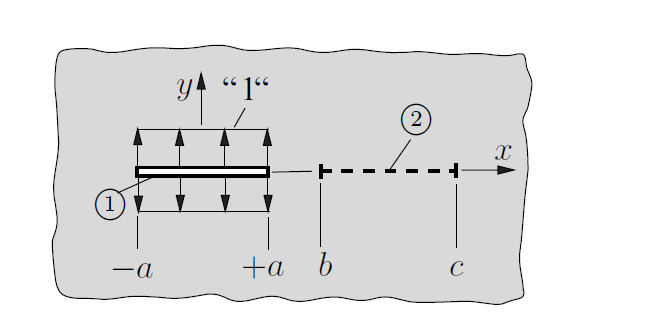

---

> Transferfaktor, Kachanov-Methode für zwei Risse, kollineare Risse, numerisch simulierte Risswechselwirkungspfade

---

## Spannungsintensitätsfaktoren und Kerbfaktoren

**Elliptisches Loch** (Halbachsen $a$, $b$) unter Zug $\sigma$:

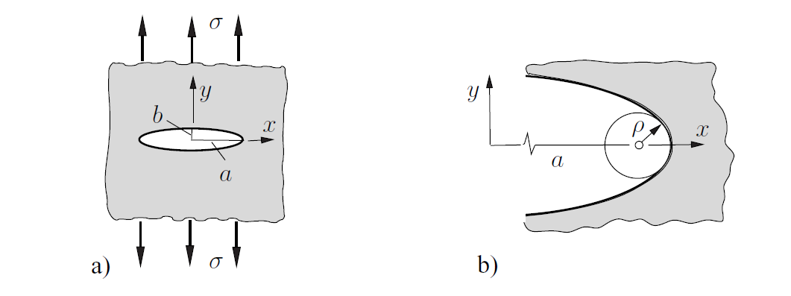

Maximalspannung an der Spitze:

$$\sigma_\text{max} = \sigma\left(1+2\sqrt{\frac{a}{\rho}}\right) \approx 2\sigma\sqrt{\frac{a}{\rho}} \quad (\rho\ll a)$$

mit Kerbradius $\rho = b^2/a$. Für $\rho\to 0$: Ellipse degeneriert zum Riss, $\sigma_\text{max}\to\infty$.

---
<!-- _class: lead -->
# Energiebilanz

---

## Energiefreisetzung beim Risswachstum

Während der Rissausbreitung um eine Fläche $\Delta A$ gilt:

$$\Delta\Pi = \Delta W_\sigma \leq 0$$

Die **mechanische Energie nimmt ab** während des Risswachstums. Die freigesetzte Energie treibt den Bruchprozess.

---

## Energiefreisetzungsrate $\mathcal{G}$

$$\mathcal{G} = -\frac{d\Pi}{dA} \qquad \text{(3D)}, \qquad \mathcal{G} = -\frac{d\Pi}{da} \qquad \text{(2D pro Einheitsdicke)}$$

$\mathcal{G}$ hat die Dimension Kraft pro Längeneinheit = **Risserweiterungskraft**.

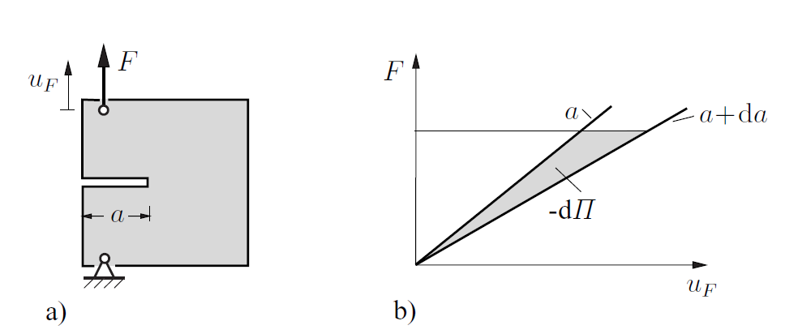

**Zusammenhang mit den SIF** (Modus I):

$$\mathcal{G} = \frac{\kappa+1}{8G}K_I^2 = \begin{cases}K_I^2/E & \text{ESZ}\\ (1-\nu^2)K_I^2/E & \text{EVZ}\end{cases}$$

Für alle drei Modi kombiniert:

$$\mathcal{G} = \frac{1}{E^*}(K_I^2 + K_{II}^2) + \frac{1}{2G}K_{III}^2$$

mit $E^* = E/(1-\nu^2)$ für EVZ/3D und $E^* = E$ für ESZ.

---

## Nachgiebigkeitsmethode

Für einen Körper mit Einzelkraft $F$ und Nachgiebigkeit $C(a)$:

$$\mathcal{G} = \frac{F^2}{2B}\frac{dC}{da}$$

Dieses Ergebnis ist **unabhängig vom Belastungstyp** (Totlast, Feder, feste Verschiebung).

**DCB-Probe** (Double Cantilever Beam) mit Armlänge $a$, Höhe $h$:

$$C = \frac{8a^3}{EBh^3}, \qquad K_I = \frac{2\sqrt{3}\,Fa}{Bh^{3/2}}$$

---

## Griffith-Bruchkriterium

Die Bruchenergie $\Gamma$ (Oberflächenenergie + inelastische Dissipation) geht in die Energiebilanz ein:

$$\frac{d\Pi}{dA} + \frac{d\Gamma}{dA} = 0$$

Mit $\mathcal{G} = -d\Pi/dA$ und $G_c = 2\gamma$ (spezifische Bruchflächenenergie):

$$\boxed{\mathcal{G} = G_c}$$

**Griffith-Kriterium (1921):** Risswachstum setzt ein, wenn die freigesetzte Energie die für den Bruch erforderliche Energie erreicht.

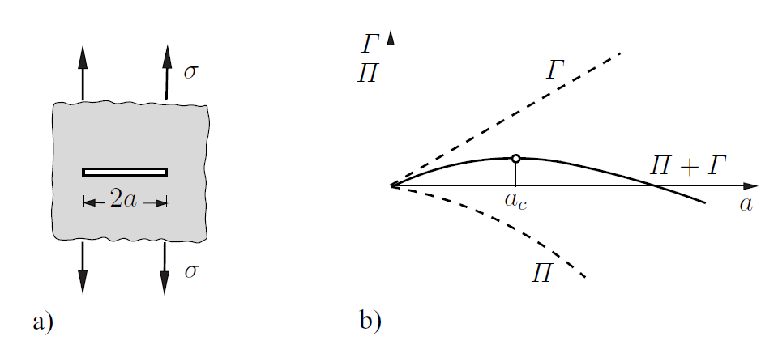

---
<!-- _class: lead -->
# J-Integral

---

## Definition und Erhaltungssatz

Für einen homogenen elastischen Körper (keine Volumenkräfte) ist der **J-Integralvektor**:

$$J_k = \int_{\partial V}(U\delta_{jk}-\sigma_{ij}u_{i,k})n_j\,dA$$

mit dem **Eshelby-Spannungstensor** $b_{kj} = U\delta_{jk} - \sigma_{ij}u_{i,k}$.

**Divergenzsatz** zeigt: $J_k = 0$ für jede geschlossene Fläche, die defektfreies Material umschließt.

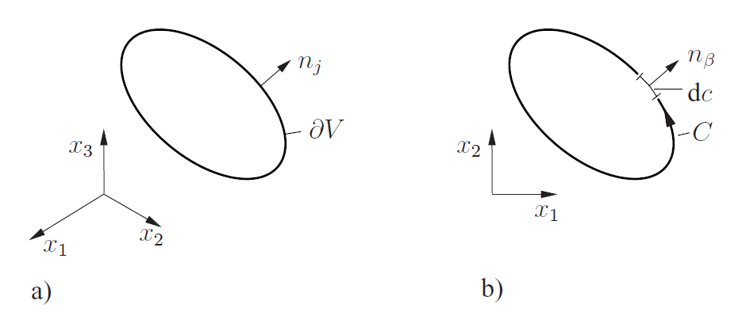
> J-Integral: (a) 3D geschlossene Fläche, (b) 2D Kontur C

---

## J-Integral als Rissspitzenparameter

Für eine Kontur $C$ um die Rissspitze mit lastfreien Rissflanken:

$$J = J_1 = \int_C\left(U\,dy - t_i u_{i,x}\,dc\right)$$

**Energetische Interpretation:**

$$J = \mathcal{G} = -\frac{d\Pi}{da}$$

**Wegunabhängigkeit:** $J$ ist für jede die Rissspitze umschließende Kontur gleich — bei geraden, unbelasteten Rissflanken.

Für linear-elastisches Material:

$$J = \frac{1}{E^*}(K_I^2+K_{II}^2) + \frac{1}{2G}K_{III}^2$$

> **Praktischer Vorteil:** Integrationsweg weit von der Rissspitze wählbar — keine genaue Rissspitzenfeldauflösung im FEM/BEM nötig.

> J-Integral: (a) beliebige Kontur, (b) Wegunabhängigkeit, (c) schrumpfende Kontur

---

## Konfigurationskräfte

Für eine Fläche $\partial V$, die eine **Diskontinuität oder Singularität** umschließt:

Energieänderung bei translatorischer Verschiebung $ds_k$ der Diskontinuität:

$$d\Pi = -J_k\,ds_k$$

**Interpretation:** $J_k$ ist eine **Konfigurationskraft** (Materialkraft) — sie treibt den Defekt vorwärts.

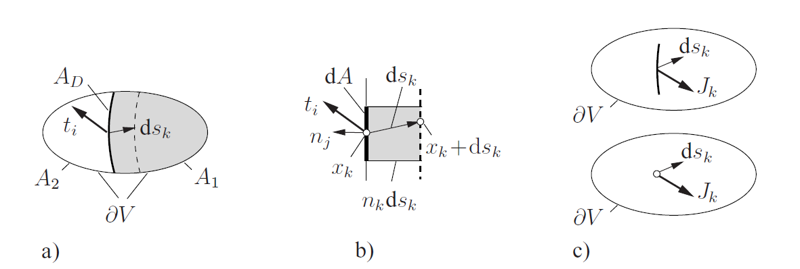
> Konfigurationskräfte: (a) Oberfläche um Grenze, (b) virtuelle Verschiebung, (c) allgemeiner Defekt

---

## Beispiel: Bimaterial-Stab

$$J_1 = \frac{N^2}{2A}\left(\frac{1}{E_1}-\frac{1}{E_2}\right)$$

→ Kraft, die den **Steifigkeitssprung** treibt.

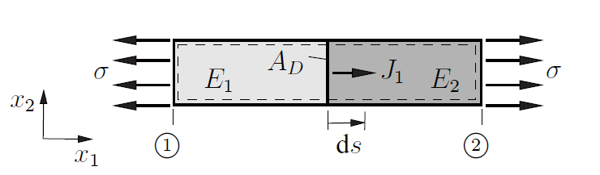

---
<!-- _class: lead -->
# Plastische Zone (Small-Scale Yielding)

---

## Plastische Zonengröße – Irwin-Korrektur

**LEBM-Annahme:** Plastische Zone $r_p \ll R$ (K-dominierte Zone).

**Irwin-Abschätzung:** Plastische Zone (Kräftegleichgewicht):

$$2r_p = \begin{cases}\dfrac{1}{3\pi}\left(\dfrac{K_I}{\sigma_F}\right)^2 & \text{EVZ}\\ \dfrac{1}{\pi}\left(\dfrac{K_I}{\sigma_F}\right)^2 & \text{ESZ}\end{cases}$$

> Plastische Zone im EVZ ist **deutlich kleiner** als im ESZ.

**Irwin-Risslängenkorrektur:**

$$a_\text{eff} = a + r_p$$

---

## Form der plastischen Zone

Plastische Zonengrenze nach von Mises:

$$r_p(\varphi) = \frac{K_I^2}{2\pi\sigma_F^2}\cos^2\frac{\varphi}{2} \begin{cases}\left[3\sin^2\frac{\varphi}{2}+(1-2\nu)^2\right] & \text{EVZ}\\ \left[3\sin^2\frac{\varphi}{2}+1\right] & \text{ESZ}\end{cases}$$

**Dog-Bone-Modell:** Im Inneren dicker Platten dominiert EVZ (kleine Zone), an der Oberfläche ESZ (große Zone).

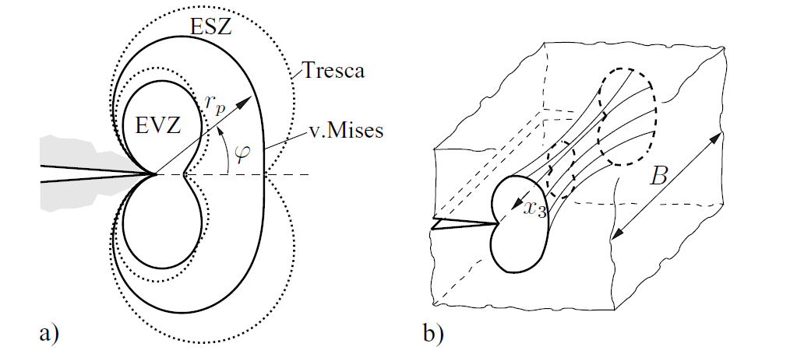
> Plastische Zonenkonturen: von Mises vs. Tresca, EVZ vs. ESZ; Gleitmechanismen

---
<!-- _class: lead -->
# Stabiles Risswachstum und R-Kurven

---

## R-Kurve

Der Risswiderstand $G_c$ ist im Allgemeinen **nicht konstant**, sondern steigt mit dem Rissfortschritt:

$$G_c = R(\Delta a)$$

**Gleichgewichtsbedingung:**

$$\mathcal{G}(F,a) = R(\Delta a)$$

**Stabilitätsbedingung** (bei fester Last):

$$\frac{\partial\mathcal{G}}{\partial a}\bigg|_F < \frac{dR}{da} \quad \Rightarrow\quad \text{stabiles Risswachstum}$$

**Instabilität:**

$$\frac{\partial\mathcal{G}}{\partial a}\bigg|_F = \frac{dR}{da}$$

---

## Stabilität – Federbelastetes System

**DCB-Probe** ($C = 8a^3/EBh^3$):

$$\frac{d\mathcal{G}}{da} = \begin{cases}-48F^2a/EBh^3 & \text{feste Verschiebung → immer stabil}\\ +24F^2a/EBh^3 & \text{Totlast → instabil}\end{cases}$$

> **Totlast** erreicht Instabilität **früher** als feste Verschiebungsbelastung.

---
<!-- _class: lead -->
# Mischmodus-Belastung

---

## Mischmodus – Allgemein

Bei kombinierter Modus-I- und Modus-II-Belastung:
1. Bruch wird durch **beide** $K_I$ und $K_{II}$ ausgelöst
2. Riss breitet sich unter einem **Winkel** $\varphi_0$ zur ursprünglichen Rissrichtung aus

Für spröde Werkstoffe breitet sich der Riss so aus, dass die neue Oberfläche im **Modus-I-Typ** öffnet.

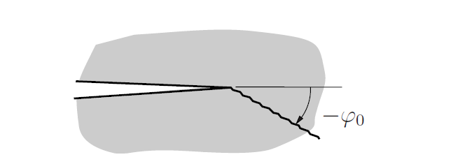
> Rissausbreitung unter Mischmodus-Belastung unter Winkel $-\varphi_0$

---

## Mischmodus-Kriterien – Vergleich

| Kriterium | $\varphi_0$ (reiner Modus II) | $K_{II,c}/K_{Ic}$ |
|-----------|--------------------------|-------------------|
| Energetisch | tangential (0°) | 1,0 |
| Max. Umfangsspannung | −70,6° | 0,866 |
| S-Kriterium, $\nu=1/3$ | −83,6° | 0,905 |
| Knickmodell | ≈ −70° (numerisch) | ≈ 0,87 |

---

## Einschränkungen der Mischmodus-Kriterien

- Alle Kriterien ignorieren den **mikroskopischen Versagensmechanismus**
- Unter reinem Modus II: raue Rissflächen **verzahnen sich** → tatsächliche Rissspitzenbelastung geringer als $K_{II}$ vorhersagt
- Kriterien physikalisch nur für $K_I > 0$ (offener Riss) gültig
- Empirische Alternative:

$$\left(\frac{K_I}{K_{Ic}}\right)^\mu + \left(\frac{K_{II}}{K_{IIc}}\right)^\nu = 1$$

---
<!-- _class: lead -->
# Rissinitiierung an Löchern und Kerben

---

## Größeneffekt und Hybridkriterium

**Problem:** An abgerundeten Kerben sind Spannungen endlich → klassische Versagenskriterien anwendbar. **Aber:** Versagensspannung hängt von der **absoluten Größe** des Spannungskonzentrators ab.

**Leguillon-Hybridkriterium (2002):** Bruch setzt ein, wenn ein **endlicher Riss** $\Delta a$ spontan entsteht.

Zwei Bedingungen **gleichzeitig** erfüllt:

$$\frac{1}{\Delta a}\int_0^{\Delta a}f(\sigma_{ij})\,dx = \sigma_c \qquad \text{(gemitteltes Spannungskriterium)}$$

$$\mathcal{G}(\Delta a) = -\frac{\Delta\Pi}{\Delta a} = G_c \qquad \text{(inkrementelles Energiekriterium)}$$

**Charakteristische Materiallänge:**

$$l = \frac{1}{\pi}\left(\frac{K_{Ic}}{\sigma_c}\right)^2$$

---

## Hybridkriterium – Anwendung auf einen Riss

Versagensspannung:

$$\sigma_f = \sigma_c\sqrt{\frac{1}{1+a/l}}$$

- **Kurze Risse** ($a < l$): $\sigma_f \approx \sigma_c$ — Riss wird nicht als Spannungskonzentrator wahrgenommen
- **Lange Risse** ($a > l$): $\sigma_f \to K_{Ic}/\sqrt{\pi a}$ — klassisches LEBM-Ergebnis

> Hybridkriterium: (a) Geometrie, (b) Versagensspannung vs. Risslänge

---
<!-- _class: lead -->
# Ermüdungsrissausbreitung (Bruchmechanik)

---

## Paris-Gesetz

**Paris, Gomez & Anderson (1961)** — empirisches Potenzgesetz:

$$\boxed{\frac{da}{dN} = C \cdot (\Delta K)^m}$$

- $C$, $m$: Werkstoffkonstanten (temperatur-, umgebungs-, mittelspannungsabhängig)
- Typische Exponenten für Metalle: $m \approx 2\ldots 4$

**Forman-Gleichung** (berücksichtigt $K_{Ic}$):

$$\frac{da}{dN} = \frac{C\,(\Delta K)^m}{(1-R)K_{Ic}-\Delta K}, \qquad R = K_\text{min}/K_\text{max}$$

---

## Lebensdauervorhersage

Integration des Paris-Gesetzes von Anfangsrisslänge $a_i$ bis kritische Länge $a_c$:

$$N_f = \frac{1}{C(\Delta\sigma)^m}\int_{a_i}^{a_c}\frac{da'}{\left[\sqrt{\pi a'}F(a')\right]^m}$$

**Kernaussage:** Verdopplung von $\Delta\sigma$ reduziert die Lebensdauer um den Faktor $2^m$ — bei $m=3$: **8× kürzere Lebensdauer**

**Erforderliche Eingabegrößen:**
- Anfangsrissgröße $a_i$ (Inspektion/ZfP)
- Kritische Rissgröße $a_c$ (aus $K_I = K_{Ic}$)
- Geometriefunktion $F(a)$
- Werkstoffkonstanten $C$, $m$
- Spannungsschwingbreite $\Delta\sigma$

---
<!-- _class: lead -->
# Anisotrope Werkstoffe

---

## Rissspitzenfelder in orthotropen Werkstoffen

Viele Werkstoffe sind anisotrop: Holz, Faserverbunde, Einkristalle.

**Kernergebnis:** Für linear-orthotrope Werkstoffe behalten die Rissspitzenfelder **qualitativ den gleichen Charakter** wie im isotropen Fall:
- Spannungssingularität: $\sim 1/\sqrt{r}$
- Rissöffnung: $\sim\sqrt{r}$
- SIF $K_I$, $K_{II}$ charakterisieren die Feldstärke

**Wichtiger Unterschied:** Anisotropie verursacht im Allgemeinen **Mischmodus-Kopplung** — außer wenn die Rissrichtung mit einer Orthotropieachse zusammenfällt.

---

## Beispiel: Riss in orthotroper Scheibe

Gerader Riss entlang der Orthotropierichtung unter Fernfeldzug $\sigma$:

$$K_I = \sigma\sqrt{\pi a}$$

**Identisch zum isotropen Ergebnis!** Gleichermaßen: $K_{II} = \tau\sqrt{\pi a}$.

**Energiefreisetzungsrate** (Riss ∥ Orthotropieachse):

$$\mathcal{G} = K_I^2\sqrt{h_{11}h_{22}} + K_{II}^2\sqrt{h_{11}}\left[\frac{1}{2}\sqrt{\frac{h_{22}}{h_{11}}}+\frac{2h_{12}+h_{66}}{2h_{11}}\right]^{1/2}$$

mit $h_{ij}$ = Nachgiebigkeitskoeffizienten des orthotropen Werkstoffs.

**Bruchzähigkeit ist richtungsabhängig:** $G_c = G_c(\vartheta)$ — Bruch bevorzugt entlang der Orthotropierichtungen (z.B. Faserrichtung, Holzfaserrichtung).

---
<!-- _class: lead -->
# Bruchzähigkeit $K_{Ic}$

---

## Bestimmung und Einflussfaktoren

$K_{Ic}$ wird durch **standardisierte Versuche** bestimmt (z.B. ASTM E399-90).

**Probengeometrien:** Compact-Tension (CT), Drei-Punkt-Biegung (3PB) — jeweils mit **Ermüdungsanriss**.

**Größenanforderung** (sichert EVZ und Small-Scale Yielding):

$$a,\; W-a,\; B \;\geq\; 2{,}5\left(\frac{K_{Ic}}{\sigma_F}\right)^2$$

**Einflussfaktoren:** Mikrostruktur, Belastungsgeschichte, Umgebung, Temperatur, Probendicke.

---

## Repräsentative Werte

| Werkstoff | $K_{Ic}$ [MPa$\sqrt{\text{m}}$] |
|----------|-------------------------------|
| Hochfeste Stähle | 25 … 95 |
| Baustähle | 30 … 125 |
| Ti-Legierungen | 40 … 95 |
| Al-Legierungen | 20 … 65 |
| Al$_2$O$_3$-Keramik | 3 … 9 |
| Glas | 0,6 … 1,3 |
| Beton | 0,15 … 1,4 |
| PMMA | 0,7 … 1,6 |

---

## Numerische Bestimmung von K-Faktoren

**FEM:** Gesamter Körper diskretisiert

**BEM:** Nur der Rand (einschließlich Risse) diskretisiert — besonders effizient für Rissprobleme

**Peridynamik (PD):** Nichtlokale Methode, vermeidet Spannungssingularitäten

> (a) Parabolische Kerbe, (b) V-Kerbe

**K-Faktor-Extraktion aus Verschiebungen** (Rissflankenmethode):

$$\begin{pmatrix}K_I\\K_{II}\end{pmatrix} = \lim_{r\to 0}\sqrt{\frac{2\pi}{r}} \cdot \frac{2G}{\kappa+1}\begin{pmatrix}v(r,\pi)\\u(r,\pi)\end{pmatrix}$$

**Viertelknotenelemente:** Spezielle Knotenplatzierung zur Erfassung des $\sqrt{r}$-Verschiebungsverhaltens — verbessert die Genauigkeit erheblich.

---
<!-- _class: lead -->
# Zusammenfassung

---

## Übersicht der Bruchparameter

| Parameter | Stärke | Einschränkung |
|-----------|--------|--------------|
| $K_I$ | Direkt, tabelliert | Nur linear-elastisch |
| $\mathcal{G}$ | Globale Energie, kein Rissspitzennetz nötig | Modentrennung erfordert zwei Rechnungen |
| $J$ | Wegunabhängig, erweiterbar auf nichtlinear | Wegunabhängigkeit nur bei geraden, lastfreien Rissflanken |

---

## Kernaussagen der Doppelvorlesung

**Ermüdung:**
- Rissinitiierung durch **lokale Mikroplastizität** (PSB) — auch bei global elastischer Belastung
- Drei Stadien: Initiierung → Ausbreitung → Restbruch
- Thermische Ermüdung: $\Delta T$ als Treibkraft, Kriechen-Ermüdungs-Wechselwirkung

**Lineare Bruchmechanik:**
- $K$-Konzept: $r^{-1/2}$-Singularität, $K_I = K_{Ic}$ als Bruchkriterium
- $\mathcal{G} = G_c$ (Griffith) und $J$-Integral als äquivalente Beschreibungen
- Paris-Gesetz $da/dN = C(\Delta K)^m$ verknüpft Ermüdung mit Bruchmechanik
- Mischmodus, R-Kurven, plastische Zone, anisotrope Erweiterung

---

## Literatur

- Gross, Seelig: *Bruchmechanik*, 2016, DOI 10.1007/978-3-662-46737-4
- Zerbst, Madia: *Bruchmechanische Bauteilbewertung*, 2022, DOI 10.1007/978-3-658-36151-8

---

<!-- _class: lead -->
## Vielen Dank für die Aufmerksamkeit

**Fragen?**

Prof. Dr.-Ing. Christian Willberg
christian.willberg@h2.de
Hochschule Magdeburg-Stendal