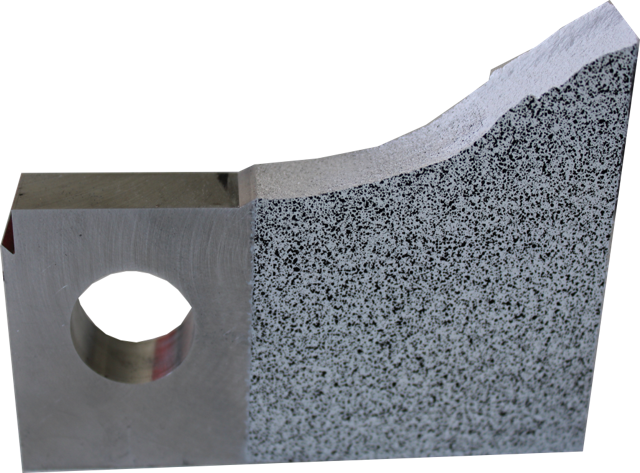

##  Werkstofftechnik II - Festigkeit und Plastizität
Prof. Dr.-Ing.  Christian Willberg 

Kontakt: christian.willberg@h2.de

---

<!--paginate: true-->

# Lernziele

- Konzept der **idealen Festigkeit** verstehen und die Abweichung zur realen Festigkeit erklären
- Struktur und Wirkmechanismus von **Versetzungen** in Kristallen beschreiben
- Den **Burgersvektor** physisch verstehen und auf Kristallstrukturen anwenden
- Verschiedene **Festigkeitssteigerungsmechanismen** bei Metallen kennen und vergleichen
- Praktische **Anwendungen** in der Ingenieurtechnik zuordnen

---

---

# Die ideale Festigkeit

## Gedankenexperiment

Bei zunehmender Zugspannung werden die atomaren Bindungen immer stärker belastet. Die Rückstellkraft ist maximal bei etwa dem 1,25-fachen des Gleichgewichtsabstands.

$\sigma_{\text{ideal}} \approx \frac{E}{4} \quad \text{(einfache Absch\"atzung)}$

$\sigma_{\text{ideal}} \approx \frac{E}{10} \quad \text{(genaue Berechnung)}$

---

# Ideale vs. reale Festigkeit

## Vergleich am Beispiel

| Werkstoff | E-Modul / MPa | Erwartete Festigkeit (E/10) | Reale Festigkeit |
|---|---|---|---|
| Tiefziehstahl | 200 000 | 20 000 MPa | ~300 MPa |
| Hochfester Stahl | 200 000 | 20 000 MPa | ~2 000 MPa |
| Zirkonoxid (Druck) | 200 000 | 20 000 MPa | 4 000 MPa |

⚠️ Die reale Festigkeit ist stets **deutlich geringer** als die ideale Festigkeit – Grund: nicht alle Bindungen werden gleichzeitig belastet.

Übersicht realer Festigkeitswerte: Abb. 3.2

---

# „Teppichtrick"

## Warum wird die ideale Festigkeit nicht erreicht?

Die Annahme, dass alle Atome **gleichzeitig** versagen müssen, ist falsch. Stattdessen:

- Bei **Polymeren**: Ein kurzes Kettensegment verschiebt sich zuerst → Verschiebung pflanzt sich fort → nur wenige Bindungen werden gleichzeitig gelöst.
- Bei **Metallen**: Analoger Mechanismus über **Versetzungen** (denen widmen wir uns gleich).

**Analogie – Der Teppichtrick:** Ein großer Teppich wird nicht als Ganzes verschoben, sondern durch eine lokale Falte, die durchgeschoben wird. Nur lokal werden „Bindungen" (Reibung) gelöst.

Abb. 3.1 – Analogie: Bewegung eines Teppichs durch eine Falte

---

# Versetzungen in Kristallen

## Stufenversetzung – Was ist das?

Kristalle sind selten perfekt. Bei der Erstarrung entstehen **eingeschobene Halbebenen** → sogenannte **Stufenversetzungen**.

- Ein Teil des Kristallgitters hat eine **zusätzliche Atomebene**, die abrupt endet.
- Der Ort, an dem diese Ebene endet, heißt **Versetzungslinie**.
- Diese Versetzungslinie läuft durch den gesamten Kristall.

Die Versetzung ist das Zentrum des „Teppichtricks" bei Metallen: Sie ermöglicht plastische Verformung bei weit niedrigeren Spannungen als die ideale Festigkeit.

Abb. 3.3(a) – Kristallgitter mit eingeschobener Halbebene

---

# Der Burgersvektor – Bestimmung

## Der Burgers-Umlauf

Der Burgersvektor $\vec{b}$ wird durch einen geschlossenen Umlauf um die Versetzung bestimmt:

1. **Startpunkt** wählen, weit von der Versetzung entfernt
2. **Gleich viele Schritte** in jede Richtung gehen (z. B. 5 nach rechts, 5 nach oben, 5 nach links, 5 nach unten)
3. Im **perfekten Kristall** würde die Linie sich schließen
4. Um die **Versetzung** herum schließt die Linie sich **nicht**
5. Der Vektor vom End- zum Startpunkt zum Schließen der Linie = **$\vec{b}$**

**Merken:** Der Burgersvektor zeigt genau die Richtung und Größe der **Verschiebung**, die eine Versetzung beim Durchlaufen des Kristalls erzeugt.

Abb. 3.3(a) – Definition des Burgersvektors durch Burgers-Umlauf

---

# Der Burgersvektor – Physische Bedeutung

## Was bedeutet $\vec{b}$ konkret?

### Geometrisch
- $|\vec{b}|$ = **Verschiebungsbetrag** einer Kristallhälfte pro Versetzungsdurchlauf
- Bei kfz-Metallen: $|\vec{b}| \approx 0{,}25$–$0{,}29\,\text{nm}$ → in der Größenordnung eines **Atomdurchmessers**

### Physisch
- $\vec{b}$ bestimmt die **Linienspannung** $T \propto b^2$
- $\vec{b}$ bestimmt die **Kraft** auf die Versetzung: $F = \tau \cdot l \cdot b$
- Kleineres $b$ → niedrigere Energie → **energetisch bevorzugt**

### Richtung
- Bei **Stufenversetzung**: $\vec{b} \perp$ Versetzungslinie
- Bei **Schraubenversetzung**: $\vec{b} \parallel$ Versetzungslinie
- Bei **gemischter Versetzung**: Winkel dazwischen

Abb. 3.3 – Stufenversetzung | Abb. 3.5 – Stufe vs. Schraube

---

# Der Burgersvektor – Warum minimal?

## Zusammenhang mit der Kristallstruktur

Der Burgersvektor muss ein **Translationsvektor** des Kristallgitters sein – nur dann führt die Verschiebung wieder zu einem identischen Gitter.

### kfz-Gitter
- Kürzester Translationsvektor: $\vec{b} = \frac{a}{2}[1\bar{1}0]$
- Länge: $|\vec{b}| = \frac{a}{\sqrt{2}}$
- Gleitebene: $\{111\}$ (dichtest gepackt)

### krz-Gitter
- Kürzester Translationsvektor: $\vec{b} = \frac{a}{2}[111]$
- Länge: $|\vec{b}| = \frac{a\sqrt{3}}{2}$
- Gleitebene: $\{110\}$ (dichtest gepackt)

### Warum nicht $\vec{b} = a[100]$?
- Das wäre ein gültiger Translationsvektor
- Aber: $T \propto b^2$ → **4-fach höhere Energie**
- Natur wählt immer den **energetisch günstigsten** Vektor

---

# Der Burgersvektor – Zahlenbeispiele

## Konkret für Metalle

| Metall | Struktur | Gitterkonstante $a$ / nm | Burgersvektor $|\vec{b}|$ / nm | Berechnet |
|---|---|---|---|---|
| Fe | krz | 0,287 | 0,248 | $\frac{0{,}287\cdot\sqrt{3}}{2} = 0{,}249$ ✓ |
| W | krz | 0,317 | 0,274 | $\frac{0{,}317\cdot\sqrt{3}}{2} = 0{,}275$ ✓ |
| Al | kfz | 0,405 | 0,286 | $\frac{0{,}405}{\sqrt{2}} = 0{,}286$ ✓ |
| Ni | kfz | 0,352 | 0,248 | $\frac{0{,}352}{\sqrt{2}} = 0{,}249$ ✓ |

Die experimentellen Werte bestätigen exakt die theoretischen Formeln – der Burgersvektor ist also tatsächlich der **kürzeste Translationsvektor** des jeweiligen Gitters.

Tab. 3.1 – Gitterkonstanten und Burgersvektoren einiger Metalle

---

# Bewegung einer Stufenversetzung

## Plastische Verformung durch den „Teppichtrick"

Die Versetzung bewegt sich durch den Kristall → obere Kristallhälfte wird um $\vec{b}$ gegenüber der unteren verschoben. Dabei werden **nur am Ort der Versetzung** Bindungen gleichzeitig gelöst.

Plastische Verformung findet bei Spannungen $\tau \ll E/10$ statt – weil nur lokale Bindungen aufgebrochen werden müssen.

Abb. 3.4 – Bewegung einer Stufenversetzung durch den Kristall

---

# Linienspannung einer Versetzung

## Energetische Beschreibung

Die Versetzung erzeugt ein lokales **Verzerrungsfeld** und erhöht damit die Kristallenergie. Die pro Längeneinheit gespeicherte Energie heißt **Linienspannung $T$**:

$$T \approx \frac{G \cdot b^2}{2}$$

- $G$: Schubmodul
- $b$: Länge des Burgersvektors

→ **Konsequenz:** Der Burgersvektor sollte so klein wie möglich sein, um die Verzerrungsenergie zu minimieren.

---

# Stufen- vs. Schraubenversetzung

### Stufenversetzung
- $\vec{b} \perp$ Versetzungslinie
- Eingeschobene Halbebene senkrecht zur Verschiebungsrichtung

### Schraubenversetzung
- $\vec{b} \parallel$ Versetzungslinie
- Ebenen werden wie eine **Wendeltreppe** versetzt

Eine **gebogene Versetzung** kann an einem Ende reinen Stufen- und am anderen Ende reinen Schraubencharacter besitzen.

Abb. 3.5 – Vergleich Stufenversetzung / Schraubenversetzung | Abb. 3.6 – Abgleitvorgang bei Schraubenversetzung | Abb. 3.7 – Gekrümmte Versetzungslinie

---

# Wechselwirkung & Multiplikation

## Kräfte zwischen Versetzungen

- **Gleiches Vorzeichen** (Halbebene in gleiche Richtung) → **Abstoßung**
- **Umgekehrtes Vorzeichen** → **Anzug**, auf gleicher Gleitebene: **Annihilation**

## Frank-Read-Quelle

Eine blockierte Versetzung wird durch Schubspannung $\tau$ ausgebaucht → nierenförmiger Ring → Versetzungsmultiplikation.

Die Versetzungsdichte steigt von $10^{10}$–$10^{12}\,\text{m}^{-2}$ (geglüht) auf bis zu $10^{16}\,\text{m}^{-2}$ (kalt verformt).

Abb. 3.8 – Wechselwirkungen zwischen Versetzungen | Abb. 3.9 – Frank-Read-Quelle

---

# Kraft auf eine Versetzung

## Herleitung über Arbeit

Die äußere Schubspannung $\tau$ leistet bei Verschiebung um $b$ die Arbeit $\tau \cdot w \cdot l \cdot b$. Diese wird durch Versetzungsbewegung über Distanz $w$ umgesetzt:

$$F = \tau \cdot l \cdot b$$

- $l$: Länge der Versetzung
- $b$: Burgersvektor

---

# Anwendung: Versetzungen in der Umformtechnik

## Wo kommt das in der Praxis vor?

Versetzungen sind der **Schlüssel zur Umformbarkeit** von Metallen. Ohne sie wären Metalle wie Keramiken – spröde und nicht formbar.

### Umformverfahren
- **Walzen** von Blechen und Stangen
- **Tiefziehen** von Dosen, Karosserieteilen
- **Gesenkumformung** von Motorenteilen
- **Extrusion** von Aluminiumprofilen

### Was passiert dabei?
- Versetzungen bewegen sich durch das Metall
- Plastische Verformung ohne Materialverlust
- Gezielte **Formgebung** bei relativ niedrigen Spannungen
- Energieeffizient gegenüber Spannen oder Giessen

**Merken:** Versetzungen ermöglichen die Umformung – Festigkeitssteigerung bedeutet umgekehrt, dass diese Bewegung erschwert wird.

---

# Festigkeitssteigerung – Übersicht

**Grundprinzip:** Plastische Verformung wird durch Versetzungsbewegung verursacht. Festigkeitssteigerung bedeutet → **Versetzungsbewegung erschweren**.

## Mechanismen

| Mechanismus | Prinzip | Typische Δσ (Al) |
|---|---|---|
| Mischkristallhärtung | Fremdenatome verzerren Gitter | bis 100 MPa |
| Teilchenhärtung | Ausscheidungen blockieren Versetzungen | 200–400 MPa |
| Feinkornhärtung | Korngrenzen als Barrieren | 20–50 MPa |
| Verformungsverfestigung | Versetzungsdichte ↑ | variabel |

---

# Mischkristallhärtung

## Prinzip

Fremdenatome (z. B. Mg in Al) lösen sich im Wirtsgitter auf und erzeugen ein lokales **Verzerrungsfeld**. Eine Versetzung muss dieses Feld überwinden → zusätzlicher Kraftaufwand.

$$\Delta\sigma_{\text{m.k.}} = \text{const} \cdot \sqrt{c}$$

- $c$: Konzentration des gelösten Elements

### Zwei Typen

- **Substitution:** Fremdenatom ersetzt Wirtsgitteratom (z. B. Mg in Al, $r_{\text{Mg}} = 0{,}16\,\text{nm}$ vs. $r_{\text{Al}} = 0{,}143\,\text{nm}$)
- **Interstitiell:** Fremdenatom in Gitterlücke (z. B. C in Fe, $r_{\text{C}} = 0{,}077\,\text{nm}$)

Abb. 3.10 – Phasendiagramm Al-Mg | Abb. 3.11 – Fließwiderstand Al-Mg | Abb. 3.12 – Substitution vs. Interstitition

---

# Interstitielle Härtung am Beispiel Stahl

## Kohlenstoff in Eisen

- C-Atome wandern zu Versetzungskernen → **Verankerung** der Versetzungen
- Zum Losreißen wird eine hohe Spannung nötig → **obere Streckgrenze $R_{eH}$**
- Einmal losgerissen: bereits bei niedrigerer Spannung mobil → **untere Streckgrenze $R_{eL}$**
- Folge: inhomogene Verformung → **Lüdersbänder** → beim Tiefziehen: Fließfiguren

⚠️ Vorher „Dressieren" (Walzen), um alle Versetzungen zu mobilisieren, danach erst Tiefziehen.

Abb. 3.13 – Technisches σ-ε-Diagramm von Stahl mit $R_{eH}$ und $R_{eL}$

---

# Anwendung: Mischkristallhärtung

## Wo kommt das in der Praxis vor?

### Aluminium-Legierungen (Al-Mg)
- **Serie 5xxx** (z. B. Al-Mg 3–5%)
- Eingesetzt in: Schiffsbau, Karosserie, Fassaden
- Gute Korrosionsbeständigkeit + mäßige Festigkeit
- Nicht wärmebehandelbar → Mischkristall bleibt

### Edelstahl (Fe-Cr-Ni)
- Cr löst sich substitutionell in Fe auf
- Erhöht sowohl Festigkeit als auch **Korrosionswiderstand**
- Einsatz: Küchen, Medizin, Chemie

### Titan-Legierungen (Ti-Al, Ti-V)
- Al und V lösen sich in der Titanmatrix auf
- Eingesetzt in: **Flugzeugbau**, Medizintechnik
- Niedriges Gewicht + hohe Festigkeit

### Kupferlegierungen
- Zink in Kupfer → **Messing** (substitutionell)
- Einsatz: Ventile, Fittings, Elektrotechnik

---

# Teilchenhärtung – Ausscheidung

## Thermodynamische Grundlagen

Bei Unterschreitung der Löslichkeitsgrenze kann eine **Ausscheidung** (Precipitation) ablaufen. Zwei Kriterien:

**① Energiekriterium:**

$$\Delta G = \underbrace{\tfrac{4}{3}\pi r^3 \cdot g_v}_{\text{Volumenterm} < 0} + \underbrace{4\pi r^2 \cdot \gamma_s}_{\text{Grenzflächenterm} > 0}$$

**② Kinetisches Kriterium:** Diffusion $D = D_0 \cdot e^{-Q/(RT)}$ muss ausreichend schnell sein → Temperatur $\approx 0{,}3$–$0{,}5\,T_m$.

Abb. 3.14 – Ausscheidungsmorphologien (kohärent / inkohärent) | Abb. 3.15 – Energiebilanz

---

# Kritischer Radius & Wärmebehandlung

## Kritischer Radius

$$r^* = -\frac{2\gamma_s}{g_v}$$

Teilchen mit $r > r^*$ wachsen unter Energiegewinn weiter.

## Wärmebehandlung (z. B. Al-4Cu)

1. **Lösungsglühung** oberhalb der Löslichkeitsgrenze (~500 °C)
2. **Abschreckung** (z. B. in Öl) → gelösten Zustand einfrieren
3. **Ausscheidungswärmebehandlung** (100–150 °C) → kontrollierte Ausscheidung

Abb. 3.16 – Zeit-Temperatur-Umwandlungsdiagramm Al-4Cu

---

# Schneiden vs. Orowan

## Zwei Mechanismen bei kohärenten Teilchen

### Schneiden (unteraltert)
Versetzung durchschneidet das Teilchen:

$$\Delta\sigma_{t,1} = \text{const} \cdot \sqrt{f_v \cdot r}$$

Festigkeit **steigt** mit $r$.

### Orowan-Mechanismus (überaltert)
Versetzung umgeht das Teilchen:

$$\Delta\sigma_{t,2} = \text{const} \cdot G \cdot b \cdot \frac{\sqrt[3]{f_v}}{r}$$

Festigkeit **sinkt** mit $r$.

**Maximum:** Bei $r_{\text{opt}}$ wechselt der Mechanismus → maximale Festigkeit $\Delta\sigma_{t,\text{max}} = 200$–$400\,\text{MPa}$ (Al).

Abb. 3.17 – Schneiden eines Teilchens | Abb. 3.18 – Orowan-Mechanismus | Abb. 3.19 – Festigkeit vs. Teilchenradius

---

# Anwendung: Teilchenhärtung

## Wo kommt das in der Praxis vor?

### Aluminium 7xxx (Al-Zn-Mg-Cu)
- **Höchstfeste Aluminiumlegierung**
- Ausscheidung von MgZn₂-Teilchen
- Einsatz: **Flugzeugstruktur** (Fuselage, Flügel)
- Typisch: $R_m \approx 500$–$600\,\text{MPa}$
- Wärmebehandlung kritisch: Peak-Aged vs. Überalterung

### Stähle (Karbidausscheidungen)
- Feine Fe₃C- oder MC-Karbide in der Ferrit-/Martensitmatrix
- Einsatz: **Werkzeuge**, Fahrzeugbau, Konstruktion

### Superlegierungen (Ni-Basis)
- γ'-Phase (Ni₃Al) als kohärente Ausscheidung
- Einsatz: **Flugtriebwerke**, Kraftwerk-Turbinen
- Betriebstemperaturen bis > 1000 °C
- Überalterung bei zu hoher Temperatur → Festigkeitsverlust

---

# Feinkornhärtung

## Hall-Petch-Beziehung

Versetzungen können nicht von einem Korn ins Nachbarkorn durchtreten → Korngrenzen wirken als Barrieren:

$$\Delta\sigma_{\text{f.k.}} = \frac{k}{\sqrt{d}}$$

- $k$: Hall-Petch-Konstante
- $d$: Korndurchmesser

### Entscheidender Vorteil

Bei allen anderen Härtungsmechanismen **sinkt** die Bruchdehnung. Bei Feinkornhärtung **steigt** sie an.

Technisch üblich: $d = 0{,}01$–$0{,}1\,\text{mm}$; bei Al: $\Delta\sigma_{\text{f.k.}} \approx 20$–$50\,\text{MPa}$.

---

# Anwendung: Feinkornhärtung

## Wo kommt das in der Praxis vor?

### Feinkornstahl (z. B. S355)
- Durch Mikrozusätze (Nb, V, Ti) wird das Korn beim Walzen verfeinert
- Einsatz: **Brücken, Behälter, Offshore-Strukturen**
- Vorteil: Höhere Festigkeit UND bessere Zähigkeit → sicherere Konstruktionen

### Titan-Implantate (Ti-6Al-4V)
- Feinkörnige Struktur durch thermomechanische Umformung
- Einsatz: **Hüftgelenke, Zahnimplantate**
- Biokompatibel + leicht + fein körnig verfestigt

### TWIP/TRIP-Stähle
- Mn-reichere Stähle mit hoher Verfestigung
- Feinkornstruktur durch Zwillingsbildung
- Einsatz: **Automobilindustrie** (Karosserie, Crashelemente)
- Leichtwau + hohe Deformationsenergie

---

# Verformungsverfestigung

## Mechanismus

Plastische Verformung → Versetzungsmultiplikation (Frank-Read) → Versetzungen verhaken sich → „Dickicht" → höhere Spannung zum Durchschneiden nötig.

$$\Delta\sigma_v = \text{const} \cdot \sqrt{\rho}$$

- $\rho$: Versetzungsdichte

Die Differenz $R_m - R_{p0,2}$ gibt den maximalen Beitrag der Verformungsverfestigung an. Bei hochfesten Werkstoffen (niedrige Bruchdehnung) ist dieser Spielraum gering.

Abb. 3.20 – Vergleich σ-ε-Kurven: mischkristallverfestigt vs. ausscheidungsgehärtet

---

# Anwendung: Verformungsverfestigung

## Wo kommt das in der Praxis vor?

### Kaltumformung von Rohren und Drähten
- Draht wird durch eine Düse gezogen → plastische Verformung
- Versetzungsdichte steigt → Draht wird fester
- Einsatz: **Federdrähte**, Seile, Fahrradspoken
- Dressiertes Blech: leichtes Vorwalzen vor dem Tiefziehen

### Kaltgewalztes Edelstahl-Blech
- Durch Walzen bei Raumtemperatur verfestigt
- Einsatz: **Küchen-Arbeitsplatten**, Chemie-Anlagen
- Korrosionsbeständig + höhere Festigkeit als glühend gewalzt

### Kupfer-Rohre (Sanitär)
- Kaltgezogene Kupferrohre haben höhere Festigkeit
- Einsatz: **Wasserleitungen, Klimaanlagen**
- Kann durch Glühbehandlung (Erholung) rückgängig gemacht werden

---

# Zusammenfassung – Mechanismen

| Mechanismus | Gleichung | Typische Δσ (Al) | Bruchdehnung |
|---|---|---|---|
| Mischkristall | $\Delta\sigma \propto \sqrt{c}$ | bis 100 MPa | ↓ |
| Teilchenhärtung | Schneiden / Orowan | 200–400 MPa | ↓ |
| Feinkornhärtung | $\Delta\sigma \propto 1/\sqrt{d}$ | 20–50 MPa | ↑ |
| Verformungsverfestigung | $\Delta\sigma \propto \sqrt{\rho}$ | variabel | ↓ |

In der Praxis werden **mehrere Mechanismen kombiniert** (z. B. Mischkristall + Teilchen + Feinkorn).

---

# Zusammenfassung – Anwendungen

| Anwendung | Dominanter Mechanismus | Werkstoff |
|---|---|---|
| Flugzeugstruktur | Teilchenhärtung | Al 7xxx |
| Flugtriebwerk-Turbine | Teilchenhärtung | Ni-Superlegierung |
| Brücken, Offshore | Feinkornhärtung | Feinkornstahl S355 |
| Karosserie (leicht) | Feinkorn + Verformungsverfestigung | TWIP/TRIP-Stahl |
| Sanitär-Rohre | Verformungsverfestigung | Kaltgezogenes Cu |
| Schiffsbau | Mischkristallhärtung | Al 5xxx |
| Medizin-Implantate | Feinkornhärtung | Ti-6Al-4V |
| Werkzeuge | Teilchenhärtung (Karbide) | Werkzeugstahl |

**Merken:** Kein einzelner Mechanismus reicht – moderne Hochleistungswerkstoffe kombinieren mehrere Härtungsmechanismen gleichzeitig.

