

<!-- _class: lead -->

# Faserverbundwerkstoffe - Einführung

Prof. Dr.-Ing. Christian Willberg 
Hochschule Magdeburg-Stendal

 

---

<!-- _class: lead -->

# Was ist ein Faserkunststoffverbund (FKV)?

<!-- _class: cols-2 -->

- **Mehrphasen- oder Mischwerkstoff** aus zwei Hauptkomponenten
  - Faser (verstärkend)
  - Matrix (bindend)
- Der Gesamtwerkstoff hat **höherwertige Eigenschaften** als jede Komponente alleine
- Material und Eigenschaften entstehen **in der Fertigung**

> **Werkstofftechnische Einordnung**
>
> FKV gehören zu den **Verbundwerkstoffen** — eine der großen Werkstoffgruppen neben Metallen, Keramiken und Polymeren.
>
> Besonderheit: FKV sind streng genommen **Konstruktionen**, keine reinen Werkstoffe — Faser und Matrix behalten ihre Identität.

---

# Wirkprinzip: Verbundkonstruktion

<!-- _class: cols-2 -->

Verschiedene Werkstoffe werden kombiniert, so dass Eigenschaften entstehen, die die Einzelkomponenten alleine **nicht erzielen könnten**.

**Klare Aufgabenteilung:**

| Komponente | Aufgabe |
|---|---|
| **Fasern** | Mechanische Lasten tragen |
| **Matrix** | Fasern fixieren & stützen |

> **Analogie aus dem Bauwesen**
>
> **Stahlbeton** = ebenfalls ein Verbundwerkstoff
> - Beton: Drucklasten tragen
> - Stahl: Zuglasten tragen
>
> FKV folgt dem gleichen Prinzip: **Schwächen der einen Komponente** werden durch **Stärken der anderen** kompensiert.

---

# Wo werden FKV eingesetzt?

<!-- _class: cols-2 -->

### Luft- und Raumfahrt
- Hohes Festigkeits/Steifigkeits-Gewichtsverhältnis
- Schadens-, Korrosionstoleranz
- Wartbarkeit / Reparierbarkeit

### Bauwesen
- Widerstand gegen Umwelteinflüsse und Korrosion
- Langlebigkeit

### Schifffahrt
- Salzwasserbeständigkeit
- Schlagtoleranz, lange Lebensdauer

### Landtransport
- Kosten
- Einfache Fertigbarkeit

### Weitere
- Dichtheit, Chemiebeständigkeit
- Sport, Medizintechnik, Windenergie …

---

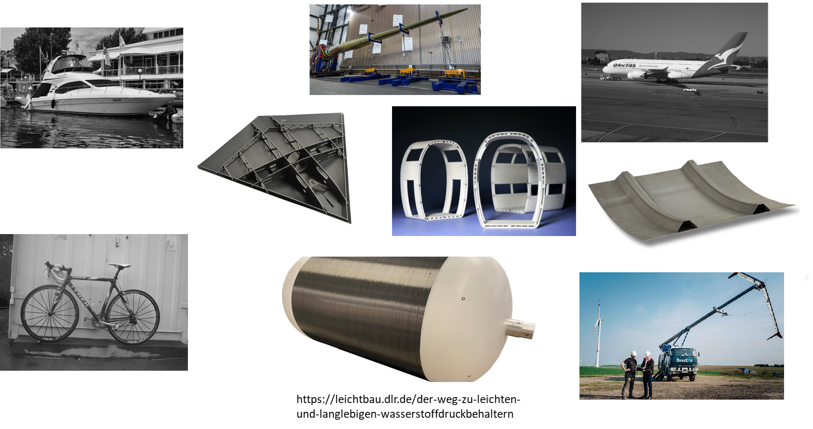

---

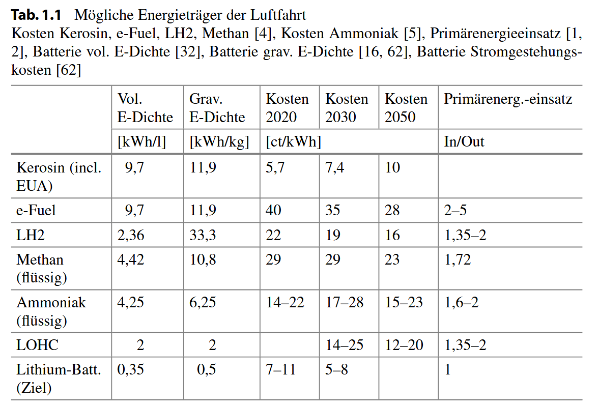

 
    Bild aus M. Wiedemann "Systemleichtbau für die Luftfahrt"

---

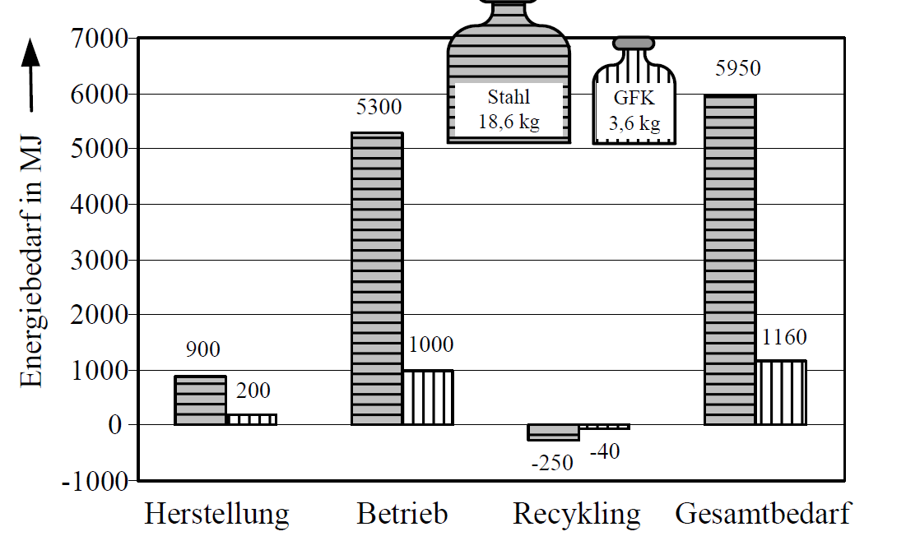

 
    Bild aus H. Schürrmann "Konstruieren mit Faser-Kunststoff-Verbunden"

---

# Warum Leichtbau?

<!-- _class: cols-2 -->

**Gewichtsreduktion** spart Energie über die gesamte Lebensdauer:

- Flugzeug: 1 kg weniger ≈ **100–150 €/Jahr** Kerosinersparnis
- Automobil: 100 kg weniger ≈ **0,3–0,5 l/100 km** weniger
- Windenergie: leichtere Blätter → **längere Blätter möglich** → mehr Ertrag

> **Werkstofftechnische Perspektive**
>
> Leichtbau ist **kein Selbstzweck** — es geht um das Verhältnis von Eigenschaft zu Gewicht:
>
> - Spezifische Festigkeit: $R/\rho$
> - Spezifische Steifigkeit: $E/\rho$
>
> FKV erreichen hier Werte, die metallische Werkstoffe **nicht bieten** können — zumindest in Faserrichtung.

---

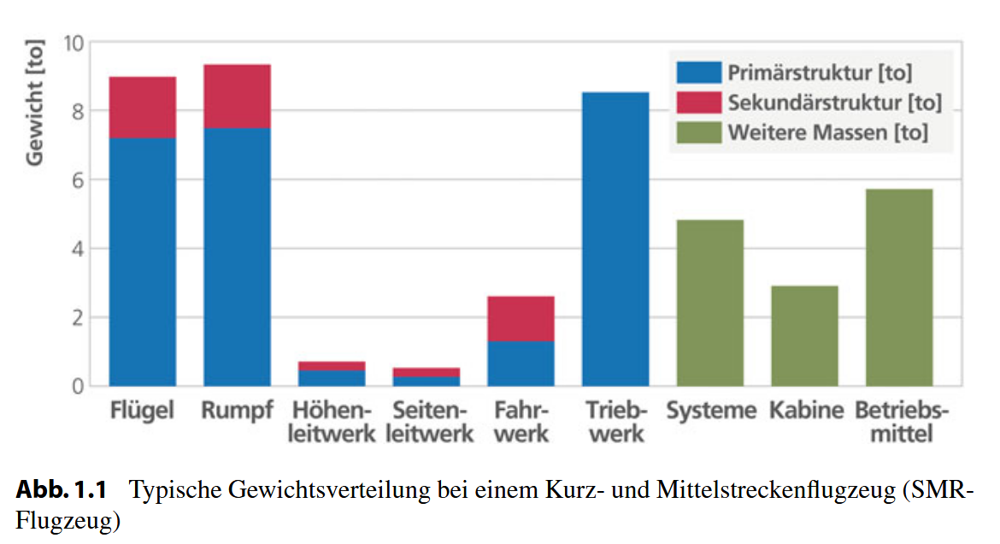

 
    Bild aus M. Wiedemann "Systemleichtbau für die Luftfahrt"

---

# Wann spricht man von FKV?

| | Kurzfaser | **FKV** | Andere Faserverbunde |
|---|---|---|---|
| **Faserlänge** | ≈ 1–10 mm | **> 25 mm** (Endlos) | variabel |
| **Ausrichtung** | zufällig | **präzise** | präzise |
| **Beispiel** | Spritzguss-Kunststoff | CFK-Laminat | MMC, CMC |

> Faserverstärkte Metalle (**MMC**) und Keramiken (**CMC**) sind ebenfalls Faserverbunde — zur Vermeidung von Verwechslungen immer präzisieren.

---

# Abgrenzung zu anderen Verbundwerkstoffen

<!-- _class: cols-2 -->

**Partikelverbunde**
- Beton (Zuschlag + Zement)
- Hartmetall (WC + Co)
- Eigenschaften **isotrop**

**Schichtverbunde**
- Glare® (Al + GF-EP)
- Bimetalle
- Sandwich (Deckschichten + Kern)

**Faserverbunde** ← FKV gehört hierher
- Polymer-Matrix (PMC) = **FKV**
- Metall-Matrix (MMC)
- Keramik-Matrix (CMC)

> **Werkstofftechnische Einordnung:**
>
> FKV = Untergruppe der Faserverbunde mit **Kunststoff-Matrix** (Duroplaste oder Thermoplaste)

---

# Komponenten – eines FKV

<!-- _class: cols-2 -->

**Matrix – bindende Komponente**
- Formgebend
- Schutz und Stabilisierung der Fasern
- Spannungsübertragung an die Fasern

**Faser – verstärkende Komponente**
- Lasttragend (hohe Steifigkeit/Festigkeit)
- Begrenzte thermische Dehnung
- Geringes Gewicht

---

# Komponenten – eines FKV

<!-- _class: cols-2 -->

**Weitere Bestandteile (optional):**
- Faserbeschichtungen (Schlichte, Haftvermittler)
- Füllstoffe
- Beimischung anderer Fasertypen (Hybride)

---

# Die Faser — werkstofftechnische Eigenschaften

<!-- _class: cols-2 -->

| Eigenschaft | GF | CF (HT) | AF |
|---|---|---|---|
| $E_\parallel$ [GPa] | 73 | 230 | 130 |
| $R^+$ [MPa] | 3400 | 3500 | 3000 |
| $\varepsilon_B$ [%] | 4,8 | 1,5 | 2,4 |
| $\rho$ [g/cm³] | 2,54 | 1,76 | 1,44 |
| Anisotropie | **nein** | ja | ja |

GF = Glas, CF = Kohlenstoff, AF = Aramid

>
> - **Glasfaser** ist **isotrop** — gleiche Eigenschaften in alle Richtungen
> - **C- und Aramidfaser** sind **anisotrop** — unterschiedliche E-Moduln längs und quer
> - Fasern sind grundsätzlich **spröde** — keine plastische Verformung!
> - Festigkeitswerte sind **statistisch verteilt** (Weibull)

---

# Die Faser — Herstellungsverfahren

<!-- _class: cols-2 -->

### Glasfaser
- Schmelze bei ~1400°C
- Düsen → Ziehen → Schlichte
- **E-Glas** (elektrisch), **S-Glas** (high strength)
- Kostengünstig

### Kohlenstofffaser
- Aus PAN-Precursor (Polyacrylnitril)
- Stabilisieren → Karbonisieren (1300°C) → ggf. Graphitisieren (>2000°C)
- HT (high tenacity) vs. HM (high modulus)

### Aramidfaser
- Aus Lösung gesponnen (Kevlar®, Twaron®)
- Hohe Schlagzähigkeit
- Empfindlich gegen UV und Feuchtigkeit
- Schlecht zerspanbar

---

# Die Matrix — Aufgaben im Detail

<!-- _class: cols-2 -->

**Die Matrix …**
- umgibt und bettet die Fasern ein
- fixiert Fasern in der vorgegebenen Position
- überträgt **Schubkräfte** zwischen den Fasern
- schützt Fasern vor Umwelteinflüssen
- bestimmt die **Temperatur- und Chemikalienbeständigkeit**
- bestimmt die **Druckfestigkeit** (Stützwirkung!)

> **Kritischer Punkt**
>
> Obwohl die Matrix unverzichtbar ist, stellt sie **häufig den Schwachpunkt** des Werkstoffs dar:
>
> - Niedrigere Festigkeit als Fasern
> - Kriechneigung
> - Temperatur- und Feuchteempfindlichkeit
> - Bestimmt die **Querzugfestigkeit** $R^+_\perp$

---

# Matrixtypen

<!-- _class: cols-2 -->

### Duroplaste (häufigste FKV-Matrix)
- Epoxidharz (EP), Polyester (UP), Vinylester (VE)
- Chemisch **vernetzt** → nicht umformbar
- Hohe Steifigkeit, gute Temperaturbeständigkeit
- Sprödes Verhalten

### Thermoplaste
- PA, PP, PEEK, PPS
- **Umformbar** (Schweißen, Thermoformen)
- Zäher, schlagfester
- Kürzere Zykluszeiten möglich

---

**Werkstofftechnischer Vergleich**
| Eigenschaft | Duroplast | Thermoplast |
|---|---|---|
| Vernetzung | chemisch | physikalisch |
| Umformbar? | nein | ja |
| Kriechneigung | gering | höher |
| Zähigkeit | niedrig | hoch |
| Recycling | schwierig | einfacher |
| Lagerung | begrenzt (Prepreg) | unbegrenzt |

---

# Grenzfläche Faser–Matrix

<!-- _class: cols-2 -->

Die **Grenzfläche** (Interface) ist entscheidend für die Verbundfestigkeit:

- **Schlichte**: Beschichtung auf der Faser ab Werk
  - Schutzfunktion bei Verarbeitung
  - Haftvermittlung (Silan-Kopplungsagenzien)
- **Adhäsion**: chemisch + mechanisch
  - Silane bei GF
  - Oberflächenbehandlung bei CF (Oxidation, Sizing)

> **Werkstofftechnisch:**
>
> Eine **gute Haftung** ist essenziell für:
> - Hohe $R^+_\perp$ (Querzugfestigkeit)
> - Hohe $R_{\perp\parallel}$ (Schubfestigkeit)
> - Hohe $R^-_\parallel$ (Druckfestigkeit, Stützwirkung)
>
> Aber: Zu gute Haftung → sprödes Versagen (Riss geht durch Matrix statt Umlenken an der Grenzfläche)

---

# Der Mehrschichten-Verbund (MSV)

<!-- _class: cols-2 -->

**Warum mehrere Schichten?**

Kräfte in der Bauteilebene wirken in **verschiedenen Richtungen und Beträgen**.

→ Fasern müssen mehrfach unterschiedlich ausgerichtet werden

→ Schichten **gestapelt und verklebt** = Laminat / MSV

**Begriffe im Überblick**

| Begriff | Hinweis |
|---|---|
| **Laminat** | umgangssprachlich, gebräuchlich |
| **MSV** | mechanisch korrekter Terminus |
| **Lamina / Ply** | Einzelschicht |
| **UD-Schicht** | häufigster Schichttyp |

> „Schicht" kann Fertigungsschicht oder mechanische UD-Schicht bedeuten → immer **Faserorientierung angeben**!

---

# Die UD-Schicht — Grundelement des MSV

<!-- _class: cols-2 -->

**Idealisierende Annahmen:**

- Fasern verlaufen **parallel in einer Richtung**
- Fasern gleichmäßig verteilt (Faserpackung)
- Fasern **ideal gerade**, ohne Unterbrechung
- **Ideale Haftung** Faser ↔ Matrix (keine Relativverschiebung)

→ Basis aller mechanischen Berechnungen

> **Werkstofftechnische Realität:**
>
> Keine dieser Annahmen ist **exakt** erfüllt:
>
> - Fasern haben lokale **Welligkeiten** (Fehlorientierung)
> - Faserverteilung ist **inhomogen** (harzreiche Zonen)
> - Haftung ist nicht perfekt
> - Es existieren **Poren** und Einschlüsse
>
> → Theorie liefert **obere Schranken**, die real nicht erreicht werden

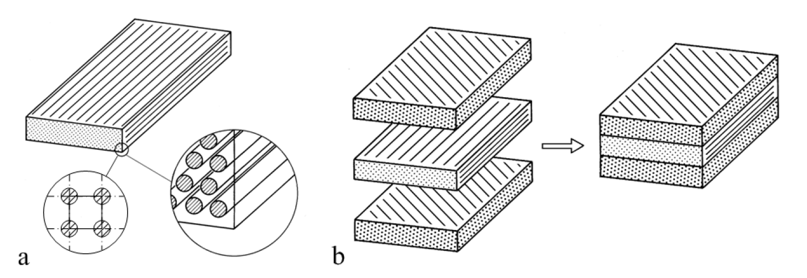

---

# MSV ≠ nur UD-Schichten

<!-- _class: cols-2 -->

**Weitere Halbzeugformen:**

- **Gewebe** — zwei Faserrichtungen (0°/90°), mechanisch als zwei UD-Schichten behandelbar
- **Gelege** (NCF) — mehrere Richtungen, nicht verwoben
- **Geflechte** — für Rohre, gekrümmte Strukturen
- **Matten** — Kurzfasern, quasi-isotrop

**Bekannte MSV-Beispiele außerhalb FKV:**
- Furnierplatten (Holzschichten)
- **Glare®** (Al-Bleche + GF-UD-Schichten)
- **Sandwich** (Deckschichten + Kern)

> **Werkstofftechnische Parallele:**
>
> Sperrholz nutzt das **gleiche Prinzip** wie ein FKV-Laminat: Kreuzweise angeordnete Schichten gleichen die Anisotropie der Einzelschicht aus.

---

# Designvariablen eines Laminats

<!-- _class: cols-2 -->

Im Gegensatz zu Stahl/Al hat der FKV-Konstrukteur **mehr Freiheitsgrade:**

1. Anzahl der Schichten
2. Faser- und Matrixanteil je Schicht
3. **Faserrichtungen** der Einzelschichten
4. Dicken der Einzelschichten
5. **Schichtreihenfolge**

→ Material und Struktur werden **gleichzeitig** entworfen

**Rechnerische vs. experimentelle Methode**

| | Experiment | Rechnung |
|---|---|---|
| Aufwand | hoch | gering |
| Varianten | ❌ | ✅ |
| Optimierung | ❌ | ✅ |

→ Rechnerische Methode ist der **Standardweg**

---

# Konsequenzen der Anisotropie

**Bei isotropen Werkstoffen (Stahl):**
- 2 unabhängige Kennwerte ($E$, $\nu$)
- Belastungsrichtung egal
- 1 Zugfestigkeit reicht

**Bei transversal isotropen FKV:**
- **5** unabhängige Kennwerte
  ($E_\parallel$, $E_\perp$, $G_{\perp\parallel}$, $\nu_{\perp\parallel}$, $\nu_{\perp\perp}$)
- Belastungsrichtung **entscheidend**
- **6** Basis-Festigkeiten nötig

---

>
> | | Stahl | FKV (UD) |
> |---|---|---|
> | E-Moduln | 1 | **2** |
> | Schubmoduln | (aus E, ν) | **1** unabhängig |
> | Querkontraktionszahlen | 1 | **2** |
> | Zugfestigkeiten | 1 | **2** (∥ und ⊥) |
> | Druckfestigkeiten | (≈ Zug) | **2** (∥ und ⊥) |
> | Schubfestigkeiten | (aus Zug) | **2** |
>
> → **Viel mehr Werkstoffprüfung nötig!**

---

# Typische Kennwerte — UD-Schicht vs. Metall

| Kennwert | Stahl S355 | Al 7075 | GF-EP UD | CF(HT)-EP UD |
|---|---|---|---|---|
| $E_\parallel$ [GPa] | 210 | 72 | 45 | **140** |
| $E_\perp$ [GPa] | 210 | 72 | **12** | **10** |
| $R^+_\parallel$ [MPa] | 510 | 570 | 1100 | **2100** |
| $R^+_\perp$ [MPa] | 510 | 570 | **50** | **60** |
| $\rho$ [g/cm³] | 7,85 | 2,80 | 2,0 | **1,55** |
| $R^+_\parallel/\rho$ | 65 | 204 | 550 | **1355** |

> Spezifische Festigkeit $R/\rho$ in Faserrichtung: FKV **weit überlegen** — quer dazu: **weit unterlegen**!

---

# Relativer Faservolumenanteil $\varphi$

Der **relative Faservolumenanteil $\varphi$** ist der wichtigste vom Konstrukteur einstellbare Parameter:

- beeinflusst Steifigkeit, Festigkeit, Wärmeausdehnung, Feuchteaufnahme
- findet sich in **allen grundlegenden Berechnungsformeln**
- ist die wichtigste Größe bei **Qualitätskontrollen**
- muss bei Versuchsergebnissen **immer angegeben** werden

<

---

# Definition von $\varphi$

$$\varphi = \frac{V_f}{V_\text{Verbund}} = \frac{A_f}{A_\text{Verbund}} = \frac{t_f}{t_\text{Verbund}}$$

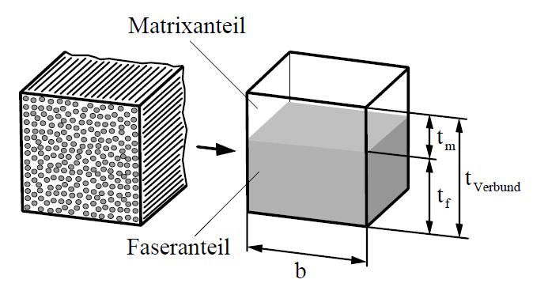

 
    Bild aus H. Schürrmann "Konstruieren mit Faser-Kunststoff-Verbunden"

---

# Typische Werte von $\varphi$

| Fertigungsverfahren | $\varphi$ |
|---|---|
| Prepreg / Wickelverfahren | **≈ 0,60** (Standard) |
| RTM (Resin Transfer Moulding) | ≈ 0,50–0,60 |
| Handlaminat (Gewebe) | ≈ 0,40 |
| Obergrenze | **≈ 0,65–0,70** |

> **Obergrenze ≈ 0,65:**
> Darüber werden Fasern nicht mehr vollständig von der Matrix benetzt → Laminat zu „trocken" → Fehlstellen

---

# Warum ist $\varphi \neq \psi$ wichtig?

<!-- _class: cols-2 -->

**In der Praxis:**

- Halbzeughersteller geben oft **$\psi$** an (leichter messbar: Waage)
- Die Mechanik braucht aber **$\varphi$**
- Verwechslung führt zu **erheblichen Fehlern** in der Berechnung!

**Beispiel GFK:**

Bei $\psi = 0{,}60$ (Massenanteil):

$$\varphi = \frac{0{,}60 \times 1{,}2}{0{,}60 \times 1{,}2 + 0{,}40 \times 2{,}54} = \frac{0{,}72}{0{,}72 + 1{,}016} = 0{,}415$$

→ $\varphi = 0{,}42$ statt der angenommenen $0{,}60$

> **Faktor 1,4 Unterschied!**
> Alle Steifigkeiten und Festigkeiten würden falsch berechnet

---

# Dichte des Verbunds — Mischungsregel

<!-- _class: cols-2 -->

**Mischungsregel** (allgemein):

$$\rho_\text{ges} = \sum_{i=1}^{n} \varphi_i \cdot \rho_i$$

Zweistoffsystem Faser + Matrix:

$$\rho_\text{Verbund} = \varphi \cdot \rho_f + (1-\varphi) \cdot \rho_m$$

**Typische Verbunddichten** (bei $\varphi = 0{,}6$):

| Verbund | $\rho$ [g/cm³] |
|---|---|
| GF-EP | ≈ 2,0 |
| CF-EP | ≈ 1,5 |
| AF-EP | ≈ 1,3 |
| Stahl | 7,85 |
| Aluminium | 2,80 |

> CFK ist etwa **5× leichter als Stahl** und fast **2× leichter als Aluminium**

---

#  Fasern

## Aufgabenteilung im Verbund

- ### Fasern: Lastaufnahme
  - Hohe Steifigkeit und Festigkeit erforderlich
  - Starke atomare Bindungen
  - Geringe Dichte gewünscht

- ### Elemente: B, C, Si (erste Reihen des Periodensystems)

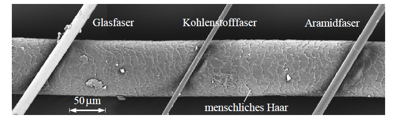

 
    Bild aus H. Schürrmann "Konstruieren mit Faser-Kunststoff-Verbunden"

---

## Theoretische Festigkeiten in Werkstoff umsetzen
- beeinflusst durch 
    - Größe
    - Orientierung
    - Kerben- und Fehlstellen
    - Eigenspannungen
    - Querschnittsform

---

# Größeneffekt 
- Faserdurchmesser beeinflussen die erreichbaren Festigkeiten

**Vorteile kleiner Faservolumina:**
- Weniger Fehlstellen
- Kleinere Defekte → reduzierte Wirksamkeit
- Besonders wichtig bei spröden Werkstoffen

 
    Bild aus H. Schürrmann "Konstruieren mit Faser-Kunststoff-Verbunden" für Glasfasern

---

- im Grenzfall $d_f\rightarrow 0$ besteht die Faser nur aus einer Molekülkette
- Festigkeit ist vollständig durch Primärbindungen bestimmt (deutlich höhere Bindungskräfte und Bindungsenergien im Vergleich zu Sekundärbindungen)
- Kerben- und Fehlstellen können nicht existieren

**Fertigungsvorteil:**
- Niedrige Biegesteifigkeit bei kleinem Durchmesser
- Einfaches Verweben und Drapieren

---

# Orientierung

- Ziehen, Spinnen, Verstrecken sorgen für gesteigerte Festigkeiten und Steifigkeiten
- Orientierung stärkster atomarer Bindungen in Faserlängsrichtung

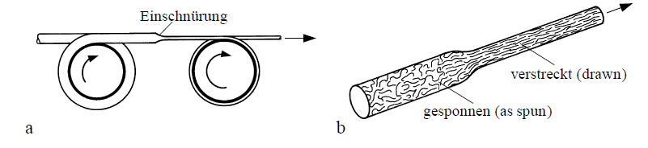

 
    Bild aus H. Schürrmann "Konstruieren mit Faser-Kunststoff-Verbunden" 

---

**Bei kristallinen Werkstoffen:**
- Kristallebenen ausgerichtet

**Bei Polymeren:**
- Molekülketten orientiert
- Kristallinitätsgrad nimmt zu

**Nachteil:** Anisotropes Verhalten
- Reduzierte Eigenschaften quer zur Faser

---

## Bruchzähigkeit von FKV

**Paradox:**
Zwei spröde Werkstoffe → "zäher" Verbund

**Mechanismen:**
- Rissstoppereffekt
- Lastumverteilung
- Einzelfaserbruch ≠ Totalversagen

**Ergebnis:**
- Gewisse Bruchzähigkeit
- Deutlich überlegene Ermüdungsfestigkeit gegenüber Metallen
- Wichtig für Strukturanwendungen

---

# Einteilung der Fasern

**Naturfasern:**
Haare, Wolle, Seide, Baumwolle, Flachs, Sisal, Hanf, Jute, Ramie, Banane

**Organische Fasern:**
PE, PP, PA, PES, PAN, Aramid, Kohlenstoff

---

**Anorganische Fasern:**
Glas, Basalt, Quarz, SiC, Al₂O₃, Bor, (Asbest)

**Metallfasern:**
Stahl, Aluminium, Kupfer, Nickel, Beryllium, Wolfram

---

# Faserlängen und Marktanteile

**Stapelfasern:**
- Begrenzte Länge (Naturfasern)
- Verdrehung für kontinuierlichen Faden

**Filamente:**
- Endlos herstellbar (synthetisch)
- Faserbündel = Garn

---

**Bedeutende Marktanteile:**
- Glasfaser
- Kohlenstofffaser
- Aramidfaser

Pflanzenfasern: Innenverkleidungen (Pkw)

---
# Glasfasern

---

# Glasfasern - Historie

- Erste künstlich hergestellte Faser (~3500 Jahre, Ägypten)
- Industrielle Herstellung: 1938 (USA)
- Ursprung: Elektroisolation bei hohen Temperaturen

---

**Basis:**
- SiO₂ (Quarz) mit starken kovalenten Si-O-Bindungen
- Metalloxide brechen SiO₂-Ketten auf
- Amorphe Struktur bei schneller Abkühlung
- Isotrope Eigenschaften

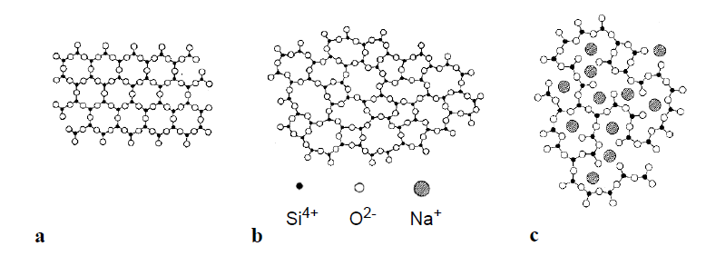

 
    Bild aus H. Schürrmann "Konstruieren mit Faser-Kunststoff-Verbunden"

---

# Herstellung - Schmelzspinnverfahren

1. Rohstoff bei ~1400°C schmelzen
2. 400-6000 Spinndüsen (Ø 1-2 mm)
3. Ausziehen auf Ø 5-24 μm
4. Erstarrung in Sekundenbruchteilen
5. Aufbringung einer Schlichte (0.5-1% $d_f$)
    - Schutz scheuerempfindlicher Fasern
    - Verbesserung Faser-Matrix-Haftung
    - Verklebung zu Spinnfaden
    - Aufwickeln auf Spulen

---

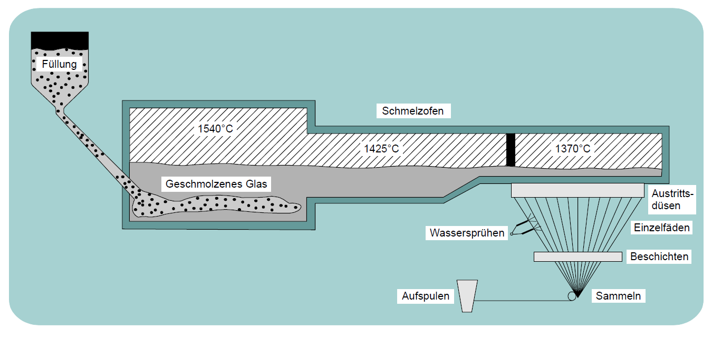

 
    Bild entmommen aus der Vorlesung "Leichtbau mit Faserverbunden" SS2008 von Prof. Dr.-Ing. Klaus Rohwer"

---

# Vorteile Glasfaser

- Niedriger Preis (entscheidend!)
- Sehr hohe Längs-Zugfestigkeit
- Hohe Längs-Druckfestigkeit
- Hohe Bruchdehnung (für manche Anwendungen)
- Gute Drapierbarkeit (niedrige Fasersteifigkeit)
- Elektrische und thermische Isolation
- Unbrennbar
- Geringe Feuchtigkeitsaufnahme
- Gute Chemikalienbeständigkeit
- Unverrottbar (Pilze, Bakterien, Insekten, Nagetiere)

---

# Glasfaser - Weitere Vorteile

**Qualitätskontrolle:**
- Transparenz ermöglicht visuelle Tränkungskontrolle
- Luftblasen sofort erkennbar $\rightarrow$ Milchigkeit
- Brechungsindex ähnlich Matrix

**Schadenserkennung:**
- Schlagschäden durch Milchigfärbung erkennbar
- Besser als bei CFK

**Design:**
- Einfärbung möglich

---

# Nachteile Glasfaser

**Hauptproblem: Zu niedriger E-Modul**
- Kritisch für Strukturbauteile
- Abmischung mit Matrix → ~50% Fasersteifigkeit im Verbund
- Schlanke Biegestrukturen problematisch (Tragflügel)

---

**Aber:**
- Niedriger Modul + hohe Bruchdehnung erwünscht für:
  - Blattfedern
  - Federlenker
  - GFK = ausgezeichneter Federwerkstoff!

---

# Glasfaser - Festigkeitseigenschaften

**Festigkeitserhöhung durch:**
- Größeneffekt (primär)
- Nicht: Orientierung (wie bei organischen Fasern)

**Einflüsse:**
- Faserdurchmesser entscheidend
- Dünn: hohe Zug- und Schwingfestigkeit
- Dick: bessere Druckfestigkeit (weniger knickgefährdet)
- Druckeigenspannungen an Oberfläche (Abkühleffekt)

---

**Praktische Festigkeit:**
- Prospektwerte: matriximprägnierte, unbeschädigte Fäden
- Konstrukteur rechnet mit: Rf ≈ 1800 N/mm² (E-Glas)

---

# Glasfaser - Mechanisches Verhalten

**Spannungs-Dehnungs-Verhalten reine Faser:**
- Linear-elastisch bis Bruch
- Kein plastisches Verformungsvermögen
- Spröder Bruch

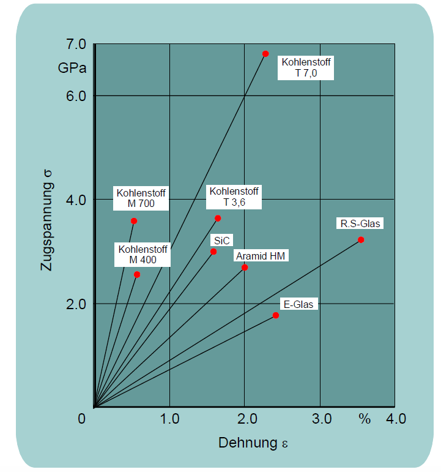

 
    Bild entmommen aus der Vorlesung "Leichtbau mit Faserverbunden" SS2008 von Prof. Dr.-Ing. Klaus Rohwer"

---

**Verbundverhalten**
- Festigkeitsverteilung der Filamente
- Nicht alle brechen gleichzeitig
- Nacheinander versagend
- Abspleißen kündigt Versagen an
- **"Gutmütiges" Versagensverhalten**

**Kriechneigung:** Sehr gering

---

# Glasfasertypen

| Eigenschaft | E-Glas | R-Glas | S-Glas | C-Glas | D-Glas |
|-------------|--------|--------|--------|--------|--------|
| E-Modul [N/mm²] | 73.000 | 86.000 | 86.810 | 71.000 | 55.000 |
| Zugfestigkeit [N/mm²] | 2.400 | 3.600 | 4.500 | 2.400 | 1.650 |
| Dichte [g/cm³] | 2.54 | 2.55 | 2.49 | 2.51 | 2.14 |
| α_T [10⁻⁶/°C] | 5.1 | 4.1 | 5.58 | 4.2 | 3.5 |
| Verluste ab | 300°C | 350°C | - | - | - |

E = Electrical (Standard), R = Resistance, S = Strength
C = Chemical resistant, D = Dielectric

 
    Tabelle aus H. Schürrmann "Konstruieren mit Faser-Kunststoff-Verbunden"

---

# Temperatureinfluss

**Tiefe Temperaturen:**
- Maximale Festigkeit bei ~-180°C (doppelt so hoch wie bei 23°C)

**Hohe Temperaturen:**
- Festigkeitsabfall bei längerer Auslagerung
- R-Glas und S-Glas: deutlich bessere thermal stability
- Wahl bei dauerhaft hohen Temperaturen

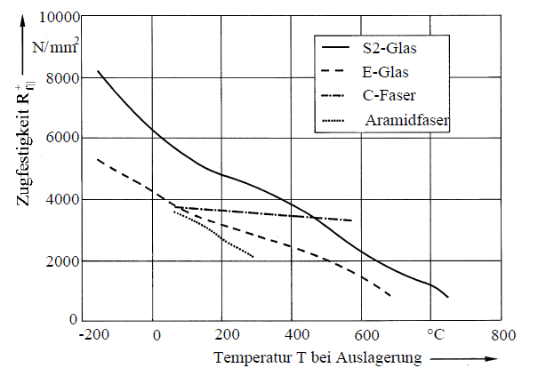

 
    Bild aus H. Schürrmann "Konstruieren mit Faser-Kunststoff-Verbunden"

---

# Chemikalienbeständigkeit

**E-Glas ungeeignet bei:**
- Stark sauer (pH < 3)
- Stark alkalisch
- Zerfallsmechanismus: Auslaugen der Netzwerkbildner/-wandler
- SiO₂-Gerüst bleibt zurück
- Spiralförmige Risse beim Trocknen

---

**Bessere Alternativen:**
- S-Glas und R-Glas (deutlich besser)
- ECR-Glas (E-Glas Corrosion Resistance, ohne Bor)
- Advantex® (Weiterentwicklung)

 
    Bild aus H. Schürrmann "Konstruieren mit Faser-Kunststoff-Verbunden"

---

# Elektrische Eigenschaften

**Isolation:**
- Spez. elektrischer Widerstand: ρ = 10¹⁴-10¹⁵ Ωmm²/m
- Ausgezeichnet für thermische und elektrische Isolation

**Anwendungen:**
- Leiterplatten
- Hochspannungsanlagen (hohe Durchschlagsfestigkeit)
- Isolatoren
- Transformatoren

---

**D-Glas (Spezial):**
- Niedriger dielektrischer Verlustfaktor
- Transparent für elektromagnetische Wellen
- Radarabdeckungen, Flugzeugrumpfnasen

---

# Glasfaser - Feinheit und Abzug

**Feinheit in tex (g/km):**
- Garne: 34, 68, 136 tex
- Rovings: 160, 320, 600, 900, 1200, 2400, 4800 tex

**Außenabzug:**
- Spule innen aufspannen, außen abziehen
- Keine Verdrillung beim Abspulen
- Parallele Filamentausrichtung
- Höchste Laminatqualität
- Aufwand: Spulenregelung pro Spule

---

**Innenabzug:**
- Aus Spulenmitte abziehen
- Direkt von Lieferpalette
- Verdrillung vernachlässigbar
- Reibkraft über Bolzenreihe einstellen

---

# Kohlenstofffasern

---

**Motivation Ende 1950er:**
- Glasfaser-E-Modul zu niedrig
- Suche nach Alternativen
- Elemente: B, C, Si aus ersten Perioden

**Entwicklung:**
- Borfasern (Bor auf Wolfram): schwer verarbeitbar
- Kohlenstofffaser: hat sich durchgesetzt

**Historisch:**
- Experimente ~1878 (Edison, Swan)
- Glühlampen-Fäden aus Baumwolle/Bambus
- Wenig gemeinsam mit modernen Fasern

---

# Herstellung C-Fasern

**Verfahren:**
1. Chemisches Abscheiden auf Trägerdrähten
2. Abbau vorgeformter organischer Fasern

**Durchbruch 1961: Polyacrylnitril (PAN)**
- >90% Marktanteil
- Kohlenstoffausbeute: 55 Gew.-%
- Sehr hohe Module (≈450.000 N/mm²) möglich
- Hohe Festigkeiten (≈7.000 N/mm²)
- Bruchdehnungen bis 3%

---
# Herstellung C-Fasern
**Alternative: Pech (Petroleum/Steinkohle)**
- Mesophase durch thermische Behandlung
- Hohe Orientierung beim Schmelzspinnen

---

**Stufe 1: Stabilisieren (180-350°C)**
- PAN → unschmelzbare Struktur
- Oxidative Atmosphäre (Luft)
- Unter Zugspannung (sonst Schrumpfen)

**Stufe 2: Carbonisierung (bis 1500°C)**
- N₂-Atmosphäre, ohne Spannung
- Nicht-Kohlenstoff-Atome abspalten
- Kohlenstoffringe bilden
- Masseverlust ~50%
- Schrumpfung: ~0.01%/°C

---

**Stufe 3: Graphitierung (2000-3000°C)**
- Je nach gewünschtem E-Modul
- Verstrecken erhöht Orientierung
- 1200-1500°C: hochfest
- >2200°C: Hochmodul
- bis 3000°C: Ultrahochmodul
- Dichte steigt mit E-Modul

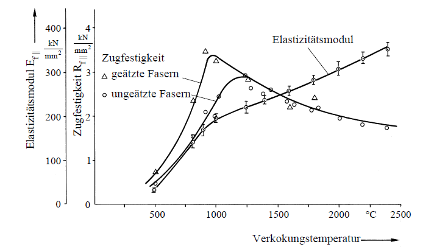

 
    Bild aus H. Schürrmann "Konstruieren mit Faser-Kunststoff-Verbunden"

---

**Stufe 4: Oberflächenbehandlung**
- Stabile Oberflächenoxide erzeugen
- Chemische Reaktion mit Matrix
- Verbesserte Haftung
- Nasschemisch (Salpetersäure) oder thermisch (>400°C)

**Stufe 5: Schlichte**
- Schutz bei Weiterverarbeitung
- Meist modifizierte Epoxidharze
- Hochtemperaturbeständige Schlichten für PEEK, PSU, PA 6.6
- Auch ungeschlichtete Fasern erhältlich

---

# Graphit-Struktur

**Aufbau:**
- Einzelne Schichten
- Starke Bindung in Schichtebene
- Theoretische Werte aus Einkristall:
  - E-Modul: 1.050.000 N/mm²
  - Festigkeit: 100.000 N/mm²

**Realität:**
- Defekte verhindern Erreichen theoretischer Werte

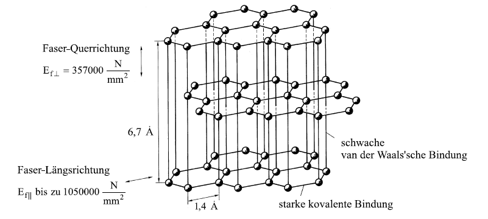
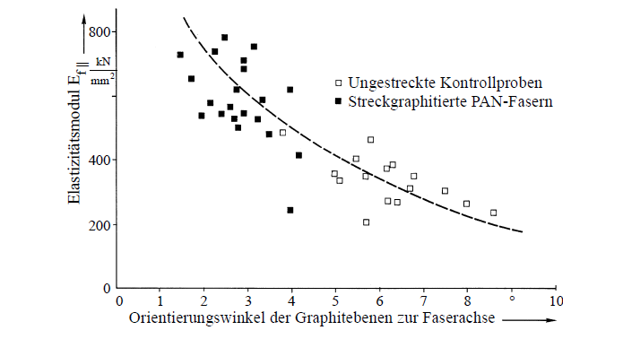

 
    Bilder aus H. Schürrmann "Konstruieren mit Faser-Kunststoff-Verbunden"

---

# Mikrostruktur C-Faser

**Faser als Faser-Matrix-Verbund:**
- Fibrillen eingelagert in amorphem Kohlenstoff
- Fibrillenanteil: 35-63%
- Unregelmäßige Verteilung → niedrigere Festigkeit
- Zusammengeklumpte Fibrillen → niedrigere Festigkeit

---

# Vorteile Kohlenstofffaser

- Sehr leicht (ρ ≈ 1.8 g/cm³ << 2.54 g/cm³ Glas)
- Extrem hohe Festigkeiten
- Sehr hohe E-Module
- E-Modul einstellbar bei Herstellung
- Auswahlmöglichkeit für Konstrukteur
- Exzellente Ermüdungsfestigkeit
- Statisch und dynamisch hochfest
- Entscheidend für Flugzeugbau
- Progressives σ-ε-Diagramm (~10% Steifigkeitszunahme) durch Orientierung der kovalenten Bindungen der Graphikristallen bei hohen Spannungen

---

# C-Faser - Weitere Vorteile

**Anisotropie:**
- $E_{parallel}$ >> $E_{quer}$ (Faktor 10)
- Konstruktiv nutzbar

**Konstruktionsfreundlich:**
- Hohe Steifigkeit zieht Lasten an
- Matrix und Grenzfläche entlastet
- Risse an Grenzflächen treten später auf als bei GFK

---

# C-Faser - Weitere Vorteile

**Thermische Ausdehnung:**
- Quer: positiv
- Parallel: negativ (besonders bei HM)
- α = 0 einstellbar für Präzisionsbauteile!

**Beständigkeit:**
- Gegen meiste Säuren und Alkalien
- Verträglichkeit mit synthetischen Polymeren
- Biokompatibel (menschliches Gewebe, Knochen)
- Durchlässig für Röntgenstrahlung (Medizintechnik)

---

## Nachteile 

- Sprödes Bruchverhalten (geringe Bruchdehnung)
- Aber: Fasern mit höherer Bruchdehnung verfügbar
- Schlagschäden schlecht sichtbar (undurchsichtig)
- Delaminationen innen → Ultraschallprüfung nötig
- CAI-Test (compression after impact) erforderlich
- Druckfestigkeit < Zugfestigkeit (limitierend)

---

**Verarbeitung:**
- Benetzungskontrolle schwierig → Harzüberschuss
- Größere Eckradien nötig (hohe Fasersteifigkeit)

**Kosten:**
- Hoher Faserpreis (Hauptnachteil!)
- Steigt mit E-Modul und Garnfeinheit

---

# C-Faserklassen

<!-- _class: cols-2-1 -->

**HT = High Tenacity (Standard, hochfest)**
**ST = Super Tenacity (höhere Festigkeit)**
**IM = Intermediate Modulus**

**HM = High Modulus (Hochmodul)**
**UHM = Ultra High Modulus**

| Typ | E-Modul [N/mm²] | Zugfestigkeit [N/mm²] | Dichte [g/cm³] |
|-----|-----------------|----------------------|----------------|
| HT | 230.000 | 3.430 | 1.74 |
| ST | 245.000 | 4.510 | 1.80 |
| IM | 294.000 | 4.210 | 1.74 |
| HM | 392.000 | 2.450 | 1.81 |
| UHM | 450.000 | 2.150 | 1.90 |

---

# Temperatureinfluss C-Faser

**Steifigkeit:**
- Temperaturinvariant
- Laminatsteifigkeit parallel: vernachlässigbarer Temperatureinfluss

**Temperaturbeständigkeit:**
- Ausgezeichnet (überlegen gegenüber Glas, Aramid)
- Unschmelzbar bis 4000°C
- Nicht oxidierend: bis ~2000°C
- Mit Luftzutritt: bis ~400°C
- HM-Fasern: noch höhere Einsatztemperatur (weniger Oxidation)

---

**Weitere Eigenschaften:**
- Sehr niedriger thermischer Ausdehnungskoeffizient
- Gute Wärmeleitfähigkeit
- >90% Kohlenstoff

**Leitfähigkeit:**
- ρ = 8 (HM) bis 20 (HT) Ωmm²/m
- Gut elektrisch leitend

---

-  Nicht als Isolator geeignet
-  Widerstandsheizung möglich
-  Induktionserwärmung (viele Kontaktpunkte nötig)
-  Schweißen von Thermoplasten
-  EMV-Abschirmung
-  Galvanische Korrosion mit Metallen (Elektrolyt)
  - OK: Titan, Edelstahl
  - Problematisch: Aluminium (Isolationsmaßnahmen!)
- Kurzschlussgefahr (Bruchstücke, Abrieb)

---

# Lieferformen C-Faser

**Filamentdurchmesser:** 5-10 μm

**Feinheit nach Filamentzahl:**
- 1k, 3k, 6k, 12k, 24k (k = 1000 Filamente)
- Standard (kostengünstig): 12k, 24k
- 12k ≈ 800 tex (Standardfaser)
- Heavy tows: 45k, 400k

**Technische Lieferbedingungen:**
- DIN 29965. DIN 65184

---

# Aramidfasern

---

**Handelsnamen:** Kevlar®, Twaron®, Technora®

**Erste polymere Hochleistungsfaser (Anfang 1970er)**
- Aromatisches Polyamid (Para-Aramid)
- Flüssig-kristalline Lösung versponnen
- Gereckt bei erhöhter Temperatur
- Optional: Avivage (Schutzschicht)

**Mikrostruktur:**
- Sehr hoher Orientierungsgrad
- Starre Kettenmoleküle
- Orientierung ~9°
- Hohe Festigkeiten und E-Module

---

# Vorteile Aramidfaser

- Niedrige Dichte (1.45 g/cm³)
- Leichteste Verstärkungsfaser
- Verschiedene Steifigkeiten verfügbar
- Zugfestigkeit > Glasfaser
- E-Modul ≈ 2× Glasfaser
- Sehr gute Ermüdungsfestigkeit
- Stark anisotrop
- Stark negative α_T in Faserrichtung
- Dämpfung >> Glas und C-Faser (Faktor 10)

---

- Sehr hohe Zähigkeit
- Hoher Widerstand gegen Rissausbreitung
- Schlagbeanspruchte Laminate

**Mischgewebe C-Aramid:**
- Verbesserung CFK-Schlagzähigkeit
- Verhindert völliges Auseinanderbrechen

**Rissstopper:**
- Einfügen dünner Aramidgewebe
- Verhindert Rissfortschritt in Nachbarschichten
- Niedrigmodulfaser besonders geeignet (hohe Bruchdehnung)

---

# Anwendungen

- Flugzeugrümpfe, Monocoques, Rennwagen
- Arbeitsschutzbekleidung, Schutzhandschuhe
- Sportbekleidung (Schürfschutz)
- Ballistischer Schutz (Westen, Helme)
- Mit Polyurethan-Matrix für Platten

**Technische Textilien:**
- Reifen, Keil- und Zahnriemen
- Hydraulikschläuche
- Taue

---

# Nachteile

**Mechanisch:**
- Geringe Druckfestigkeit parallel (R⁻ = 20% R⁺)
- Wiederholte Stauchung >0.8% reduziert Zugfestigkeit
- Stabilitätsversagen in Mikrostruktur

**Material:**
- Wasseraufnahme (Haftungsprobleme)
- Trocknung vor Tränkung erforderlich
- UV-Abbau (lichtgeschützte Lagerung)
- Geringes Kriechen bei Langzeitbelastung

---
# Nachteile
**Verarbeitung:**
- Hohe Zähigkeit → schwer mechanisch bearbeitbar
- Spezialwerkzeuge (Scheren, Bohrer) nötig
- Optimal: lederartiger Zustand nach Anhärten
- Alternative: Wasserstrahltrennung

**Kosten:**
- Zwischen Glas und Kohlenstoff

---

# Aramidfasertypen

| Eigenschaft | Standard (hochzäh) | Hochmodul (hochsteif) |
|-------------|--------------------|-----------------------|
| E-Modul parallel [N/mm²] | 67.000 | 130.000 |
| Therm. Ausdehnung parallel [10⁻⁶/°C] | -2 | -2 |
| Therm. Ausdehnung quer [10⁻⁶/°C] | 12.5 | 17 |
| Zugfestigkeit [N/mm²] | 2.800 | 2.800 |
| Dichte [g/cm³] | 1.44 | 1.45 |

---

## Temperatureinfluss 

- Niedrige T: Festigkeit steigt
- Hohe T: Festigkeit sinkt
- Keine Versprödung bei -196°C
- Restzugfestigkeit nach Lagerung beachten!
- Zersetzungstemperatur: 550°C
- Einsatz bis ~150°C (meist Matrix limitierend)

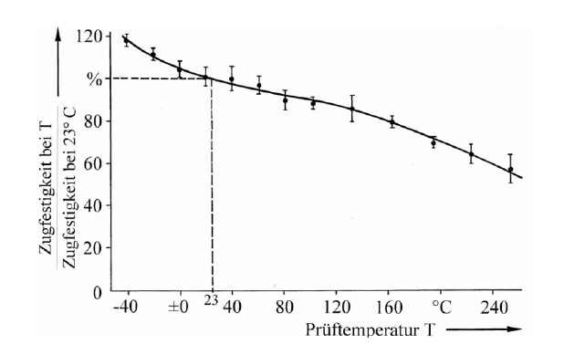

---

## Chemikalienbeständigkeit
- Sehr gut allgemein
- 4 Gew.% Wasseraufnahme (20°C, 65% r.F.)
- Extreme pH-Werte kritisch
- pH 5-7: hervorragend

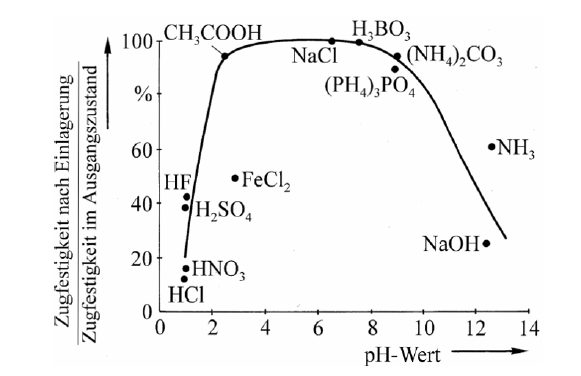

---

# Elektrische Eigenschaften

**Isolation:**
- Ausgezeichnete Isolatoren (wie Polymere)
- ρ im Bereich von E-Glasfaser
- Dielektrizitätskonstante < E-Glasfaser
- Dielektrizitätskonstante < D-Glasfaser

**Anwendung:**
- Antennenabdeckungen

---

# Weitere Polymerfasern

---

**PBO-Faser (Zylon®):**
- E-Modul und Festigkeit ≈ 2× Aramid
- Zersetzung: 650°C (100°C > Aramid)
- Extrem niedrige Druckfestigkeit

**PE-Faser (Dyneema®, Spectra®):**
- Niedrigste Dichte (0.97 g/cm³)
- Herausragende Zähigkeit
- Fasern schwimmen in Wasser
- Extrem niedrige Druckfestigkeit
- Anwendung: Seile, Schutz, Hybride

---

# Naturfasern

- Bastfasern: Flachs, Hanf, Jute, Ramie
- Blattfasern: Sisal, Banane
- Samenfasern: Baumwolle

**Vorteile:**
- Niedrige Dichte (hohl)
- Gute Isolierung
- Geringer Energiebedarf
- Keine Hautreizung
- Kompostierbar/verbrennbar

---

**Nachteile:**
- Große Streuung bei den Parametern
- Temperaturempfindlich
- Geringer Brandwiderstand
- Hygroskopisch
---

| Eigenschaft | Flachs | Hanf | Jute | Ramie | Sisal | Faserbanane | Baumwolle |
|-------------|--------|------|------|-------|-------|-------------|-----------|
| **E-Modul Ef‖** (kN/mm²) | 60-80 | 70 | 10-30 | 44 | 38 | 25 | 12 |
| **Zugfestigkeit fR+** (N/mm²) | 800-1500 | 550-900 | 400-800 | 500 | 600-700 | 980 | 400 |
| **Bruchdehnung εf‖** (%) | 1,2-1,6 | 1,6 | 1,8 | 2 | 2-3 | 3-10 | - |
| **rel. Feuchteaufnahme** (%) | 7 | 8 | 12 | 12-17 | 11 | - | 8-25 |
| **Dichte ρf** (g/cm³) | 1,4 | 1,48 | 1,46 | 1,5 | 1,33 | 1,5 | 1,51 |

---

## Spezialfasern

**Quarzfasern (Quartzel®):**
- 99.99% SiO₂
- α_T ≈ 0 (thermischer Schock unempfindlich)
- Ausgezeichnete chemische Beständigkeit
- Sehr guter Isolator
- Dauerhaft bis 1050°C

**Al₂O₃-Fasern (Nextel™):**
- Hohe Temperaturbeständigkeit (>1000°C)
- Geringe Kriechneigung
- Turbinen-, Motor-, Raketenbau

---

**SiC-Fasern (Nicalon®):**
- Bis 1000°C (oxidative Atmosphäre)
- Eigenschaften ähnlich Standard-C-Faser

---

| Eigenschaft | Quarz 9μm | Quarz 14μm | 62% Al₂O₃ + 24% SiO₂ + 14% B₂O₃ | Al₂O₃ |
|-------------|-----------|------------|----------------------------------|-------|
| **E-Modul Ef‖** (N/mm²) | 77.000 | 79.000 | 150.000 | 380.000 |
| **Zugfestigkeit fR+** (N/mm²) | 3.700 | 3.300 | 1.700 | 3.100 |
| **Therm. Ausdehnungskoeff. αTf‖** (10⁻⁶/°C) | 0,54 | 0,54 | 3 | 8 |
| **Dichte ρf** (g/cm³) | 2,2 | 2,2 | 2,7 | 3,9 |

---

# Faser-Matrix-Grenzfläche
Grenzfläche hat bedsondere Bedeutung und kann faserseitig und matrixseitig beeinflusst werden
**Faserüberzug (bei fast allen Fasern) - Schlichte:**
1. Fixierung Filamente zu Bündel
2. Oberflächenschutz (Abrasion)
3. Verarbeitbarkeit (Reibung, Elektrostatik)
4. Benetzbarkeit/Tränkbarkeit
5. **Haftvermittler** (coupling agent)

---
# Schlichte - Faserspezifisch
**Glasfaser - Textilschlichte:**
- Weichmacher, Filmbildner, Gleitmittel
- Schutz vor Wasseraufnahme
- Thermisch entschlichten (400-600°C)
- Finish: 5-10% Additive, 80-90% Filmbildner, 5-10% Haftvermittler

**Glasfaser - Haftvermittler:**
- Meist Silanbasis
- Chemische Verbindung zu Glas
- Reaktionsfähige Gruppen für Matrix-Copolymerisation

---

**C-Faser:**
- Oxidation am Ende der Fertigungslinie
- Carboxyl- und Carbonylgruppen
- Schlichte: Epoxidharz oder andere (nur Schutz)
- Schlichtefreie Fasern verfügbar

**Aramid/PE:**
- Meist nicht oberflächenbehandelt
- Wenn: Verarbeitbarkeit verbessern
- Schlechte Haftung
- Plasma-Behandlung verbessert deutlich

---

# Schlichte - Auswirkungen

**Positive Effekte:**
- Feuchteaufnahme beeinflusst
- Minimierung Festigkeitsänderungen

**Negative Effekte:**
- Weichmacher-Wirkung im Nahbereich
- Unterhärtung möglich
- Erniedrigte Temperatur-Einsatzgrenzen
- Farbveränderungen möglich

---

**Sonstiges:**
- Schlichte bestimmt Lagerstabilität
- Nicht mit Lösungsmitteln behandeln
- Zuviel Haftvermittler lagert in Matrix ab → schlechter
- Grenzschicht ~200 nm (trotzdem 8% der Matrix!)

---

# Faserauswahl - Methodik

---

**Wenn mechanische Eigenschaften dominieren:**

1. **Glasfaser** wenn:
   - Steifigkeit ausreichend
   - Dichte akzeptabel
   - Preisgünstigste Option
   - Aggressive Medien: Advantex®

2. **C-Faser** wenn:
   - Höhere Steifigkeit nötig
   - Zuerst Standard-C-Faser probieren
   - Optional: Abmischen mit Glas
   - Oberfläche: feine Gewebe (3k)

---

3. **Aramidfaser** wenn:
   - Besonders leicht gewünscht
   - Glasfaser substituieren (25-30% Gewichtseinsparung)
   - Aber: deutlich teurer

4. **Aramid/PE-Faser** wenn:
   - Schlaggefährdet
   - Hohe Zähigkeit erforderlich
   - Mischgewebe mit C-Faser
   - Aufgabenteilung: C (steif/fest), Aramid/PE (zäh)

---

**Spezialanforderungen:**
- Hohe Temperatur: C-, SiC-, Al₂O₃-Fasern
- Beratung durch Hersteller empfohlen!

---

## Aufgaben der Matrix im FKV

- Fixierung der Fasern in geometrischer Anordnung
- Verklebung der Fasern untereinander
- Kraftübertragung zwischen Fasern
- Lastaufnahme bei Quer- und Schubbeanspruchung
- Stützung der Fasern gegen Schubknicken bei Druck
- Verklebung der Laminatschichten
- Rissstopper-Funktion (zähe Matrices)
- Schutz vor Umgebungseinflüssen

**Wichtig:** Matrix ist meist das schwächste Glied im Verbund!

---
# Arten von Polymeren

a. linearer, amorpher Thermoplast 
b. linearer, teilkristalliner Thermoplast 
c. chemisch vernetzter Elastomer
d. chemisch vernetzter Duroplast

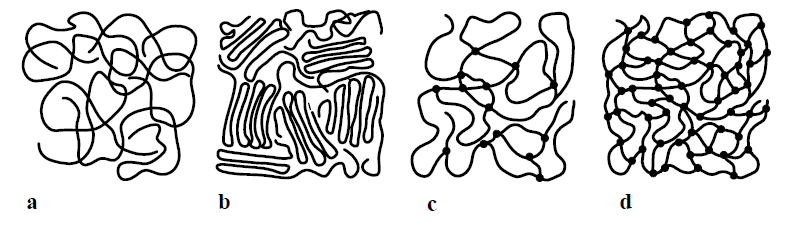

 
    Bild aus H. Schürrmann "Konstruieren mit Faser-Kunststoff-Verbunden"

---

## Duroplaste - Struktur

**Charakteristik:**
- Tri- oder mehrfunktionelle Monomere
- Räumlich engmaschige Vernetzung
- Amorph (ungeordnete Molekülketten)
- Härtung durch chemische Vernetzung
- Nicht aufschmelzbar, nicht schweißbar

---

<!-- _class: cols-2-1 -->

**Duroplaste - Vorteile**

- Hoher E-Modul durch enge Netzstruktur
- Geringe Kriechneigung
- Sehr gute thermische und chemische Beständigkeit
- Vernetzungsdichte bestimmt Eigenschaften
- Dünnflüssige Verarbeitung möglich
- Umfangreiche Erfahrungen vorhanden

**Wichtige Systeme:**
- Epoxid (EP)-Harze
- Ungesättigte Polyester (UP)-Harze  
- Vinylester (VE)-Harze
- Phenol (PF)-Harze

---

## Duroplaste - Nachteile

- Nicht aufschmelzbar → nicht schweißbar
- Zunehmend sprödes Bruchverhalten
- Unverstärkt als Konstruktionswerkstoff ungeeignet
- Recycling schwierig
- Nur als Füllstoff wiederverwendbar

---

## Thermoplaste - Struktur

**Charakteristik:**
- Lineare oder verzweigte Makromoleküle
- Nicht räumlich vernetzt
- Nebenvalenzbindungen durch Verfilzung/Kristallite
- Reversibles Aufschmelzen möglich
- Schweißbar und recyklierbar

---

## Thermoplaste - Arten

**Amorph:**
- Völlig ungeordnete Kettenmoleküle
- Beispiele: Polystyrol (PS), Polycarbonat (PC)
- Einsatz: T < T$_g$

**Teilkristallin:**
- Kristalline Bereiche in amorpher Umgebung
- Beispiele: Polypropylen (PP), Polyamid (PA)
- Höherer E-Modul, Härte, Festigkeit
- Einsatz: T < T$_s$ (Schmelztemperatur)

---

## Thermoplaste - Eigenschaften

**Vorteile:**
- Schweißbar
- Einfaches Recycling durch Aufschmelzen
- Hohe Schlagzähigkeit

**Nachteile:**
- Höhere Kriechneigung als Duroplaste
- Kritisch bei hohen Temperaturen

**Matrixmaterial für FKV:**
PP, PBT, PET, PA, PSU, PES, PPS, PEEK, PEI

---

## Elastomere

**Charakteristik:**
- Schwach räumlich vernetzt
- Sehr hoch dehnfähig
- Gummielastisches Verhalten (T > T$_{g}$)
- Nicht schmelzbar, nicht schweißbar
- Reißdehnung: mehrere hundert Prozent

**Anwendungen:**
- Einachsiger Zug: Keilriemen, Förderbänder
- Zweiachsiger Zug: Druckschläuche, Reifen
- **Nicht** für hoch belastete Strukturbauteile

---

## Füllstoffe - Ziele

**1. Strecken/Verbilligen:**
- Kreide, Kaolin, Schwerspat, Holzmehl
- Reduzierung der Schwindung

**2. Eigenschaften verbessern:**
- Kurzfasern: Festigkeit, Steifigkeit ↑
- Kautschukpartikel: Schlagzähigkeit ↑
- Quarzmehl, Glaskugeln: Steifigkeit, Härte ↑
- Graphit, MoS₂: Tribologie ↑
- Mikro-Hohlkugeln: Dichte ↓

---

## Füllstoffe - Weitere Funktionen

- **Thixotropiemittel** (Aerosil®): Verhindern Ablaufen an vertikalen Flächen
- **Baumwollflocken:** Sprödigkeit reduzieren
- **Trennmittel:** Problemloses Entformen
- **Stabilisatoren:** Wärmebeständigkeit, Hydrolyse
- **Silanisierung:** Haftung zum Polymer verbessern

**3. Einfärben:**
- Farbstoffe (löslich, transparent)
- Pigmente (unlöslich): TiO₂, Ruß, Chromoxid

---

## Methodik zur Matrixauswahl

**Systematisches Vorgehen:**

1. **Vorhandene Systeme nutzen**
   - Bekannte Eigenschaften und Erfahrungen
   - Minimierung der Materialvielfalt

2. **Bewährte Systeme wählen**
   - Qualifizierte Systeme (z.B. Luftfahrt)
   - Verfügbare Dimensionierungsdaten

3. **Neues System qualifizieren**
   - Pflichtenheft erstellen
   - Auswahlkriterien definieren

---

## Auswahlkriterien

**a) Preis**

**b) Werkstoffeigenschaften:**
- Mechanische Eigenschaften
- Temperatur-Einsatzgrenzen
- Beständigkeiten
- Elektrische Eigenschaften
- Brandverhalten

---

**c) Fertigungseigenschaften:**
- Tränkviskosität
- Verarbeitungszeit
- Härtungstemperatur und -zeit
- Lagerzeit
- Arbeitshygiene, Toxizität

---

## Mechanische Eigenschaften

**Drei Forderungen für Verstärkung:**

**1. Fasermodul > Matrixmodul:**
$$E_f > E_m$$

**2. Faserfestigkeit > Matrixfestigkeit:**
$$R_f > R_m$$

**3. Matrixbruchdehnung > Faserbruchdehnung:**
$$\varepsilon_m > \varepsilon_f$$

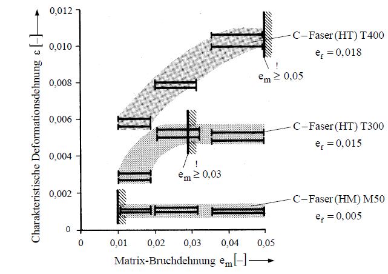

 
    Bild aus H. Schürrmann "Konstruieren mit Faser-Kunststoff-Verbunden"

---

## Matrixbruchdehnung

**Faustformel:**
$$\varepsilon_m \geq 2 \cdot \varepsilon_f$$

**Wichtig:**
- Bewertung im aufgefeuchteten Zustand!
- Wasseraufnahme kann Bruchdehnung erhöhen
- Beispiel PA: Feuchte notwendig für Zähigkeit

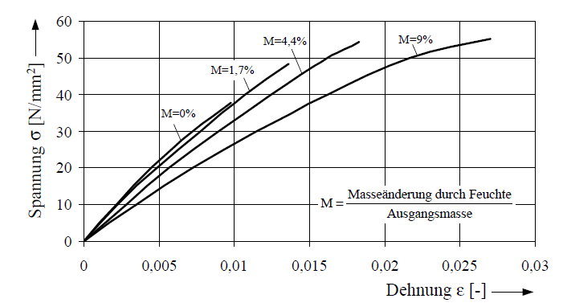

 
    Bild aus H. Schürrmann "Konstruieren mit Faser-Kunststoff-Verbunden"

---

## Chemischer Schrumpf

**Problem:**
- Volumenschrumpf während Härtung
- Bei UP: Schrumpf im teilfesten Zustand
- Ablösung Faser-Matrix
- Festigkeitsverlust (besonders quer zur Faser)

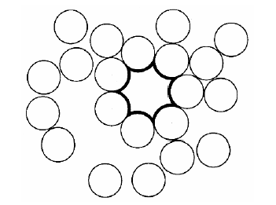

**Lösung bei EP:**
- Schrumpf im flüssigen Zustand
- Gesteuerte Härtungsfront
- Reinharzüberschuss auf Oberfläche

---

## Temperaturbereiche

| Anwendung | Tₘᵢₙ | Tₘₐₓ |
|-----------|------|------|
| Automobil Schalttafel | -40°C | +120°C |
| Automobil Außenhaut | -40°C | +80°C |
| Sportflugzeuge | -54°C | +72°C |
| Großflugzeuge | -55°C | +120°C |

---

## Sonnenerwärmung

**Einflussfaktoren:**
- Intensität der Sonnenstrahlung
- Oberflächenfarbe
- Neigung zur Sonne
- Wärmeableitung

**Schwarztafeln als Referenz:**
- Miami/Arizona: 50-70°C Maximaltemperatur
- Monatliche Schwankungen

---

## Farbeinfluss auf Temperatur

**Regressionsgleichungen**

- **Schwarz:** Bezugsfarbe
- **Blau:** T = 5,48 + 0,788·T$_{schwarz}$
- **Grün:** T = 2,24 + 0,861·T$_{schwarz}$
- **Rot:** T = 5,90 + 0,741·T$_{schwarz}$
- **Weiß:** T = 12,90 + 0,410·T$_{schwarz}$

**Beispiel Segelflugzeuge:** Weiße Lackierung reduziert Erwärmung um 16°C

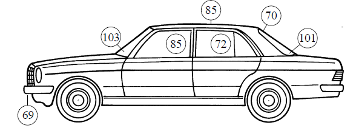

 
    Bild aus H. Schürrmann "Konstruieren mit Faser-Kunststoff-Verbunden"

---

## Glasübergangsbereich

**Zwei Zustandsbereiche:**
- **Energieelastisch** (T < T$_{g}$): glasartig, spröde
- **Entropieelastisch** (T > T$_{g}$): gummielastisch

**Änderungen bei T$_{g}$:**
- Steifigkeit (E, G) sinkt stark
- Festigkeit R sinkt
- Bruchdehnung ε steigt stark
- Wärmeausdehnungskoeffizient α steigt
- Maximale mechanische Dämpfung

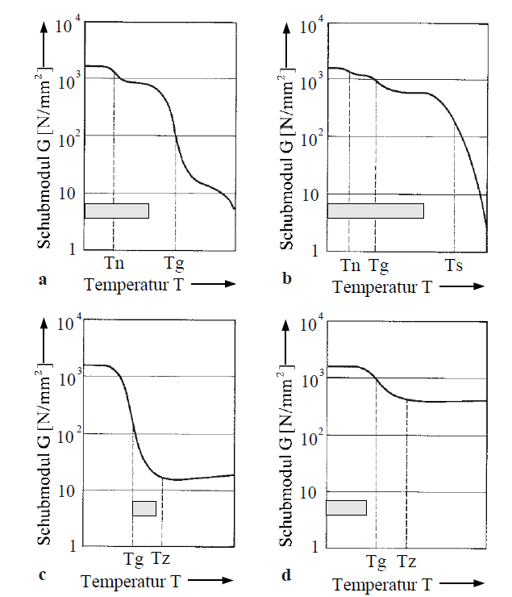

 
    Bild aus H. Schürrmann "Konstruieren mit Faser-Kunststoff-Verbunden"

---

## Bestimmung von T$_{g}$

**Zwei praktische Methoden:**

1. **T$_{g_{2\%}}$:** 2% Steifigkeitsabfall toleriert
2. **T$_{g_{Onset}}$:** Extrapolierter Beginn des Steilabfalls

**Auslegungsregel:**
$$T_{g,Onset} \approx T_{Einsatz,max} + 10...20°C$$

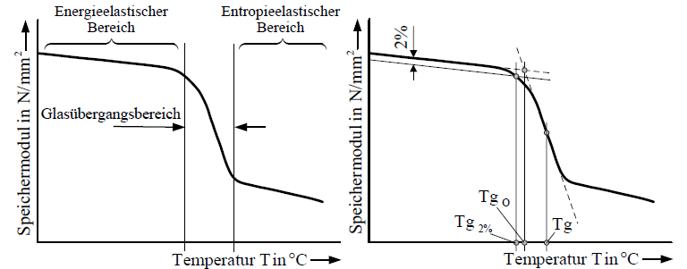

 
    Bild aus H. Schürrmann "Konstruieren mit Faser-Kunststoff-Verbunden"

---

## Wassereinfluss auf T$_{g}$

**Kritischer Effekt:**
- Feuchte senkt T$_{g}$ drastisch
- Bei niedrig-T$_{g}$-Harzen: bis -40°C
- Bei hoch-T$_{g}$-Harzen: bis -90°C

**Wichtig:**
- Qualifikation am aufgefeuchteten Polymer!
- Konditionierung 
- Feuchte erhöht freies Volumen

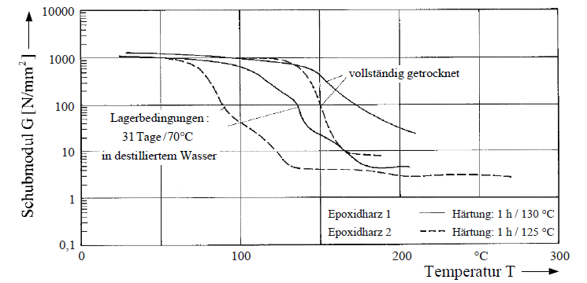

 
    Bild aus H. Schürrmann "Konstruieren mit Faser-Kunststoff-Verbunden"

---

## Bedeutung für Nachhärtung

**Temperung/Nachhärtung:**
- Oberhalb T$_{g}$ möglich
- Molekülumlagerungen leicht
- Maximaler Vernetzungsgrad angestrebt
- T$_{g}$ wächst während Nachhärtung

**Tempern wichtig für:**
- Maximale Vernetzung
- Maximale thermische Beanspruchbarkeit
- Optimale Chemikalienbeständigkeit

---

## Messverfahren für T$_{g}$

**1. DSC/DTA (Kalorimetrisch):**
- Spezifische Wärme cp
- 1-30 mg Probenmenge
- Schnell und einfach

**2. Dilatometer:**
- Thermischer Ausdehnungskoeffizient α
- Problem: Überlagerung durch Quellung/Schrumpf

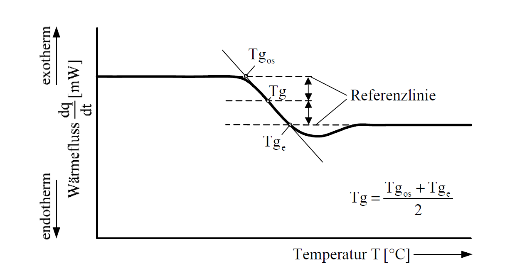

 
    Bild aus H. Schürrmann "Konstruieren mit Faser-Kunststoff-Verbunden"

---

**3. DMA (Dynamisch-mechanisch):**
- Torsionsschwingversuch
- G-T-Kurve und Dämpfung
- **Wichtigstes Verfahren!**

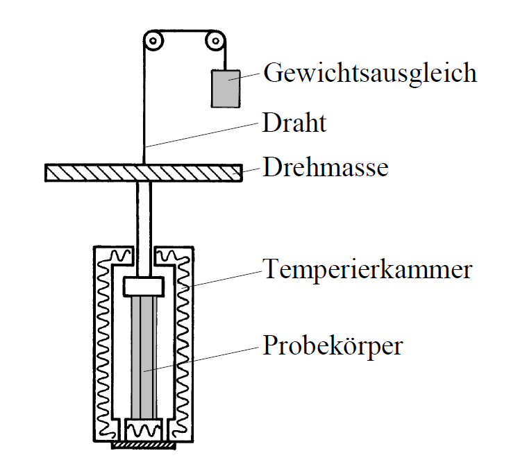

 
    Bild aus H. Schürrmann "Konstruieren mit Faser-Kunststoff-Verbunden"

---

**Wärmeformbeständigkeit:**
- Martens-Temperatur
- Heat Deflection Test (HDT)
- Vicat-Temperatur

**Prinzip:** Beschleunigte Kriechversuche

**Wichtig:** Übertragung der Ergebnisse nur bei ähnlichen Temperaturhöhen, Einwirkdauern und Spannungen

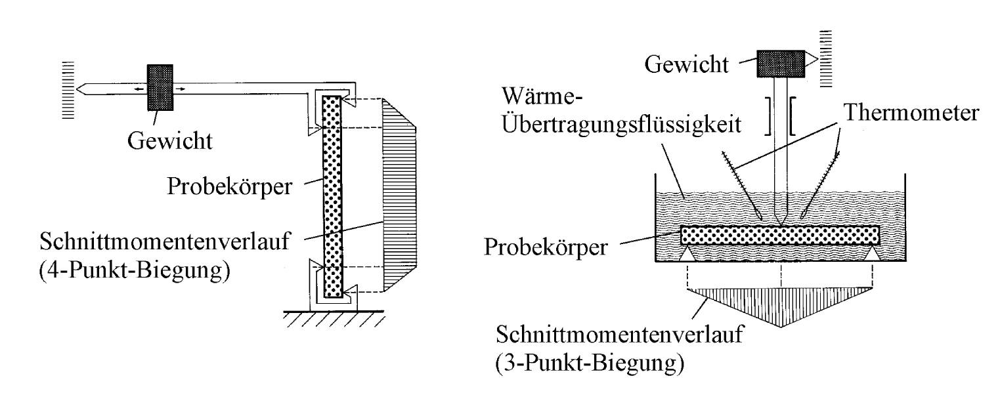

 
    Bild aus H. Schürrmann "Konstruieren mit Faser-Kunststoff-Verbunden"

---

## Belastbarkeit T > T$_{g}$

**Zugbelastung:** Auch oberhalb T$_{g}$ tragfähig
- Höhere Bruchdehnungen als bei 23°C
- Modellierung als reines Fasernetz (Netztheorie $\rightarrow$ Vorlesung Auslegung von Faserverbunden)

**Druckbelastung:** Kritisch!
- Niedrige Matrixsteifigkeit
- Unzureichende Faserstützung
- Frühzeitiges Faserknicken

$$R_{\perp\parallel}^- \propto G_m$$
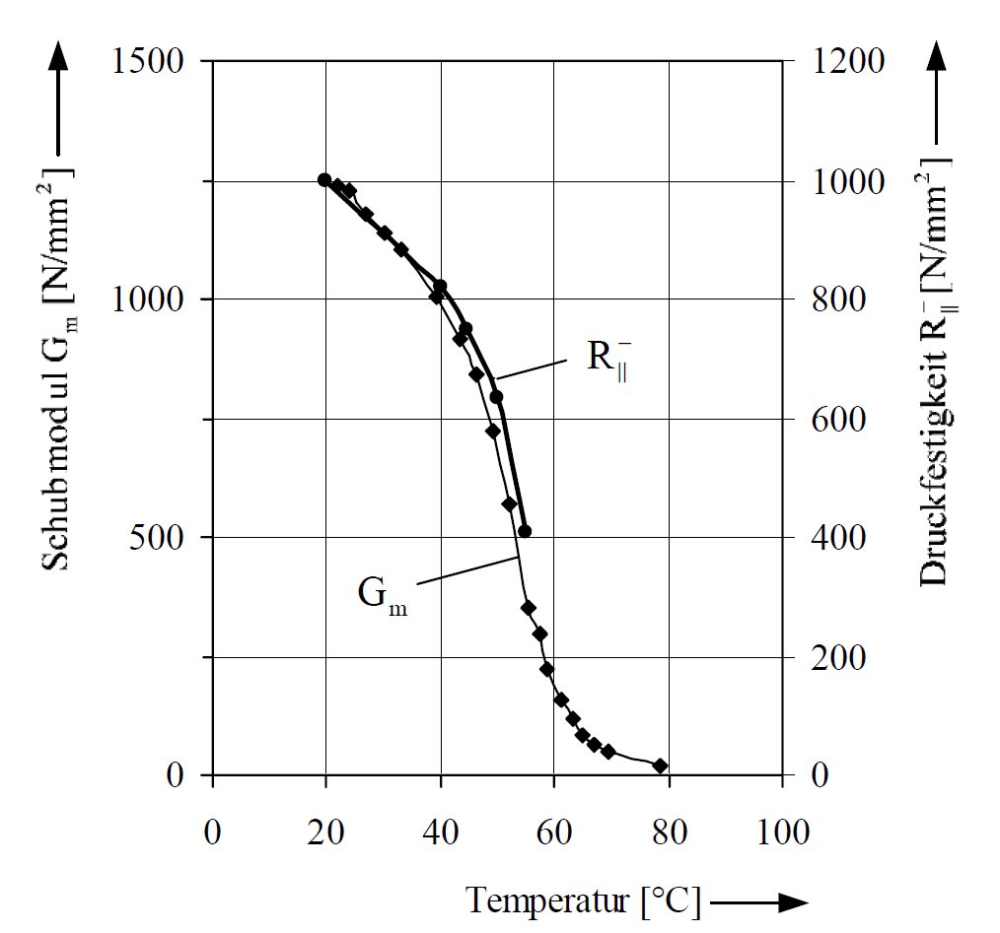

---

## Tiefe Temperaturen

**Günstig:**
- Steifigkeit und Festigkeit steigen
- Bei Duroplasten: ohnehin spröde, daher unkritisch
- Bei faserverstärkten Laminaten: quasi-plastisch

**Ungünstig:**
- Bei Thermoplasten: Verlust der Duktilität
- Versprödung
- Schlagzähigkeit sinkt

**Für Flugzeuge:** Nachweis bei tiefen Temperaturen notwendig

---

# Fertigungsanforderungen

**Wichtige Eigenschaften:**

1. **Fasertränkung** (Viskosität)
2. **Verarbeitungszeit** (Topfzeit/Gelierzeit)
3. **Härtungstemperatur und -zeit**
4. **Lagerzeit und -bedingungen**
5. **Arbeitsschutz und Toxizität**

---

## Fasertränkung

Entscheidend ist die **Viskosität**

**Für schnelle Tränkung:**
- Niedrige Viskosität
- Niedrige Tränkdrücke möglich
- Weite Tränkwege möglich
- Höherer Faservolumengehalt
    - kleinere Zwischenräume können befüllt werden
    - Widerstand gegen fließen ist geringer, d.h. die Aushärtung findet nicht ''auf dem Weg'' statt

---

**Viskositätssenkung:**
- Temperaturerhöhung (typisch)
- Maschinelle Verfahren

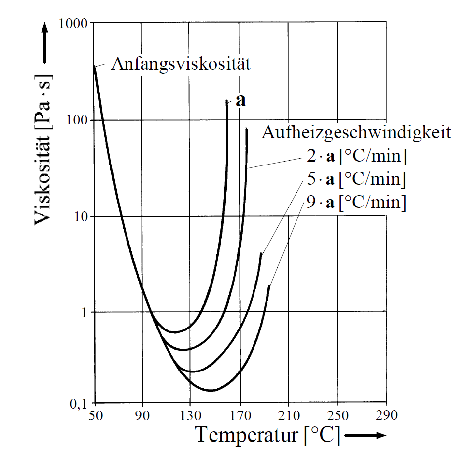

 
    Bild aus H. Schürrmann "Konstruieren mit Faser-Kunststoff-Verbunden"

---

## Tränkungsqualität

**Ziel:** Lufteinschlüsse vermeiden!

**Luftporen reduzieren Festigkeit:**
- Keine Kraftübertragung Faser-Matrix
- Kerben mit Spannungsspitzen
- Ausgangspunkt für Risswachstum

**Maßnahmen:**
- Vakuum ziehen
- Fließhilfen
- richtige Planung der Harzeinleitung

---

##  Lagerung

**Reaktionsharze:**
- Lagerzeit ca. 6 Monate
- Gefahrstofflager erforderlich
- FIFO-Prinzip
- Luftdicht verschließen
- Temperatur 15-25°C einhalten
- Typenvielfalt begrenzen!

---

**Thermoplaste:**
- Nahezu unbegrenzt lagerbar
- Sauber und trocken
- PA vor Verarbeitung trocknen

---

## Topfzeit und Gelierzeit

**Topfzeit:**
- Verarbeitungszeit nach Härterzugabe
- Abhängig von Temperatur
- Sommer: kürzere Topfzeit
- Niemals angeliertes Harz verarbeiten!

**Gelierzeit:**
- Viskosität steigt schlagartig
- Weiches Gel entsteht

**Wichtig:** Keine Bewegung während Gelierung!

---

## Nachhärten/Tempern

**Ziele:**
- Maximaler Vernetzungsgrad
- Maximale T$_{g}$
- Beste Chemikalienbeständigkeit
- Beste Alterungsbeständigkeit
- T$_{Lagerung}$ = 20 °C ; Nachhärtung T = 60−80 °C
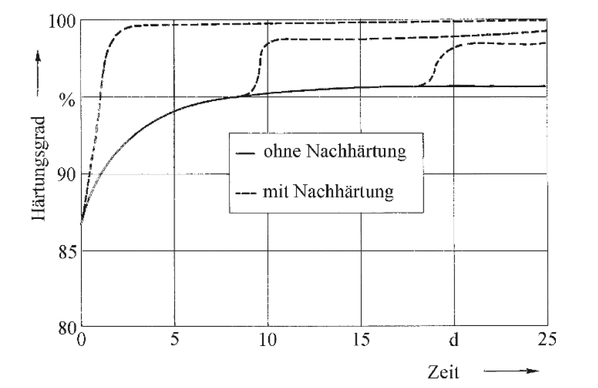

 
    Bild aus H. Schürrmann "Konstruieren mit Faser-Kunststoff-Verbunden"

---

**Regeln:**
- Nach abgeschlossener Gelierung
- Vorsichtiger Umgang vor Temperung
- Langsame Aufheizung
- Zeitnahe Temperung empfohlen
- Bei Sandwich: Thermoelement-Kontrolle

 
    Bild aus H. Schürrmann "Konstruieren mit Faser-Kunststoff-Verbunden"

---

## Arbeitsschutz

**Fasern:**
- Durchmesser 5-27 μm: nicht lungengängig; **außer wenn FKV gesägt werden**
- Mechanische Hautreizung möglich
- Einfache Schutzmaßnahmen ausreichend
- Keine erhöhte Krebshäufigkeit (Studien)

**UP-Harze:**
- Styrol-Emission: ~100g/m²·h bei 20°C
- Absaugung erforderlich
- Umweltharze mit Hautbildner

---

## Arbeitsschutz - EP-Harze

**Epoxidharze:**
- Bisphenol A/F: geringe Reizwirkung
- Sensibilisatoren!
- Niedermolekulare Typen kritisch

**Härter:**
- Aliphatische Amine: starke Reizstoffe
- Aromatische Amine: Organschäden möglich
- Anhydridhärter: Dämpfe >100°C

**Wichtig:** Sicherheitsdatenblätter studieren!

---

## Persönlicher Schutz

**Mindestregeln:**

- Schutzbrille tragen
- Orale Aufnahme vermeiden
- Hautkontakt vermeiden (Handschuhe!)
- Dämpfe nicht einatmen (Absaugung!)
- Staubschutzmaske bei Füllstoffen
- Nassbearbeitung bevorzugen
- Rauchen verboten
- Peroxide nie mit Beschleunigern mischen!

---

# Harzsysteme
## Ungesättigte Polyesterharze (UP)
## Epoxidharze (EP)

---

**UP-Harze - Allgemeines:**
- Mengenmäßig am häufigsten in FKV angewendet
- Polykondensation aus Dicarbonsäuren + Alkoholen
- Lösung in Monostyrol (~35-43%)
- Volumenschrumpf: 5-8% $\rightarrow$ ''Spring in''  + Verzug des Bauteils

**Anwendungen:**
- Boots- und Flugzeugbau
- Rohr- und Behälterbau
- Verkleidungsteile
- Polymerbeton

---

## UP-Harze - Eigenschaften

**Vorteile:**
- Sehr preisgünstig
- Gute Chemikalienbeständigkeit
- Variable Verarbeitungszeiten
- Rasche Härtung möglich
- Geringe Wasseraufnahme
- Breite Typenvielfalt

---

**Nachteile:**
- Mechanische Eigenschaften schlechter als EP
- Höherer Schrumpf als EP
- Greift PS- und PVC-Schäume an
- Oft inkompatibel mit C-Faser-Schlichte

---

## UP-Härte: Heißhärtung

**Peroxide als Härter:**
- Anspringtemperaturen:
  - Benzoylperoxid (BP): 70°C
  - MEKP: 80°C
  - CHP: 90°C
  - TBPB: 90°C
  - CUHP: 100°C

**Härtung:** T_Härtung ≈ T_Anspring + 20°C

**Faustregel:** +10°C → Reaktion 2× schneller

---

## UP-Härtung: Kalthärtung

**Standard-Rezepturen (20°C):**

**System 1 (Kobalt):**
- 100g Harz
- 2g MEKP-Härter
- 0,2ml Kobalt-Beschleuniger (1%)

**System 2 (Amin):**
- 100g Harz
- 3g BP-Paste
- 1ml Diethylanilin (10%)

**WARNUNG:** Peroxid und Beschleuniger nie direkt mischen!

---

## Vergleich Härtersysteme

**Ketonperoxid/Kobalt:**
- Langsamere Härtung
- Geringere Eigenspannungen
- Weniger Verzug
- Geringeres Vergilben
- Für Deckschichten bevorzugt
- T > 16°C erforderlich

---

**Benzoylperoxid/Amin:**
- Reaktiver
- Härtung bis 0°C
- Höhere Eigenspannungen
- Neigung zum Vergilben
- Geringerer Endhärtungsgrad

---

## UP-Harze - Oberflächenprobleme

**Problem:** Klebrige Oberfläche
- Styrol verdunstet oberflächennah
- Festigkeitsverlust

**Lösungen:**
1. Folienabdeckung
2. Geschlossene Verfahren (RTM)
3. Hautbildner (0,1% Paraffin)
4. Pudern mit Talkum
5. Lufttrocknende UP-Harze

**Lichthärtung:** Alternative Methode mit UV-Initiatoren

---

- UV-Initiatoren kann genutzt werden, in Fibre Placement Anlagen
- Härtung findet teilweise bei der Ablage der Fasern statt

---

## UP-Harze - Nachhärtung

**Empfohlen:**
- Nach abgeschlossener Kalthärtung
- T = 60-80°C, mehrere Stunden
- Besonders bei Kobalt-Beschleunigern

**Stufenhärtung (optimal):**
1. Kalthärtung mit Peroxid 1
2. Nachhärtung mit Peroxid 2 (höherer T_Anspring)

**Kontrolle:** Rest-Styrolgehalt oder DSC

---

## Epoxidharze

**EP-Harze - Allgemeines:**
- Standard für Hochleistungs-FKV
- Luft- und Raumfahrt, SporT$_{g}$eräte
- Basis: Bisphenol A
- Polyaddition (Härter eingebaut)
- Gelierung ab 50-70% Umsatz
- Volumenschrumpf: 2-5%

---

**Härtermechanismus:**
- Gelierung spät → Schrumpf in flüssiger Phase
- Nachfließen möglich
- Bessere Faser-Matrix-Haftung als UP

---

## EP-Harze - Typen

**Kalthärter (20°C):**
- Handlaminat
- Boots- und Sportflugzeugbau
- T$_{g}$ = 60-80°C
- Niedrige thermische Eigenspannungen

**Warmhärter (>80°C):**
- Höhere mechanische Festigkeiten
- Höhere T$_{g}$
- Bessere Chemikalienbeständigkeit
- Höhere thermische Eigenspannungen
- Oft zähmodifiziert (Flugzeugbau)

---

## EP-Harze - Eigenschaften

**Vorteile:**
- Geringe Reaktionsschwindung
- Maßgenau
- Ausgezeichnete Klebkraft
- Sehr gute Ermüdungsfestigkeit
- Exzellente elektrische Isolation

**Nachteile:**
- Teurer als UP-Harze
- Oft längere Härtungszeiten
- Stöchiometrisches Mischen erforderlich

---

## EP-Harze - Verarbeitung

- Stöchiometrisches Harz-Härter-Verhältnis!
- Sorgfältiges, langes Mischen
- Maschineller Rührer empfohlen
- Temperaturerhöhung nach Tränkung

**Exothermie beachten:**
- Bei großen Harzansätzen
- Wärmestau möglich
- Rauchentwicklung/Zersetzung
- Lösung: flache Gefäße, dünne Schichten

**Nachhärten:** Noch wichtiger als bei UP!

---

## Vinylesterharze

**VE-Harze - Position:**
- Zwischen UP und EP
- Basis: EP-Harze + Monocarbonsäuren
- Härtung wie UP-Harze

**Eigenschaften:**
- Zäher als UP
- Bessere Faser-Matrix-Haftung als UP
- Ausgezeichnete Chemikalienbeständigkeit

---

**Anwendungen:**
- Schwingend/schlagbeanspruchte Bauteile
- Rohr- und Chemieanlagenbau
- Kosteneffizienter EP-Ersatz

---

## Thermoplastische Matrices

**Probleme:**
- Hohe Schmelzviskosität (Faktor 100-200 vs. Duroplaste)
- Tränkung nur mit hohem Druck/Scherung
- Hohe Verarbeitungstemperaturen
- Höhere Kriechneigung
- Stützwirkung bei Faserdruck kritisch
- Amorphe: ungenügende Lösungsmittelbeständigkeit

---

## Thermoplaste - Vorteile

**Chancen:**
- Deutlich höhere Schlagzähigkeit
- Unbegrenzte Lagerzeiten
- Einfache Arbeitshygiene
- Nachträgliches Umformen möglich
- **Schweißbar** (induktiv, Ultraschall, Laser)
- **Vollständiges Recycling möglich!**

**Wichtigste Matrices:**
PP, PBT, PET, PA (Tab. 4.4, 4.5, 4.6)
Hochtemperatur: PPS, PEEK, PSU, PEI

---

## Thermoplaste - Daten Übersicht

| Polymer | E [N/mm²] | Rm [N/mm²] | ε [-] |
|---------|-----------|------------|-------|
| PP | 1140-1550 | 31-40 | 1-6 |
| PA 6.6 | 1600-3700 | 75-94 | 0,15-0,6 |
| PEEK | 3100-3800 | 92-103 | 0,11-0,5 |

| Polymer | T$_{g}$ [°C] | Ts [°C] | HDT [°C] |
|---------|---------|---------|----------|
| PP | -27 | 163-176 | 45-120 |
| PA 6.6 | 47-80 | 265 | 190-240 |
| PEEK | 140-145 | 340 | 152 |

---

## Vielen Dank für Ihre Aufmerksamkeit!

**Kontakt:**
Prof. Dr.-Ing. Christian Willberg
Hochschule Magdeburg-Stendal

---

## Vielen Dank für Ihre Aufmerksamkeit!

**Kontakt:**
Prof. Dr.-Ing. Christian Willberg
Hochschule Magdeburg-Stendal