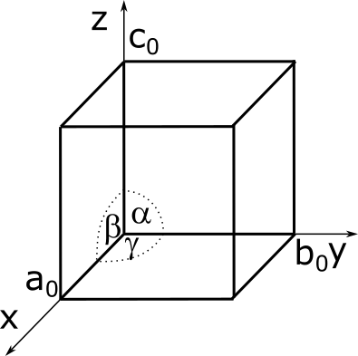
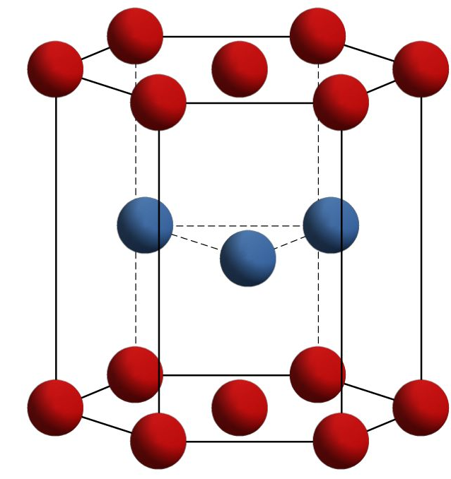

##  Grundlagen - Werkstofftechnik
Prof. Dr.-Ing.  Christian Willberg
Hochschule Magdeburg-Stendal

Kontakt: christian.willberg@h2.de
Teile des Skripts sind von \
Prof. Dr.-Ing. Jürgen Häberle übernommen

 
    <a href="https://doi.org/10.1007/s42102-021-00079-6" style="color: blue;">Bildreferenz</a>

---

<!--paginate: true-->

## Vorlesung

**Rahmen**

- Essen oder Trinken sind okay, aber leise
- Probleme bei der Kinderbetreuung
- Alles verbleibt in Raum!
- Fragen

---

## Inhalte nach Modulhandbuch

- Einteilung von Werkstoffen
- Werkstoffstruktur, Gefüge, Legierungen, Gitterbaufehler
- ideale und reale Zustandsdiagramme, Gleichgewichts- und
Ungleichgewichtszustände
- Wärmebehandlung, Härteverfahren
- Labor: Zugversuch, Härteprüfung
---

## Werkstoffe

Was sind Werkstoffe?

[Werkstoffe im engeren Sinne nennt man Materialien im festen Aggregatzustand, aus denen Bauteile und Konstruktionen hergestellt werden können.](https://de.wikipedia.org/wiki/Werkstoff)

---
## Anwendunggebiete mit Bildern

- Metalle
  - Eisen Stahl
  - Nicht Eisen
- Kunststoffe
- Keramiken
- Verbundwerkstoffe

---

## Gußeisen - Stahl

---

## Nicht Eisen Metalle

- Kupfer ist ein sehr guter elektrischer und thermischer Leiter

---

- Magnesium findet im Leichtbau Anwendung 
- Titan und Titanlegierungen 
    - hohe Festigkeit und Warmfestigkeit
    - Korrosionsbeständig
- Nickel
    - Korrosionsbeständigkeit
    - hohe Warmfestigkeit

---

## Keramiken

---

## Gläser

---

## Faserverbundwerkstoffe

---

# Struktur von Werkstoffen

---

-	Atomistische Struktur (Art der atomaren Bausteine)
-	Feinstruktur (Bindungen zwischen den atomaren Bausteinen und deren geometrische An-ordnung)
-	Mikrostruktur (Gefüge – Bereiche geometrischer Anordnung, die im Werkstoffinnern durch Grenzflächen voneinander getrennt sind)
-	Makrostruktur (Grobstruktur – Gesamterscheinung eines Werkstoffes bei der Herstellung und dem Einsatz eines Bauteils)

---

# Bindungen

## Hauptvalenzbindungen  
**Primärbindungen - hohe Bindungsenergie, starke Bindung**
-	Ionen- bzw. heteropolare Bindung 
-	Atom- bzw. homöopolare (oder kovalente) Bindung: polar (O-H) und unpolar (C-C, C-H)
-	Metallische Bindung

---

## Metallische Bindung

- Außenelektronen (Valenzelektronen) sind nur schwach gebunden 
- es bildet sich ein Gitter (periodisch angeordneten) positiver geladener Metallionen (Atomrümpfen)
- Außenelektronen  können sich innerhalb des Gitters nahezu frei bewegen, sogennantes **Elektronengas** 
- bewirkt: gute elektrische Leitfähigkeit + hohe Wärmeleitfähigkeit

---

---
## Relevante Gößen

**Ordnungszahl**
Zahl der Protonen im Kern
**Atommasse**
bestimmt die Masse des Elements
 Masse des Werkstoffs ist eine Kombination aus Atommasse und Dichte
**Elektronegativiät**
bestimmt ob Atome abgegeben oder aufgenommen werden in einer Bindung
metallische Bindungen eher links
kovalente Bindungen eher rechts

---

## Neben- oder Restvalenzbindungen 
**Sekundärbindungen - geringe Bindungsenergie, schwache Bindung**
-	van der Waals-Bindung: zwischenmolekulare Kräfte
-	Wasserstoffbrückenbindung: zwei Moleküle oder zwei geeignet weit voneinander getrennte Abschnitte eines Makromoleküls treten über Wasserstoffatome in Wechselwirkung 
- die Bindungsenergien sind ein bis zwei Zehnerpotenzen kleiner als die der Atombindungen.

---

| **Bezeichnung** | **Ionenbindung oder heteropolare Bindung** | **Atombindung homöopolare (kovalente) Bindung** | **Metallische Bindung** |
|-----------------|---------------------------------|-------------------------------------------------|--------------------------|
| **Beteiligte Bausteine** | Ionen (Metall + Nichtmetall) | Gleiche Atomart (Nichtmetall + Nichtmetall) | Gleiche Atomart (Metall + Metall) |
| **Beschreibung des elektrischen Lade-zustandes** | Positiv geladenes Ion + negativ geladenes Ion (Kation + Anion) | Atome besitzen ein oder mehrere gemeinsame Elektronenpaare, um die Edelgaskonfiguration zu erreichen | Atome geben ihre Außenelektronen an den Gesamtverband ab. Elektronen bewegen sich dort frei im Atomgitter |
---

| **Bezeichnung** | **Ionenbindung oder heteropolare Bindung** | **Atombindung homöopolare (kovalente) Bindung** | **Metallische Bindung** |
|-----------------|---------------------------------|-------------------------------------------------|--------------------------|
| **Von den Bindungs-kräften abhängige Werkstoff-eigenschaften** | Im gelösten Zustand elektrisch leitfähig, kristalline Gefügestruktur | Geringe elektrische und thermische Leitfähigkeit; hoher Schmelzpunkt | Sehr gute elektrische und thermische Leitfähigkeit und Duktilität; eingeschränkte chemische Beständigkeit |
| **Beispiele** | Alkalimetallverbindungen, Halogenverbindungen (z.B. NaCl, MgO) | Diamant, Methan (CH₄) (unpolar), Methanol (CH₃OH) (polar) | Kupfer (Cu), Aluminium (Al), Eisen (Fe) |

---

## Atomistische Struktur

Besteht aus
- Kern (Protonen + Neutronen) der die Masse definiert
- Hülle (Elektronen) mit verschieden Schalen, welche chemischen und viele physikalische Eigeschaften definiert

---

- Aufenthaltswahrscheinlichkeit der Elektronen sorgt für Abstoßung und Anziehung
- als Elastizität oder Wärmedehnung makroskopisch zu erkennen

---

---

### Feinstruktur
- Kristallstrukturen
- Molekülstrukturen
- Glasig-amorphe Strukturen
- Realstruktur

---
## Raumgitter

- entsteht durch die dreidimensional-periodische Verschiebung seiner Bausteine
- charakterisiert durch drei Raumachsen x, y und z liegenden Winkel α, β, γ die Abstände auf den Achsen das jeweilige Raumgitter
- a0, b0 und c0  (Gitterkonstanten) -> Einheitszelle

---

| Kristallsystem   | Gitterkonstanten      | Winkel        | Beispiele                                                 |
|------------------|-----------------------|------------------------------------|-----------------------------------------------------------|
| triklin          | a₀ ≠ b₀ ≠ c₀          | α ≠ β ≠ γ ≠ 90°                    | Silikat-Minerale                                           |
| monoklin         | a₀ ≠ b₀ ≠ c₀          | α = γ = 90°; β ≠ 90°               | Mo₂S₃; β-Pu                                                |
| (ortho)rhombisch | a₀ ≠ b₀ ≠ c₀          | α = β = γ = 90°                    | U, S, P, Ga, γ-Sn                                          |
| rhomboedrisch    | a₀ = b₀ = c₀          | α = β = γ ≠ 90°                    | As, Hg, Sb                                                 |
| hexagonal        | a₀ = b₀ ≠ c₀          | α = β = 90°; γ = 120°              | α-Ti, Mg, Zn                                               |
| tetragonal       | a₀ = b₀ ≠ c₀          | α = β = γ = 90°                    | B, CuTi₃, Sn (T > 13,5°)                                   |

---

## Häufigste Gitterformen bei Metallen

| Kristallsystem   | Gitterkonstanten      | Winkel        | Beispiele                                                 |
|------------------|-----------------------|------------------------------------|-----------------------------------------------------------|
| kubisch          | a₀ = b₀ = c₀          | α = β = γ = 90°                    | Cu, Al, Ni, Au, Ag; γ-Eisen (kfz); α-Eisen, V, Cr, W (krz); Mn, Po (kp) |

---

Kubisch flächenzentriert (kfz)

Kubisch raumzentriert (krz)

Hexagonal dichteste Packung (hpd)

---

## Einflüsse

-	Korrosion: Angriff aggressiver Medien erfolgt an bevorzugten Ebenen
-	Verformung: Plastische Verformung erfolgt entlang bevorzugter kristallografischer Ebenen und Richtungen → Gleitsysteme
-	Ultraschall: Verwendung von Schwingquarzen mit speziellen kristallografischen Begrenzungsflächen
-	Leitfähigkeit:	Verwendung von Germanium- oder Silizium-Wafern in (1 1 1)- oder (1 0 0) - Orientierung für Halbleiterelemente
-	Magnetisierung: leichteste Magnetisierung von Eisen-Silizium-Transformatorenblechen ent-lang der Würfelkante [1 0 0]

---

## Polymorphie bei Metallen

- Polymorphie: ist die Ausbildung von verschiedenen Gitterstrukturen in Abhängigkeit von der Temperatur
- die verschiedenen Gitterformen sind die allotropen Modifikationen 

(auch: Polymorphie des Kohlenstoffs: Graphit, Diamant,…).

---

## Bestimmung der Umwandlungspunkte

_Dilatometrie_
- Messung der Längenänderung aufgrund der Gitterumwandlung

_Thermische Analyse_
- Aufzeichnung des Temperaturverlaufs
- Gitterwandlungen (Phasenänderungen) brauchen Wärmeenergie oder geben sie ab
- Halte- bzw. Knickpunkte in den Erwärmungs- oder Abkühlungskurven.

- Haltepunkte: bei reinen Metallen

---

---

## Molekülstrukturen

- typisch für nichtmetallisch-organische Werkstoffe
  - natürliche Materialien: Holz, Kautschuk, Leder, Fasern usw.
  - synthetische Kunststoffe: PMMA, Epoxid, usw.

---

- entsteht durch Aufbaureaktionen von monomeren Grundbausteine zu Kettenmolekülen
- innerhalb der Ketten treten Atombindungen auf
- zwischen den Ketten existieren Nebenvalenzbindungen und Molekülverhakungen

---

## Aufbaureaktion (Polymerisation)

- Es müssen freie Bindungen in den Monomeren erzeugt werden
- die Monomere "brauchen" neue Partner, um wieder energetisches Minimum zu erreichen

---

## Kettenpolymerisationen

  - Aufspalten von C=C-Doppelbindungen im Monomer (katalytischer Prozess durch Druck, Temperatur, Katalysator)
  - Verbindung der aufgespaltenen Monomere zu Makromolekülen

---

## Stufenwachstumsreaktionen 

**Polykondensation**
- Abspaltung niedermolekulare (z.B. H2O) Reaktionsprodukte durch eine chemische Reaktion schafft frei Bindungen
- schrittweise Reaktion oder Unterbrechung führen zur Bildung von linearen, verzweigten oder vernetzten Polymeren (Thermoplaste, Elastomere oder Duromere)  

---

**Polyaddition**
- freie Bindungen entstehen durch Umlagerungen von Doppelbindungen zweier unterschiedlicher Monomermoleküle
- diese bilden dann Molekülketten

---

## Glasig-amorphe Strukturen

- Gläser sind ein nichtmetallisch-anorganisches, vorzugsweise silikatisches Schmelzprodukte
- nichtkristallinen, also amorphen Zustand
- bei Glas, wird die Schmelze zunächst unterkühlt und dann unterhalb der Transformations- temperatur Tg „eingefroren“. 

---

# Materialeigenschaften
- Eigenschaften werden maßgeblich durch die Mikrostruktur und Elektronen (äußere Schale) beeinflusst

**Eigenarbeit**
- Wärmedehnung
- elektrische Leitfähigkeit
- Wärmeleitfäigkeit

---

## Referencen

Rainer Schwab: Werkstoffkunde und Werkstoffprüfung für Dummies, 2019; ISBN-10 352771538X

