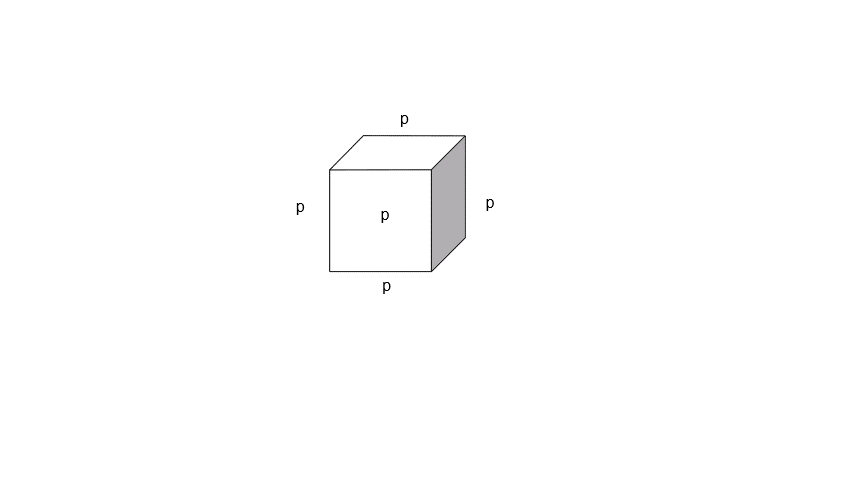

##  Grundlagen - Werkstofftechnik
Prof. Dr.-Ing.  Christian Willberg 
Hochschule Magdeburg-Stendal

Kontakt: christian.willberg@h2.de
Teile des Skripts sind von \
Prof. Dr.-Ing. Jürgen Häberle übernommen

 
    <a href="https://doi.org/10.1007/s42102-021-00079-6" style="color: blue;">Bildreferenz</a>

---

<!--paginate: true-->

## Vorlesung

**Rahmen**

- Essen oder Trinken sind okay, aber leise
- Probleme:
    - bei der Kinderbetreuung
    - Nachteilsausgleich
    - Diskriminierung
    - sprachlich
    - ...
- Fragen

---
## Organisation
- [2 Praktika](https://moodle2.hs-magdeburg.de/moodle/course/view.php?id=4605)
    - Zugprüfung
    - Härteprüfung
    - Teilnahme ist Zulassungsvorraussetzung zur Prüfung
- Prüfung 40 Minuten
- Fragen per E Mail; Konsultationen bei Bedarf

---

## Inhalte nach Modulhandbuch

- Einteilung von Werkstoffen
- Materialeigenschaften
- Werkstoffstruktur, Gefüge, Legierungen, Gitterbaufehler
- ideale und reale Zustandsdiagramme, Gleichgewichts- und
Ungleichgewichtszustände
- Wärmebehandlung, Härteverfahren
- Labor: Zugversuch, Härteprüfung
---

## Werkstoffe

Was sind Werkstoffe?

[Werkstoffe im engeren Sinne nennt man Materialien im festen Aggregatzustand, aus denen Bauteile und Konstruktionen hergestellt werden können.](https://de.wikipedia.org/wiki/Werkstoff)

---
## Anwendunggebiete

- Metalle
  - Eisen, Stahl, Gusseisen
  - Nicht Eisen
- Kunststoffe
- Keramiken
- Verbundwerkstoffe

---

## Gußeisen - Stahl

---

## Nicht Eisen Metalle

- Kupfer ist ein sehr guter elektrischer und thermischer Leiter

---

- Magnesium findet im Leichtbau Anwendung 
- Titan und Titanlegierungen 
    - hohe Festigkeit und Warmfestigkeit
    - Korrosionsbeständig
- Nickel
    - Korrosionsbeständigkeit
    - hohe Warmfestigkeit

---

## Keramiken

---

## Gläser

---

## Faserverbundwerkstoffe

---

# Mechanische Eigenschaften
Was sind wichtige Eigenschaften aus Sicht einer Ingenieurin / eines Ingenieurs?

---

# Mechanische Eigenschaften
Was sind wichtige Eigenschaften aus Sicht einer Ingenieurin / eines Ingenieurs?
- Materialverhalten ohne Schädigung
- Ermüdungsverhalten
- Verschleißverhalten
- Temperaturfestigkeit
- Festigkeit
- wann tritt eine Schädigung auf
- ...

---

## Konzept Spannung - Dehnung
- Detaliert in der technischen Mechanik
$\varepsilon$ - Dehnung
$\sigma$ - Mechanische Spannung

---

## Dehnungen 1D
$$\varepsilon = \frac{\Delta l}{l}$$

Beispiel:
$l_0 = 1m$
$l_1 = 1.01m$
$$\varepsilon = \frac{l_1-l_0}{l_0}=0.01\rightarrow 1\%$$

---
## Spannungen 1D

$$\sigma = \frac{F}{A}$$

Beispiel:
$F = 100N$
$A = 20mm^2$
$$\sigma = \frac{F}{A} = \frac{100 N}{20 mm^2} = 5 \frac{N}{mm^2}$$

---

# Mehr Dimensionalität

---

## Symmetrien
- isotropie
- transversale isotropie
- orthotropie
- ...
- anisotropie

<!---
- Diskussion; Eigenschaften können richtungsabhängig sein
- Praxisbeispiele
-->

---

## Mechanische Eigenschaften

- die **reversible** Verformung, bei der sofort bzw. eine bestimmte Zeit nach dem Einwirken der äußeren Belastung der verformte Werkstoff seine ursprüngliche Form zurückerhält: elastische und viskoelastische Verformung;

- die **irreversible (bleibende)** Verformung, bei der die Formänderung auch nach dem Einwirken der äußeren Belastung erhalten bleibt: plastische und viskose Verformung;

- der Bruch, d.h. eine durch Entstehen und Ausbreiten von Rissen bewirkte Trennung des Werkstoffes.

---
## Beispiel Stahl

[Kurvenbestimmung](https://youtu.be/WWAb7Q5DAYw?si=fcnLckvNurSh0LC5)

[Datenblatt Stahl](https://www.stauberstahl.com/fileadmin/Downloads/werkstoffe/Werkstoff-1.2842-Datenblatt.pdf)

 
    <a href="https://commons.wikimedia.org/w/index.php?curid=89891144" style="color: blue;">By Nicoguaro - Own work, CC BY 4.0</a>

---
# Materialverhalten - reversibel
## Elastizität
- reversibel, energieerhaltend
- Hooksches Gesetz 1D
Normalspannung $\sigma = E\varepsilon$
Schubspannung $\tau = G\gamma$

---

## Grundlagen

- Normaldehnung [-]
$\varepsilon_{mechanisch} = \frac{l - l_0}{l_0}$

- Normalspannung $\left[\frac{N}{m^2}\right]$, $[Pa]$
$\sigma = \frac{F}{A}=E\varepsilon$
E - Elastizitätsmodul, Young's modulus $\left[\frac{N}{m^2}\right]$

- Relevant bspw. bei Verformungsanalysen

---

## Grundlagen - Querkontraktion

- Querkontraktionszahl [-]
- $\nu = -\frac{\varepsilon_y}{\varepsilon_x}$
für homogene Werkstoffe $0\leq\nu\leq 0.5$
für heterogene Werkstoffe sind anderen Konstellationen denkbar

- Relevant bspw. bei Pressverbindungen

---

## Grundlagen - Schub

- Schubdehnungen [-]
$\varepsilon = \frac12(\frac{u_x}{l_0}+\frac{u_y}{b_0})=\frac{\gamma}{2}$

- Schubspannung $\left[\frac{N}{m^2}\right]$, $[Pa]$
$\tau = \frac{F_s}{A}= G\gamma$

- Normal- und Schubspannungen sind nicht kompatibel; daher die Vergleichsspannungen 
- G - [Schub-](https://de.wikipedia.org/wiki/Kompressionsmodul#Umrechnung_zwischen_den_elastischen_Konstanten_isotroper_Festk%C3%B6rper)-, Gleitmodul, Shear modulus $\left[\frac{N}{m^2}\right]$
$G = \frac{E}{2(1+\nu)}$

- Relevant bspw. bei Torsion (Antriebsstränge, Drehfedern)

---

## Grundlagen - Kompression

$\sigma_h = p = -K \cdot \frac{\Delta V}{V_0}$

$\varepsilon_v = \frac{\Delta V}{V_0} = \varepsilon_1 + \varepsilon_2 + \varepsilon_3$

[Kompressionsmodul](https://de.wikipedia.org/wiki/Kompressionsmodul#Umrechnung_zwischen_den_elastischen_Konstanten_isotroper_Festk%C3%B6rper) $K = \frac{E}{3(1-2\nu)}$

- Relevant bspw. bei Hydrauliken

---

| Werkstoff                         | E [GPa]   | G [GPa] | ν [-]     |
|:----------------------------------|:----------|:--------|:----------|
| Stahl unlegiert                   | 200       | 77      | 0.30      |
| Titan                             | 110       | 40      | 0.36      |
| Kupfer                            | 120       | 45      | 0.35      |
| Aluminium                         | 70        | 26      | 0.34      |
| Magnesium                         | 45        | 17      | 0.27      |
| Wolfram                           | 360       | 130     | 0.35      |
| Gusseisen mit lamellarem Graphit  | 120       | 60      | 0.25      |
| Thermoplaste/Duromere             | 2-5       | 1-2     | ca. 0.35  |
| Elastomere                        | 0.1       | 0.03    | 0.45-0.49 |
| Sperrholz                         | 4-16      | -       | -         |

---

## Steifigkeiten

Wie Materialeigenschaften den Steifigkeiten zusammen?

- Material $\cdot$ Querschnitte = Steifigkeit
- Dehn-, Normalsteifigkeit = $EA$
- Biegesteifigkeit = $EI$
- Torsionssteifigkeit = $GI_P$

 
    <a href="https://doi.org/10.3390/en14092451" style="color: blue;">Bildreferenz</a>

---

## Viskoses Verhalten

- irreversibel
- zeitabhängig, dehnratenabhängig

Federmodel $\sigma = E\epsilon$ 
 - Elastischer Anteil
 - Dargestellt durch Federlemente

 
    

 
    

Dämpfer  $\sigma = \eta\dot{\epsilon}=\eta\frac{\partial \epsilon}{\partial t}$ 
- Viskoser Anteil
- Dargestellt durch Dämpferelemente

---
- schnelle Belastung -> Verhalten ist elastisch
- langsame Belastung -> Material fließt
- [schnelle Belastung](https://en.wikipedia.org/wiki/File:Sillyputty.ogv)

---

## Härte

Widerstand eines Werkstoffs gegen das Eindringen eines härteren Prüfkörpers

**Abhängigkeit von:**
- Bindungsart und Bindungsstärke
- Kristallstruktur
- Gefüge und Korngröße
- Legierungselemente
- Wärmebehandlung

**Bedeutung:**
- Verschleißbeständigkeit
- Bearbeitbarkeit

---

# Materialverhalten - irreversibel

---

## Festigkeit

[Die Festigkeit eines Werkstoffes beschreibt die Beanspruchbarkeit durch mechanische Belastungen, bevor es zu einem Versagen kommt, und wird angegeben als mechanische Spannung $\left[N/m^2\right]$. Das Versagen kann eine **unzulässige Verformung** sein, insbesondere eine **plastische (bleibende) Verformung** oder auch ein **Bruch**.](https://de.wikipedia.org/wiki/Festigkeit)

>Wichtig: Festigkeit $\neq$ Steifigkeit

---

## Plastizität

- [Schmieden](https://youtu.be/AxLszR6fkLM?si=k6A9aOVfQceOK9v0&t=80)
- [Walzen](https://www.youtube.com/watch?v=WOTO64HgnXc)

---

## Duktilität

### Brucheinschnürung

$$Z = \frac{A_0 - A_f}{A_0} \cdot 100\%$$

- A₀ = Ausgangsquerschnittsfläche [mm²]
- A_f = Querschnittsfläche bei Bruch [mm²]
- Z = Brucheinschnürung [%]

Die Brucheinschnürung beschreibt die **relative Querschnittsverringerung** eines Materials bei Zugbelastung bis zum Bruch.

---

## Duktilitätsbewertung

### Interpretation der Brucheinschnürung

| Z-Wert | Duktilität | Materialverhalten |
|--------|------------|-------------------|
| Z < 5% | Spröde | Keramiken, Gusseisen |
| 5% ≤ Z < 20% | Mäßig duktil | Hochfeste Stähle |
| 20% ≤ Z < 50% | Duktil | Baustähle |
| Z ≥ 50% | Sehr duktil | Reinkupfer, Aluminium |

---

## Bedeutung

**Hohe Brucheinschnürung (Z > 40%)** bedeutet:
- Material kann große plastische Verformungen ertragen
- Gute Umformbarkeit (Schmieden, Tiefziehen)
- Bruchwarnung durch sichtbare Einschnürung
- Hohe Energieabsorption vor dem Versagen

**Niedrige Brucheinschnürung (Z < 10%)** bedeutet:
- Sprödes Versagen ohne Vorwarnung
- Geringe Umformbarkeit
- Wenig Energieabsorption

---

## Zähigkeit (Brucharbeit)

**Wahre Dehnung und Spannung**

$$\varepsilon_{true} = \ln\left(\frac{L}{L_0}\right) = \ln(1 + \varepsilon_{nom})$$

$$\sigma_{true} = \sigma_{nom} \cdot (1 + \varepsilon_{nom}) = \frac{F}{A}$$

- F = Kraft
- A = aktuelle Querschnittsfläche

---

### Zähigkeit als Energieabsorption

$$U = \int_0^{\varepsilon_f} \sigma_{true} \, d\varepsilon_{true}$$

- U = spezifische Zähigkeit [J/m³]
- ε_f = Bruchdehnung

 
    <a href="https://commons.wikimedia.org/w/index.php?curid=89891144" style="color: blue;">By Nicoguaro - Own work, CC BY 4.0</a>

---

Ein zäher Werkstoff kombiniert:
- **Hohe Festigkeit** (σ) → widersteht hohen Spannungen
- **Hohe Duktilität** (ε) → verformt sich stark vor dem Bruch

**Zähigkeit = Überlebensfähigkeit eines Materials unter extremen Bedingungen**

---

## Zähigkeitswerte typischer Materialien

| Material | Zähigkeit [MJ/m³] | Charakteristik |
|----------|-------------------|----------------|
| Glas | 0.01 | Extrem spröde |
| Gusseisen | 1-3 | Spröde |
| Hochfester Stahl | 50-100 | Fest, mäßig duktil |
| Baustahl | 100-200 | Optimal zäh |
| Aluminium | 70-200 | Leicht und zäh |
| Kupfer | 200-400 | Sehr duktil |
| Gummi | 10-100 | Elastisch-duktil |

---

## Referencen

Rainer Schwab: Werkstoffkunde und Werkstoffprüfung für Dummies, 2019; ISBN-10 352771538X

