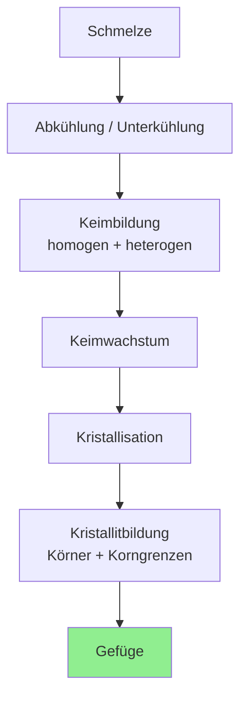

## Vorlesung Werkstofftechnik - Legierungsbildung
Prof. Dr.-Ing. Christian Willberg 

Kontakt: christian.willberg@h2.de
Teile des Skripts sind von Prof. Dr.-Ing. Jürgen Häberle übernommen

---

<!--paginate: true-->

# Inhalte

- **Grundbegriffe** der Legierungsbildung
- **Kristallbildung** und Gefügeentstehung
- **Zustandsdiagramme** und Phasen
- **Diffusion** und Massentransport

---

# Was ist eine Legierung?

## Legierung
- **Herkunft:** von lateinisch "ligare" = zusammenbinden, verbinden, vereinigen
- **Definition:** Gemisch aus mehreren Atomsorten (_Komponenten_) mit _metallischem Charakter_

## Komponenten können sein:
- **Metallisch:** Cu (Kupfer), Ni (Nickel), Fe (Eisen), Al (Aluminium)
- **Nicht-metallisch:** C (Kohlenstoff), P (Phosphor), S (Schwefel), N (Stickstoff), O (Sauerstoff)

<!-- 🖼️ BILD EINFÜGEN: Schematische Darstellung verschiedener Legierungstypen (z.B. Stahl, Bronze, Messing) -->

---

# Warum Legierungen?

**Vorteile gegenüber reinen Metallen:**
- Höhere Festigkeit
- Bessere Korrosionsbeständigkeit
- Verbesserte Verarbeitungseigenschaften
- Anpassbare mechanische Eigenschaften
- Wirtschaftlichkeit

**Beispiele aus dem Alltag:**
- Stahl (Fe + C)
- Bronze (Cu + Sn)
- Messing (Cu + Zn)

<!-- 🖼️ BILD EINFÜGEN: Alltagsgegenstände aus verschiedenen Legierungen -->

---

# Konzentration und Zusammensetzung

### 1. Massenanteil (Gewichtsprozent)
$$m_{rel} = \frac{m_1}{\sum_i m_i} \cdot 100 \text{ [\%]}$$

### 2. Atomanteil (Atomprozent)
$$n_{rel} = \frac{n_1}{\sum_i n_i} \cdot 100 \text{ [\%]}$$

---

# Wann sind beide Angaben gleich?

**Merke:**
- Wenn die Atommassen **ähnlich** sind → $m_{rel} \approx n_{rel}$
- Wenn die Atommassen **unterschiedlich** sind → $m_{rel} \neq n_{rel}$

**Beispiel:**
- Cu (63.54 u) und Ni (58.69 u) → ähnliche Massen
- Fe (55.85 u) und C (12.01 u) → sehr unterschiedliche Massen!

<!-- 🖼️ BILD EINFÜGEN: Vergleichsgrafik Massenanteil vs. Atomanteil -->

---

## Aufgabe

Eine Legierung mit 1 kg Gesamtmasse enthält:
- **25 Atom-% Ni**
- **75 Atom-% Cu**

**Fragen:**
1. Wie groß ist die Masse von Ni und Cu beim **Atomanteil**?
2. Wie groß wäre die Masse beim **Massenanteil** von 25% Ni und 75% Cu?

**Gegeben:**
- $A_{Cu} = 63.54$ u; $A_{Ni} = 58.69$ u; $u = 1.66 \times 10^{-27}$ kg

---

# Lösung - Teil 1: Massenanteil

🔍 Lösung anzeigen

Wenn **Massenanteil** gegeben ist (25% Ni, 75% Cu):

$$m_{Cu} = 0.75 \cdot 1\text{ kg} = 0.75\text{ kg}$$
$$m_{Ni} = 0.25 \cdot 1\text{ kg} = 0.25\text{ kg}$$

---

🔍 Lösung anzeigen

**Gegeben:** 25 Atom-% Ni, 75 Atom-% Cu, Gesamtmasse = 1 kg

$$m = n_{Cu} \cdot A_{Cu} + n_{Ni} \cdot A_{Ni}$$

$$m = (0.25 \cdot A_{Cu} + 0.75 \cdot A_{Ni}) \cdot n$$

$$n = \frac{m}{0.25 \cdot A_{Cu} + 0.75 \cdot A_{Ni}} = \frac{1\text{ kg}}{0.25 \cdot 63.54 + 0.75 \cdot 58.69} \cdot u$$
$$n = 1.00565 \times 10^{25} \text{ Atome}$$

$$m_{Cu} = n_{Cu} \cdot A_{Cu} = 0.2449\text{ kg}$$
$$m_{Ni} = n_{Ni} \cdot A_{Ni} = 0.7551\text{ kg}$$

---

# Was ist eine Phase?

**Allgemeine Definition:**
> Eine Phase ist ein chemisch und physikalisch **gleichartiger homogener Bestandteil** einer Legierung oder von Materie überhaupt.

## Bekannt aus Aggregatzuständen:
- Fest (s)
- Flüssig (l)
- Gasförmig (g)
- Plasmaförmig (p)

**Aber:** In Legierungen gibt es mehr als nur Aggregatzustände!

<!-- 🖼️ BILD EINFÜGEN: Phasendiagramm Wasser mit Fest/Flüssig/Gas -->

---

# Phasenbeispiele

## Einphasig
- Reines Aluminium
- Reines Eisen
- Flüssiges Wasser
- Wasserdampf

## Zweiphasig
- Nebel (Wasser + Luft)
- Eis in Wasser
- Übersättigte Lösungen
- Viele technische Legierungen

---

# Phasenänderungen

**1. Umwandlungen**
- Instabile Gittermodifikationen wandeln sich in stabile um
- Unterhalb einer **Gleichgewichtstemperatur**
- Beispiel: $\gamma$-Fe → $\alpha$-Fe bei Abkühlung unter 911°C
- Bei Legierungen: Änderung der Mischkristallkonfiguration

**2. Ausscheidungen**
- **Löslichkeit** nimmt ab (meist durch Temperaturänderung)
- Phasen scheiden aus dem Mischkristall aus
- Erfordert **Massentransport** (Diffusion)
- Benötigt **Wärme** und **Zeit**

---

## Diffusion - Die Grundlage
**Definition:** Temperatur- und zeitabhängiger Massentransport

**1. Ficksches Gesetz:**
$$dm_A = -D \frac{dc_A}{dx} S \, dt$$
$$D = D_0 \exp\left(-\frac{Q_A}{RT}\right)$$
**Parameter:**
- $dm_A$ = diffundierte Stoffmenge der Komponente A
- $D$ = Diffusionskoeffizient

- $c_A$ = Konzentration der Komponente A
- $x$ = Ortskoordinate
- $S$ = Querschnittsfläche
- $t$ = Zeit
- $D_0$ = Diffusionskonstante
- $Q_A$ = Aktivierungsenergie
- $R$ = Gaskonstante
- $T$ = absolute Temperatur

---

# Diffusion 
**Wichtig für:**
- Härten von Stahl (Einsatzhärten, Nitrieren)
- Verzinken
- Glühen
- Schweißen
- Löten

**Auch außerhalb der Metallurgie:**
- Gasdiffusion aus Tanks
- Diffusion von Gasen durch Membranen
- Korrosion

---

# Mischkristalle

**Definition:**
> Ein Mischkristall ist ein chemisch homogener, gleichartiger Kristall, der aus **mehreren Atomsorten** aufgebaut ist.

**Eigenschaften:**
- Mindestens 2 Atomsorten
- **Homogen** auf makroskopischer Ebene
- Heterogenität erst im atomaren Bereich sichtbar
- Englisch: "solid solution" (feste Lösung)
- Führt zu "Verspannungen" im Gitter

---

## Arten von Mischkristallen

**1. Substitutionsmischkristall**

- Ähnlicher chemischer Charakter
- Ähnlicher Atomdurchmesser (< 15% Unterschied)
- Gleiches Kristallgitter

**Beispiele:**
- Cu-Ni (vollständig mischbar)
- Cu-Zn (Messing)

 
    <a href="http://anorganik.chemie.vias.org/img/mischkristalle.png" style="color: blue;">Bildquelle</a>

---

## Arten von Mischkristallen

**2. Einlagerungsmischkristall**

- **Kleinere** Atome
- Durchmesserverhältnis: $f = \frac{d}{D} \leq 0.41$
- Atome in Lücken (Zwischengitterplätze)

**Beispiele:**
- C in Fe (Stahl!)
- N in Fe (Nitrieren)

**Wichtig:** Beide Arten sind **einphasig**!

 
    <a href="http://anorganik.chemie.vias.org/img/mischkristalle.png" style="color: blue;">Bildquelle</a>

---

# Intermetallische Phasen

**Charakteristika:**
- Komplizierter Gitteraufbau (mehrere hundert Atome)
- Unabhängig von Ausgangsgittern
- **Starke Anziehungskräfte** zwischen Atomsorten
- Bindungsform: metallisch + kovalent + ionisch
  - → **Intermediär** zwischen metallisch und chemisch

**Eigenschaften:**
- Sehr **hart**
- Sehr **spröde**
- In technischen Legierungen meist < 10%

---

## Wichtige intermetallische Phasen

**Interstitielle Phasen (Einlagerungsstrukturen)**

**Carbide:**
- Fe₃C (Zementit) in Stahl
- Cr₂₃C₆ in rostfreien Stählen
- WC in Hartmetallen

**Weitere:**
- Nitride (z.B. Fe₄N)
- Boride (z.B. Fe₂B)

---

**Anwendung:**
- Werkzeugstähle
- Hitzebeständige Stähle
- Verschleißfeste Beschichtungen

---

# Gefüge der Werkstoffe

**Definition:**
Charakterisiert durch **Art, Größe, Form, Orientierung und Anordnung** der einzelnen Bestandteile (Phasen):
- Kristallite (Körner)
- Amorphe Bereiche
- Verstärkungsstoffe
- Füllstoffe

---

# Entstehung des Gefüges - Ablauf

---

# Keimbildung

## Zwei Arten:

### Homogene Keimbildung
- **Arteigene** Keime
- Schwankungen in der Schmelze
- Höhere Unterkühlung nötig
- Seltener in der Praxis

---

### Heterogene Keimbildung
- **Artfremde** Keime (Verunreinigungen, Kokillenwand)
- Geringere Unterkühlung nötig
- Häufigste Form in der Praxis
- Kann gezielt genutzt werden (Impfkristalle)

---

# Kristallwachstum

**Zusammenhänge:**
- **Keimzahl (KZ)** hängt von Unterkühlung ab
- **Kristallisationsgeschwindigkeit (KG)** hängt von Unterkühlung ab

## Einfluss auf Korngröße:

| Bedingung | Ergebnis |
|-----------|----------|
| Viele Keime + langsames Wachstum | Feinkörnig |
| Wenige Keime + schnelles Wachstum | Grobkörnig |

**Merke:** Schnelle Abkühlung → viele Keime → feinkörnig!

---

# Einfluss der Korngröße

---

## a) Feinkörniges Gefüge
- Viele Keime
- Schnelle Abkühlung
- **Vorteile:**
  - Höhere Festigkeit
  - Bessere Zähigkeit
  - Gleichmäßigere Eigenschaften

## b) Grobkörniges Gefüge
- Wenige Keime
- Langsame Abkühlung
- **Nachteile:**
  - Geringere Festigkeit
  - Spröder
  - Anisotrope Eigenschaften

---

# Begriffe: Korn und Korngrenze

## Korn (Kristallit)
- Keime haben Wachstum abgeschlossen
- Körner stoßen aneinander
- **Kristallorientierung** zwischen Körnern ist unterschiedlich

**Form bestimmt durch Wärmefluss:**
- Gleichmäßig in alle Richtungen → **globulitisch** (kugelförmig)
- Vorzugsrichtung → **transkristalline** Erstarrung (stängelförmig)

---

## Korngrenze
- Übergangsflächen zwischen Körnern
- Gestörte Gitterstruktur
- Wichtig für mechanische Eigenschaften!

---

# Gießen und Stranggießen - Drei Zonen

Beim Gießen in eine Metallform (Kokille) bilden sich **drei charakteristische Zonen**:

1. **Feinkörnige Randzone**
2. **Transkristallisationszone**
3. **Globulare Kernzone**

---

## Zone 1: Feinkörnige Randzone

**Entstehung:**
- Starke **Unterkühlung** an Kokillenwand
- Viele Kristallkeime bilden sich gleichzeitig
- Schnelles Erstarren

**Ergebnis:**
- Kleine, gleichmäßige Kristallite
- Globulare Form
- Feinkörniges Gefüge

---

## Zone 2: Transkristallisationszone

**Entstehung:**
- **Gerichtetes** Wachstum von Kristalliten
- Wachstum entgegen dem Wärmestrom
- Kristallographische Orientierung parallel zum Temperaturgradienten

---

## Zone 2: Transkristallisationszone

**Ergebnis:**
- **Stängelkristalle** (sehr grob)
- Ausgeprägte Vorzugsorientierung
- → **Gusstextur** entsteht
- **Anisotrope** Eigenschaften

---

## Zone 3: Globulare Kernzone

**Entstehung:**
- Verunreinigungen werden von Stängelkristallen "vorgeschoben"
- Anreicherung im Kern (**Seigerung**)
- Viele **artfremde Keime**

**Ergebnis bei normalen Metallen:**
- Globulare, feinkörnige Struktur

**Bei sehr reinen Metallen:**
- Grobkörniges Gefüge

---

## Schweißen - Gefügebildung

**Ähnliche Zonen wie beim Gießen:**
- Wärmeeinflusszone (WEZ)
- Schmelzzone mit Erstarrungsgefüge
- Übergangszone

**Besonderheiten:**
- Sehr schnelle Abkühlung möglich
- Feinkörniges Gefüge
- Aber: Gefahr von Aufhärtung

<!-- 🖼️ BILD EINFÜGEN: Detaillierter Querschliff Schweißnaht mit Zonenbeschriftung -->

---

## Gefügenachweise - Warum?

**Problem:**
- Kristallite sind normalerweise **nicht sichtbar**
- Werkstoffwissenschaftliche Untersuchungen erfordern Sichtbarmachung

**Ziel:**
- Mikrostruktur analysieren
- Korngröße bestimmen
- Phasenverteilung untersuchen
- Fehler erkennen

<!-- 🖼️ BILD EINFÜGEN: Vergleich: ungeätzte vs. geätzte Probe -->

---

# Gefügenachweise - Arbeitsschritte

## Probenpräparation:

1. **Gezielte Probenentnahme**
   - Repräsentative Stelle wählen
   - Schonende Trennung (Vermeidung von Gefügebeeinflussung)

2. **Schleifen**
   - Verschiedene Körnungen (grob → fein)
   - Plane Oberfläche herstellen

3. **Polieren**
   - Diamantsuspension oder Oxidpolieren
   - Spiegelglatte Oberfläche

4. **Ätzen**
   - Chemisches Anätzen zur Kontrastbildung

---

## Mikroschliffe

**Untersuchungsmethoden:**

**Lichtmikroskop**
- Bis ca. 1000× Vergrößerung
- Einfache Handhabung
- Ausreichend für viele Anwendungen

**Elektronenrastermikroskop (REM)**
- Bis > 100.000× Vergrößerung
- **Höhere Auflösung**
- **Größere Schärfentiefe**
- Elementanalyse möglich (EDX)

---

# Ätzverfahren

**Ätzen = kontrollierter Korrosionsvorgang**

## 1. Korngrenzenätzung
- Bevorzugtes Auflösen von **Korngrenzen**
- Korngrenzen erscheinen als dunkle Linien
- Körner werden sichtbar

---

## Ätzverfahren

## 2. Kornflächenätzung
- Kornschnittflächen werden unterschiedlich aufgeraut
- Oder: unterschiedliche Oxidschichtdicken
- Körner reflektieren Licht **unterschiedlich stark**
- → Kontrastbildung durch verschiedene Grautöne

---

## Makroschliffe

**Definition:** Gefügeuntersuchung mit bloßem Auge oder Lupe

**Anwendungen:**

1. **Seigerungen** nachweisen und lokalisieren
   - Ätzungen nach Heyn und Oberhoffer
   - Baumannabdruck (für Schwefel)

2. **Qualität von Schweißverbindungen**
   - Adlerätzung

3. **Kraftwirkungslinien** nach plastischer Verformung
   - Ätzung nach Fry
   - Faserverlauf sichtbar machen

<!-- 🖼️ BILD EINFÜGEN: Beispiel Makroschliff mit Faserorientierung nach Umformung -->

---

# Fachbegriffe für Gefügebeschreibung

## Wissenschaftliche Disziplinen:

| Werkstoff | Fachgebiet |
|-----------|------------|
| Metalle | **Metallographie** |
| Keramiken | **Keramographie** |
| Polymere | **Plastographie** |

**Qualitative Beschreibung:** Gefügeform, Phasenverteilung
**Quantitative Beschreibung:** Korngröße, Phasenanteile, Korngrößenverteilung

---

# Korngrenzen im Detail

[🎬 Video zum Kristallwachstum](https://youtu.be/xlxFVIw_Esc?si=Dqws4vs14SN5CU4y&t=7)

**Wichtiger Effekt:**
- Unlösbare Bestandteile und Verunreinigungen werden von Kristallfronten **vorgeschoben**
- Anreicherung an Korngrenzen
- → **Korngrenzensubstanzen**

<!-- 🖼️ BILD EINFÜGEN: Schematische Darstellung der Seigerung an Korngrenzen -->

---

## Einfluss von Korngrenzensubstanzen

### Fall 1: Verformbare Korngrenzensubstanz
- Materialverhalten wird durch **Körner** dominiert
- Gute Duktilität
- Beispiel: Reine Metalle mit geringen Verunreinigungen

### Fall 2: Spröde Korngrenzensubstanz
- Materialverhalten wird durch **Korngrenzen** dominiert
- Interkristalline Brüche
- → **Versprödung** des Materials!
- Beispiel: Phosphor-Seigerung in Stahl

**Wichtig für:** Schweißbarkeit, Warmformgebung, Zähigkeit

---

# Zusammenfassung

**Kernpunkte dieser Vorlesung:**

✓ Legierungen = Mehrstoffsysteme mit metallischem Charakter
✓ Konzentration: Massenanteil ≠ Atomanteil (außer bei ähnlichen Atommassen)
✓ Phasen = homogene Bereiche mit einheitlichen Eigenschaften
✓ Diffusion = temperatur- und zeitabhängiger Massentransport
✓ Mischkristalle: Substitution und Einlagerung
✓ Gefüge entsteht durch Keimbildung und Kristallwachstum
✓ Korngröße beeinflusst mechanische Eigenschaften erheblich
✓ Gefügenachweis durch Schliff und Ätzung

---

# Ausblick - Nächste Vorlesung

**Zustandsdiagramme:**
- Wie lesen wir Phasendiagramme?
- Hebelgesetz
- Eutektikum und Eutektoid
- Praktische Anwendung: Eisen-Kohlenstoff-Diagramm

**Vorbereitung:**
- Wiederholen: Phasen, Konzentration, Löslichkeit
- Übungsaufgaben zu Legierungszusammensetzungen

---

# Referenzen

**Lehrbücher:**
- Rainer Schwab: *Werkstoffkunde und Werkstoffprüfung für Dummies*, 2019; ISBN-10: 352771538X

**Online-Ressourcen:**
- [Grundlagen der Metallkunde](https://wiki.arnold-horsch.de/index.php/Grundlagen_der_Metallkunde)

**Videos:**
- [Kristallwachstum Visualisierung](https://youtu.be/xlxFVIw_Esc?si=Dqws4vs14SN5CU4y&t=7)

<!-- 🖼️ BILD EINFÜGEN: QR-Codes zu zusätzlichen Lernressourcen -->

---

# Vielen Dank für Ihre Aufmerksamkeit!

**Fragen?**

📧 christian.willberg@h2.de
🔗 [ORCID](https://orcid.org/0000-0003-2433-9183)

**Nächste Vorlesung:**
Zustandsdiagramme und Phasengleichgewichte

<!-- 🖼️ BILD EINFÜGEN: Motivierendes Bild zur Werkstofftechnik -->