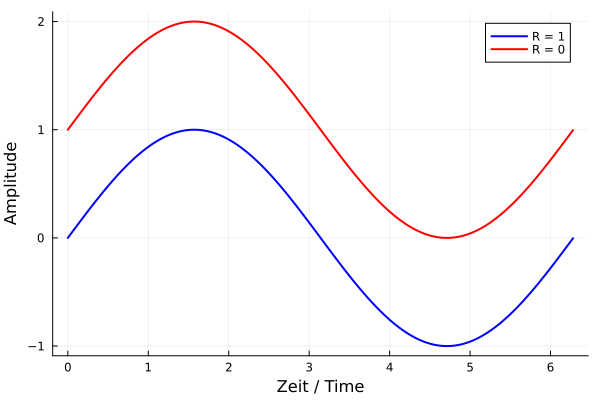

## Ermüdung und Verschleiß
Prof. Dr.-Ing. Christian Willberg
Hochschule Magdeburg-Stendal

Kontakt: christian.willberg@h2.de  
Teile des Skripts sind von Prof. Dr.-Ing. Jürgen Häberle übernommen  

 
  <a href="https://doi.org/10.1007/s42102-021-00079-6" style="color: blue;">Bildreferenz</a>

---

<!--paginate: true-->

---

# Ermüdung

Was ist Ermüdung?

---

- Tritt typischerweise bei zyklischer Belastung auf
  - Isotherme mechanische Ermüdung
    - [Oszillierende Last](https://www.youtube.com/watch?v=_qVXkAWtH60)
    - Flugzeugrümpfe (Druckaufbau und -abfall)
  - Thermische Ermüdung
    - Öfen, Heizelemente
  - Thermomechanische Ermüdung
    - Hochdruckbehälter
  - Elektrothermische Ermüdung
    - Stromleiter (Glühfäden)

---

---

## Ermüdung
- Die Belastung liegt unterhalb der Streckgrenze $R_{p0,2}$
  - > _Erinnerung: Was bedeutet $R_{p0,2}$?_
- Spannungs-Konzentrationen entstehen an Materialfehlern (Poren, Mikrorisse) oder im Kristall (Versetzungen, Fehlstellen)
- Zunächst bilden sich unter wechselnder Last lokal zufällige Bereiche plastischer Verformung
- Diese Punkte repräsentieren Spannungs-Konzentrationsbereiche, die sich mit der Zeit vergrößern und zu Bruch führen können

[Erklärvideo](https://www.youtube.com/watch?v=o-6V_JoRX1g)

---

---
## Spannungsverhältnis
$R = \frac{\sigma_u}{\sigma_o}$
## Mittelspannung
$\sigma_m=\frac{\sigma_u+\sigma_o}{2}$

$\sigma_o$ - Oberspannung
$\sigma_u$ - Unterspannung

---

## Dauerfestigkeitsschaubilder
- Haigh-Diagramm und Smith-Diagramm empfohlen nach DIN 50100

---

## Haigh-Diagramm

---

---

## Smith-Diagramm

- Winkelhalbierende eintragen
- Oben und unten (paralle Linien) -> statische Druck- und Zugfestigkeit
- Kurven werden aus Wöhlerexperiment mit verschiedenen R bestimmt

---

## Begriffe

- Lebensdauer
- Ermüdungsriss
- Ermüdungsbruch
- Kurzzeitfestigkeit (K) $<10^5$ (Low Cycle Fatigue (LCF))
- Zeitfestigkeit (Z) $10^4<10^6$ (High Cycle Fatigue (HCF))
- Dauerfestigkeit (D) $>10^6$ (Very High Cycle Fatigue (VHCF))

---

## Gegenmaßnahmen

- Kerbwirkung verringern
- Materialanpassung
- Konstruktion anpassen, damit lokale Spannung zulässige Grenzen nicht überschreitet
- Regelmäßige Inspektionen 

---

# Verschleiß

---

- infolge Reibung eintretende bleibende Form- und Stoffveränderung an der Oberfläche von Festkörpern
- ist technologisch nicht beabsichtigt und eine Form des funktionellen Versagens darstellt bzw. darstellen kann
- Beeinflusst durch
  - Reibkörperpaarung
  - Beschaffenheit der Grenzschichten und des Zwischenstoffes
  - Art des Bewegungsablaufes
  - Höhe der Belastung 

---

- **Adhäsiver Verschleiß**
- **Abrasiver Verschleiß**
- **Oberflächenzerrüttung**
- **Tribooxidation**

---

## Adhäsiver Verschleiß
 - Adhäsiver Verschleiß tritt bei mangelnder Schmierung auf
 - bei hoher Flächenpressung haften Flächen aneinander
 - tritt Gleiten ein, werden Randschichtteilchen
 - es entstehen Löcher und schuppenartige Materialteilchen, die oft an der Gleitfläche des härteren Partners haften bleiben. 

---

---

## Abrasiver Verschleiß

- harte Teilchen eines Schmierstoffs oder Rauheitsspitzen eines Reibungspartners dringen in Randschicht ein
  -> es kommt es zu Ritzung und Mikrozerspanen
  - Furchverschleiß oder Erosionsverschleiß 

- richtige Wahl der Werkstoffpaarung; Metall-Kunststoff- oder Metall-Keramik-Paarungen

---

Beispiel Windenergie:
- Sand im Wind "schmirgelt" die Oberfläche ab
- Wirkungsgrad sinkt

---

## Oberflächenzerrüttung

- wechselnde oder schwellende mechanische Spannungen an der Oberfläche
- Ermüdung oder Kriechen des Materials an der Oberfläche

---

## Tribooxidation
- Tribooxidation (Passungsrost) an einer Welle aus Stahl
-  Bildung von Zwischenschichten, z. B. Oxidschichten, infolge chemischer Reaktion und ihre mechanische Zerstörung durch Bewegung der Bauteile 
- tritt fast immer zusammen mit adhäsivem Verschleiß auf

---

| Verschleißart            | Erscheinung                                                        | Primäres Vorkommen                                         |
|--------------------------|--------------------------------------------------------------------|------------------------------------------------------------|
| Gleitverschleiß          | Rillen oder Riefen durch Abrieb, Materialübertragung oder lokales Schmelzen | Un-geschmierte Lager, Kupplungen, Bremsen                  |
| Rollverschleiß           | Abblättern durch Ermüdungsrisse                                     | Rad/Schiene, Wälzlager                                     |
| Pittings                 | Grübchenbildung: Pitting                                           | Wälzkörper, speziell Zahnräder                             |
| Abrasivverschleiß         | Plastische Verformung, Erosion                                    | Bagger, Schüttguttransport, Partikelaufprall               |
| Kavitation               | Oberflächenschädigung durch Aufprall von Dampfblasen              | Wasserturbinen, Pumpen                                     |
| Tribooxidation (Reibkorrosion) | Loses Oxidationsprodukt                                      | Maschinenelemente mit form- oder kraftschlüssigen Verbindungen |

---

## Gleitverschleiß

- Beeinflusst [durch](https://download.basf.com/p1/8a8081c57fd4b609017fd66047f138c3/de/Reibung_und_Verschlei%25C3%259F%250Abei_Polymerwerkstoffen)
  - Die mittlere Rauheitstiefe $R_z$
  - Anpressdruck
  - Verschleißpfadverhältnis $W=k\frac{F_N}{A}10^6$
  - $k$ in $\left[\frac{mm^3}{Nm}\right]$ spezifischer Verschleißkoeffizient (lastunabhängig)

---

## Wälzverschleiß
- [Wälzen](https://link.springer.com/chapter/10.1007/978-3-658-17851-2_6) ist eine Beanspruchungsart, bei der Gleitanteile (Schlupf) den reinen Rollvorgang überlagern
- kleine Kontaktfläche; hohe Flächenpressung
- Oberflächenzerrüttung (plastische Verformung, Gefügeänderungen, usw.)
- durch Schmierung deutlich reduzierbar $\rightarrow$ spezifische Schmierfilmdicke $\lambda$

---

## Kavitation

[Video](https://www.youtube.com/watch?v=J0H0Nw44oA4)

Physikalische Ursache?

- statischer Druck ist abhängig von der Geschwindigkeit eines Fluids
- bei Unterschreitung des Verdampfungsdrucks bilden sich Dampfblasen
- diese Blasen laufen in Bereiche mit höherem Druck und kondensieren schlagartig
- Druck- und Temperaturspitzen treten auf

---

- lokale Belastungen an der Oberfläche
- diese Bereiche ermüden und platzen ab
- Beeinträchtigt die Oberfläche
  - Wirkungsgradreduktion
  - Korrosion
  - Bereiche wo Risse initiieren können

---

## Reibkorrosion

- Gleitbewegungen zwischen zwei hochbelasteten Bauteilen
- meist bei zu geringem Übermaß $\rightarrow$ Passungen

