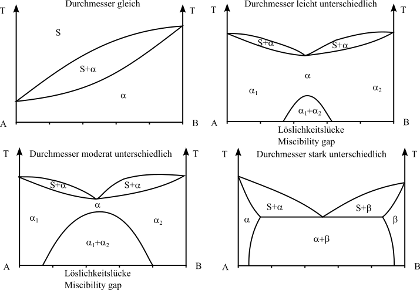

## Vorlesung Werkstofftechnik - Zustandsdiagramme
Prof. Dr.-Ing.  Christian Willberg 

Kontakt: christian.willberg@h2.de

---

<!--paginate: true-->

# Zustandsdiagramme

- auch Phasendiagramm -phase diagram-
- stellt den Zustand von Legierungen und Stoffgemischen in Abhängigkeit von der chemischen Zusammensetzung, Temperatur und ggf. dem Druck dar
- Zustand meint die auftretenden Phasen (alle festen, flüssige, gasförmige)

---
## Achtung!

Zustandsdiagramme sind Gleichgewichtsdiagramme. 
Sie haben nur Gültigkeit bei einer sehr langsamen 
Abkühlung aus dem schmelzflüssigen Zustand bis hin zur 
Raumtemperatur, bei der sich das Gleichgewicht zwischen 
den Phasen (an bzw. zwischen den Phasengrenzlinien) einstellen kann. 

---

---

## Löslichkeiten

Unlöslich

- zu große Unterschiede bei den Atomdurchmessern
- Kristallgitter weichen voneinander ab
- Komponenten sind chemisch sehr unterschiedlich

Löslich
- kaum Unterschiede bei den Atomdurchmessern
- Kristallgitter sind identisch
- Komponenten sind chemisch sehr nah beieinander

---

## Beispiel aus der eigenen Erfahrung
- Ölfilm auf Wasser ist nicht löslich und es findet eine Trennung aufgrund der unterschiedlichen Dichte statt
- Salz- / Zuckerkristalle in Wasser werden vollständig gelöst und ist nicht mehr sichtbar

---

---

## Beispiel für Unlöslichkeit

---

## Beispiel für vollständige Löslichkeit

---

---

## Gibbsche Phasenregel

$F = n  - P + 2$
(für Gase und Flüssigkeiten)
F = Anzahl der Freiheitsgrade; n = Anzahl der Komponenten; P = Anzahl der Phasen

bei konstantem Druck (feste Stoffe) 	
        
$F = n  - P + 1$
        
Damit ergibt sich für die Anwendung dieser Gesetzmäßigkeiten bei der Abkühlungs- und Erwärmungskurve für metallische Systeme

F = 0		ein Haltepunkt und
F = 1		ein Knickpunkt.

---
# Zusammenfassung

- Die Phasen bzw. Phasengrenzlinien können als ein Zustandsdiagramm dargestellt werden
- Die Anzahl der miteinander im Gleichgewicht stehenden Phasen ist gesetzmäßig verknüpft mit der Zahl der an der Legierungsbildung beteiligten Komponenten und der Zahl der Freiheitsgrade über die Gibbsche Phasenregel
- Ein Freiheitsgrad beinhaltet die mögliche Veränderung von Zustandsvariablen, ohne das Gleichgewicht, d.h. die Anzahl der Phasen, zu ändern (Bewegung in T oder der Konzentration)
- Die Anzahl der frei wählbaren Zustandsvariablen wird  nach der Phasenregel bestimmt

---

## Hebelgesetz

- In Punkt 2 hat die Schmelze einen kleineren Nickelgehalt als der $\alpha$-MK
- D.h. die Konzentration im Mischkristall muss steigen, damit die Zahl der Nickelatome plastischer
- Schmelze und Mischkristall müssen nicht die gleiche chemische Zusammensetzung haben

---

$\frac{m_s}{m_{\alpha}}=\frac{c_{\alpha}-c_{L}}{c_{L}-c_{S}}$

---

## Rechenbeispiel

-> Annahme Konzentrationen in Punkt 2

$c_S=20\%$, $c_{\alpha}=40\%$, $c_L=25\%$

---

## Lösung

$\frac{m_s}{m_{\alpha}}={c_{\alpha}-c_{L}}{c_{L}-c_{S}}=\frac{40\%-25\%}{25\%-20\%}=\frac{15}{5}=\frac{3}{1}$
- im Punkt 2 liegt 3 mal soviel Schmelze wie Mischkristall vor

---

## Praktische Bedeutung

- Kupfer Nickel Legierungen haben gegenüber reinem Kupfer eine höhere Festigkeit bei guter Korrosionsbeständigkeit

---

# Völlige Löslichkeit im flüssigen und teilweise Löslichkeit im festen Zustand

- Metallschmelzen der Elemente A und B lösen sich in beliebigen Mischungsverhältnissen (Konzentrationen)
- die Mischkristalle bilden sich nur noch in bestimmten Maße

---

## Wann tritt das auf?

- Atomdurchmesser weichen voneinander ab
- Kristallgitter der Komponenten unterscheiden sich
- Komponenten sich chemisch verschieden

Die Komponenten sich sich weder sehr ähnlich, noch sehr verschieden

Es können folgende ZSDs auftauchen
- Eutektikum
- Peritektikum

---

---

## Hinweis

- Löslichkeitslücke meist als Mischungslücke bekannt
- $\alpha_1$ ist ein A reicher Kristall
- $\alpha_2$ ist ein B reicher Kristall

- Durchmesser irgendwann so groß, dass die Löslichkeitslücke in den Schmelzbereich ragt
-> Eutektikum

- Komponenten sind **löslich** im flüssigen Zustand
- Komponenten sind **begrenzt löslich** im festen Zustand

---

## Eutektische Reaktion

-  bei einer Konzentration erstarren aus der Schmelze S bei konstanter Temperatur (Eutektikale) A- und B-Kristalle zu einem feinkristallinen Kristallgemisch (Eutektikum)
- eutektische Gefüge besitzt oft eine schicht- oder lamellenartige Struktur
- Legierungen anderer Konzentrationen scheiden vor Erreichen der Eutektikale (Haltepunkt bei der Eutektischen Reaktion) die überwiegende Komponente aus (A- oder B-Kristalle), so dass sich die Konzentration der verbleibenden Schmelze der eutektischen Zusammensetzung annähert. 
- die **Eutektikale** bildet die Soliduslinie des gesamten Systems

---

## Eutektischer Entmischung

---

_Löslichkeits- oder Sättigungslinien_
- Linien, die die Einphasengebiete ($\alpha$, $\beta$) von dem Gebiet der Kristallgemische aus Mischkristal-len ($\alpha+\beta$) abgrenzen
Sonderfall:
- ein System von Mischkristallen bilden Einlagerungsmischkristalle 
- Die Konzentrationsachse endet dann mit der Konzentration der Sättigung der Komponente B im Gitter der Komponente A
- Das Einphasengebiet der Komponente B kann dann nicht existieren.

---

## Systeme mit Peritektikum (mit peritektischer Entmischung) 

-  weit auseinander liegende Schmelz-/Erstarrungstemperaturen der beteiligten Komponenten sind charakteristisch.
- Bei Abkühlung aus der Schmelze bildet sich ein Mischkristall $\alpha$
- bildet bei konstanter Temperatur (entsprechend der **Eutektikalen**) mit der Schmelze reagierend eine zweite Mischkristallart $\beta$ bildet. 
- bei einer peritektischen Reak-tion entstehen aus der Schmelze und bereits ausgeschiedenen $\alpha$-Mischkristallen bei gleich bleibender Temperatur neue $\beta$-Mischkristalle.

---

---

---

# Fragen

---

---

## Referencen

Rainer Schwab: Werkstoffkunde und Werkstoffprüfung für Dummies, 2019; ISBN-10 352771538X
[Grundlagen der Metallkunde](https://wiki.arnold-horsch.de/index.php/Grundlagen_der_Metallkunde)
