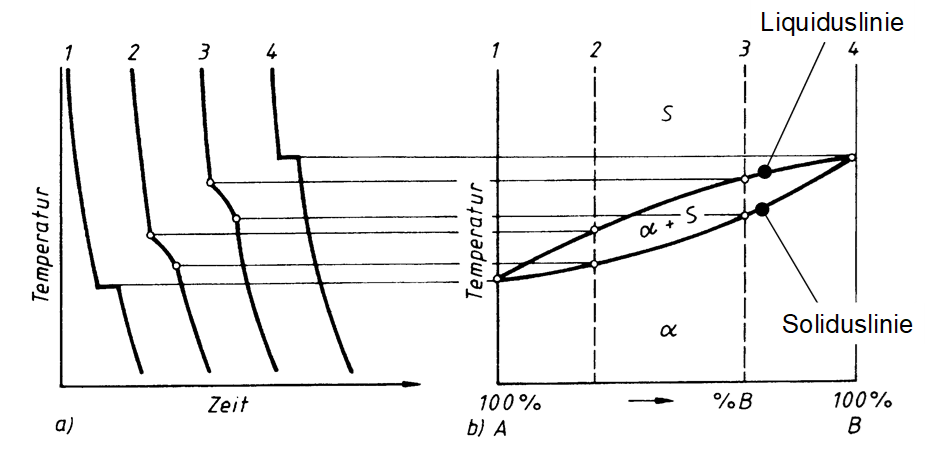
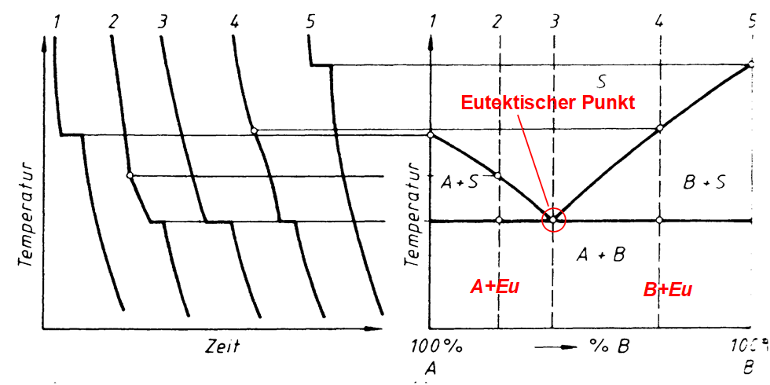

## Vorlesung Werkstofftechnik - Legierungsbildung - Zustandsdiagramme
Prof. Dr.-Ing.  Christian Willberg 

Kontakt: christian.willberg@h2.de

---

<!--paginate: true-->

# Lernziele

- Zustandsdiagramme lesen und interpretieren
- Phasen und Phasengrenzen identifizieren
- Das Hebelgesetz anwenden
- Eutektische und peritektische Reaktionen erkennen
- Die Gibbsche Phasenregel anwenden
- Praktische Schlüsse für Legierungen ziehen

---

# Zustandsdiagramme

- auch Phasendiagramm -phase diagram-
- stellt den Zustand von Legierungen und Stoffgemischen in Abhängigkeit von der chemischen Zusammensetzung, Temperatur und ggf. dem Druck dar
- Zustand meint die auftretenden Phasen (alle festen, flüssige, gasförmige)

---
## Achtung!

Zustandsdiagramme sind Gleichgewichtsdiagramme. 
Sie haben nur Gültigkeit bei einer sehr langsamen 
Abkühlung aus dem schmelzflüssigen Zustand bis hin zur 
Raumtemperatur, bei der sich das Gleichgewicht zwischen 
den Phasen (an bzw. zwischen den Phasengrenzlinien) einstellen kann. 

**In der Praxis:** Schnelle Abkühlung kann zu völlig anderen Gefügen führen!

---

## Warum sind Zustandsdiagramme wichtig?

**Praktische Bedeutung:**
- Vorhersage von Gefügestrukturen
- Optimierung von Wärmebehandlungen
- Auswahl geeigneter Legierungszusammensetzungen
- Vermeidung von unerwünschten Phasen
- Kostenoptimierung durch gezielten Legierungseinsatz

---

---

## Wie liest man ein Zustandsdiagramm?

**Achsen:**
- X-Achse: Konzentration (meist in Gewichts-% oder Atom-%)
- Y-Achse: Temperatur in °C oder K

**Linien:**
- Liquiduslinie: Beginn der Erstarrung
- Soliduslinie: Ende der Erstarrung
- Solvuslinien: Löslichkeitsgrenzen im festen Zustand

**Gebiete:**
- Phasenfelder zeigen welche Phase(n) vorliegen

---

## Löslichkeiten

**Unlöslich**

- zu große Unterschiede bei den Atomdurchmessern (>15%)
- Kristallgitter weichen voneinander ab
- Komponenten sind chemisch sehr unterschiedlich
- Elektronen unterscheiden sich stark

**Löslich**
- kaum Unterschiede bei den Atomdurchmessern (<15%)
- Kristallgitter sind identisch
- Komponenten sind chemisch sehr nah beieinander
- Elektronegativität ähnlich

---

---

## Hume-Rothery-Regeln für vollständige Löslichkeit

**Alle 4 Bedingungen müssen erfüllt sein:**

1. **Atomradius:** Differenz < 15%
2. **Kristallstruktur:** Gleiche Gitterstruktur
3. **Elektronegativität:** Ähnliche Werte (sonst intermetallische Verbindung)
4. **Wertigkeit:** Gleiche Wertigkeit bevorzugt

Beispiel: Cu-Ni erfüllt alle Bedingungen ✓

---

## Beispiel aus der eigenen Erfahrung
- Ölfilm auf Wasser ist nicht löslich und es findet eine Trennung aufgrund der unterschiedlichen Dichte statt
- Salz- / Zuckerkristalle in Wasser werden vollständig gelöst und ist nicht mehr sichtbar

**Übertragung auf Metalle:**
- Unlöslich → Kristallgemisch (mechanisches Gemenge)
- Löslich → Mischkristall (homogene Lösung)

---

## Beispiel für Unlöslichkeit

---

## System Eisen-Blei: Eigenschaften

**Warum unlöslich?**
- Atomradius: Fe = 1,26 Å, Pb = 1,75 Å (Differenz 39%)
- Kristallstruktur: Fe = krz, Pb = kfz
- Schmelzpunkte: Fe = 1538°C, Pb = 327°C

**Konsequenz:**
- Keine Mischkristallbildung
- Praktisch keine gegenseitige Löslichkeit
- Zwei getrennte flüssige Phasen

---

## Beispiel für vollständige Löslichkeit

---

## System Kupfer-Nickel: Eigenschaften

**Warum vollständig löslich?**
- Atomradius: Cu = 1,28 Å, Ni = 1,24 Å (Differenz 3%)
- Kristallstruktur: beide kfz
- Elektronegativität ähnlich
- Chemisch ähnlich (Nachbarn im PSE)

**Eigenschaften:**
- Höhere Festigkeit als reines Cu
- Gute Korrosionsbeständigkeit
- Anwendung: Münzen, Schiffsbau

---

---

## Wichtige Begriffe

**Komponenten:** Die reinen Elemente A und B
**Phase:** Homogener Bereich mit gleichen physikalischen Eigenschaften
**Mischkristall:** Feste Lösung von B in A (oder umgekehrt)
**Schmelze:** Flüssige Phase (meist vollständig mischbar)
**Eutektikum:** Punkt niedrigster Schmelztemperatur
**Konzentration:** Anteil einer Komponente (in Gew.-% oder At.-%)

---

## Hebelgesetz

- In Punkt 2 hat die Schmelze einen kleineren Nickelgehalt als der $\alpha$-MK
- D.h. die Konzentration im Mischkristall muss steigen, damit die Zahl der Nickelatome konstant bleibt
- Schmelze und Mischkristall müssen nicht die gleiche chemische Zusammensetzung haben

---

## Hebelgesetz - Herleitung

**Massenbilanz:**
Die Gesamtmasse bleibt konstant: $m_{ges} = m_S + m_\alpha$

**Stoffmengenbilanz:**
Die Gesamtkonzentration bleibt konstant: $c_L \cdot m_{ges} = c_S \cdot m_S + c_\alpha \cdot m_\alpha$

**Umformung führt zu:**

$\frac{m_S}{m_{\alpha}}=\frac{c_{\alpha}-c_{L}}{c_{L}-c_{S}}$

---

## Hebelgesetz - Anwendung

**Regel:**
- Die Masse einer Phase verhält sich umgekehrt proportional zum Abstand von der Legierungskonzentration

**Merkhilfe:**
- Lege einen "Hebel" an die Isotherm-Linie
- Die Hebelmasse liegt bei der Legierungskonzentration $c_L$
- Die längere Hebelstrecke gehört zur kleineren Masse

**Wichtig:** Immer auf die Gesamtkonzentration achten!

---

## Rechenbeispiel

→ Annahme Konzentrationen in Punkt 2

$c_S=20\%$, $c_{\alpha}=40\%$, $c_L=25\%$

---

## Lösung

$\frac{m_S}{m_{\alpha}}=\frac{c_{\alpha}-c_{L}}{c_{L}-c_{S}}=\frac{40\%-25\%}{25\%-20\%}=\frac{15}{5}=\frac{3}{1}$

- im Punkt 2 liegt 3 mal soviel Schmelze wie Mischkristall vor

**Plausibilitätsprüfung:**
- $c_L = 25\%$ liegt näher bei $c_S = 20\%$ als bei $c_\alpha = 40\%$
- Daher mehr Schmelze → ✓

---

## Übungsaufgabe: Hebelgesetz

Eine Cu-Ni-Legierung mit 60 Gew.-% Ni befindet sich bei 1300°C im Zweiphasengebiet.

**Ablesewerte aus dem Diagramm:**
- $c_S = 52\%$ Ni (Liquiduslinie)
- $c_\alpha = 68\%$ Ni (Soliduslinie)
- $c_L = 60\%$ Ni (Legierungskonzentration)

**Frage:** Wie groß sind die Massenanteile von Schmelze und α-Mischkristall?

---

## Lösung: Übungsaufgabe Hebelgesetz

$\frac{m_S}{m_{\alpha}}=\frac{c_{\alpha}-c_{L}}{c_{L}-c_{S}}=\frac{68\%-60\%}{60\%-52\%}=\frac{8}{8}=\frac{1}{1}$

**Anteile:**
- Anteil Schmelze: $\frac{m_S}{m_{ges}}=\frac{c_{\alpha}-c_{L}}{c_{\alpha}-c_{S}}=\frac{8}{16}=0,5 = 50\%$
- Anteil α-MK: $\frac{m_{\alpha}}{m_{ges}}=\frac{c_{L}-c_{S}}{c_{\alpha}-c_{S}}=\frac{8}{16}=0,5 = 50\%$

**Interpretation:** Bei dieser Temperatur liegt die Legierung zu gleichen Teilen als Schmelze und fester Mischkristall vor.

---

## Völlige Löslichkeit im flüssigen und teilweise Löslichkeit im festen Zustand

- Metallschmelzen der Elemente A und B lösen sich in beliebigen Mischungsverhältnissen (Konzentrationen)
- die Mischkristalle bilden sich nur noch in bestimmten Maße

**Wichtig:** Dies ist der häufigste Fall in der Praxis!

---

## Wann tritt das auf?

- Atomdurchmesser weichen voneinander ab (aber < 30%)
- Kristallgitter der Komponenten unterscheiden sich
- Komponenten sich chemisch verschieden

Die Komponenten sind sich weder sehr ähnlich, noch sehr verschieden

Es können folgende ZSDs auftauchen:
- Eutektikum (häufigster Fall)
- Peritektikum (seltener)

---

---

---

## Gibbsche Phasenregel

$F = n  - P + 2$
(für Gase und Flüssigkeiten)
F = Anzahl der Freiheitsgrade; n = Anzahl der Komponenten; P = Anzahl der Phasen

bei konstantem Druck (feste Stoffe) 	
        
$F = n  - P + 1$
        
Damit ergibt sich für die Anwendung dieser Gesetzmäßigkeiten bei der Abkühlungs- und Erwärmungskurve für metallische Systeme

F = 0		ein Haltepunkt und
F = 1		ein Knickpunkt.

---

## Gibbsche Phasenregel - Beispiele

**Beispiel 1: Reines Metall beim Schmelzen**
- n = 1 (eine Komponente), P = 2 (fest + flüssig)
- F = 1 - 2 + 1 = 0 → Haltepunkt bei konstanter Temperatur

**Beispiel 2: Cu-Ni Legierung im Zweiphasengebiet**
- n = 2 (Cu und Ni), P = 2 (α + Schmelze)
- F = 2 - 2 + 1 = 1 → Ein Freiheitsgrad (T oder c veränderbar)

**Beispiel 3: Einphasengebiet (nur α)**
- n = 2, P = 1
- F = 2 - 1 + 1 = 2 → Zwei Freiheitsgrade (T und c frei wählbar)

---

# Zusammenfassung

- Die Phasen bzw. Phasengrenzlinien können als ein Zustandsdiagramm dargestellt werden
- Die Anzahl der miteinander im Gleichgewicht stehenden Phasen ist gesetzmäßig verknüpft mit der Zahl der an der Legierungsbildung beteiligten Komponenten und der Zahl der Freiheitsgrade über die Gibbsche Phasenregel
- Ein Freiheitsgrad beinhaltet die mögliche Veränderung von Zustandsvariablen, ohne das Gleichgewicht, d.h. die Anzahl der Phasen, zu ändern (Bewegung in T oder der Konzentration)
- Die Anzahl der frei wählbaren Zustandsvariablen wird  nach der Phasenregel bestimmt

---

## Hinweis

- Löslichkeitslücke meist als Mischungslücke bekannt
- $\alpha$ ist ein A reicher Kristall
- $\beta$ ist ein B reicher Kristall

- Durchmesser irgendwann so groß, dass die Löslichkeitslücke in den Schmelzbereich ragt
→ Eutektikum

- Komponenten sind **löslich** im flüssigen Zustand
- Komponenten sind **begrenzt löslich** im festen Zustand

---

## Eutektische Reaktion

-  bei einer Konzentration erstarren aus der Schmelze S bei konstanter Temperatur (Eutektikale) A- und B-Kristalle zu einem feinkristallinen Kristallgemisch (Eutektikum)
- eutektische Gefüge besitzt oft eine schicht- oder lamellenartige Struktur
- Legierungen anderer Konzentrationen scheiden vor Erreichen der Eutektikale (Haltepunkt bei der Eutektischen Reaktion) die überwiegende Komponente aus (A- oder B-Kristalle), so dass sich die Konzentration der verbleibenden Schmelze der eutektischen Zusammensetzung annähert. 
- die **Eutektikale** bildet die Soliduslinie des gesamten Systems

---

## Eutektische Reaktion - Formel

**Reaktionsgleichung:**
Schmelze → α-Mischkristall + β-Mischkristall

$S_E \rightarrow \alpha_E + \beta_E$

**Merkmale:**
- Konstante Temperatur (Haltepunkt)
- Konstante Zusammensetzung (eutektischer Punkt)
- Gleichzeitige Bildung zweier Phasen
- Feines, lamellenartiges Gefüge

**Vorteil:** Niedrigste Schmelztemperatur im System → Gießlegierungen

---

## Abkühlungskurven bei eutektischen Systemen

**Legierung links vom eutektischen Punkt:**
1. Primärkristallisation von α-MK (Knick)
2. Eutektische Reaktion (Haltepunkt)

**Eutektische Legierung:**
1. Nur eutektische Reaktion (Haltepunkt)

**Legierung rechts vom eutektischen Punkt:**
1. Primärkristallisation von β-MK (Knick)
2. Eutektische Reaktion (Haltepunkt)

---

## Eutektische Entmischung

---

## Klassische eutektische Systeme

**Blei-Zinn (Pb-Sn):**
- Eutektikum bei 61,9% Sn und 183°C
- Anwendung: Weichlote

**Silber-Kupfer (Ag-Cu):**
- Eutektikum bei 71,9% Ag und 779°C
- Anwendung: Hartlote

**Aluminium-Silizium (Al-Si):**
- Eutektikum bei 12,6% Si und 577°C
- Anwendung: Gusslegierungen (z.B. Motorblöcke)

---

## Gefüge untereutektischer Legierungen

**Untereutektische Legierung** (< eutektische Konzentration):

1. **Primärkristallisation:** α-Mischkristalle scheiden sich aus (grobkörnig)
2. **Eutektische Erstarrung:** Verbleibende Schmelze erstarrt eutektisch (feinkörnig)

**Resultat:**
- Große α-Primärkristalle
- Umgeben von eutektischem Gefüge (α + β lamellar)
- Gefüge: "Primär-α in eutektischer Grundmasse"

---

## Gefüge übereutektischer Legierungen

**Übereutektische Legierung** (> eutektische Konzentration):

1. **Primärkristallisation:** β-Mischkristalle scheiden sich aus (grobkörnig)
2. **Eutektische Erstarrung:** Verbleibende Schmelze erstarrt eutektisch (feinkörnig)

**Resultat:**
- Große β-Primärkristalle
- Umgeben von eutektischem Gefüge (α + β lamellar)
- Gefüge: "Primär-β in eutektischer Grundmasse"

---

_Löslichkeits- oder Sättigungslinien_
- Linien, die die Einphasengebiete ($\alpha$, $\beta$) von dem Gebiet der Kristallgemische aus Mischkristallen ($\alpha+\beta$) abgrenzen
- **Wichtig:** Löslichkeit nimmt meist mit sinkender Temperatur ab!

Sonderfall:
- ein System von Mischkristallen bilden Einlagerungsmischkristalle 
- Die Konzentrationsachse endet dann mit der Konzentration der Sättigung der Komponente B im Gitter der Komponente A
- Das Einphasengebiet der Komponente B kann dann nicht existieren

---

## Aushärtung durch Ausscheidung

**Prinzip:**
1. Lösung bei hoher Temperatur (Einphasengebiet)
2. Abschrecken (übersättigte Lösung)
3. Auslagern bei mittlerer Temperatur
4. Feine Ausscheidungen → Festigkeitssteigerung

**Beispiel:** Aluminium-Kupfer-Legierungen (Duraluminium)

**Voraussetzung:** Abnehmende Löslichkeit mit sinkender Temperatur!

---

## Systeme mit Peritektikum (mit peritektischer Entmischung) 

-  weit auseinander liegende Schmelz-/Erstarrungstemperaturen der beteiligten Komponenten sind charakteristisch.
- Bei Abkühlung aus der Schmelze bildet sich ein Mischkristall $\alpha$
- bildet bei konstanter Temperatur (entsprechend der **Peritektikalen**) mit der Schmelze reagierend eine zweite Mischkristallart $\beta$. 
- bei einer peritektischen Reaktion entstehen aus der Schmelze und bereits ausgeschiedenen $\alpha$-Mischkristallen bei gleich bleibender Temperatur neue $\beta$-Mischkristalle.

---

## Peritektische Reaktion - Formel

**Reaktionsgleichung:**
Schmelze + α-Mischkristall → β-Mischkristall

$S + \alpha \rightarrow \beta$

**Merkmale:**
- Konstante Temperatur (Haltepunkt)
- Reaktion zwischen fester und flüssiger Phase
- Bildung einer neuen festen Phase
- α-Kristalle werden "umhüllt"

**Problem:** Reaktion oft unvollständig bei schneller Abkühlung → Seigerungen

---

---

---

## Beispiel: Eisen-Kohlenstoff (vereinfacht)

**Peritektische Reaktion bei 1493°C:**
- δ-Ferrit + Schmelze → γ-Austenit
- Wichtig für Stahlherstellung
- Bei langsamer Abkühlung vollständig
- Bei schneller Abkühlung: Seigerungen möglich

**Weitere Beispiele:**
- Silber-Platin
- Kupfer-Zink (oberhalb 36% Zn)

---

## Vergleich: Eutektikum vs. Peritektikum

| Merkmal | Eutektikum | Peritektikum |
|---------|------------|--------------|
| Reaktion | S → α + β | S + α → β |
| Temperatur | Minimum | Maximum lokal |
| Gefüge | Lamellar | α-Reste in β |
| Häufigkeit | Häufig | Selten |
| Gießbarkeit | Sehr gut | Problematisch |

---

# Verständnisfragen

1. Warum sind Zustandsdiagramme Gleichgewichtsdiagramme?
2. Was bedeutet ein Freiheitsgrad?
3. Warum ist die eutektische Temperatur ein Minimum?
4. Welche Vorteile haben eutektische Legierungen beim Gießen?
5. Was ist der Unterschied zwischen Mischkristall und Kristallgemisch?

---

## Antworten zu Verständnisfragen

1. **Gleichgewicht:** Benötigt sehr langsame Abkühlung für Diffusion
2. **Freiheitsgrad:** Anzahl frei wählbarer Zustandsvariablen ohne Änderung der Phasenzahl
3. **Eutektisches Minimum:** Gegenseitige Störung der Kristallisation senkt Schmelzpunkt
4. **Gießvorteile:** Niedrigste Schmelztemperatur, gute Formfüllung, dünnflüssig
5. **MK vs. KG:** MK = homogen atomare Lösung, KG = mechanisches Gemenge

---

# Zusammenfassung

**Kernpunkte:**
- Zustandsdiagramme zeigen Phasen in Abhängigkeit von T und c
- Gibbsche Phasenregel: F = n - P + 1
- Hebelgesetz zur Berechnung von Massenanteilen
- Eutektikum: S → α + β (Minimum)
- Peritektikum: S + α → β (selten)
- Löslichkeit nimmt meist mit T ab → Aushärtung möglich
- Praktische Bedeutung für Legierungsauswahl und Wärmebehandlung

---

# Fragen

---

## Ausblick: Nächste Vorlesung

**Eisen-Kohlenstoff-Diagramm**
- Das wichtigste ZSD für Ingenieure
- Grundlage für Stahl und Gusseisen
- Wärmebehandlungen verstehen
- Gefüge und Eigenschaften

---

## Referenzen

Rainer Schwab: Werkstoffkunde und Werkstoffprüfung für Dummies, 2019; ISBN-10 352771538X
[Grundlagen der Metallkunde](https://wiki.arnold-horsch.de/index.php/Grundlagen_der_Metallkunde)

