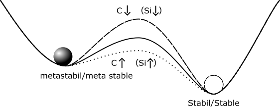

## Vorlesung Werkstofftechnik - Phasen- und Gefüge im System-Eisen-Kohlenstoff
Prof. Dr.-Ing.  Christian Willberg 

Kontakt: christian.willberg@h2.de

---

<!--paginate: true-->

---

# Lernziele

Nach dieser Vorlesung können Sie:
- das Eisen-Kohlenstoff-Diagramm lesen und interpretieren
- Phasen und Gefügebestandteile identifizieren
- Abkühlungsvorgänge im EKD nachvollziehen
- Eigenschaften von Stahl und Gusseisen erklären
- einfache Wärmebehandlungen verstehen
- Werkstoffauswahl für technische Anwendungen begründen

---

# Realdiagramme

---

## Realdiagramme
- die bisherigen Digramme waren Idealdigramme und treten so nicht wirklich auf
- Eisen-Kohlenstoff-Diagramm (EKD) ist das wichtigste Realdiagramm
- Grundmetall ist Eisen -> Stahl oder Eisenguss
- das EKD setzt sich aus den Idealdiagrammen - dem peritektischen, eutektischen und eutektoiden Teildiagramm - zusammen

---

## Wichtige Begriffe

**Eutektikum**: Zweistoffgemisch mit niedrigstem Schmelzpunkt
- gleichzeitige Erstarrung beider Komponenten aus der Schmelze

**Eutektoid**: analog zum Eutektikum, aber Umwandlung im festen Zustand
- gleichzeitiger Zerfall eines Mischkristalls in zwei neue Phasen

**Peritektikum**: Reaktion zwischen fester Phase und Schmelze
- bildet eine neue feste Phase

---

# Eisen-Kohlenstoffdiagramm (EKD)

- wichtigstes ZSD
- Eisen ist der wichtigste Werkstoff im Maschinenbau. 

Gründe sind die Eigenschaften von Stahl und Gußeisen
- geringe Kosten
- hohe Festigkeit und elastische Steifigkeit
- Vielzahl von möglichen Legierungen
- Verfügbarkeit
- Gießbarkeit, Schweißbarkeit, etc.

[Erklärvideo für das Eisen Kohlenstoff Diagramm](https://www.youtube.com/watch?v=oJqvnKhnsg0&t=1s)

---

- Man kann je nach Erscheinungsform des Kohlenstoffs zwischen dem stabilen System Fe-C, in dem Kohlenstoff als Graphit, und dem metastabilen System Fe-Fe$_3$C, in dem Kohlenstoff gebunden als Fe$_3$C (intermediäre Phase Zementit) vorliegt, unterscheiden

---

---

## Übersicht: Wichtige Bereiche im EKD

| Bereich | C-Gehalt | Werkstoff | Bedeutung |
|---------|----------|-----------|-----------|
| < 0.02% | sehr gering | reines Eisen | technisch selten |
| 0.02-2.06% | niedrig-mittel | **Stahl** | **wichtigster Bereich** |
| 2.06-6.67% | hoch | **Gusseisen** | Gussteile |

**Merke**: Die 2.06%-Grenze ist die **maximale C-Löslichkeit im Austenit** (Punkt E)

---

## Wichtige Gleichgewichtslinien

ABCD 	Liquiduslinie			
AHJECF 	Soliduslinie			
ECF 		Eutektikale			
PSK 		Eutektoide			
ES, PQ		Sättigungslinien				MOSK		Curie-Linie
QPSECD 	Bildung/Auflösung Fe$_3$C	

---

## Punkte im Zustandsdiagramm
S - eutektoider Punkt
C - eutektischer Punkt
G -	$\alpha$ / $\gamma$ - Umwandlungspunkt des reinen Eisens
E -	Punkt max. C-Löslichkeit im $\alpha$ - MK
P - Punkt max. C-Löslichkeit im $\gamma$ - MK
u. a. m. (vgl. Fe-Fe$_3$C - Diagramm)

---

## Kritische Punkte - Merkhilfe

**A1-Linie (723°C)**: Eutektoide - Perlitbildung
**A3-Linie (GOS)**: Ferrit/Austenit-Umwandlung
**Acm-Linie (ES)**: Zementitausscheidung

- A1 = konstante Temperatur (eutektoid)
- A3 = steigt mit sinkendem C-Gehalt
- Acm = steigt mit steigendem C-Gehalt

---

# Phasen- und Gefüge im System-Eisen-Kohlenstoff
# Mischkristalle

---

---

---

## $\delta$-Mischkristall (krz)
 - $\delta$-Ferrit ist nur oberhalb von 1392°C stabil  
 - technisch von untergeordneter Bedeutung
 - Max. C-Löslichkeit: 0.12 %

---

## $\gamma$-Mischkristall (kfz)

- Gefügebezeichnung Austenit
- scheidet sich oberhalb der G-S-E-Linie  aus; 
  - durch Legierungszusätze (Ni, Mn) und Abschrecken auch bei Raumtemperatur beständig (austenitische Stähle)

---

- unmagnetisch, zäh und durch Kaltverfestigung härtbar (Mangan-, Nickel-, Chrom-Nickel-Stähle)
- hohe Warmfestigkeit, gute Korrosions- und Zunderbeständigkeit
- Max. C-Löslichkeit: 2.06 %

---
## Austenit

- bezeichnet die kubisch-flächenzentrierte Modifikation (Phase) des reinen Eisens und seiner Mischkristalle
- eine hohe Löslichkeit von Kohlenstoffatomen 

---

## Eigenschaften von Austenit

**Mechanisch**:
- Zugfestigkeit: ca. 500-700 MPa
- Härte: ca. 150-200 HB
- sehr zäh und duktil

**Kristallographisch**:
- kubisch-flächenzentriert (kfz)
- größere Zwischengitterplätze → hohe C-Löslichkeit (bis 2.06%)

**Wichtig**: Austenit ist die Ausgangsphase für viele Wärmebehandlungen!

---

## $\alpha$-Mischkristall (krz)
- Gefügebezeichnung Ferrit ($\alpha$-Ferrit)
- rein ferritisches Gefüge besitzt geringe Härte/Festigkeit, aber hohe Duktilität (Zähigkeit)
- Max. C-Löslichkeit: nur 0,02 % 

---

## Eigenschaften von Ferrit

**Mechanisch**:
- Zugfestigkeit: ca. 300 MPa
- Härte: ca. 80 HB
- Bruchdehnung: ca. 40%

**Kristallographisch**:
- kubisch-raumzentriert (krz)
- Gitterparameter: a = 2.866 Å
- sehr kleine Zwischengitterplätze → geringe C-Löslichkeit

---

## Härte / Festigkeit

Festigkeit 
- Maß der maximalen Beanspruchbarkeit bis Versagen
- Kraft pro Querschnittsfläche

Härte 
- mechanischer Widerstand gegen mechanisches Eindringung eines anderen Körpers 
- Maß für die Verschleißbeständigkeit

---

## Vergleich der Gitterstrukturen

| Eigenschaft | Ferrit (krz) | Austenit (kfz) |
|-------------|--------------|----------------|
| Temperaturbereich | < 911°C | 911-1392°C |
| C-Löslichkeit | 0.02% | 2.06% |
| Packungsdichte | 68% | 74% |
| Magnetismus | ferromagnetisch | paramagnetisch |
| Duktilität | mittel | hoch |

---

## Intermediäre Phase
Zementit (Eisencarbid Fe$_3$C); 6.67 Masse-% C-Gehalt

---

## Metastabile Systeme

- meta-stabil ist Fe$_3$C
- Stabil ist Graphit

---

## Warum ist Fe₃C metastabil?

**Thermodynamisch**:
- Graphit hat niedrigere freie Enthalpie → stabiler
- Fe₃C kann in Graphit zerfallen (bei hohen Temperaturen oder langer Zeit)

**Praktisch**:
- Zerfallsgeschwindigkeit sehr langsam bei normalen Bedingungen
- Silizium beschleunigt Graphitbildung → Gusseisen
- Schnelle Abkühlung "friert" Fe₃C ein → Stahl

---

- Primärzementit:	
primäre Kristallisation aus der Schmelze (Linie CD)

- Sekundärzementit: 
Ausscheidung aus dem Austenit (Linie ES)

- Tertiärzementit:	
Ausscheidung aus dem Ferrit (Linie PQ)

---

## Kristallstruktur

- orthorhombischen Elementarzelle 
  -  zwölf Eisen- und vier Kohlenstoffatome
  - die Kohlenstoffatome sind relativ unregelmäßig von acht Eisenatomen umgeben

---

- Zementit ist hart und spröde
- überwiegende Zahl der technischen Eisen-Kohlenstoff-Legierungen erstarrt unter Bildung von Zementit

---

## Eigenschaften von Zementit

**Mechanisch**:
- Härte: ca. 800 HV
- sehr spröde (keine plastische Verformung)
- hoher Verschleißwiderstand

**Chemisch**:
- Formel: Fe₃C (6.67% C)
- hohe chemische Stabilität
- orthorhombisches Kristallgitter

**Bedeutung**: Zementit bestimmt maßgeblich die Härte von Stählen!

---

---

# Phasengemische/Gemische von Mischkristallen

---

## Perlit 
- Gefüge aus Zementit und Ferrit (= Phasengemisch)
- entsteht durch den "eutektoiden" Zerfall des Austenits ($\gamma$-Mischkristall) mit 0.8% C bei 723°C
- eutektoider Punkt S: hier liegen 100% Perlit vor
- relativ hohe Härte, relativ hohe Festigkeit, schlechte Umformbarkeit, geringe Zähigkeit

---

- lamellenartiger Aufbau (Schichten von $\alpha$-Mk und Fe$_3$C-Kristallen) .
- häufig spricht man von einer "Perlitstufe", die - gemessen am Lamellenabstand - in Perlit, fein-streifigen  und feinststreifigen Perlit unterteilt wird. 

---

## Perlitbildung im Detail

**Eutektoide Reaktion bei 723°C**:
$$\gamma_{0.8\%C} \rightarrow \alpha_{0.02\%C} + Fe_3C_{6.67\%C}$$

**Mengenverhältnis** (Hebelgesetz):
- ca. 88% Ferrit
- ca. 12% Zementit

**Lamellenabstand** bestimmt Eigenschaften:
- grober Perlit: weicher, zäher
- feiner Perlit: härter, fester

---

## Eigenschaften von Perlit

**Mechanisch**:
- Zugfestigkeit: ca. 800 MPa
- Härte: ca. 200-250 HB
- mäßige Duktilität

**Gefüge**:
- Lamellenabstand: 0.1-1 µm
- Lamellen alternierend: Ferrit/Zementit
- "Perlit" wegen perlmuttartigem Aussehen unter Mikroskop

**Anwendung**: Schienen, Räder, hochfeste Bauteile

---

## Ledeburit

- Gefüge aus Austenit und Zementit bzw. „zerfallenem" Austenit und Zementit (= Phasengemisch), Kohlenstoffgehalt 4,3 %, Schmelztemperatur 1147°C 
- Eutektischer Punkt C: hier liegen 100% Ledeburit vor
- Unterscheidung zwischen Ledeburit I (dicht unterhalb 1.147 °C)
  -  um ein Gefüge aus Austenit und Zementit handelt

---

- Ledeburit II (Raumtemperatur)
  - aus Zementit I mit ankristallisiertem Sekundärzementit (aus dem Austenit bei sinkender Temperatur ausgeschieden) und (bei langsamer Abkühlung) aus Perlit
  -  Der Perlit entsteht durch den eutektoiden Zerfall des Austenits aus dem Ledeburit I bei 723 °C. 

---

- bei schnellerer Abkühlung kann anstelle des Perlit auch Bainit bzw. bei sehr schneller Abkühlung Martensit vorliegen. 
- Ledeburit ist schlecht umformbar, hat sehr geringe Duktilität. 
 - bei Raumtemperatur  feines Gemenge von Fe$_3$C-Kristalliten und Perlitbereichen im Auflichtmikroskop als charakteristische Pantherfellstruktur sichtbar.

---

## Ledeburit im Detail

**Eutektische Reaktion bei 1147°C**:
$$Schmelze_{4.3\%C} \rightarrow \gamma_{2.06\%C} + Fe_3C_{6.67\%C}$$

**Eigenschaften**:
- sehr hart (>400 HB)
- extrem spröde
- nicht schmiedbar

**Vorkommen**: 
- Gusseisen mit weißer Erstarrung
- Hartguss

---

## Übersicht Gefügebestandteile

| Gefüge | Zusammensetzung | Härte [HB] | Entstehung |
|--------|----------------|------------|------------|
| Ferrit | α-MK | ~80 | Primär/aus γ |
| Austenit | γ-MK | ~200 | bei hoher T |
| Zementit | Fe₃C | ~800 | Primär/Sekundär/Tertiär |
| Perlit | α + Fe₃C | ~250 | eutektoid, 723°C |
| Ledeburit | γ/α + Fe₃C | >400 | eutektisch, 1147°C |

---

# Phasen- und Gefüge im Ungleichgewichtszustand

- Gleichgewichtszustände sind durch Diffusionsvorgänge dominiert
- bei schnelleren Temperaturänderungen wird die Kohlenstoffdiffusion, die zur Entmischung des Austenits erforderlich ist, behindert 
- Dadurch entstehen auch neuartige Gefügebestandteile, die nicht mehr dem Gleichgewichtszustand entsprechen
- führt zu "zwangsgelöstem" Kohlenstoff

## Tauchen nicht im Phasendiagramm auf!

---

## Warum Ungleichgewichtsgefüge?

**Problem**: Diffusion benötigt Zeit
- Bei schneller Abkühlung keine Zeit für C-Diffusion
- Austenit kann nicht in Ferrit + Zementit zerfallen
- Kohlenstoff wird "zwangsgelöst"

**Resultat**: Neue Gefügebestandteile
- Martensit (sehr schnelle Abkühlung)
- Bainit (mittlere Abkühlgeschwindigkeit)
- Zwischenstufe (zwischen Bainit und Perlit)

---

## Martensit
- raumzentriertes Gitter tetragonal verzerrt („verspanntes Ferritgitter")
- meist feinnadeliges, sehr hartes und sprödes Gefüge
- der im krz-Gitter des $\alpha$-Fe zwangsgelöste Kohlenstoff verzerrt das Gitter und weitet es tetragonal auf („diffusionsloses Umklappen"). 

---

- wird bei sehr schneller Abkühlung gebildet
- Kohlenstoffatome haben keine Zeit für Diffusion und können keine Fe$_3$C bilden

---

[Formgedächtnislegierungen](https://www.youtube.com/watch?v=1goaBtgZqDY)

---

## Martensitbildung im Detail

**Mechanismus**:
- diffusionslose Umwandlung (< 1 ms)
- koordinierte Gitterverzerrung
- beginnt bei Ms-Temperatur (martensite start)
- endet bei Mf-Temperatur (martensite finish)

**Ms-Temperatur sinkt mit C-Gehalt**:
- 0.2% C: Ms ≈ 450°C
- 0.8% C: Ms ≈ 200°C
- 1.4% C: Ms ≈ 50°C

**Kritische Abkühlgeschwindigkeit**: mindestens 200-300 K/s

---

## Eigenschaften von Martensit

**Mechanisch**:
- Härte: 600-900 HV (abhängig von C-Gehalt)
- sehr spröde (Bruchdehnung < 2%)
- höchste Festigkeit aller Stahlgefüge

**Struktur**:
- nadelförmig oder lattenförmig
- tetragonal verzerrtes krz-Gitter
- c/a-Verhältnis steigt mit C-Gehalt

**Problem**: zu hart und spröde für die meisten Anwendungen
→ Anlassen erforderlich!

---

## Bainit  

- anders als bei der Bildung von Martensit sind hier Umklappvorgänge im Kristallgitter und Diffusionsvorgänge gekoppelt
-  bildet sich im Temperaturbereich zwischen der Perlit- und der Martensitstufe bei Abkühlungsgeschwindigkeiten (für Martensitbildung zu niedrig; für die Perlitbildung zu hoch)

---
 ## Bainit  

- reiner Bainit lässt sich nur durch isotherme Abkühlung, z.B. beim Warmbadhärten, erzielen. 
- Vorteilhaft, wo bei einer Vergütung durch Abschrecken und Anlassen eine Härterissgefahr besteht. 
- Es hat sehr gute Festigkeits- und Zähigkeitseigenschaften.

---

## Bainit im Detail

**Unterscheidung**:
- Oberer Bainit (400-550°C): federförmig
- Unterer Bainit (250-400°C): nadelförmig

**Eigenschaften**:
- Härte: 300-600 HV
- gute Kombination aus Festigkeit und Zähigkeit
- besser als Perlit, zäher als Martensit

**Bildung**: isotherme Umwandlung im ZTU-Diagramm

---

## Zeit-Temperatur-Umwandlungsdiagramm (ZTU)

**Zweck**: 
- Vorhersage der Gefügebildung bei verschiedenen Abkühlgeschwindigkeiten
- wichtig für Wärmebehandlung

**Bestandteile**:
- Perlitstufe (oben)
- Bainitstufe (Mitte)
- Martensitbildung (unten)
- Ms- und Mf-Linien

**Anwendung**: Festlegung von Abkühlraten für gewünschtes Gefüge

---

## Vergleich der Ungleichgewichtsgefüge

| Gefüge | T-Bereich | Abkühlrate | Härte | Zähigkeit |
|--------|-----------|------------|-------|-----------|
| Perlit | >723°C | langsam | niedrig | mittel |
| Bainit | 250-550°C | mittel | mittel-hoch | gut |
| Martensit | <Ms | sehr schnell | sehr hoch | niedrig |

**Merke**: Schnellere Abkühlung → härteres, spröderes Gefüge

---

---

# Praktische Anwendung: Ablesen im EKD

---

## Beispiel 1: Stahl mit 0.4% C

**Aufgabe**: Welche Phasen und Gefüge liegen bei 900°C und bei 20°C vor?

**Bei 900°C** (oberhalb A3):
- rein austenitisch (γ-MK)

**Bei 20°C** (langsame Abkühlung):
- untereutektoid (< 0.8% C)
- Gefüge: Ferrit + Perlit

---

## Beispiel 1 - Mengenanteile berechnen

**Ferrit-Anteil** bei 723°C (Hebelgesetz):
$$w_\alpha = \frac{0.8 - 0.4}{0.8 - 0.02} = \frac{0.4}{0.78} \approx 51\%$$

**Perlit-Anteil**:
$$w_{Perlit} = 100\% - 51\% = 49\%$$

**Interpretation**: Fast gleiches Verhältnis Ferrit/Perlit

---

## Beispiel 2: Stahl mit 1.2% C

**Aufgabe**: Welche Phasen und Gefüge bei Raumtemperatur?

**Analyse**:
- übereutektoid (> 0.8% C)
- oberhalb von 723°C: Austenit + Sekundärzementit
- unterhalb von 723°C: Perlit + Sekundärzementit

**Sekundärzementit-Anteil** (bei 723°C):
$$w_{Fe_3C} = \frac{1.2 - 0.8}{6.67 - 0.8} = \frac{0.4}{5.87} \approx 6.8\%$$

**Perlit-Anteil**:
$$w_{Perlit} = 100\% - 6.8\% = 93.2\%$$

---

## Übungsaufgabe: Gusseisen mit 3.5% C

**Aufgabe**: 
1. Welche Phase liegt bei 1200°C vor?
2. Welche Gefügebestandteile entstehen bei langsamer Abkühlung auf RT?
3. Ist es unter- oder übereutektisch?

**Lösung**: 
- selbst erarbeiten mit dem EKD
- Tipp: Punkt C liegt bei 4.3% C

---

# Eisen-Kohlenstoff-Legierungsbezeichnungen

| Kohlenstoffgehalt (Masse-%) | Bezeichnung               | Typ                                  |
|-----------------------------|---------------------------|--------------------------------------|
| 0.02 < C < 0.8              | (Kohlenstoff-) Stahl       | untereutektoide Stähle               |
| C = 0.8                     | (Kohlenstoff-) Stahl       | eutektoide Stähle                    |
| 0.8 < C < 2.06              | (Kohlenstoff-) Stahl       | übereutektoide Stähle                |
| 2.06 < C < 4.3              | Gusseisen                 | untereutektische Gusseisen           |
| C = 4.3                     | Gusseisen                 | eutektische Gusseisen                |
| 4.3 < C < 6.67              | Gusseisen                 | übereutektische Gusseisen            |

---

---

# Wärmebehandlung von Stahl

---

## Grundprinzip der Wärmebehandlung

**Ziel**: Gezielte Veränderung der Werkstoffeigenschaften

**Grundschritte**:
1. Erwärmen (meist über A₃ oder A₁)
2. Halten bei Zieltemperatur (Homogenisierung)
3. Abkühlen (kontrollierte Geschwindigkeit)

**Wichtige Parameter**:
- Austenitisierungstemperatur
- Haltezeit
- Abkühlmedium (Luft, Öl, Wasser)

---

## Übersicht Wärmebehandlungsverfahren

| Verfahren | Erwärmung | Abkühlung | Ziel |
|-----------|-----------|-----------|------|
| Glühen | über A₁/A₃ | langsam (Ofen) | weich, gut formbar |
| Härten | über A₃ | schnell (Wasser/Öl) | hart, verschleißfest |
| Anlassen | 150-650°C | Luft | Zähigkeit erhöhen |
| Vergüten | Härten + Anlassen | kombiniert | Festigkeit + Zähigkeit |
| Normalisieren | über A₃ | Luft | Gefügeverbesserung |

---

# Stahl

[Normen](https://moodle2.hs-magdeburg.de/moodle/mod/resource/view.php?id=332129)

- Mit zunehmendem C-Gehalt steigen die Festigkeit und Härtbarkeit des Stahles, wogegen seine Dehnung, Schmiedbarkeit, Schweißbarkeit und Bearbeitbarkeit (durch spanabhebende Werkzeuge) verringert werden
- Der Korrosionswiderstand gegenüber Wasser, Säuren und heißen Gasen wird durch den Kohlenstoff praktisch nicht beeinflusst. 
- Für Kohlenstoffgehalte unter 0.25 Masse-% sind Stähle gut schweißbar

---

## Stahlsorten - Übersicht

**Einteilung nach C-Gehalt**:
- Niedrig legiert: < 0.25% C (Baustähle)
- Mittel legiert: 0.25-0.6% C (Vergütungsstähle)
- Hoch legiert: > 0.6% C (Werkzeugstähle)

**Einteilung nach Legierungselementen**:
- unlegiert: nur Fe-C (< 5% Legierungselemente)
- niedrig legiert: 5-10%
- hoch legiert: > 10% (z.B. Edelstahl mit 18% Cr)

---

## Baustähle

**Eigenschaften**:
- C-Gehalt: 0.05-0.25%
- gute Schweißbarkeit
- gut umformbar
- mäßige Festigkeit

**Bezeichnung** (nach EN 10027):
- S235: Baustahl, Rm = 235 MPa
- S355: Baustahl, Rm = 355 MPa

**Anwendungen**: Stahlbau, Behälter, Rohre, Bleche

---

## Vergütungsstähle

**Eigenschaften**:
- C-Gehalt: 0.25-0.6%
- härtbar und vergütbar
- hohe Festigkeit + Zähigkeit

**Bezeichnung**:
- C45: 0.45% C, unlegiert
- 42CrMo4: 0.42% C, mit Cr und Mo

**Anwendungen**: 
- Maschinenbau: Wellen, Zahnräder
- Fahrzeugbau: Pleuel, Achsen

---

## Werkzeugstähle

**Eigenschaften**:
- C-Gehalt: 0.6-1.5%
- sehr hohe Härte
- hohe Verschleißfestigkeit
- oft legiert (Cr, W, V, Mo)

**Beispiele**:
- C100: 1.0% C (Feilen, Sägeblätter)
- X210Cr12: 2.1% C, 12% Cr (Schneidwerkzeuge)
- Schnellarbeitsstahl (HSS): mit W, Mo, V

**Anwendungen**: Schneidwerkzeuge, Formen, Stempel

---

## Edelstähle (nichtrostende Stähle)

**Definition**: Mindestens 10.5% Cr für Passivschicht

**Wichtige Typen**:
1. **Ferritisch**: 13-17% Cr, wenig C
   - magnetisch, nicht härtbar
   
2. **Austenitisch**: 18% Cr, 8% Ni (18/8)
   - nicht magnetisch, nicht härtbar
   - sehr korrosionsbeständig (X5CrNi18-10)

3. **Martensitisch**: 12-17% Cr, 0.1-0.6% C
   - härtbar, magnetisch

---

## Einfluss von Legierungselementen

| Element | Wirkung | Beispiel |
|---------|---------|----------|
| Cr | Härtbarkeit, Korrosionsschutz | Edelstahl |
| Ni | Zähigkeit, Austenit-Bildner | Edelstahl 18/8 |
| Mo | Warmfestigkeit, Härtbarkeit | Vergütungsstähle |
| W | Warmfestigkeit, Härte | Schnellarbeitsstahl |
| V | Kornfeinung, Härte | Werkzeugstähle |
| Mn | Härtbarkeit, Festigkeit | Verschleißstahl |
| Si | Festigkeit, Oxidationsschutz | Federstahl |

---

## Stahlbezeichnung nach DIN EN 10027

**Kurznamen-System**:

**Beispiel 1**: S235JR
- S = Baustahl (structural)
- 235 = Mindest-Streckgrenze in MPa
- JR = Kerbschlagarbeit bei 20°C

**Beispiel 2**: C45
- C = unlegierter Stahl
- 45 = mittlerer C-Gehalt × 100 (0.45%)

**Beispiel 3**: X5CrNi18-10
- X = hochlegiert
- 5 = C-Gehalt × 100 (0.05%)
- CrNi = Hauptlegierungselemente
- 18-10 = Gehalte in % (18% Cr, 10% Ni)

---

## Mechanische Eigenschaften von Stählen

**Abhängigkeit vom C-Gehalt** (unlegiert, normalisiert):

| C-Gehalt | Rm [MPa] | Rp0.2 [MPa] | A [%] | Härte [HB] |
|----------|----------|-------------|-------|------------|
| 0.1% | 380 | 220 | 30 | 120 |
| 0.4% | 650 | 380 | 20 | 200 |
| 0.8% | 850 | 450 | 10 | 250 |
| 1.2% | 900 | 480 | 5 | 270 |

**Merke**: Höherer C → härter & fester, aber spröder!

---

# Gusseisen

---

Es wird unterschieden zwischen:

- grauem Gusseisen (Grauguss), in dem der Kohlenstoff in Form von Graphit vorkommt. _Die Bruchflächen erscheinen grau_
- weißem Gusseisen, in dem der Kohlenstoff als Carbid in Form von Zementit (Fe$_3$C) vorkommt. _Die Bruchflächen sind weiß_

---

## Warum Graphit im Gusseisen?

**Bedingungen für Graphitbildung**:
1. Hoher C-Gehalt (> 2.06%)
2. Silizium-Zusatz (1.5-3.5%)
3. Langsame Abkühlung
4. Impfung (Nukleationskeime)

**Reaktion**:
$$Fe_3C \rightarrow 3Fe + C_{Graphit}$$

**Vorteil**: Graphit verbessert Gießbarkeit und Dämpfung

---

## Weißes vs. Graues Gusseisen

**Weißes Gusseisen**:
- schnelle Abkühlung
- wenig/kein Si
- Kohlenstoff als Fe₃C
- sehr hart und spröde
- schwer zerspanbar

**Graues Gusseisen**:
- langsame Abkühlung
- Si-Zusatz (> 2%)
- Kohlenstoff als Graphit
- gut zerspanbar
- gute Dämpfung

---

---

# Einteilung und Eigenschaften

---

## Gusseisen mit Lamellengraphit

- einfachste und häufigste Gusseisen-Sorte ist Gusseisen mit Lamellengraphit 

- Graphit liegt in Form von dünnen, unregelmäßig geformten Lamellen vor

---

## Gusseisen mit Lamellengraphit (GJL)

-  Lamellen wirken bei Zugbelastung als Kerben, daher ist die Zugfestigkeit infolge der Kerbwirkung relativ gering
-  Druckfestigkeit liegt etwa um den Faktor 4 höher als die Zugfestigkeit

---

- spröder Werkstoff
- gute Wärmeleitfähigkeit
-  vorteilhafte Selbstschmiereigenschaften
  - wenn durch Bearbeitung die Lamellen angeschnitten und der Graphit selbst oder an dessen Stelle andere Schmiermittel in den Hohlräumen „bevorratet" werden können. 

---

## Eigenschaften GJL im Detail

**Mechanisch**:
- Zugfestigkeit: 150-350 MPa
- Druckfestigkeit: 600-1400 MPa
- keine Bruchdehnung (spröde)

**Bezeichnung**: GJL-250
- GJ = Gusseisen
- L = Lamellengraphit
- 250 = Mindestzugfestigkeit in MPa

**Anwendungen**: Motorblöcke, Maschinengestelle, Bremsscheiben

---

## Gusseisen mit Kugelgraphit (GJS)

- Bessere mechanische Eigenschaften als Gusseisen mit Lamellengraphit
- zeigt duktiles Verhalten 

---

## Herstellung von GJS

**Behandlung**:
- Impfung der Schmelze mit Magnesium oder Cer
- Mg reagiert mit Schwefel und Sauerstoff
- Graphit kristallisiert kugelförmig statt lamellar

**Effekt**:
- keine Kerbwirkung mehr
- duktiles Verhalten möglich
- höhere Festigkeit und Zähigkeit

---

## Eigenschaften von GJS

**Mechanisch**:
- Zugfestigkeit: 350-800 MPa
- Bruchdehnung: 2-18%
- Streckgrenze: 220-600 MPa

**Bezeichnung**: GJS-400-18
- GJS = Gusseisen mit Kugelgraphit
- 400 = Mindestzugfestigkeit in MPa
- 18 = Mindestbruchdehnung in %

**Anwendungen**: Kurbelwellen, Turbinenräder, Windkraftanlagen

---

## Vergleich GJL vs. GJS

| Eigenschaft | GJL | GJS |
|-------------|-----|-----|
| Graphitform | Lamellen | Kugeln |
| Rm [MPa] | 150-350 | 350-800 |
| A [%] | 0 | 2-18 |
| Duktilität | spröde | duktil |
| Preis | günstig | teurer |
| Dämpfung | sehr gut | gut |
| Anwendung | Gestelle, Gehäuse | Wellen, Bauteile |

---

## Gusseisen mit [Vermiculargraphit](https://www.giessereilexikon.com/giesserei-lexikon/Encyclopedia/show/gusseisen-mit-vermiculargrafit-190/?cHash=57ba0f0209983c2de8ccc8e299b07616) (GJV)

- Eigenschaften zwischen Gusseisen mit Lamellengraphit und denen des Gusseisens mit Kugelgraphit
-  Herstellung ist jedoch schwieriger und erfordert eine in engen Toleranzen geführte Schmelzbehandlung

---

- höhere Festigkeit und Bruchdehnung und Bruchzähigkeit
- geringere Wanddickenabhängigkeit der Eigenschaften
Gusseisen mit Vermiculargrafit zeichnet sich gegenüber Gusseisen mit Lamellengrafit durch folgende Eigenschaften aus:

- höhere Festigkeit und Bruchdehnung
- höhere Bruchzähigkeit
- geringere Wanddickenabhängigkeit der Eigenschaften

---

Gegenüber Gusseisen mit Kugelgrafit bietet Gusseisen mit Vermiculargrafit folgende Vorteile:

- niedrigerer thermischer Ausdehnungskoeffizient
- höhere Wärmeleitfähigkeit
- niedrigerer E-Modul
- geringeres thermisch induziertes Eigenspannungsniveau
- bessere Temperaturwechselbeständigkeit und geringere Verzugsneigung aufgrund der zuvor genannten Eigenschaften
- besseres Dämpfungsvermögen
- bessere gießtechnische Eigenschaften (geringere Lunkerneigung, besseres Formfüllungs- und Fließvermögen)

---

## GJV - Anwendungsbeispiel

**Hauptanwendung**: Motorblöcke für Dieselmotoren

**Vorteile gegenüber GJL**:
- höhere Festigkeit → dünnere Wandstärken
- bessere Wärmeleitfähigkeit → geringere Temperaturgradienten
- bessere Temperaturwechselbeständigkeit

**Vorteile gegenüber GJS**:
- höhere Wärmeleitfähigkeit
- niedrigerer E-Modul → geringere thermische Spannungen

**Beispiel**: Volkswagen V6-TDI-Motorblock

---

## Temperguss

**Ausgangsmaterial**: weißes Gusseisen (Fe₃C)

**Prozess**: Glühbehandlung bei 900-1000°C
$$Fe_3C \rightarrow 3Fe + C_{Graphit-Flocken}$$

**Typen**:
1. Schwarzer Temperguss (GTS): Glühen in neutraler Atmosphäre
2. Weißer Temperguss (GTW): Glühen in oxidierender Atmosphäre (entkohlt)

**Eigenschaften**: gute Zähigkeit, gut bearbeitbar

**Anwendung**: Armaturen, Beschläge, Rohrverbindungen

---

## Hartguss

**Definition**: Gusseisen mit gezielt eingestellten harten Bereichen

**Herstellung**:
- lokale schnelle Abkühlung (Kokille)
- → weißes Gefüge (Ledeburit) im Randbereich
- → graues Gefüge (Graphit) im Kern

**Eigenschaften**:
- sehr verschleißfeste Oberfläche (bis 600 HB)
- zäher Kern

**Anwendungen**: Brecherbacken, Mahlkugeln, Walzen

---

## Vergleich Gusseisen und Stahl 

[Qualitativ zum Lesen](https://capablemachining.com/de/Blog/Stahl-vs.-Gusseisen-ein-umfassender-Vergleich/)

- Dichte $7.2\frac{g}{cm^3}$ vs. $7.85\frac{g}{cm^3}$ 
- Schmelztemperatur $1150 °C$
- korrosionsbeständiger als Stahl
- spröder als Stahl
- Schwindmaß ist nur ca 1%

[Quantitativ](https://www.schweizer-fn.de/festigkeit/festigkeitswerte/guss/stahlguss_start.php)

---

## Stahl vs. Gusseisen 

**Stahl**:
- Massenanteil von Kohlenstoff weniger als 2.06 %
- hohe Zugfestigkeit
- teurer als Gusseisen
- Duktiler und zäher als Gusseisen
- Schweißbar
- höhere Schmelzpunkt als Gusseisen

---

## Stahl vs. Gusseisen 

**Gusseisen**:
- Massenanteil von Kohlenstoff über 2.06 %
- gute Gießbarkeit auf (geringer Schmelzpunkt, dünnflüssige Schmelze, …)
- hart und spröde ist
- Die Zerspanbarkeit von Gusseisen hängt von der genauen Sorte ab; 
  - bei Gusseisen mit Lamellengraphit - der häufigsten Sorte - ist sie gut
  - Festigkeit ist geringer als die von Stahlguss, die Dämpfung ist höher
- Viele Sorten enthalten zusätzlich noch Silicium, das die Gießbarkeit verbessert, sowie weitere Legierungsanteile wie Mangan, Chrom oder Nickel

---

## Werkstoffauswahl: Wann welcher Werkstoff?

**Gusseisen wählen**, wenn:
- komplexe Geometrien gegossen werden
- gute Dämpfung erforderlich (Maschinengestelle)
- Druckbelastung dominiert
- gute Zerspanbarkeit wichtig
- Kosten niedrig halten

**Stahl wählen**, wenn:
- hohe Zugfestigkeit erforderlich
- Schweißbarkeit wichtig
- plastische Verformung erwünscht
- hohe Zähigkeit bei Stoßbelastung
- gute Umformbarkeit benötigt

---

## Praktische Anwendungsbeispiele

| Bauteil | Werkstoff | Begründung |
|---------|-----------|------------|
| Motorblock | GJL, GJV | Dämpfung, Wärmeleitfähigkeit, Kosten |
| Kurbelwelle | GJS, Stahl | Wechselbelastung, Festigkeit |
| Maschinengestell | GJL | Dämpfung, Gießbarkeit, Kosten |
| Zahnrad | Einsatzstahl | harte Oberfläche + zäher Kern |
| Stahlbau-Träger | S355 | Schweißbarkeit, Zugfestigkeit |
| Schneidwerkzeug | Werkzeugstahl | hohe Härte, Verschleißfestigkeit |

---

## Zusammenfassung: Wichtige Gefügebestandteile

- **Ferrit**: weich, duktil, wenig C
- **Austenit**: kfz, hohe C-Löslichkeit, Ausgangsphase
- **Zementit**: Fe₃C, sehr hart, spröde
- **Perlit**: Ferrit + Zementit, lamellar, eutektoid
- **Ledeburit**: Austenit/Perlit + Zementit, eutektisch
- **Martensit**: übersättigt mit C, sehr hart
- **Bainit**: Zwischenstufe, gute Eigenschaften

---

## Zusammenfassung: Werkstoffgruppen

**Stähle** (C < 2.06%):
- Baustähle (C < 0.25%): schweißbar, umformbar
- Vergütungsstähle (0.25-0.6%): härtbar, vielseitig
- Werkzeugstähle (> 0.6%): sehr hart, verschleißfest

**Gusseisen** (C > 2.06%):
- GJL: günstig, gut gießbar, spröde
- GJS: duktil, hochfest, vielseitig
- GJV: Kompromiss, Spezialanwendungen

---

## Vielen Dank für Ihre Aufmerksamkeit!

**Fragen?**

Kontakt: christian.willberg@h2.de

**Nächste Vorlesung**: 
Legierungsstähle und deren Wärmebehandlung

**Übungen**: 
Moodle - Aufgaben zum EKD und Gefügebestimmung