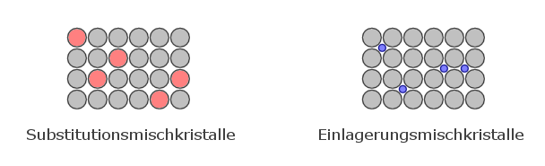
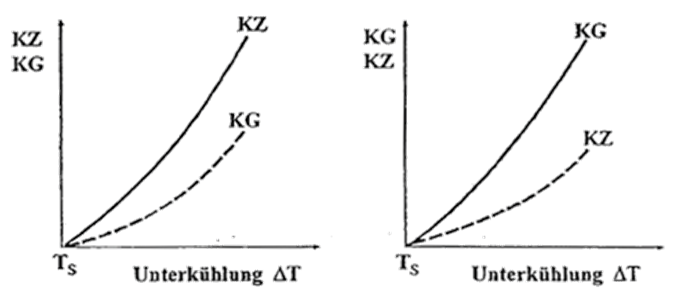
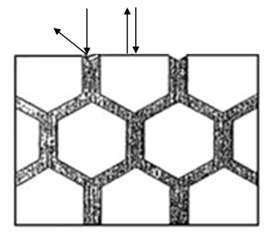
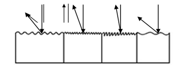

## Vorlesung Werkstofftechnik - Legierungsbildung
Prof. Dr.-Ing.  Christian Willberg
Hochschule Magdeburg-Stendal

Kontakt: christian.willberg@h2.de
Teile des Skripts sind von \
Prof. Dr.-Ing. Jürgen Häberle übernommen

---

<!--paginate: true-->

# Inhalte
- Grundbegriffe
- Kristallbildung
- Zustandsdiagramme

---

# Begriffe

## Legierung
- von "ligare" - zusammenbinden, verbinden, vereinigen
- Gemisch aus mehreren Atomsorten (_Komponenten_) mit _metallischem Charakter_
- Komponenten
  - meist metallisch (Cu, Ni)
  - nicht metallisch (C, P, S, N, O)
- Variationen
  - welche Komponenten
  - Zahl der Komponenten
  - Konzentration der Komponenten
---

## Chemische Zusammensetzung oder Konzentration
**Massenanteil, Gewichtsanteil, Massenprozent (Synonym)**
$\frac{m_1}{\sum_i m_{i}}\cdot 100 = m_{1-rel}$ in [%]
Bsp. $m_{Cu-rel}=\frac{m_{Cu}}{m_{Cu}+m_{Fe}}\cdot 100$

Massen $m$ von Komponenten sind unterschiedlich

**Atomanteil**

$\frac{n_1}{\sum_i n_{i}}\cdot 100 = n_{1-rel}$ in [%]
Bsp. $n_{Cu-rel}=\frac{n_{Cu}}{n_{Cu}+n_{Fe}}\cdot 100$

Wenn Massen $m$ von Komponenten ähnlich sind, dann sind $n_{rel}$ und $m_{rel}$ gleich. 

---

## Übung

1 kg Legierung 25% Ni - 75% Cu.

Wieviel Masse hat Cu und Ni für den Massenanteil und den Atomanteil?

---
## Lösung

Massenanteil

$m_{Ni}=0.75\cdot 1kg = 0.75 kg$
$m_{Cu}=0.25\cdot 1kg = 0.25 kg$

Atomanteil

$A_{Cu}= 63.54 u$ - Atomare Masseneinheit $u = 1.66\cdot 10^{-27}kg$
$A_{Ni}= 58.69 u$
$m = n_{Cu}A_{Cu}+n_{Ni}A_{Ni}$
$n_{Cu} = 0.25n$, $n_{Ni} = 0.75n$
$m=(0.25A_{Cu}+0.75A_{Ni})n$
$n = \frac{m}{0.25A_{Cu}+0.75A_{Ni}}=1.00565E+25$
$m_{Cu}=n_{Cu}A_{Cu}=0.2449kg$
$m_{Ni}=n_{Ni}A_{Ni}=0.7551kg$

---

## Phase

Bekannt im Bezug auf den Aggregatzustand (fest, flüssig, gasförmig, plasmaförmig)

**Allgemeine Definition**
Unter Phase versteht man einen chemisch und physikalisch gleichartigen homogenen Bestandteil einer Legierung oder von Materie überhaupt.

---

Phasenänderungen sind unterteilbar in 
- Umwandlungen
- Ausscheidungen

---

## Umwandlungen

- instabile Gittermodifikationen wandeln sich in stabile um
- unterhalb einer Gleichgewichtstemperatur (bspw. $\gamma-FE$ in $\alpha-FE$)
- bei Legierungen kann sich die Mischkristallkonfiguration ändern. Dann ändert sich die Konzentration (bspw. $\gamma-MK$ in $\alpha-MK$)

---

## Auscheidungen
- Löslichkeit nimmt ab (Änderung der Temperatur)
- Phasen (eine oder mehre) scheiden aus dem Mischkritall aus
- Erfordert einen Massentransport (Diffusion) -> phys. Arbeit nötig (Wärme) und Zeit

---

## Diffusion

- Diffusion allgemein ist temperatur- und zeitabhängig
- es findet ein Massentransport statt
Beschrieben durch das 1. Ficksche Gesetz
$dm_A=-D\frac{dc_A}{dx}Sdt$
mit 
$D=D_0exp(-\frac{Q_A}{RT})$
- $D_0$ - Diffusionskonstante
- $Q_A$ - Aktivierungsenergie / Wärme

_Modell kann auch verwendet werden, um Diffusion von Gasen aus Tanks zu beschreiben_

---

Einphasigkeit

- reines Aluminium
- reines Eisen
- Wasser

Zweiphasigkeit

- Nebel
- übersättigte Lösungen

Mischkristall

- Ein Mischkristall ist ein chemisch homogener, gleichartiger Kritall, der aus mehreren Atomsorten aufgebaut ist.

---
# Mischkristalle

- mindestens 2 Atomsorten
- Heterogenität wird erst im Bereich atomarer Abmessungen sichtbar
- die meisten Metalle können in ihrem Gitterverband eine bestimmte Menge andere Atome aufnehmen
- dies führt zu "Verspannungen" im Gitter

- "solid solution" (fest Lösung)

---

## Mischkristalle - Arten

 
    <a href="http://anorganik.chemie.vias.org/img/mischkristalle.png" style="color: blue;">Bildquelle</a>

Subsitutionsmischkristall
- ähnlicher chemischer Charakter
- ähnlicher Durchmesser
- gleiches Kritallgitter

---

## Mischkristalle - Arten

 
    <a href="http://anorganik.chemie.vias.org/img/mischkristalle.png" style="color: blue;">Bildquelle</a>

Einlagerungsmischkristall
- kleinere Atome
- in Lücken des Kristallgitters eingelagert (Einlagerungs- oder Zwischengitteratome) 
- zweite Komponente ist gelöst
- Durchmesserverhältnis $f=\frac{d}{D}\leq 0.41$
_Beide Arten sind einphasig._

---

## Intermetallische Phase / intermediäre Kristalle

-	meist komplizierter Gitteraufbau, unabhängig von Ausgangsgittern (mehrere hundert Atome)
- zwischen den Atomsorten gibt es starke Anziehungskräfte
- neben der metallischen Bindung wirken die kovalenten und Ionenbindungen
-> Bindungsform zwischen chemisch und metallisch -> intermediate

---

- sie sind sehr hart und spröde
- technische Legierungen enthalten in der Regel weniger als 10%
- wichtige Untergruppe -> interstitiellen Phasen (Einlagerungsstrukturen)
  - Carbide, Boride, Nitride
  - wird in Werkzeugstählen und hitzebeständigen Stählen eingesetzt

---

# Gefüge der Werkstoffe

- durch Art, Größe, Form und Orientierung und Anordnung der einzelnen Bestandteile (Phasen), wie Kristallite (Körner), amorphe Bereiche, Verstärkungs- bzw. Füllstoffe, charakterisiert

---

## Entstehung des Gefüges

Schmelze  → Abkühlung / Unterkühlung
↓
Keimbildung (homogen + heterogen)
↓
Keimwachstum → Kristallisation
↓
Kristallitbildung (Kornbildung mit Korngrenzen)
↓
∑ aller Körner und Korngrenzen 	=>    Gefüge

---

## Keimbildung
- Erstarren findet nicht gleichmäßig statt -> Bildung von Keimen
- homogen (arteigenen) oder heterogen (artfremden) 
- Wachstum der Keime (Kristallwachstum)  bis gesamte Schmelze erstarrt ist
- Es bestehen Zusammenhänge zwischen der Keimzahl (KZ) und der Kristallisationsgeschwindigkeit (KG) einer-seits und der Unterkühlung ΔT andererseits.

---
## Einflussparameter auf die Ausbildung der Korngröße

a) → feinkörniges Gefüge  $\qquad$	b)  → grobkörniges Gefüge

- große Zahl von Keimen -> feinkörniges Gefüge
- schnelles Kristallwachstum und geringe KZ -> grobkörniges Gefüge

---
## Begriffe
Korn 
- Keime haben Wachstum abgeschlossen und stoßen aneinander
- Kristallorientierung zwischen benachbarten Körnern ist in der Regel unterschiedlich
- Form und Größe wird durch den Wärmfluss bestimmt
  - gleichmäßig in alle Richtungen - _globulistisch_
  - Vorzugsrichtung des Wärmeflusses - _transkristalline Erstarrung_

Korngrenze 
- Übergangsflächen zwischen Körnern

---

## Gießen oder Stranggießen

- Beim Gießen oder Stranggießen in eine Metallform (Kokille) bildet sich eine Gussstruktur in drei Zonen, meist mit einer deutlichen Abgrenzung zueinander:

---

1.	Feinkörnige globulare Randzone

- starke Unterkühlung der Schmelze an der Kokillenwand
- Ausbildung von zahlreichen Kristallkeime -> kleine, gleichmäßige Kristallite

---

2.	Transkristallisationszone mit stängelförmigen, sehr groben Kristalliten

- gerichtetes Wachstum von Kristallite (Stängelkristalle), bei denen die kristallografische Orientierung mit der Richtung des Wärmegefälles übereinstimmt;
- die dadurch aufgetretene Orientierung => Gusstextur 

---

3.	Globulare Kernzone
- Verunreinigungen, werden von den Stängelkristallen vor sich her geschoben und reichern sich  im Kern an
- hohen Anzahl von artfremden Keimen 
- globulare feinkörnige Kernzone 
- Bei sehr reinen Metallen liegt in der dritten Zone allerdings ein grobkörniges Gefüge vor

---

## Schweißen

---
 
# Gefügenachweise

- Im Allgemeinen sind die einzelnen Kristallite (Körner) in einem Werkstoff nicht ohne weiteres sichtbar. 
- Für werkstoffwissenschaftliche Untersuchungen ist es jedoch notwendig, die vorhandene Mikrostruktur zu analysieren. 
- Arbeitsschritte:
  - gezielte Probenentnahme 
  - Schleifen und Polieren der Probe
  - Ätzen der Oberfläche

---

## Mikroschliffe
- sorgfältig präparierte Schlifffläche kann mittels eines Licht- oder Elektronenrastermikroskops betrachtet werden. 
- Das Elektronenrastermikroskop weist neben der wesentlich stärkeren Auflösung auch eine höhere Schärfentiefe auf.

---

## Ätzungen
Das Ätzen zur Gefügeentwicklung kann auch als ein Korrosionsvorgang bezeichnet werden.

Korngrenzenätzung
- bevorzugtes auflösen von Korngrenzen

---

Kornflächenätzung
- nebeneinander liegende Kornschnittflächen werden unterschiedlich  stark aufgeraut bzw. mit Oxidschichten bedeckt
- Körner reflektieren das Licht unterschiedlich 

---

## Makroschliffe

Mit Hilfe der Makroätzungen können nur Gefügeerscheinungen untersucht werden, die mit bloßem Auge oder einer Lupe zu erkennen sind. 
Folgende Nachweise sind möglich:
-	Seigerungen und deren Lokalisierung: Ätzungen nach Heyn und Oberhoffer oder Baumannabdruck
-	Güte von Schweißverbindungen: Adlerätzung
-	Entwicklung von Kraftwirkungslinien nach plastischer Verformung: Ätzung nach Fry

---

## Begriffe für die qualitative und quantitative Beschreibung von Gefügen

Metallographie - Metalle
Keramographie - Keramiken
Plastographie - Polymerwerkstoffe

---

## Korngrenzen
[Video zum Kritallwachstum](https://youtu.be/xlxFVIw_Esc?si=Dqws4vs14SN5CU4y&t=7)
- nichtlösbare und/oder Verunreinigungen werden von der Kristallfronten vor sich hergeschoben -> **Korngrenzensubstanzen**

---

## Korngrenzensubstanzen
Fall 1:
Korngrenzensubstanz ist verformbar -> Materialverhalten wird durch Körner dominiert

Fall 2: 
Korngrenzensubstanz sind spröde -> Materialverhalten wird durch Korngrenzen dominiert -> Versprödung

---

## Referencen

Rainer Schwab: Werkstoffkunde und Werkstoffprüfung für Dummies, 2019; ISBN-10 352771538X
[Grundlagen der Metallkunde](https://wiki.arnold-horsch.de/index.php/Grundlagen_der_Metallkunde)

