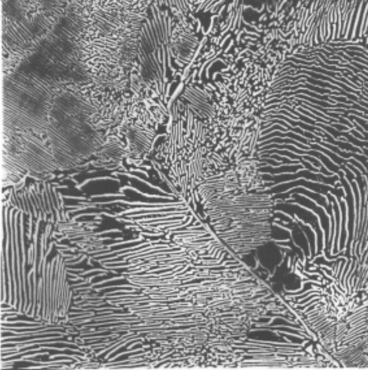

## Vorlesung Werkstofftechnik - Legierungsbildung
Prof. Dr.-Ing.  Christian Willberg
Hochschule Magdeburg-Stendal

Kontakt: christian.willberg@h2.de
Teile des Skripts sind von \
Prof. Dr.-Ing. Jürgen Häberle übernommen

---

<!--paginate: true-->

# Inhalte
- Grundbegriffe
- Kristallbildung
- Zustandsdiagramme

---

# Begriffe

## Legierung
- von "ligare" - zusammenbinden, verbinden, vereinigen
- Gemisch aus mehreren Atomsorten (_Komponenten_) mit _metallischem Charakter_
- Komponenten
  - meist metallisch (Cu, Ni)
  - nicht metallisch (C, P, S, N, O)
- Variationen
  - welche Komponenten
  - Zahl der Komponenten
  - Konzentration der Komponenten
---

## Chemische Zusammensetzung oder Konzentration
**Massenanteil, Gewichtsanteil, Massenprozent (Synonym)**
$\frac{m_1}{\sum_i m_{i}}\cdot 100 = m_{1-rel}$ in [%]
Bsp. $m_{Cu-rel}=\frac{m_{Cu}}{m_{Cu}+m_{Fe}}\cdot 100$

Massen $m$ von Komponenten sind unterschiedlich

**Atomanteil**

$\frac{n_1}{\sum_i n_{i}}\cdot 100 = n_{1-rel}$ in [%]
Bsp. $n_{Cu-rel}=\frac{n_{Cu}}{n_{Cu}+n_{Fe}}\cdot 100$

Wenn Massen $m$ von Komponenten ähnlich sind, dann sind $n_{rel}$ und $m_{rel}$ gleich. 

---

## Übung

1 kg Legierung 25% Ni - 75% Cu.

Wieviel Masse hat Cu und Ni für den Massenanteil und den Atomanteil?

---
## Lösung

Massenanteil

$m_{Ni}=0.75\cdot 1kg = 0.75 kg$
$m_{Cu}=0.25\cdot 1kg = 0.25 kg$

Atomanteil

$A_{Cu}= 63.54 u$ - Atomare Masseneinheit $u = 1.66\cdot 10^{-27}kg$
$A_{Ni}= 58.69 u$
$m = n_{Cu}A_{Cu}+n_{Ni}A_{Ni}$
$n_{Cu} = 0.25n$, $n_{Ni} = 0.75n$
$m=(0.25A_{Cu}+0.75A_{Ni})n$
$n = \frac{m}{0.25A_{Cu}+0.75A_{Ni}}=1.00565E+25$
$m_{Cu}=n_{Cu}A_{Cu}=0.2449kg$
$m_{Ni}=n_{Ni}A_{Ni}=0.7551kg$

---

## Phase

Bekannt im Bezug auf den Aggregatzustand (fest, flüssig, gasförmig, plasmaförmig)

**Allgemeine Definition**
Unter Phase versteht man einen chemisch und physikalisch gleichartigen homogenen Bestandteil einer Legierung oder von Materie überhaupt.

---

Phasenänderungen sind unterteilbar in 
- Umwandlungen
- Ausscheidungen

---

## Umwandlungen

- instabile Gittermodifikationen wandeln sich in stabile um
- unterhalb einer Gleichgewichtstemperatur (bspw. $\gamma-FE$ in $\alpha-FE$)
- bei Legierungen kann sich die Mischkristallkonfiguration ändern. Dann ändert sich die Konzentration (bspw. $\gamma-MK$ in $\alpha-MK$)

---

## Auscheidungen
- Löslichkeit nimmt ab (Änderung der Temperatur)
- Phasen (eine oder mehre) scheiden aus dem Mischkritall aus
- Erfordert einen Massentransport (Diffusion) -> phys. Arbeit nötig (Wärme) und Zeit

---

## Diffusion

- Diffusion allgemein ist temperatur- und zeitabhängig
- es findet ein Massentransport statt
Beschrieben durch das 1. Ficksche Gesetz
$dm_A=-D\frac{dc_A}{dx}Sdt$
mit 
$D=D_0exp(-\frac{Q_A}{RT})$
- $D_0$ - Diffusionskonstante
- $Q_A$ - Aktivierungsenergie / Wärme

_Modell kann auch verwendet werden, um Diffusion von Gasen aus Tanks zu beschreiben_

---

Einphasigkeit

- reines Aluminium
- reines Eisen
- Wasser

Zweiphasigkeit

- Nebel
- übersättigte Lösungen

Mischkristall

- Ein Mischkristall ist ein chemisch homogener, gleichartiger Kritall, der aus mehreren Atomsorten aufgebaut ist.

---
# Mischkristalle

- mindestens 2 Atomsorten
- Heterogenität wird erst im Bereich atomarer Abmessungen sichtbar
- die meisten Metalle können in ihrem Gitterverband eine bestimmte Menge andere Atome aufnehmen
- dies führt zu "Verspannungen" im Gitter

- "solid solution" (fest Lösung)

---

## Mischkristalle - Arten

 
    <a href="http://anorganik.chemie.vias.org/img/mischkristalle.png" style="color: blue;">Bildquelle</a>

Subsitutionsmischkristall
- ähnlicher chemischer Charakter
- ähnlicher Durchmesser
- gleiches Kritallgitter

---

## Mischkristalle - Arten

 
    <a href="http://anorganik.chemie.vias.org/img/mischkristalle.png" style="color: blue;">Bildquelle</a>

Einlagerungsmischkristall
- kleinere Atome
- in Lücken des Kristallgitters eingelagert (Einlagerungs- oder Zwischengitteratome) 
- zweite Komponente ist gelöst
- Durchmesserverhältnis $f=\frac{d}{D}\leq 0.41$
_Beide Arten sind einphasig._

---

## Intermetallische Phase / intermediäre Kristalle

-	meist komplizierter Gitteraufbau, unabhängig von Ausgangsgittern (mehrere hundert Atome)
- zwischen den Atomsorten gibt es starke Anziehungskräfte
- neben der metallischen Bindung wirken die kovalenten und Ionenbindungen
-> Bindungsform zwischen chemisch und metallisch -> intermediate

---

- sie sind sehr hart und spröde
- technische Legierungen enthalten in der Regel weniger als 10%
- wichtige Untergruppe -> interstitiellen Phasen (Einlagerungsstrukturen)
  - Carbide, Boride, Nitride
  - wird in Werkzeugstählen und hitzebeständigen Stählen eingesetzt

---

# Gefüge der Werkstoffe

- durch Art, Größe, Form und Orientierung und Anordnung der einzelnen Bestandteile (Phasen), wie Kristallite (Körner), amorphe Bereiche, Verstärkungs- bzw. Füllstoffe, charakterisiert

---

## Entstehung des Gefüges

Schmelze  → Abkühlung / Unterkühlung
↓
Keimbildung (homogen + heterogen)
↓
Keimwachstum → Kristallisation
↓
Kristallitbildung (Kornbildung mit Korngrenzen)
↓
∑ aller Körner und Korngrenzen 	=>    Gefüge

---

## Keimbildung
- Erstarren findet nicht gleichmäßig statt -> Bildung von Keimen
- homogen (arteigenen) oder heterogen (artfremden) 
- Wachstum der Keime (Kristallwachstum)  bis gesamte Schmelze erstarrt ist
- Es bestehen Zusammenhänge zwischen der Keimzahl (KZ) und der Kristallisationsgeschwindigkeit (KG) einer-seits und der Unterkühlung ΔT andererseits.

---
## Einflussparameter auf die Ausbildung der Korngröße

a) → feinkörniges Gefüge  $\qquad$	b)  → grobkörniges Gefüge

- große Zahl von Keimen -> feinkörniges Gefüge
- schnelles Kristallwachstum und geringe KZ -> grobkörniges Gefüge

---
## Begriffe
Korn 
- Keime haben Wachstum abgeschlossen und stoßen aneinander
- Kristallorientierung zwischen benachbarten Körnern ist in der Regel unterschiedlich
- Form und Größe wird durch den Wärmfluss bestimmt
  - gleichmäßig in alle Richtungen - _globulistisch_
  - Vorzugsrichtung des Wärmeflusses - _transkristalline Erstarrung_

Korngrenze 
- Übergangsflächen zwischen Körnern

---

## Gießen oder Stranggießen

- Beim Gießen oder Stranggießen in eine Metallform (Kokille) bildet sich eine Gussstruktur in drei Zonen, meist mit einer deutlichen Abgrenzung zueinander:

---

1.	Feinkörnige globulare Randzone

- starke Unterkühlung der Schmelze an der Kokillenwand
- Ausbildung von zahlreichen Kristallkeime -> kleine, gleichmäßige Kristallite

---

2.	Transkristallisationszone mit stängelförmigen, sehr groben Kristalliten

- gerichtetes Wachstum von Kristallite (Stängelkristalle), bei denen die kristallografische Orientierung mit der Richtung des Wärmegefälles übereinstimmt;
- die dadurch aufgetretene Orientierung => Gusstextur 

---

3.	Globulare Kernzone
- Verunreinigungen, werden von den Stängelkristallen vor sich her geschoben und reichern sich  im Kern an
- hohen Anzahl von artfremden Keimen 
- globulare feinkörnige Kernzone 
- Bei sehr reinen Metallen liegt in der dritten Zone allerdings ein grobkörniges Gefüge vor

---

## Schweißen

---
 
# Gefügenachweise

- Im Allgemeinen sind die einzelnen Kristallite (Körner) in einem Werkstoff nicht ohne weiteres sichtbar. 
- Für werkstoffwissenschaftliche Untersuchungen ist es jedoch notwendig, die vorhandene Mikrostruktur zu analysieren. 
- Arbeitsschritte:
  - gezielte Probenentnahme 
  - Schleifen und Polieren der Probe
  - Ätzen der Oberfläche

---

## Mikroschliffe
- sorgfältig präparierte Schlifffläche kann mittels eines Licht- oder Elektronenrastermikroskops betrachtet werden. 
- Das Elektronenrastermikroskop weist neben der wesentlich stärkeren Auflösung auch eine höhere Schärfentiefe auf.

---

## Ätzungen
Das Ätzen zur Gefügeentwicklung kann auch als ein Korrosionsvorgang bezeichnet werden.

Korngrenzenätzung
- bevorzugtes auflösen von Korngrenzen

---

Kornflächenätzung
- nebeneinander liegende Kornschnittflächen werden unterschiedlich  stark aufgeraut bzw. mit Oxidschichten bedeckt
- Körner reflektieren das Licht unterschiedlich 

---

## Makroschliffe

Mit Hilfe der Makroätzungen können nur Gefügeerscheinungen untersucht werden, die mit bloßem Auge oder einer Lupe zu erkennen sind. 
Folgende Nachweise sind möglich:
-	Seigerungen und deren Lokalisierung: Ätzungen nach Heyn und Oberhoffer oder Baumannabdruck
-	Güte von Schweißverbindungen: Adlerätzung
-	Entwicklung von Kraftwirkungslinien nach plastischer Verformung: Ätzung nach Fry

---

## Begriffe für die qualitative und quantitative Beschreibung von Gefügen

Metallographie - Metalle
Keramographie - Keramiken
Plastographie - Polymerwerkstoffe

---

# Zustandsdiagramme

- auch Phasendiagramm -phase diagram-
- stellt den Zustand von Legierungen und Stoffgemischen in Abhängigkeit von der chemischen Zusammensetzung, Temperatur und ggf. dem Druck dar
- Zustand meint die auftretenden Phasen (alle festen, flüssige, gasförmige)

---
## Achtung!

Zustandsdiagramme sind Gleichgewichtsdiagramme. 
Sie haben nur Gültigkeit bei einer sehr langsamen 
Abkühlung aus dem schmelzflüssigen Zustand bis hin zur 
Raumtemperatur, bei der sich das Gleichgewicht zwischen 
den Phasen (an bzw. zwischen den Phasengrenzlinien) einstellen kann. 

---

---

## Gibbsche Phasenregel

$F = n  - P + 2$
(für Gase und Flüssigkeiten)
F = Anzahl der Freiheitsgrade; n = Anzahl der Komponenten; P = Anzahl der Phasen

bei konstantem Druck (feste Stoffe) 	
        
$F = n  - P + 1$
        
Damit ergibt sich für die Anwendung dieser Gesetzmäßigkeiten bei der Abkühlungs- und Erwär-mungskurve für metallische Systeme

F = 0		ein Haltepunkt und
F = 1		ein Knickpunkt.

---

## Löslichkeiten

Unlöslich

- zu große Unterschiede bei den Atomdurchmessern
- Kristallgitter weichen voneinander ab
- Komponenten sind chemisch sehr unterschiedlich

Löslich
- kaum Unterschiede bei den Atomdurchmessern
- Kristallgitter sind identisch
- Komponenten sind chemisch sehr nah beieinander

---
## Beispiel aus der eigenen Erfahrung
- Ölfilm auf Wasser ist nicht löslich und es findet eine Trennung aufgrund der unterschiedlichen Dichte statt
- Salz- / Zuckerkristalle in Wasser werden vollständig gelöst und ist nicht mehr sichtbar

---

- Die Phasen bzw. Phasengrenzlinien können als ein Zustandsdiagramm dargestellt werden
- Die Anzahl der miteinander im Gleichgewicht stehenden Phasen ist gesetzmäßig verknüpft mit der Zahl der an der Legierungsbildung beteiligten Komponenten und der Zahl der Freiheitsgrade über die Gibbsche Phasenregel
- Ein Freiheitsgrad beinhaltet die mögliche Veränderung von Zustandsvariablen, ohne das Gleichgewicht, d.h. die Anzahl der Phasen, zu ändern (Bewegung in T oder der Konzentration)
- Die Anzahl der frei wählbaren Zustandsvariablen wird  nach der Phasenregel bestimmt

---

---

---

---

---

## Eutektischer Entmischung

- Komponenten sind **löslich** im flüssigen Zustand
- Komponenten sind **unlöslich** im festen Zustand

---

## Korngrenzen
[Video zum Kritallwachstum](https://youtu.be/xlxFVIw_Esc?si=Dqws4vs14SN5CU4y&t=7)
- nichtlösbare und/oder Verunreinigungen werden von der Kristallfronten vor sich hergeschoben -> **Korngrenzensubstanzen**

---

## Korngrenzensubstanzen
Fall 1:
Korngrenzensubstanz ist verformbar -> Materialverhalten wird durch Körner dominiert

Fall 2: 
Korngrenzensubstanz sind spröde -> Materialverhalten wird durch Korngrenzen dominiert -> Versprödung

---

## Eutektische Reaktion

-  bei einer Konzentration erstarren aus der Schmelze S bei konstanter Temperatur (Eutektikale) A- und B-Kristalle zu einem feinkristallinen Kristallgemisch (Eutektikum)
- eutektische Gefüge besitzt oft eine schicht- oder lamellenartige Struktur
- Legierungen anderer Konzentrationen scheiden vor Erreichen der Eutektikale (Haltepunkt bei der Eutektischen Reaktion) die überwiegende Komponente aus (A- oder B-Kristalle), so dass sich die Konzentration der verbleibenden Schmelze der eutektischen Zusammensetzung annähert. 
- die Eutektikale bildet die Soliduslinie des gesamten Systems

---

## System mit Mischungslücken
- Komponenten sind **löslich** im flüssigen Zustand
- Komponenten sind **begrenzt löslich** im festen Zustand

---

---

_Löslichkeits- oder Sättigungslinien_
- Linien, die die Einphasengebiete ($\alpha$, $\beta$) von dem Gebiet der Kristallgemische aus Mischkristal-len ($\alpha+\beta$) abgrenzen
Sonderfall:
- ein System von Mischkristallen bilden Einlagerungsmischkristalle 
- Die Konzentrationsachse endet dann mit der Konzentration der Sättigung der Komponente B im Gitter der Komponente A
- Das Einphasengebiet der Komponente B kann dann nicht existieren.

---

## Systeme mit Peritektikum (mit peritektischer Entmischung) 

-  weit auseinander liegende Schmelz-/Erstarrungstemperaturen der beteiligten Komponenten sind charakteristisch.
- Bei Abkühlung aus der Schmelze bildet sich ein Mischkristall $\alpha$
- bildet bei konstanter Temperatur (entsprechend der **Eutektikalen**) mit der Schmelze reagierend eine zweite Mischkristallart $\beta$ bildet. 
- bei einer peritektischen Reak-tion entstehen aus der Schmelze und bereits ausgeschiedenen $\alpha$-Mischkristallen bei gleich bleibender Temperatur neue $\beta$-Mischkristalle.

---

---

## Realdiagramme
- die bisherigen Digramme waren Idealdigramme und treten so nicht wirklich auf
- Eisen-Kohlenstoff-Diagramm (EKD) ist das wichtigste Realdiagramm
- Grundmetall ist Eisen -> Stahl oder Eisenguss
- das EKD setzt sich aus den Idealdiagrammen - dem peritektischen, eutektischen und eutektoiden Teildiagramm - zusammen

---

- Man kann je nach Erscheinungsform des Kohlenstoffs zwischen dem stabilen System Fe-C, in dem Kohlenstoff als Graphit, und dem metastabilen System Fe-Fe3C, in dem Kohlenstoff gebunden als Fe3C (intermediäre Phase Zementit) vorliegt, unterscheiden. 
- Stabil bedeutet, dass der Kohlenstoff in Form von Graphit nicht weiter zerlegt werden kann, Fe3C aber bei langzeitigem Glühen in Eisen und Temperkohle zerfällt. 
- Das metastabile System stellt gewissermaßen ein relatives Minimum der Gesamtenergie des Systems dar. Für techni-sche Belange kann es als „hinreichend stabil“ bewertet werden.

---

# Eisen-Kohlenstoffdiagramm (EKD)

- wichtigstes ZSD
- Eisen ist der wichtigste Werkstoff im Maschinenbau. 

Gründe sind
- geringe Kosten
- hohe Festigkeit und elastische Steifigkeit
- Vielzahl von möglichen Legierungen
- Verfügbarkeit
- Gießbarkeit, Schweißbarkeit, etc.

[Erklärvideo für das Eisen Kohlenstoff Diagramm](https://www.youtube.com/watch?v=oJqvnKhnsg0&t=1s)

---

---
## Wichtige Gleichgewichtslinien

ABCD 	Liquiduslinie			
AHIECF 	Soliduslinie			
ECF 		Eutektikale			
PSK 		Eutektoide			
ES, PQ		Sättigungslinien				MOSK		Curie-Linie
QPSECD 	Bildung/Auflösung Fe3C	

---

## Punkte im Zustandsdiagramm
S - eutektoider Punkt
C - eutektischer Punkt
G -	$\alpha$ / $\gamma$ - Umwandlungspunkt des reinen Eisens
E -	Punkt max. C-Löslichkeit im $\alpha$ - MK
P - Punkt max. C-Löslichkeit im $\gamma$ - MK
u. a. m. (vgl. Fe-Fe3C - Diagramm)

---

Folgende Grenzlinientemperaturen (Umwandlungstemperaturen) werden benutzt: 

A: 	arreter (anhalten)
r:	refroidir (abkühlen)
c:	chauffer (erwärmen)
e:	équilibre (Gleichgewicht)

Ac1: 723°C
Ac3: abhängig vom C-Gehalt

---

# Phasen- und Gefüge im System-Eisen-Kohlenstoff
# Mischkristalle

---
## $\alpha$-Mischkristall (krz)
- Gefügebezeichnung Ferrit ($\alpha$-Ferrit)
- rein ferritisches Gefüge besitzt geringe Härte/Festigkeit, aber hohe Duktilität (Zähigkeit)
- Max. C-Löslichkeit: nur 0,02 % 

---
## Exkurs Härte / Festigkeit
Im Detail kommt das später.
Festigkeit 
- Maß der maximalen Beanspruchbarkeit bis Versagen
- Kraft pro Querschnittsfläche

Härte 
- mechanischer Widerstand gegen mechanisches Eindringung eines anderen Körpers 
- Maß für die Verschleißbeständigkeit

---

## $\delta$-Mischkristall (krz)
 - $\delta$-Ferrit ist nur oberhalb von 1392°C stabil  
 - technisch von untergeordneter Bedeutung
 - Max. C-Löslichkeit: 0.12 %

---

## $\gamma$-Mischkristall (kfz)

- Gefügebezeichnung Austenit
- scheidet sich oberhalb der G-S-E-Linie  aus; 
  - durch Legierungszusätze (Ni, Mn) und Abschrecken auch bei Raumtemperatur beständig (austenitische Stähle)
- unmagnetisch, zäh und durch Kaltverfestigung härtbar (Mangan-, Nickel-, Chrom-Nickel-Stähle)
- hohe Warmfestigkeit, gute Korrosions- und Zunderbeständigkeit
- Max. C-Löslichkeit: 2.06 %

---

## Intermediäre Phase
Zementit (Eisencarbid Fe3C); 6.67 Masse-% C-Gehalt

- Primärzementit:	
primäre Kristallisation aus der Schmelze (Linie CD)

- Sekundärzementit: 
Ausscheidung aus dem Austenit (Linie ES)

- Tertiärzementit:	
Ausscheidung aus dem Ferrit (Linie PQ)

---

## Kristallstruktur

- orthorhombischen Elementarzelle 
  -  zwölf Eisen- und vier Kohlenstoffatome
  - die Kohlenstoffatome sind relativ unregelmäßig (zweifach überkappt trigonal-prismatisch) von acht Eisenatomen umgeben

---

- Zementit ist hart und spröde
- überwiegende Zahl der technischen Eisen-Kohlenstoff-Legierungen erstarrt unter Bildung von Zementit

---

# Phasengemische/Gemische von Mischkristallen

## Perlit (Eutektoid)
- Gefüge aus Zementit und Ferrit (= Phasengemisch)
- entsteht durch den "eutektoiden" Zerfall des Austenits ($\gamma$-Mischkristall) mit 0.8% C bei 723°C
- eutektoider Punkt S: hier liegen 100% Perlit vor
- relativ hohe Härte, relativ hohe Festigkeit, schlechte Umformbarkeit, geringe Zähigkeit

---

- lamellenartiger Aufbau (Schichten von $\alpha$-Mk und Fe3C-Kristallen) .
- häufig spricht man von einer "Perlitstufe", die - gemessen am Lamellenabstand - in Perlit, fein-streifigen  und feinststreifigen Perlit unterteilt wird. 

---

## Ledeburit (Eutektikum) 

- Gefüge aus Austenit und Zementit bzw. „zerfallenem“ Austenit und Zementit (= Phasengemisch), Kohlenstoffgehalt 4,3 %, Schmelztemperatur 1147°C 
- Eutektischer Punkt C: hier liegen 100% Ledeburit vor
- Unterscheidung zwischen Ledeburit I (dicht unterhalb 1.147 °C)
  -  um ein Gefüge aus Austenit und Zementit handelt

- Ledeburit II (Raumtemperatur)
  - aus Zementit I mit ankristallisiertem Sekundärzementit (aus dem Austenit bei sinkender Temperatur ausgeschieden) und (bei langsamer Abkühlung) aus Perlit
  -  Der Perlit entsteht durch den eutektoiden Zerfall des Austenits aus dem Ledeburit I bei 723 °C. 

---
- bei schnellerer Abkühlung kann anstelle des Perlit auch Bainit bzw. bei sehr schneller Abkühlung Martensit vorliegen. 
- Ledeburit ist schlecht umformbar, hat sehr geringe Duktilität. 
 - bei Raumtemperatur  feines Gemenge von Fe3C-Kristalliten und Perlitbereichen im Auflichtmikroskop als charakteristische Pantherfellstruktur sichtbar.

---

Die Eigenschaften der Legierung (z.B. Stahl, Gusseisen) wird durch die Art der beteiligten Phasen (z.B. $\alpha$-Mk, Fe3C), ihren mengenmäßigen Anteil (z. B. abhängig vom C-Gehalt) und die Art ihrer Verteilung im Gefüge bestimmt.

---
# Phasen- und Gefüge im Ungleichgewichtszustand

- Gleichgewichtszustände durch Diffusionsvorgänge dominiert
- bei schnelleren Temperaturänderungen wird die Kohlenstoffdiffusion, die zur Entmischung des Austenits erforderlich ist, behindert 
- Dadurch entstehen auch neuartige Gefügebestandteile, die nicht mehr dem Gleichgewichtszustand entsprechen
- führt zu "zwangsgelöstem" Kohlenstoff
---

## Martensit
- raumzentriertes Gitter tetragonal verzerrt („verspanntes Ferritgitter“)
- meist feinnadeliges, sehr hartes und sprödes Gefüge
- der im krz-Gitter des $\alpha$-Fe zwangsgelöste Kohlenstoff verzerrt das Gitter und weitet es tetragonal auf („diffusionsloses Umklappen“). 

---

## Bainit  

- anders als bei der Bildung von Martensit sind hier Umklappvorgänge im Kristallgitter und Diffusionsvorgänge gekoppelt
-  bildet sich im Temperaturbereich zwischen der Perlit- und der Martensitstufe bei Abkühlungsgeschwindigkeiten (für Martensitbildung zu niedrig; für die Perlitbildung zu hoch)

---
 ## Bainit  

- reiner Bainit lässt sich nur durch isotherme Abkühlung, z.B. beim Warmbadhärten, erzielen. 
- Vorteilhaft, wo bei einer Vergütung durch Abschrecken und Anlassen eine Härterissgefahr besteht. 
- Es hat sehr gute Festigkeits- und Zähigkeitseigenschaften.

---

# Eisen-Kohlenstoff-Legierungsbezeichnungen

| Kohlenstoffgehalt (Masse-%) | Bezeichnung               | Typ                                  |
|-----------------------------|---------------------------|--------------------------------------|
| 0.02 < C < 0.8              | (Kohlenstoff-) Stahl       | untereutektoide Stähle               |
| C = 0.8                     | (Kohlenstoff-) Stahl       | eutektoide Stähle                    |
| 0.8 < C < 2.06              | (Kohlenstoff-) Stahl       | übereutektoide Stähle                |
| 2.06 < C < 4.3              | Gusseisen                 | untereutektische Gusseisen           |
| C = 4.3                     | Gusseisen                 | eutektische Gusseisen                |
| 4.3 < C < 6.67              | Gusseisen                 | übereutektische Gusseisen            |

---

---

- Weiterhin wird unterschieden zwischen dem schwarzen Gusseisen (Grauguss), in dem der überschüssige Kohlenstoff in Form von Graphit, und dem weißen Gusseisen, in dem der Kohlenstoff in Form von Zementit vorkommt 
- Mit zunehmendem C-Gehalt steigen die Festigkeit und Härtbarkeit des Stahles, wogegen seine Dehnung, Schmiedbarkeit, Schweißbarkeit und Bearbeitbarkeit (durch spanabhebende Werkzeuge) verringert werden
- Der Korrosionswiderstand gegenüber Wasser, Säuren und heißen Gasen wird durch den Kohlenstoff praktisch nicht beeinflusst. 
- Für Kohlenstoffgehalte unter 0.25 Masse-% sind Stähle gut schweißbar

---

## Referencen

Rainer Schwab: Werkstoffkunde und Werkstoffprüfung für Dummies, 2019; ISBN-10 352771538X
[Grundlagen der Metallkunde](https://wiki.arnold-horsch.de/index.php/Grundlagen_der_Metallkunde)

