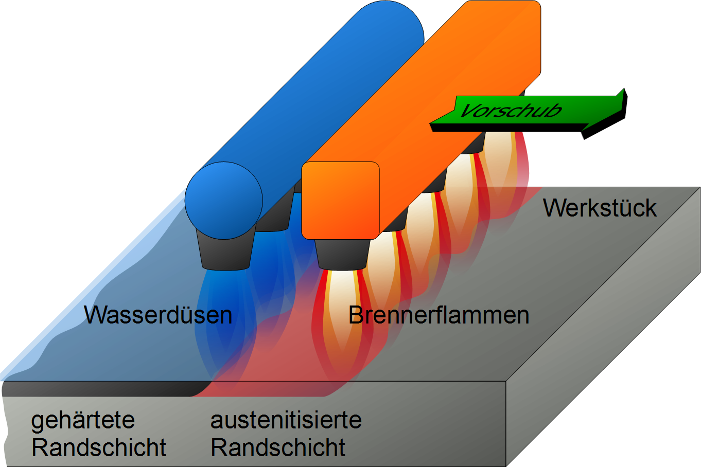
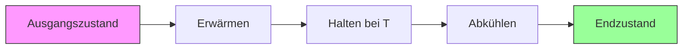

## Vorlesung Werkstofftechnik - Wärmebehandlung
Prof. Dr.-Ing.  Christian Willberg 

 
    <a href="https://wiki.arnold-horsch.de/images/3/36/Flamm-1.png" style="color: blue;">Bildreferenz</a>

Kontakt: christian.willberg@h2.de
Teile des Skripts sind von \
Prof. Dr.-Ing. Jürgen Häberle übernommen

---

<!--paginate: true-->

---

# Lernziele

Nach dieser Vorlesung können Sie:
- die wichtigsten Wärmebehandlungsverfahren benennen und erklären
- Glüh- und Härteverfahren unterscheiden
- ZTU-Diagramme lesen und interpretieren
- geeignete Verfahren für bestimmte Anwendungen auswählen
- die Auswirkungen auf Gefüge und Eigenschaften vorhersagen
- praktische Wärmebehandlungsprozesse planen

---

## Wärmebehandlung - Definition

**Wärmebehandlung** ist die gezielte Änderung der Werkstoffeigenschaften durch kontrollierte Temperaturführung

**Hauptverfahren**:
- Glühverfahren (langsame Abkühlung)
- Härteverfahren (schnelle Abkühlung)

**Charakterisierung**:
- Art des Erwärmens
- Haltetemperatur
- Haltedauer
- Art des Abkühlens (Ofen-, Luft-, Öl-, Wasserabkühlung)

---

# Hauptgruppen nach DIN 8580

- Urformen (Formgebung, Zusammenhalt schaffen)
- Umformen (Formänderung ohne Materialabtrag, Zusammenhalt beibehalten)
- Trennen (Formänderung durch Zerteilen oder Materialabtrag, Zusammenhalt vermindern)
- Fügen (Verbinden von Werkstücken, Zusammenhalt vermehren)
- Beschichten (Auftrag dünner Schichten)
- **Stoffeigenschaften ändern (z. B. durch Beeinflussung der Kristallstruktur)**

---

## Grundprinzip der Wärmebehandlung

**Wichtig**: Die Abkühlgeschwindigkeit bestimmt maßgeblich das resultierende Gefüge!

---

# Warum Wärmebehandlung?

---

## Ziele der Wärmebehandlung

**Mechanische Eigenschaften verbessern**:
- Verbesserung der Bearbeitbarkeit (Weichglühen)
- Verbesserung der mechanischen Eigenschaften (Vergüten von Stahl, Aushärten von Al-Legierungen)
- Verminderung des Verschleißes (Randschichthärten von Zahnrädern)
- Härtung von Werkzeugen

---

## Ziele der Wärmebehandlung (2)

**Gefüge und Spannungen optimieren**:
- Beseitigung von Kaltverfestigung (Rekristallisationsglühen)
- Abbau von Guss- oder Schweißspannungen (Spannungsarmglühen)
- Korngrößeneinstellung (Normal- oder Grobkornglühen)
- Homogenisierung (Diffusionsglühen)

---

## Wirtschaftliche Bedeutung

**Warum ist Wärmebehandlung wichtig?**

- ermöglicht Massenproduktion komplexer Bauteile
- kostengünstige Eigenschaftsanpassung
- Verlängerung der Lebensdauer
- Ermöglicht Leichtbau durch höhere Festigkeiten

**Beispiel**: Ein vergütetes Zahnrad ist 3-5× belastbarer als ein unbehandeltes!

---
# Eigenspannungen
## Definition und Entstehung
- **Eigenspannungen**: Spannungen ohne äußere Belastung
- Selbstausgleichende Spannungszustände im Material
- **Ursachen**:
  - Thermische Prozesse (Schweißen, Härten, ungleichmäßige Abkühlung)
  - Mechanische Bearbeitung (Umformen, Schleifen, Walzen)
  - Phasenumwandlungen (z.B. Martensitbildung mit Volumenänderung)
  - Plastische Verformung mit Gradienten

---

## Auswirkungen
- **Positiv**: Druckeigenspannungen erhöhen Ermüdungsfestigkeit
- **Negativ**: Zugeigenspannungen fördern Rissbildung und -wachstum
- Beeinflussen Verzug, Maßhaltigkeit und Korrosionsverhalten

## Klassifizierung nach Reichweite
- **1. Art**: Über mehrere Körner (makroskopisch)
- **2. Art**: Über ein Korn (zwischen Phasen/Körnern)
- **3. Art**: Über wenige Atomabstände (mikroskopisch)

---
# Verfestigungen

## Grundprinzip
- Verfestigung = Behinderung der Versetzungsbewegung
- Höhere Festigkeit durch Erhöhung der kritischen Schubspannung
- Verschiedene Mechanismen wirken gleichzeitig

---

# Hauptverfestigungsmechanismen (1)

**Kaltverfestigung**
- Vermehrung von Versetzungen durch plastische Verformung
- Versetzungen behindern sich gegenseitig
- Erhöht Festigkeit, reduziert Duktilität

**Mischkristallverfestigung**
- Fremdatome (C, Mn, Si) verzerren das Gitter
- Gitterverzerrungen als Hindernisse für Versetzungen
- Zwischengitter- oder Substitutionsplätze

---

# Hauptverfestigungsmechanismen (2)

**Korngrenzenverfestigung (Hall-Petch)**
- Korngrenzen als Versetzungsbarrieren
- Feineres Korn → höhere Festigkeit + Zähigkeit
- Einziger Mechanismus, der beides verbessert

**Ausscheidungshärtung**
- Kleine Teilchen (Karbide, Nitride) als Hindernisse
- Versetzungen müssen schneiden oder umgehen

**Martensitische Härtung**
- Übersättigte, verspannte Gitterstruktur
- Sehr hohe Festigkeit durch Kohlenstoff-Zwangslösung

---

## Übersicht Wärmebehandlungsverfahren

| Verfahren | Temperatur | Abkühlung | Hauptziel |
|-----------|------------|-----------|-----------|
| Spannungsarmglühen | 550-650°C | langsam | Spannungsabbau |
| Weichglühen | um Ac₁ | langsam | Weichmachen |
| Normalglühen | über Ac₃ | Luft | Kornfeinung |
| Härten | über Ac₃ | schnell | Härte erhöhen |
| Anlassen | 150-650°C | Luft | Zähigkeit erhöhen |
| Vergüten | Härten + Anlassen | kombiniert | Festigkeit + Zähigkeit |

---

---

| Verfahren | Temperatur | 
|-----------|------------|
| Spannungsarmglühen | 550-650°C | 
| Weichglühen | um Ac₁ |
| Normalglühen | über Ac₃ |
| Härten | über Ac₃ | 
| Anlassen | 150-650°C |
| Vergüten | Härten + Anlassen | 

---

# Glühverfahren

---

## Glühen - Grundprinzip

**Definition**: Langsames Abkühlen zum Erreichen eines Gleichgewichts- oder Nahgleichgewichtszustands

**Gemeinsame Merkmale**:
- kontrollierte Erwärmung
- definierte Haltezeit
- langsame Abkühlung (meist im Ofen)
- Annäherung an Gleichgewichtsgefüge

**Ziel**: Weiche, gut umformbare oder bearbeitbare Zustände

---

## Übersicht Glühverfahren

**Nach Temperatur geordnet**:

| Verfahren | T-Bereich | Lage zu Ac₁/Ac₃ |
|-----------|-----------|-----------------|
| Spannungsarmglühen | 550-650°C | unter Ac₁ |
| Rekristallisationsglühen | 500-700°C | unter Ac₁ |
| Weichglühen | um Ac₁ | um Ac₁ |
| Normalglühen | über Ac₃ | über Ac₃ |
| Grobkornglühen | 950-1100°C | weit über Ac₃ |
| Diffusionsglühen | 1100-1300°C | sehr hoch |

---

## Spannungsarmglühen

**Anwendung**:
- nach Schweißen
- nach spanender Bearbeitung
- nach Gießen
- nach Umformen

**Beispiele**:
- Schweißkonstruktionen
- Gussteile
- große Maschinenteile

---

## Spannungsarmglühen

**Verfahren**:
- Langsames Erwärmen auf 550 - 650 °C (unterhalb Ac₁)
- Haltedauer 2 - 4 h
- langsame Abkühlung (Ofenabkühlung)

**Ziel**:
Abbau innerer Spannungen (Eigenspannungen) ohne wesentliche Änderung der sonstigen Eigenschaften

---

## Mechanismus beim Spannungsarmglühen

**Was passiert?**

1. Bei erhöhter Temperatur: Streckgrenze sinkt
2. Örtliche plastische Verformung möglich
3. Spannungsspitzen werden abgebaut
4. Eigenspannungen ≈ 0

**Wichtig**: 
- Keine Phasenumwandlung (unter Ac₁)
- Gefüge bleibt erhalten
- Nur Spannungsrelaxation

---

## Rekristallisationsglühen

**Anwendung**:
- nach Kaltumformung (Walzen, Ziehen, Biegen)
- Rückgängigmachen der Kaltverfestigung
- Wiederherstellung der Verformbarkeit

**Wann notwendig?**
- vor weiterer Umformung
- wenn Duktilität wichtig ist
- zu stark verfestigte Bauteile

---

## Rekristallisationsglühen - Verfahren

**Temperaturbereich**:
- Rekristallisationstemperatur bei Stahl: 500 - 600°C
- Halten für 0.5 - 2 h
- langsame Abkühlung

**Achtung**: 
- bei zu langer Haltezeit: Grobkornbildung
- bei zu niedriger Temperatur: unvollständige Rekristallisation

---

## Rekristallisation - Mechanismus

**Ablauf in 3 Schritten**:

1. **Erholung**: Versetzungsabbau, Neuanordnung zu energieärmeren Konfigurationen
2. **Rekristallisation**: Keimbildung neuer Körner, Wachstum auf Kosten verformter Bereiche
3. **Kornwachstum**: Vergrößerung der neuen Körner

**Ergebnis**:
- weiches, gut verformbares Gefüge
- verformungsfreie Körner
- Abbau von Eigenspannungen

---

## Mechanismus der Festkörper-Rekristallisation

## Wie funktioniert Neuanordnung ohne Schmelze?
- **Diffusion im festen Zustand** ermöglicht Atombewegung
- Erhöhte Temperatur (0,4-0,6 × Schmelztemperatur) aktiviert Diffusion
- Treibende Kraft: **Energieunterschied** zwischen verformtem und unverformtem Material

---

## Keimbildung und Wachstum
- Keime entstehen bevorzugt:
  - An Korngrenzen der alten Körner
  - An Bereichen mit hoher Versetzungsdichte
  - An Zwillingsgrenzen oder Subkorngrenzen
- Neue Körner wachsen durch Wanderung der Korngrenzen
- Korngrenze verschiebt sich in Richtung des höher verformten Materials
-  neue Körner können innerhalb alter Körner entstehen (besonders bei starker lokaler Verformung)

---

## Vergleich: Kaltverformt vs. Rekristallisiert

| Eigenschaft | kaltverformt | nach Rekrist. |
|-------------|--------------|---------------|
| Zugfestigkeit | hoch (+40%) | mittel |
| Streckgrenze | hoch | niedrig |
| Bruchdehnung | niedrig (5%) | hoch (30%) |
| Härte | hoch | niedrig |
| Verformbarkeit | schlecht | gut |

**Merke**: Rekristallisation macht den Werkstoff wieder weich und verformbar!

---

## Weichglühen

**Ziel**:
- Herstellung eines weichen Zustands
- Verbesserung der Zerspanbarkeit
- Verbesserung der Kaltumformbarkeit
- Zementitteilchen werden kugelig eingeformt (GKZ-Glühen = Globular-Zementit)

**Anwendung**:
- vor spanender Bearbeitung
- vor Kaltumformung

---

## Weichglühen - Verfahren

**Temperatur**:
- um Ac₁ (unterhalb, oberhalb oder pendelnd um Ac₁)
- typisch: 680-720°C

**Abkühlung**:
- sehr langsame Ofenabkühlung (10-20 K/h)

**Haltezeit**:
- mehrere Stunden (2-10 h)

---

## Weichglühen - Gefügeänderung

**Ausgangsgefüge** (z.B. nach Schmieden):
- Ferrit + lamellar Perlit
- Härte: ca. 200-250 HB

**Nach Weichglühen**:
- Ferrit + kugelige Zementiteinschlüsse (GKZ)
- Härte: ca. 150-180 HB

**Vorteil**: 
- 30-40% leichtere Zerspanung
- höhere Standzeiten der Werkzeuge

---

## Umwandlungsprozess
- Lamellarer Perlit ist **nicht thermodynamisch stabil**
- Hohe Grenzflächenenergie zwischen vielen Ferrit/Zementit-Lamellen
- **Diffusion von Kohlenstoff** bei erhöhter Temperatur
- Zementit-Lamellen "kugeln ein" → **Kugeliger Zementit (Globulit)**
- Ferrit bildet kontinuierliche Matrix

## Ergebnis
- Minimale Grenzfläche (Kugel hat kleinstes Oberfläche/Volumen-Verhältnis)
- Deutlich weicher und besser zerspanbar
- **Keine Phasenumwandlung** - bleiben in α+Fe₃C, nur Morphologie ändert sich!

---

## Normalglühen

**Ziel**:
- Herstellung eines gleichmäßigen und feinkörnigen Gefüges
- Annäherung an den Gleichgewichtszustand
- Beseitigung von Grobkorn
- "Normalisierung" des Gefüges

**Anwendung**:
- nach Schmieden oder Walzen
- nach Gießen
- Vorbereitung für weitere Wärmebehandlung

---

## Normalglühen - Verfahren

**Temperatur**: 
- 30-50°C über Ac₃ (untereutektoid)
- 30-50°C über Acm (übereutektoid)

**Erwärmung**: 
- zwischen Ac₁ und Glühtemperatur rasch
- kurze Haltedauer (15-30 min)

**Abkühlung**: 
- rasche Abkühlung durch Zweiphasen-Intervall
- dann langsam abkühlen (Luft)

---

## Normalglühen - Zweifaches Umkörnen

**1. Umkörnen beim Erwärmen**:
- Ferrit + Perlit → Austenit
- neue Austenitkörner bilden sich

**2. Umkörnen beim Abkühlen**:
- Austenit → Ferrit + Perlit
- neue, feine Ferrit- und Perlitkörner

**Ergebnis**: 
- feines, gleichmäßiges Gefüge
- verbesserte mechanische Eigenschaften
- häufig eingesetztes Standardverfahren

---

## Rekristallisationsglühen vs. Normalglühen

## Rekristallisationsglühen
- **Temperatur**: Unterhalb A1 (~723°C), typisch 550-650°C
- **Ausgangszustand**: Kaltverformtes Material (viele Versetzungen)
- **Mechanismus**: Festkörperdiffusion im Ferrit/bestehenden Phasen
- **Triebkraft**: Verformungsenergie (Versetzungen)
- **Ergebnis**: Neue, versetzungsarme Körner in gleicher Phase
- **Ziel**: Beseitigung der Kaltverfestigung

---

## Rekristallisationsglühen vs. Normalglühen

## Normalglühen
- **Temperatur**: Oberhalb A3 (~900°C), im Austenitgebiet
- **Ausgangszustand**: Beliebig (verformt oder unverformt)
- **Mechanismus**: Phasenumwandlung α-Ferrit → γ-Austenit → α-Ferrit
- **Triebkraft**: Thermodynamisches Gleichgewicht der Phasen
- **Ergebnis**: Komplett neue Kornstruktur durch Umklappung
- **Ziel**: Homogenes, feinkörniges Gefüge, Spannungsabbau

**Hauptunterschied**
**Rekristallisation** = Neubildung in bestehender Phase
**Normalglühen** = Neubildung durch Phasenumwandlung

---

## Grobkornglühen

**Ziel**:
- Erzielung eines groben Korns
- Verbesserung der Spanbarkeit (kurze Späne!)

**Warum funktioniert das?**
- große Körner → weniger Korngrenzen
- Späne brechen leichter an Korngrenzen
- bessere Oberflächengüte

**Achtung**: Verschlechtert mechanische Eigenschaften!

---

## Grobkornglühen - Verfahren

**Temperatur**: 
- deutlich über Ac₃ (950 - 1100°C)
- je höher, desto stärker das Kornwachstum

**Haltezeit**: 
- 1 bis 2 h

**Abkühlung**:
- langsame Ofenabkühlung
- dann raschere Luftabkühlung

---

## Diffusionsglühen

- Beseitigung örtlicher Konzentrationsunterschiede (Seigerungen)
- Homogenisierung der chemischen Zusammensetzung
- Ausgleich von Konzentrationsgradienten
- nach dem Gießen
- bei hochwertigen Bauteilen
- vor wichtigen Wärmebehandlungen

---

## Diffusionsglühen 

- **Temperatur**: 
- hoch im Austenitbereich (1100-1300°C)
- **Haltezeit**: 
- sehr lange (10-50 h)
- **Abkühlung**:
- langsame Abkühlung

**Nachteil**: Sehr energieaufwendig und teuer!

---

## Diffusion im Eisen

**Diffusionskoeffizient**:
$$D = D_0 \cdot e^{-Q/RT}$$

**Für Kohlenstoff in Austenit**:
- bei 900°C: D ≈ 10⁻¹¹ m²/s
- bei 1200°C: D ≈ 10⁻¹⁰ m²/s

**Diffusionsweg**: 
$$x \approx \sqrt{D \cdot t}$$

---

## Vergleich der Glühverfahren

| Verfahren | T [°C] | Zeit | Ziel | Anwendung |
|-----------|--------|------|------|-----------|
| Spannungsarm | 550-650 | 2-4 h | Spannungen ↓ | Schweißteile |
| Rekristallisation | 500-700 | 0.5-2 h | Weich machen | Umformteile |
| Weichglühen | um Ac₁ | 2-10 h | Zerspanbar | vor Bearbeitung |
| Normalglühen | über Ac₃ | 0.5 h | Feinkörnig | Standard |
| Grobkorn | 950-1100 | 1-2 h | Spanbar | Automaten |
| Diffusion | 1100-1300 | 10-50 h | Homogen | Gussteile |

---

# Zeit-Temperatur-Umwandlungs-Diagramme (ZTU)

---

## ZTU-Schaubilder - Einführung

**Zweck**:
- Vorhersage der Gefügebildung bei verschiedenen Abkühlbedingungen
- Planung von Wärmebehandlungsprozessen
- Verständnis der Phasenumwandlungen

**Typen**:
1. Isotherme Umwandlung (ZTU-I)
2. Kontinuierliche Abkühlung (ZTU-K)

**Wichtig**: Jeder Stahl hat sein eigenes ZTU-Diagramm!

---

## Isotherme Umwandlung (ZTU-I)

**Versuchsführung**:
1. Probe auf Austenitisierungstemperatur erwärmen
2. Schnell auf Zieltemperatur abschrecken (z.B. in Salzbad)
3. Bei konstanter Temperatur halten
4. Gefügeumwandlung beobachten

---

**Darstellung**:
- x-Achse: Zeit (logarithmisch)
- y-Achse: Temperatur
- Kurven: Beginn und Ende der Umwandlung

---

## ZTU-I Diagramm - Bereiche

1. **Perlitstufe** (650-550°C)
   - S-Kurven für Perlitbildung
   - grobstreifiger → feinstreifiger Perlit

2. **Bainitstufe** (550-250°C)
   - oberer und unterer Bainit
   - längere Umwandlungszeiten

3. **Ms-Linie** (ca. 200-350°C)
   - Start der Martensitbildung
   - diffusionslos, sofort

---

## Kontinuierliche Abkühlung (ZTU-K)

**Versuchsführung**:
- Probe von Austenitisierungstemperatur
- kontinuierlich abkühlen (verschiedene Raten)
- Gefügebildung bei verschiedenen Temperaturen

**Unterschied zu ZTU-I**:
- Umwandlung findet während der Abkühlung statt
- realitätsnäher für praktische Anwendungen
- Kurven liegen rechts von ZTU-I

---

## ZTU-K Diagramm lesen

**Wichtige Elemente**:

1. **Abkühlkurven**: verschiedene Abkühlgeschwindigkeiten
2. **Umwandlungslinien**: Start/Ende von Phasenumwandlungen
3. **Gefügebereiche**: Ferrit, Perlit, Bainit, Martensit
4. **Härteangaben**: am Ende der Abkühlkurven
5. **Ms/Mf-Linien**: Martensitbildung

---

## Kritische Abkühlgeschwindigkeit

**Definition**: 
Minimale Abkühlrate für vollständige Martensitbildung

**Im ZTU-K-Diagramm**:
- tangiert die "Nase" der Perlitstufe
- schneller → 100% Martensit
- langsamer → Perlit/Bainit + Martensit

**Einflussfaktoren**:
- C-Gehalt
- Legierungselemente (Cr, Mo, Ni)
- Austenitkorngröße

---

## Abkühlmedien und ihre Geschwindigkeiten

| Medium | Abkühlrate (bei 700°C) | Anwendung |
|--------|------------------------|-----------|
| ruhende Luft | ~30 K/s | legierte Stähle |
| bewegte Luft | ~50 K/s | dünnwandige Teile |
| Öl (20-80°C) | ~200 K/s | Standard |
| Wasser (20°C) | ~600 K/s | unlegierte Stähle |
| Salzlösung | ~800 K/s | maximale Härte |

**Risiko**: Je schneller, desto höher die Rissgefahr!

---

# Härteverfahren

---

[Härte](https://de.wikipedia.org/wiki/H%C3%A4rte) ist der mechanische Widerstand, den ein Werkstoff der mechanischen Eindringung eines anderen Körpers entgegensetzt

HV - Vickers Härte

---

## Härten - Grundprinzip

Schnelles Abkühlen von Austenitisierungstemperatur zur Bildung von Martensit

**Voraussetzungen**:
1. Mindestens 0.3% Kohlenstoff
2. Austenitisieren (vollständig)
3. Abkühlung schneller als kritische Geschwindigkeit

**Ziel**: 
- Martensitbildung
- maximale Härte und Festigkeit

---

## Härteverfahren - Übersicht

- **Härten nach Volumenerwärmung**
  - Durchhärten
  - Einhärten
- **Anlassen**
- **Vergüten** (Härten + Anlassen)
- **Randschichthärten**
  - Flammhärten, Induktionshärten, Laserhärten
- **Thermochemische Verfahren**
  - Aufkohlen / Einsatzhärten
  - Nitrieren / Nitrocarburieren

---

## Härten - Verfahrensschritte

**1. Austenitisieren**:
- Erwärmen auf 30-50°C über Ac₃ (untereutektoid)
- bzw. 30-50°C über Ac₁ (übereutektoid)
- Haltezeit: vollständige Austenitbildung

**2. Abschrecken**:
- schnelle Abkühlung (über kritischer Rate)
- in Wasser, Öl, Polymer, Gas

**3. Optional: Anlassen**:
- Reduzierung der Sprödigkeit
- Spannungsabbau

---

## Austenitisieren - Details

**Temperaturwahl**:

| Stahltyp | T-Bereich | Typisch |
|----------|-----------|---------|
| untereutektoid | Ac₃ + 30-50°C | 850-900°C |
| übereutektoid | Ac₁ + 30-50°C | 780-820°C |

**Haltezeit**:
- Faustregel: 1 min pro mm Wanddicke
- Minimum: 15 min
- zu kurz: unvollständiges Austenitisieren
- zu lang: Kornvergröberung

---

## Warum unterschiedliche Temperaturen?

**Untereutektoide Stähle (< 0.8% C)**:
- über Ac₃ → vollständig austenitisch
- keine Ferritreste

**Übereutektoide Stähle (> 0.8% C)**:
- nur über Ac₁ → Austenit + Restauszementit
- Restauszementit erhöht Verschleißfestigkeit
- über Acm würde zu Grobkorn führen

---

## Härtbarkeit vs. Aufhärtbarkeit

**Härtbarkeit** (Hardenability):
- Fähigkeit, bei Abkühlung Martensit zu bilden
- abhängig von: C-Gehalt, Legierung, Korngröße
- gemessen als: Einhärtungstiefe

**Aufhärtbarkeit** (Hardness):
- maximal erreichbare Härte
- hauptsächlich vom C-Gehalt abhängig
- Formel (Näherung): HV ≈ 1000 × (% C) + 200

**Merke**: Legieren erhöht Härtbarkeit, nicht Aufhärtbarkeit!

---

## Härtbarkeit - Einflussfaktoren

**1. Chemische Zusammensetzung**:
- C-Gehalt: Grundvoraussetzung
- Legierungselemente: verschieben ZTU-Kurven

**2. Austenitkorngröße**:
- feines Korn → geringere Härtbarkeit
- grobes Korn → höhere Härtbarkeit (aber spröder!)

**3. Austenitisierungsbedingungen**:
- Temperatur
- Haltezeit
- Homogenität

---

## Härten nach Volumenerwärmung

**Voraussetzungen**:
- Kohlenstoffgehalt von mindestens 0.3%
- geeignete Bauteilgröße

**Ergebnis**:
- **Durchhärtung**: bei kleinen Abmessungen
  - vollständige Martensitbildung über gesamten Querschnitt
- **Einhärtung**: bei großen Abmessungen
  - kritische Abkühlgeschwindigkeit nur bis gewisse Tiefe
  - Kern bleibt weicher

**Höchsthärte ist allein vom Kohlenstoffgehalt abhängig**

---

## Durchhärtung vs. Einhärtung

**Durchhärtung**:
- kleine Querschnitte (< 10-20 mm)
- Kern und Rand gleich hart
- gleichmäßige Eigenschaften

**Einhärtung**:
- große Querschnitte
- harte Randschicht
- zäher Kern
- Härtegefälle von außen nach innen

**Einhärtungstiefe**: Abstand von der Oberfläche bis 50% Martensit

---

## Jominy-Stirnabschreckversuch

**Prinzip**:
- genormter Probestab (Ø 25 mm × 100 mm)
- von unten mit Wasserstrahl abgeschreckt
- → unterschiedliche Abkühlraten entlang der Länge

**Auswertung**:
- Härtemessung alle 1.5 mm
- Härteverlauf → Härtbarkeitskurve
- charakteristisch für jeden Stahl

**Nutzen**: Vorhersage der Einhärtungstiefe

---

## Anlassen

- Reduzierung der Sprödigkeit von Martensit
- Abbau von Eigenspannungen
- Einstellung gewünschter Zähigkeit

**Wichtig**: 
- **IMMER** nach dem Härten durchführen!
- sonst: Rissgefahr durch Sprödigkeit

**Verfahren**:
- Erwärmen auf 150-650°C
- Halten 1-2 h
- langsame Abkühlung

---

## Anlassen - Temperaturbereiche

| Temperatur | Gefüge | Härte | Zähigkeit | Anwendung |
|------------|--------|-------|-----------|-----------|
| 150-250°C | Martensit + ε-Carbid | sehr hoch | niedrig | Schneidwerkzeuge |
| 250-400°C | **VERMEIDEN!** | - | - | Anlassversprödung |
| 400-550°C | Martensit + Fe₃C | mittel | mittel | Federn |
| 550-650°C | Ferrit + Fe₃C | niedrig | hoch | Vergütungsstähle |

**Merke**: Höhere Anlasstemperatur → weicher, aber zäher!

---

## Anlassversprödung

**Problem**: 
- im Bereich 250-400°C 
- Ausscheidung von Carbiden an Korngrenzen
- extreme Versprödung

**Mechanismus**:
- interkristalline Carbidausscheidung; Korngrenze wird;geschwächt interkristalliner Bruch

**Vermeidung**: 
- Diesen Temperaturbereich meiden!
- schnell durchfahren beim Erwärmen/Abkühlen

---

## Vergüten

**Definition**: 
Härten + Anlassen bei hohen Temperaturen (550-650°C)

**Ergebnis**:
- Gefüge: vergüteter Martensit (Sorbitsches Gefüge)
  - sehr feine Verteilung von Ferrit + Zementit
- optimale Kombination aus Festigkeit und Zähigkeit

**Typische Werte**:
- Zugfestigkeit: 1000-1400 MPa
- Bruchdehnung: 10-15%
- gut dynamisch belastbar

---

## Vergütungsbeispiel

**Werkstoff**: [42CrMo4 (Vergütungsstahl)](https://www.stauberstahl.com/werkstoffe/17225-werkstoff-datenblatt/)

**Wärmebehandlung**:
1. Härten: 850°C, 30 min, Öl
2. Anlassen: 580°C, 2 h, Luft

**Eigenschaften**:
- Rm = 720 (vergütet: 800 - 1300) MPa; Rp0.2 = 550 MPa
- A5 = 10 - 13%;

**Anwendung**: Pleuel, Zahnräder, ...

---

## Randschichthärten - Prinzip

**Ziel**: 
- harte und verschleißbeständige Oberfläche
- zäher, bruchsicherer Kern

**Anwendung**:
- niedrig- und unlegierte Stähle mit 0.3-0.7% C
- Kurbelwellen, Zapfen, Walzen, Zahnräder

**Vorteil**:
- keine Durchhärtung nötig
- schneller und wirtschaftlicher
- optimale Eigenschaftskombination

---

## Randschichthärten - Verfahren

**Verfügbare Verfahren**:

1. **Flammhärten**: Acetylen-Sauerstoff-Flamme
2. **Induktionshärten**: elektromagnetische Erwärmung
3. **Laserhärten**: Laserstrahl
4. **Elektronenstrahlhärten**: Elektronenstrahl
5. **Tauchhärten**: partielles Eintauchen

**Gemeinsam**: 
- lokale Oberflächenerwärmung
- schnelles Abschrecken

---

## Flammhärten

**Prinzip**:
- Acetylen-Sauerstoff-Flamme (ca. 3000°C)
- bewegt sich über Werkstückoberfläche
- Abschrecken durch Wasserbrause

**Vorteile**:
- einfach und flexibel
- geringe Investitionskosten
- für große Bauteile geeignet

---

**Nachteile**:
- schwer automatisierbar
- ungleichmäßige Erwärmung möglich

---

## Induktionshärten

[**Prinzip**](https://www.youtube.com/watch?v=ew48WuuQIVg):
- hochfrequenter Wechselstrom in Induktor
- induzierte Wirbelströme erwärmen Oberfläche
- Eindringtiefe abhängig von Frequenz

**Frequenz und Eindringtiefe**:
- 1-3 kHz: 3-5 mm (Zahnräder)
- 10-30 kHz: 1-3 mm (Wellen)
- 100-400 kHz: 0.5-1.5 mm (Lagersitze)

**Vorteile**:
- sehr gut automatisierbar
- reproduzierbar
- schnell

---

## Induktionshärten - Anwendungen

**Typische Bauteile**:
- Kurbelwellen (Lagersitze)
- Nockenwellen
- Zahnräder (Zahnflanken)
- Führungsbahnen
- Zylinderlaufbahnen

**Härtezone**:
- 0.5-5 mm Tiefe
- Härte: 600-700 HV
- definierte Kontur möglich

---

## Laserhärten

**Prinzip**:
- fokussierter Laserstrahl (CO₂ oder Diode)
- sehr hohe Energiedichte
- Selbstabschreckung durch Wärmeleitung ins Innere

**Vorteile**:
- sehr präzise
- geringe Verzüge
- komplexe Geometrien möglich
- kein Abschreckmedium nötig

---

**Nachteile**:
- hohe Investitionskosten
- begrenzte Eindringtiefe (0.5-2 mm)

---

## Vergleich Randschichthärteverfahren

| Verfahren | Eindringtiefe | Geschw. | Kosten | Automation |
|-----------|---------------|---------|--------|------------|
| Flamm | 2-6 mm | mittel | niedrig | schwer |
| Induktion | 0.5-5 mm | schnell | mittel | gut |
| Laser | 0.5-2 mm | schnell | hoch | sehr gut |
| E-Strahl | 0.3-1 mm | sehr schnell | sehr hoch | gut |

**Auswahl**: abhängig von Stückzahl, Geometrie, Anforderungen

---

# Thermochemische Verfahren

---

## Thermochemische Behandlung - Prinzip

**Definition**: 
Änderung der chemischen Zusammensetzung der Randschicht durch Diffusion bei erhöhter Temperatur

**Verfahren**:
1. **Aufkohlen** (Einsatzhärten): C-Anreicherung
2. **Nitrieren**: N-Anreicherung
3. **Nitrocarburieren**: N + C gleichzeitig
4. **Carbonitrieren**: C + N bei Austenitisierungstemperatur
5. **Borieren**: Bor-Anreicherung (selten)

---

## Aufkohlen (Einsatzhärten)

**Ausgangsproblem**: 
- niedrige C-Gehalte (0.1-0.2%) lassen sich nicht gut härten

**Lösung**: 
- C-Gehalt der Randschicht erhöhen auf 0.7-0.9%
- dann härten

**Typische Stähle**:
- C10, C15 (unlegiert)
- 16MnCr5, 20MnCr5 (niedrig legiert)

---

## Aufkohlen - Verfahren

**Prozess**:
1. **Aufkohlen** bei 880-950°C in C-reicher Atmosphäre
   - Dauer: 0.5-3 h je nach gewünschter Tiefe
   - Einsatztiefe: 0.5-2 mm typisch

2. **Härten** durch Abschrecken

3. **Anlassen** bei 150-200°C

**Atmosphären**:
- Gasaufkohlen: CO, CH₄
- Festbettaufkohlen: Holzkohle
- Salzbadaufkohlen: Cyanidsalze (veraltet)

---

## Aufkohlen - Diffusionsrechnung

**Fick'sches Gesetz** (vereinfacht):
$$x = k \cdot \sqrt{t}$$

**Praktisch**:
- 0.8 mm Tiefe: ca. 2 h bei 930°C
- 1.5 mm Tiefe: ca. 6 h bei 930°C
- 2.5 mm Tiefe: ca. 16 h bei 930°C

**Merke**: Doppelte Tiefe → vierfache Zeit!

---

## Kohlenstoffprofil nach dem Aufkohlen

**Typischer Verlauf**:
- Oberfläche: 0.8-0.9% C
- exponentieller Abfall nach innen
- Einsatztiefe: definiert als Tiefe mit 0.35% C

**Optimierung**:
- zu viel C (>0.9%): Restaustenit, netzförmiger Zementit
- zu wenig C: unzureichende Härte

**Kohlenstoffpotential** der Atmosphäre muss gesteuert werden!

---

## Härten nach dem Aufkohlen

**Varianten**:

1. **Direkthärten**: direkt aus Aufkohlungstemperatur
   - schnell, aber Grobkorngefahr
   
2. **Einfachhärten**: Abkühlen, dann erneut erwärmen + härten
   - feinkörniger

3. **Doppelhärten**: 2× härten bei unterschiedlichen Temperaturen
   - optimal für Rand und Kern
   - aufwendig

---

## Einsatzhärten - Gefügeaufbau

**Nach Aufkohlen + Härten + Anlassen**:

**Randschicht** (0-0.8 mm):
- 0.8% C
- Gefüge: Martensit + Restauszementit
- Härte: 700-800 HV

**Übergangszone** (0.8-2 mm):
- C-Gehalt nimmt ab
- Gefüge: Martensit + Bainit
- Härte nimmt ab

---

**Kern**:
- 0.15% C
- Gefüge: Ferrit + Perlit
- zäh und duktil

---

## Einsatzhärten - Anwendungen

- Zahnräder (Getriebe)
- Lagerzapfen
- Bolzen
- Wellen mit Lagersitzen
- Nocken

**Anforderung**:
- hohe Oberflächenhärte (Verschleiß)
- hohe Dauerfestigkeit
- zäher Kern (Bruchsicherheit)

**Vorteil**: Optimale Eigenschaftskombination!

---

## Nitrieren

**Prinzip**:
- Eindiffusion von Stickstoff bei 500-580°C
- Bildung von sehr harten Nitriden (Fe₄N, CrN, AlN)
- keine Phasenumwandlung (unter Ac₁)

**Stähle**:
- Nitrierstähle mit Al, Cr, Mo (z.B. 34CrAlMo5)
- unlegierte Stähle weniger geeignet

**Atmosphäre**:
- Gasnitrieren: NH₃ (Ammoniak)
- Plasmanitrieren: ionisiertes N₂

---

## Nitrieren - Vorteile

**Gegenüber Einsatzhärten**:

1. **Höhere Härte**: bis 1200 HV (Nitrierzone)
2. **Kein Abschrecken**: keine Verzüge
3. **Gute Warmhärte**: bis 500°C stabil
4. **Korrosionsbeständigkeit**: verbessert
5. **Keine Nacharbeit**: Endmaße bleiben

**Nachteile**:
- sehr lange Prozesszeit (20-100 h)
- nur dünne Schichten (0.1-0.8 mm)
- teurer

---

## Nitrieren - Aufbau der Randschicht

**Schichtaufbau**:

1. **Verbindungsschicht** (außen, 5-20 µm)
   - γ'-Fe₄N, ε-Fe₂₃N
   - sehr hart (900-1200 HV)
   - spröde

2. **Diffusionsschicht** (0.1-0.8 mm)
   - fein verteilte Nitride im Ferrit
   - 400-700 HV
   - tragend

**Nitriertiefe**: meist 0.3-0.5 mm

---

## Vergleich thermochemischer Verfahren

| Verfahren | T [°C] | Zeit | Tiefe [mm] | Härte [HV] | Verzug |
|-----------|--------|------|------------|------------|--------|
| Aufkohlen + Härten | 900-950 | 2-16 h | 0.5-2 | 700-800 | hoch |
| Nitrieren | 500-580 | 20-100 h | 0.1-0.8 | 900-1200 | minimal |
| Nitrocarburieren | 550-580 | 0.5-4 h | 0.1-0.3 | 600-900 | minimal |
| Carbonitrieren | 820-880 | 2-6 h | 0.1-0.8 | 700-900 | mittel |

---

## Auswahl des Verfahrens (2)

**Nitrocarburieren**, wenn:
- kurze Prozesszeit wichtig
- mittlere Anforderungen
- Kosten wichtig
- Korrosionsschutz gewünscht

**Carbonitrieren**, wenn:
- mittlere Einhärtetiefe
- weniger Verzug als Einsatzhärten
- schneller als Aufkohlen

---

## Fehler und Vermeidung

**Härteverzug**:
- Ursache: ungleichmäßige Erwärmung/Abkühlung
- Vermeidung: Vorwärmen, Fixierung, richtiges Medium

**Härterisse**:
- Ursache: zu schnelle Abkühlung, Eigenspannungen
- Vermeidung: Vorwärmen, richtiges Medium, sofort anlassen

**Weichflecken**:
- Ursache: lokale Entkohlung, unvollständiges Austenitisieren
- Vermeidung: Schutzgas, ausreichende Zeit

---

## Härterisse vermeiden

**Maßnahmen**:

1. **Werkstoffwahl**: legierte Stähle (langsamer abschreckbar)
2. **Vorwärmen**: auf 200-400°C vor Austenitisieren
3. **Abschreckmedium**: Öl statt Wasser
4. **Sofort anlassen**: nach Härten (< 1 h)
5. **Konstruktion**: scharfe Kanten, Bohrungen vermeiden
6. **Warmbad**: isothermes Abschrecken

---

## Kernaussagen Härten

- **Härten**: Martensitbildung durch schnelle Abkühlung
  - Mindestens 0.3% C erforderlich
  - Höchsthärte vom C-Gehalt abhängig
  
- **Anlassen**: Reduzierung der Sprödigkeit
  - IMMER nach Härten!
  - 250-400°C vermeiden (Anlassversprödung)

- **Vergüten**: Härten + Hochanlassen
  - optimale Festigkeit + Zähigkeit

---

## Vielen Dank für Ihre Aufmerksamkeit!

**Fragen?**

**Kontakt**: christian.willberg@h2.de
