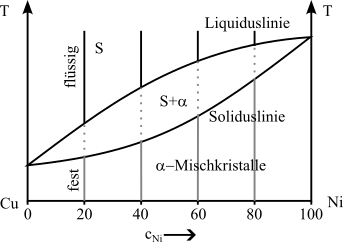

## Vorlesung Werkstofftechnik - Zustandsdiagramme
Prof. Dr.-Ing.  Christian Willberg
Hochschule Magdeburg-Stendal

Kontakt: christian.willberg@h2.de

---

<!--paginate: true-->

# Zustandsdiagramme

- auch Phasendiagramm -phase diagram-
- stellt den Zustand von Legierungen und Stoffgemischen in Abhängigkeit von der chemischen Zusammensetzung, Temperatur und ggf. dem Druck dar
- Zustand meint die auftretenden Phasen (alle festen, flüssige, gasförmige)

---
## Achtung!

Zustandsdiagramme sind Gleichgewichtsdiagramme. 
Sie haben nur Gültigkeit bei einer sehr langsamen 
Abkühlung aus dem schmelzflüssigen Zustand bis hin zur 
Raumtemperatur, bei der sich das Gleichgewicht zwischen 
den Phasen (an bzw. zwischen den Phasengrenzlinien) einstellen kann. 

---

---

## Löslichkeiten

Unlöslich

- zu große Unterschiede bei den Atomdurchmessern
- Kristallgitter weichen voneinander ab
- Komponenten sind chemisch sehr unterschiedlich

Löslich
- kaum Unterschiede bei den Atomdurchmessern
- Kristallgitter sind identisch
- Komponenten sind chemisch sehr nah beieinander

---

## Beispiel aus der eigenen Erfahrung
- Ölfilm auf Wasser ist nicht löslich und es findet eine Trennung aufgrund der unterschiedlichen Dichte statt
- Salz- / Zuckerkristalle in Wasser werden vollständig gelöst und ist nicht mehr sichtbar

---

---

## Beispiel für Unlöslichkeit

---

## Beispiel für vollständige Löslichkeit

---

---

## Gibbsche Phasenregel

$F = n  - P + 2$
(für Gase und Flüssigkeiten)
F = Anzahl der Freiheitsgrade; n = Anzahl der Komponenten; P = Anzahl der Phasen

bei konstantem Druck (feste Stoffe) 	
        
$F = n  - P + 1$
        
Damit ergibt sich für die Anwendung dieser Gesetzmäßigkeiten bei der Abkühlungs- und Erwärmungskurve für metallische Systeme

F = 0		ein Haltepunkt und
F = 1		ein Knickpunkt.

---
# Zusammenfassung

- Die Phasen bzw. Phasengrenzlinien können als ein Zustandsdiagramm dargestellt werden
- Die Anzahl der miteinander im Gleichgewicht stehenden Phasen ist gesetzmäßig verknüpft mit der Zahl der an der Legierungsbildung beteiligten Komponenten und der Zahl der Freiheitsgrade über die Gibbsche Phasenregel
- Ein Freiheitsgrad beinhaltet die mögliche Veränderung von Zustandsvariablen, ohne das Gleichgewicht, d.h. die Anzahl der Phasen, zu ändern (Bewegung in T oder der Konzentration)
- Die Anzahl der frei wählbaren Zustandsvariablen wird  nach der Phasenregel bestimmt

---

## Hebelgesetz

- In Punkt 2 hat die Schmelze einen kleineren Nickelgehalt als der $\alpha$-MK
- D.h. die Konzentration im Mischkristall muss steigen, damit die Zahl der Nickelatome plastischer
- Schmelze und Mischkristall müssen nicht die gleiche chemische Zusammensetzung haben

$\frac{m_s}{m_{\alpha}}=\frac{c_{\alpha}-c_{L}}{c_{L}-c_{S}}$

---

## Rechenbeispiel

-> Annahme Konzentrationen in Punkt 2

$c_S=20\%$, $c_{\alpha}=40\%$, $c_L=25\%$

---

## Lösung

$\frac{m_s}{m_{\alpha}}={c_{\alpha}-c_{L}}{c_{L}-c_{S}}=\frac{40\%-25\%}{25\%-20\%}=\frac{15}{5}=\frac{3}{1}$
- im Punkt 2 liegt 3 mal soviel Schmelze wie Mischkristall vor

---

## Praktische Bedeutung

- Kupfer Nickel Legierungen haben gegenüber reinem Kupfer eine höhere Festigkeit bei guter Korrosionsbeständigkeit

---

# Völlige Löslichkeit im flüssigen und teilweise Löslichkeit im festen Zustand

- Metallschmelzen der Elemente A und B lösen sich in beliebigen Mischungsverhältnissen (Konzentrationen)
- die Mischkristalle bilden sich nur noch in bestimmten Maße

---

## Wann tritt das auf?

- Atomdurchmesser weichen voneinander ab
- Kristallgitter der Komponenten unterscheiden sich
- Komponenten sich chemisch verschieden

Die Komponenten sich sich weder sehr ähnlich, noch sehr verschieden

Es können folgende ZSDs auftauchen
- Eutektikum
- Peritektikum

---

---

## Hinweis

- Löslichkeitslücke meist als Mischungslücke bekannt
- $\alpha_1$ ist ein A reicher Kristall
- $\alpha_2$ ist ein B reicher Kristall

- Durchmesser irgendwann so groß, dass die Löslichkeitslücke in den Schmelzbereich ragt
-> Eutektikum

- Komponenten sind **löslich** im flüssigen Zustand
- Komponenten sind **begrenzt löslich** im festen Zustand

---

## Eutektische Reaktion

-  bei einer Konzentration erstarren aus der Schmelze S bei konstanter Temperatur (Eutektikale) A- und B-Kristalle zu einem feinkristallinen Kristallgemisch (Eutektikum)
- eutektische Gefüge besitzt oft eine schicht- oder lamellenartige Struktur
- Legierungen anderer Konzentrationen scheiden vor Erreichen der Eutektikale (Haltepunkt bei der Eutektischen Reaktion) die überwiegende Komponente aus (A- oder B-Kristalle), so dass sich die Konzentration der verbleibenden Schmelze der eutektischen Zusammensetzung annähert. 
- die **Eutektikale** bildet die Soliduslinie des gesamten Systems

---

## Eutektischer Entmischung

---

_Löslichkeits- oder Sättigungslinien_
- Linien, die die Einphasengebiete ($\alpha$, $\beta$) von dem Gebiet der Kristallgemische aus Mischkristal-len ($\alpha+\beta$) abgrenzen
Sonderfall:
- ein System von Mischkristallen bilden Einlagerungsmischkristalle 
- Die Konzentrationsachse endet dann mit der Konzentration der Sättigung der Komponente B im Gitter der Komponente A
- Das Einphasengebiet der Komponente B kann dann nicht existieren.

---

## Systeme mit Peritektikum (mit peritektischer Entmischung) 

-  weit auseinander liegende Schmelz-/Erstarrungstemperaturen der beteiligten Komponenten sind charakteristisch.
- Bei Abkühlung aus der Schmelze bildet sich ein Mischkristall $\alpha$
- bildet bei konstanter Temperatur (entsprechend der **Eutektikalen**) mit der Schmelze reagierend eine zweite Mischkristallart $\beta$ bildet. 
- bei einer peritektischen Reak-tion entstehen aus der Schmelze und bereits ausgeschiedenen $\alpha$-Mischkristallen bei gleich bleibender Temperatur neue $\beta$-Mischkristalle.

---

---

---

# Fragen

---

## Realdiagramme
- die bisherigen Digramme waren Idealdigramme und treten so nicht wirklich auf
- Eisen-Kohlenstoff-Diagramm (EKD) ist das wichtigste Realdiagramm
- Grundmetall ist Eisen -> Stahl oder Eisenguss
- das EKD setzt sich aus den Idealdiagrammen - dem peritektischen, eutektischen und eutektoiden Teildiagramm - zusammen

---

- Man kann je nach Erscheinungsform des Kohlenstoffs zwischen dem stabilen System Fe-C, in dem Kohlenstoff als Graphit, und dem metastabilen System Fe-Fe3C, in dem Kohlenstoff gebunden als Fe3C (intermediäre Phase Zementit) vorliegt, unterscheiden. 
- Stabil bedeutet, dass der Kohlenstoff in Form von Graphit nicht weiter zerlegt werden kann, Fe3C aber bei langzeitigem Glühen in Eisen und Temperkohle zerfällt. 
- Das metastabile System stellt gewissermaßen ein relatives Minimum der Gesamtenergie des Systems dar. Für techni-sche Belange kann es als „hinreichend stabil“ bewertet werden.

---

# Eisen-Kohlenstoffdiagramm (EKD)

- wichtigstes ZSD
- Eisen ist der wichtigste Werkstoff im Maschinenbau. 

Gründe sind
- geringe Kosten
- hohe Festigkeit und elastische Steifigkeit
- Vielzahl von möglichen Legierungen
- Verfügbarkeit
- Gießbarkeit, Schweißbarkeit, etc.

[Erklärvideo für das Eisen Kohlenstoff Diagramm](https://www.youtube.com/watch?v=oJqvnKhnsg0&t=1s)

---

---
## Wichtige Gleichgewichtslinien

ABCD 	Liquiduslinie			
AHIECF 	Soliduslinie			
ECF 		Eutektikale			
PSK 		Eutektoide			
ES, PQ		Sättigungslinien				MOSK		Curie-Linie
QPSECD 	Bildung/Auflösung Fe3C	

---

## Punkte im Zustandsdiagramm
S - eutektoider Punkt
C - eutektischer Punkt
G -	$\alpha$ / $\gamma$ - Umwandlungspunkt des reinen Eisens
E -	Punkt max. C-Löslichkeit im $\alpha$ - MK
P - Punkt max. C-Löslichkeit im $\gamma$ - MK
u. a. m. (vgl. Fe-Fe3C - Diagramm)

---

Folgende Grenzlinientemperaturen (Umwandlungstemperaturen) werden benutzt: 

A: 	arreter (anhalten)
r:	refroidir (abkühlen)
c:	chauffer (erwärmen)
e:	équilibre (Gleichgewicht)

Ac1: 723°C
Ac3: abhängig vom C-Gehalt

---

# Phasen- und Gefüge im System-Eisen-Kohlenstoff
# Mischkristalle

---
## $\alpha$-Mischkristall (krz)
- Gefügebezeichnung Ferrit ($\alpha$-Ferrit)
- rein ferritisches Gefüge besitzt geringe Härte/Festigkeit, aber hohe Duktilität (Zähigkeit)
- Max. C-Löslichkeit: nur 0,02 % 

---
## Exkurs Härte / Festigkeit
Im Detail kommt das später.
Festigkeit 
- Maß der maximalen Beanspruchbarkeit bis Versagen
- Kraft pro Querschnittsfläche

Härte 
- mechanischer Widerstand gegen mechanisches Eindringung eines anderen Körpers 
- Maß für die Verschleißbeständigkeit

---

## $\delta$-Mischkristall (krz)
 - $\delta$-Ferrit ist nur oberhalb von 1392°C stabil  
 - technisch von untergeordneter Bedeutung
 - Max. C-Löslichkeit: 0.12 %

---

## $\gamma$-Mischkristall (kfz)

- Gefügebezeichnung Austenit
- scheidet sich oberhalb der G-S-E-Linie  aus; 
  - durch Legierungszusätze (Ni, Mn) und Abschrecken auch bei Raumtemperatur beständig (austenitische Stähle)
- unmagnetisch, zäh und durch Kaltverfestigung härtbar (Mangan-, Nickel-, Chrom-Nickel-Stähle)
- hohe Warmfestigkeit, gute Korrosions- und Zunderbeständigkeit
- Max. C-Löslichkeit: 2.06 %

---

## Intermediäre Phase
Zementit (Eisencarbid Fe3C); 6.67 Masse-% C-Gehalt

- Primärzementit:	
primäre Kristallisation aus der Schmelze (Linie CD)

- Sekundärzementit: 
Ausscheidung aus dem Austenit (Linie ES)

- Tertiärzementit:	
Ausscheidung aus dem Ferrit (Linie PQ)

---

## Kristallstruktur

- orthorhombischen Elementarzelle 
  -  zwölf Eisen- und vier Kohlenstoffatome
  - die Kohlenstoffatome sind relativ unregelmäßig (zweifach überkappt trigonal-prismatisch) von acht Eisenatomen umgeben

---

- Zementit ist hart und spröde
- überwiegende Zahl der technischen Eisen-Kohlenstoff-Legierungen erstarrt unter Bildung von Zementit

---

# Phasengemische/Gemische von Mischkristallen

## Perlit (Eutektoid)
- Gefüge aus Zementit und Ferrit (= Phasengemisch)
- entsteht durch den "eutektoiden" Zerfall des Austenits ($\gamma$-Mischkristall) mit 0.8% C bei 723°C
- eutektoider Punkt S: hier liegen 100% Perlit vor
- relativ hohe Härte, relativ hohe Festigkeit, schlechte Umformbarkeit, geringe Zähigkeit

---

- lamellenartiger Aufbau (Schichten von $\alpha$-Mk und Fe3C-Kristallen) .
- häufig spricht man von einer "Perlitstufe", die - gemessen am Lamellenabstand - in Perlit, fein-streifigen  und feinststreifigen Perlit unterteilt wird. 

---

## Ledeburit (Eutektikum) 

- Gefüge aus Austenit und Zementit bzw. „zerfallenem“ Austenit und Zementit (= Phasengemisch), Kohlenstoffgehalt 4,3 %, Schmelztemperatur 1147°C 
- Eutektischer Punkt C: hier liegen 100% Ledeburit vor
- Unterscheidung zwischen Ledeburit I (dicht unterhalb 1.147 °C)
  -  um ein Gefüge aus Austenit und Zementit handelt

- Ledeburit II (Raumtemperatur)
  - aus Zementit I mit ankristallisiertem Sekundärzementit (aus dem Austenit bei sinkender Temperatur ausgeschieden) und (bei langsamer Abkühlung) aus Perlit
  -  Der Perlit entsteht durch den eutektoiden Zerfall des Austenits aus dem Ledeburit I bei 723 °C. 

---
- bei schnellerer Abkühlung kann anstelle des Perlit auch Bainit bzw. bei sehr schneller Abkühlung Martensit vorliegen. 
- Ledeburit ist schlecht umformbar, hat sehr geringe Duktilität. 
 - bei Raumtemperatur  feines Gemenge von Fe3C-Kristalliten und Perlitbereichen im Auflichtmikroskop als charakteristische Pantherfellstruktur sichtbar.

---

Die Eigenschaften der Legierung (z.B. Stahl, Gusseisen) wird durch die Art der beteiligten Phasen (z.B. $\alpha$-Mk, Fe3C), ihren mengenmäßigen Anteil (z. B. abhängig vom C-Gehalt) und die Art ihrer Verteilung im Gefüge bestimmt.

---
# Phasen- und Gefüge im Ungleichgewichtszustand

- Gleichgewichtszustände durch Diffusionsvorgänge dominiert
- bei schnelleren Temperaturänderungen wird die Kohlenstoffdiffusion, die zur Entmischung des Austenits erforderlich ist, behindert 
- Dadurch entstehen auch neuartige Gefügebestandteile, die nicht mehr dem Gleichgewichtszustand entsprechen
- führt zu "zwangsgelöstem" Kohlenstoff
---

## Martensit
- raumzentriertes Gitter tetragonal verzerrt („verspanntes Ferritgitter“)
- meist feinnadeliges, sehr hartes und sprödes Gefüge
- der im krz-Gitter des $\alpha$-Fe zwangsgelöste Kohlenstoff verzerrt das Gitter und weitet es tetragonal auf („diffusionsloses Umklappen“). 

---

## Bainit  

- anders als bei der Bildung von Martensit sind hier Umklappvorgänge im Kristallgitter und Diffusionsvorgänge gekoppelt
-  bildet sich im Temperaturbereich zwischen der Perlit- und der Martensitstufe bei Abkühlungsgeschwindigkeiten (für Martensitbildung zu niedrig; für die Perlitbildung zu hoch)

---
 ## Bainit  

- reiner Bainit lässt sich nur durch isotherme Abkühlung, z.B. beim Warmbadhärten, erzielen. 
- Vorteilhaft, wo bei einer Vergütung durch Abschrecken und Anlassen eine Härterissgefahr besteht. 
- Es hat sehr gute Festigkeits- und Zähigkeitseigenschaften.

---

# Eisen-Kohlenstoff-Legierungsbezeichnungen

| Kohlenstoffgehalt (Masse-%) | Bezeichnung               | Typ                                  |
|-----------------------------|---------------------------|--------------------------------------|
| 0.02 < C < 0.8              | (Kohlenstoff-) Stahl       | untereutektoide Stähle               |
| C = 0.8                     | (Kohlenstoff-) Stahl       | eutektoide Stähle                    |
| 0.8 < C < 2.06              | (Kohlenstoff-) Stahl       | übereutektoide Stähle                |
| 2.06 < C < 4.3              | Gusseisen                 | untereutektische Gusseisen           |
| C = 4.3                     | Gusseisen                 | eutektische Gusseisen                |
| 4.3 < C < 6.67              | Gusseisen                 | übereutektische Gusseisen            |

---

---

- Weiterhin wird unterschieden zwischen dem schwarzen Gusseisen (Grauguss), in dem der überschüssige Kohlenstoff in Form von Graphit, und dem weißen Gusseisen, in dem der Kohlenstoff in Form von Zementit vorkommt 
- Mit zunehmendem C-Gehalt steigen die Festigkeit und Härtbarkeit des Stahles, wogegen seine Dehnung, Schmiedbarkeit, Schweißbarkeit und Bearbeitbarkeit (durch spanabhebende Werkzeuge) verringert werden
- Der Korrosionswiderstand gegenüber Wasser, Säuren und heißen Gasen wird durch den Kohlenstoff praktisch nicht beeinflusst. 
- Für Kohlenstoffgehalte unter 0.25 Masse-% sind Stähle gut schweißbar

---

## Referencen

Rainer Schwab: Werkstoffkunde und Werkstoffprüfung für Dummies, 2019; ISBN-10 352771538X
[Grundlagen der Metallkunde](https://wiki.arnold-horsch.de/index.php/Grundlagen_der_Metallkunde)
