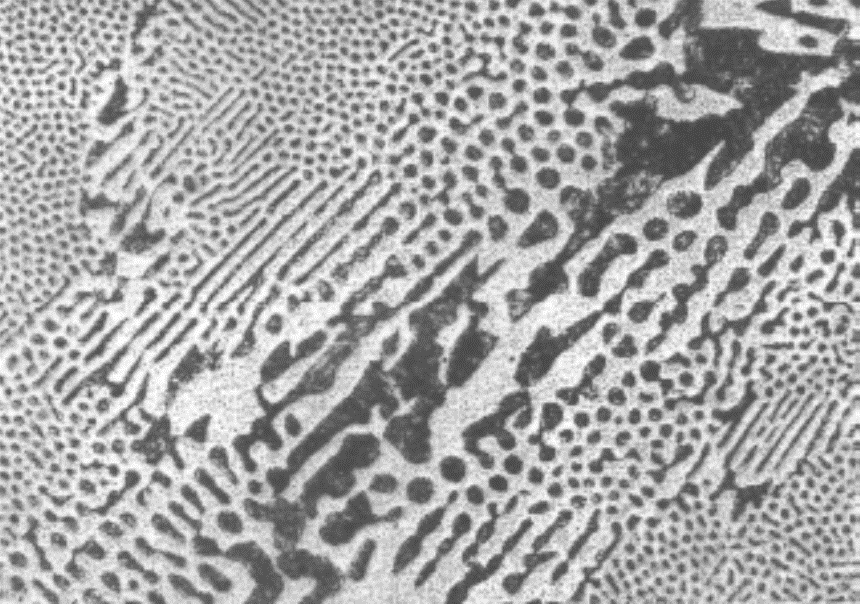

## Vorlesung Werkstofftechnik - Phasen- und Gefüge im System-Eisen-Kohlenstoff
Prof. Dr.-Ing.  Christian Willberg
Hochschule Magdeburg-Stendal

Kontakt: christian.willberg@h2.de

---

<!--paginate: true-->

# Phasen- und Gefüge im System-Eisen-Kohlenstoff
# Mischkristalle

---
## $\alpha$-Mischkristall (krz)
- Gefügebezeichnung Ferrit ($\alpha$-Ferrit)
- rein ferritisches Gefüge besitzt geringe Härte/Festigkeit, aber hohe Duktilität (Zähigkeit)
- Max. C-Löslichkeit: nur 0,02 % 

---

## Härte / Festigkeit

Festigkeit 
- Maß der maximalen Beanspruchbarkeit bis Versagen
- Kraft pro Querschnittsfläche

Härte 
- mechanischer Widerstand gegen mechanisches Eindringung eines anderen Körpers 
- Maß für die Verschleißbeständigkeit

---

## $\delta$-Mischkristall (krz)
 - $\delta$-Ferrit ist nur oberhalb von 1392°C stabil  
 - technisch von untergeordneter Bedeutung
 - Max. C-Löslichkeit: 0.12 %

---

## $\gamma$-Mischkristall (kfz)

- Gefügebezeichnung Austenit
- scheidet sich oberhalb der G-S-E-Linie  aus; 
  - durch Legierungszusätze (Ni, Mn) und Abschrecken auch bei Raumtemperatur beständig (austenitische Stähle)

---

- unmagnetisch, zäh und durch Kaltverfestigung härtbar (Mangan-, Nickel-, Chrom-Nickel-Stähle)
- hohe Warmfestigkeit, gute Korrosions- und Zunderbeständigkeit
- Max. C-Löslichkeit: 2.06 %

---

## Intermediäre Phase
Zementit (Eisencarbid Fe3C); 6.67 Masse-% C-Gehalt

- Primärzementit:	
primäre Kristallisation aus der Schmelze (Linie CD)

- Sekundärzementit: 
Ausscheidung aus dem Austenit (Linie ES)

- Tertiärzementit:	
Ausscheidung aus dem Ferrit (Linie PQ)

---

## Kristallstruktur

- orthorhombischen Elementarzelle 
  -  zwölf Eisen- und vier Kohlenstoffatome
  - die Kohlenstoffatome sind relativ unregelmäßig (zweifach überkappt trigonal-prismatisch) von acht Eisenatomen umgeben

---

- Zementit ist hart und spröde
- überwiegende Zahl der technischen Eisen-Kohlenstoff-Legierungen erstarrt unter Bildung von Zementit

---

# Phasengemische/Gemische von Mischkristallen

## Perlit (Eutektoid)
- Gefüge aus Zementit und Ferrit (= Phasengemisch)
- entsteht durch den "eutektoiden" Zerfall des Austenits ($\gamma$-Mischkristall) mit 0.8% C bei 723°C
- eutektoider Punkt S: hier liegen 100% Perlit vor
- relativ hohe Härte, relativ hohe Festigkeit, schlechte Umformbarkeit, geringe Zähigkeit

---

- lamellenartiger Aufbau (Schichten von $\alpha$-Mk und Fe3C-Kristallen) .
- häufig spricht man von einer "Perlitstufe", die - gemessen am Lamellenabstand - in Perlit, fein-streifigen  und feinststreifigen Perlit unterteilt wird. 

---

## Ledeburit (Eutektikum) 

- Gefüge aus Austenit und Zementit bzw. „zerfallenem“ Austenit und Zementit (= Phasengemisch), Kohlenstoffgehalt 4,3 %, Schmelztemperatur 1147°C 
- Eutektischer Punkt C: hier liegen 100% Ledeburit vor
- Unterscheidung zwischen Ledeburit I (dicht unterhalb 1.147 °C)
  -  um ein Gefüge aus Austenit und Zementit handelt

- Ledeburit II (Raumtemperatur)
  - aus Zementit I mit ankristallisiertem Sekundärzementit (aus dem Austenit bei sinkender Temperatur ausgeschieden) und (bei langsamer Abkühlung) aus Perlit
  -  Der Perlit entsteht durch den eutektoiden Zerfall des Austenits aus dem Ledeburit I bei 723 °C. 

---
- bei schnellerer Abkühlung kann anstelle des Perlit auch Bainit bzw. bei sehr schneller Abkühlung Martensit vorliegen. 
- Ledeburit ist schlecht umformbar, hat sehr geringe Duktilität. 
 - bei Raumtemperatur  feines Gemenge von Fe3C-Kristalliten und Perlitbereichen im Auflichtmikroskop als charakteristische Pantherfellstruktur sichtbar.

---

Die Eigenschaften der Legierung (z.B. Stahl, Gusseisen) wird durch die Art der beteiligten Phasen (z.B. $\alpha$-Mk, Fe3C), ihren mengenmäßigen Anteil (z. B. abhängig vom C-Gehalt) und die Art ihrer Verteilung im Gefüge bestimmt.

---
# Phasen- und Gefüge im Ungleichgewichtszustand

- Gleichgewichtszustände durch Diffusionsvorgänge dominiert
- bei schnelleren Temperaturänderungen wird die Kohlenstoffdiffusion, die zur Entmischung des Austenits erforderlich ist, behindert 
- Dadurch entstehen auch neuartige Gefügebestandteile, die nicht mehr dem Gleichgewichtszustand entsprechen
- führt zu "zwangsgelöstem" Kohlenstoff
---

## Martensit
- raumzentriertes Gitter tetragonal verzerrt („verspanntes Ferritgitter“)
- meist feinnadeliges, sehr hartes und sprödes Gefüge
- der im krz-Gitter des $\alpha$-Fe zwangsgelöste Kohlenstoff verzerrt das Gitter und weitet es tetragonal auf („diffusionsloses Umklappen“). 

---

## Bainit  

- anders als bei der Bildung von Martensit sind hier Umklappvorgänge im Kristallgitter und Diffusionsvorgänge gekoppelt
-  bildet sich im Temperaturbereich zwischen der Perlit- und der Martensitstufe bei Abkühlungsgeschwindigkeiten (für Martensitbildung zu niedrig; für die Perlitbildung zu hoch)

---
 ## Bainit  

- reiner Bainit lässt sich nur durch isotherme Abkühlung, z.B. beim Warmbadhärten, erzielen. 
- Vorteilhaft, wo bei einer Vergütung durch Abschrecken und Anlassen eine Härterissgefahr besteht. 
- Es hat sehr gute Festigkeits- und Zähigkeitseigenschaften.

---

---

# Eisen-Kohlenstoff-Legierungsbezeichnungen

| Kohlenstoffgehalt (Masse-%) | Bezeichnung               | Typ                                  |
|-----------------------------|---------------------------|--------------------------------------|
| 0.02 < C < 0.8              | (Kohlenstoff-) Stahl       | untereutektoide Stähle               |
| C = 0.8                     | (Kohlenstoff-) Stahl       | eutektoide Stähle                    |
| 0.8 < C < 2.06              | (Kohlenstoff-) Stahl       | übereutektoide Stähle                |
| 2.06 < C < 4.3              | Gusseisen                 | untereutektische Gusseisen           |
| C = 4.3                     | Gusseisen                 | eutektische Gusseisen                |
| 4.3 < C < 6.67              | Gusseisen                 | übereutektische Gusseisen            |

---

---

- Weiterhin wird unterschieden zwischen dem schwarzen Gusseisen (Grauguss), in dem der überschüssige Kohlenstoff in Form von Graphit, und dem weißen Gusseisen, in dem der Kohlenstoff in Form von Zementit vorkommt 
- Mit zunehmendem C-Gehalt steigen die Festigkeit und Härtbarkeit des Stahles, wogegen seine Dehnung, Schmiedbarkeit, Schweißbarkeit und Bearbeitbarkeit (durch spanabhebende Werkzeuge) verringert werden
- Der Korrosionswiderstand gegenüber Wasser, Säuren und heißen Gasen wird durch den Kohlenstoff praktisch nicht beeinflusst. 
- Für Kohlenstoffgehalte unter 0.25 Masse-% sind Stähle gut schweißbar

---

# Stahl

Normen
Eigenschaften

---

## Gusseisen 

- Massenanteil über 2.06 %
- gute Gießbarkeit auf (geringer Schmelzpunkt, dünnflüssige Schmelze, …)
- hart und spröde ist
- Die Zerspanbarkeit von Gusseisen hängt von der genauen Sorte ab; 
  - bei Gusseisen mit Lamellengraphit – der häufigsten Sorte – ist sie gut
  - Festigkeit ist geringer als die von Stahlguss, die Dämpfung ist höher
- Viele Sorten enthalten zusätzlich noch Silicium, das die Gießbarkeit verbessert, sowie weitere Legierungsanteile wie Mangan, Chrom oder Nickel
---

---

Es wird unterschieden zwischen:

- grauem Gusseisen (Grauguss), in dem der Kohlenstoff in Form von Graphit vorkommt. _Die Bruchflächen erscheinen grau_
- weißem Gusseisen, in dem der Kohlenstoff als Carbid in Form von Zementit (Fe3C) vorkommt. _Die Bruchflächen sind weiß_

---

## Vergleich Gusseisen und Stahl 

[Qualitativ zum Lesen](https://capablemachining.com/de/Blog/Stahl-vs.-Gusseisen-ein-umfassender-Vergleich/)

- Dichte $7.2\frac{g}{cm^3}$ vs. $7.85\frac{g}{cm^3}$ 
- Schmelztemperatur $1150 °C$
- korrosionsbeständiger als Stahl
- spröder als Stahl
- Schwindmaß ist nur ca 1%

[Quantitativ](https://www.schweizer-fn.de/festigkeit/festigkeitswerte/guss/stahlguss_start.php)

---

bild 16.3 einfügen aus Werkstofftechnik für dummies

stabile Systeme (nicht gelöster Kohlenstoff in Form von Grafitkristallen) treten umso eher auf
- je höher der Kohlenstoffanteil
- je höher der Siliziumanteil
- je langsamer die Abkühlung

---

metastabile Systeme in Form von Zementitkristallen (Kohlenstoff ist nicht gelöst)

---

---

# Einteilung und Eigenschaften

---

## Gusseisen mit Lamellengraphit

- einfachste und häufigste Gusseisen-Sorte ist Gusseisen mit Lamellengraphit 

- Graphit liegt in Form von dünnen, unregelmäßig geformten Lamellen vor

---

## Gusseisen mit Lamellengraphit

-  Lamellen wirken bei Zugbelastung als Kerben, daher ist die Zugfestigkeit infolge der Kerbwirkung relativ gering
-  Druckfestigkeit liegt etwa um den Faktor 4 höher als die Zugfestigkeit

---

- spröder Werkstoff
- gute Wärmeleitfähigkeit
-  vorteilhafte Selbstschmiereigenschaften
  - wenn durch Bearbeitung die Lamellen angeschnitten und der Graphit selbst oder an dessen Stelle andere Schmiermittel in den Hohlräumen „bevorratet“ werden können. 

---

## Gusseisen mit Kugelgraphit

- Bessere mechanische Eigenschaften als Gusseisen mit Lamellengraphit
- zeigt duktiles Verhalten 

---

## Gusseisen mit [Vermiculargraphit](https://www.giessereilexikon.com/giesserei-lexikon/Encyclopedia/show/gusseisen-mit-vermiculargrafit-190/?cHash=57ba0f0209983c2de8ccc8e299b07616)

- Eigenschaften zwischen Gusseisen mit Lamellengraphit und denen des Gusseisens mit Kugelgraphit
-  Herstellung ist jedoch schwieriger und erfordert eine in engen Toleranzen geführte Schmelzbehandlung

---

- höhere Festigkeit und Bruchdehnung und Bruchzähigkeit
- geringere Wanddickenabhängigkeit der Eigenschaften
Gusseisen mit Vermiculargrafit zeichnet sich gegenüber Gusseisen mit Lamellengrafit durch folgende Eigenschaften aus:

- höhere Festigkeit und Bruchdehnung
- höhere Bruchzähigkeit
- geringere Wanddickenabhängigkeit der Eigenschaften

---

Gegenüber Gusseisen mit Kugelgrafit bietet Gusseisen mit Vermiculargrafit folgende Vorteile:

- niedrigerer thermischer Ausdehnungskoeffizient
- höhere Wärmeleitfähigkeit
- niedrigerer E-Modul
- geringeres thermisch induziertes Eigenspannungsniveau
- bessere Temperaturwechselbeständigkeit und geringere Verzugsneigung aufgrund der zuvor genannten Eigenschaften
- besseres Dämpfungsvermögen
- bessere gießtechnische Eigenschaften (geringere Lunkerneigung, besseres Formfüllungs- und Fließvermögen)

---