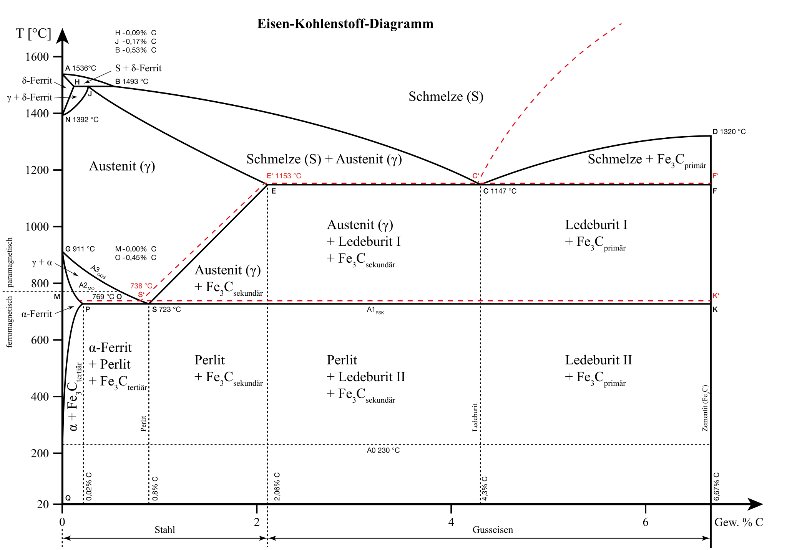
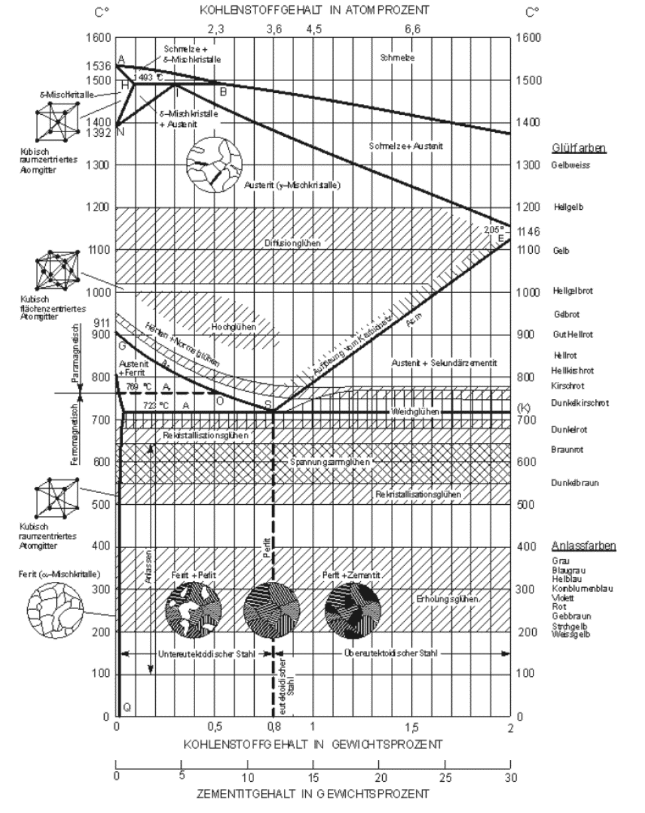

## Vorlesung Werkstofftechnik - Wärmebehandlung
Prof. Dr.-Ing.  Christian Willberg
Hochschule Magdeburg-Stendal

 
    <a href="https://wiki.arnold-horsch.de/images/3/36/Flamm-1.png" style="color: blue;">Bildreferenz</a>

Kontakt: christian.willberg@h2.de
Teile des Skripts sind von \
Prof. Dr.-Ing. Jürgen Häberle übernommen

---

<!--paginate: true-->

## Wärmebehandlung

- Glühverfahren
- Härteverfahren

Charakterisierung:
- Art des Erwärmens
- Haltetemperatur
- Haltedauer
- Art des Abkühlens (Ofen-, Luft-, Öl-, Wasserabkühlung)

---

# Warum?

---

- Verbesserung der Bearbeitbarkeit (Weichglühen)
- Arbeitsgang der Erzeugung (Härten von Werkzeugen)
- Verbesserung der mechanischen Eigenschaften (Vergüten von Stahl, Aushärten von Al-Legierungen)
- Verminderung des Verschleißes (Randschichthärten von Zahnrädern)
- Beseitigung von Kaltverfestigung (Rekristallisationsglühen)
- Abbau von Guss- oder Schweißspannungen (Spannungsarmglühen)

---

---

---
## Glühen
- langsames Kühlen. Versuch nahe dem Gleichgewichtszustand zu kommen

Ziele ausabeiten für
- Spannungsarmglühen
- Rekristallisationsglühen
- Weichglühen
- Normalglühen
- Grobkornglühen
- Diffusionsglühen

---

## Spannungsarmglühen
- Langsames Erwärmen auf 550 - 650 °C (unterhalb $\text{A}_{c1}$)
- Haltedauer 2 - 4 h, langsame Abkühlung (Ofenabkühlung)

Ziel:
Abbau innerer Spannungen (Eigenspannungen) ohne wesentliche Änderung der sonstigen Eigenschaften

---

## Rekristallisationsglühen
- Rekristallisationstemperatur bei Stahl: 500 - 600°C
- halten, langsame Abkühlung
- bei zu langer Haltezeit: Grobkornbildung

Ziel:

Rückgängigmachen von Eigenschaftsänderungen (Verfestigung) durch Kaltumformung; Gefügeumbildung bzw. -neubildung im festen Zustand; Spannungsabbau, Erhöhung der Bruchdehnung

---

## Weichglühen
- Temperaturen um  $\text{A}_{C1}$ (unterhalb, oberhalb oder pendelnd um  $\text{A}_{C1}$)
- langsame Abkühlung.

Ziel:
Herstellung eines - für die Weiterverarbeitung günstigen - weichen Zustands. Dabei werden Zementitteilchen kugelig eingeformt (GKZ-Glühen).

---

## Normalglühen

- Temperatur 30 - 50°C über Umwandlungstempertur im Austenitgebiet. 
- Erwärmung zwischen $\text{A}_{C1}$ und Glühtemperatur rasch, kurze Haltedauer
- rasche Abkühlung durch Zweiphasen-Intervall, dann langsam abkühlen

---

## Normalglühen

Ziel:

Herstellung eines gleichmäßigen und feinkörnigen Gefüges mit Perlitanteilen, Annäherung an den Gleichgewichtszustand durch zweifaches Umkörnen (bei Erwärmung und Abkühlung). Häufig eingesetztes Verfahren

---

## Grobkornglühen

Verfahrensparameter:
- Temperatur deutlich über $\text{A}_{C3}$ (950 - 1100°C)
- Haltezeit 1 bis 2 h
- langsame Ofenabkühlung
- dann raschere Luftabkühlung

Ziel:
Erzielung eines groben Korns. Hierdurch wird die Spanbarkeit verbessert.

---

## Diffusionsglühen

- Temperatur hoch im Austenitbereich
- lange Haltezeit (bis 50 h)
- langsame Abkühlung

Ziel:
Beseitigung örtlicher Konzentrationsunterschiede (Seigerungen) durch Diffusion.

---

## ZTU-Schaubilder
- Zeit Temperatur Umwandlungs Schaubilder
- werden für verschiedene Materialien und Legierungen bereitgestellt
- auf dieser Basis werden die Wärmebehandlungsprozesse geplant
- Unterscheidung in Abkühlung bei
  - konstanter Temperatur (isotherme Umwandlung)
  - kontinuierliche Abkühlung
---
## isotherme Umwandlung

- Probe wird abgeschreckt
- bei konstanter Temperatur gehalten, bis Umwandlung abgeschlossen

---
## Kontinuierliche Abkühlung
- ausgehend von der Austenitiseriungsbedingung verschieden schnell abgekühlt
- die Umwandlung in Ferrit, Perlit, Bainit (Zwischenstufe) oder Martensit bei verschiedenen Temperaturen findet in unterschiedlichem Ausmaß statt
- am Ende der Abkühlkurve wird meist die erreichbare Härte eingetragen

---

# Härten

---

## Härten

- erfolgt das Abkühlen von einer Temperatur oberhalb der Umwandlungslinie GOSK mit einer Geschwindigkeit, die größer ist als die kritische („Abschrecken“)
- Ziel ist ein Ungleichgewichtszustand durch Umwandlung des Austenits in Martensit (gegebenenfalls auch Bainit)

---

## Verfahren
- Härten nach Volumenerwärmung
- Anlassen
- Vergüten
- Randschichthärten
- Thermochemische Verfahren
  - Aufkohlen / Einsatzhärten
  - Nitrieren
- Thermomechanische Verfahren
- Aushärten
---

## Härten nach Volumenerwärmung

- Kohlenstoffgehalt von mindestens 0.3% (sonst Vorbehandlung nötig)
- bei kleinen Abmessungen kann eine vollständige Martensitbildung über den gesamten Querschnitt erfolgen (Durchhärtung). Bei großen Abmessungen wird die kritische Abkühlgeschwindigkeit nur bis zu einer bestimmten Tiefe erreicht (Einhärtung). 
- Höchsthärte ist allein vom Kohlenstoffgehalt abhängig

---

## Randschichthärten

- wird angewendet bei niedrig- und unlegierten Stählen mit 0.3 - 0.7% Kohlenstoff (obere Grenze zur Vermeidung von Härterissen)
- insbesondere bei Kurbelwellen, Zapfen, Walzen, Zahnrädern u.a.. Ziel dieses Verfahrens ist eine harte und verschleißbeständige Oberfläche bei zähem Kern. 
- Randschicht des Werkstückes auf Härtetemperatur erhitzt und durch Abschrecken gehärtet. 

---

## Verfahren

Das [Randschichthärten](http://wiki.arnold-horsch.de/index.php/Oberfl%C3%A4chenh%C3%A4rteverfahren) ist mit folgenden Verfahren möglich:

- Flammhärten
- Induktionshärten
- Strahlhärten (Elektronenstrahl- und Laserhärten)
- Tauchhärten 

---