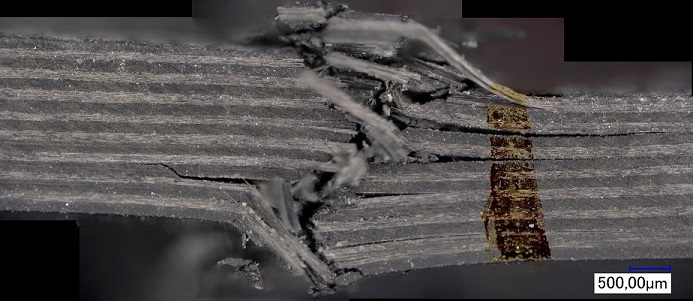
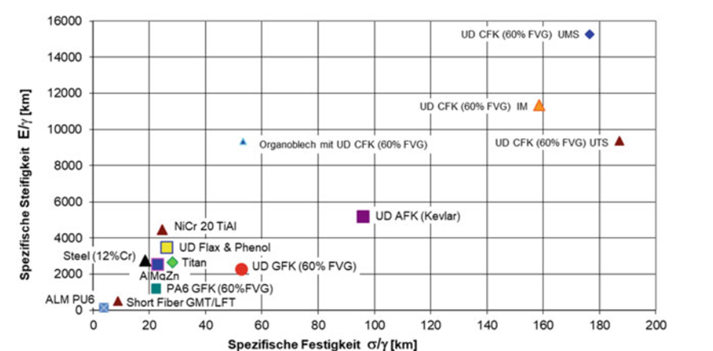
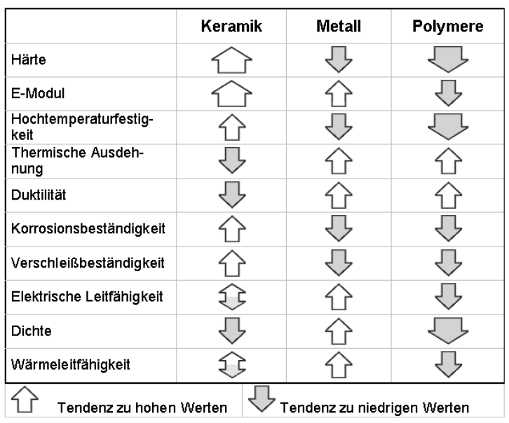
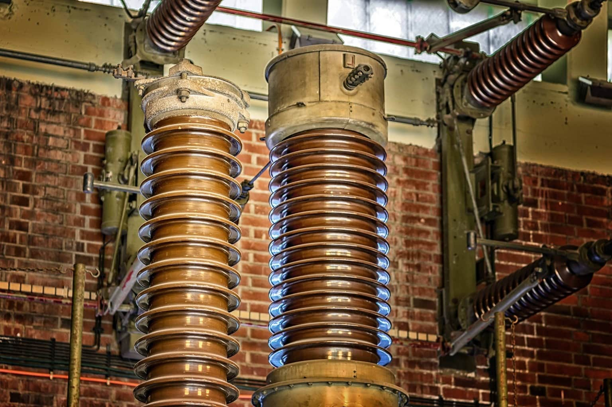
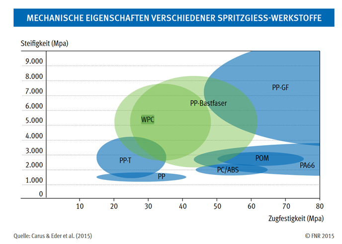
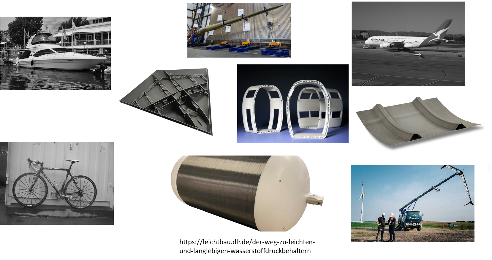
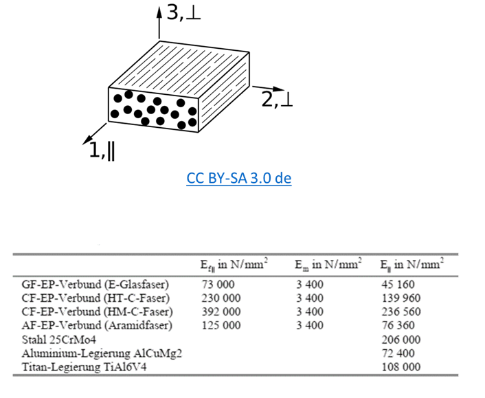
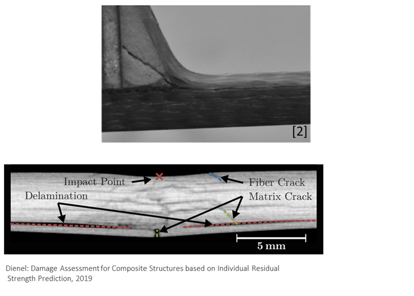
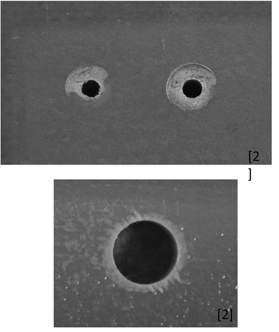

## Vorlesung Werkstofftechnik - Nicht Eisen Werkstoffe
Prof. Dr.-Ing.  Christian Willberg 

Kontakt: christian.willberg@h2.de

---

<!--paginate: true-->

# Überblick

- Nicht-Eisenmetalle
- Kunststoffe
- Gläser und Keramiken
- Metamaterialien und Smart Materials
- Naturwerkstoffe
- Faserverbundkunststoffe

---

# Werkstoffvergleich

**Spezifische Eigenschaften**

Spezifische Eigenschaft = $\frac{\text{Eigenschaft}}{\text{Bezugsgröße}}$

**Beispiele:**
- Spezifische Masse (Dichte): $\rho = \frac{m}{V}$ 
- Spezifische Festigkeit: $R_{spez} = \frac{R_m}{\rho}$ 

Die spezifische Festigkeit ermöglicht einen fairen Vergleich verschiedener Werkstoffe für Leichtbauanwendungen.

---

# 1. Nicht-Eisenmetalle

**Vergleich zur Stahlproduktion**

Weltweite Jahresproduktion Stahl: ~1900 Mio. t

Nicht-Eisenmetalle spielen trotz geringerer Produktionsmengen eine entscheidende Rolle in vielen technischen Anwendungen.

---

## Aluminium

**Grundlegende Eigenschaften**
- Spezifische Festigkeit vergleichbar mit Stahl
- Dichte: ~2,7 g/cm³ (Stahl: ~7,85 g/cm³)
- Weltproduktion: 60-70 Mio. t/Jahr

[Detaillierte Übersicht](https://www.maschinenbau-wissen.de/skript3/werkstofftechnik/aluminium)

---

## Aluminium - Vorteile

- Geringe Dichte → deutlich geringeres Gewicht
- Hervorragende Warm- und Kaltumformbarkeit
- Gute Gießbarkeit
- Aushärtbar durch Wärmebehandlung
- Gute Zerspanbarkeit
- Korrosionsbeständigkeit durch passivierende Oxidschicht

---

## Aluminium - Nachteile und Anwendungen

**Nachteile:**
- Höhere Materialkosten im Vergleich zu Stahl

**Hauptanwendungen:**
- Automobilbau (Karosserien, Motorkomponenten)
- Luft- und Raumfahrt
- Fahrradbau
- Verpackungen (Alufolie)

---

## Aluminium - Herstellung

**Schmelzflusselektrolyse**
- Ausgangsmaterial: Bauxit (Al₂O₃)
- Schmelzpunkt Bauxit: 2060 °C (zu hoch für direktes Schmelzen)
- Lösung: Elektrolyse in geschmolzenem Kryolith
- Kryolith: Mineral aus Natrium, Aluminium und Fluor

**Energiebilanz:**
- Primärproduktion: sehr energieintensiv
- Recycling: nur 5% der Primärenergie

---

## Kupfer

**Charakteristische Eigenschaften**
- Exzellente elektrische Leitfähigkeit
- Sehr gute Wärmeleitfähigkeit
- Korrosionsbeständigkeit

**Weltproduktion:**
- 2006: 17 Mio. t
- 2025: ~28 Mio. t (Prognose)

---

## Kupfer - Legierungen

**Bronzen (Kupfer-Zinn)**
- Hohe Festigkeit
- Gute Korrosionsbeständigkeit
- Leichte Verarbeitung

**Messinge (Kupfer-Zink)**
- Bis 37% Zn: einphasiges Messing
- 37-44% Zn: zweiphasiges Messing
- Gute Spanbarkeit

**Kupfer-Nickel-Legierungen**
- Hohe Korrosionsbeständigkeit (Meerwasser)

---

## Kupfer - Herstellung

**Prozess aus Kupferstein:**

$6\text{CuFeS}_2 + 10\text{O}_2 \rightarrow 3\text{Cu}_2\text{S} + 2\text{FeS} + 2\text{Fe}_2\text{O}_3 + 7\text{SO}_2$

**Endreaktion:**

$\text{Cu}_2\text{S} + 2\text{Cu}_2\text{O} \rightarrow 6\text{Cu} + \text{SO}_2$

---

## Weitere Nicht-Eisenmetalle I

**Magnesium**
- Leichtbauwerkstoff
- Sehr geringe Dichte

**Titan und Titanlegierungen**
- Hohe Festigkeit und Warmfestigkeit
- Exzellente Korrosionsbeständigkeit
- Luft- und Raumfahrt, Medizintechnik

---

## Weitere Nicht-Eisenmetalle II

**Nickel**
- Korrosionsbeständigkeit
- Hohe Warmfestigkeit
- Legierungselement

**Zink**
- Korrosionsschutz (Verzinkung)
- Witterungsbeständige Bleche

**Blei**
- Leicht gießbar
- Chemisch beständig
- Batterien, Lager, Lote

---

## Wolfram (Tungsten)

**Besondere Eigenschaften**
- Höchster Schmelzpunkt aller Metalle (3422 °C)

**Anwendungen:**
- Glühfäden
- Schweißelektroden
- Hochtemperatur-Sonderbauteile

---

---

# 2. Kunststoffe

**Grundlagen**
- Bestehen aus Makromolekülen (Polymeren)
- Breites Eigenschaftsspektrum je nach Herstellung und Additiven
- Herkunft: Naturstoffe oder vollsynthetisch

**Struktur:**

---

## Kunststoffe - Anwendungen

**Haupteinsatzgebiete:**
- Verpackungsindustrie
- Elektrische Isolierungen
- Spielzeug und Haushaltsartikel
- Rohrleitungen
- Verkleidungen und Dämmungen
- Leiterplatten
- Automobilbau
- Medizintechnik

---

## Umweltaspekte

**Aktuelle Situation:**
- >70% Deponierung
- ~9% Recycling
- Rest: thermische Verwertung

**Mikroplastik-Problematik:**
- Bewusste Nutzung (z.B. Kosmetika)
- Entstehung durch mechanische Zerstörung
- Anreicherung in Nahrungsketten
- Langzeitfolgen noch nicht vollständig erforscht

---

## Kunststoffklassifizierung

**Drei Hauptgruppen:**

1. **Thermoplaste** - unvernetzte Polymere
2. **Duroplaste** - engmaschig vernetzt
3. **Elastomere** - weitmaschig vernetzt

Unterscheidung nach molekularer Struktur und thermischem Verhalten.

---

## Thermoplaste

**Struktur:**
- Unvernetzte Polymere
- Oft teilkristalline Struktur
- Schmelzbar und recyclebar
- Glasübergangstemperatur Tg

---

## Thermoplaste - Aggregatzustände

**Temperaturabhängige Zustände:**
- **Fest** - unterhalb Tg
- **Thermoelastisch** - oberhalb Tg
- **Thermoplastisch** - Verarbeitungsbereich
- **Fließfähig** - hohe Temperaturen

Diese Eigenschaft ermöglicht vielfältige Verarbeitungsverfahren.

---

## Thermoplaste - Fertigungsverfahren

**Typische Prozesse:**
- Spritzgießen
- Extrusion
- Additive Fertigung (3D-Druck)
- Blasformen
- Folienblasen

**Beispiele:**
Polyethylen (PE), Polypropylen (PP), Polystyrol (PS), Polycarbonat (PC)

---

## Thermoplaste - Anwendungen

- **Automobilindustrie:** Innen-/Außenverkleidungen, Stoßfänger
- **Luft- und Raumfahrt:** Interieur-Komponenten
- **Medizintechnik:** Einwegspritzen, Katheter
- **Bauwesen:** Rohrleitungen, Isolierungen, Fensterrahmen
- **3D-Druck:** Prototypen und Endprodukte

---

## Duroplaste

**Eigenschaften:**
- Engmaschig vernetzte Struktur
- Nicht mehr aufschmelzbar nach Aushärtung
- Hohe Temperaturen → Zersetzung (Pyrolyse)

**Herstellung:**
- Polykondensation (stufenweise)
- Stabile Zwischenprodukte (Oligomere)
- Finale Vernetzung zu Makromolekülen

---

## Duroplaste - Reaktionsschema

---

## Duroplaste - Anwendungen

**Typische Einsatzgebiete:**
- Bremsbeläge
- Faserverbundwerkstoffe (Matrix)
- Kabelbahnen
- Karosserieteile
- Schutzhelme

**Beispiele:**
Epoxidharze, vernetzbare Polyurethane, ungesättigte Polyesterharze

---

## Elastomere

**Charakteristik:**
- Weitmaschig vernetzte Struktur
- Glastemperatur unterhalb Einsatztemperatur
- Thermoelastisches Verhalten (Rückstellvermögen)

**Materialquellen:**
- Synthetisch hergestellt
- Naturkautschuk (Kautschukbaum)
- Neue Quelle: Russischer Löwenzahn

---

## Elastomere - Vulkanisation

**Prozess:**
- Umwandlung von Kautschuk in Elastomer
- Bildung kovalenter Bindungen zwischen Molekülketten
- Vernetzung durch Schwefelbrücken
- Alterung: Austausch Schwefel- durch Sauerstoffbrücken

**Anwendungen:**
- Dichtringe und Dichtungen
- Reifen
- Gummibänder

---

## Kunststoff-Additive

**Zweck:** Beeinflussung spezifischer Eigenschaften

- **Weichmacher** - Flexibilität erhöhen
- **Stabilisatoren** - UV-Schutz, Alterungsschutz
- **Farbmittel** - Einfärbung
- **Füllstoffe** - Kostenreduktion, Eigenschaftsänderung
- **Verstärkungsstoffe** - Festigkeitssteigerung (Fasern)

---

# 3. Gläser

**Definition:**
- Eingefrorener Zustand einer unterkühlten Flüssigkeit
- Amorphe (ungeordnete) Struktur
- Isotrope Eigenschaften
- Keine Phasenänderung beim Erstarren

---

## Gläser - Glasübergang

**Temperaturverhalten:**
- Unterhalb Tg: Festkörperverhalten
- Oberhalb Tg: Flüssigkeitsverhalten
- Reversibler Prozess

---

## Gläser - Eigenschaften und Anwendungen

**Eigenschaften:**
- Hohe chemische Beständigkeit
- Geringe Zugfestigkeit (spröde)
- Transparenz (optische Gläser)
- Nicht-metallische Gläser: gute Isolatoren

**Anwendungen:**
- Fenster und Fassaden
- Behälter und Verpackungen
- Elektrische Isolatoren
- Optische Komponenten

---

# 4. Keramiken

**Herstellungsprozess:**
1. Aufbereiten und Mischen der Pulver
2. Formgebung
3. Brennen (Sintern)

**Mechanische Eigenschaften:**
- Sehr hohe Druckfestigkeit (10× höher als Zugfestigkeit)
- Ideal sprödes Verhalten
- Geringe Schlagbiegefestigkeit
- Hohe Kerbempfindlichkeit

---

## Keramiken - Struktur und Eigenschaften

**Ursache der Eigenschaften:**
- Hauptvalenzbindungen zwischen Atomen
- Kein Gleiten möglich → keine plastische Verformung
- Hohe Festigkeit und Elastizität

---

# Keramiken - Härte

---

## Keramiktypen

**Tonkeramiken**
- Mindestens 20% Tonmineralanteil
- Porzellan: hohe technische Bedeutung

**Glaskeramiken**
- Mischung aus Glas und Keramik
- Teilkristallbildung durch Kristallitenzugabe
- Herstellung wie Glas, dann Wärmebehandlung
- Sehr geringer (teilweise negativer) Wärmeausdehnungskoeffizient

---

## Keramiken - Elektrische E.

**Vorteile:**
- Hohe Kriechstromfestigkeit
- Hoher Durchgangswiderstand
- Hohe Durchschlagfestigkeit

**Beständigkeit:**
- Unempfindlich gegen klimatische Einflüsse
- Resistent gegen Salznebel, Industriegase, UV-Strahlung

**Anwendungen:**
Stecker, Klemmleisten, Schalter, Isolatoren

---

## Technische Keramiken - Anwendungsgebiete

**Breites Eigenschaftsspektrum:**

- **Medizintechnik:** Knochen- und Zahnersatz
- **Elektrotechnik:** Leistungskondensatoren
- **Hochtemperatur:** Brennersysteme, Heizelemente
- **Lager- und Dichttechnik:** Gleitringdichtungen

**Sonderformen:**
Keramische Faserverbunde (kompensieren geringe Zugfestigkeit)

---

# 5. Metamaterialien

**Konzept:**
Gezieltes "Design" von Materialeigenschaften durch Mikrostrukturdesign

**Eigenschaften:**
- Nicht durch chemische Zusammensetzung bestimmt
- Sondern durch geometrische Anordnung

[Beispiel: Negative Brechung](https://en.wikipedia.org/wiki/File:Negative_refraction.ogv)

---

---

# Beispiel: Negativer Poisson-Effekt

---

# 6. Smart Materials

**Piezoelektrische Materialien**
- Deformation durch elektrische Spannung (und umgekehrt)
- Sensoren und Aktoren

**Formgedächtnismaterialien**
- Starke Formänderung durch Temperatur
- [Video-Demonstration](https://www.youtube.com/watch?v=231O7jlgwxI)
- [Detaillierte Beschreibung](https://en.wikipedia.org/wiki/Shape-memory_alloy)

---

## Smart Materials - Weitere Typen

**Photovoltaische Materialien**
- Elektrische Spannung durch Lichteinwirkung

**Thermoelektrische Materialien**
- Elektrische Spannung durch Temperaturänderung

**Photomechanische Materialien**
- Formänderung bei Lichteinfall

**Thermochrome Materialien**
- Farbänderung bei Temperaturänderung

---

# 7. Naturwerkstoffe

**Klassifizierung:**

**Organisch (belebt):**
- Tierisch oder pflanzlich
- Fette, Öle, Stärke, Proteine

**Anorganisch (unbelebt):**
- Silikate, Carbonate

---

## Naturwerkstoffe - Pflanzlich

| Pflanzlicher Stoff | Anwendung |
|---|---|
| Lignocellulose/Holz | Holzwerkstoffe |
| Öle | Schmierstoffe, Kraftstoffe, Tenside |
| Fasern | Textilien, Werkstoffe |
| Stärke | Verpackungsmittel |
| Besondere Inhaltstoffe | Arzneimittel, Farbstoffe |

---

## Naturwerkstoffe - Tierisch

| Tierischer Stoff | Anwendung |
|---|---|
| Knochen, Schalen | Leim, Düngemittel, Werkstoffe |
| Fette | Schmierstoffe, Kraftstoffe, Tenside |
| Fasern | Textilien, Werkstoffe |
| Proteine | Kosmetika |
| Besondere Inhaltstoffe | Arzneimittel (Insulin, Impfstoffe) |

---

## Holz und Holzwerkstoffe

**Furnier**
- Unvergütetes Vollholz
- Dicke ≤ 5 mm, Breite ≥ 80 mm
- Spanlos oder spanend geschnitten

**Sperrholz**
- Mindestens 3 verleimte Holzlagen

**Spanplatte**
- Holzspäne mit Bindemittel

**Faserplatten**
- Faserdämmplatten, Hartfaserplatten, MDF

---

---

---

---

---

## Holzwerkstoffe - Eigenschaften

**Variabilität je nach Holzart:**
- Bambus, Fichte, Eiche, Lophira alata

**Mechanische Kennwerte:**
- Furnier: E = 10.000-17.000 N/mm², R₁₁ = 80-180 N/mm²
- Spanplatten: E = 2.000-4.500 N/mm² (Kunststoffbereich)
- Festigkeit quer zur Faser: ~50% der Längsfestigkeit

---

## Naturfasern

**Beispiele:**
Hanf, Flachs, Kenaf, Jute, Baumwolle

**Mechanische Eigenschaften:**
- **Hanf:** E = 90.000 N/mm², R = 1.110 N/mm²
- **Flachs:** E = 93.000 N/mm², R = 930 N/mm²

**Vorteile:**
- Nachwachsender Rohstoff
- Ökologisch vorteilhaft
- Gute spezifische Eigenschaften

---

PP: Polypropylen | PP-T: PP + Talkum | WPC: PP + Holzfasern
PP-Naturfaser: PP + Hanf/Flachs/Jute/Kenaf | PP-GF: PP + Glasfasern

---

## Naturfasern - Marktanteil

**EU-Verbundmarkt:**
- Anteil Naturfasern: ~15% (Stand 2015)
- Tendenz steigend

---

## Naturfasern - Herausforderungen

**Hemmnisse für breitere Nutzung:**
- Unvollständige Normierung
- Wettbewerb gegen etablierte Prozesse
- Schwankende Rohstoffqualität
- Feuchtigkeitsaufnahme

**Chancen:**
- Nachhaltigkeit
- CO₂-Bilanz
- Kundenanforderungen

---

# 8. Faserverbundkunststoffe (FKV)

---

---

## Was ist ein Faserverbundkunststoff?

**Definition:**
- Mehrphasen-/Mischwerkstoff
- Hauptkomponenten: Faser + Matrix
- Gesamtwerkstoff > Summe der Einzelkomponenten
- Material und Eigenschaften entstehen in der Fertigung

**Prinzip:**
Kombination von Vorteilen verschiedener Materialien

---

## FKV - Industrieller Fokus

**Luft- und Raumfahrt**
- Festigkeits-/Steifigkeits-Gewichts-Verhältnis
- Schadens- und Korrosionstoleranz
- Wartbarkeit/Reparierbarkeit

**Bauwesen**
- Umweltbeständigkeit
- Langlebigkeit

---

## FKV - Weitere Anwendungsbereiche

<!-- _class: cols-2-1 -->

**Schifffahrt**
- Salzwasserbeständigkeit
- Schlagschadenstoleranz
- Lange Lebensdauer

**Landtransport**
- Kosteneffizienz
- Fertigbarkeit

**Weitere Anwendungen**
- Dichtheit (Tanks, Rohre)
- Sportgeräte
- Medizintechnik

---

## FKV-Komponenten: Matrix

**Aufgaben der Matrix:**
- Formgebung
- Schutz und Stabilisierung der Fasern
- Spannungsübertragung an Fasern

---

## FKV-Komponenten: Faser

**Aufgaben der Faser:**
- Lasttragend (hohe Steifigkeit/Festigkeit)
- Geringes Gewicht
- Begrenzte thermische Dehnung

**Weitere Bestandteile (optional):**
- Faserbeschichtungen
- Füllstoffe
- Hybridfasersysteme

---

## Fasertypen nach Länge

**Kurzfasern**
- Wirre Anordnung (geringe Anisotropie)
- Oft recycelte Fasern
- Kostengünstig

**Langfasern**
- Länge: mehrere mm bis cm
- Geringere Verarbeitungsanforderungen

---

## Fasertypen: Endlosfasern

**Eigenschaften:**
- Höchste Festigkeiten und Steifigkeiten
- Höhere Verarbeitungs- und Lageranforderungen
- Gerichtete Verstärkung

---

## Fasermaterialien - Übersicht

**Naturfasern:**
Haare, Wolle, Seide, Baumwolle, Flachs, Sisal, Hanf, Jute, Ramie, Bananenfasern

**Organische Fasern:**
Polyethylen (PE), Polypropylen (PP), Polyamid (PA), Polyester (PES), Aramid, Kohlenstoff

**Anorganische Fasern:**
Glas, Basalt, Quarz, SiC, Al₂O₃, Bor

**Metallfasern:**
Stahl, Aluminium, Kupfer, Nickel, Wolfram

---

---

## Glasfaser

**Vorteile:**
- Hohe Längs-Zug- und Druckfestigkeit und Bruchdehnung
- Gute Drapierbarkeit (niedrige Fasersteifigkeit)
- Vollkommen unbrennbar
- Sehr geringe Feuchtigkeitsaufnahme
- Gute chemische und mikrobiologische Beständigkeit
- Kostengünstig

---

## Glasfaser - Nachteile

**Limitierungen:**
- Für viele Strukturbauteile zu niedriger E-Modul
- Unverrottbar (Vor- und Nachteil)
- Geringere spezifische Steifigkeit als C-Faser

---

## Kohlenstofffaser (C-Faser)

**Vorteile:**
- Sehr geringe Dichte: ρf ≈ 1,8 g/cm³ (Glas: 2,54 g/cm³)
- Extrem hohe Festigkeiten
- Sehr hohe Elastizitätsmodule
- Einstellbare mechanische Eigenschaften bei Herstellung
- Exzellente Ermüdungsfestigkeit

---

## Kohlenstofffaser - Nachteile

**Limitierungen:**
- Geringere Druckfestigkeit in Faserrichtung
- Schlechtere Drapierbarkeit
- Hohe Kosten
- Starke Anisotropie (Vor- und Nachteil)

---

---

## Matrixmaterialien

**Hinweis:**
Faserverbunde können auch Metall, Beton, etc. als Matrix nutzen

---

## Matrix-Typen

**Duroplastische Reaktionsharze**
- Epoxidharze, Phenolharze, Polyesterharze, Vinylesterharze
- Mischung mit Reaktionsmittel zur Aushärtung
- Prepregs (vorimprägnierte Fasern)
- Exotherme, volumenändernde Aushärtung

**Thermoplaste**
- Polypropylen, Polyamid, Polyarylensulfide
- Schmelztemperatur: 55-155 °C
- Teurer, aber recyclebar
- Anspruchsvollere Verarbeitung

---

## Verbundaufbau und Eigenschaften

**Symmetrien:**
- Transversale Isotropie (2-3 Richtung gleich)
- Orthotropie
- Anisotropie

**Faservolumenanteil φ:**

$\rho = \varphi \rho_f + (1-\varphi) \rho_m$

Bestimmt Steifigkeiten und Festigkeiten (Mischungsregel)

---

---

## FKV-Fertigung - Auswahlkriterien

**Einflussfaktoren:**
- Konkrete Anwendung
- Einsatzbedingungen
- Grundmaterial (Faser, Matrix)
- Stückzahl
- Kosten
- Betriebssicherheit
- Oberflächenqualität

---

## FKV-Fertigung - Prozessschritte

**Hauptschritte:**
1. Erstellen von Formwerkzeugen
2. Zuschnitt und Ablage von Vorprodukten
3. Aushärtung des Harzsystems
4. Nachbearbeitung des Bauteils

---

## Formwerkzeuge

**Materialien:**
- Gips (Prototypen)
- Kunststoff
- Metalle
- Faserverbunde

**Wichtig:**
Thermische Ausdehnung sollte mit Bauteil kompatibel sein

---

## Halbzeuge

**Vorteile:**
- Verbesserte Handhabbarkeit
- Verringerte Fertigungstiefe
- Erhöhte Qualität

**Beispiele:**
- Gewebe
- Gelege
- Vliese, Matten
- Kernmaterialien
- Flechtschläuche

---

## Fertigungsverfahren - Übersicht

<!-- _class: cols-2-1 -->

**Manuelle Verfahren:**
- Handlaminieren
- Faserablage

**Semi-automatisiert:**
- Wickeln
- Spritzverfahren
- Pultrusion

**Automatisiert:**
- Pressen
- RTM (Resin Transfer Moulding)
- Automatisierte Faserablage (AFP)

---

## Handlaminieren

**Charakteristik:**
- Einfachstes Verfahren
- Geringe Investitionskosten
- Arbeitsintensiv
- Für Prototypen und Kleinserien

---

## Wickelverfahren

**Charakteristik:**
- Rotationssymmetrische Bauteile
- Hoher Automatisierungsgrad
- Druckbehälter, Rohre
- Präzise Faserausrichtung

---

## Autoklav-Verfahren

**Charakteristik:**
- Hohe Bauteilqualität
- Prepreg-Verarbeitung
- Druck und Temperatur
- Luft- und Raumfahrt

---

## Automatisierte Faserablage (AFP)

**Charakteristik:**
- Höchste Präzision
- Komplexe Geometrien
- Hohe Reproduzierbarkeit
- Hohe Investitionskosten

---

## Schäden in FKV

**Klassifizierung nach Heslehurst:**
52 Fehlertypen in drei Kategorien

**Nach Lebenszyklus:**
- Materialprozess
- Komponentenfertigung
- In-Service-Nutzung

**Nach Größe:**
- Mikroskopisch
- Makroskopisch

---

## Delaminationen

**Ursachen:**
- Hohe interlaminare Spannungen
- Querkontraktionseffekte
- Unterschiedliche Wärmedehnung
- Kanten, Mikrorisse, Poren
- Trennfolien, Verschmutzungen

**Auswirkungen:**
- Trennung zwischen Lagen
- Feuchtigkeitseintritt
- Lebensdauerreduktion
- Stabilitätsverlust

---

## Ablösungen

**Ursachen:**
- Schlechte Prozesskontrolle
- Schlechte Passung
- Trennfilm-Einschlüsse
- Unzureichende Oberflächenbehandlung

**Kritische Bereiche:**
- Kernanbindungen
- Verklebungen

---

## Bohrungsschäden

**Typische Defekte:**
- Übermäßiges Anzugmoment
- Oberflächenschädigung
- Lokale Lagenbeschädigung
- Austrittsdelaminationen
- Splitterungen
- Faserausrisse

---

## Porosität

**Ursachen:**
- Schlechte Material-/Prozesskontrolle
- Überaltertes Material
- Feuchtigkeit im Prepreg
- Autoklav-Fehlfunktion

**Auswirkungen:**
- Verschlechterte Lageneigenschaften
- Reduzierte Ermüdungslebensdauer
- Porenkonzentration kritischer als Größe
- Beeinträchtigte Dichtheit

---

## FKV - Vor- und Nachteile

**Vorteile:**
- Hervorragende spezifische Eigenschaften
- Weitgehend elastisches Verhalten
- Hohe Festigkeiten/Steifigkeiten in Faserrichtung
- "Maßgeschneidertes" Material
- Alterungs- und Korrosionsbeständigkeit

---

## FKV - Nachteile

**Herausforderungen:**
- Große Variantenvielfalt
- Geringe Querfestigkeit
- Komplexe Prüfung und Qualitätssicherung
- Eingeschränkte Recyclebarkeit
- Spezielle Verarbeitungsverfahren erforderlich
- Höhere Materialkosten

---

## Zusammenfassung

Nicht-Eisen-Werkstoffe bieten ein breites Spektrum an Eigenschaften für verschiedenste Anwendungen:

- **Metalle:** Leichtbau, Leitfähigkeit, Korrosionsschutz
- **Kunststoffe:** Formvielfalt, Kosteneffizienz
- **Keramiken/Gläser:** Hochtemperatur, Härte, Chemikalienbeständigkeit
- **Verbundwerkstoffe:** Optimierte spezifische Eigenschaften
- **Smart Materials:** Zusätzliche Funktionalität

Die Werkstoffwahl erfordert Abwägung von Eigenschaften, Kosten und Nachhaltigkeit.

---

## Vielen Dank für Ihre Aufmerksamkeit!

**Fragen?**

Prof. Dr.-Ing. Christian Willberg
christian.willberg@h2.de

