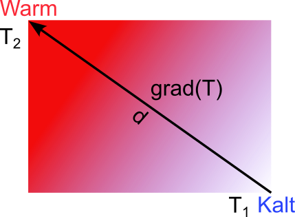

## Nicht-mechanische Eigenschaften
Prof. Dr.-Ing.  Christian Willberg 

Kontakt: christian.willberg@h2.de
Teile des Skripts sind von \
Prof. Dr.-Ing. Jürgen Häberle übernommen

---

## Inhalte

---

<!--paginate: true-->

## Werkstoffeigenschaften

Was sind Werkstoffeigenschaften?

---

## Symmetrien
- isotropie
- transversale isotropie
- orthotropie
- ...
- anisotropie

<!---
- Diskussion; Eigenschaften können richtungsabhängig sein
- Praxisbeispiele
-->

---

## Mechanische Eigenschaften

- die **reversible** Verformung, bei der sofort bzw. eine bestimmte Zeit nach dem Einwirken der äußeren Belastung der verformte Werkstoff seine ursprüngliche Form zurückerhält: elastische und viskoelastische Verformung;

- die **irreversible (bleibende)** Verformung, bei der die Formänderung auch nach dem Einwirken der äußeren Belastung erhalten bleibt: plastische und viskose Verformung;

- der Bruch, d.h. eine durch Entstehen und Ausbreiten von Rissen bewirkte Trennung des Werkstoffes.

---

## Elastizität
- reversibel, energieerhaltend
- Hooksches Gesetz 1D
Normalspannung $\sigma = E\varepsilon$
Schubspannung $\tau = G\gamma$

---
# Thermische Eigenschaften 

---

## Wärmedehnung

$\boldsymbol{\varepsilon}_{thermisch}=-\boldsymbol{\alpha}\Delta T$

_Wärmeausdehnungskoeffizientenmatrix_

$\boldsymbol{\alpha} = 
\begin{bmatrix}
\alpha_{11} & \alpha_{12} & \alpha_{13} \\
\alpha_{12} & \alpha_{22} & \alpha_{23} \\
\alpha_{13} & \alpha_{23} & \alpha_{33}
\end{bmatrix}
$

**1D oder isotrop**
$\varepsilon_{thermisch}=-\alpha\Delta T$

>Beispiel -> Paraview

---

| Symmetrie | Modell | Beispiele |
|---|---|---|
| Isotropie | $\alpha_{11}=\alpha_{22}=\alpha_{33}$ und $\alpha_{12}=\alpha_{13}=\alpha_{23}=0$ | Metalle, Kunststoffe|
| transversale Isotropie | $\alpha_{22}=\alpha_{33}$ und $\alpha_{12}=\alpha_{13}=\alpha_{23}=0$| Einzellage Faserverbund |
| Orthotropie Isotropie | $\alpha_{12}=\alpha_{13}=\alpha_{23}=0$| Mehrlagiger Faserverbund |
| Anisotropie | beliebige $\alpha_{ij}$ | homogenisierte Betrachtung eines unysmmetrischen Mehrlagen-Verbunds |

---

## Anwendungen 
- Bi-Metall Streifen
- Brücken
- Schienen
- Hochpräzisionsmessgeräten
- Schweißen, Löten, etc.
- ...

Kann u.a. zu thermischen Eigenspannungen, Verzug führen. 

---

## Beispiel: Thermische Spannungen 1D

$\sigma = E \varepsilon = E (\varepsilon_{mechanisch}+\varepsilon_{thermisch})= E (\varepsilon_{mechanisch}-\alpha\Delta T)$

>Durch eine Vordehung kann die Belastung auf ein Bauteil reduziert werden

## Beispiel: Thermische Längenänderung 1D
$\Delta l = l_0 \varepsilon_{mechanisch}$
>Für freie eine Dehnung, d.h. es wirken keine Spannungen

$0 = E \varepsilon = E (\varepsilon_{mechanisch}+\varepsilon_{thermisch})= E (\varepsilon_{mechanisch}-\alpha\Delta T)$
$\varepsilon_{mechanisch}=\alpha\Delta T$
$\Delta l = l_0 \varepsilon_{thermisch} = l_0\alpha\Delta T$

---
## Wärmeleitung
- auch Konduktion und Wärmediffusion
- $T_{hoch}\rightarrow T_{niedrig}$ (2. Hauptsatz der Thermodynamik). 
- es geht keine Wärme aufgrund der Energieerhaltung (1. Hauptsatz) verloren.

**Wärmestrom $[W]$**
$\dot{\mathbf{q}}=-\boldsymbol{\lambda}\text{grad}(T)$

- $\text{grad}(T)$ ist der Gradient der Temperaturänderung $\frac{\partial T}{\partial dx_i}$; 
- im linearen Fall $\text{grad}(T)=\Delta T / d = \frac{T_2-T_1}{d}$

---

$\dot{\mathbf{q}}=-\boldsymbol{\lambda}\text{grad}(T)$

$\dot{\mathbf{q}} = \frac{\partial \mathbf{q}}{\partial t}$
- zeigt an das sich etwas ändert -> $dt$

$\boldsymbol{\lambda}=\begin{bmatrix}
\lambda_{11} & 0 & 0 \\
0 & \lambda_{22} & 0 \\
0 & 0 & \lambda_{33}
\end{bmatrix}$
ist die Matrix der Wärmeleitfähigkeit.
**Sonderfälle**
- wenn $T_1$ = $T_2$ gibt es keine Leitung
- wenn $\boldsymbol{\lambda}=0$; perfekte Isolation und keine Wärmeleitung

---

| Symmetrie | Modell | Beispiele |
|---|---|---|
| Isotropie | $\lambda_{11}=\lambda_{22}=\lambda_{33}$ | Metalle, Kunststoffe|
| transversale Isotropie  | $\lambda_{22}=\lambda_{33}$ | Einzellage Faserverbund |
| Anisotropie | beliebige $\lambda_{ij}$ | Mehrlagen Faserverbund |

>Beispiel -> Paraview

---

## Wärmeübergang

Übertragung der Wärme von einem Festkörper in ein Fluid oder Gas. 

>Wichtig, wenn Maschinen gekühlt oder erwärmt werden sollen. 

Wird durch den Wärmeübergangskoeffizient beschrieben $\alpha_{Übergang}$. Er hängt unter anderem  von der spezifischen Wärmekapazität, der Dichte und dem Wärmeleitkoeffizienten des wärmeabführenden sowie des wärmeliefernden Mediums ab.

$\dot{q}=\alpha_{Übergang}A\Delta T$

>Beispiel Wärmepumpe und Fußbodenheizung

---

## Spezifische Wärmekapazität

sagt aus wieviel Energie in Form von Wärme in einen Stoff "stecken" muss, um die Temperatur zu erhöhen.

$C_p=\frac{\Delta q}{m \Delta T}$

---

## Wärmestrahlung

$\dot{q}=\epsilon_{Emissionsgrad}\sigma_{Stefan-Boltzmann}AT^4$

Emissiongrad $\epsilon_{Emissionsgrad}$ liegt zwischen 0 (perfekter Spiegel) und 1 (idealer Schwarzer Körper) und ist in Teilen materialabhängig.

>nutzbar für Spektralanalysen, um die Zusammensetzung von Werkstoffen zu bestimmen. 

---

# Spezielle Temperaturen

## Phasenübergangstemperatur
Temperatur wo ein Phasenübergang in einer Kristallstruktur stattfindet (siehe [Phasendiagramme](@ref "Phasendiagamme")). Wird maßgeblich durch beigesetzte Stoffe beeinflusst (siehe [Legierungen](@ref "Legierungen"))

## Schmelztemperatur
Als Schmelztemperatur bezeichnet man die Temperatur, bei der ein Stoff vom festen in den flüssigen Aggregatzustand übergeht. 

---

## Siedetemperatur

Temperatur des Phasenübergangs von flüssig zu gasförmig. Für Schmierstoffe ggf. relevant.

## Curie Temperatur
Nach Piere Curie benannt. [Bezeichnet](https://de.wikipedia.org/wiki/Curie-Temperatur) die Temperatur, bei deren Erreichen ferromagnetische bzw. ferroelektrische Eigenschaften eines Materials vollständig verschwunden sind, so dass sie oberhalb nur noch paramagnetisch bzw. paraelektrisch sind. 

---

## Eigenspannungen
- Thermisch
- Verformung
- Gefügeumwandlung
- Chemisch

> Positive Beispiele: ??
> Negative Beispiele: ??

---

# Elektrische und magnetische Eigenschaften

Die elektrischen und magnetischen Eigeschaften hängen in der Regel eng zusammen und beeinflussen sich gegenseitig. 

---

## Permittivität

- beschreibt wie stark die innere Struktur der äußeren Ladung entgegenwirkt

---

- mathematisch Verhältnis zwischen der elektrischen Flussdichte und dem elektrischen Feld. 

$\varepsilon_0$ ist dabei die Permitivität im Vakuum.

$\mathbf{D}=\varepsilon_0 \boldsymbol{\varepsilon}_{Permitivität}\mathbf{E}$

$\boldsymbol{\varepsilon}_{Permitivität} = \begin{bmatrix}
\varepsilon_{11} & \varepsilon_{12} & \varepsilon_{13} \\
\varepsilon_{12} & \varepsilon_{22} & \varepsilon_{23} \\
\varepsilon_{13} & \varepsilon_{23} & \varepsilon_{33}
\end{bmatrix}$

---

Je nach Mikrostruktur ist die Permittivität richtungsabhängig.
| Symmetrie | Modell | 
|---|---|
| Isotropie | $\varepsilon_{11}=\varepsilon_{22}=\varepsilon_{33}$ und $\varepsilon_{12}=\varepsilon_{13}=\varepsilon_{23}=0$ |
| transversale Isotropie | $\varepsilon_{22}=\varepsilon_{33}$ und $\varepsilon_{12}=\varepsilon_{13}=\varepsilon_{23}=0$| 
| Orthotropie Isotropie | $\varepsilon_{12}=\varepsilon_{13}=\varepsilon_{23}=0$| 
| Anisotropie | beliebige $\varepsilon_{ij}$ |

Oft angeben als relative Permittivität

$\varepsilon_r=\frac{\varepsilon_{Permittivität}}{\varepsilon_0}$

---

- Kapazität eines Plattenkondensatorsn

$C=\varepsilon_0 \varepsilon_{r}\frac{A}{d}$

- Eine hohe Permittivität erlaubt stärkere Kondensatoren

---

## Elektrische Leitfähigkeit

- Die Leitfähigkeit eines Stoffes oder Stoffgemisches hängt von der Verfügbarkeit und Dichte beweglicher Ladungsträger ab. 

- In Metallen sind diese in Form von Elektronen sehr locker gebunden. Jedes Material ist in einem Gewissen Maß leitfähig.

---

Einheit $\left[\frac{S}{m}\right.$, $\left.\frac{\Omega}{m}\right]$

$$\mathbf{J}=\sigma_{elektrische\,Leitfähigkeit}\mathbf{E}$$

- Supraleiter besitzt unendliche Leitfähigkeit. 

---

## Elektrischer Widerstand

- Spezialfall konstanter elektrischer Leitfähigkeit entspricht dies dem Ohmschen Gesetz

**Ohmschen Gesetzes**

$$R=\frac{U}{I}=\rho_{spezifisch}\frac{l}{A}$$

- Der spezifische Widerstand $\rho_{spezifisch}$ ist ein Materialkennwert. Er ist temperaturabhängig.
-  wird für Thermoelemente genutzt
---

Leiter - Metalle (Kupfer, Silber, ...), Graphit

$\rho_{spezifisch} < 100 \frac{\Omega mm^2}{m}$

Halbleiter - Silizium, Bor, Selen, ...

$100<\rho_{spezifisch} < 10^{12} \frac{\Omega mm^2}{m}$

Isolator - Aluminiumoxidkeramik, Epoxidharze

$\rho_{spezifisch} > 10^{12} \frac{\Omega mm^2}{m}$

---

## Dotierungen

- Durch Dotierung lässt sich die Leitfähigkeit von Halbleitern stark beeinflussen, oft um mehrere Zehnerpotenzen. 
- hochreines Material ist erforderlich 

n-Dotierung - Zugabe von Elektronendonatoren (überzählige Elektronen)
p-Dotierung - Zugabe von Elektronenakzeptoren

---
- durch p-Dotierung entstehen Elektronenfehlstellen, auch Löcher oder Defektelektronen genannt
-  diese ermöglichen die Leitung des elektrischen Stroms 
- Die Leitfähigkeit entsteht dadurch, dass die Löcher bzw. Elektronen beweglich sind – wenn auch nicht so beweglich wie die Elektronen in Metallen.

---

---

# Magnetismus
## Arten des Magnetismus
**Diamagnetismus**  
Führt zu einer Abschwächung des Magnetfeldes durch die Wirkung der Lenzschen Regel in der Atomhülle (lokal induziertes Magnetfeld wirkt dem äußeren entgegen).  
*Beispiele:* Alle Materialien

---

**Paramagnetismus**  
- Atome, Ionen oder Moleküle besitzen ein magnetisches Moment, das sich nach dem äußeren Magnetfeld ausrichtet und das Magnetfeld verstärkt
- Höhere Temperaturen verringern den Effekt, da sich die Atome, Ionen oder Moleküle stärker bewegen

*Beispiele:* Lithium, Natrium, Metalle der Seltenen Erden (Scandium, Neodym, Holmium)

---

**Ferromagnetismus**  
- die magnetischen Momente  richten sich spontan parallel aus
-  kleinste kristalline Einheit wird als **weissscher Bezirk** bezeichnet
- der Effekt kann durch die Curie-Temperatur zerstört werden

*Beispiele:* Eisen, Nickel, Alnico (Eisen-, Aluminium-, Nickel-, Kobalt-, Kupferlegierungen)

---

**Ferrimagnetismus**  
- die magnetischen Momente der Atome mikroskopisch wechselweise antiparallel ausgerichtet und löschen sich nicht vollständig aus
-  wirkt wie eine abgeschwächte Form des Ferromagnetismus

*Beispiele:* Nickel, Kupfer, Magnesium

---

**Antiferromagnetismus**  
- ähnlich dem Ferrimagnetismus, jedoch löschen sich die antiparallelen magnetischen Pole vollständig gegenseitig aus
-  idealer Antiferromagnet zeigt nach außen kein magnetisches Verhalten
- bei Erhitzung über die Néel-Temperatur wird das Material paramagnetisch

*Beispiele:* Einige Nickelverbindungen, Chrom

---

## Permeabilität

Ist das Verhältnis zwischen magnetischer Flussdichte und magnetischer Feldstärke.

$\mathbf{B}=\mu_0 \boldsymbol{\mu}\mathbf{H}$

Ähnelt der Permittivität. Auch hier gibt es eine Konstante, die magnetische Feldkonstante $\mu_0$, welche die Permeabilität im Vakuum beschreibt.

Im Allgemeinen gilt

$\boldsymbol{\mu} = \begin{bmatrix}
\mu_{11} & \mu_{12} & \mu_{13} \\
\mu_{12} & \mu_{22} & \mu_{23} \\
\mu_{13} & \mu_{23} & \mu_{33}
\end{bmatrix}$

Die relative Permeabilität 

$\mu_r=\frac{\mu}{\mu_0}$

---

Diamagnetische Stoffe  $0\leq \mu_{r}<1$

Paramagnetische Stoffe $\mu_{r}>1$

Superparamagnetische Stoffe  $\mu_{r}\gg 1$

Ferrimagnetische Stoffe $20\lessapprox \mu_{r} \lessapprox 15000$

Ferromagnetische Stoffe  $\mu_{r}\gg 1$; $40 \lessapprox \mu_r \lessapprox 10^6$

Supraleiter 1. Art $\mu_{r} = 0$. 

