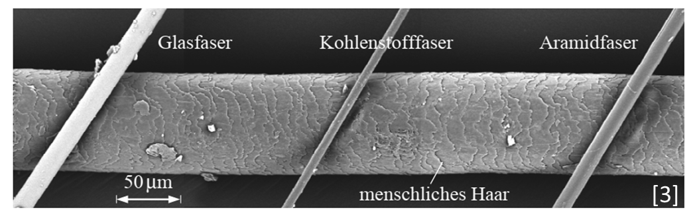

## Vorlesung Werkstofftechnik - Faserverbundwerkstoffe
Prof. Dr.-Ing.  Christian Willberg
Hochschule Magdeburg-Stendal

Kontakt: christian.willberg@h2.de

---

<!--paginate: true-->

---

## Fokus von Industrien

- Luft- und Raumfahrt
  - Gutes Festigkeits/Steifigkeits – Gewichtsverhältnis
  - Schaden-, Korrosionsstoleranz 
  - Wartbarkeit / Reparierbarkeit
- Bauwesen
  - Widerstand gegen Umwelteinflüsse und Korrosion
  - Langlebigkeit

---

- Schifffahrt
  - Salzwasser
  - Schlagschäden
  - Lange Lebendauer
- Landtransportsysteme
  - Kosten
  - Einfache Fertigbarkeit
- Weitere Anwendungen
  - Dichtheit
  - …

---

## Was ist ein Faserkunstoffverbund (FKV)

- Mehrphasen- oder Mischwerkstoff im Allgemeinen bestehend aus zwei Hauptkomponenten (Faser und Matrix)
- Der Gesamtwerkstoff hat höherwertige Eigenschaften als jede der beiden beteiligten Komponenten alleine
- FKV bieten ein spezifisches Eigenschaftsprofil
- Material und seine Eigenschaften entstehen in der Fertigung der Bauteile / Strukturen

---

## Komponenten von Faserkunstoffverbunde 

Matrix – bindende Komponente
Formgebend
Schutz und Stabilisierung der Fasern
Spannungen an die Fasern übertragen
Faser – verstärkende Komponente
Lasttragend da hohe Steifigkeit und/oder Festigkeit bei geringem Gewicht
Begrenzte thermische Dehnung
Weitere Bestandteile (optional)
Faserbeschichtungen
Füllstoffe
Beimischung anderer Fasertypen

---

## Ausgangswerkstoffe - Faser

- Kurzfasern
  - Wirre Anordnung (geringe Anistropie)
  - Oft recyclete Fasern
- Langfasern
  - Mehrere Millimeter Länge
  - Geringere Anforderung bei Verarbeitung und Lagerung
- Endlosfasern
  - Hohe Festigkeiten und Steifigkeiten
  - Höhere Anforderung bei Verarbeitung und Lagerung

---
## Ausgangswerkstoffe - Faser

- Naturfasern: Haare, Wolle, Seide, Baumwolle, Flachs, Sisal, Hanf, Jute, Ramie, Bananenfasern ...
- Organische Fasern: Polyethylen (PE), Polypropylen (PP), Polyamid (PA), Polyester (PES), Polyacrylnitril (PAN), Aramid, Kohlenstoff ...
- Anorganische Fasern: Glas, Basalt, Quarz, SiC, Al2O3, Bor, ...
- Metallfasern aus: Stahl, Aluminium, Kupfer, Nickel, Beryllium, Wolfram ... 

---

## Glasfaser

**Vorteile**
hohe Längs-Zug- sowie die hohe Längs-Druckfestigkeit
Eine hohe Bruchdehnung
aufgrund der niedrigen Fasersteifigkeit gute Drapierbarkeit, auch um enge Radien
die vollkommene Unbrennbarkeit
die sehr geringe Feuchtigkeitsaufnahme

---

## Glasfaser

**Vorteile**

die gute chemische und mikrobiologische Widerstandsfähigkeit. 
Kosten
**Nachteile**
der für viele Strukturbauteile zu niedrige Elastizitätsmodul der Glasfaser
Glasfasern sind unverrottbar (Vor- und Nachteil)

---

## Kohlefaser (C-Faser)

**Vorteil**
C-Fasern sind sehr leicht, ihre Dichte ($\rho_𝑓 \approx 1.8 g/cm^3$) liegt deutlich unter derjenigen von Glasfasern ($\rho_𝑓 \approx 2.54 g/cm^3$). 
extrem hohe Festigkeiten und sehr hohe Elastizitätsmoduln
beide mechanischen Größen sind zudem in weiten Bereichen bei der Herstellung der Fasern einstellbar
Exzellente Ermüdungsfestigkeit

---

**Nachteile**
Geringere Druckfestigkeit in Faserrichtung
Schlechtere Drapierbarkeit
Kosten
Elastizitätsmoduln in Faserlängs- und Querrichtung unterscheiden sich um eine Größenordnung (Vor- und Nachteil)

---

---